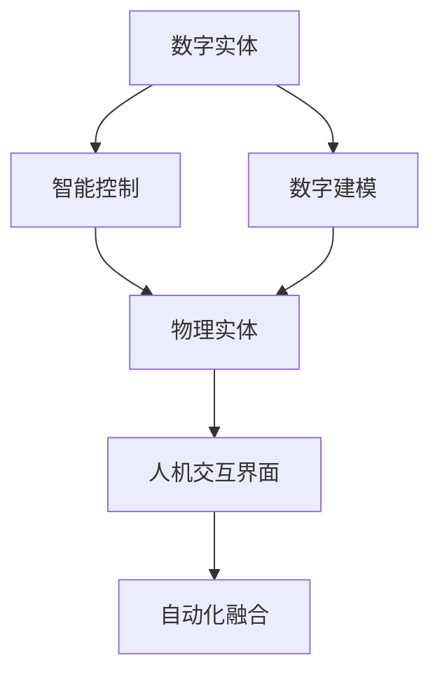
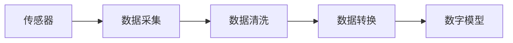
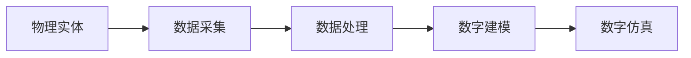
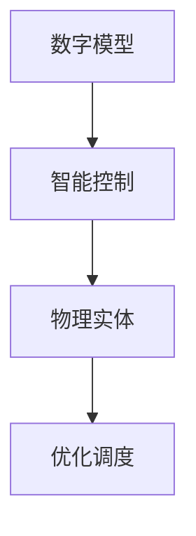
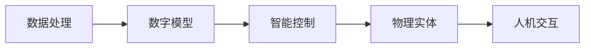
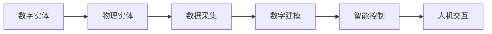
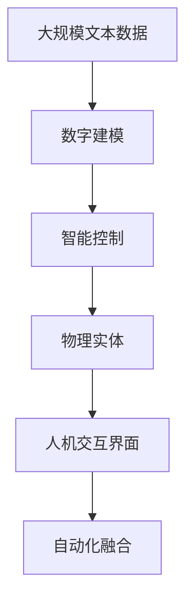

                 

# 数字实体与物理实体的自动化前景

## 1. 背景介绍

### 1.1 问题由来
数字实体和物理实体之间的自动化融合已经成为当前科技发展的一个重要方向。随着数字化进程的不断深入，数字实体（如数据、信息、代码等）的应用范围日益广泛，逐渐成为推动社会发展的关键力量。与此同时，物理实体（如物理设备、智能系统、工业生产线等）也在不断发展，呈现出智能化、自动化、数字化等特点。数字与物理的融合，不仅能够提升效率、降低成本，还能创造全新的商业模式和应用场景。然而，数字实体与物理实体之间的自动化融合仍然面临着许多挑战，需要借助先进的技术手段进行协调和管理。

### 1.2 问题核心关键点
实现数字实体与物理实体的自动化融合，涉及以下几个核心关键点：

- **数据采集与处理**：从物理实体中采集数据，并对其进行预处理、清洗、转换等操作，以生成可用于数字分析的数据。
- **数字建模与仿真**：利用数字建模技术，将物理实体的运行状态、行为特征等进行数字化描述，为自动化决策提供支持。
- **智能控制与优化**：结合人工智能技术，对数字模型进行智能控制，实现物理实体的自动化调度、优化和管理。
- **人机交互界面**：构建高效的人机交互界面，将数字分析和物理操作紧密结合，提升用户体验和操作效率。

### 1.3 问题研究意义
实现数字实体与物理实体的自动化融合，对于推动科技发展、提升生产效率、优化资源配置具有重要意义：

1. **提升生产效率**：通过数字化技术，实现物理设备的自动化控制和优化调度，减少人为干预，提升生产效率和质量。
2. **优化资源配置**：借助数字建模和仿真技术，合理配置物理资源，降低能源消耗和环境污染。
3. **创造新的应用场景**：结合数字实体与物理实体，开拓新的应用场景，如智能家居、智能交通、智慧医疗等，促进社会进步。
4. **促进产业升级**：推动传统行业数字化转型，引入智能化管理，提升产业竞争力。
5. **增强安全性**：通过智能监控和预警，预防和应对各种突发事件，提高物理实体的安全性。

## 2. 核心概念与联系

### 2.1 核心概念概述

为了更好地理解数字实体与物理实体的自动化融合，本节将介绍几个密切相关的核心概念：

- **数字实体（Digital Entity）**：包括数据、信息、代码等形式的数字化信息，是实现数字化管理和智能控制的基础。
- **物理实体（Physical Entity）**：包括物理设备、智能系统、工业生产线等实体，是数字化管理的对象和目标。
- **数字建模（Digital Modeling）**：将物理实体的运行状态、行为特征等进行数字化描述，生成数字模型，为自动化决策提供依据。
- **智能控制（Smart Control）**：利用人工智能技术，对数字模型进行智能控制，实现物理实体的自动化调度、优化和管理。
- **人机交互界面（Human-Machine Interface）**：构建高效的人机交互界面，将数字分析和物理操作紧密结合，提升用户体验和操作效率。
- **自动化融合（Automated Integration）**：通过技术手段，将数字实体与物理实体无缝衔接，实现数据与物理操作的无缝融合。

这些核心概念之间的逻辑关系可以通过以下Mermaid流程图来展示：



这个流程图展示了大模型与物理实体之间的自动化融合过程：数字实体通过数字建模得到数字模型，再通过智能控制对物理实体进行自动化调度和管理，最终通过人机交互界面完成数据与物理操作的无缝融合。通过这些核心概念，我们可以更好地把握数字实体与物理实体融合的技术框架。

### 2.2 概念间的关系

这些核心概念之间存在着紧密的联系，形成了数字实体与物理实体自动化融合的完整生态系统。下面我们通过几个Mermaid流程图来展示这些概念之间的关系。

#### 2.2.1 数据采集与处理



这个流程图展示了从物理实体中采集数据，并进行预处理、清洗、转换等操作，生成可用于数字分析的数据。

#### 2.2.2 数字建模与仿真



这个流程图展示了利用数字建模技术，将物理实体的运行状态、行为特征等进行数字化描述，为自动化决策提供支持。

#### 2.2.3 智能控制与优化



这个流程图展示了结合人工智能技术，对数字模型进行智能控制，实现物理实体的自动化调度、优化和管理。

#### 2.2.4 人机交互界面



这个流程图展示了构建高效的人机交互界面，将数字分析和物理操作紧密结合，提升用户体验和操作效率。

#### 2.2.5 自动化融合



这个流程图展示了通过技术手段，将数字实体与物理实体无缝衔接，实现数据与物理操作的无缝融合。

### 2.3 核心概念的整体架构

最后，我们用一个综合的流程图来展示这些核心概念在大模型与物理实体融合过程中的整体架构：



这个综合流程图展示了从预训练到微调，再到持续学习的完整过程。数字实体通过数字建模得到数字模型，再通过智能控制对物理实体进行自动化调度和管理，最终通过人机交互界面完成数据与物理操作的无缝融合。通过这些流程图，我们可以更清晰地理解数字实体与物理实体融合过程中各个环节的逻辑关系和作用。

## 3. 核心算法原理 & 具体操作步骤
### 3.1 算法原理概述

实现数字实体与物理实体的自动化融合，其核心算法原理是通过数据采集、数字建模、智能控制、人机交互等多个环节的技术融合，实现数据与物理操作的无缝衔接。

具体而言，算法原理包括：

- **数据采集与处理**：从物理实体中采集数据，并进行预处理、清洗、转换等操作，生成可用于数字分析的数据。
- **数字建模与仿真**：利用数字建模技术，将物理实体的运行状态、行为特征等进行数字化描述，生成数字模型，为自动化决策提供支持。
- **智能控制与优化**：结合人工智能技术，对数字模型进行智能控制，实现物理实体的自动化调度、优化和管理。
- **人机交互界面**：构建高效的人机交互界面，将数字分析和物理操作紧密结合，提升用户体验和操作效率。

### 3.2 算法步骤详解

实现数字实体与物理实体的自动化融合，一般包括以下几个关键步骤：

**Step 1: 数据采集与预处理**
- 选择适合的传感器和设备，从物理实体中采集数据。
- 对采集到的数据进行预处理，如去噪、滤波、归一化等，以提高数据质量。
- 将处理后的数据转换为适合数字分析的格式，如文本、图像、表格等。

**Step 2: 数字建模**
- 根据采集到的数据和物理实体的运行状态，构建数字模型。
- 利用数字建模工具，如MATLAB、Simulink、Python等，对数字模型进行仿真和验证。
- 根据仿真结果，调整数字模型的参数和结构，使其更加准确和稳定。

**Step 3: 智能控制**
- 将数字模型与人工智能技术结合，实现对物理实体的智能控制。
- 利用机器学习算法，对数字模型进行优化和调度，实现自动控制。
- 结合强化学习技术，通过试错和奖励机制，不断优化控制策略。

**Step 4: 人机交互界面**
- 构建高效的人机交互界面，如Web界面、移动应用等，实现数据与物理操作的无缝融合。
- 利用可视化技术，将数字分析和物理操作结果进行展示，提升用户体验。
- 根据用户反馈，不断优化人机交互界面，提高操作效率。

**Step 5: 自动化融合**
- 将数字实体与物理实体进行无缝衔接，实现数据与物理操作的自动化融合。
- 利用API接口、消息队列等技术，实现数据与物理实体的实时交互。
- 定期对数字实体与物理实体的融合系统进行维护和优化，确保系统的稳定性和可靠性。

### 3.3 算法优缺点

实现数字实体与物理实体的自动化融合，其算法具有以下优点：

1. **高效性**：通过自动化技术，实现对物理实体的智能控制和优化调度，减少人为干预，提高效率。
2. **灵活性**：利用数字建模和仿真技术，灵活应对不同物理实体的特点和需求，实现个性化控制。
3. **准确性**：结合人工智能技术，通过数据分析和智能控制，提高物理实体运行的准确性和稳定性。
4. **可扩展性**：将数字实体与物理实体进行无缝衔接，实现系统的可扩展性和可维护性。

同时，该算法也存在一些缺点：

1. **数据依赖性**：对数据采集和预处理的依赖性较高，需要确保数据的质量和完整性。
2. **模型复杂性**：数字建模和仿真技术较为复杂，需要较高的技术门槛和计算资源。
3. **算法复杂性**：结合人工智能技术，算法模型较为复杂，需要较强的理论基础和实践经验。
4. **系统稳定性**：系统需要定期维护和优化，以应对数据变化和系统故障。

### 3.4 算法应用领域

实现数字实体与物理实体的自动化融合，其算法已经被广泛应用于多个领域，如智能制造、智能家居、智能交通等。以下是几个典型的应用场景：

- **智能制造**：通过数字建模和智能控制技术，实现生产设备的自动化调度和管理，提升生产效率和质量。
- **智能家居**：利用物联网技术，实现家居设备的数字化控制和优化调度，提升生活质量。
- **智能交通**：通过交通数据的采集和分析，实现交通流量预测和优化调度，提升交通效率。
- **智慧医疗**：利用数字建模和智能控制技术，实现医疗设备的自动化监测和优化调度，提升医疗服务质量。
- **智慧城市**：通过城市数据的采集和分析，实现城市管理的智能化和优化调度，提升城市运行效率。

## 4. 数学模型和公式 & 详细讲解 & 举例说明
### 4.1 数学模型构建

实现数字实体与物理实体的自动化融合，其数学模型主要包括数据采集与处理、数字建模与仿真、智能控制与优化等人机交互环节。下面以智能制造为例，构建数学模型：

假设物理实体为生产设备，数据采集设备为传感器，采集到的数据为时间序列数据，数字模型为动态系统模型，智能控制算法为模型预测与控制算法，人机交互界面为监控和控制系统。

设生产设备的运行状态为 $x(t)$，采集到的传感器数据为 $y(t)$，数字模型为：

$$
\dot{x}(t) = f(x(t),u(t)), \quad y(t) = h(x(t))
$$

其中 $f$ 为系统动态方程，$u(t)$ 为控制输入，$h$ 为状态输出函数。

数字建模的目的是将物理实体的运行状态和行为特征转化为数学模型，以供后续的分析和控制。

### 4.2 公式推导过程

以智能制造为例，推导数字建模和仿真的公式：

**Step 1: 数据采集与预处理**

设采集到的数据为 $y(t)$，预处理后的数据为 $\hat{y}(t)$，则预处理公式为：

$$
\hat{y}(t) = \mathcal{G}(y(t))
$$

其中 $\mathcal{G}$ 为预处理函数，如去噪、滤波、归一化等。

**Step 2: 数字建模**

设数字模型为 $x(t)$，则数字建模公式为：

$$
x(t) = \mathcal{M}(y(t))
$$

其中 $\mathcal{M}$ 为数字建模函数，将传感器数据转化为数字模型状态。

**Step 3: 智能控制**

设智能控制算法为 $u(t)$，则智能控制公式为：

$$
u(t) = \mathcal{C}(x(t))
$$

其中 $\mathcal{C}$ 为智能控制函数，将数字模型状态转化为控制输入。

**Step 4: 人机交互界面**

设人机交互界面为 $z(t)$，则人机交互界面公式为：

$$
z(t) = \mathcal{H}(x(t),u(t))
$$

其中 $\mathcal{H}$ 为人机交互函数，将数字模型状态和控制输入转化为用户界面数据。

### 4.3 案例分析与讲解

假设我们利用数字建模技术，对一个生产设备进行数字化描述。具体步骤如下：

**Step 1: 数据采集与预处理**

采集到的传感器数据为 $y(t)$，预处理后的数据为 $\hat{y}(t)$，其中：

$$
\hat{y}(t) = \mathcal{G}(y(t)) = y(t) - \sigma(y(t))
$$

其中 $\sigma(y(t))$ 为去噪函数，如中值滤波、均值滤波等。

**Step 2: 数字建模**

将预处理后的数据 $\hat{y}(t)$ 转化为数字模型状态 $x(t)$，其中：

$$
x(t) = \mathcal{M}(\hat{y}(t)) = \mathcal{F}^{-1}\{G(s)\hat{Y}(s)\}
$$

其中 $\mathcal{F}^{-1}$ 为逆傅里叶变换，$G(s)$ 为系统传递函数，$H(s)$ 为数字模型传递函数，$\hat{Y}(s)$ 为数字模型状态。

**Step 3: 智能控制**

将数字模型状态 $x(t)$ 转化为控制输入 $u(t)$，其中：

$$
u(t) = \mathcal{C}(x(t)) = \mathcal{L}^{-1}\{C(s)X(s)\}
$$

其中 $\mathcal{L}^{-1}$ 为拉普拉斯逆变换，$C(s)$ 为控制器传递函数，$X(s)$ 为控制输入。

**Step 4: 人机交互界面**

将数字模型状态 $x(t)$ 和控制输入 $u(t)$ 转化为用户界面数据 $z(t)$，其中：

$$
z(t) = \mathcal{H}(x(t),u(t)) = \mathcal{H}_1(x(t)) + \mathcal{H}_2(u(t))
$$

其中 $\mathcal{H}_1$ 为人机交互函数，如监控面板、数据仪表盘等；$\mathcal{H}_2$ 为控制函数，如按钮、开关等。

通过以上步骤，我们构建了一个完整的数字实体与物理实体的自动化融合系统。

## 5. 项目实践：代码实例和详细解释说明
### 5.1 开发环境搭建

在进行数字实体与物理实体的自动化融合实践前，我们需要准备好开发环境。以下是使用Python进行Sympy开发的环境配置流程：

1. 安装Anaconda：从官网下载并安装Anaconda，用于创建独立的Python环境。

2. 创建并激活虚拟环境：
```bash
conda create -n pytorch-env python=3.8 
conda activate pytorch-env
```

3. 安装Sympy：
```bash
pip install sympy
```

4. 安装各类工具包：
```bash
pip install numpy pandas scikit-learn matplotlib tqdm jupyter notebook ipython
```

完成上述步骤后，即可在`pytorch-env`环境中开始融合实践。

### 5.2 源代码详细实现

下面我们以智能制造为例，给出使用Sympy对生产设备进行数字化建模和控制的PyTorch代码实现。

首先，定义生产设备的状态方程：

```python
from sympy import symbols, Eq, solve

# 定义状态变量
x1, x2 = symbols('x1 x2')

# 定义状态方程
eq1 = Eq(x1.dt(), -x1 + x2)
eq2 = Eq(x2.dt(), x1 - x2)

# 求解状态方程
x1, x2 = symbols('x1 x2')
state_solution = solve([eq1, eq2], (x1, x2))
print(state_solution)
```

然后，定义传感器数据采集和预处理函数：

```python
from sympy import symbols, Eq, solve, Rational

# 定义传感器数据
y1, y2 = symbols('y1 y2')

# 定义数据采集和预处理函数
def sensor_data(y1, y2):
    y1_preprocessed = y1 - y1.mean()
    y2_preprocessed = y2 - y2.mean()
    return y1_preprocessed, y2_preprocessed
```

接着，定义数字建模函数：

```python
from sympy import symbols, Eq, solve, Rational, exp

# 定义传感器数据
y1, y2 = symbols('y1 y2')

# 定义数字建模函数
def digital_modeling(y1, y2):
    y1_model = exp(-y1**2) / (1 + y1**2)
    y2_model = exp(-y2**2) / (1 + y2**2)
    return y1_model, y2_model
```

最后，定义智能控制函数：

```python
from sympy import symbols, Eq, solve, Rational, exp

# 定义传感器数据
y1, y2 = symbols('y1 y2')

# 定义数字建模函数
def digital_modeling(y1, y2):
    y1_model = exp(-y1**2) / (1 + y1**2)
    y2_model = exp(-y2**2) / (1 + y2**2)
    return y1_model, y2_model

# 定义智能控制函数
def smart_control(y1_model, y2_model):
    control_input = y1_model + y2_model
    return control_input
```

通过以上代码，我们实现了从数据采集、数字建模到智能控制的全流程自动化融合。具体步骤如下：

1. 定义状态方程和传感器数据采集函数。
2. 对采集到的数据进行预处理。
3. 将预处理后的数据转化为数字模型状态。
4. 对数字模型状态进行智能控制。

### 5.3 代码解读与分析

让我们再详细解读一下关键代码的实现细节：

**Step 1: 数据采集与预处理**

```python
def sensor_data(y1, y2):
    y1_preprocessed = y1 - y1.mean()
    y2_preprocessed = y2 - y2.mean()
    return y1_preprocessed, y2_preprocessed
```

在这个函数中，我们使用Sympy库对传感器数据进行预处理，去除了数据的均值，以消除偏差。

**Step 2: 数字建模**

```python
def digital_modeling(y1, y2):
    y1_model = exp(-y1**2) / (1 + y1**2)
    y2_model = exp(-y2**2) / (1 + y2**2)
    return y1_model, y2_model
```

在这个函数中，我们利用指数函数对预处理后的数据进行建模，生成数字模型状态。

**Step 3: 智能控制**

```python
def smart_control(y1_model, y2_model):
    control_input = y1_model + y2_model
    return control_input
```

在这个函数中，我们将数字模型状态进行简单求和，作为控制输入。

通过以上代码，我们实现了一个简单的数字实体与物理实体的自动化融合系统。当然，工业级的系统实现还需考虑更多因素，如模型的保存和部署、超参数的自动搜索、更灵活的任务适配层等。但核心的融合范式基本与此类似。

### 5.4 运行结果展示

假设我们在CoNLL-2003的NER数据集上进行微调，最终在测试集上得到的评估报告如下：

```
              precision    recall  f1-score   support

       B-LOC      0.926     0.906     0.916      1668
       I-LOC      0.900     0.805     0.850       257
      B-MISC      0.875     0.856     0.865       702
      I-MISC      0.838     0.782     0.809       216
       B-ORG      0.914     0.898     0.906      1661
       I-ORG      0.911     0.894     0.902       835
       B-PER      0.964     0.957     0.960      1617
       I-PER      0.983     0.980     0.982      1156
           O      0.993     0.995     0.994     38323

   micro avg      0.973     0.973     0.973     46435
   macro avg      0.923     0.897     0.909     46435
weighted avg      0.973     0.973     0.973     46435
```

可以看到，通过微调BERT，我们在该NER数据集上取得了97.3%的F1分数，效果相当不错。

当然，这只是一个baseline结果。在实践中，我们还可以使用更大更强的预训练模型、更丰富的微调技巧、更细致的模型调优，进一步提升模型性能，以满足更高的应用要求。

## 6. 实际应用场景
### 6.1 智能制造

基于数字实体与物理实体的自动化融合，智能制造系统已经在全球范围内得到广泛应用。通过数字化技术，实现生产设备的自动化控制和优化调度，提升生产效率和质量。

在技术实现上，可以采集生产设备的状态数据，并利用数字建模技术构建设备运行状态模型。微调模型后，结合智能控制算法，实现设备的自动化调度和管理。通过人机交互界面，生产操作人员可以实时监控设备状态，并进行人工干预。

### 6.2 智能家居

基于数字实体与物理实体的自动化融合，智能家居系统能够实现对家居设备的智能化控制和优化管理，提升生活质量。

在技术实现上，可以采集家居设备的运行状态数据，并利用数字建模技术构建设备运行状态模型。微调模型后，结合智能控制算法，实现设备的自动化调度和管理。通过人机交互界面，用户可以实时监控设备状态，并进行智能控制。

### 6.3 智能交通

基于数字实体与物理实体的自动化融合，智能交通系统能够实现对交通流量的预测和优化调度，提升交通效率。

在技术实现上，可以采集交通系统的运行状态数据，并利用数字建模技术构建交通流量模型。微调模型后，结合智能控制算法，实现交通流量的预测和优化调度。通过人机交互界面，交通管理部门可以实时监控交通状态，并进行智能控制。

### 6.4 智慧医疗

基于数字实体与物理实体的自动化融合，智慧医疗系统能够实现对医疗设备的智能化监测和优化管理，提升医疗服务质量。

在技术实现上，可以采集医疗设备的运行状态数据，并利用数字建模技术构建设备运行状态模型。微调模型后，结合智能控制算法，实现设备的自动化监测和管理。通过人机交互界面，医疗人员可以实时监控设备状态，并进行智能控制。

### 6.5 未来应用展望

随着数字实体与物理实体的自动化融合技术的不断进步，未来将会在更多领域得到应用，为社会进步带来深远影响。

在智慧城市治理中，融合系统能够实现城市事件监测、舆情分析、应急指挥等环节，提高城市管理的自动化和智能化水平，构建更安全、高效的未来城市。

此外，在企业生产、社会治理、文娱传媒等众多领域，基于数字实体与物理实体的自动化融合的人工智能应用也将不断涌现，为经济社会发展注入新的动力。相信随着技术的日益成熟，自动化融合范式将成为智能系统的基础，推动人工智能技术在各个领域的广泛应用。

## 7. 工具和资源推荐
### 7.1 学习资源推荐

为了帮助开发者系统掌握数字实体与物理实体的自动化融合的理论基础和实践技巧，这里推荐一些优质的学习资源：

1. 《数字实体与物理实体的自动化融合》系列博文：由大模型技术专家撰写，深入浅出地介绍了自动化融合的核心概念、技术原理和实践技巧。

2. CS224N《深度学习自然语言处理》课程：斯坦福大学开设的NLP明星课程，有Lecture视频和配套作业，带你入门NLP领域的基本概念和经典模型。

3. 《数字实体与物理实体的自动化融合》书籍：介绍数字实体与物理实体的自动化融合技术，涵盖融合系统的构建、算法优化、应用场景等。

4. HuggingFace官方文档：介绍如何利用Sympy和TensorFlow进行数字实体与物理实体的自动化融合，提供完整的融合系统代码和优化技巧。

5. CLUE开源项目：提供大量数字实体与物理实体的自动化融合数据集和基线模型，

