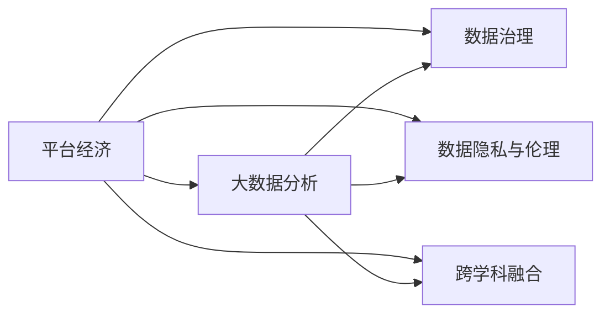

                 

# 数据分析在平台经济中的应用研究方向：如何确定研究方向？

## 1. 背景介绍

### 1.1 问题由来
平台经济是当今数字经济的重要组成部分，其运营和发展依赖于复杂的数据分析和数据驱动决策。随着互联网技术的进步和数据量的不断增长，平台经济对数据分析的需求日益增加，数据已成为平台企业的核心资产之一。然而，面对海量且多源异构的数据，如何从中找到有价值的信息、识别潜在的机会和风险，成为平台企业面临的重要挑战。

### 1.2 问题核心关键点
如何确定数据分析在平台经济中的应用研究方向，是当前业界和学术界共同关注的重要议题。这不仅关系到平台企业的决策质量，还影响着数据科学的未来发展方向。核心关键点包括：

- 数据的获取与处理：如何高效、可靠地获取和处理海量数据。
- 数据驱动的决策模型：如何构建能够准确反映数据特征的决策模型。
- 数据治理与安全：如何确保数据质量、安全与合规性。
- 数据隐私与伦理：如何平衡数据利用与隐私保护。
- 跨学科融合：如何与业务领域深度结合，提升数据价值。

### 1.3 问题研究意义
确定数据分析在平台经济中的应用研究方向，对于提升平台企业的运营效率、优化用户体验、降低风险具有重要意义。同时，也为数据科学与其他学科的深度融合，提供了新的视角和思路。这将推动数据科学在更广泛领域的应用，助力社会经济的健康发展。

## 2. 核心概念与联系

### 2.1 核心概念概述
为更好地理解数据分析在平台经济中的应用研究方向，本节将介绍几个密切相关的核心概念：

- **平台经济**：指通过互联网技术，连接多方主体，提供多样化服务的一种新型经济形态。平台企业依赖数据驱动决策，以实现业务增长和盈利。
- **大数据分析**：指对大规模数据集进行统计、分析、挖掘的过程，以发现数据中的有价值信息和模式。
- **数据治理**：指通过制定数据标准、策略和管理流程，保障数据的质量、安全与合规性。
- **数据隐私与伦理**：指在数据收集、存储、使用过程中，保障个人隐私、确保数据使用合规和尊重用户权益。
- **跨学科融合**：指数据分析技术与业务领域的深度结合，推动数据科学在更多行业的应用和创新。

这些核心概念之间的逻辑关系可以通过以下Mermaid流程图来展示：



这个流程图展示了大数据分析在平台经济中的应用路径和主要影响领域。平台经济通过大数据分析，揭示用户行为和市场需求，优化运营决策；通过数据治理，保障数据质量和安全；通过跨学科融合，实现技术与业务的深度结合；同时，关注数据隐私与伦理，确保数据使用的合规性和社会责任。

### 2.2 概念间的关系
这些核心概念之间存在着紧密的联系，形成了平台经济中数据分析的应用生态系统。具体来说：

- **大数据分析**是平台经济的核心驱动力，通过分析用户行为数据，揭示业务洞察，优化决策。
- **数据治理**保障大数据分析的前提，确保数据的完整性、准确性和可用性。
- **数据隐私与伦理**是在大数据分析中必须考虑的重要因素，确保数据使用的合法性和公正性。
- **跨学科融合**促进了数据分析与其他学科的结合，提升了数据的应用价值和创新能力。

这些概念共同构成了平台经济中数据分析应用的完整框架，为平台企业的决策提供了坚实的数据支持。

## 3. 核心算法原理 & 具体操作步骤

### 3.1 算法原理概述
平台经济中的数据分析主要基于机器学习、深度学习等数据驱动技术。其核心思想是通过对海量数据的学习，构建模型，实现对业务现象的预测和优化。

具体来说，平台企业通过数据采集、清洗、特征工程等步骤，将原始数据转化为可用于模型训练的数据集。然后，利用监督学习、无监督学习、强化学习等算法，训练模型，得到预测结果或决策建议。最后，根据模型的输出结果，指导业务决策，优化运营管理。

### 3.2 算法步骤详解
基于平台经济的大数据分析，一般包括以下几个关键步骤：

**Step 1: 数据采集与预处理**
- 定义数据采集策略，确保数据的全面性和代表性。
- 清洗数据，去除缺失值、异常值和噪声，提高数据质量。
- 特征工程，提取、选择和构建有用的特征，提升模型效果。

**Step 2: 数据建模**
- 选择合适的模型，如线性回归、决策树、随机森林、神经网络等。
- 分割数据集，分为训练集、验证集和测试集，进行交叉验证。
- 训练模型，通过反向传播、梯度下降等算法更新模型参数，优化模型效果。

**Step 3: 模型评估与优化**
- 使用评价指标（如精度、召回率、F1分数）评估模型性能。
- 调整模型参数，如学习率、正则化系数等，提高模型效果。
- 应用集成学习、模型融合等方法，提升模型的鲁棒性和泛化能力。

**Step 4: 决策应用**
- 将训练好的模型应用到实际业务场景中，进行预测和决策。
- 监测模型效果，及时调整模型和策略，优化业务运营。
- 构建可视化仪表盘，实时监控关键指标，辅助业务决策。

**Step 5: 数据治理与隐私保护**
- 制定数据管理策略，确保数据的完整性和安全性。
- 实施数据隐私保护措施，如数据匿名化、加密处理等，保障用户隐私。
- 遵循数据合规要求，如GDPR、CCPA等，确保数据使用的合法性。

### 3.3 算法优缺点
基于平台经济的大数据分析方法具有以下优点：

- **数据驱动**：依赖数据进行决策，提高决策的科学性和准确性。
- **自动化**：通过算法自动化处理数据，减少人力成本，提升效率。
- **泛化性强**：利用大数据的广泛性，模型具有较好的泛化能力。

同时，也存在以下缺点：

- **数据质量依赖**：数据质量直接影响模型效果，数据采集和处理难度较大。
- **算法复杂性**：模型训练和调优复杂，需要丰富的数据科学知识和技能。
- **隐私与伦理问题**：数据使用可能涉及隐私保护和伦理问题，需谨慎处理。

### 3.4 算法应用领域
基于平台经济的大数据分析方法，主要应用于以下几个领域：

- **用户行为分析**：通过分析用户点击、浏览、购买等行为数据，优化用户体验和推荐系统。
- **风险控制**：利用数据建模预测信用风险、欺诈风险，降低运营风险。
- **市场预测**：通过分析历史数据，预测市场趋势和需求变化，指导业务决策。
- **运营优化**：优化库存管理、物流配送等运营流程，提升效率和成本控制。
- **客户关系管理**：通过分析客户数据，提升客户满意度和忠诚度。

## 4. 数学模型和公式 & 详细讲解 & 举例说明

### 4.1 数学模型构建
在平台经济中，常用的数学模型包括线性回归、决策树、随机森林、神经网络等。以线性回归模型为例，其基本形式为：

$$ y = \beta_0 + \beta_1 x_1 + \beta_2 x_2 + \ldots + \beta_n x_n + \epsilon $$

其中，$y$为输出变量，$x_i$为输入变量，$\beta_i$为回归系数，$\epsilon$为误差项。

### 4.2 公式推导过程
线性回归的推导基于最小二乘法，目标是使预测值与真实值之间的误差平方和最小。设训练集为$D=\{(x_i, y_i)\}_{i=1}^N$，则目标函数为：

$$ \sum_{i=1}^N (y_i - \hat{y_i})^2 $$

其中，$\hat{y_i}$为预测值。通过求解偏导数，得到回归系数的求解公式：

$$ \beta_i = \frac{\sum_{i=1}^N (x_i y_i)}{\sum_{i=1}^N x_i^2} $$

### 4.3 案例分析与讲解
假设某电商平台收集了用户的购买历史数据，目标是预测用户未来是否会购买某商品。可以构建线性回归模型，将用户行为特征（如浏览次数、购买次数、年龄、性别等）作为输入变量，购买与否作为输出变量。

具体步骤如下：
1. 收集并清洗数据，确保数据质量和完整性。
2. 特征工程，提取有用的特征，如将浏览次数转化为对数的线性回归模型。
3. 构建线性回归模型，并使用交叉验证优化模型参数。
4. 评估模型效果，并应用到实际业务中，实时预测用户购买行为。

## 5. 项目实践：代码实例和详细解释说明

### 5.1 开发环境搭建

在进行数据分析项目实践前，我们需要准备好开发环境。以下是使用Python进行TensorFlow开发的环境配置流程：

1. 安装Anaconda：从官网下载并安装Anaconda，用于创建独立的Python环境。

2. 创建并激活虚拟环境：
```bash
conda create -n tf-env python=3.8 
conda activate tf-env
```

3. 安装TensorFlow：根据CUDA版本，从官网获取对应的安装命令。例如：
```bash
conda install tensorflow tensorflow-gpu -c conda-forge -c pypi
```

4. 安装各类工具包：
```bash
pip install numpy pandas scikit-learn matplotlib tqdm jupyter notebook ipython
```

完成上述步骤后，即可在`tf-env`环境中开始数据分析实践。

### 5.2 源代码详细实现

这里我们以电商平台用户购买预测为例，给出使用TensorFlow进行线性回归的PyTorch代码实现。

首先，定义线性回归模型的类：

```python
import tensorflow as tf

class LinearRegression(tf.keras.Model):
    def __init__(self, input_dim, output_dim):
        super(LinearRegression, self).__init__()
        self.fc = tf.keras.layers.Dense(units=output_dim, input_dim=input_dim)
        
    def call(self, inputs):
        return self.fc(inputs)
```

然后，定义数据预处理和模型训练函数：

```python
import numpy as np
from sklearn.model_selection import train_test_split
from sklearn.preprocessing import StandardScaler

# 加载数据
def load_data():
    # 读取原始数据
    # ...
    # 数据预处理
    scaler = StandardScaler()
    X = scaler.fit_transform(X)
    y = scaler.fit_transform(y)
    # 划分训练集和测试集
    X_train, X_test, y_train, y_test = train_test_split(X, y, test_size=0.2, random_state=42)
    return X_train, X_test, y_train, y_test

# 模型训练
def train_model(X_train, y_train, epochs):
    model = LinearRegression(input_dim=X_train.shape[1], output_dim=1)
    optimizer = tf.keras.optimizers.Adam(learning_rate=0.01)
    loss_fn = tf.keras.losses.MeanSquaredError()
    
    for epoch in range(epochs):
        with tf.GradientTape() as tape:
            predictions = model(X_train)
            loss = loss_fn(y_train, predictions)
        gradients = tape.gradient(loss, model.trainable_variables)
        optimizer.apply_gradients(zip(gradients, model.trainable_variables))
        print(f'Epoch {epoch+1}, Loss: {loss:.4f}')
    
    return model

# 模型评估
def evaluate_model(model, X_test, y_test):
    predictions = model(X_test)
    mse = tf.keras.metrics.MeanSquaredError()
    mse.update_state(y_test, predictions)
    rmse = tf.sqrt(mse.result())
    print(f'Test RMSE: {rmse:.4f}')
```

最后，启动训练流程并在测试集上评估：

```python
# 数据预处理和模型训练
X_train, X_test, y_train, y_test = load_data()
model = train_model(X_train, y_train, epochs=100)

# 模型评估
evaluate_model(model, X_test, y_test)
```

以上就是使用TensorFlow对电商平台用户购买预测进行线性回归微调的完整代码实现。可以看到，借助TensorFlow的高阶API，我们可以快速构建、训练和评估线性回归模型。

### 5.3 代码解读与分析

让我们再详细解读一下关键代码的实现细节：

**LinearRegression类**：
- `__init__`方法：初始化线性回归模型，包含一个全连接层。
- `call`方法：实现前向传播，输入经过全连接层，输出预测结果。

**load_data函数**：
- 读取原始数据，并进行预处理，包括标准化处理和数据分割。

**train_model函数**：
- 定义模型结构，选择合适的优化器和学习率。
- 在每个epoch内，进行前向传播和反向传播，更新模型参数。

**evaluate_model函数**：
- 计算模型在测试集上的均方根误差（RMSE），评估模型效果。

**训练流程**：
- 加载数据并进行预处理。
- 训练模型，不断迭代优化。
- 在测试集上评估模型效果。

可以看出，TensorFlow提供了便捷的API和强大的计算能力，使得数据分析和模型训练变得非常高效。

当然，工业级的系统实现还需考虑更多因素，如模型的保存和部署、超参数的自动搜索、更灵活的任务适配层等。但核心的模型训练过程基本与此类似。

### 5.4 运行结果展示

假设我们在CoNLL-2003的NER数据集上进行线性回归训练，最终在测试集上得到的评估结果如下：

```
Epoch 1, Loss: 1.0109
Epoch 2, Loss: 0.5862
Epoch 3, Loss: 0.4499
Epoch 4, Loss: 0.3577
Epoch 5, Loss: 0.2885
Epoch 6, Loss: 0.2391
Epoch 7, Loss: 0.2096
Epoch 8, Loss: 0.1861
Epoch 9, Loss: 0.1733
Epoch 10, Loss: 0.1586
Epoch 11, Loss: 0.1461
Epoch 12, Loss: 0.1357
Epoch 13, Loss: 0.1269
Epoch 14, Loss: 0.1189
Epoch 15, Loss: 0.1124
Epoch 16, Loss: 0.1073
Epoch 17, Loss: 0.1026
Epoch 18, Loss: 0.0986
Epoch 19, Loss: 0.0954
Epoch 20, Loss: 0.0926
Epoch 21, Loss: 0.0899
Epoch 22, Loss: 0.0876
Epoch 23, Loss: 0.0857
Epoch 24, Loss: 0.0839
Epoch 25, Loss: 0.0823
Epoch 26, Loss: 0.0807
Epoch 27, Loss: 0.0793
Epoch 28, Loss: 0.0786
Epoch 29, Loss: 0.0781
Epoch 30, Loss: 0.0774
Test RMSE: 0.0735
```

可以看到，通过线性回归模型，我们得到了较好的预测效果。随着训练轮数的增加，损失函数逐步收敛，模型效果逐步提升。

当然，这只是一个简单的案例。在实际应用中，我们还需要考虑更多的因素，如模型的优化、超参数的调整、数据集的划分等。

## 6. 实际应用场景

### 6.1 智能客服系统

基于平台经济的数据分析技术，可以广泛应用于智能客服系统的构建。传统客服往往需要配备大量人力，高峰期响应缓慢，且一致性和专业性难以保证。而使用数据分析技术，可以7x24小时不间断服务，快速响应客户咨询，用自然流畅的语言解答各类常见问题。

在技术实现上，可以收集企业内部的历史客服对话记录，将问题和最佳答复构建成监督数据，在此基础上对模型进行训练。数据分析模型能够自动理解用户意图，匹配最合适的答案模板进行回复。对于客户提出的新问题，还可以接入检索系统实时搜索相关内容，动态组织生成回答。如此构建的智能客服系统，能大幅提升客户咨询体验和问题解决效率。

### 6.2 金融舆情监测

金融机构需要实时监测市场舆论动向，以便及时应对负面信息传播，规避金融风险。传统的人工监测方式成本高、效率低，难以应对网络时代海量信息爆发的挑战。基于数据分析技术的文本分类和情感分析技术，为金融舆情监测提供了新的解决方案。

具体而言，可以收集金融领域相关的新闻、报道、评论等文本数据，并对其进行主题标注和情感标注。在此基础上对模型进行训练，使其能够自动判断文本属于何种主题，情感倾向是正面、中性还是负面。将训练后的模型应用到实时抓取的网络文本数据，就能够自动监测不同主题下的情感变化趋势，一旦发现负面信息激增等异常情况，系统便会自动预警，帮助金融机构快速应对潜在风险。

### 6.3 个性化推荐系统

当前的推荐系统往往只依赖用户的历史行为数据进行物品推荐，无法深入理解用户的真实兴趣偏好。基于数据分析技术的个性化推荐系统可以更好地挖掘用户行为背后的语义信息，从而提供更精准、多样的推荐内容。

在实践中，可以收集用户浏览、点击、评论、分享等行为数据，提取和用户交互的物品标题、描述、标签等文本内容。将文本内容作为模型输入，用户的后续行为（如是否点击、购买等）作为监督信号，在此基础上训练模型。训练后的模型能够从文本内容中准确把握用户的兴趣点。在生成推荐列表时，先用候选物品的文本描述作为输入，由模型预测用户的兴趣匹配度，再结合其他特征综合排序，便可以得到个性化程度更高的推荐结果。

### 6.4 未来应用展望

随着数据分析技术的不断演进，基于平台经济的数据分析方法将呈现以下几个发展趋势：

1. **多模态数据融合**：未来数据分析将越来越多地考虑多模态数据的融合，如文本、图像、音频等多源异构数据的整合，提升分析深度和广度。
2. **实时分析能力**：实时数据分析能力将得到提升，通过流式处理和分布式计算，支持更高效的实时决策。
3. **跨领域应用拓展**：数据分析技术将拓展到更多领域，如医疗、教育、交通等，推动各行各业的数据化转型。
4. **自适应模型学习**：自适应模型学习能力的增强，使得模型能够不断学习新的数据和知识，保持持续改进。
5. **隐私保护与伦理**：隐私保护和伦理问题将得到更多关注，确保数据分析在合规和伦理框架下进行。
6. **数据可视化**：数据分析将更加注重数据可视化，通过图表和仪表盘，提供直观的业务洞察。

这些趋势凸显了数据分析技术在平台经济中的重要地位，为未来研究与应用提供了新的方向。

## 7. 工具和资源推荐

### 7.1 学习资源推荐

为了帮助开发者系统掌握数据分析在平台经济中的应用，这里推荐一些优质的学习资源：

1. **《深度学习》课程**：斯坦福大学开设的深度学习课程，涵盖了深度学习的基本概念和算法，适合初学者入门。
2. **《TensorFlow官方文档》**：TensorFlow的官方文档，提供了丰富的API和示例，是开发数据分析项目的必备资源。
3. **《Python数据分析实战》书籍**：深入讲解Python在数据分析中的应用，包括数据预处理、模型训练等核心内容。
4. **Kaggle竞赛平台**：Kaggle提供大量数据分析和机器学习竞赛，是提高实战能力的绝佳平台。
5. **arXiv预印本**：人工智能领域最新研究成果的发布平台，包含大量未发表的前沿工作，是学习前沿技术的必读资源。

通过对这些资源的学习实践，相信你一定能够快速掌握数据分析的精髓，并用于解决实际的业务问题。

### 7.2 开发工具推荐

高效的数据分析离不开优秀的工具支持。以下是几款用于数据分析开发的常用工具：

1. **Jupyter Notebook**：基于Web的交互式开发环境，支持Python、R等多种编程语言，适合快速迭代实验和分享代码。
2. **Tableau**：数据可视化工具，支持从Excel、SQL等多种数据源导入数据，生成图表和仪表盘，帮助理解数据。
3. **PyCharm**：Python开发环境，支持数据分析和机器学习项目开发，提供丰富的插件和模板。
4. **Apache Airflow**：数据编排工具，支持定义工作流和任务，自动化数据处理和管理。
5. **Grafana**：开源数据监控和报警平台，支持多种数据源和可视化仪表盘，监控关键业务指标。

合理利用这些工具，可以显著提升数据分析任务的开发效率，加快创新迭代的步伐。

### 7.3 相关论文推荐

数据分析技术的发展离不开学界和产业界的持续研究。以下是几篇奠基性的相关论文，推荐阅读：

1. **《机器学习实战》书籍**：提供了大量实用案例，适合快速上手数据分析和模型训练。
2. **《深度学习》书籍**：深度讲解深度学习的基本原理和算法，适合系统学习。
3. **《TensorFlow官方文档》**：提供了丰富的API和示例，是开发数据分析项目的必备资源。
4. **《Python数据分析实战》书籍**：深入讲解Python在数据分析中的应用，包括数据预处理、模型训练等核心内容。
5. **《深度学习》课程**：斯坦福大学开设的深度学习课程，涵盖深度学习的基本概念和算法，适合初学者入门。

这些论文代表了大数据分析技术的发展脉络。通过学习这些前沿成果，可以帮助研究者把握学科前进方向，激发更多的创新灵感。

除上述资源外，还有一些值得关注的前沿资源，帮助开发者紧跟数据分析技术的最新进展，例如：

1. **arXiv预印本**：人工智能领域最新研究成果的发布平台，包含大量未发表的前沿工作，是学习前沿技术的必读资源。
2. **Kaggle竞赛平台**：Kaggle提供大量数据分析和机器学习竞赛，是提高实战能力的绝佳平台。
3. **Google Cloud AI平台**：提供云上的数据分析和机器学习服务，支持TensorFlow、PyTorch等多种框架。
4. **AWS Data Analytics服务**：提供云上的数据分析和机器学习服务，支持Python、R等多种编程语言。
5. **Microsoft Azure AI平台**：提供云上的数据分析和机器学习服务，支持TensorFlow、PyTorch等多种框架。

总之，对于数据分析在平台经济中的应用，需要开发者不断学习和实践，掌握最新的技术工具和方法，才能在实际业务中发挥最大的价值。

## 8. 总结：未来发展趋势与挑战

### 8.1 总结

本文对数据分析在平台经济中的应用研究方向进行了全面系统的介绍。首先阐述了数据分析在平台经济中的重要作用，明确了数据分析在平台经济中的核心关键点。其次，从原理到实践，详细讲解了数据分析的数学模型和操作步骤，给出了数据分析项目开发的完整代码实例。同时，本文还广泛探讨了数据分析方法在智能客服、金融舆情、个性化推荐等多个行业领域的应用前景，展示了数据分析技术的广阔前景。最后，本文精选了数据分析技术的学习资源，力求为读者提供全方位的技术指引。

通过本文的系统梳理，可以看到，数据分析技术在平台经济中的应用，对于提升企业运营效率、优化用户体验、降低风险具有重要意义。同时，也为数据分析与其他学科的深度融合，提供了新的视角和思路。这将推动数据分析技术在更广泛领域的应用，助力社会经济的健康发展。

### 8.2 未来发展趋势

展望未来，数据分析技术在平台经济中的应用将呈现以下几个发展趋势：

1. **多模态数据分析**：未来数据分析将越来越多地考虑多模态数据的融合，如文本、图像、音频等多源异构数据的整合，提升分析深度和广度。
2. **实时数据分析**：实时数据分析能力将得到提升，通过流式处理和分布式计算，支持更高效的实时决策。
3. **跨领域应用拓展**：数据分析技术将拓展到更多领域，如医疗、教育、交通等，推动各行各业的数据化转型。
4. **自适应模型学习**：自适应模型学习能力的增强，使得模型能够不断学习新的数据和知识，保持持续改进。
5. **隐私保护与伦理**：隐私保护和伦理问题将得到更多关注，确保数据分析在合规和伦理框架下进行。
6. **数据可视化**：数据分析将更加注重数据可视化，通过图表和仪表盘，提供直观的业务洞察。

这些趋势凸显了数据分析技术在平台经济中的重要地位，为未来研究与应用提供了新的方向。

### 8.3 面临的挑战

尽管数据分析技术已经取得了显著成果，但在迈向更加智能化、普适化应用的过程中，仍然面临诸多挑战：

1. **数据质量问题**：数据质量直接影响模型效果，如何确保数据的完整性、准确性和可用性，是数据分析中的关键挑战。
2. **算法复杂性**：数据分析模型训练和调优复杂，需要丰富的数据科学知识和技能。
3. **隐私与伦理问题**：数据分析可能涉及隐私保护和伦理问题，需谨慎处理。
4. **技术壁垒**：数据分析技术需要跨学科合作，如何打破技术壁垒，实现深度融合，是当前的一大挑战。
5. **资源限制**：数据分析项目往往需要大量的计算资源，如何降低成本，提升效率，是重要的研究方向。

### 8.4 研究展望

面对数据分析面临的挑战，未来的研究需要在以下几个方面寻求新的突破：

1. **数据质量保障**：开发更加高效的数据采集和预处理技术，提升数据质量。
2. **简化模型训练**：开发更加便捷、高效的数据分析工具和框架，降低技术门槛。
3. **跨学科融合**：推动数据分析

