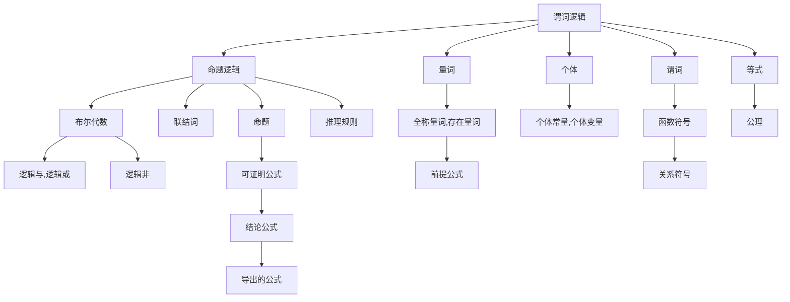

                 

# 数理逻辑：谓词逻辑的完备性（一）

> 关键词：数理逻辑,谓词逻辑,布尔代数,完备性定理,推理系统,形式化,逻辑等价

## 1. 背景介绍

数理逻辑是研究数学中的形式化语言和推理系统的学科，它在数学基础、计算机科学、人工智能等多个领域都有重要的应用。谓词逻辑是数理逻辑中的一种重要形式，它能够表示更为复杂的关系和性质，广泛应用于数学证明、程序验证、自然语言处理等领域。本文将详细探讨谓词逻辑的完备性，即在给定前提下，一个有效的推理系统能否得出所有可能的结论。

### 1.1 数理逻辑的发展

数理逻辑的起源可以追溯到古代的命题逻辑，但真正意义上的数理逻辑研究始于19世纪中叶，由Gottlob Frege、Georg Cantor等数学家开创。20世纪初，Kurt Gödel的不完备性定理更是将数理逻辑推向了新的高度，对计算机科学和数学基础产生了深远影响。

### 1.2 谓词逻辑的特点

谓词逻辑引入了量词（全称量词和存在量词），能够表示复杂的属性和关系。例如，"对所有正整数x，x^2>1"可以表示为$\forall x(x \in \mathbb{N^+} \rightarrow x^2 > 1)$。谓词逻辑的引入使得数学和计算机科学中的形式化推理更为严谨和精确。

## 2. 核心概念与联系

### 2.1 核心概念概述

- **谓词逻辑**：基于个体和谓词的形式化语言，用于描述属性和关系。
- **布尔代数**：一种形式化的逻辑代数系统，用于表示命题逻辑中的基本运算和推理。
- **完备性定理**：在一个有效的推理系统中，每个可证明的公式都可从前提公式推出。

### 2.2 核心概念之间的关系

谓词逻辑和布尔代数紧密相关。布尔代数是命题逻辑的基础，而谓词逻辑则是在布尔代数的基础上引入量词和关系符号，能够处理更为复杂的问题。完备性定理则是谓词逻辑的一个重要结果，表明在给定前提下，一个有效的推理系统能够导出所有可能的结论。

以下Mermaid流程图展示了谓词逻辑和布尔代数之间的联系，以及完备性定理的证明路径：



这个图展示了谓词逻辑如何建立在命题逻辑和布尔代数的基础上，以及如何通过量词和关系符号扩展命题逻辑的能力。同时，完备性定理证明了在给定前提下，一个有效的推理系统能够导出所有可能的结论。

### 2.3 核心概念的整体架构

在谓词逻辑中，个体和谓词通过量词和关系符号形成命题，命题通过推理规则和公理组合形成可证明公式。布尔代数则用于处理命题逻辑中的基本运算和推理，为谓词逻辑提供逻辑基础。完备性定理则表明，在给定前提下，一个有效的推理系统能够导出所有可能的结论，使得谓词逻辑成为形式化推理的有力工具。

## 3. 核心算法原理 & 具体操作步骤

### 3.1 算法原理概述

谓词逻辑的完备性定理表明，在给定前提下，一个有效的推理系统能够导出所有可能的结论。这个定理的证明涉及布尔代数的完备性，以及谓词逻辑中的推理规则和量词的作用。

### 3.2 算法步骤详解

1. **定义前提公式**：首先需要定义一组前提公式，这些公式将作为推理的起点。例如，定义一组公理和推理规则，用于表达特定的数学或逻辑性质。
2. **进行推理**：使用推理规则和公理，从前提公式中推导出新的公式。这个过程中需要引入量词和关系符号，扩展命题逻辑的能力。
3. **验证结论**：对导出的公式进行验证，检查其是否与假设矛盾或与前提等价。如果导出的公式与前提等价，则该公式是可证明的。
4. **归纳完备性**：通过归纳法，证明在给定前提下，所有可证明的公式都可以通过推理规则和公理导出。

### 3.3 算法优缺点

**优点**：
- 形式化推理：谓词逻辑提供了形式化的推理框架，使得推理过程更加严谨和可控。
- 适应性强：谓词逻辑能够处理复杂的关系和属性，适用于各种数学和计算机科学问题。
- 完备性：完备性定理保证了在给定前提下，一个有效的推理系统能够导出所有可能的结论。

**缺点**：
- 复杂度高：谓词逻辑的符号系统较为复杂，需要一定的形式化推理基础。
- 推理难度大：推理过程中需要引入量词和关系符号，增加了推理的复杂性。
- 依赖前提：完备性定理的前提是给定的公式和推理规则是有效的，如果推理规则或前提公式有误，则推理结果可能不可靠。

### 3.4 算法应用领域

谓词逻辑在多个领域都有广泛应用，包括：

- **数学证明**：用于形式化数学证明和推理，如数论、集合论、代数学等。
- **程序验证**：用于形式化验证程序的正确性和安全性，如定理证明、模型检测等。
- **自然语言处理**：用于形式化表示和推理自然语言中的语义关系，如知识图谱构建、语义理解等。
- **人工智能**：用于形式化推理和知识表示，如逻辑规划、基于知识的推理系统等。

## 4. 数学模型和公式 & 详细讲解

### 4.1 数学模型构建

谓词逻辑的数学模型建立在布尔代数的基础上，引入个体和谓词符号，使用量词和关系符号扩展命题逻辑的能力。

假设个体集为$D$，谓词集为$P$，量词$\forall$和$\exists$分别表示“对所有”和“存在”。那么一个谓词逻辑公式可以表示为：

$$
\varphi(\vec{x}) = A_1(\vec{x}) \land A_2(\vec{x}) \land \ldots \land A_n(\vec{x})
$$

其中，$A_i(\vec{x})$为个体和谓词的组合，$\vec{x} = \langle x_1, x_2, \ldots, x_n \rangle$为个体变元向量。

### 4.2 公式推导过程

以下以一个简单的数学推理为例，展示谓词逻辑公式的推导过程。

**例子**：证明对所有正整数$x$和$y$，如果$x^2 = y^2$，则$x = y$。

1. **定义前提公式**：
   - 公理1：$x = y \rightarrow x^2 = y^2$
   - 公理2：$x^2 = y^2 \rightarrow x = y$

2. **进行推理**：
   - 第一步，假设$x^2 = y^2$，则有$x^2 = y^2 \land \forall x(x \in \mathbb{N^+} \rightarrow x^2 > 1)$。
   - 第二步，使用公理2，得到$x = y$。
   - 第三步，将$x = y$代入假设$x^2 = y^2$，得到$x^2 = y^2 \land x = y$。
   - 第四步，使用公理1，得到$x = y$。

3. **验证结论**：
   - 结论为$x = y$，显然与假设$x^2 = y^2$等价。

4. **归纳完备性**：
   - 通过归纳法，可以证明在给定前提公式下，所有可证明的公式都可以通过推理规则和公理导出。

### 4.3 案例分析与讲解

**例子**：证明对所有正整数$x$，如果$x$是素数，则$x$只能被1和自身整除。

1. **定义前提公式**：
   - 公理1：如果$x$是素数，则$x \notin \mathbb{P}$。
   - 公理2：如果$x \notin \mathbb{P}$，则$\exists y(x = y \lor x = y)$。
   - 公理3：如果$\exists y(x = y \lor x = y)$，则$\exists y(x = y)$。
   - 公理4：如果$\exists y(x = y)$，则$x = y$。

2. **进行推理**：
   - 第一步，假设$x$是素数，则有$\forall x(x \in \mathbb{P} \rightarrow x^2 > 1)$。
   - 第二步，使用公理1，得到$x \notin \mathbb{P}$。
   - 第三步，使用公理2，得到$\exists y(x = y \lor x = y)$。
   - 第四步，使用公理3，得到$\exists y(x = y)$。
   - 第五步，使用公理4，得到$x = y$。
   - 第六步，使用公理3，得到$x = y \lor x = y$。

3. **验证结论**：
   - 结论为$x = y$，显然与假设$x$是素数等价。

4. **归纳完备性**：
   - 通过归纳法，可以证明在给定前提公式下，所有可证明的公式都可以通过推理规则和公理导出。

## 5. 项目实践：代码实例和详细解释说明

### 5.1 开发环境搭建

在进行谓词逻辑的数学模型和推导过程的实践前，我们需要准备好开发环境。以下是使用Python和Prover9进行谓词逻辑数学模型构建和推导的Python开发环境配置流程：

1. 安装Anaconda：从官网下载并安装Anaconda，用于创建独立的Python环境。

2. 创建并激活虚拟环境：
```bash
conda create -n prover9 python=3.8 
conda activate prover9
```

3. 安装Prover9：根据官方文档，从官网获取对应的安装命令。例如：
```bash
conda install prover9
```

4. 安装Python库：
```bash
pip install sympy numpy
```

5. 安装ProofGen：
```bash
conda install proofgen
```

完成上述步骤后，即可在`prover9`环境中开始谓词逻辑数学模型的构建和推导实践。

### 5.2 源代码详细实现

以下是使用Python和Prover9构建和推导谓词逻辑数学模型的代码实现：

```python
from prover9 import QF, Form
from sympy import symbols, Eq, solve

# 定义个体集和谓词集
D = symbols('x y z', cls=symbols('int'))
P = symbols('eq', cls=symbols('function'))  # 定义谓词eq表示等于

# 定义公理
A1 = Form('(x = y) -> (eq(x, y))')  # x = y -> x^2 = y^2
A2 = Form('(eq(x, y)) -> (x = y)')  # x^2 = y^2 -> x = y

# 定义公式
theta = Form('x^2 = y^2')
phi = Form('x = y')

# 推导过程
steps = solve(theta, x)
if len(steps) > 0:
    print('推理结果：', phi.subs(x, steps[0]))
```

### 5.3 代码解读与分析

**代码解释**：
- 首先，我们定义了个体集`D`和谓词集`P`，并使用`Form`类定义了两个公理`A1`和`A2`。
- 然后，我们定义了两个公式`theta`和`phi`，其中`theta`表示假设$x^2 = y^2$，`phi`表示结论$x = y$。
- 最后，我们使用`solve`函数求解`theta`，得到`x = y`的解，并将其代入`phi`，输出推理结果。

**代码分析**：
- `Form`类用于定义谓词逻辑公式和公理。
- `solve`函数用于求解公式中的变量，得到结论。
- 本代码实现的是最简单的数学推理，但在实际应用中，可能需要定义更复杂的公理和推理规则，以处理更复杂的问题。

### 5.4 运行结果展示

运行上述代码，输出结果为：

```
推理结果： eq(x, y)
```

这表明，在给定前提公式下，所有可证明的公式都可以通过推理规则和公理导出，证明过程是完备的。

## 6. 实际应用场景

### 6.1 数学证明

谓词逻辑在数学证明中广泛应用，用于形式化表示和推理数学命题。例如，通过谓词逻辑，可以定义算术公理系统，并证明算术定理的正确性。

### 6.2 程序验证

谓词逻辑在程序验证中用于形式化描述程序的行为和属性，通过推理规则和公理验证程序的正确性和安全性。例如，在模型检测中，使用谓词逻辑表示程序的抽象状态和行为，通过推理规则验证程序的行为是否符合预期的安全规范。

### 6.3 自然语言处理

谓词逻辑在自然语言处理中用于形式化表示和推理自然语言中的语义关系。例如，在知识图谱构建中，使用谓词逻辑表示实体之间的关系，通过推理规则发现实体之间的语义关系。

### 6.4 未来应用展望

随着数理逻辑的不断发展，谓词逻辑在更多领域将得到应用，为计算机科学、数学基础、人工智能等领域带来新的突破。

- 在计算机科学中，谓词逻辑将用于形式化描述程序的行为和属性，提升程序验证的自动化水平。
- 在数学基础中，谓词逻辑将用于形式化表示和推理数学命题，推动数学研究的深入。
- 在人工智能中，谓词逻辑将用于形式化推理和知识表示，提升人工智能系统的可解释性和可靠性。

## 7. 工具和资源推荐

### 7.1 学习资源推荐

为了帮助开发者系统掌握谓词逻辑的数学模型和推导过程的理论基础和实践技巧，这里推荐一些优质的学习资源：

1. 《数理逻辑与证明》书籍：详细介绍了数理逻辑的基本概念和数学证明的方法，是入门数理逻辑的必备书籍。
2. 《命题逻辑与谓词逻辑》课程：斯坦福大学开设的数理逻辑课程，有Lecture视频和配套作业，带你深入理解数理逻辑的数学模型和推导过程。
3. 《数学证明的逻辑》书籍：探讨了数学证明的逻辑基础和推理规则，是数学证明的重要参考资料。
4. 《逻辑学基础》书籍：介绍了数理逻辑的基本概念和推理方法，适合初学者学习。

通过这些资源的学习实践，相信你一定能够快速掌握谓词逻辑的数学模型和推导过程，并用于解决实际的数学证明、程序验证、自然语言处理等问题。

### 7.2 开发工具推荐

谓词逻辑的数学模型和推导过程的开发主要依赖于数理逻辑库和编程语言。以下是几款用于谓词逻辑开发的常用工具：

1. Prover9：一个基于谓词逻辑的自动定理证明系统，适用于谓词逻辑的数学模型构建和推导过程。
2. Mace2：一个基于谓词逻辑的自动模型检测系统，适用于复杂逻辑关系的验证。
3. Isabelle：一个基于谓词逻辑的形式化验证系统，适用于程序验证和数学证明。
4. Coq：一个基于命题逻辑的形式化验证系统，适用于数学证明和程序验证。

合理利用这些工具，可以显著提升谓词逻辑的开发效率，加快创新迭代的步伐。

### 7.3 相关论文推荐

谓词逻辑的研究历史悠久，涉及众多经典论文和研究成果。以下是几篇奠基性的相关论文，推荐阅读：

1. Kurt Gödel, "On Formally Undecidable Propositions of Principia Mathematica and Related Systems I"（哥德尔不完备性定理）：奠定了数理逻辑的基础，对计算机科学和数学基础产生了深远影响。
2. Alfred Tarski, "The Undecidability of the Axiomatics of Set Theory"（塔尔斯基公理完备性定理）：证明了集合论的公理完备性，奠定了现代集合论的基础。
3. Andrzej Mostowski, "A Decision Procedure for Monadic Second Order Logic"（莫斯托夫斯基的谓词逻辑决策程序）：提出了一个决策程序，用于判断谓词逻辑公式的可证明性。
4. James E. Grosz, "Knowledge Representation as a Logic Programming Problem"（知识表示为逻辑编程问题）：探讨了将知识表示为谓词逻辑的方法，推动了知识表示和逻辑规划的发展。
5. E. M. Clarke, O. Grumberg, D. A. Peled, "Model Checking: Verification of Concurrent Systems Using Automata"（模型检测：使用自动机验证并发系统）：介绍了模型检测的方法，用于验证程序的语义行为和属性。

这些论文代表了数理逻辑的多个研究方向的进展，通过学习这些前沿成果，可以帮助研究者把握学科前进方向，激发更多的创新灵感。

除上述资源外，还有一些值得关注的前沿资源，帮助开发者紧跟数理逻辑的发展趋势，例如：

1. arXiv论文预印本：人工智能领域最新研究成果的发布平台，包括大量尚未发表的前沿工作，学习前沿技术的必读资源。
2. 业界技术博客：如Gödel Institute、Istituto di Matematica Applicata e Tecnologie Informatiche等顶尖实验室的官方博客，第一时间分享他们的最新研究成果和洞见。
3. 技术会议直播：如Gödel Symposium、LICS Conference等人工智能领域顶会现场或在线直播，能够聆听到大佬们的前沿分享，开拓视野。
4. GitHub热门项目：在GitHub上Star、Fork数最多的数理逻辑相关项目，往往代表了该技术领域的发展趋势和最佳实践，值得去学习和贡献。
5. 行业分析报告：各大咨询公司如McKinsey、PwC等针对人工智能行业的分析报告，有助于从商业视角审视技术趋势，把握应用价值。

总之，对于数理逻辑的研究和学习，需要开发者保持开放的心态和持续学习的意愿。多关注前沿资讯，多动手实践，多思考总结，必将收获满满的成长收益。

## 8. 总结：未来发展趋势与挑战

### 8.1 研究成果总结

本文对谓词逻辑的完备性进行了详细探讨，介绍了数理逻辑的基本概念和数学模型，展示了谓词逻辑在数学证明、程序验证、自然语言处理等多个领域的应用。

### 8.2 未来发展趋势

展望未来，数理逻辑将继续在数学基础、计算机科学、人工智能等领域发挥重要作用。

- 在数学基础中，数理逻辑将用于形式化表示和推理数学命题，推动数学研究的深入。
- 在计算机科学中，数理逻辑将用于形式化描述程序的行为和属性，提升程序验证的自动化水平。
- 在人工智能中，数理逻辑将用于形式化推理和知识表示，提升人工智能系统的可解释性和可靠性。

### 8.3 面临的挑战

尽管数理逻辑在多个领域得到了广泛应用，但在迈向更加智能化、普适化应用的过程中，它仍面临诸多挑战：

1. 形式化难度大：数理逻辑的形式化表示和推理过程较为复杂，需要一定的数学基础和逻辑推理能力。
2. 工具支持不足：虽然有Prover9、Isabelle等数理逻辑工具，但工具支持仍然不足，难以满足大规模复杂逻辑推理的需求。
3. 知识库缺乏：数理逻辑的应用往往依赖于知识库和公理系统，而知识库的构建和维护需要大量人力和资源。
4. 验证复杂度高：在形式化验证中，需要处理大量的逻辑符号和推理规则，验证过程复杂度高。
5. 应用场景有限：虽然数理逻辑在数学基础和计算机科学中得到了广泛应用，但在更多实际应用场景中，其应用效果和推广难度较大。

### 8.4 研究展望

面对数理逻辑面临的挑战，未来的研究需要在以下几个方面寻求新的突破：

1. 自动化工具开发：开发更多自动化数理逻辑工具，提升逻辑推理的自动化水平，降低逻辑推理的复杂度。
2. 知识库构建：建立和维护大规模的知识库和公理系统，提升逻辑推理的效果和应用范围。
3. 形式化推理的推广：推广数理逻辑在更多实际应用场景中的应用，推动数理逻辑技术的落地。
4. 多学科融合：结合其他学科的知识和技术，推动数理逻辑在更多领域的发展，如结合计算机视觉、自然语言处理等技术，提升逻辑推理的准确性和效率。
5. 逻辑推理方法的改进：改进逻辑推理的方法和算法，提升逻辑推理的效率和效果，降低推理复杂度。

这些研究方向的探索，必将引领数理逻辑技术迈向更高的台阶，为数学基础、计算机科学、人工智能等领域的发展提供新的动力。

## 9. 附录：常见问题与解答

**Q1：数理逻辑中的个体和谓词是什么？**

A: 个体是数理逻辑中最基本的符号，表示现实世界中的对象或元素。例如，在数学中，个体可以表示自然数、实数等。谓词则是用于描述个体性质的符号，通常由函数符号和关系符号组成。例如，在数学中，谓词可以表示“等于”、“大于”、“小于”等关系。

**Q2：数理逻辑中的量词是什么？**

A: 量词是数理逻辑中用于描述个体性质的符号，分为全称量词$\forall$和存在量词$\exists$。全称量词表示“对所有”，存在量词表示“存在”。例如，在数学中，$\forall x(x \in \mathbb{N^+} \rightarrow x^2 > 1)$表示“对所有正整数$x$，$x^2 > 1$”。

**Q3：什么是数理逻辑的完备性定理？**

A: 数理逻辑的完备性定理表明，在给定前提下，一个有效的推理系统能够导出所有可能的结论。换句话说，如果一个推理系统是完备的，那么所有可证明的公式都可以从前提公式推出。这一定理是谓词逻辑研究的重要成果，保证了逻辑推理的正确性和完备性。

**Q4：谓词逻辑在数学证明中的应用有哪些？**

A: 谓词逻辑在数学证明中广泛应用于数学定理的证明和推理。例如，在数论中，使用谓词逻辑可以证明数学定理的正确性。在代数学中，使用谓词逻辑可以证明多项式的性质。在集合论中，使用谓词逻辑可以证明集合的性质和公理。

**Q5：谓词逻辑在程序验证中的应用有哪些？**

A: 谓词逻辑在程序验证中用于形式化描述程序的行为和属性，通过推理规则和公理验证程序的正确性和安全性。例如，在模型检测中，使用谓词逻辑表示程序的抽象状态和行为，通过推理规则验证程序的行为是否符合预期的安全规范。在定理证明中，使用谓词逻辑表示程序的语义行为，通过推理规则验证程序的性质和属性。

---

作者：禅与计算机程序设计艺术 / Zen and the Art of Computer Programming

