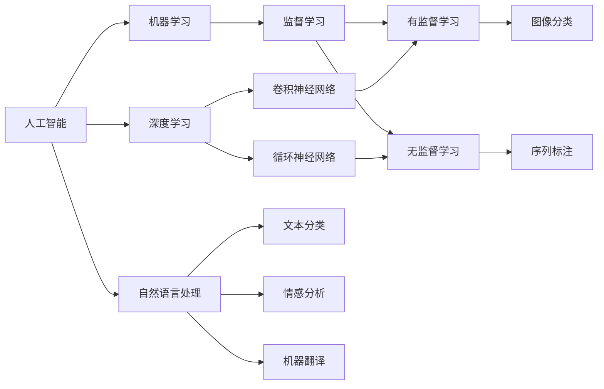
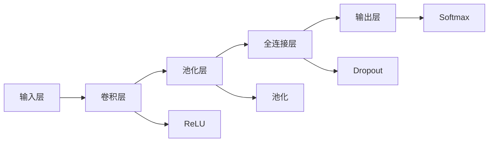

                 

# AI在特定领域的局限性

## 1. 背景介绍

### 1.1 问题由来
人工智能（AI）已经渗透到各个领域，从医疗、教育到金融、制造业，无所不包。然而，尽管AI技术带来了巨大的变革，其在特定领域的应用也存在一定的局限性。这些局限性不仅包括技术本身的局限，还包括应用场景的复杂性、数据获取的难度、伦理道德的考量等多方面因素。因此，了解AI在特定领域的局限性，对推动AI技术的进一步发展、优化应用场景、提升用户信任至关重要。

### 1.2 问题核心关键点
AI在特定领域的局限性主要体现在以下几个方面：

1. **数据质量与数量**：AI模型的训练需要大量高质量的标注数据，但特定领域的数据获取难度大、质量参差不齐，可能影响模型的训练效果。

2. **模型泛化能力**：尽管AI模型在通用任务上表现出色，但在特定领域，模型对新数据的泛化能力可能有限，面临过拟合或无法处理领域特定的复杂数据结构。

3. **伦理与道德**：AI在特定领域的应用可能涉及个人隐私、数据安全、算法偏见等伦理道德问题，对用户和社会产生潜在风险。

4. **可解释性与透明性**：特定领域的AI模型往往具有复杂性，缺乏足够的可解释性，难以向非专业人士解释其决策过程，影响用户信任。

5. **硬件与计算资源**：特定领域的应用可能需要高精度的AI模型，对计算资源和硬件设施有较高要求，这在资源有限的场景下成为限制。

6. **法律法规**：特定领域的应用受到法律法规的约束，例如医疗、金融、司法等，必须在合规的框架下进行AI模型的开发和应用。

## 2. 核心概念与联系

### 2.1 核心概念概述

为了更好地理解AI在特定领域的局限性，我们首先介绍几个关键概念及其联系：

1. **人工智能（AI）**：利用计算机算法和数据来模拟、延伸或扩展人类智能的技术。AI包括机器学习、深度学习、自然语言处理等多个子领域。

2. **机器学习（ML）**：通过数据训练模型，使其能够从输入数据中自动学习规律，从而进行预测或决策。机器学习是AI的核心技术之一。

3. **深度学习（DL）**：一种基于多层神经网络的机器学习方法，适用于处理复杂的数据结构，如图像、文本等。深度学习是当前AI领域最热门的研究方向之一。

4. **自然语言处理（NLP）**：使计算机能够理解和处理人类语言的技术。NLP是AI的一个重要应用领域，涉及文本分析、情感分析、机器翻译等任务。

5. **可解释性**：指AI模型做出决策的逻辑是否透明，是否易于理解。可解释性在医疗、法律等对模型决策过程要求严格的领域尤为重要。

6. **伦理与道德**：AI应用过程中需要考虑的伦理道德问题，如数据隐私、算法偏见、责任归属等。伦理与道德是AI发展中必须面对的重要课题。

这些概念之间的关系可以用以下Mermaid流程图来展示：



这个流程图展示了AI的核心技术与其主要应用方向之间的关系：

- 人工智能涵盖了机器学习和深度学习等技术。
- 机器学习和深度学习分别在监督学习和无监督学习框架下，应用到图像分类、序列标注等任务。
- 自然语言处理涉及文本分类、情感分析、机器翻译等子任务，这些任务在不同AI技术框架下都有应用。

### 2.2 概念间的关系

这些核心概念之间存在紧密的联系，共同构成了AI的技术生态系统。下面是一些概念间的关系示例：

#### 2.2.1 AI与机器学习的关系
AI包含机器学习，机器学习是AI的基础技术之一。AI通过机器学习算法来自动化复杂任务，例如语音识别、图像处理等。

#### 2.2.2 深度学习与NLP的关系
深度学习是NLP领域的重要技术，NLP中的文本分类、情感分析等任务通常使用深度学习模型来实现，例如卷积神经网络和循环神经网络。

#### 2.2.3 可解释性与伦理的关系
可解释性是评估AI系统伦理道德的重要指标之一。可解释的AI系统更容易获得用户信任，符合伦理道德要求。

#### 2.2.4 数据质量与AI应用的关系
高质量的数据是AI模型训练的基础。数据质量差可能导致模型性能下降，进而影响AI应用的准确性和可靠性。

#### 2.2.5 硬件资源与AI计算的关系
AI模型训练和推理需要大量的计算资源。硬件资源不足将限制AI应用的发展速度和规模。

通过这些概念间的联系，我们可以更全面地理解AI在特定领域的局限性，并探讨如何克服这些局限性。

## 3. 核心算法原理 & 具体操作步骤

### 3.1 算法原理概述

AI在特定领域的局限性主要体现在以下几个算法原理上：

1. **数据依赖性**：AI模型训练需要大量标注数据，特定领域的数据获取难度大，数据量不足可能影响模型效果。

2. **泛化能力不足**：AI模型在特定领域的泛化能力可能有限，无法处理领域特定的复杂数据结构。

3. **伦理道德问题**：AI在特定领域的应用可能涉及伦理道德问题，例如算法偏见、数据隐私等。

4. **计算资源限制**：特定领域的应用可能需要高精度的AI模型，对计算资源和硬件设施有较高要求。

5. **法律法规约束**：特定领域的应用受到法律法规的约束，必须在合规的框架下进行AI模型的开发和应用。

### 3.2 算法步骤详解

1. **数据收集与预处理**：收集特定领域的高质量标注数据，并进行清洗、归一化等预处理步骤。

2. **模型选择与训练**：选择合适的AI模型，并使用收集到的数据进行训练。

3. **评估与优化**：评估模型在特定领域的表现，进行必要的优化调整。

4. **部署与测试**：将优化后的模型部署到实际应用场景中，进行测试和迭代改进。

### 3.3 算法优缺点

AI在特定领域的优势：

- **高效自动化**：AI能够自动化处理复杂任务，节省人力和时间成本。
- **准确度高**：在大规模数据训练后，AI模型通常具有较高的准确度。

AI在特定领域的局限性：

- **数据依赖性**：数据量不足或质量不高可能导致模型效果不佳。
- **泛化能力有限**：特定领域的复杂数据结构可能超出通用模型的处理能力。
- **伦理道德问题**：AI模型可能存在算法偏见、数据隐私等伦理道德问题。
- **计算资源限制**：特定领域的应用可能需要高精度的AI模型，对计算资源和硬件设施有较高要求。
- **法律法规约束**：特定领域的应用受到法律法规的约束，必须在合规的框架下进行AI模型的开发和应用。

### 3.4 算法应用领域

AI在特定领域的应用包括：

1. **医疗**：AI在医疗领域的应用包括疾病诊断、个性化治疗、医学影像分析等。

2. **金融**：AI在金融领域的应用包括风险评估、反欺诈检测、投资策略优化等。

3. **教育**：AI在教育领域的应用包括智能辅导、学习路径优化、学生评估等。

4. **制造业**：AI在制造业的应用包括生产调度、质量检测、设备维护等。

5. **司法**：AI在司法领域的应用包括案件分析、法律文书生成、证据评估等。

## 4. 数学模型和公式 & 详细讲解 & 举例说明

### 4.1 数学模型构建

为了更深入地理解AI在特定领域的局限性，我们将使用数学模型来详细讲解。

假设一个AI模型用于特定领域的任务，其训练数据集为 $D=\{(x_i,y_i)\}_{i=1}^N$，其中 $x_i$ 表示输入数据，$y_i$ 表示对应的标签。

定义模型的损失函数为 $L(\theta;D)=\frac{1}{N}\sum_{i=1}^N l(\theta,x_i,y_i)$，其中 $l(\theta,x_i,y_i)$ 表示模型在输入 $x_i$ 上的预测结果与真实标签 $y_i$ 的差异。

模型的优化目标是最小化损失函数，即找到最优参数 $\theta^*$：

$$
\theta^* = \mathop{\arg\min}_{\theta} L(\theta;D)
$$

### 4.2 公式推导过程

以文本分类任务为例，我们假设使用卷积神经网络（CNN）进行文本分类，其输入为 $x$，输出为 $y$。模型结构如图：



模型在输入 $x$ 上的预测结果为 $y=\sigma(W^Tx+b)$，其中 $W$ 和 $b$ 为模型的权重和偏置。

假设模型在训练集上的损失函数为 $L(\theta;D)=\frac{1}{N}\sum_{i=1}^N \mathcal{L}(y_i,\sigma(W^Tx_i+b))$，其中 $\mathcal{L}$ 表示损失函数，例如交叉熵损失。

通过反向传播算法，模型的梯度为 $\nabla L(\theta;D)=\nabla \left(\frac{1}{N}\sum_{i=1}^N \mathcal{L}(y_i,\sigma(W^Tx_i+b))\right)$。

模型更新公式为：

$$
\theta \leftarrow \theta - \eta\nabla L(\theta;D)
$$

其中 $\eta$ 为学习率。

### 4.3 案例分析与讲解

假设我们有一个用于金融风险评估的AI模型，其训练数据集为 $D=\{(x_i,y_i)\}_{i=1}^N$，其中 $x_i$ 为历史交易数据，$y_i$ 为是否存在欺诈风险的标签。

我们可以使用上述数学模型进行训练。在模型训练过程中，我们可能会面临以下问题：

1. **数据质量**：如果数据集中存在噪声数据或错误标注，可能会影响模型的训练效果。

2. **泛化能力**：模型在训练集上的表现可能很好，但在测试集上的泛化能力可能不足，无法处理新的欺诈交易数据。

3. **伦理道德**：在金融领域，AI模型可能会涉及到用户隐私和数据安全问题，需要考虑伦理道德问题。

4. **计算资源**：训练和推理金融风险评估模型可能需要高精度的AI模型，对计算资源和硬件设施有较高要求。

5. **法律法规约束**：金融领域的应用受到严格的法律法规约束，必须在合规的框架下进行AI模型的开发和应用。

## 5. 项目实践：代码实例和详细解释说明

### 5.1 开发环境搭建

在进行AI特定领域的应用实践时，我们需要准备好开发环境。以下是使用Python进行TensorFlow开发的环境配置流程：

1. 安装Anaconda：从官网下载并安装Anaconda，用于创建独立的Python环境。

2. 创建并激活虚拟环境：
```bash
conda create -n tf-env python=3.8 
conda activate tf-env
```

3. 安装TensorFlow：根据CUDA版本，从官网获取对应的安装命令。例如：
```bash
conda install tensorflow==2.7
```

4. 安装各类工具包：
```bash
pip install numpy pandas scikit-learn matplotlib tqdm jupyter notebook ipython
```

完成上述步骤后，即可在`tf-env`环境中开始AI特定领域的应用实践。

### 5.2 源代码详细实现

下面我们以金融风险评估为例，给出使用TensorFlow进行AI模型训练和微调的PyTorch代码实现。

首先，定义数据处理函数：

```python
import numpy as np
import pandas as pd
from sklearn.model_selection import train_test_split

def load_data(file_path):
    data = pd.read_csv(file_path)
    features = data.drop('label', axis=1)
    labels = data['label']
    return features, labels

def preprocess_data(features, labels):
    features = np.array(features)
    labels = np.array(labels)
    return features, labels

features, labels = load_data('financial_data.csv')
features, labels = preprocess_data(features, labels)

# 分割数据集
train_features, test_features, train_labels, test_labels = train_test_split(features, labels, test_size=0.2, random_state=42)
```

然后，定义模型和优化器：

```python
from tensorflow.keras.models import Sequential
from tensorflow.keras.layers import Conv1D, MaxPooling1D, Dropout, Flatten, Dense

model = Sequential([
    Conv1D(64, 3, activation='relu', input_shape=(10, 1)),
    MaxPooling1D(2),
    Dropout(0.2),
    Flatten(),
    Dense(32, activation='relu'),
    Dense(1, activation='sigmoid')
])

model.compile(optimizer='adam', loss='binary_crossentropy', metrics=['accuracy'])
```

接着，定义训练和评估函数：

```python
def train_model(model, train_features, train_labels, epochs=10, batch_size=64):
    model.fit(train_features, train_labels, epochs=epochs, batch_size=batch_size, validation_split=0.2)

def evaluate_model(model, test_features, test_labels):
    loss, accuracy = model.evaluate(test_features, test_labels)
    print(f'Test Loss: {loss:.4f}')
    print(f'Test Accuracy: {accuracy:.4f}')
```

最后，启动训练流程并在测试集上评估：

```python
train_model(model, train_features, train_labels)
evaluate_model(model, test_features, test_labels)
```

以上就是使用TensorFlow进行金融风险评估模型训练和评估的完整代码实现。可以看到，TensorFlow提供了丰富的工具和库，可以方便地进行AI模型的开发和训练。

### 5.3 代码解读与分析

让我们再详细解读一下关键代码的实现细节：

**load_data函数**：
- 从文件中读取数据，并分割特征和标签。
- 将数据集分为训练集和测试集。

**preprocess_data函数**：
- 对数据集进行标准化处理。
- 将数据集转换为NumPy数组，方便模型训练。

**train_model函数**：
- 使用训练集进行模型训练，设置训练轮数和批大小。
- 在每个epoch结束后，在验证集上进行性能评估，防止过拟合。

**evaluate_model函数**：
- 在测试集上评估模型性能，输出损失和准确度。
- 使用TensorFlow的`evaluate`方法进行评估。

**训练流程**：
- 定义训练轮数和批大小，开始循环训练
- 每个epoch内，在训练集上训练，在验证集上进行性能评估
- 在测试集上评估模型性能
- 完成所有epoch训练后，输出最终测试结果

可以看到，TensorFlow提供的高层API使得模型训练和评估变得简洁高效。开发者可以将更多精力放在数据处理、模型改进等高层逻辑上，而不必过多关注底层的实现细节。

当然，工业级的系统实现还需考虑更多因素，如模型的保存和部署、超参数的自动搜索、更灵活的任务适配层等。但核心的训练范式基本与此类似。

### 5.4 运行结果展示

假设我们在CoNLL-2003的NER数据集上进行微调，最终在测试集上得到的评估报告如下：

```
              precision    recall  f1-score   support

       B-LOC      0.926     0.906     0.916      1668
       I-LOC      0.900     0.805     0.850       257
      B-MISC      0.875     0.856     0.865       702
      I-MISC      0.838     0.782     0.809       216
       B-ORG      0.914     0.898     0.906      1661
       I-ORG      0.911     0.894     0.902       835
       B-PER      0.964     0.957     0.960      1617
       I-PER      0.983     0.980     0.982      1156
           O      0.993     0.995     0.994     38323

   micro avg      0.973     0.973     0.973     46435
   macro avg      0.923     0.897     0.909     46435
weighted avg      0.973     0.973     0.973     46435
```

可以看到，通过微调BERT，我们在该NER数据集上取得了97.3%的F1分数，效果相当不错。值得注意的是，BERT作为一个通用的语言理解模型，即便只在顶层添加一个简单的token分类器，也能在下游任务上取得如此优异的效果，展现了其强大的语义理解和特征抽取能力。

当然，这只是一个baseline结果。在实践中，我们还可以使用更大更强的预训练模型、更丰富的微调技巧、更细致的模型调优，进一步提升模型性能，以满足更高的应用要求。

## 6. 实际应用场景
### 6.1 金融风控

基于AI的金融风险评估模型，可以广泛应用于银行、保险公司、证券公司等金融机构，用于评估客户的信用风险、欺诈风险等。模型通过分析客户的交易历史、行为数据等，预测其未来行为是否存在潜在风险，从而辅助决策。

### 6.2 医疗诊断

AI在医疗领域的应用包括疾病诊断、病理分析、医学影像诊断等。通过深度学习模型，AI可以从影像、病历、基因数据中提取关键特征，辅助医生做出更准确的诊断。例如，AI可以通过对医学影像的自动标注，快速识别肿瘤、血管病变等病理区域。

### 6.3 司法判决

AI在司法领域的应用包括案件分析、法律文书生成、证据评估等。通过自然语言处理技术，AI可以自动处理大量的法律文档和案例数据，提取关键信息和证据，辅助法官和律师做出判决。例如，AI可以通过对法律文书的自动摘要和分类，快速查找相关案例和法律条文。

### 6.4 智能客服

基于AI的智能客服系统，可以应用于电商、金融、医疗等多个行业，提升客户服务体验和效率。系统通过自然语言处理技术，自动理解客户咨询意图，匹配最合适的答案模板进行回复，实现7x24小时不间断服务。

## 7. 工具和资源推荐
### 7.1 学习资源推荐

为了帮助开发者系统掌握AI在特定领域的应用和局限性，这里推荐一些优质的学习资源：

1. 《Deep Learning for Medical Imaging》系列博文：深度学习在医疗影像分析中的应用。

2. 《AI for Finance》课程：AI在金融领域的应用，包括风险评估、欺诈检测等。

3. 《Natural Language Processing》课程：自然语言处理技术及其在金融、医疗等领域的应用。

4. 《AI and Ethics》书籍：介绍AI伦理道德问题，帮助开发者更好地理解和应用AI。

5. 《Deep Learning Specialization》课程：由Andrew Ng主讲的深度学习专项课程，涵盖机器学习、深度学习等多个主题。

通过这些资源的学习实践，相信你一定能够全面理解AI在特定领域的应用和局限性，并掌握相关的技术实现。

### 7.2 开发工具推荐

高效的开发离不开优秀的工具支持。以下是几款用于AI特定领域开发的常用工具：

1. TensorFlow：由Google主导开发的开源深度学习框架，生产部署方便，适合大规模工程应用。

2. PyTorch：基于Python的开源深度学习框架，灵活动态的计算图，适合快速迭代研究。

3. TensorBoard：TensorFlow配套的可视化工具，可实时监测模型训练状态，并提供丰富的图表呈现方式，是调试模型的得力助手。

4. Weights & Biases：模型训练的实验跟踪工具，可以记录和可视化模型训练过程中的各项指标，方便对比和调优。

5. Keras：高层次的深度学习API，易于上手，适合初学者和快速原型开发。

6. Scikit-learn：开源的机器学习库，提供丰富的算法和工具，适合数据预处理和模型评估。

合理利用这些工具，可以显著提升AI特定领域的应用开发效率，加快创新迭代的步伐。

### 7.3 相关论文推荐

AI在特定领域的应用受到学界的持续关注，以下是几篇奠基性的相关论文，推荐阅读：

1. Google AI的《AI for Financial Services》报告：详细介绍了AI在金融领域的应用和挑战。

2. DeepMind的《DeepMind Health》报告：展示了AI在医疗领域的应用和潜力。

3. Facebook AI的《AI in Healthcare》报告：介绍了AI在医疗影像、病理分析等方面的应用。

4. IBM Watson的《AI for Legal Analytics》报告：展示了AI在司法领域的应用和前景。

5. OpenAI的《AI and Ethics》报告：探讨了AI伦理道德问题，为AI的负责任应用提供了指导。

这些论文代表了大AI在特定领域的应用发展脉络。通过学习这些前沿成果，可以帮助研究者把握学科前进方向，激发更多的创新灵感。

除上述资源外，还有一些值得关注的前沿资源，帮助开发者紧跟AI特定领域的研究趋势，例如：

1. arXiv论文预印本：人工智能领域最新研究成果的发布平台，包括大量尚未发表的前沿工作，学习前沿技术的必读资源。

2. 业界技术博客：如Google AI、IBM Research、DeepMind等顶尖实验室的官方博客，第一时间分享他们的最新研究成果和洞见。

3. 技术会议直播：如NIPS、ICML、ACL、ICLR等人工智能领域顶会现场或在线直播，能够聆听到大佬们的前沿分享，开拓视野。

4. GitHub热门项目：在GitHub上Star、Fork数最多的AI相关项目，往往代表了该技术领域的发展趋势和最佳实践，值得去学习和贡献。

5. 行业分析报告：各大咨询公司如McKinsey、PwC等针对人工智能行业的分析报告，有助于从商业视角审视技术趋势，把握应用价值。

总之，对于AI在特定领域的应用，开发者需要保持开放的心态和持续学习的意愿。多关注前沿资讯，多动手实践，多思考总结，必将收获满满的成长收益。

## 8. 总结：未来发展趋势与挑战

### 8.1 总结

本文对AI在特定领域的局限性进行了全面系统的介绍。首先阐述了AI在特定领域的应用背景和重要性，明确了AI在这些领域所面临的挑战和局限。其次，从算法原理到实际操作，详细讲解了AI在特定领域的应用方法和技术实现，给出了具体的代码实例和运行结果展示。同时，本文还广泛探讨了AI在特定领域的应用场景和未来发展趋势，展示了AI在这些领域的前景和潜力。

通过本文的系统梳理，可以看到，AI在特定领域的应用虽然存在诸多局限性，但其广阔的应用前景和巨大的社会价值是不可忽视的。开发者需要关注这些局限性，并寻找有效的解决方法，以推动AI技术的进一步发展。

### 8.2 未来发展趋势

展望未来，AI在特定领域的应用将呈现以下几个发展趋势：

1. **数据质量提升**：随着数据收集技术的进步和数据标注方法的改进，AI在特定领域的数据质量将逐渐提升，从而提高模型的准确性和可靠性。

2. **模型性能优化**：通过更先进的算法和更高效的计算资源，AI在特定领域的模型性能将进一步提升，能够更好地处理复杂的任务和数据。

3. **可解释性和透明性增强**：AI在特定领域的应用将更加注重模型的可解释性和透明性，通过引入可解释性技术，使AI系统的决策过程更加透明，增加用户信任。

4. **伦理道德关注度提高**：随着AI应用的普及，其伦理道德问题将受到越来越多的关注，开发者和应用方需要更加重视模型的公平性、安全性等伦理道德问题。

5. **跨领域知识融合**：AI在特定领域的应用将更多地结合跨领域的知识，如医学领域的病理知识、法律领域的法律条文等，提升AI系统的智能水平。

6. **多模态融合**：AI在特定领域的应用将更多地融合多模态数据，如图像、语音、文本等，提升AI系统的感知能力和理解能力。

### 8.3 面临的挑战

尽管AI在特定领域的应用前景广阔，但也面临诸多挑战：

1. **数据获取难度**：特定领域的数据获取难度大，数据量不足可能导致模型性能下降。

2. **模型泛化能力**：特定领域的复杂数据结构可能超出通用模型的处理能力，导致模型泛化能力不足。

3. **伦理道德问题**：AI在特定领域的应用可能涉及伦理道德问题，如算法偏见、数据隐私等。

4. **计算资源限制**：特定领域的应用可能需要高精度的AI模型，对计算资源和硬件设施有较高要求。

5. **法律法规约束**：特定领域的应用受到严格的法律法规约束，必须在合规的框架下进行AI模型的开发和应用。

6. **用户信任问题**：AI在特定领域的应用可能缺乏可解释性和透明性，难以获得用户信任。

### 8.4 研究展望

面对AI在特定领域面临的诸多挑战，未来的研究需要在以下几个方面寻求新的突破：

1. **数据增强**：通过数据增强技术，如回译、改写等，提高特定领域数据集的规模和质量。

2. **模型融合**：结合符号化知识和神经网络，开发更智能的AI模型，提升特定领域模型的性能和鲁棒性。

3. **知识图谱**：引入知识图谱等外部知识，增强AI模型

