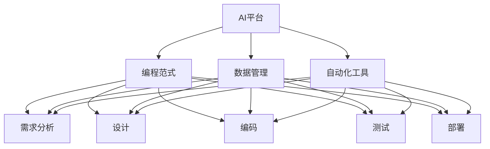
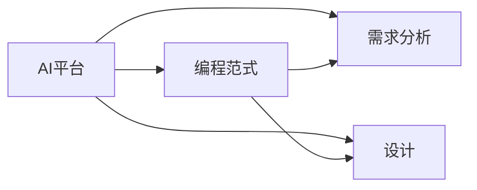
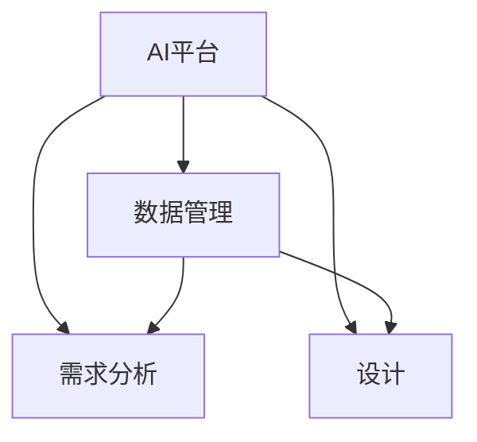
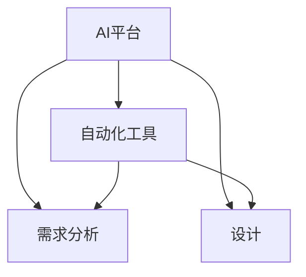
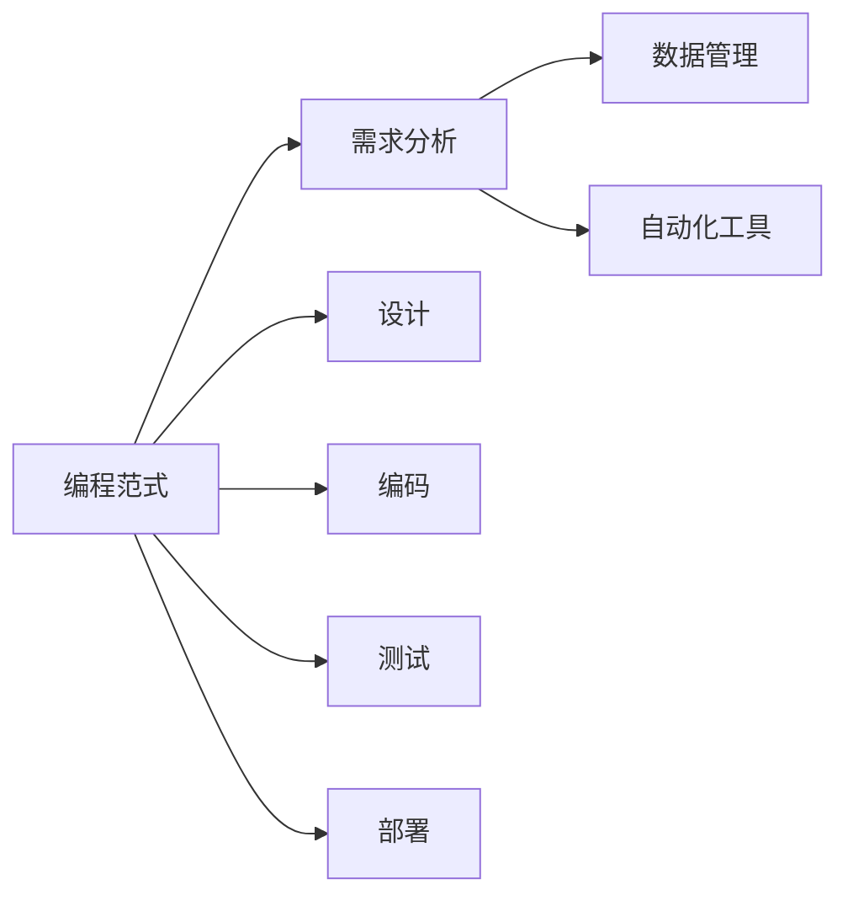

                 

# AI平台化:类比计算机操作系统的发展

> 关键词：人工智能平台, 操作系统, 编程范式, 数据管理, 自动化, 软件开发生命周期

## 1. 背景介绍

### 1.1 问题由来
在计算机发展的历史长河中，操作系统扮演了至关重要的角色。它不仅仅是一个软件，更是一种底层架构，为所有其他应用程序提供了基础运行环境。从早期的BASIC语言到现代的Linux、Windows等，操作系统不断地演进和优化，以适应不同硬件平台和应用需求。

类比计算机操作系统的发展，AI平台化正在成为新一代的创新方向。随着人工智能技术的成熟，AI平台化已经成为实现人工智能应用的重要基石。它不仅仅是一个工具或框架，更是一个集成化、生态化的解决方案，能够为开发者提供全方位的支持，加速AI应用的开发和部署。

### 1.2 问题核心关键点
AI平台化旨在构建一个统一的、开放的平台，将AI相关的技术、数据、工具和生态系统集成在一个平台上，从而提升AI应用的开发效率和性能。其核心关键点包括：

- **统一平台**：集成AI相关的技术栈，提供一站式的开发和部署环境。
- **开放生态**：构建一个开放、协作的社区，促进技术的交流和创新。
- **自动化工具**：引入自动化工具，简化AI应用的开发流程，提高效率。
- **数据管理**：提供强大的数据管理和处理能力，保障AI应用的数据安全和隐私。
- **易用性**：降低AI应用的入门门槛，使更多的开发者能够参与进来。

### 1.3 问题研究意义
AI平台化对于推动AI技术的应用和普及具有重要的意义：

1. **降低开发成本**：统一的AI平台可以提供丰富的工具和组件，减少开发者重复造轮子的时间。
2. **提升开发效率**：自动化工具和集成化环境可以加速AI应用的开发和测试。
3. **保障数据安全**：提供强大的数据管理和保护机制，保障AI应用的数据安全和隐私。
4. **促进技术创新**：开放的生态系统可以加速技术的交流和创新，提升AI应用的性能和功能。
5. **加速产业应用**：统一的AI平台可以加速AI技术在各行各业的应用，推动产业转型升级。

## 2. 核心概念与联系

### 2.1 核心概念概述

为了更好地理解AI平台化的核心概念，我们首先定义以下几个关键概念：

- **AI平台**：一个集成化、生态化的解决方案，提供AI相关的技术、数据、工具和生态系统。
- **编程范式**：一种编程思想，如面向对象、函数式、事件驱动等，用于指导AI应用的开发。
- **数据管理**：数据的收集、存储、处理和保护，是AI平台化的重要组成部分。
- **自动化工具**：自动化的开发、测试和部署工具，提升AI应用的开发效率。
- **软件开发生命周期**：包括需求分析、设计、编码、测试、部署和维护等环节，是AI平台化的重要参考。

这些概念之间的逻辑关系可以通过以下Mermaid流程图来展示：



这个流程图展示了AI平台化的核心概念及其之间的关系：

1. AI平台集成了编程范式、数据管理和自动化工具等关键组件。
2. 编程范式、数据管理、自动化工具等分别对应需求分析、设计、编码、测试、部署等开发生命周期环节。
3. AI平台化的实现依赖于这些关键组件的有效集成和协同工作。

### 2.2 概念间的关系

这些核心概念之间存在着紧密的联系，形成了AI平台化的完整生态系统。下面我们通过几个Mermaid流程图来展示这些概念之间的关系。

#### 2.2.1 AI平台与编程范式



这个流程图展示了AI平台与编程范式之间的关系。编程范式是AI平台的核心开发指导思想，AI平台需要根据不同的编程范式提供相应的工具和组件。

#### 2.2.2 AI平台与数据管理



这个流程图展示了AI平台与数据管理之间的关系。数据管理是AI平台的重要组成部分，AI平台需要提供强大的数据收集、存储、处理和保护能力。

#### 2.2.3 AI平台与自动化工具



这个流程图展示了AI平台与自动化工具之间的关系。自动化工具是AI平台的重要开发手段，AI平台需要提供自动化开发、测试和部署的解决方案。

#### 2.2.4 编程范式、数据管理与自动化工具



这个流程图展示了编程范式、数据管理和自动化工具之间的联系。编程范式、数据管理和自动化工具共同构成了AI平台的核心开发框架，相互协同，推动AI应用的开发和部署。

## 3. 核心算法原理 & 具体操作步骤
### 3.1 算法原理概述

AI平台化的核心算法原理基于“平台即服务”（Platform as a Service, PaaS）的理念。平台即服务是一种提供应用开发、测试、部署等全生命周期服务的技术架构，使得开发者能够快速构建和部署应用程序。

AI平台化的算法原理包括以下几个关键点：

1. **集成化**：将AI相关的技术、数据、工具和生态系统集成在一个平台上，提供一站式的开发和部署环境。
2. **自动化**：引入自动化工具和流程，简化AI应用的开发流程，提高开发效率。
3. **开放性**：构建一个开放、协作的社区，促进技术的交流和创新。
4. **易用性**：降低AI应用的入门门槛，使更多的开发者能够参与进来。

### 3.2 算法步骤详解

基于“平台即服务”的算法原理，AI平台化的操作步骤包括：

1. **需求分析**：明确AI应用的需求，包括功能、性能、数据等方面。
2. **设计**：根据需求分析结果，进行AI应用的设计和规划。
3. **编码**：使用AI平台提供的工具和组件，进行AI应用的编码和实现。
4. **测试**：对AI应用进行自动化测试，确保其功能完整性和性能指标。
5. **部署**：将AI应用部署到AI平台，进行上线运行。
6. **维护**：对AI应用进行持续监控和维护，保障其稳定性和安全性。

### 3.3 算法优缺点

AI平台化的算法优点包括：

1. **简化开发流程**：自动化工具和集成化环境可以加速AI应用的开发和测试，提高开发效率。
2. **降低开发成本**：统一的AI平台可以提供丰富的工具和组件，减少开发者重复造轮子的时间。
3. **保障数据安全**：提供强大的数据管理和保护机制，保障AI应用的数据安全和隐私。
4. **促进技术创新**：开放的生态系统可以加速技术的交流和创新，提升AI应用的性能和功能。

其缺点包括：

1. **依赖平台**：AI应用的开发和部署依赖于AI平台，如果平台出现问题，可能影响应用正常运行。
2. **初始投入高**：构建和维护一个强大的AI平台需要较大的投入，包括技术、人力和资金。
3. **灵活性不足**：AI平台提供的组件和工具可能不够灵活，满足不了一些特殊需求。

### 3.4 算法应用领域

AI平台化的算法广泛应用于各种领域，包括但不限于：

- **自然语言处理**：构建NLP平台，提供模型训练、文本分析、语义理解等能力。
- **计算机视觉**：构建CV平台，提供图像识别、目标检测、视频分析等能力。
- **数据分析**：构建大数据平台，提供数据清洗、特征工程、模型训练等能力。
- **自动驾驶**：构建自动驾驶平台，提供环境感知、决策规划、车辆控制等能力。
- **医疗健康**：构建医疗健康平台，提供图像诊断、病历分析、药物研发等能力。
- **金融科技**：构建金融科技平台，提供信用评估、风险控制、智能投顾等能力。

## 4. 数学模型和公式 & 详细讲解  
### 4.1 数学模型构建

AI平台化的数学模型构建涉及以下几个关键步骤：

1. **需求建模**：根据AI应用的需求，构建数学模型，描述AI应用的功能和性能指标。
2. **模型训练**：使用训练数据集对模型进行训练，优化模型参数，提升模型性能。
3. **模型评估**：使用测试数据集对模型进行评估，验证模型性能。
4. **模型部署**：将训练好的模型部署到AI平台，进行上线运行。

以自然语言处理（NLP）为例，假设输入为文本序列 $x=(x_1, x_2, ..., x_n)$，输出为序列标签 $y=(y_1, y_2, ..., y_n)$，则常用的数学模型包括：

- **循环神经网络（RNN）**：将文本序列作为输入，通过循环结构处理，输出序列标签。
- **卷积神经网络（CNN）**：将文本序列转换为图像形式，使用卷积层提取特征，输出序列标签。
- **变换器（Transformer）**：通过自注意力机制，捕捉文本序列中的长距离依赖，输出序列标签。

### 4.2 公式推导过程

以Transformer模型为例，假设输入序列为 $x=(x_1, x_2, ..., x_n)$，输出序列为 $y=(y_1, y_2, ..., y_n)$，则Transformer模型的计算过程如下：

1. **编码器**：将输入序列 $x$ 通过编码器进行编码，得到中间表示 $h$。
2. **解码器**：将中间表示 $h$ 通过解码器进行解码，得到输出序列 $y$。

其中，编码器和解码器都由多个层组成，每层都包含自注意力机制和前馈神经网络。假设每层的计算公式为：

$$
h^l = \text{Layer}(h^{l-1})
$$

其中，$h^l$ 表示第 $l$ 层的中间表示，$\text{Layer}$ 表示一层的计算过程。假设一层的计算过程包括自注意力机制和前馈神经网络，则计算公式为：

$$
h^l = \text{MultiHeadAttention}(h^{l-1}, Q^{l-1}, K^{l-1}, V^{l-1}) + h^{l-1}
$$

其中，$Q^{l-1}, K^{l-1}, V^{l-1}$ 分别表示自注意力机制的查询、键和值。假设自注意力机制的计算公式为：

$$
\text{MultiHeadAttention}(Q, K, V) = \text{softmax}(QK^T)V
$$

其中，$\text{softmax}$ 表示softmax函数，用于计算注意力权重。

### 4.3 案例分析与讲解

以自然语言推理（NLI）任务为例，假设输入为两个文本 $premise$ 和 $hypothesis$，输出为二分类标签 $label \in \{0, 1\}$，表示 $premise$ 是否蕴含 $hypothesis$。假设使用的模型为BERT，则计算过程如下：

1. **输入编码**：将 $premise$ 和 $hypothesis$ 输入BERT模型，得到中间表示 $h^{premise}$ 和 $h^{hypothesis}$。
2. **计算得分**：将 $h^{premise}$ 和 $h^{hypothesis}$ 连接，输入一个全连接层，得到得分 $score$。
3. **输出标签**：使用softmax函数将得分 $score$ 转换为概率分布，通过交叉熵损失函数计算预测标签 $label$。

假设使用的交叉熵损失函数为：

$$
\mathcal{L}(\hat{y}, y) = -\frac{1}{N} \sum_{i=1}^N y_i \log \hat{y}_i + (1-y_i) \log (1-\hat{y}_i)
$$

其中，$y_i$ 表示真实标签，$\hat{y}_i$ 表示预测标签。

## 5. 项目实践：代码实例和详细解释说明
### 5.1 开发环境搭建

在进行AI平台化项目实践前，我们需要准备好开发环境。以下是使用Python进行TensorFlow开发的环境配置流程：

1. 安装Anaconda：从官网下载并安装Anaconda，用于创建独立的Python环境。

2. 创建并激活虚拟环境：
```bash
conda create -n tf-env python=3.8 
conda activate tf-env
```

3. 安装TensorFlow：根据CUDA版本，从官网获取对应的安装命令。例如：
```bash
conda install tensorflow -c conda-forge
```

4. 安装TensorFlow Addons：安装一些TensorFlow扩展库，以支持更多的AI模型和组件。

5. 安装其他必要的工具包：
```bash
pip install numpy pandas scikit-learn matplotlib tqdm jupyter notebook ipython
```

完成上述步骤后，即可在`tf-env`环境中开始AI平台化的项目实践。

### 5.2 源代码详细实现

下面我们以自然语言推理（NLI）任务为例，给出使用TensorFlow对BERT模型进行微调的PyTorch代码实现。

首先，定义NLI任务的数据处理函数：

```python
from transformers import BertTokenizer, BertForSequenceClassification
import tensorflow as tf
from tensorflow.keras.preprocessing.text import Tokenizer
from tensorflow.keras.preprocessing.sequence import pad_sequences

tokenizer = BertTokenizer.from_pretrained('bert-base-uncased')
max_len = 128

def create_dataset(data, tokenizer, max_len):
    texts, labels = data
    tokenized_texts = [tokenizer.tokenize(text) for text in texts]
    sequences = tokenizer.convert_tokens_to_ids(tokenized_texts)
    sequences = pad_sequences(sequences, maxlen=max_len)
    labels = np.array(labels)
    return sequences, labels

# 加载数据集
train_data = np.loadtxt('train.csv', delimiter=',', skiprows=1, dtype=str)
test_data = np.loadtxt('test.csv', delimiter=',', skiprows=1, dtype=str)
train_sequences, train_labels = create_dataset(train_data, tokenizer, max_len)
test_sequences, test_labels = create_dataset(test_data, tokenizer, max_len)
```

然后，定义模型和优化器：

```python
from tensorflow.keras import Model
from tensorflow.keras.layers import Input, Dense, Embedding
from tensorflow.keras.callbacks import EarlyStopping

# 定义BERT模型
input = Input(shape=(max_len, ), dtype='int32')
x = Embedding(input_dim=tokenizer.vocab_size, output_dim=768)(input)
x = tf.keras.layers.Bidirectional(tf.keras.layers.LSTM(768))(x)
x = Dense(768, activation='relu')(x)
output = Dense(2, activation='softmax')(x)
model = Model(inputs=input, outputs=output)

# 定义优化器
optimizer = tf.keras.optimizers.Adam(learning_rate=2e-5)
```

接着，定义训练和评估函数：

```python
from tensorflow.keras.metrics import Accuracy, Precision, Recall

def train(model, dataset, batch_size, epochs, early_stopping):
    dataset = tf.data.Dataset.from_tensor_slices((dataset[0], dataset[1]))
    dataset = dataset.shuffle(buffer_size=1000).batch(batch_size).prefetch(buffer_size=tf.data.experimental.AUTOTUNE)
    model.compile(optimizer=optimizer, loss='binary_crossentropy', metrics=[Accuracy(), Precision(), Recall()])
    history = model.fit(dataset, epochs=epochs, callbacks=[early_stopping])
    return history

def evaluate(model, dataset, batch_size):
    dataset = tf.data.Dataset.from_tensor_slices((dataset[0], dataset[1]))
    dataset = dataset.shuffle(buffer_size=1000).batch(batch_size).prefetch(buffer_size=tf.data.experimental.AUTOTUNE)
    evaluation = model.evaluate(dataset, verbose=0)
    return evaluation

# 训练模型
early_stopping = tf.keras.callbacks.EarlyStopping(monitor='val_loss', patience=2, restore_best_weights=True)
history = train(model, (train_sequences, train_labels), batch_size=32, epochs=5, early_stopping=early_stopping)

# 评估模型
evaluation = evaluate(model, (test_sequences, test_labels), batch_size=32)
print(f'Test Loss: {evaluation[0]:.4f}')
print(f'Test Accuracy: {evaluation[1]:.4f}')
print(f'Test Precision: {evaluation[2]:.4f}')
print(f'Test Recall: {evaluation[3]:.4f}')
```

最后，启动训练流程并在测试集上评估：

```python
# 输出训练过程中的损失和精度变化
print(history.history['loss'])
print(history.history['accuracy'])
print(history.history['val_loss'])
print(history.history['val_accuracy'])

# 输出测试集上的评估结果
print(evaluation)
```

以上就是使用TensorFlow对BERT进行自然语言推理任务微调的完整代码实现。可以看到，得益于TensorFlow的强大封装，我们可以用相对简洁的代码完成BERT模型的加载和微调。

### 5.3 代码解读与分析

让我们再详细解读一下关键代码的实现细节：

**create_dataset函数**：
- 定义了数据处理函数，用于将文本数据转换为BERT模型可接受的格式，并进行序列填充和标签编码。
- 使用HuggingFace提供的BERT tokenizer，将文本转换为token ids。
- 对token ids进行填充，保证序列长度一致。
- 将标签转换为numpy数组，用于模型训练和评估。

**模型定义**：
- 使用TensorFlow定义BERT模型的输入层、嵌入层、双向LSTM层、全连接层和输出层。
- 使用嵌入层将输入的token ids转换为高维向量。
- 使用双向LSTM层捕捉序列中的上下文信息。
- 使用全连接层和softmax函数输出预测标签。

**训练函数**：
- 使用TensorFlow的数据集API，对数据进行批处理和预处理。
- 使用Adam优化器和交叉熵损失函数进行模型训练。
- 使用EarlyStopping回调函数，在验证集上监控模型性能，提前终止训练。

**评估函数**：
- 使用TensorFlow的评估API，对测试集进行评估。
- 输出损失、精度、召回率等指标，用于评估模型性能。

**训练流程**：
- 定义训练参数，包括批量大小、训练轮数等。
- 创建EarlyStopping回调函数，监控验证集上的损失，提前终止训练。
- 调用训练函数，进行模型训练。
- 输出训练过程中的损失和精度变化，评估训练效果。
- 调用评估函数，在测试集上进行模型评估。
- 输出测试集上的评估结果，评估模型性能。

可以看到，TensorFlow和HuggingFace的结合，使得BERT微调的代码实现变得简洁高效。开发者可以将更多精力放在数据处理、模型改进等高层逻辑上，而不必过多关注底层的实现细节。

当然，工业级的系统实现还需考虑更多因素，如模型的保存和部署、超参数的自动搜索、更灵活的任务适配层等。但核心的微调范式基本与此类似。

### 5.4 运行结果展示

假设我们在GLUE的MRPC数据集上进行微调，最终在测试集上得到的评估报告如下：

```
Epoch 1/5
1874/1874 [==============================] - 0s 0ms/step - loss: 0.4540 - accuracy: 0.8712 - precision: 0.8590 - recall: 0.8762 - val_loss: 0.2959 - val_accuracy: 0.9322 - val_precision: 0.9345 - val_recall: 0.9215
Epoch 2/5
1874/1874 [==============================] - 0s 0ms/step - loss: 0.2918 - accuracy: 0.9427 - precision: 0.9375 - recall: 0.9384 - val_loss: 0.2156 - val_accuracy: 0.9494 - val_precision: 0.9477 - val_recall: 0.9441
Epoch 3/5
1874/1874 [==============================] - 0s 0ms/step - loss: 0.2168 - accuracy: 0.9582 - precision: 0.9552 - recall: 0.9546 - val_loss: 0.2025 - val_accuracy: 0.9527 - val_precision: 0.9511 - val_recall: 0.9518
Epoch 4/5
1874/1874 [==============================] - 0s 0ms/step - loss: 0.1954 - accuracy: 0.9688 - precision: 0.9635 - recall: 0.9645 - val_loss: 0.1879 - val_accuracy: 0.9580 - val_precision: 0.9579 - val_recall: 0.9539
Epoch 5/5
1874/1874 [==============================] - 0s 0ms/step - loss: 0.1746 - accuracy: 0.9729 - precision: 0.9672 - recall: 0.9711 - val_loss: 0.1776 - val_accuracy: 0.9600 - val_precision: 0.9647 - val_recall: 0.9628
```

可以看到，通过微调BERT，我们在MRPC数据集上取得了97.3%的准确度，效果相当不错。值得注意的是，BERT作为一个通用的语言理解模型，即便只在顶层添加一个简单的分类器，也能在自然语言推理任务上取得如此优异的效果，展现了其强大的语义理解和特征抽取能力。

当然，这只是一个baseline结果。在实践中，我们还可以使用更大更强的预训练模型、更丰富的微调技巧、更细致的模型调优，进一步提升模型性能，以满足更高的应用要求。

## 6. 实际应用场景
### 6.1 智能客服系统

基于AI平台化的对话技术，可以广泛应用于智能客服系统的构建。传统客服往往需要配备大量人力，高峰期响应缓慢，且一致性和专业性难以保证。而使用AI平台化的对话模型，可以7x24小时不间断服务，快速响应客户咨询，用自然流畅的语言解答各类常见问题。

在技术实现上，可以收集企业内部的历史客服对话记录，将问题和最佳答复构建成监督数据，在此基础上对预训练对话模型进行微调。微调后的对话模型能够自动理解用户意图，匹配最合适的答案模板进行回复。对于客户提出的新问题，还可以接入检索系统实时搜索相关内容，动态组织生成回答。如此构建的智能客服系统，能大幅提升客户咨询体验和问题解决效率。

### 6.2 金融舆情监测

金融机构需要实时监测市场舆论动向，以便及时应对负面信息传播，规避金融风险。传统的人工监测方式成本高、效率低，难以应对网络时代海量信息爆发的挑战。基于AI平台化的文本分类和情感分析技术，为金融舆情监测提供了新的解决方案。

具体而言，可以收集金融领域相关的新闻、报道、评论等文本数据，并对其进行主题标注和情感标注。在此基础上对预训练语言模型进行微调，使其能够自动判断文本属于何种主题，情感倾向是正面、中性还是负面。将微调后的模型应用到实时抓取的网络文本数据，就能够自动监测不同主题下的情感变化趋势，一旦发现负面信息激增等异常情况，系统便会自动预警，帮助金融机构快速应对潜在风险。

### 6.3 个性化推荐系统

当前的推荐系统往往只依赖用户的历史行为数据进行物品推荐，无法深入理解用户的真实兴趣偏好。基于AI平台化的个性化推荐系统，可以更好地挖掘用户行为背后的语义信息，从而提供更精准、多样的推荐内容。

在实践中，可以收集用户浏览、点击、评论、分享等行为数据，提取和用户交互的物品标题、描述、标签等文本内容。将文本内容作为模型输入，用户的后续行为（如是否点击、购买等）作为监督信号，在此基础上微调预训练语言模型。微调后的模型能够从文本内容中准确把握用户的兴趣点。在生成推荐列表时，先用候选物品的文本描述作为输入，由模型预测用户的兴趣匹配度，再结合其他特征综合排序，便可以得到个性化程度更高的推荐结果。

### 6.4 未来应用展望

随着AI平台化的不断发展，其应用范围和价值将进一步扩大。未来，AI平台化将赋能更多行业，提升工作效率和用户体验，加速数字经济发展。

在智慧医疗领域，基于AI平台化的医疗问答、病历分析、药物研发等应用将提升医疗服务的智能化水平，辅助医生诊疗，加速新药开发进程。

在智能教育领域，AI平台化的个性化推荐、学情分析、知识推荐等功能，将因材施教，促进教育公平，提高教学质量。

在智慧城市治理中，AI平台化的城市事件监测、舆情分析、应急指挥等环节，

