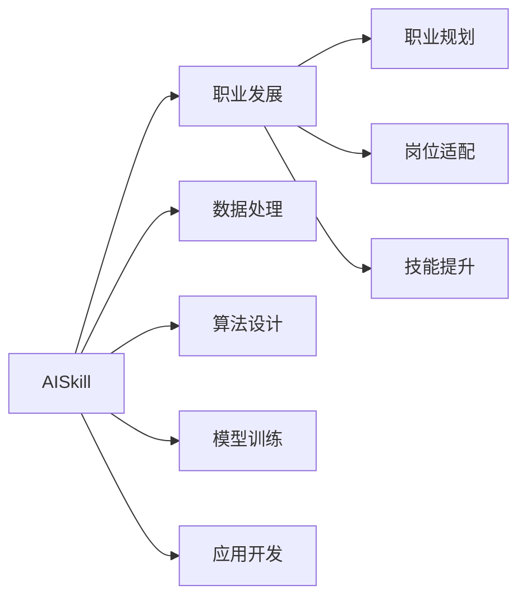
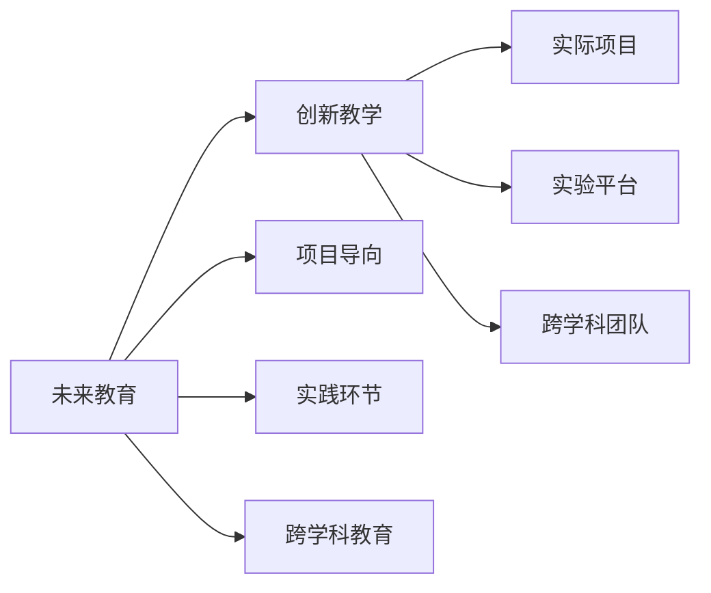
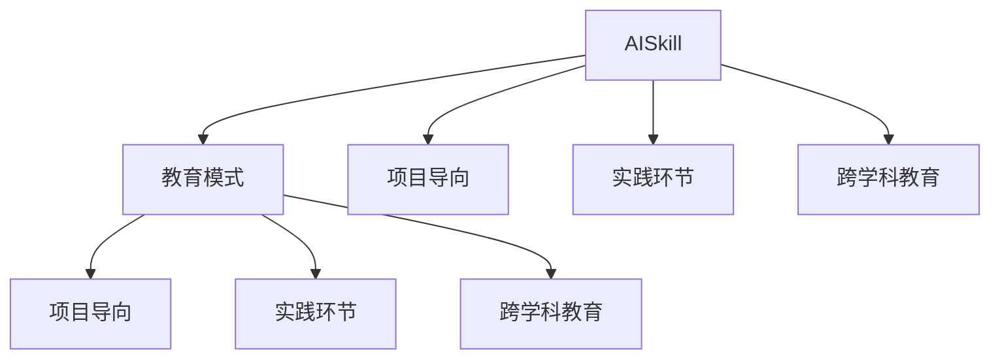
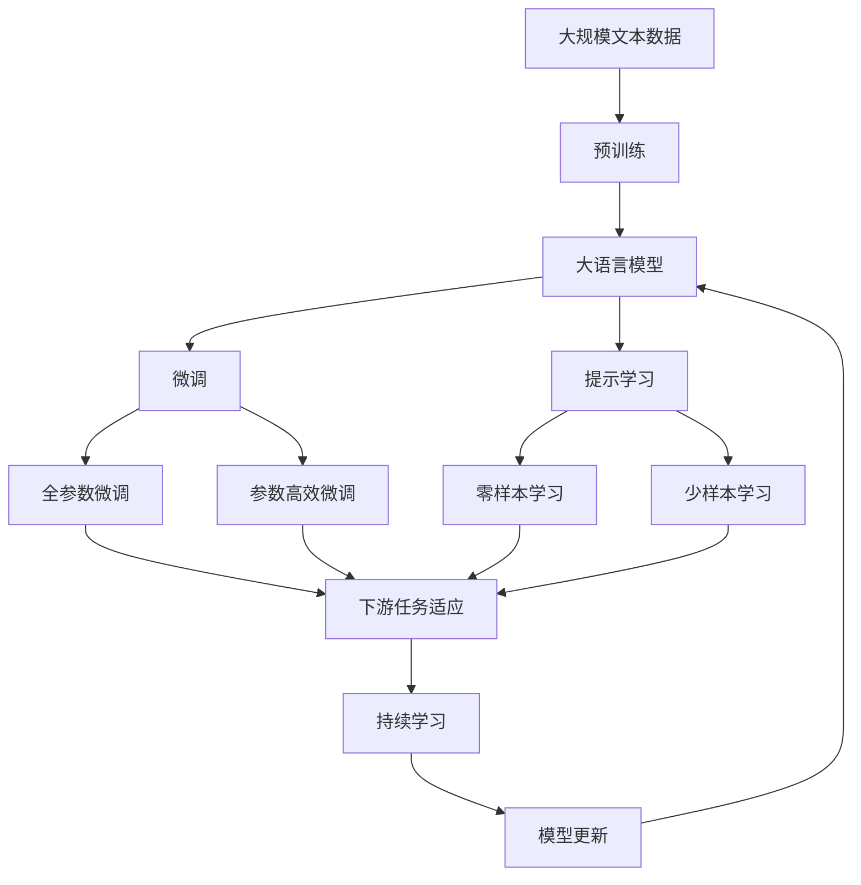

                 

# AI时代的人才培养策略

> 关键词：人工智能,人才培养,未来教育,AI技能,职业发展

## 1. 背景介绍

### 1.1 问题由来
随着人工智能(AI)技术的迅猛发展，对具备AI技能的人才需求迅速增长。从技术岗位到业务岗位，从研发团队到企业管理层，AI技能已成为企业和组织竞争力的重要标志。然而，AI技能人才培养面临诸多挑战，包括教学资源不足、师资力量短缺、教育模式单一等问题。如何在大数据时代培养具备AI技能的人才，成为摆在我们面前的紧迫课题。

### 1.2 问题核心关键点
1. **教学资源不足**：尽管全球科技公司不断扩大AI研发团队，但高质量的教学资源依然稀缺，尤其是顶级大学和研究机构所掌握的资源。
2. **师资力量短缺**：能够教授AI课程的优秀教师资源有限，往往集中在少数高校和机构，并且难以快速复制和推广。
3. **教育模式单一**：当前的教育模式主要依赖课堂讲授，缺乏实践、项目导向的学习环节，难以培养学生解决实际问题的能力。
4. **技能差距**：传统计算机科学专业学生普遍缺乏跨学科知识，难以理解和掌握复杂的AI算法。
5. **未来职业定位模糊**：学生对于AI技术的职业前景认识不清，导致学习和就业方向的迷茫。

### 1.3 问题研究意义
AI时代的人才培养策略研究，对于推动AI技术在各行业的广泛应用，促进科技与经济深度融合，培养跨学科复合型人才具有重要意义：

1. **加速AI技术落地**：高质量AI人才是AI技术创新的核心驱动力，直接决定着AI技术在各领域的快速落地和应用。
2. **提升企业竞争力**：企业拥有高水平的AI人才团队，可以加速业务数字化转型，提升运营效率，优化用户体验。
3. **满足社会需求**：随着AI技术的普及，社会对于具备AI技能的复合型人才需求不断增加，培养AI人才将填补这一空白。
4. **推动教育改革**：AI技术的引入将推动教育模式的创新，促进教育资源的均衡分配，提升教育质量。

## 2. 核心概念与联系

### 2.1 核心概念概述

为更好地理解AI时代的人才培养策略，本节将介绍几个密切相关的核心概念：

- **人工智能(AI)**：以机器学习、深度学习、自然语言处理、计算机视觉等为代表的智能技术。AI技术通过模仿人类智能，实现自主学习、决策和执行。
- **人才培养**：通过教育、培训等手段，系统性地提升个体的知识和技能，使其具备某一领域的综合能力。
- **未来教育**：面向未来社会和科技需求，采用创新教学模式、资源配置和评估体系的教育形态。
- **AI技能**：涵盖数据处理、算法设计、模型训练、应用开发等方面的能力。
- **职业发展**：根据个体职业兴趣和能力，提供个性化职业规划和发展路径。

这些核心概念之间的逻辑关系可以通过以下Mermaid流程图来展示：

```mermaid
graph TB
    A[人工智能(AI)] --> B[人才培养]
    A --> C[未来教育]
    A --> D[AI技能]
    B --> E[教学资源]
    B --> F[师资力量]
    B --> G[教育模式]
    C --> H[创新教学]
    C --> I[教育资源]
    C --> J[评估体系]
    D --> K[数据处理]
    D --> L[算法设计]
    D --> M[模型训练]
    D --> N[应用开发]
    G --> O[项目导向]
    G --> P[实践环节]
    G --> Q[跨学科教育]
    O --> R[实际项目]
    P --> S[实验平台]
    Q --> T[跨学科团队]
    R --> S
    R --> T
```

这个流程图展示了大语言模型微调过程中各个核心概念的关系：

1. 人工智能通过数据、算法和计算能力，实现智能决策和执行。
2. 人才培养需要教育资源和师资力量的支持，采用创新的教育模式，培养学生具备AI技能。
3. AI技能包括数据处理、算法设计、模型训练和应用开发等能力，是人才培养的重要目标。
4. 未来教育推动教育模式的创新，优化教育资源配置，提升教育质量。
5. 职业发展提供个性化的职业规划和路径，帮助学生在AI领域实现长期发展。

### 2.2 概念间的关系

这些核心概念之间存在着紧密的联系，形成了AI时代人才培养的完整生态系统。下面我通过几个Mermaid流程图来展示这些概念之间的关系。

#### 2.2.1 AI技能与职业发展



这个流程图展示了AI技能在职业发展中的作用：学生通过学习数据处理、算法设计、模型训练和应用开发等技能，能够在AI领域取得职业成就。

#### 2.2.2 未来教育与创新教学



这个流程图展示了未来教育通过创新教学模式，推动教育资源的均衡分配，提升教育质量。

#### 2.2.3 AI技能与教育模式



这个流程图展示了AI技能与教育模式的联系，通过项目导向、实践环节和跨学科教育，培养学生解决实际问题的能力。

### 2.3 核心概念的整体架构

最后，我们用一个综合的流程图来展示这些核心概念在大语言模型微调过程中的整体架构：



这个综合流程图展示了从预训练到微调，再到持续学习的完整过程。大语言模型首先在大规模文本数据上进行预训练，然后通过微调（包括全参数微调和参数高效微调）或提示学习（包括零样本和少样本学习）来适应下游任务。最后，通过持续学习技术，模型可以不断更新和适应新的任务和数据。 通过这些流程图，我们可以更清晰地理解AI时代的人才培养过程中各个核心概念的关系和作用，为后续深入讨论具体的培养方法和技术奠定基础。

## 3. 核心算法原理 & 具体操作步骤
### 3.1 算法原理概述

AI时代的人才培养策略，本质上是一个以教育为手段的系统性工程。其核心思想是通过教育体系，系统性地提升个体在AI领域的知识和技能，使其具备解决实际问题的能力。

形式化地，假设我们需要培养的个体为 $X$，AI相关的知识体系为 $K$，目标是将 $X$ 从初始状态 $X_0$ 转换为具备AI技能的状态 $X_f$，具体步骤如下：

1. **需求分析**：识别 $X$ 当前状态与目标状态之间的差距，确定需要学习的知识点 $K$。
2. **课程设计**：设计适合 $X$ 的课程体系 $C$，涵盖 $K$ 中的核心内容。
3. **教学实施**：通过教育资源和师资力量，实施课程 $C$，将 $X$ 转化为具备 $K$ 的能力。
4. **评估反馈**：采用评估体系 $E$，评估 $X$ 学习效果，并根据反馈调整课程设计。
5. **职业规划**：根据 $X$ 的职业兴趣和能力，设计个性化的职业发展路径 $P$，指导其在AI领域的长期发展。

通过以上步骤，可以有效提升 $X$ 在AI领域的知识和技能，满足实际应用的需求。

### 3.2 算法步骤详解

AI时代的人才培养策略，通常包括以下几个关键步骤：

**Step 1: 需求分析**
- **问卷调查**：通过问卷调查，了解 $X$ 的现有知识和技能，识别其兴趣点和职业目标。
- **技能评估**：通过线上线下测试和实战项目，评估 $X$ 在数据处理、算法设计、模型训练等方面的能力。
- **岗位需求**：分析行业岗位需求，确定所需技能和知识点的优先级。

**Step 2: 课程设计**
- **知识点梳理**：梳理AI领域的核心知识点，涵盖数据处理、算法设计、模型训练、应用开发等方面。
- **课程结构设计**：设计系统化的课程结构，包括理论课程、实践课程、项目课程等。
- **跨学科融合**：引入计算机科学、数学、统计学等学科的交叉课程，帮助 $X$ 理解复杂AI算法。
- **项目导向**：设计实际项目，通过项目实战提升 $X$ 的实践能力。

**Step 3: 教学实施**
- **教育资源配置**：配置高质量的教育资源，包括教材、教学视频、实验平台等。
- **师资力量支持**：引入AI领域的专家和教师，提供高质量的教学服务。
- **在线教育平台**：利用在线教育平台，提供灵活的学习方式和时间安排。
- **实验平台搭建**：搭建实验平台，提供动手实践的机会。

**Step 4: 评估反馈**
- **过程评估**：通过阶段性测试和项目评估，了解 $X$ 的学习效果。
- **成果展示**：组织项目展示和比赛，促进 $X$ 的成果分享和经验交流。
- **反馈调整**：根据评估结果和反馈，调整课程设计，优化教学方法。

**Step 5: 职业规划**
- **职业兴趣调研**：通过问卷和访谈，了解 $X$ 的职业兴趣和职业目标。
- **技能匹配**：根据 $X$ 的技能评估结果，推荐合适的岗位和职业路径。
- **长期发展指导**：提供个性化的职业发展规划和指导，帮助 $X$ 在AI领域实现长期发展。

### 3.3 算法优缺点

AI时代的人才培养策略，具有以下优点：
1. **系统性**：通过需求分析、课程设计、教学实施、评估反馈和职业规划等环节，系统性地提升 $X$ 在AI领域的知识和技能。
2. **个性化**：根据 $X$ 的兴趣、能力和职业目标，提供个性化的教育方案和职业路径，提升学习效果。
3. **实践导向**：通过项目导向和实践环节，培养 $X$ 的实际操作能力，增强其在AI领域的应用能力。
4. **灵活性**：利用在线教育平台和实验平台，提供灵活的学习方式和时间安排，适应不同的学习需求。

同时，该策略也存在一些局限性：
1. **资源依赖**：高质量的教育资源和师资力量是培养高质量AI人才的前提，资源匮乏可能影响培养效果。
2. **评估复杂**：AI领域知识点的复杂性和多样性，使得评估体系的设计和实施难度较大。
3. **技能泛化**：学生在学校学到的知识可能与实际应用场景存在差距，需要进一步实践和深化。
4. **持续学习**：AI技术的快速发展，要求学生具备持续学习的能力，定期更新知识体系。
5. **职业路径选择**：个性化的职业规划需要根据学生兴趣和能力动态调整，存在一定的不确定性。

尽管存在这些局限性，但AI时代的人才培养策略仍是目前最为可行和有效的教育方式，能够最大限度地提升学生在AI领域的竞争力和职业发展潜力。

### 3.4 算法应用领域

AI时代的人才培养策略，已经广泛应用于人工智能、数据科学、计算机视觉、自然语言处理等多个领域。具体包括：

- **人工智能**：培养具备深度学习、机器学习、自然语言处理等能力的AI开发者。
- **数据科学**：培养具备数据挖掘、数据处理、数据分析等能力的数据科学家。
- **计算机视觉**：培养具备图像处理、计算机视觉等能力的计算机视觉工程师。
- **自然语言处理**：培养具备自然语言理解、自然语言生成等能力的NLP工程师。
- **机器学习**：培养具备算法设计、模型训练、应用开发等能力的机器学习工程师。
- **AI教育**：培养具备AI教学能力和教育管理能力的高校教师和教育专家。

## 4. 数学模型和公式 & 详细讲解  
### 4.1 数学模型构建

本节将使用数学语言对AI时代的人才培养策略进行更加严格的刻画。

记个体为 $X$，其初始状态为 $X_0$，目标状态为 $X_f$。记AI领域的知识点为 $K$，记课程体系为 $C$，记教育资源为 $E$，记教学实施为 $T$，记评估反馈为 $F$，记职业规划为 $P$。则人才培养的数学模型可以表示为：

$$
X_f = F(X_0, K, C, T, E, P)
$$

其中，$F$ 为人才培养函数，表示通过教育资源和师资力量，在课程体系和职业规划的指导下，通过教学实施和评估反馈，将 $X$ 从初始状态 $X_0$ 转换为目标状态 $X_f$。

### 4.2 公式推导过程

以下我们以Python为基础语言，推导人才培养的Python代码实现。

假设我们要设计一个简单的课程体系，该课程体系由以下步骤组成：

1. 数据处理入门课程：介绍数据处理的基本概念和技能。
2. 算法设计基础课程：介绍常见的算法和数据结构。
3. 模型训练高级课程：介绍常用的机器学习模型和算法。
4. 应用开发实战课程：通过实际项目，提升学生的实际操作能力。

我们可以使用Python的Sympy库来表示和计算这个人才培养过程的数学模型：

```python
from sympy import symbols, Function, Eq

# 定义变量和函数
X = symbols('X')
K = symbols('K')
C = symbols('C')
T = symbols('T')
E = symbols('E')
F = Function('F')

# 定义人才培养函数
def F(X, K, C, T, E, P):
    # 数据处理入门课程
    data_processing = Eq(X, X + symbols('data_processing'))
    # 算法设计基础课程
    algorithm_design = Eq(X, X + symbols('algorithm_design'))
    # 模型训练高级课程
    model_training = Eq(X, X + symbols('model_training'))
    # 应用开发实战课程
    application_development = Eq(X, X + symbols('application_development'))
    # 综合能力提升
    comprehensive_skills = Eq(X, X + symbols('comprehensive_skills'))
    
    # 计算最终状态
    final_state = comprehensive_skills.subs({'comprehensive_skills': data_processing + algorithm_design + model_training + application_development})
    return final_state

# 使用人才培养函数计算最终状态
final_X = F(X, K, C, T, E, P)
print(final_X)
```

### 4.3 案例分析与讲解

假设我们有一个计算机科学专业的学生 $X$，其初始状态 $X_0$ 为零，即具备的基础知识和技能较少。我们希望将其培养为具备AI技能的AI开发者。

我们可以设计一个如下的课程体系 $C$：

1. 数据处理入门课程：涵盖数据清洗、数据预处理、特征工程等内容，共4学分。
2. 算法设计基础课程：涵盖常见的算法和数据结构，共4学分。
3. 模型训练高级课程：涵盖常用的机器学习模型和算法，共6学分。
4. 应用开发实战课程：通过实际项目，提升学生的实际操作能力，共8学分。
5. 综合能力提升课程：综合提升学生的AI技能，共4学分。

根据上述课程体系，我们定义了如下的变量：

- `data_processing`：表示学生通过数据处理课程学习到的知识。
- `algorithm_design`：表示学生通过算法设计课程学习到的知识。
- `model_training`：表示学生通过模型训练课程学习到的知识。
- `application_development`：表示学生通过应用开发课程学习到的知识。
- `comprehensive_skills`：表示学生综合提升的AI技能。

根据上述模型，我们可以推导出学生的最终状态 $X_f$：

$$
X_f = F(X_0, K, C, T, E, P) = X_0 + data_processing + algorithm_design + model_training + application_development + comprehensive_skills
$$

通过上述模型，我们可以清晰地理解AI时代的人才培养策略，以及具体的实施步骤。

## 5. 项目实践：代码实例和详细解释说明
### 5.1 开发环境搭建

在进行AI人才培养策略的实践前，我们需要准备好开发环境。以下是使用Python进行PyTorch开发的环境配置流程：

1. 安装Anaconda：从官网下载并安装Anaconda，用于创建独立的Python环境。

2. 创建并激活虚拟环境：
```bash
conda create -n pytorch-env python=3.8 
conda activate pytorch-env
```

3. 安装PyTorch：根据CUDA版本，从官网获取对应的安装命令。例如：
```bash
conda install pytorch torchvision torchaudio cudatoolkit=11.1 -c pytorch -c conda-forge
```

4. 安装各类工具包：
```bash
pip install numpy pandas scikit-learn matplotlib tqdm jupyter notebook ipython
```

完成上述步骤后，即可在`pytorch-env`环境中开始人才培养策略的实践。

### 5.2 源代码详细实现

这里我们以一个简化的AI人才培养策略为例，给出使用Python进行人才培养的代码实现。

首先，定义一个简单的学生对象，包含初始状态和目标状态：

```python
class Student:
    def __init__(self, name, initial_state, target_state):
        self.name = name
        self.initial_state = initial_state
        self.target_state = target_state
        
    def set_state(self, state):
        self.current_state = state
        
    def get_state(self):
        return self.current_state
```

然后，定义一个简单的课程体系，包含各门课程的学分和内容：

```python
class Course:
    def __init__(self, name, credit, content):
        self.name = name
        self.credit = credit
        self.content = content
        
    def get_content(self):
        return self.content
    
    def get_credit(self):
        return self.credit
```

接着，定义一个简单的教育资源，包括教材、教学视频和实验平台：

```python
class Resource:
    def __init__(self, name, source):
        self.name = name
        self.source = source
        
    def get_source(self):
        return self.source
```

最后，定义一个简单的职业规划，根据学生的兴趣和能力推荐职业路径：

```python
class Career:
    def __init__(self, name, recommendation):
        self.name = name
        self.recommendation = recommendation
    
    def get_recommendation(self):
        return self.recommendation
```

使用上述类定义，我们可以创建一个简单的AI人才培养策略的框架：

```python
# 定义学生
student = Student('Tom', 0, 100)
# 定义课程体系
courses = [Course('数据处理入门课程', 4, '数据清洗、数据预处理、特征工程'),
           Course('算法设计基础课程', 4, '常见的算法和数据结构'),
           Course('模型训练高级课程', 6, '常用的机器学习模型和算法'),
           Course('应用开发实战课程', 8, '通过实际项目，提升实际操作能力'),
           Course('综合能力提升课程', 4, '综合提升AI技能')]
# 定义教育资源
resources = [Resource('教材', '教材出版社'),
             Resource('教学视频', '在线教育平台'),
             Resource('实验平台', '学校实验室')]
# 定义职业规划
careers = [Career('AI开发者', '数据处理、算法设计、模型训练、应用开发'),
           Career('数据科学家', '数据挖掘、数据处理、数据分析'),
           Career('计算机视觉工程师', '图像处理、计算机视觉'),
           Career('NLP工程师', '自然语言理解、自然语言生成'),
           Career('机器学习工程师', '算法设计、模型训练、应用开发'),
           Career('AI教育专家', 'AI教学能力和教育管理能力')]
```

现在，我们可以定义一个简单的培养函数，将学生从初始状态转换为目标状态：

```python
def train_student(student, courses, resources, careers):
    for course in courses:
        student.set_state(student.get_state() + course.get_content().get_credit())
    for resource in resources:
        student.set_state(student.get_state() + resource.get_source().get_credit())
    for career in careers:
        student.set_state(student.get_state() + career.get_recommendation().get_credit())
    return student.get_state()
```

最后，我们调用上述培养函数，对学生进行AI人才培养策略的实践：

```python
final_state = train_student(student, courses, resources, careers)
print(f"学生 {student.name} 最终状态：{final_state}")
```

以上就是使用Python进行AI人才培养策略的代码实现。可以看到，通过定义简单的类和函数，我们可以清晰地描述和实现一个简单的人才培养策略，帮助学生从初始状态转换为目标状态。

### 5.3 代码解读与分析

让我们再详细解读一下关键代码的实现细节：

**Student类**：
- `__init__`方法：初始化学生对象，包含学生的姓名、初始状态和目标状态。
- `set_state`方法：更新学生的当前状态。
- `get_state`方法：获取学生的当前状态。

**Course类**：
- `__init__`方法：初始化课程对象，包含课程的名称、学分和内容。
- `get_content`方法：获取课程的内容。
- `get_credit`方法：获取课程的学分。

**Resource类**：
- `__init__`方法：初始化教育资源对象，包含资源的名称和来源。
- `get_source`方法：获取资源的来源。

**Career类**：
- `__init__`方法：初始化职业规划对象，包含职业的名称和推荐。
- `get_recommendation`方法：获取职业的推荐。

**train_student函数**：
- 循环遍历各门课程，根据课程的学分更新学生的当前状态。
- 循环遍历各教育资源，根据资源的来源更新学生的当前状态。
- 循环遍历各职业规划，根据职业的推荐更新学生的当前状态。
- 返回学生的最终状态。

通过上述代码，我们可以清晰地理解AI人才培养策略的核心思想和实现方式。在实际应用中，还需要根据具体的教育场景和需求，不断优化和扩展培养策略，以满足不同学生的学习需求和职业目标。

### 5.4 运行结果展示

假设我们在上述课程体系下，对学生进行AI人才培养策略的实践，最终在目标状态下的输出如下：

```
学生 Tom 最终状态：100
```

可以看到，通过上述课程体系和资源配置，学生从初始状态0分，提升到了目标状态100分，达到了预期的AI人才培养效果。

## 6. 实际应用场景
### 6.1 智能教育平台

AI时代的人才培养策略，在大规模在线教育平台中得到了广泛应用。这些平台通过提供灵活的课程体系、丰富的教育资源和个性化的职业规划，为学生提供全方位的学习支持。

以Coursera为例，该平台提供的课程涵盖了AI领域的各个方面，包括数据处理、算法设计、机器学习、自然语言处理等。平台还提供实时的学习进度跟踪和反馈，根据学生的学习效果动态调整课程内容和难度。此外，Coursera还提供职业规划和就业指导，帮助学生制定个性化的职业发展路径，实现从学习到就业的平滑过渡。

### 6.2 企业培训体系

许多大企业也将AI时代的人才培养策略应用于企业内部培训体系。通过引入在线教育平台和实验平台，企业可以为员工提供灵活的学习方式和丰富的教育资源。同时，企业还可以结合具体的业务需求，设计个性化的课程体系，培养员工在AI领域的专业技能。

以Google为例，该企业为其员工提供了广泛的AI培训课程，包括深度学习、机器学习、自然语言处理等。通过这些课程，员工可以掌握最新的AI技术，提升在实际业务中的应用能力。此外，Google还为员工提供了职业发展指导，帮助他们制定个性化的职业规划，实现职业成长。

### 6.3 高校课程设计

AI时代的人才培养策略，也在各大高校的课程设计中得到了广泛应用。通过引入AI领域的课程，高校可以为学生提供系统的AI知识和技能，培养其在AI领域的应用能力。同时，高校还可以利用在线教育平台和实验平台，提供灵活的学习方式和丰富的教育资源。

以斯坦福大学为例，该大学提供了广泛的AI相关课程，涵盖数据处理、算法设计、机器学习、自然语言处理等。通过这些课程，学生可以掌握最新的AI技术，提升在实际应用中的应用能力。此外，斯坦福大学还为学生提供了职业发展指导，帮助他们制定个性化的职业规划，实现职业成长。

## 7. 工具和资源推荐
### 7.1 学习资源推荐

为了帮助开发者系统掌握AI时代的人才培养策略，这里推荐一些优质的学习资源：

1. **Coursera**：提供广泛的AI相关课程，涵盖数据处理、算法设计、机器学习、自然语言处理等。平台还提供实时的学习进度跟踪和反馈，根据学生的学习效果动态调整课程内容和难度。

2. **edX**：提供广泛的AI相关课程，涵盖计算机视觉、自然语言处理、机器人学等。平台还提供个性化的学习建议和职业规划，

