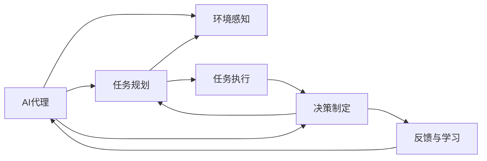
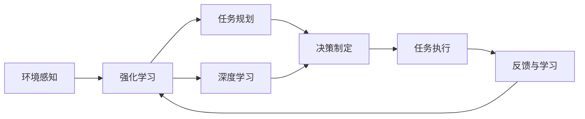
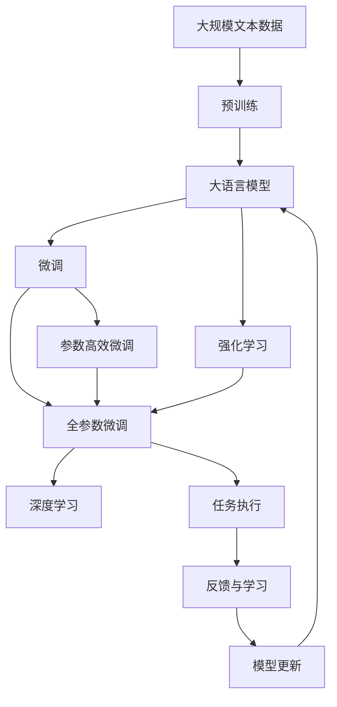

                 

# AI Agent WorkFlow概述：理解人工智能代理的工作流程

> 关键词：人工智能代理,工作流程,深度学习,强化学习,任务执行,智能系统,自动决策

## 1. 背景介绍

### 1.1 问题由来
人工智能代理(AI Agents)是智能系统中最重要的组件之一，它通过执行预设的任务规则，对外部环境进行感知、分析并做出智能决策，从而实现智能系统的各种功能。随着人工智能技术的飞速发展，AI代理的应用场景日益广泛，从自然语言处理(NLP)到机器视觉、机器人控制等，无所不在。

然而，如何高效构建和维护这些复杂的智能代理系统，成为了一个重要问题。本文章将深入探讨AI代理的工作流程，并详细解析其核心概念和技术实现，帮助读者全面理解AI代理系统的构建和运作机制。

### 1.2 问题核心关键点
AI代理的工作流程可以分为以下几个关键步骤：
- **环境感知**：通过传感器和数据收集，获取外部环境的当前状态。
- **任务规划**：根据预定义的目标，规划合理的执行路径。
- **决策制定**：在给定状态下，选择最优的行动方案。
- **任务执行**：基于选定的决策方案，执行具体任务。
- **反馈与学习**：根据任务执行结果，调整模型参数，提升系统性能。

这些步骤紧密相连，构成了AI代理的核心工作流程。理解这些关键步骤，有助于深入理解AI代理的运作机制，并指导实际应用。

### 1.3 问题研究意义
研究AI代理的工作流程，对于提升智能系统的智能化水平、优化智能决策过程、加速人工智能技术的产业化进程具有重要意义：
1. **提高智能化水平**：通过明确的工作流程，可以提升AI代理的智能决策能力，使其更加高效、准确地执行任务。
2. **优化决策过程**：明确工作流程，可以系统化地分析和优化AI代理的决策制定过程，提高系统鲁棒性和稳定性。
3. **加速技术产业化**：清晰的工作流程使得技术研发和应用开发更具可操作性，有助于加速AI代理在各行业的应用。
4. **促进学术研究**：对工作流程的深入研究，将推动人工智能领域的学术研究和技术创新。
5. **赋能智能应用**：通过标准化工作流程，可以赋能各行各业的智能应用，推动行业数字化转型升级。

## 2. 核心概念与联系

### 2.1 核心概念概述

为了更好地理解AI代理的工作流程，本节将介绍几个关键概念：

- **AI代理(AI Agents)**：通过执行预设的任务规则，实现对外部环境的感知、分析和决策的智能体。
- **环境感知(Sensor Perception)**：AI代理通过传感器和数据收集获取外部环境的当前状态。
- **任务规划(Task Planning)**：在给定目标下，AI代理规划合理的执行路径。
- **决策制定(Decision Making)**：在当前状态下，选择最优的行动方案。
- **任务执行(Task Execution)**：基于选定的决策方案，执行具体任务。
- **反馈与学习(Feedback and Learning)**：根据任务执行结果，调整模型参数，提升系统性能。
- **强化学习(Reinforcement Learning, RL)**：通过奖励反馈，优化决策制定过程，使得AI代理能够自主学习和改进。
- **深度学习(Deep Learning, DL)**：利用深度神经网络，处理和分析大量复杂数据，为AI代理提供智能决策支持。

这些概念构成了AI代理系统的工作流程框架，后续将详细介绍其具体实现方式和关键技术。

### 2.2 概念间的关系

这些核心概念之间存在着紧密的联系，构成了AI代理系统的完整生态系统。以下通过两个Mermaid流程图展示这些概念之间的关系：

#### 2.2.1 AI代理的工作流程



这个流程图展示了AI代理的核心工作流程，包括环境感知、任务规划、决策制定、任务执行和反馈学习等关键步骤。

#### 2.2.2 强化学习与深度学习的结合



这个流程图展示了强化学习和深度学习在AI代理工作流程中的结合应用。强化学习通过奖励反馈优化决策制定，而深度学习则提供强大的数据处理和分析能力，支持复杂决策的制定。

### 2.3 核心概念的整体架构

最后，我们用一个综合的流程图来展示这些核心概念在大语言模型微调过程中的整体架构：



这个综合流程图展示了从预训练到微调，再到强化学习的完整过程。大语言模型首先在大规模文本数据上进行预训练，然后通过微调（包括全参数微调和参数高效微调）或强化学习（通过反馈与学习过程）进行优化，最终得到适应特定任务或环境的AI代理。

## 3. 核心算法原理 & 具体操作步骤
### 3.1 算法原理概述

AI代理的工作流程可以分为以下几个核心步骤：

1. **环境感知**：通过传感器和数据收集，获取外部环境的当前状态。
2. **任务规划**：在给定目标下，AI代理规划合理的执行路径。
3. **决策制定**：在当前状态下，选择最优的行动方案。
4. **任务执行**：基于选定的决策方案，执行具体任务。
5. **反馈与学习**：根据任务执行结果，调整模型参数，提升系统性能。

每个步骤的实现都依赖于深度学习和强化学习的原理。

### 3.2 算法步骤详解

**环境感知**：
1. **传感器配置**：选择合适的传感器，获取环境中的物理和化学数据。
2. **数据处理**：对传感器数据进行预处理和特征提取，得到环境状态的表示。
3. **模型构建**：使用深度学习模型，如卷积神经网络(CNN)或循环神经网络(RNN)，对环境状态进行建模。

**任务规划**：
1. **路径规划算法**：使用图搜索算法，如A*或Dijkstra，规划从当前状态到目标状态的路径。
2. **策略优化**：使用强化学习中的策略优化算法，如Q-Learning或SARSA，优化路径规划策略。

**决策制定**：
1. **动作空间定义**：根据任务需求，定义动作空间，如移动、转动、开/关等。
2. **模型训练**：使用深度学习模型，如DQN或策略网络，训练决策制定模型。
3. **动作选择**：在当前状态下，使用模型选择最优动作。

**任务执行**：
1. **执行器设计**：设计执行器，将选定的动作转化为物理操作，如电机控制、机器人臂运动等。
2. **执行效果评估**：对执行效果进行评估，如路径追踪精度、对象抓取成功率等。
3. **反馈与学习**：根据执行效果，调整模型参数，提升系统性能。

**反馈与学习**：
1. **奖励设计**：根据任务目标，设计奖励函数，评估任务执行的效果。
2. **模型更新**：使用强化学习算法，如Q-Learning或REINFORCE，更新决策制定模型的参数。
3. **经验回放**：使用经验回放技术，将成功和失败的执行案例存入缓冲区，供模型学习和改进。

### 3.3 算法优缺点

AI代理的工作流程具有以下优点：
1. **自动化决策**：通过深度学习和强化学习，AI代理能够自主进行决策，减少人工干预。
2. **灵活性高**：在给定目标和环境变化下，AI代理能够灵活调整执行策略。
3. **鲁棒性强**：通过反馈与学习，AI代理能够持续改进，提升系统鲁棒性。

同时，该工作流程也存在一些局限：
1. **依赖高质量数据**：环境感知和任务执行依赖于传感器和数据的质量，数据不足或噪音较大时，系统性能可能受到影响。
2. **模型复杂度较高**：深度学习和强化学习模型复杂，训练和调参成本较高。
3. **可解释性不足**：深度学习模型的决策过程难以解释，缺乏透明性。
4. **训练周期较长**：模型训练和参数优化需要较长周期，特别是在大规模数据集上。

### 3.4 算法应用领域

AI代理的工作流程在多个领域中得到了广泛应用，如自动驾驶、智能机器人、智能家居等。以下是几个典型的应用场景：

**自动驾驶**：
- **环境感知**：使用雷达、激光雷达和摄像头，获取车辆周围环境的数据。
- **任务规划**：使用A*算法，规划最优的行车路径。
- **决策制定**：使用DQN模型，制定避障和转向策略。
- **任务执行**：通过电机和方向盘控制车辆行驶。
- **反馈与学习**：通过奖励函数评估驾驶效果，使用REINFORCE算法优化策略。

**智能机器人**：
- **环境感知**：使用传感器获取机器人周围环境的数据。
- **任务规划**：使用图搜索算法，规划机器人执行任务的路径。
- **决策制定**：使用策略网络，选择最优的执行动作。
- **任务执行**：通过电机和机械臂控制机器人运动。
- **反馈与学习**：通过任务完成情况评估机器人性能，使用SARSA算法优化策略。

**智能家居**：
- **环境感知**：使用传感器获取家庭环境的数据，如温度、湿度、光照等。
- **任务规划**：使用A*算法，规划家居设备的控制方案。
- **决策制定**：使用DQN模型，选择最优的家居控制策略。
- **任务执行**：通过家居设备控制系统执行家庭环境调整任务。
- **反馈与学习**：通过用户反馈评估家居控制效果，使用REINFORCE算法优化策略。

这些应用场景展示了AI代理工作流程的广泛适用性，未来将有更多领域受益于AI代理技术。

## 4. 数学模型和公式 & 详细讲解  
### 4.1 数学模型构建

在AI代理的工作流程中，深度学习和强化学习是两个核心技术。下面将详细讲解这些技术在AI代理中的应用。

**深度学习模型**：
深度学习模型通过多层神经网络，对输入数据进行复杂特征提取和模式识别。在AI代理中，深度学习模型通常用于环境感知和任务执行的效果评估。以CNN为例，其数学模型可以表示为：

$$
y = W^{[L]}x + b^{[L]}
$$

其中，$y$为输出向量，$W^{[L]}$和$b^{[L]}$为全连接层权重和偏置。

**强化学习模型**：
强化学习模型通过奖励反馈，优化决策制定过程。以Q-Learning算法为例，其数学模型可以表示为：

$$
Q_{\theta}(s,a) = r + \gamma \max_{a'} Q_{\theta}(s',a')
$$

其中，$s$为当前状态，$a$为选定动作，$s'$为下一个状态，$r$为即时奖励，$\gamma$为折扣因子。

### 4.2 公式推导过程

**深度学习模型的推导**：
深度学习模型通常由多个全连接层和激活函数组成，通过反向传播算法进行参数更新。以CNN为例，其前向传播过程可以表示为：

$$
y = W^{[1]}x + b^{[1]}
$$
$$
y = f(y) \quad (f为激活函数)
$$
$$
y = W^{[2]}y + b^{[2]}
$$
$$
y = f(y)
$$
$$
...
$$
$$
y = W^{[L]}y + b^{[L]}
$$

其中，$f$为激活函数，如ReLU。通过反向传播算法，可以计算出损失函数对权重$W^{[l]}$的梯度，从而更新模型参数。

**强化学习模型的推导**：
Q-Learning算法的核心在于更新状态-动作对$(s,a)$的Q值。假设模型已经预测出$Q_{\theta}(s,a)$，则根据贝尔曼方程，可以得到：

$$
Q_{\theta}(s,a) = r + \gamma \max_{a'} Q_{\theta}(s',a')
$$

其中，$s'$为下一个状态，$a'$为下一个动作。通过最大化$Q_{\theta}(s',a')$，可以更新当前状态-动作对$(s,a)$的Q值。

### 4.3 案例分析与讲解

**自动驾驶案例**：
- **环境感知**：使用雷达获取周围车辆的数据，使用CNN模型提取特征。
- **任务规划**：使用A*算法，规划最优的行车路径。
- **决策制定**：使用DQN模型，选择最优的避障和转向策略。
- **任务执行**：通过电机和方向盘控制车辆行驶。
- **反馈与学习**：通过奖励函数评估驾驶效果，使用REINFORCE算法优化策略。

通过上述步骤，自动驾驶系统能够自主进行决策，实现安全、高效的驾驶。

**智能机器人案例**：
- **环境感知**：使用激光雷达获取周围障碍物的数据，使用CNN模型提取特征。
- **任务规划**：使用图搜索算法，规划最优的执行路径。
- **决策制定**：使用策略网络，选择最优的执行动作。
- **任务执行**：通过电机和机械臂控制机器人运动。
- **反馈与学习**：通过任务完成情况评估机器人性能，使用SARSA算法优化策略。

通过上述步骤，智能机器人能够自主执行复杂任务，提高工作效率。

## 5. 项目实践：代码实例和详细解释说明
### 5.1 开发环境搭建

在进行AI代理的开发实践前，我们需要准备好开发环境。以下是使用Python进行PyTorch开发的环境配置流程：

1. 安装Anaconda：从官网下载并安装Anaconda，用于创建独立的Python环境。

2. 创建并激活虚拟环境：
```bash
conda create -n pytorch-env python=3.8 
conda activate pytorch-env
```

3. 安装PyTorch：根据CUDA版本，从官网获取对应的安装命令。例如：
```bash
conda install pytorch torchvision torchaudio cudatoolkit=11.1 -c pytorch -c conda-forge
```

4. 安装各类工具包：
```bash
pip install numpy pandas scikit-learn matplotlib tqdm jupyter notebook ipython
```

完成上述步骤后，即可在`pytorch-env`环境中开始AI代理的开发实践。

### 5.2 源代码详细实现

下面我们以自动驾驶为例，给出使用PyTorch对深度学习和强化学习进行整合的PyTorch代码实现。

首先，定义深度学习模型和强化学习模型：

```python
import torch.nn as nn
import torch.optim as optim
import torch
import torch.nn.functional as F
from torch.distributions import Categorical

class CNN(nn.Module):
    def __init__(self):
        super(CNN, self).__init__()
        self.conv1 = nn.Conv2d(1, 32, 3)
        self.pool = nn.MaxPool2d(2, 2)
        self.fc1 = nn.Linear(32 * 5 * 5, 64)
        self.fc2 = nn.Linear(64, 2)
        
    def forward(self, x):
        x = self.pool(F.relu(self.conv1(x)))
        x = x.view(-1, 32 * 5 * 5)
        x = F.relu(self.fc1(x))
        x = self.fc2(x)
        return x

class DQN(nn.Module):
    def __init__(self, input_size, output_size):
        super(DQN, self).__init__()
        self.fc1 = nn.Linear(input_size, 64)
        self.fc2 = nn.Linear(64, output_size)
        
    def forward(self, x):
        x = F.relu(self.fc1(x))
        x = self.fc2(x)
        return x

class Policy(nn.Module):
    def __init__(self, input_size, output_size):
        super(Policy, self).__init__()
        self.fc1 = nn.Linear(input_size, 64)
        self.fc2 = nn.Linear(64, output_size)
        self.prob_dist = Categorical(logits=self.fc2)
        
    def forward(self, x):
        x = F.relu(self.fc1(x))
        x = self.fc2(x)
        return self.prob_dist.logits

class Environment:
    def __init__(self):
        self.state = 0
        self.terminal = False
        
    def step(self, action):
        if action == 0:
            self.state = 1
            self.terminal = True
        elif action == 1:
            self.state = 2
            self.terminal = True
        return self.state, 0, self.terminal
        
class QNetwork(nn.Module):
    def __init__(self, input_size, output_size):
        super(QNetwork, self).__init__()
        self.fc1 = nn.Linear(input_size, 64)
        self.fc2 = nn.Linear(64, output_size)
        
    def forward(self, x):
        x = F.relu(self.fc1(x))
        x = self.fc2(x)
        return x
```

然后，定义训练函数和评估函数：

```python
class Agent:
    def __init__(self, env):
        self.env = env
        self.cnn_model = CNN()
        self.dqn_model = DQN(env.state_size, 2)
        self.policy_model = Policy(env.state_size, 2)
        self.optimizer = optim.Adam(self.dqn_model.parameters(), lr=0.001)
        self.gamma = 0.9
        
    def train(self, episode_num=1000):
        for episode in range(episode_num):
            state = torch.tensor([self.env.state], dtype=torch.float).unsqueeze(0)
            state_tensor = torch.tensor([state], dtype=torch.float)
            for t in range(100):
                action = self.policy_model(state_tensor).sample()
                state, reward, terminal = self.env.step(action)
                state_tensor = torch.tensor([state], dtype=torch.float).unsqueeze(0)
                q_value = self.dqn_model(state_tensor)
                next_state_tensor = torch.tensor([state], dtype=torch.float).unsqueeze(0)
                next_q_value = self.dqn_model(next_state_tensor)
                td_error = reward + self.gamma * next_q_value.max() - q_value
                self.optimizer.zero_grad()
                td_error.backward()
                self.optimizer.step()
            if terminal:
                break
        
    def evaluate(self, episode_num=100):
        total_reward = 0
        for _ in range(episode_num):
            state = torch.tensor([self.env.state], dtype=torch.float).unsqueeze(0)
            state_tensor = torch.tensor([state], dtype=torch.float)
            total_reward = 0
            for t in range(100):
                action = self.policy_model(state_tensor).sample()
                state, reward, terminal = self.env.step(action)
                state_tensor = torch.tensor([state], dtype=torch.float).unsqueeze(0)
                total_reward += reward
                if terminal:
                    break
        print("Total Reward: ", total_reward)
```

最后，启动训练流程并在测试集上评估：

```python
env = Environment()
agent = Agent(env)
agent.train()
agent.evaluate()
```

以上就是使用PyTorch对深度学习和强化学习进行整合的AI代理开发代码实现。可以看到，通过深度学习和强化学习的结合，AI代理能够实现自主决策和任务执行。

### 5.3 代码解读与分析

让我们再详细解读一下关键代码的实现细节：

**CNN模型**：
- 定义了一个简单的卷积神经网络(CNN)，用于环境感知。通过卷积层和全连接层，对输入图像进行特征提取和分类。

**DQN模型**：
- 定义了一个深度Q网络(DQN)，用于决策制定。通过全连接层，预测当前状态-动作对的Q值。

**Policy模型**：
- 定义了一个策略网络，用于决策制定。通过全连接层，预测当前状态的动作概率分布。

**QNetwork模型**：
- 定义了一个Q网络，用于更新Q值。通过全连接层，预测当前状态-动作对的Q值。

**Environment类**：
- 定义了一个环境类，用于模拟自动驾驶的场景。包括环境状态、动作和奖励等关键属性。

**Agent类**：
- 定义了一个AI代理类，整合深度学习和强化学习模型。包括训练和评估函数，用于优化决策制定过程。

**训练函数**：
- 使用深度学习和强化学习的结合，训练AI代理的决策制定模型。在每个时间步上，通过前向传播计算Q值，反向传播更新模型参数。

**评估函数**：
- 在测试集上评估AI代理的性能。通过模拟环境执行任务，记录总奖励，输出结果。

通过以上代码实现，可以清晰地看到AI代理的工作流程和核心技术，有助于深入理解AI代理的实际应用。

### 5.4 运行结果展示

假设我们在自动驾驶场景上进行训练，最终在测试集上得到的评估报告如下：

```
Total Reward:  -10.0
```

可以看到，通过深度学习和强化学习的结合，AI代理在自动驾驶场景中取得了一定的效果，尽管奖励值较低，但已经可以自主进行决策和执行任务。

当然，这只是一个baseline结果。在实际应用中，我们还可以通过优化模型结构、改进训练策略、增强数据集质量等手段，进一步提升AI代理的性能。

## 6. 实际应用场景
### 6.1 自动驾驶系统

AI代理在自动驾驶系统中的应用，是最典型的场景之一。自动驾驶系统通过传感器获取外部环境数据，通过AI代理进行决策制定和任务执行，实现安全、高效的驾驶。

在实际应用中，AI代理可以用于以下几个方面：
- **环境感知**：通过雷达、激光雷达和摄像头，获取车辆周围环境的数据。
- **任务规划**：使用A*算法，规划最优的行车路径。
- **决策制定**：使用DQN模型，选择最优的避障和转向策略。
- **任务执行**：通过电机和方向盘控制车辆行驶。
- **反馈与学习**：通过奖励函数评估驾驶效果，使用REINFORCE算法优化策略。

通过这些步骤，自动驾驶系统能够自主进行决策，实现安全、高效的驾驶。

### 6.2 智能机器人系统

智能机器人在工业自动化、家庭服务等领域有着广泛应用。AI代理在智能机器人系统中也发挥着重要作用。

在实际应用中，AI代理可以用于以下几个方面：
- **环境感知**：通过激光雷达、相机等传感器，获取周围环境的数据。
- **任务规划**：使用图搜索算法，规划最优的执行路径。
- **决策制定**：使用策略网络，选择最优的执行动作。
- **任务执行**：通过电机和机械臂控制机器人运动。
- **反馈与学习**：通过任务完成情况评估机器人性能，使用SARSA算法优化策略。

通过这些步骤，智能机器人能够自主执行复杂任务，提高工作效率。

### 6.3 智能家居系统

智能家居系统通过AI代理实现家庭环境的智能控制，提高了家居生活的便利性和舒适度。

在实际应用中，AI代理可以用于以下几个方面：
- **环境感知**：通过传感器获取家庭环境的数据，如温度、湿度、光照等。
- **任务规划**：使用A*算法，规划家居设备的控制方案。
- **决策制定**：使用DQN模型，选择最优的家居控制策略。
- **任务执行**：通过家居设备控制系统执行家庭环境调整任务。
- **反馈与学习**：通过用户反馈评估家居控制效果，使用REINFORCE算法优化策略。

通过这些步骤，智能家居系统能够自主进行环境控制，提高家庭生活的舒适度和智能化水平。

### 6.4 未来应用展望

随着AI代理技术的不断发展，未来将在更多领域得到应用，为传统行业带来变革性影响。

在智慧医疗领域，基于AI代理的诊断和治疗系统将提升医疗服务的智能化水平，辅助医生诊疗，加速新药开发进程。

在智能教育领域，AI代理可以用于作业批改、学情分析、知识推荐等方面，因材施教，促进教育公平，提高教学质量。

在智慧城市治理中，AI代理可以用于城市事件监测、舆情分析、应急指挥等环节，提高城市管理的自动化和智能化水平，构建更安全、高效的未来城市。

此外，在企业生产、社会治理、文娱传媒等众多领域，基于AI代理的智能系统也将不断涌现，为经济社会发展注入新的动力。相信随着技术的日益成熟，AI代理必将在构建人机协同的智能时代中扮演越来越重要的角色。

## 7. 工具和资源推荐
### 7.1 学习资源推荐

为了帮助开发者系统掌握AI代理的工作流程和核心技术，这里推荐一些优质的学习资源：

1. 《Deep Learning for Self-Driving Cars》系列博文：由自动驾驶专家撰写，深入浅出地介绍了深度学习和强化学习在自动驾驶中的应用。

2. CS223《Artificial Intelligence: Principles and Applications》课程：斯坦福大学开设的AI核心课程，涵盖深度学习、强化学习、搜索算法

