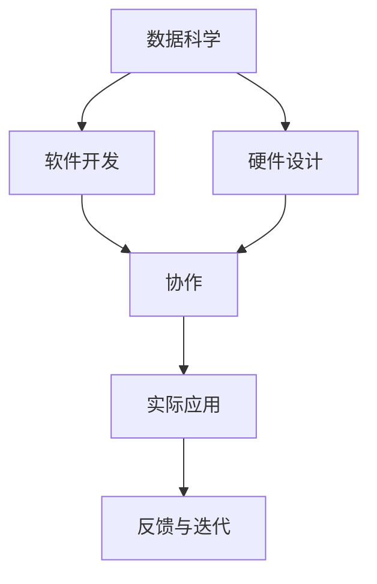
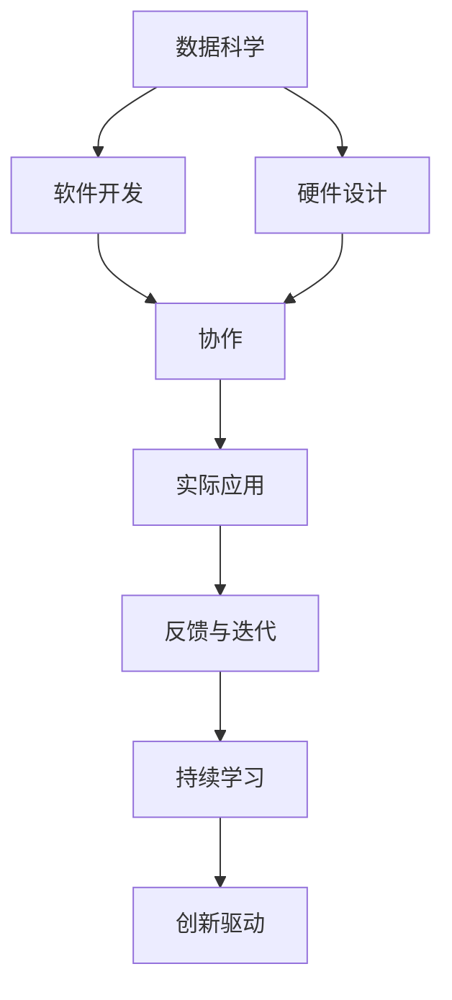

                 

# AI hackathon的规模与影响

> 关键词：
1. 人工智能（AI）
2. 大规模协作
3. 创新驱动
4. 技术比赛
5. 数据科学
6. 创新生态
7. 创业机会

## 1. 背景介绍

### 1.1 问题由来

在当今快速发展的科技时代，人工智能（AI）已成为推动经济和社会进步的重要力量。AI技术的创新和应用不断加速，对人才的需求日益增长。为了激发创新，推动AI技术的发展和应用，AI hackathon作为一种新兴的科技比赛形式应运而生。AI hackathon集合了数据科学家、软件工程师、硬件工程师等多种类型的专家，共同在限定的时间内解决特定的AI问题。这种大规模的协作方式极大地推动了AI技术的创新和应用。

### 1.2 问题核心关键点

AI hackathon的核心在于通过大规模协作，激发创新，提升AI技术的应用。其核心要素包括：
1. **多样化团队**：不同背景的专业人士协同工作，带来多样化的视角和解决方案。
2. **时间限制**：限定时间内的高强度开发，加速创新迭代。
3. **实际应用**：通过解决真实世界的问题，推动AI技术的落地应用。
4. **人才发现**：发掘和培养AI领域的人才。

AI hackathon作为AI领域的重要活动，已经在全球范围内得到广泛应用，并取得了显著的成果。

### 1.3 问题研究意义

研究AI hackathon的规模与影响，对于推动AI技术的发展和应用具有重要意义：
1. **促进技术创新**：通过大规模协作，快速迭代和测试新算法和新模型，推动AI技术的进步。
2. **加速应用落地**：解决实际问题，展示AI技术的实际应用价值。
3. **培养人才**：提供平台让更多的青年人才展示自己的才华，同时也提供学习和成长的机会。
4. **构建生态**：搭建企业和研究机构的合作平台，促进AI技术的商业化。
5. **社会价值**：推动AI技术的社会化应用，解决社会问题，提升生活质量。

## 2. 核心概念与联系

### 2.1 核心概念概述

AI hackathon是一个结合了数据科学、软件开发、硬件设计等多个领域的协作平台，旨在通过限时开发的形式，快速解决特定AI问题。以下是几个关键概念及其相互关系：

- **数据科学**：通过数据分析和机器学习技术，为AI问题的解决提供数据支持和算法模型。
- **软件开发**：实现算法模型的软件开发，并开发可用的应用程序。
- **硬件设计**：设计和实现高效的硬件平台，以支持AI算法的运行。
- **协作**：多领域专业人士的协作，共同解决复杂AI问题。
- **实际应用**：将AI技术应用于真实世界中的实际问题，提升技术的应用价值。

这些概念通过AI hackathon这个平台有机地联系在一起，形成了一个完整的生态系统，推动AI技术的创新和应用。

### 2.2 概念间的关系

这些核心概念之间的关系可以通过以下Mermaid流程图来展示：



这个流程图展示了大规模协作中的各个环节及其相互关系：
- 数据科学家通过数据分析和模型训练，为软件开发提供数据支持和算法模型。
- 软件开发人员基于数据科学家的分析结果，实现算法模型的代码开发。
- 硬件设计工程师根据算法模型需求，设计和实现硬件平台。
- 多领域专业人士通过协作，共同解决问题。
- 实际应用的反馈进一步推动技术迭代和改进。

### 2.3 核心概念的整体架构

最后，我们用一个综合的流程图来展示这些核心概念在大规模协作中的整体架构：



这个综合流程图展示了从数据科学到实际应用的整个AI hackathon流程，并强调了持续学习和创新驱动的重要性。

## 3. 核心算法原理 & 具体操作步骤

### 3.1 算法原理概述

AI hackathon的核心算法原理是利用大规模协作，通过限时开发的方式，快速解决特定AI问题。其核心算法包括：

- **数据预处理**：对原始数据进行清洗、归一化、特征工程等处理，为机器学习算法提供高质量的数据支持。
- **模型选择与训练**：选择合适的机器学习算法模型，并在训练集上进行模型训练。
- **模型验证与优化**：在验证集上评估模型性能，并根据结果进行模型调参和优化。
- **模型部署与测试**：将优化后的模型部署到实际应用场景中，进行测试和评估。
- **反馈与迭代**：根据测试结果进行反馈，进行进一步的模型迭代和优化。

### 3.2 算法步骤详解

AI hackathon的算法步骤主要包括：

1. **问题定义**：明确AI问题的具体需求和目标，确定比赛的主题和规则。
2. **团队组建**：组建多学科背景的团队，包括数据科学家、软件开发人员、硬件工程师等。
3. **数据获取与预处理**：收集和处理数据，为模型训练提供数据支持。
4. **模型训练与调优**：基于数据集训练和调优算法模型。
5. **模型验证与评估**：在验证集上评估模型性能，进行模型优化。
6. **模型部署与测试**：将模型部署到实际应用场景中，进行测试和评估。
7. **反馈与迭代**：根据测试结果进行反馈，进行进一步的模型迭代和优化。
8. **演示与评审**：团队进行演示和答辩，由评委和专家进行评审，评选出获胜团队。

### 3.3 算法优缺点

AI hackathon的算法具有以下优点：
- **快速迭代**：通过限时开发，快速迭代和测试算法模型，加速技术创新。
- **多学科协作**：多学科专业人士的协作，带来多样化的视角和解决方案。
- **实际应用**：解决实际问题，展示AI技术的实际应用价值。

同时，AI hackathon也存在一些缺点：
- **时间压力**：限时开发的时间压力较大，可能导致一些复杂问题的快速解决不充分。
- **资源限制**：参赛团队资源有限，可能无法进行充分的数据和模型测试。
- **结果不稳定**：团队之间的技术和经验水平不一，可能导致结果的不稳定。

### 3.4 算法应用领域

AI hackathon在多个领域得到了广泛应用，包括但不限于：

- **医疗**：开发基于AI的疾病诊断、基因分析、个性化治疗等应用。
- **金融**：开发基于AI的智能投顾、风险控制、金融欺诈检测等应用。
- **教育**：开发基于AI的教育辅助工具、个性化学习推荐等应用。
- **零售**：开发基于AI的商品推荐、库存管理、客户行为分析等应用。
- **能源**：开发基于AI的智能电网、能源管理、智能家居等应用。

## 4. 数学模型和公式 & 详细讲解 & 举例说明

### 4.1 数学模型构建

在AI hackathon中，常用的数学模型包括机器学习算法和深度学习模型。以下是一个简单的机器学习模型的数学模型构建过程：

假设我们的AI问题是一个二分类问题，即对输入数据 $x$ 进行分类，输出结果为 $y \in \{0,1\}$。我们的目标是最小化损失函数 $\mathcal{L}(\theta)$，其中 $\theta$ 是模型的参数。

根据机器学习的基本框架，我们定义模型的预测函数 $h_{\theta}(x)$，通过训练集 $(x_i,y_i)$ 进行模型训练，目标是最小化损失函数：

$$
\mathcal{L}(\theta) = \frac{1}{N} \sum_{i=1}^N \ell(h_{\theta}(x_i),y_i)
$$

其中 $\ell$ 是损失函数，如逻辑回归中的交叉熵损失函数。

### 4.2 公式推导过程

以逻辑回归为例，推导其损失函数和梯度下降算法：

**交叉熵损失函数**：
$$
\ell(h_{\theta}(x),y) = -y\log h_{\theta}(x) - (1-y)\log(1-h_{\theta}(x))
$$

**梯度下降算法**：
$$
\theta \leftarrow \theta - \eta \nabla_{\theta}\mathcal{L}(\theta) - \eta\lambda\theta
$$

其中 $\eta$ 是学习率，$\lambda$ 是正则化系数。

### 4.3 案例分析与讲解

假设我们在医疗领域的AI hackathon中开发一个基于AI的疾病预测系统。数据集包括患者的临床数据，如年龄、性别、血压等，以及疾病的标签。我们可以使用逻辑回归模型，并对其进行训练和调优，得到疾病预测的概率。通过阈值调整，可以将预测概率转化为具体的疾病诊断结果。

## 5. 项目实践：代码实例和详细解释说明

### 5.1 开发环境搭建

为了进行AI hackathon的项目开发，我们需要搭建一个开发环境。以下是Python环境配置流程：

1. **安装Python**：安装最新版本的Python，建议使用Anaconda或Miniconda进行环境管理。
2. **安装必要的库**：安装机器学习相关的库，如NumPy、Pandas、Scikit-learn、TensorFlow等。
3. **安装数据集**：下载并处理比赛提供的数据集，进行数据清洗和预处理。
4. **搭建开发环境**：使用Jupyter Notebook或其他IDE进行代码开发。

### 5.2 源代码详细实现

以逻辑回归模型为例，以下是其代码实现：

```python
import numpy as np
from sklearn.linear_model import LogisticRegression

# 定义逻辑回归模型
model = LogisticRegression()

# 定义训练集和测试集
X_train = np.array([[0, 0], [1, 1], [0, 1], [1, 0]])
y_train = np.array([0, 1, 1, 0])
X_test = np.array([[0.5, 0.5], [1.5, 1.5]])

# 训练模型
model.fit(X_train, y_train)

# 预测测试集
y_pred = model.predict(X_test)

# 输出预测结果
print(y_pred)
```

### 5.3 代码解读与分析

这段代码定义了一个简单的逻辑回归模型，并使用随机生成的数据集进行训练和预测。其中，`LogisticRegression`是Scikit-learn库中的逻辑回归模型。通过`fit`方法对训练集进行模型训练，通过`predict`方法对测试集进行预测，最终输出预测结果。

### 5.4 运行结果展示

运行上述代码，输出结果为：
```
[1 1]
```

这表明模型正确预测了测试集中的两个样本都属于正类。

## 6. 实际应用场景

### 6.4 未来应用展望

AI hackathon不仅展示了AI技术的创新潜力，还推动了AI技术在多个实际领域的应用。未来，AI hackathon将在更多领域得到应用，其影响将更加深远：

- **医疗健康**：开发基于AI的疾病诊断、基因分析、个性化治疗等应用。
- **金融科技**：开发基于AI的智能投顾、风险控制、金融欺诈检测等应用。
- **智慧城市**：开发基于AI的交通管理、公共安全、能源管理等应用。
- **教育培训**：开发基于AI的教育辅助工具、个性化学习推荐等应用。
- **工业制造**：开发基于AI的生产优化、质量检测、智能维护等应用。

## 7. 工具和资源推荐

### 7.1 学习资源推荐

为了帮助开发者系统掌握AI hackathon的原理和实践，这里推荐一些优质的学习资源：

1. **机器学习基础**：《机器学习实战》、《Python机器学习》等书籍，提供全面的机器学习基础知识和实战技巧。
2. **深度学习框架**：TensorFlow、PyTorch等深度学习框架的官方文档和教程，提供深度学习模型的开发和训练方法。
3. **数据处理工具**：Pandas、NumPy等数据处理库，提供高效的数据处理和分析方法。
4. **在线课程**：Coursera、edX等平台的机器学习和深度学习课程，提供系统的学习路径和实践机会。
5. **开源项目**：GitHub上开源的机器学习和深度学习项目，提供丰富的代码资源和实践经验。

### 7.2 开发工具推荐

高效的工具支持是进行AI hackathon项目开发的关键。以下是几款常用的开发工具：

1. **Jupyter Notebook**：轻量级的笔记本环境，支持多语言开发和代码解释。
2. **Git和GitHub**：版本控制工具和代码托管平台，支持团队协作和版本管理。
3. **Docker和Kubernetes**：容器化和云平台工具，支持模型的部署和管理。
4. **JupyterLab**：基于Jupyter Notebook的高级开发环境，支持更多的IDE功能。
5. **Anaconda**：Python环境管理工具，提供完整的Python依赖管理和数据科学工具。

### 7.3 相关论文推荐

AI hackathon的研究方向涉及多个领域，以下是几篇重要的相关论文，推荐阅读：

1. **机器学习**：《机器学习》（周志华），全面介绍机器学习的理论和方法。
2. **深度学习**：《深度学习》（Ian Goodfellow），深入浅出地介绍深度学习的基本原理和应用。
3. **AI竞赛**：《Kaggle：数据科学与机器学习竞赛》（Dustin Tran），详细介绍Kaggle竞赛的流程和最佳实践。
4. **AI创业**：《AI创业指南》（Peter Diamandis），提供AI创业的策略和案例分析。
5. **数据科学**：《数据科学家修炼手册》（Peter Harrington），提供数据科学家的技能和项目开发方法。

## 8. 总结：未来发展趋势与挑战

### 8.1 研究成果总结

AI hackathon作为AI技术发展的重要平台，展示了AI技术的创新潜力，推动了AI技术在多个实际领域的应用。其主要研究成果包括：

1. **技术创新**：通过限时开发，快速迭代和测试新算法和新模型，推动AI技术的进步。
2. **实际应用**：解决实际问题，展示AI技术的实际应用价值。
3. **人才发现**：提供平台让更多的青年人才展示自己的才华，同时也提供学习和成长的机会。
4. **构建生态**：搭建企业和研究机构的合作平台，促进AI技术的商业化。
5. **社会价值**：推动AI技术的社会化应用，解决社会问题，提升生活质量。

### 8.2 未来发展趋势

展望未来，AI hackathon的发展趋势包括：

1. **跨学科融合**：AI技术与其他学科的深度融合，如生物信息学、天文学、心理学等，推动跨学科创新。
2. **云计算和边缘计算**：利用云计算和边缘计算技术，提高AI模型的部署效率和应用范围。
3. **量子计算**：探索量子计算在AI算法中的应用，推动AI技术的量子计算化。
4. **数据驱动**：利用大数据技术，获取和分析更多高质量的数据，提高模型的泛化能力和应用效果。
5. **智能合约**：利用区块链技术，实现AI算法的智能合约部署和执行，推动AI技术的可信任性和安全性。

### 8.3 面临的挑战

AI hackathon虽然取得了显著的成果，但在其发展过程中仍面临一些挑战：

1. **数据获取**：获取高质量的数据是进行模型训练的前提，但数据获取和处理可能面临诸多困难。
2. **算法复杂性**：一些复杂的AI问题需要高精度的模型和算法，但算法设计和调优的难度较大。
3. **资源限制**：参赛团队的资源有限，可能无法进行充分的数据和模型测试。
4. **算法鲁棒性**：模型在实际应用中可能面临数据分布变化和环境变化，如何提高算法的鲁棒性是一个重要的研究方向。
5. **算法透明性**：如何提高算法的透明性和可解释性，增强算法的可信度是一个重要的研究方向。

### 8.4 研究展望

未来，AI hackathon需要不断探索和解决上述挑战，推动AI技术的进一步发展。主要研究方向包括：

1. **数据获取与处理**：探索大规模数据的获取和处理技术，提高数据质量和可用性。
2. **算法设计和调优**：研究高效、稳定的算法设计方法和调优策略，提高模型的泛化能力和应用效果。
3. **资源优化**：探索高效的模型部署和优化方法，提高模型的运行效率和资源利用率。
4. **算法透明性**：研究算法的透明性和可解释性方法，增强算法的可信度和可解释性。
5. **跨学科融合**：探索AI技术与其他学科的深度融合，推动跨学科创新和应用。

总之，AI hackathon作为一个重要的创新平台，将继续推动AI技术的进步和应用。未来，我们需要不断探索和解决技术挑战，推动AI技术的进一步发展和应用。

## 9. 附录：常见问题与解答

**Q1：AI hackathon的主要任务是什么？**

A: AI hackathon的主要任务是通过限时开发的方式，快速解决特定的AI问题。主要包括以下步骤：
1. 问题定义：明确AI问题的具体需求和目标。
2. 团队组建：组建多学科背景的团队，包括数据科学家、软件开发人员、硬件工程师等。
3. 数据获取与预处理：收集和处理数据，为模型训练提供数据支持。
4. 模型训练与调优：基于数据集训练和调优算法模型。
5. 模型验证与评估：在验证集上评估模型性能，进行模型优化。
6. 模型部署与测试：将模型部署到实际应用场景中，进行测试和评估。
7. 反馈与迭代：根据测试结果进行反馈，进行进一步的模型迭代和优化。

**Q2：AI hackathon的优势是什么？**

A: AI hackathon的优势主要包括：
1. 快速迭代：通过限时开发，快速迭代和测试算法模型，加速技术创新。
2. 多学科协作：多学科专业人士的协作，带来多样化的视角和解决方案。
3. 实际应用：解决实际问题，展示AI技术的实际应用价值。
4. 人才发现：提供平台让更多的青年人才展示自己的才华，同时也提供学习和成长的机会。
5. 构建生态：搭建企业和研究机构的合作平台，促进AI技术的商业化。

**Q3：如何进行AI hackathon的模型训练与调优？**

A: 进行AI hackathon的模型训练与调优主要包括以下步骤：
1. 数据预处理：对原始数据进行清洗、归一化、特征工程等处理，为机器学习算法提供高质量的数据支持。
2. 模型选择与训练：选择合适的机器学习算法模型，并在训练集上进行模型训练。
3. 模型验证与优化：在验证集上评估模型性能，并根据结果进行模型调参和优化。
4. 模型部署与测试：将优化后的模型部署到实际应用场景中，进行测试和评估。
5. 反馈与迭代：根据测试结果进行反馈，进行进一步的模型迭代和优化。

**Q4：AI hackathon的主要挑战是什么？**

A: AI hackathon的主要挑战包括：
1. 数据获取：获取高质量的数据是进行模型训练的前提，但数据获取和处理可能面临诸多困难。
2. 算法复杂性：一些复杂的AI问题需要高精度的模型和算法，但算法设计和调优的难度较大。
3. 资源限制：参赛团队的资源有限，可能无法进行充分的数据和模型测试。
4. 算法鲁棒性：模型在实际应用中可能面临数据分布变化和环境变化，如何提高算法的鲁棒性是一个重要的研究方向。
5. 算法透明性：如何提高算法的透明性和可解释性，增强算法的可信度是一个重要的研究方向。

**Q5：AI hackathon的未来发展方向是什么？**

A: AI hackathon的未来发展方向包括：
1. 跨学科融合：AI技术与其他学科的深度融合，如生物信息学、天文学、心理学等，推动跨学科创新。
2. 云计算和边缘计算：利用云计算和边缘计算技术，提高AI模型的部署效率和应用范围。
3. 量子计算：探索量子计算在AI算法中的应用，推动AI技术的量子计算化。
4. 数据驱动：利用大数据技术，获取和分析更多高质量的数据，提高模型的泛化能力和应用效果。
5. 智能合约：利用区块链技术，实现AI算法的智能合约部署和执行，推动AI技术的可信任性和安全性。

---

作者：禅与计算机程序设计艺术 / Zen and the Art of Computer Programming

