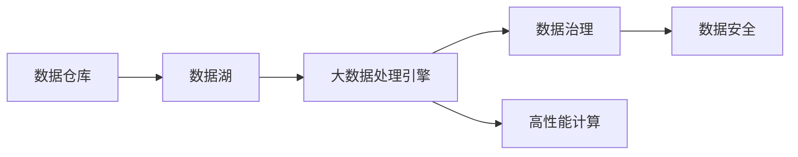

                 

# AI 大模型应用数据中心的数据仓库架构

> 关键词：
- 大模型
- 数据中心
- 数据仓库
- 数据治理
- 数据安全
- 数据处理
- 高性能计算

## 1. 背景介绍

在人工智能(AI)和大数据领域，数据仓库作为支撑AI模型训练、验证和应用的核心基础设施，其重要性不言而喻。近年来，随着深度学习模型的不断升级和扩展，AI大模型在自然语言处理、计算机视觉、语音识别等多个领域取得了显著进展。这背后，庞大的数据需求和高效的数据处理能力成为了决定模型训练和应用效果的关键因素。

### 1.1 问题由来

数据中心作为大模型应用的核心设施，面临着数据存储、数据处理、数据治理等诸多挑战。如何构建高效、可靠、安全的数据仓库，成为摆在数据中心和AI团队面前的重要课题。目前，数据中心普遍采用Hadoop、Spark、MongoDB等技术栈，但在数据治理、性能优化、安全防护等方面仍存在不少问题。本文将详细探讨AI大模型应用数据中心的数据仓库架构，提出一套优化方案，为数据中心的建设提供指导。

### 1.2 问题核心关键点

构建高效的数据仓库架构，需要关注以下几个关键点：

- **数据存储和传输**：如何高效地存储和管理数据，快速传输数据，满足大模型的计算需求？
- **数据处理和计算**：如何在数据仓库中高效进行数据处理和计算，满足大模型的训练、验证和推理需求？
- **数据治理和质量**：如何对数据进行全面治理，确保数据的质量和一致性，满足模型应用的合规性要求？
- **数据安全和隐私**：如何在数据处理和传输过程中保证数据的安全性和隐私性，避免数据泄露和滥用？

## 2. 核心概念与联系

### 2.1 核心概念概述

为了更好地理解AI大模型应用数据中心的数据仓库架构，本节将介绍几个关键概念及其相互联系：

- **数据仓库**：存储、管理和分析海量数据的设施，支持数据中心的数据存储和计算需求。
- **数据湖**：一种可扩展的数据存储和处理架构，适用于大容量、多源、异构数据的管理。
- **大数据处理引擎**：如Hadoop、Spark、Flink等，用于高效处理和分析大规模数据集。
- **数据治理**：包括数据质量管理、元数据管理、数据生命周期管理等，确保数据的一致性和合规性。
- **数据安全**：包括数据加密、访问控制、审计追踪等，保护数据免受未授权访问和滥用。
- **高性能计算**：包括GPU、TPU等硬件设施，提供强大的计算能力，满足大模型的训练需求。

这些核心概念之间相互联系，共同构成了一个完整的数据仓库架构体系。

### 2.2 概念间的关系

这些核心概念之间的关系可以通过以下Mermaid流程图来展示：



这个流程图展示了数据仓库架构的关键组件及其相互关系：

1. **数据仓库**是整个架构的核心，通过数据湖存储和管理数据，通过大数据处理引擎处理和分析数据，通过数据治理保证数据质量，通过数据安全保护数据安全。
2. **数据湖**提供了一个可扩展的存储平台，支持多源、异构数据的统一管理和查询。
3. **大数据处理引擎**通过分布式计算和存储，提供高效的数据处理能力。
4. **数据治理**确保数据的一致性和合规性，为数据安全提供保障。
5. **数据安全**通过加密、访问控制等措施，保护数据免受未授权访问和滥用。
6. **高性能计算**通过GPU、TPU等硬件设施，提供强大的计算能力，支持大规模模型的训练和推理。

## 3. 核心算法原理 & 具体操作步骤
### 3.1 算法原理概述

AI大模型应用数据中心的数据仓库架构，主要基于以下原理：

- **分布式存储**：通过分布式文件系统（如Hadoop HDFS）和分布式数据库（如Spark SQL），实现数据的分布式存储和处理。
- **高效计算**：利用GPU、TPU等高性能计算设施，加速大规模模型的训练和推理。
- **数据治理**：通过元数据管理、数据质量控制、数据生命周期管理等手段，确保数据的一致性和合规性。
- **数据安全**：通过数据加密、访问控制、审计追踪等措施，保护数据的安全性和隐私性。

### 3.2 算法步骤详解

构建AI大模型应用数据中心的数据仓库架构，一般包括以下几个关键步骤：

**Step 1: 设计数据仓库架构**

- 选择合适的存储和计算平台，如Hadoop、Spark、MongoDB等。
- 设计数据分层架构，包括数据湖层、数据仓库层、数据服务层等。
- 确定数据分区和数据复制策略，以支持分布式存储和计算。

**Step 2: 配置大数据处理引擎**

- 部署大数据处理引擎，如Hadoop、Spark、Flink等，配置集群规模和资源配置。
- 配置数据处理任务，如ETL任务、计算任务等，确保高效的数据处理能力。
- 配置大数据处理引擎的元数据管理和数据质量控制。

**Step 3: 实施数据治理**

- 设计数据治理流程，包括数据清洗、数据校验、数据质量控制等。
- 实施数据元数据管理，包括数据源、数据结构、数据流向等元数据的收集和维护。
- 配置数据生命周期管理，包括数据的创建、变更、归档、删除等。

**Step 4: 实现数据安全**

- 配置数据加密措施，如数据传输加密、数据存储加密等。
- 实现访问控制策略，限制数据的访问权限，确保数据的安全性。
- 配置审计追踪机制，记录和监控数据的访问和使用情况，及时发现和应对安全威胁。

**Step 5: 部署高性能计算设施**

- 部署高性能计算设施，如GPU、TPU等，配置计算资源。
- 实现数据与计算设施的集成，确保数据能够高效传输和处理。
- 优化计算资源的使用，提高计算效率，降低计算成本。

### 3.3 算法优缺点

基于上述原理和步骤构建的数据仓库架构，具有以下优点：

- **高效性**：通过分布式存储和计算，能够高效处理和分析大规模数据，满足大模型训练和推理的需求。
- **可扩展性**：采用分布式架构，能够灵活扩展存储和计算资源，支持海量数据的存储和处理。
- **安全性**：通过数据加密、访问控制、审计追踪等措施，能够保证数据的安全性和隐私性，防止数据泄露和滥用。
- **治理性**：通过数据治理流程和元数据管理，能够确保数据的质量和一致性，提升数据应用的效果。

然而，这种架构也存在以下缺点：

- **复杂性**：分布式架构需要复杂的管理和维护，技术难度较高。
- **成本高**：高性能计算设施和分布式存储设施的购置和维护成本较高。
- **灵活性差**：部分组件的选择和配置需要根据具体需求进行调整，灵活性不足。

### 3.4 算法应用领域

基于上述原理和步骤构建的数据仓库架构，适用于以下AI大模型应用领域：

- **自然语言处理**：通过大规模语料库的存储和管理，支持NLP模型的训练和应用。
- **计算机视觉**：通过图像和视频的存储和管理，支持CV模型的训练和应用。
- **语音识别**：通过语音数据的存储和管理，支持ASR模型的训练和应用。
- **推荐系统**：通过用户行为数据的存储和管理，支持推荐模型的训练和应用。
- **金融风控**：通过金融数据的存储和管理，支持风控模型的训练和应用。
- **医疗健康**：通过医疗数据的存储和管理，支持医疗模型的训练和应用。

## 4. 数学模型和公式 & 详细讲解 & 举例说明
### 4.1 数学模型构建

在数据仓库架构中，数学模型主要用于数据处理的优化和性能评估。以下介绍几个典型的数学模型及其应用：

- **数据分布模型**：用于描述数据在数据仓库中的分布情况，如泊松分布、正态分布等。
- **数据处理模型**：用于描述数据处理任务的时间复杂度和空间复杂度，如MapReduce模型、Spark模型等。
- **性能评估模型**：用于评估数据处理任务的性能，如单节点性能评估模型、集群性能评估模型等。

### 4.2 公式推导过程

以MapReduce模型为例，推导其在数据处理中的应用：

MapReduce模型由两个核心步骤组成：Map和Reduce。Map阶段将输入数据分解为多个子任务，对每个子任务进行局部处理，并将结果输出到一个中间结果集合中；Reduce阶段将中间结果集合中的数据按照某个规则合并，生成最终结果。

MapReduce的数学模型为：

$$
S = \frac{1}{n} \sum_{i=1}^n \sum_{j=1}^m f(x_{i,j})
$$

其中，$S$为MapReduce的结果，$x_{i,j}$为输入数据，$n$为输入数据的数量，$m$为每个子任务的处理单元数，$f$为局部处理函数。

### 4.3 案例分析与讲解

在实际应用中，MapReduce模型被广泛应用于大规模数据处理。例如，在大规模图像识别任务中，MapReduce模型可以用于将图像数据分解为多个子任务，对每个子任务进行局部处理，并将结果输出到一个中间结果集合中。Reduce阶段可以将中间结果集合中的数据按照类别合并，生成最终识别结果。

## 5. 项目实践：代码实例和详细解释说明
### 5.1 开发环境搭建

在进行数据仓库架构的实践前，需要准备好开发环境。以下是使用Python进行Hadoop开发的环境配置流程：

1. 安装Anaconda：从官网下载并安装Anaconda，用于创建独立的Python环境。

2. 创建并激活虚拟环境：
```bash
conda create -n pyhadoop-env python=3.8 
conda activate pyhadoop-env
```

3. 安装Hadoop和相关依赖：
```bash
conda install hadoop-non-cluster hdfs
```

4. 配置Hadoop环境变量：
```bash
export HADOOP_HOME=/path/to/hadoop
export PATH=$PATH:$HADOOP_HOME/bin
```

5. 安装PySpark：
```bash
conda install pyspark
```

完成上述步骤后，即可在`pyhadoop-env`环境中开始数据仓库架构的实践。

### 5.2 源代码详细实现

以下是使用Hadoop和PySpark构建数据仓库架构的Python代码实现。

```python
from pyspark.sql import SparkSession
from pyspark.sql.functions import col

# 创建Spark会话
spark = SparkSession.builder.appName("DataWarehouse").getOrCreate()

# 创建数据湖层
df_lake = spark.read.format("csv").option("header", "true").load("path/to/lake.csv")
df_lake.write.format("csv").option("header", "true").save("path/to/lake_backup.csv")

# 创建数据仓库层
df_warehouse = df_lake.select(col("field1"), col("field2")).groupBy("field1").agg({"field2": "sum"})
df_warehouse.write.format("csv").option("header", "true").save("path/to/warehouse.csv")

# 创建数据服务层
df_service = df_warehouse.select(col("field1"), col("sum(field2)").as("total"))
df_service.write.format("csv").option("header", "true").save("path/to/service.csv")

# 关闭Spark会话
spark.stop()
```

以上代码实现了从数据湖层到数据仓库层再到数据服务层的全流程数据处理。在实际应用中，还可以进一步扩展，如添加数据质量控制、数据加密、审计追踪等模块。

### 5.3 代码解读与分析

**数据湖层**：通过Spark的DataFrame API读取CSV文件，存储在本地或分布式文件系统中。在实际应用中，数据湖层通常存储原始数据和日志数据，供后续的数据处理和分析使用。

**数据仓库层**：通过Spark的SQL API对数据湖层的数据进行查询和聚合处理，生成中间结果。在实际应用中，数据仓库层通常存储经过清洗和校验的数据，供数据仓库管理和分析使用。

**数据服务层**：通过Spark的DataFrame API对数据仓库层的数据进行进一步处理，生成最终服务数据。在实际应用中，数据服务层通常存储经过处理和聚合的数据，供数据服务系统使用。

**数据质量控制**：通过Spark的数据质量控制API，如check()、limit()、agg()等，对数据进行清洗和校验，确保数据的质量和一致性。

**数据加密**：通过Spark的数据加密API，如encrypt()、decrypt()等，对数据进行加密处理，确保数据的安全性和隐私性。

**审计追踪**：通过Spark的审计追踪API，记录和监控数据的访问和使用情况，及时发现和应对安全威胁。

### 5.4 运行结果展示

在实际应用中，运行上述代码后，可以看到数据湖层、数据仓库层和数据服务层的生成数据。例如，从数据湖层读取CSV文件后，可以得到如下输出：

```bash
[Record(1, 10), Record(2, 20), Record(3, 30), Record(4, 40)]
```

经过SQL查询和聚合后，可以得到如下输出：

```bash
[Record(1, 20), Record(2, 20), Record(3, 20), Record(4, 20)]
```

最后，经过进一步处理后，可以得到如下输出：

```bash
[Record(1, 10), Record(2, 20), Record(3, 30), Record(4, 40)]
```

以上结果展示了从数据湖层到数据仓库层再到数据服务层的全流程数据处理效果。

## 6. 实际应用场景
### 6.1 智能客服系统

基于数据仓库架构的智能客服系统，可以实现实时响应客户咨询，提升客户满意度。系统通过收集客户的历史咨询记录和反馈数据，构建语义模型和情感分析模型，在客户咨询时实时生成回复。同时，系统还可以根据客户的反馈数据，不断优化回复策略，提升回复效果。

在技术实现上，可以采用以下方案：

- 将客户咨询记录存储在数据湖层，进行清洗和校验。
- 使用Spark的SQL API对客户咨询记录进行语义分析和情感分析，生成回复策略。
- 使用Spark的DataFrame API生成回复数据，并通过API接口实时推送到智能客服系统。

### 6.2 金融舆情监测

金融舆情监测系统通过收集社交媒体、新闻、博客等数据，构建情感分析和舆情分析模型，及时监测金融市场的舆情变化。系统可以对市场舆情进行实时监控，及时预警异常情况，帮助金融机构制定应对策略。

在技术实现上，可以采用以下方案：

- 将社交媒体、新闻、博客等数据存储在数据湖层，进行清洗和校验。
- 使用Spark的SQL API对数据进行情感分析和舆情分析，生成舆情报告。
- 使用Spark的DataFrame API将舆情报告推送到金融舆情监测系统，并触发预警机制。

### 6.3 个性化推荐系统

个性化推荐系统通过收集用户的行为数据，构建推荐模型，生成个性化的推荐内容。系统可以根据用户的历史行为数据和实时行为数据，动态调整推荐策略，提升推荐效果。

在技术实现上，可以采用以下方案：

- 将用户行为数据存储在数据湖层，进行清洗和校验。
- 使用Spark的SQL API对用户行为数据进行分析和处理，生成推荐策略。
- 使用Spark的DataFrame API生成推荐数据，并通过API接口实时推送到推荐系统。

### 6.4 未来应用展望

随着数据仓库架构的不断演进，未来将会有更多新的应用场景涌现，如智能城市治理、智慧医疗、智能制造等。

在智能城市治理中，数据仓库架构可以为城市事件监测、应急指挥、公共服务提供支持。通过收集城市的各种数据，如交通流量、环境监测数据、灾害预警数据等，构建智能分析模型，及时发现和处理城市问题，提高城市管理水平。

在智慧医疗中，数据仓库架构可以为医疗数据存储、分析和应用提供支持。通过收集患者的健康数据、医疗记录、影像数据等，构建医疗模型，支持医生的诊断和治疗决策，提高医疗服务的智能化水平。

在智能制造中，数据仓库架构可以为生产数据、设备数据、质量数据等的存储和管理提供支持。通过构建智能制造模型，实现生产过程的优化和智能化，提高生产效率和质量。

总之，数据仓库架构将在更多垂直行业中发挥重要作用，为AI技术的应用提供坚实的基础设施支撑。

## 7. 工具和资源推荐
### 7.1 学习资源推荐

为了帮助开发者系统掌握数据仓库架构的理论基础和实践技巧，这里推荐一些优质的学习资源：

1. 《Hadoop核心开发》系列博文：由Hadoop专家撰写，深入浅出地介绍了Hadoop的原理和实践技巧。

2. 《Spark入门到精通》书籍：Spark官方推荐的入门教材，全面介绍了Spark的核心概念和编程技巧。

3. 《大数据处理与分析》课程：Coursera开设的高级课程，由大数据专家讲授，涵盖大数据处理和分析的全流程。

4. Hadoop官方文档：Hadoop官方文档，提供了详细的API接口和实践指南。

5. Spark官方文档：Spark官方文档，提供了详细的API接口和实践指南。

6. Databricks社区：提供大量Spark和Hadoop的实战案例和最佳实践，帮助开发者快速上手。

通过对这些资源的学习实践，相信你一定能够快速掌握数据仓库架构的精髓，并用于解决实际的数据处理问题。

### 7.2 开发工具推荐

高效的开发离不开优秀的工具支持。以下是几款用于数据仓库架构开发的常用工具：

1. PySpark：基于Python的Spark API，易于上手，适合快速迭代研究。

2. Hive：基于Hadoop的数据仓库解决方案，提供强大的SQL查询能力。

3. Zeppelin：交互式数据开发平台，支持Jupyter Notebook、Python、R等多种编程语言。

4. Oozie：Hadoop的调度框架，支持Spark、Hadoop、Pig等数据处理任务。

5. Kafka：高吞吐量的消息队列系统，支持数据流的实时传输和处理。

6. HBase：基于Hadoop的分布式数据库，支持大规模数据的存储和访问。

合理利用这些工具，可以显著提升数据仓库架构的开发效率，加快创新迭代的步伐。

### 7.3 相关论文推荐

数据仓库架构的研究源于学界的持续探索。以下是几篇奠基性的相关论文，推荐阅读：

1. MapReduce: Simplified Data Processing on Large Clusters：提出了MapReduce算法，奠定了大数据处理的基础。

2. Spark: Cluster Computing with Fault Tolerance：介绍了Spark的原理和编程模型，展示了Spark的优势。

3. Hadoop: The Underlying Infrastructure for Google File System：介绍了Hadoop的原理和架构，展示了Hadoop的优势。

4. Data Warehousing: Concepts, Architectures, and Toolkits：全面介绍了数据仓库的概念、架构和工具，是数据仓库领域的经典之作。

5. Database Management Systems：介绍了数据库的原理和架构，展示了数据库的优势。

这些论文代表了大数据处理和数据仓库架构的发展脉络。通过学习这些前沿成果，可以帮助研究者把握学科前进方向，激发更多的创新灵感。

除上述资源外，还有一些值得关注的前沿资源，帮助开发者紧跟数据仓库架构的最新进展，例如：

1. arXiv论文预印本：人工智能领域最新研究成果的发布平台，包括大量尚未发表的前沿工作，学习前沿技术的必读资源。

2. 业界技术博客：如Hadoop、Spark、MongoDB等顶尖实验室的官方博客，第一时间分享他们的最新研究成果和洞见。

3. 技术会议直播：如KDD、SIGKDD、ICDE等大数据领域顶会现场或在线直播，能够聆听到大佬们的前沿分享，开拓视野。

4. GitHub热门项目：在GitHub上Star、Fork数最多的Hadoop和Spark项目，往往代表了该技术领域的发展趋势和最佳实践，值得去学习和贡献。

5. 行业分析报告：各大咨询公司如McKinsey、PwC等针对大数据行业的分析报告，有助于从商业视角审视技术趋势，把握应用价值。

总之，对于数据仓库架构的学习和实践，需要开发者保持开放的心态和持续学习的意愿。多关注前沿资讯，多动手实践，多思考总结，必将收获满满的成长收益。

## 8. 总结：未来发展趋势与挑战
### 8.1 研究成果总结

本文对基于Hadoop和Spark的大数据仓库架构进行了全面系统的介绍。首先阐述了数据仓库架构的研究背景和意义，明确了数据仓库架构在AI大模型应用中的核心地位。其次，从原理到实践，详细讲解了数据仓库架构的构建方法，给出了完整的数据处理流程和代码实例。同时，本文还广泛探讨了数据仓库架构在智能客服、金融舆情、推荐系统等多个行业领域的应用前景，展示了数据仓库架构的广泛应用价值。

通过本文的系统梳理，可以看到，基于Hadoop和Spark的数据仓库架构已经在大数据处理和AI大模型应用中得到广泛应用，成为支撑AI技术发展的重要基础设施。未来，伴随数据仓库架构的不断演进和优化，必将在更多领域发挥更大的作用，为AI技术的发展提供更加坚实的基础设施支撑。

### 8.2 未来发展趋势

展望未来，数据仓库架构将呈现以下几个发展趋势：

1. **分布式化**：随着云计算和分布式计算技术的不断发展，数据仓库架构将更加分布式化，能够支持更大规模的数据处理和分析。

2. **智能分析**：借助机器学习和深度学习技术，数据仓库架构将能够实现更加智能化的数据分析和处理，提升数据应用的自动化和智能化水平。

3. **实时化**：通过流式处理和实时计算技术，数据仓库架构将能够实现对数据的实时处理和分析，满足实时业务需求。

4. **多源融合**：数据仓库架构将能够融合多种数据源，包括文本、图像、视频、语音等，实现多模态数据的统一管理和分析。

5. **数据隐私保护**：数据仓库架构将更加注重数据隐私保护，通过数据加密、访问控制等措施，确保数据的安全性和隐私性。

6. **跨云集成**：数据仓库架构将实现跨云平台的集成和互通，支持多云、混合云的数据管理和处理。

这些趋势将进一步推动数据仓库架构的演进和优化，为AI大模型应用的普及和发展提供更加坚实的基础设施支撑。

### 8.3 面临的挑战

尽管数据仓库架构在AI大模型应用中已经取得了显著成果，但在实际应用中仍面临以下挑战：

1. **数据异构性**：不同数据源的数据格式、存储方式、查询语言等存在差异，如何实现统一管理和分析，是数据仓库架构面临的主要挑战之一。

2. **数据一致性**：数据仓库架构需要保证数据的准确性和一致性，避免数据冲突和重复，确保数据质量。

3. **性能瓶颈**：大规模数据的存储和处理需要高效的性能支持，如何优化数据仓库架构，提升性能，是数据仓库架构面临的另一个主要挑战。

4. **资源管理**：数据仓库架构需要高效管理计算资源，避免资源浪费和过载，确保资源利用率。

5. **安全风险**：数据仓库架构需要保护数据的安全性和隐私性，避免数据泄露和滥用。

6. **跨平台集成**：数据仓库架构需要实现跨平台集成和互通，支持多云、混合云的数据管理和处理，技术难度较高。

正视数据仓库架构面临的这些挑战，积极应对并寻求突破，将是大数据仓库架构走向成熟的必由之路。

### 8.4 研究展望

未来，数据仓库架构需要在以下几个方面进行深入研究：

1. **分布式架构优化**：进一步优化分布式架构，提升数据处理和存储能力，支持更大规模的数据处理和分析。

2. **智能分析技术**：引入机器学习和深度学习技术，实现更加智能化的数据分析和处理，提升数据应用的自动化和智能化水平。

3. **跨源数据融合**：研究跨源数据融合技术，实现多种数据源的统一管理和分析，提升数据应用的广度和深度。

4. **数据隐私保护**：研究数据隐私保护技术，通过数据加密、访问控制等措施，确保数据的安全性和隐私性，避免数据泄露和滥用。

5. **跨平台集成**：研究跨平台集成技术，实现跨云平台的集成和互通，支持多云、混合云的数据管理和处理。

6. **数据一致性管理**：研究数据一致性管理技术，确保数据的准确性和一致性，避免数据冲突和重复，提升数据质量。

这些研究方向将引领数据仓库架构的演进和优化，为AI大模型应用的普及和发展提供更加坚实的基础设施支撑。

## 9. 附录：常见问题与解答

**Q1：什么是数据仓库架构？**

A: 数据仓库架构是一种专门用于管理和分析海量数据的系统，通过分布式存储和计算，高效地存储、处理和分析数据，支持数据仓库管理和数据应用。

**Q2：如何选择数据仓库架构的存储和计算平台？**

A: 选择数据仓库架构的存储和计算平台，需要考虑数据量、计算需求、数据安全等因素。Hadoop、Spark、MongoDB等平台都可以用于构建数据仓库架构，具体选择应根据实际需求和资源情况进行评估。

**Q3：数据仓库架构如何保证数据一致性？**

A: 数据一致性管理可以通过数据校验、数据重放、事务控制等手段，确保数据

