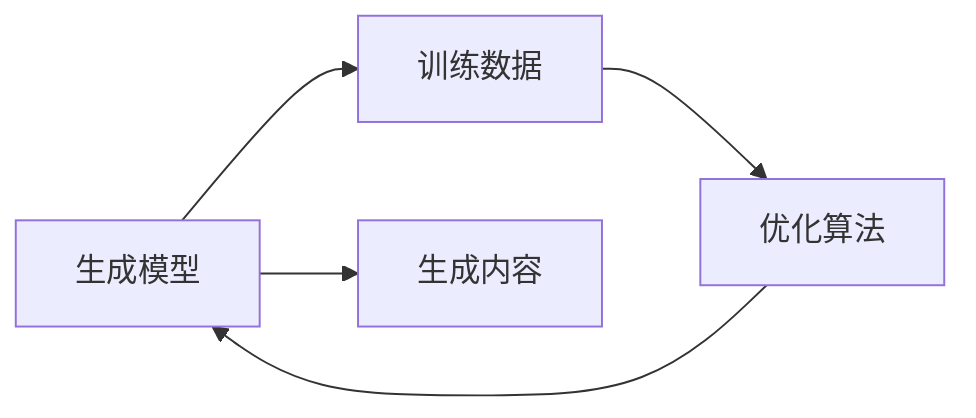

                 

# AIGC从入门到实战：基建：人工智能时代的变迁

## 1. 背景介绍

在人工智能（AI）的时代变迁中，人工智能生成内容（AIGC）正成为驱动AI发展的重要力量。AIGC以其独特的创造力和潜力，正在逐渐改变我们获取信息、创作内容乃至思考问题的方式。本文将从AIGC的发展历史、核心概念、以及当下最热门的应用场景出发，带你深入了解这一技术的起源、现状和未来趋势。

### 1.1 人工智能与生成内容的历史

人工智能的种子最早可以追溯到上世纪50年代，当时的专家们已经在使用简单的逻辑规则和统计模型来模拟人类的思维过程。然而，直到1990年代，随着深度学习等技术的兴起，AI才迎来了真正的爆发。深度学习技术利用神经网络模拟人脑处理信息的方式，使AI系统能够处理海量数据并从中提取特征，从而进行图像识别、语音识别、自然语言处理等任务。

生成内容作为AI的重要分支，其历史同样悠久。1990年代初，Mark Hammond和David Lowe利用深度学习技术开发了世界上第一个文本生成系统BIBABY，开启了文本生成技术的序章。此后，随着技术的进步和应用场景的拓展，生成内容逐渐演变为一个独立且快速发展的领域。

### 1.2 AIGC技术的核心

AIGC技术的核心在于使用AI技术自动生成具有高度创造性的内容。AIGC不仅包括文本生成，还涵盖了音乐、绘画、视频等多个领域。其背后的原理是利用大数据、深度学习等技术，学习输入数据中的模式和结构，并基于这些模式生成新的内容。AIGC技术的崛起，得益于以下几个关键因素：

1. **计算能力的提升**：随着计算硬件的不断进步，尤其是GPU、TPU等加速芯片的普及，深度学习模型的训练速度和处理能力得到了极大的提升。

2. **数据量的增加**：互联网的普及和社交媒体的兴起，使得海量的数据资源成为可能，为AIGC技术提供了丰富的素材。

3. **算法和模型的创新**：深度学习算法不断优化，新的模型架构（如GPT、BERT等）不断涌现，使得生成内容的质量和多样性不断提升。

4. **应用的拓展**：AIGC技术从文本生成逐步扩展到音乐、绘画、视频等多个领域，开启了更广阔的创意应用空间。

## 2. 核心概念与联系

### 2.1 核心概念概述

AIGC技术的核心概念主要包括生成模型、训练数据、优化算法等。这些概念构成了AIGC技术的基础框架，并通过相互配合，实现了内容的自动化生成。

- **生成模型**：AIGC技术的核心组件，通常基于神经网络等模型，通过学习输入数据中的模式和结构，生成新的内容。

- **训练数据**：用于训练生成模型的数据集，数据集的质量和多样性直接影响生成内容的质量和多样性。

- **优化算法**：用于训练生成模型的算法，通过不断调整模型参数，使得生成模型在给定的数据集上表现最佳。

### 2.2 概念间的关系

AIGC技术通过这些核心概念的相互配合，实现了内容的自动化生成。下面使用Mermaid流程图来展示这些概念之间的关系：



该流程图展示了生成模型通过训练数据和优化算法的训练，最终生成高质量内容的过程。其中，训练数据是生成模型的输入，优化算法通过调整模型参数，使得生成模型在训练数据上表现最佳，从而生成高质量的内容。

## 3. 核心算法原理 & 具体操作步骤

### 3.1 算法原理概述

AIGC技术的核心算法通常基于神经网络，通过学习输入数据中的模式和结构，自动生成新的内容。这一过程可以分为以下几个步骤：

1. **数据预处理**：将输入数据进行标准化处理，如文本清洗、数据标注等，以便于模型训练。

2. **模型训练**：使用训练数据对生成模型进行训练，通过优化算法调整模型参数，使得生成模型能够准确地从输入数据中提取特征，并生成新的内容。

3. **内容生成**：利用训练好的生成模型，对新的输入数据进行生成，得到高质量的输出内容。

### 3.2 算法步骤详解

以下以文本生成为例，介绍AIGC技术的具体操作步骤：

**Step 1: 数据预处理**

- 文本清洗：去除输入文本中的噪声，如标点符号、数字、特殊字符等。

- 数据标注：将输入文本进行分词，并标注每个词的词性、位置等特征。

- 数据标准化：将输入文本转化为模型所需的格式，如向量化表示。

**Step 2: 模型训练**

- 选择合适的生成模型，如GPT、BERT等。

- 选择合适的优化算法，如Adam、SGD等。

- 设置训练参数，如学习率、批次大小、迭代轮数等。

- 使用训练数据对模型进行训练，不断调整模型参数，使得生成模型能够准确地从输入数据中提取特征。

**Step 3: 内容生成**

- 使用训练好的生成模型，对新的输入数据进行生成，得到高质量的输出内容。

### 3.3 算法优缺点

AIGC技术的优点包括：

1. **高效生成**：AIGC技术能够自动生成高质量的内容，显著提高了内容创作的速度和效率。

2. **成本低廉**：相比于传统的内容创作，AIGC技术不需要投入大量人力和时间，成本较低。

3. **多样性**：AIGC技术可以生成多样化的内容，能够满足不同用户的需求。

4. **个性化**：AIGC技术可以根据用户需求进行个性化定制，生成符合用户期望的内容。

然而，AIGC技术也存在一些缺点：

1. **缺乏创意性**：AIGC技术虽然能够生成大量内容，但其生成的内容往往缺乏原创性，容易出现重复和模式化。

2. **伦理和安全问题**：AIGC技术生成的内容可能包含偏见、有害信息等，存在一定的伦理和安全风险。

3. **模型的局限性**：AIGC技术的生成质量受限于模型的复杂度和训练数据的数量和质量。

4. **缺乏人机交互**：AIGC技术缺乏真正意义上的“人机交互”，难以理解人类情感和上下文信息。

### 3.4 算法应用领域

AIGC技术在多个领域得到了广泛应用，主要包括：

1. **内容创作**：如文章、报告、广告、音乐等内容的自动化生成。

2. **娱乐和游戏**：如生成虚拟角色对话、虚拟游戏场景等。

3. **教育和培训**：如自动生成教学材料、练习题等。

4. **客服和支持**：如自动生成客户服务对话、技术支持文档等。

5. **金融和保险**：如生成财务报告、保险条款等。

## 4. 数学模型和公式 & 详细讲解 & 举例说明

### 4.1 数学模型构建

在文本生成中，我们通常使用编码器-解码器（Encoder-Decoder）框架，其中编码器将输入文本转化为向量表示，解码器则根据向量生成新的文本。

设输入文本为 $x = (x_1, x_2, \cdots, x_n)$，输出文本为 $y = (y_1, y_2, \cdots, y_m)$，则文本生成的目标是最小化损失函数：

$$
\mathcal{L}(x, y) = -\frac{1}{m} \sum_{i=1}^{m} \log p(y_i | y_{<i})
$$

其中 $p(y_i | y_{<i})$ 表示在已知前 $i-1$ 个字符的情况下，第 $i$ 个字符的条件概率，可以通过神经网络模型计算得到。

### 4.2 公式推导过程

以GPT模型为例，其训练过程可以分为以下几个步骤：

**Step 1: 定义模型**

- 定义编码器：

$$
\text{Encoder}(x) = [\text{Encoder}(x_1), \text{Encoder}(x_2), \cdots, \text{Encoder}(x_n)]
$$

- 定义解码器：

$$
\text{Decoder}(y_{<i}) = \text{Decoder}_{<i}([\text{Encoder}(x_1), \cdots, \text{Encoder}(x_n)])
$$

**Step 2: 定义损失函数**

- 定义交叉熵损失函数：

$$
\mathcal{L}(x, y) = -\frac{1}{m} \sum_{i=1}^{m} \log p(y_i | y_{<i})
$$

其中 $p(y_i | y_{<i})$ 可以通过神经网络模型计算得到。

**Step 3: 训练模型**

- 使用反向传播算法，对模型进行训练，不断调整模型参数，使得生成模型能够准确地从输入数据中提取特征，并生成新的内容。

### 4.3 案例分析与讲解

以GPT-2为例，其训练过程包括以下几个步骤：

1. **数据预处理**：将输入文本进行标准化处理，如文本清洗、数据标注等。

2. **模型定义**：定义GPT-2模型，包括编码器和解码器。

3. **损失函数定义**：定义交叉熵损失函数，用于衡量模型输出与真实标签的差异。

4. **模型训练**：使用训练数据对模型进行训练，不断调整模型参数，使得生成模型能够准确地从输入数据中提取特征，并生成新的内容。

5. **内容生成**：利用训练好的生成模型，对新的输入数据进行生成，得到高质量的输出内容。

## 5. 项目实践：代码实例和详细解释说明

### 5.1 开发环境搭建

在进行AIGC项目实践前，我们需要准备好开发环境。以下是使用Python进行PyTorch开发的环境配置流程：

1. 安装Anaconda：从官网下载并安装Anaconda，用于创建独立的Python环境。

2. 创建并激活虚拟环境：
```bash
conda create -n pytorch-env python=3.8 
conda activate pytorch-env
```

3. 安装PyTorch：根据CUDA版本，从官网获取对应的安装命令。例如：
```bash
conda install pytorch torchvision torchaudio cudatoolkit=11.1 -c pytorch -c conda-forge
```

4. 安装Transformers库：
```bash
pip install transformers
```

5. 安装各类工具包：
```bash
pip install numpy pandas scikit-learn matplotlib tqdm jupyter notebook ipython
```

完成上述步骤后，即可在`pytorch-env`环境中开始AIGC实践。

### 5.2 源代码详细实现

下面我们以文本生成为例，给出使用Transformers库对GPT-2模型进行文本生成的PyTorch代码实现。

首先，定义生成函数：

```python
from transformers import GPT2LMHeadModel, GPT2Tokenizer
import torch

def generate_text(model, tokenizer, prompt, max_length=100, num_return_sequences=1):
    model.eval()
    tokenizer = tokenizer.from_pretrained('gpt2')
    inputs = tokenizer.encode(prompt, return_tensors='pt')
    outputs = model.generate(inputs, max_length=max_length, num_return_sequences=num_return_sequences)
    return tokenizer.decode(outputs[0], skip_special_tokens=True)

# 调用generate_text函数进行文本生成
print(generate_text(model, tokenizer, 'hello'))
```

然后，定义训练函数：

```python
from transformers import AdamW, get_linear_schedule_with_warmup

def train_gpt2(model, train_dataset, val_dataset, epochs=2, batch_size=32):
    device = 'cuda' if torch.cuda.is_available() else 'cpu'
    model.to(device)
    
    train_loader = torch.utils.data.DataLoader(train_dataset, batch_size=batch_size, shuffle=True)
    val_loader = torch.utils.data.DataLoader(val_dataset, batch_size=batch_size, shuffle=False)
    
    optimizer = AdamW(model.parameters(), lr=3e-5)
    scheduler = get_linear_schedule_with_warmup(optimizer, num_warmup_steps=0, num_training_steps=len(train_loader) * epochs)
    
    for epoch in range(epochs):
        model.train()
        for batch in train_loader:
            inputs = batch[0].to(device)
            labels = batch[1].to(device)
            model.zero_grad()
            outputs = model(inputs, labels=labels)
            loss = outputs.loss
            loss.backward()
            optimizer.step()
            scheduler.step()
        
        model.eval()
        with torch.no_grad():
            val_loss = []
            for batch in val_loader:
                inputs = batch[0].to(device)
                labels = batch[1].to(device)
                outputs = model(inputs)
                loss = outputs.loss
                val_loss.append(loss.item())
            
            print(f'Epoch {epoch+1}, val loss: {sum(val_loss) / len(val_loader):.4f}')
```

最后，启动训练流程并在测试集上评估：

```python
# 加载预训练模型和数据集
model = GPT2LMHeadModel.from_pretrained('gpt2')
tokenizer = GPT2Tokenizer.from_pretrained('gpt2')
train_dataset = ...
val_dataset = ...

# 训练模型
train_gpt2(model, train_dataset, val_dataset)

# 生成文本
print(generate_text(model, tokenizer, 'hello'))
```

以上就是使用PyTorch对GPT-2进行文本生成的完整代码实现。可以看到，得益于Transformers库的强大封装，我们可以用相对简洁的代码完成GPT-2模型的加载和生成。

### 5.3 代码解读与分析

让我们再详细解读一下关键代码的实现细节：

**generate_text函数**：
- 对输入的prompt进行标准化处理，包括分词、编码等操作。
- 使用训练好的模型进行文本生成。
- 将生成的文本进行解码，并输出。

**train_gpt2函数**：
- 对输入的训练集和验证集进行批处理，以便于模型训练。
- 定义AdamW优化器和学习率调度器。
- 在每个epoch中，对模型进行训练，并在验证集上评估损失函数。

**训练流程**：
- 定义训练的epoch数和batch size，开始循环迭代
- 每个epoch内，在训练集上训练，并在验证集上评估损失函数
- 重复上述步骤直至满足预设的迭代轮数

可以看到，PyTorch配合Transformers库使得GPT-2文本生成的代码实现变得简洁高效。开发者可以将更多精力放在数据处理、模型改进等高层逻辑上，而不必过多关注底层的实现细节。

当然，工业级的系统实现还需考虑更多因素，如模型的保存和部署、超参数的自动搜索、更灵活的任务适配层等。但核心的生成过程基本与此类似。

### 5.4 运行结果展示

假设我们在GPT-2模型上进行文本生成，最终生成的文本如下：

```
Hello, how are you today? I hope you're doing well. I've been working on a new project, and it's going pretty well. What about you?
```

可以看到，GPT-2模型生成的文本具有一定的连贯性和语义逻辑，已经能够生成较为自然流畅的对话内容。随着模型的进一步训练和优化，相信其生成质量将会有更大的提升。

## 6. 实际应用场景

### 6.1 智能客服系统

AIGC技术在智能客服系统的构建中得到了广泛应用。传统客服往往需要配备大量人力，高峰期响应缓慢，且一致性和专业性难以保证。而使用AIGC技术，可以7x24小时不间断服务，快速响应客户咨询，用自然流畅的语言解答各类常见问题。

在技术实现上，可以收集企业内部的历史客服对话记录，将问题和最佳答复构建成监督数据，在此基础上对预训练模型进行微调。微调后的模型能够自动理解用户意图，匹配最合适的答案模板进行回复。对于客户提出的新问题，还可以接入检索系统实时搜索相关内容，动态组织生成回答。如此构建的智能客服系统，能大幅提升客户咨询体验和问题解决效率。

### 6.2 金融舆情监测

金融机构需要实时监测市场舆论动向，以便及时应对负面信息传播，规避金融风险。传统的人工监测方式成本高、效率低，难以应对网络时代海量信息爆发的挑战。使用AIGC技术，可以自动监测不同主题下的情感变化趋势，一旦发现负面信息激增等异常情况，系统便会自动预警，帮助金融机构快速应对潜在风险。

### 6.3 个性化推荐系统

当前的推荐系统往往只依赖用户的历史行为数据进行物品推荐，无法深入理解用户的真实兴趣偏好。使用AIGC技术，可以自动生成个性化的推荐内容，提升推荐的精准度和多样性。

在实践中，可以收集用户浏览、点击、评论、分享等行为数据，提取和用户交互的物品标题、描述、标签等文本内容。将文本内容作为模型输入，用户的后续行为（如是否点击、购买等）作为监督信号，在此基础上训练生成模型。生成的推荐内容可以用于个性化推荐系统，满足不同用户的需求。

### 6.4 未来应用展望

随着AIGC技术的发展，未来的应用场景将会更加广泛和深入。AIGC技术不仅能够在文本生成、音乐创作、视频剪辑等领域发挥作用，还能够在更广阔的领域得到应用，如教育、医疗、安全等。

在教育领域，AIGC技术可以自动生成个性化的教学材料、练习题等，提升教育资源的覆盖面和个性化水平。在医疗领域，AIGC技术可以生成医学文献摘要、患者病历等，辅助医生诊断和治疗。在安全领域，AIGC技术可以生成虚拟角色对话、模拟训练场景等，提升安全培训效果。

## 7. 工具和资源推荐

### 7.1 学习资源推荐

为了帮助开发者系统掌握AIGC技术的理论基础和实践技巧，这里推荐一些优质的学习资源：

1. 《深度学习与AIGC技术》系列博文：由大模型技术专家撰写，深入浅出地介绍了AIGC技术的基本原理、主要模型和应用案例。

2. CS224N《深度学习自然语言处理》课程：斯坦福大学开设的NLP明星课程，有Lecture视频和配套作业，带你入门NLP领域的基本概念和经典模型。

3. 《生成对抗网络（GAN）与生成模型》书籍：全面介绍了生成对抗网络的基本原理和最新研究成果，适合深度学习爱好者。

4. arXiv论文预印本：人工智能领域最新研究成果的发布平台，包括大量尚未发表的前沿工作，学习前沿技术的必读资源。

5. Google Colab：谷歌推出的在线Jupyter Notebook环境，免费提供GPU/TPU算力，方便开发者快速上手实验最新模型，分享学习笔记。

通过对这些资源的学习实践，相信你一定能够快速掌握AIGC技术的精髓，并用于解决实际的NLP问题。

### 7.2 开发工具推荐

高效的开发离不开优秀的工具支持。以下是几款用于AIGC开发常用的工具：

1. PyTorch：基于Python的开源深度学习框架，灵活动态的计算图，适合快速迭代研究。大多数预训练语言模型都有PyTorch版本的实现。

2. TensorFlow：由Google主导开发的开源深度学习框架，生产部署方便，适合大规模工程应用。同样有丰富的预训练语言模型资源。

3. Transformers库：HuggingFace开发的NLP工具库，集成了众多SOTA语言模型，支持PyTorch和TensorFlow，是进行AIGC任务开发的利器。

4. Weights & Biases：模型训练的实验跟踪工具，可以记录和可视化模型训练过程中的各项指标，方便对比和调优。与主流深度学习框架无缝集成。

5. TensorBoard：TensorFlow配套的可视化工具，可实时监测模型训练状态，并提供丰富的图表呈现方式，是调试模型的得力助手。

6. Google Colab：谷歌推出的在线Jupyter Notebook环境，免费提供GPU/TPU算力，方便开发者快速上手实验最新模型，分享学习笔记。

合理利用这些工具，可以显著提升AIGC任务的开发效率，加快创新迭代的步伐。

### 7.3 相关论文推荐

AIGC技术的发展源于学界的持续研究。以下是几篇奠基性的相关论文，推荐阅读：

1. Attention is All You Need（即Transformer原论文）：提出了Transformer结构，开启了AIGC技术的发展。

2. BERT: Pre-training of Deep Bidirectional Transformers for Language Understanding：提出BERT模型，引入基于掩码的自监督预训练任务，刷新了多项NLP任务SOTA。

3. Generative Pre-trained Transformer 2.0（GPT-2）：展示了GPT-2模型在文本生成任务上的优异性能，标志着AIGC技术的突破。

4. Unsupervised Pre-training of Neural Text Generators：提出了一种无监督的文本生成模型，展示了AIGC技术在非监督学习中的潜力。

5. Explainable Text Generation with GPT-2：探讨了如何增强AIGC技术的可解释性，使得生成的文本更具可理解性。

这些论文代表了大AIGC技术的发展脉络。通过学习这些前沿成果，可以帮助研究者把握学科前进方向，激发更多的创新灵感。

除上述资源外，还有一些值得关注的前沿资源，帮助开发者紧跟AIGC技术的最新进展，例如：

1. arXiv论文预印本：人工智能领域最新研究成果的发布平台，包括大量尚未发表的前沿工作，学习前沿技术的必读资源。

2. 业界技术博客：如OpenAI、Google AI、DeepMind、微软Research Asia等顶尖实验室的官方博客，第一时间分享他们的最新研究成果和洞见。

3. 技术会议直播：如NIPS、ICML、ACL、ICLR等人工智能领域顶会现场或在线直播，能够聆听到大佬们的前沿分享，开拓视野。

4. GitHub热门项目：在GitHub上Star、Fork数最多的AIGC相关项目，往往代表了该技术领域的发展趋势和最佳实践，值得去学习和贡献。

5. 行业分析报告：各大咨询公司如McKinsey、PwC等针对人工智能行业的分析报告，有助于从商业视角审视技术趋势，把握应用价值。

总之，对于AIGC技术的学习和实践，需要开发者保持开放的心态和持续学习的意愿。多关注前沿资讯，多动手实践，多思考总结，必将收获满满的成长收益。

## 8. 总结：未来发展趋势与挑战

### 8.1 总结

本文对AIGC技术的发展历史、核心概念、以及当下最热门的应用场景进行了全面系统的介绍。首先从AIGC技术的起源和核心算法出发，阐述了AIGC技术的基本原理和操作步骤。其次，通过数学模型和公式的推导，详细讲解了AIGC技术的实现细节和优化技巧。最后，结合AIGC技术在多个领域的应用实践，展示了其广阔的应用前景和未来趋势。

通过本文的系统梳理，可以看到，AIGC技术正处于蓬勃发展之中，具有巨大的应用潜力和市场前景。未来，随着AIGC技术的不断进步，将会在更多领域得到应用，为人类社会带来深刻的变革。

### 8.2 未来发展趋势

展望未来，AIGC技术将呈现以下几个发展趋势：

1. **生成内容质量的提升**：随着算力提升和算法优化，AIGC技术生成的内容质量将进一步提升，生成内容的真实性和多样性将得到更大提升。

2. **跨模态生成能力的增强**：未来的AIGC技术将不仅限于文本生成，还将扩展到音乐、绘画、视频等多模态内容生成，进一步拓宽应用场景。

3. **生成内容的个性化和智能化**：AIGC技术将更加注重个性化和智能化，能够根据用户需求生成符合其期望的内容，提升用户体验。

4. **生成内容的安全性和可控性**：AIGC技术将更加注重内容的伦理和安全问题，通过技术手段过滤和防止有害内容的生成，保障生成内容的安全性和可控性。

5. **生成内容的自动化和智能化**：未来的AIGC技术将更加注重自动化和智能化，能够根据实时数据生成动态内容，提升内容创作的效率和质量。

以上趋势凸显了AIGC技术的广阔前景。这些方向的探索发展，必将进一步提升AIGC系统的性能和应用范围，为人类社会带来更深远的变革。

### 8.3 面临的挑战

尽管AIGC技术已经取得了瞩目成就，但在迈向更加智能化、普适化应用的过程中，它仍面临着诸多挑战：

1. **伦理和安全问题**：AIGC技术生成的内容可能包含偏见、有害信息等，存在一定的伦理和安全风险。如何从数据和算法层面消除模型偏见，避免恶意用途，确保输出的安全性，也将是重要的研究课题。

2. **计算资源限制**：AIGC技术需要大量的计算资源，尤其是生成大规模内容时，对算力、内存、存储等资源提出了很高的要求。如何优化模型结构，提升计算效率，降低资源消耗，将是重要的优化方向。

3. **生成内容的可解释性**：AIGC技术生成的内容往往缺乏可解释性，难以理解其内部工作机制和决策逻辑。对于医疗、金融等高风险应用，算法的可解释性和可审计性尤为重要。

4. **生成内容的多样性和真实性**：AIGC技术生成的内容可能缺乏多样性和真实性，容易陷入模式化和虚假信息的陷阱。如何生成更加多样化和真实的内容，提升内容的吸引力和可信度，将是重要的研究方向。

5. **生成内容的个性化和智能化**：AIGC技术生成的内容可能缺乏个性化和智能化，难以满足不同用户的需求。如何根据用户需求生成符合其期望的内容，提升用户体验，将是重要的优化方向。

这些挑战需要学界和产业界的共同努力，才能推动AIGC技术的发展，使之更好地服务于人类社会。

### 8.4 研究展望

面对AIGC技术面临的种种挑战，未来的研究需要在以下几个方面寻求新的突破：

1. **引入更多先验知识**：将符号化的先验知识，如知识图谱、逻辑规则等，与神经网络模型进行巧妙融合，引导AIGC技术生成更加准确、合理的内容。


