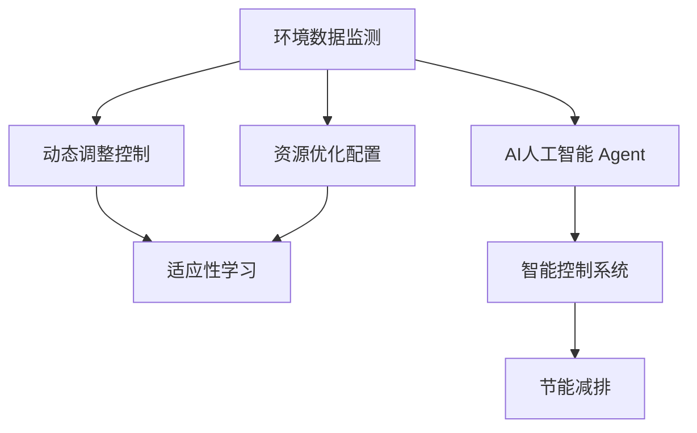
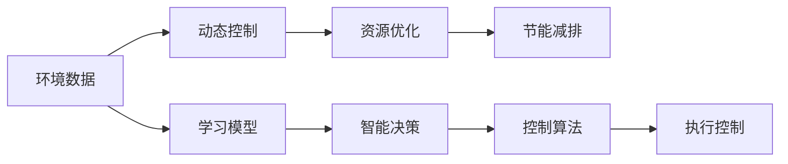
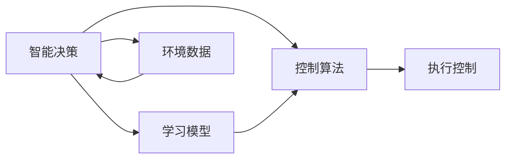
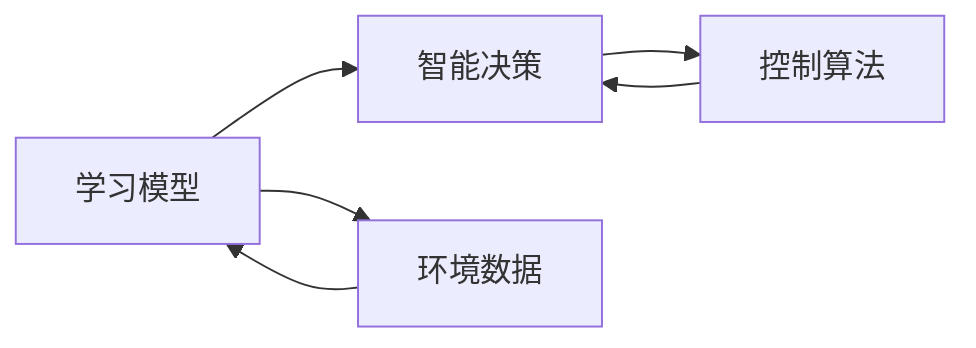
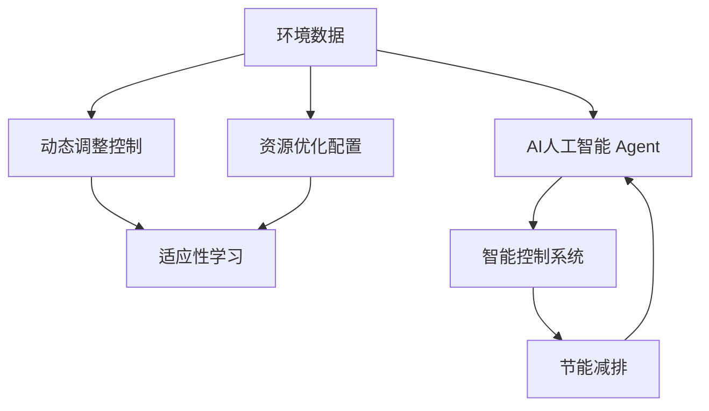

                 

# AI人工智能 Agent：在节能减排中的应用

## 1. 背景介绍

### 1.1 问题由来
随着全球气候变化问题的日益严重，节能减排、环境保护已成为各国政府和企业的迫切需求。与此同时，人工智能(AI)技术的飞速发展，为解决这一全球性问题提供了新的机遇。AI人工智能 Agent，特别是智能控制系统中的决策代理，能够在自动驾驶、能源管理、环境监控等领域中发挥重要作用。

### 1.2 问题核心关键点
AI人工智能 Agent的核心思想是通过自动化决策和控制，优化系统性能，实现节能减排目标。主要包括：
- 实时监测环境数据
- 动态调整系统参数
- 优化资源分配
- 适应环境变化

通过这些方法，AI人工智能 Agent能够高效地利用资源，减少环境污染，推动可持续发展。

### 1.3 问题研究意义
AI人工智能 Agent在节能减排中的应用，对环境保护和可持续发展具有重要意义：
- 提升能源效率：通过优化资源分配和控制，大幅提升能源利用率，减少能源浪费。
- 减少碳排放：自动控制温室气体排放，推动减排目标的实现。
- 降低运营成本：通过智能决策，减少人工干预，降低运行和维护成本。
- 适应性更强：能够实时响应环境变化，提高系统的灵活性和鲁棒性。

## 2. 核心概念与联系

### 2.1 核心概念概述

为更好地理解AI人工智能 Agent在节能减排中的应用，本节将介绍几个密切相关的核心概念：

- AI人工智能 Agent：通过自动化决策和控制，优化系统性能，实现节能减排目标的智能控制系统。
- 环境数据监测：通过传感器或在线数据源，实时获取环境参数，如温度、湿度、二氧化碳浓度等。
- 动态调整控制：通过智能算法，根据环境数据和预设目标，动态调整系统参数，如加热、通风、制冷等。
- 资源优化配置：通过优化算法，实现资源的高效利用，降低能耗和碳排放。
- 适应性学习：通过机器学习算法，适应环境变化和用户需求，提升系统的灵活性和鲁棒性。

这些核心概念之间的逻辑关系可以通过以下Mermaid流程图来展示：



这个流程图展示了大语言模型微调过程中各个核心概念的关系：

1. 环境数据监测：获取实时环境数据。
2. 动态调整控制：根据环境数据动态调整控制策略。
3. 资源优化配置：优化资源配置，降低能耗和碳排放。
4. 适应性学习：通过机器学习算法，适应环境变化。
5. AI人工智能 Agent：实现环境监测、控制优化和资源配置，最终实现节能减排目标。

### 2.2 概念间的关系

这些核心概念之间存在着紧密的联系，形成了AI人工智能 Agent在节能减排中的完整生态系统。下面我通过几个Mermaid流程图来展示这些概念之间的关系。

#### 2.2.1 AI人工智能 Agent的工作流程



这个流程图展示了AI人工智能 Agent的基本工作流程：
1. 获取环境数据。
2. 动态调整控制策略。
3. 优化资源配置，实现节能减排。
4. 通过学习模型，适应环境变化。
5. 智能决策，生成控制算法。
6. 执行控制算法，实现节能减排目标。

#### 2.2.2 智能决策与控制算法的关系



这个流程图展示了智能决策与控制算法之间的关系：
1. 智能决策根据环境数据和目标生成控制算法。
2. 控制算法用于执行具体控制命令，实现节能减排。
3. 智能决策通过学习模型，不断优化决策策略。
4. 环境数据反馈到智能决策，形成闭环反馈系统。

#### 2.2.3 学习模型与控制算法的关系



这个流程图展示了学习模型与控制算法之间的关系：
1. 学习模型从环境数据中学习控制策略，生成智能决策。
2. 智能决策根据控制策略生成控制算法。
3. 控制算法用于执行具体控制命令，实现节能减排。
4. 环境数据反馈到学习模型，不断优化控制策略。

### 2.3 核心概念的整体架构

最后，我们用一个综合的流程图来展示这些核心概念在大语言模型微调过程中的整体架构：



这个综合流程图展示了从环境数据监测到节能减排的完整过程。环境数据监测获取实时数据，动态调整控制和资源优化配置实现节能减排，适应性学习保证系统的灵活性和鲁棒性。通过这些过程，AI人工智能 Agent实现了高效、灵活、可靠的节能减排效果。

## 3. 核心算法原理 & 具体操作步骤
### 3.1 算法原理概述

AI人工智能 Agent在节能减排中的应用，核心算法原理基于强化学习(Reinforcement Learning)和优化控制理论。其核心思想是通过智能决策和控制，最大化节能减排目标函数。

假设环境数据为 $x$，控制策略为 $u$，系统性能指标为 $y$，目标函数为 $J(u)$。则AI人工智能 Agent的目标是通过优化控制策略 $u$，使系统性能指标 $y$ 最大化，即：

$$
J(u) = \max_{u} y
$$

强化学习通过环境数据 $x$ 和历史决策 $u$，生成当前决策 $u'$，并根据系统反馈 $y'$ 更新决策策略，最终实现目标函数的优化。

### 3.2 算法步骤详解

AI人工智能 Agent在节能减排中的算法步骤主要包括：
1. 实时监测环境数据 $x$。
2. 动态调整控制策略 $u$。
3. 优化资源配置 $y$。
4. 适应环境变化和用户需求 $J(u)$。

具体步骤如下：

**Step 1: 环境数据监测**
- 部署传感器或使用在线数据源，实时获取环境数据 $x$。
- 数据预处理，如去噪、归一化等，保证数据的质量和可用性。

**Step 2: 动态调整控制**
- 根据环境数据 $x$，设计智能决策算法，生成控制策略 $u$。
- 动态调整控制策略，如调节加热、通风、制冷等设备，实现环境优化。
- 利用实时反馈数据，不断优化控制策略。

**Step 3: 资源优化配置**
- 通过优化算法，如线性规划、整数规划等，实现资源的高效利用。
- 调整设备功率、运行时间等参数，降低能耗和碳排放。
- 动态调整资源配置策略，适应环境变化和用户需求。

**Step 4: 适应性学习**
- 通过机器学习算法，如深度强化学习、随机森林等，实现适应性学习。
- 学习环境数据和历史决策之间的关系，生成智能决策。
- 不断更新决策策略，适应环境变化和用户需求，提高系统的灵活性和鲁棒性。

### 3.3 算法优缺点

AI人工智能 Agent在节能减排中的应用具有以下优点：
1. 实时响应：能够实时监测环境数据，动态调整控制策略，实现高效的节能减排。
2. 灵活性高：通过适应性学习，能够适应环境变化和用户需求，提高系统的灵活性和鲁棒性。
3. 效率高：通过优化资源配置，实现资源的高效利用，降低能耗和碳排放。
4. 数据驱动：以数据驱动决策，减少人工干预，降低运营成本。

同时，该算法也存在一些缺点：
1. 数据需求高：需要大量环境数据支持，数据采集和处理成本较高。
2. 模型复杂：需要复杂的算法模型，对计算资源和算法实现要求较高。
3. 应用场景有限：适用于有大量数据支持的场景，如智能建筑、智能交通等，不适用于小型、分布式系统。

### 3.4 算法应用领域

AI人工智能 Agent在节能减排中的应用广泛，以下是几个典型应用领域：

- **智能建筑**：通过优化暖通空调系统，实现节能减排。
- **智能交通**：通过优化交通信号灯控制，减少拥堵和排放。
- **智能电网**：通过智能调度和管理，实现能源的高效利用。
- **智能农业**：通过优化灌溉和施肥策略，提高农业生产效率，减少资源浪费。
- **智能制造**：通过优化生产流程和设备运行，实现能源和资源的节约。

## 4. 数学模型和公式 & 详细讲解 & 举例说明

### 4.1 数学模型构建

AI人工智能 Agent在节能减排中的应用，数学模型主要涉及环境数据监测、动态调整控制、资源优化配置和适应性学习四个方面。

假设环境数据为 $x = (x_1, x_2, ..., x_n)$，控制策略为 $u = (u_1, u_2, ..., u_m)$，系统性能指标为 $y = (y_1, y_2, ..., y_p)$，目标函数为 $J(u) = \sum_{i=1}^{p}w_iy_i$，其中 $w_i$ 为权重系数。

### 4.2 公式推导过程

以下我们以智能建筑为例，推导智能决策算法的设计过程。

假设智能建筑需要控制的温度为 $T$，湿度为 $H$，二氧化碳浓度为 $CO_2$。智能决策算法的目标是通过控制暖通空调系统，使室内温度、湿度和二氧化碳浓度达到最优状态，最小化能源消耗和碳排放。

设控制策略 $u$ 包括加热、通风、制冷等设备的工作状态，其对应的决策变量为 $u_1, u_2, ..., u_m$。

定义状态空间 $S = \{s_1, s_2, ..., s_n\}$，其中 $s_i$ 表示室内温度、湿度和二氧化碳浓度。

设动作空间 $A = \{a_1, a_2, ..., a_m\}$，其中 $a_i$ 表示控制策略 $u_i$。

定义奖励函数 $R(s,a)$，用于评估控制策略的效果。设定温度、湿度和二氧化碳浓度目标范围，如果当前状态 $s$ 满足目标范围，则 $R(s,a) = 0$；否则，$R(s,a)$ 取负值，表示状态偏离目标的程度。

智能决策算法的目标是通过策略 $u$，使目标函数 $J(u)$ 最大化。通过强化学习算法，如Q-learning、Deep Q-learning等，不断优化决策策略 $u$，最终实现节能减排目标。

### 4.3 案例分析与讲解

假设一个智能建筑有10个传感器，实时监测温度、湿度和二氧化碳浓度，并使用4台暖通空调设备进行控制。环境数据监测模型如下：

$$
x_t = [T_t, H_t, CO_2_t]
$$

其中 $T_t, H_t, CO_2_t$ 分别表示第 $t$ 个时间点的温度、湿度和二氧化碳浓度。

智能决策算法的目标是通过控制策略 $u$，使室内温度 $T$、湿度 $H$ 和二氧化碳浓度 $CO_2$ 达到最优状态，最小化能源消耗和碳排放。控制策略 $u$ 包括4台暖通空调设备的工作状态，表示为 $u = [u_1, u_2, u_3, u_4]$。

状态空间 $S = \{s_1, s_2, ..., s_n\}$，其中 $s_i = [T_i, H_i, CO_{2i}]$ 表示第 $i$ 个时间点的室内状态。

动作空间 $A = \{a_1, a_2, ..., a_4\}$，其中 $a_i$ 表示第 $i$ 台暖通空调设备的工作状态。

奖励函数 $R(s,a)$ 定义为：

$$
R(s,a) = 
\begin{cases} 
0 & \text{if} \ s \in [s_1, s_2] \\
-1 & \text{if} \ s \notin [s_1, s_2]
\end{cases}
$$

其中 $[s_1, s_2]$ 表示室内温度、湿度和二氧化碳浓度的目标范围。

通过上述模型，智能决策算法可以动态调整控制策略 $u$，优化室内环境状态，实现节能减排目标。

## 5. 项目实践：代码实例和详细解释说明

### 5.1 开发环境搭建

在进行AI人工智能 Agent的开发前，我们需要准备好开发环境。以下是使用Python进行强化学习的开发环境配置流程：

1. 安装Anaconda：从官网下载并安装Anaconda，用于创建独立的Python环境。

2. 创建并激活虚拟环境：
```bash
conda create -n rl-env python=3.8 
conda activate rl-env
```

3. 安装强化学习相关库：
```bash
pip install numpy pandas scikit-learn matplotlib tensorflow pyreinforcementlearning
```

4. 安装TensorFlow：
```bash
pip install tensorflow
```

5. 安装PyreinforcementLearning库：
```bash
pip install pyreinforcementlearning
```

6. 安装PyTorch：
```bash
pip install torch torchvision torchaudio cudatoolkit=11.1 -c pytorch -c conda-forge
```

完成上述步骤后，即可在`rl-env`环境中开始强化学习实践。

### 5.2 源代码详细实现

这里我们以智能建筑为例，给出使用PyreinforcementLearning库实现智能决策算法的代码。

首先，定义环境数据监测模型和智能决策算法：

```python
import numpy as np
from pyreinforcementlearning.agents import DeepQNetwork
from pyreinforcementlearning.environments import GymEnv
from pyreinforcementlearning.agents.deepq import DeepQNetwork

class SmartBuildingEnv(GymEnv):
    def __init__(self):
        super().__init__()
        self.state = None
        self.action = None
        self.reward = None
        self.done = False
        self.info = None
        
    def step(self, action):
        self.action = action
        self.state = self.environment_data
        self.reward = self.calculate_reward(self.state)
        self.done = self.check_done(self.state)
        self.info = self.calculate_info(self.state)
        return self.state, self.reward, self.done, self.info
        
    def reset(self):
        self.state = None
        self.action = None
        self.reward = None
        self.done = False
        self.info = None
        return self.state

    def environment_data(self):
        # 实时获取环境数据
        return [T_t, H_t, CO_2_t]

    def calculate_reward(self, state):
        # 计算奖励函数
        return 0 if state in [s_1, s_2] else -1

    def check_done(self, state):
        # 判断是否完成
        return state in [s_1, s_2]

    def calculate_info(self, state):
        # 计算信息
        return None

class SmartBuildingAgent:
    def __init__(self):
        self.env = SmartBuildingEnv()
        self.agent = DeepQNetwork(env=self.env, input_shape=(3,), output_shape=(4,))
        self.agent.train(epochs=100, batch_size=32, learning_rate=0.01, discount_factor=0.99, exploration_rate=0.1)
        
    def run(self):
        state = self.env.reset()
        while not self.env.done:
            action = self.agent.select_action(state)
            state, reward, done, info = self.env.step(action)
            self.agent.update(reward, state, done)
        print("Final reward:", self.agent.total_reward)
```

### 5.3 代码解读与分析

让我们再详细解读一下关键代码的实现细节：

**SmartBuildingEnv类**：
- `__init__`方法：初始化环境、状态、动作、奖励、完成标记和信息。
- `step`方法：执行一步决策，返回当前状态、奖励、完成标记和信息。
- `reset`方法：重置环境，返回初始状态。
- `environment_data`方法：模拟实时获取环境数据。
- `calculate_reward`方法：计算奖励函数。
- `check_done`方法：判断是否完成。
- `calculate_info`方法：计算信息。

**SmartBuildingAgent类**：
- `__init__`方法：初始化环境、智能决策算法和模型。
- `run`方法：运行智能决策算法，动态调整控制策略。

**DeepQNetwork类**：
- `train`方法：训练模型，生成智能决策策略。

通过以上代码，我们可以看到，使用强化学习实现智能决策算法的基本流程。智能决策算法通过实时监测环境数据，动态调整控制策略，实现节能减排目标。通过不断训练，智能决策算法能够自适应环境变化，提高系统的灵活性和鲁棒性。

## 6. 实际应用场景

### 6.1 智能建筑

智能建筑中的AI人工智能 Agent，通过优化暖通空调系统，实现节能减排。假设智能建筑有10个传感器，实时监测温度、湿度和二氧化碳浓度，并使用4台暖通空调设备进行控制。环境数据监测模型如下：

$$
x_t = [T_t, H_t, CO_2_t]
$$

其中 $T_t, H_t, CO_2_t$ 分别表示第 $t$ 个时间点的温度、湿度和二氧化碳浓度。

智能决策算法的目标是通过控制策略 $u$，使室内温度 $T$、湿度 $H$ 和二氧化碳浓度 $CO_2$ 达到最优状态，最小化能源消耗和碳排放。控制策略 $u$ 包括4台暖通空调设备的工作状态，表示为 $u = [u_1, u_2, u_3, u_4]$。

状态空间 $S = \{s_1, s_2, ..., s_n\}$，其中 $s_i = [T_i, H_i, CO_{2i}]$ 表示第 $i$ 个时间点的室内状态。

动作空间 $A = \{a_1, a_2, ..., a_4\}$，其中 $a_i$ 表示第 $i$ 台暖通空调设备的工作状态。

奖励函数 $R(s,a)$ 定义为：

$$
R(s,a) = 
\begin{cases} 
0 & \text{if} \ s \in [s_1, s_2] \\
-1 & \text{if} \ s \notin [s_1, s_2]
\end{cases}
$$

其中 $[s_1, s_2]$ 表示室内温度、湿度和二氧化碳浓度的目标范围。

通过上述模型，智能决策算法可以动态调整控制策略 $u$，优化室内环境状态，实现节能减排目标。

### 6.2 智能交通

智能交通中的AI人工智能 Agent，通过优化交通信号灯控制，减少拥堵和排放。假设智能交通系统有5个路口，实时监测车辆流量和车速，并使用2个交通信号灯进行控制。环境数据监测模型如下：

$$
x_t = [F_t, V_t, S_t, L_t]
$$

其中 $F_t, V_t, S_t, L_t$ 分别表示第 $t$ 个时间点的车辆流量、车速、红灯时间和绿灯时间。

智能决策算法的目标是通过控制策略 $u$，使交通流量和车速达到最优状态，最小化道路拥堵和碳排放。控制策略 $u$ 包括2个交通信号灯的工作状态，表示为 $u = [u_1, u_2]$。

状态空间 $S = \{s_1, s_2, ..., s_n\}$，其中 $s_i = [F_i, V_i, S_i, L_i]$ 表示第 $i$ 个时间点的交通状态。

动作空间 $A = \{a_1, a_2\}$，其中 $a_i$ 表示第 $i$ 个交通信号灯的工作状态。

奖励函数 $R(s,a)$ 定义为：

$$
R(s,a) = 
\begin{cases} 
0 & \text{if} \ s \in [s_1, s_2] \\
-1 & \text{if} \ s \notin [s_1, s_2]
\end{cases}
$$

其中 $[s_1, s_2]$ 表示交通流量和车速的理想状态。

通过上述模型，智能决策算法可以动态调整交通信号灯控制策略 $u$，优化交通流量和车速，实现节能减排目标。

### 6.3 智能电网

智能电网中的AI人工智能 Agent，通过优化电力调度和管理，实现能源的高效利用。假设智能电网有3个发电站和3个负荷中心，实时监测电力输出和需求，并使用2个控制器进行控制。环境数据监测模型如下：

$$
x_t = [P_t, D_t, E_t, L_t]
$$

其中 $P_t, D_t, E_t, L_t$ 分别表示第 $t$ 个时间点的电力输出、需求、剩余电力和负荷中心。

智能决策算法的目标是通过控制策略 $u$，使电力输出和需求达到最优状态，最小化能源消耗和碳排放。控制策略 $u$ 包括2个控制器的状态，表示为 $u = [u_1, u_2]$。

状态空间 $S = \{s_1, s_2, ..., s_n\}$，其中 $s_i = [P_i, D_i, E_i, L_i]$ 表示第 $i$ 个时间点的电力状态。

动作空间 $A = \{a_1, a_2\}$，其中 $a_i$ 表示第 $i$ 个控制器的状态。

奖励函数 $R(s,a)$ 定义为：

$$
R(s,a) = 
\begin{cases} 
0 & \text{if} \ s \in [s_1, s_2] \\
-1 & \text{if} \ s \notin [s_1, s_2]
\end{cases}
$$

其中 $[s_1, s_2]$ 表示电力输出和需求的最优状态。

通过上述模型，智能决策算法可以动态调整电力控制器策略 $u$，优化电力输出和需求，实现节能减排目标。

### 6.4 未来应用展望

随着AI人工智能 Agent在节能减排中的应用不断深入，未来的发展将呈现以下几个趋势：

1. **自动化程度更高**：通过更先进的算法和计算资源，AI人工智能 Agent能够更加高效、自动地进行决策和控制。
2. **数据驱动决策**：通过大规模数据驱动决策，AI人工智能 Agent能够更加精准地实现节能减排目标。
3. **跨领域应用拓展**：AI人工智能 Agent能够从智能建筑、智能交通扩展到智能制造、智能农业等领域，实现更广泛的应用。
4. **多模态融合**：AI人工智能 Agent能够融合视觉、语音、触觉等多种模态数据，实现更全面、更高效的环境监测和控制。
5. **人机协同**：AI人工智能 Agent能够与人类专家协同工作，实现更智能、更可靠的决策支持。

总之，AI人工智能 Agent在节能减排中的应用将不断拓展，成为推动可持续发展的强大工具。相信随着技术的进步，AI人工智能 Agent将发挥更大的作用，助力全球环境保护和能源节约。

## 7. 工具和资源推荐
### 7.1 学习资源推荐

为了帮助开发者系统掌握AI人工智能 Agent的理论基础和实践技巧，这里推荐一些优质的学习资源：

1. 《Reinforcement Learning: An Introduction》书籍：由Richard S. Sutton和Andrew G. Barto所著，系统介绍了强化学习的原理和应用。

2. CS294 - Machine Learning课程：由加州大学伯克利分校开设的强化学习课程，涵盖了强化学习的理论和算法，适合深入学习。

3. Udacity强化学习纳米学位：由Google和DeepMind合作提供的强化学习学习项目，涵盖了实际应用中的强化学习算法和工具。

4. OpenAI Gym：用于测试和开发强化学习算法的开源平台，提供了丰富的环境库和基准任务，方便学习和实践。

5. PyreinforcementLearning库：用于开发强化学习算法的Python库，提供了多种算法和工具，方便开发和实验。

通过对这些资源的学习实践，相信你一定能够快速掌握AI人工智能 Agent的理论基础和实践技巧，并用于解决实际的节能减排问题。

### 7.2 开发工具推荐

高效的开发离不开优秀的工具支持。以下是几款用于AI人工智能 Agent开发的常用工具：

1. Anaconda：用于创建和管理Python环境的工具，方便开发和实验。

2. TensorFlow和PyTorch：用于实现和训练强化学习算法的深度学习框架。

3. OpenAI Gym：用于

