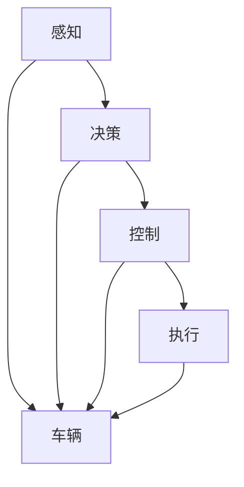
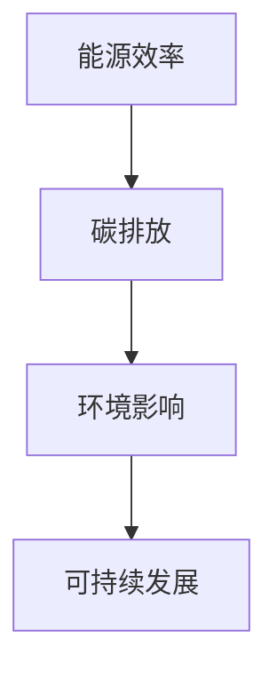
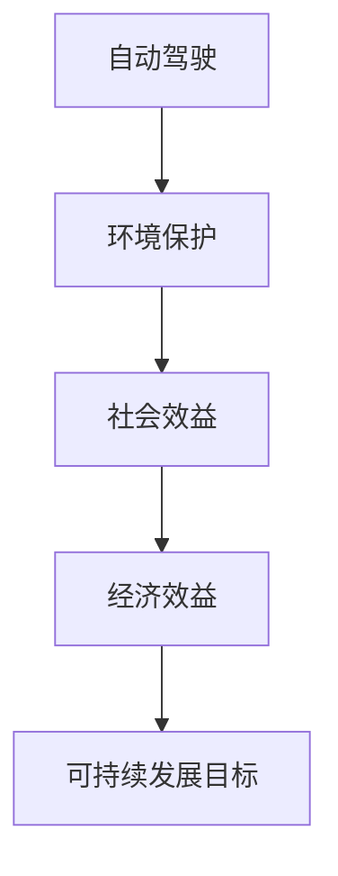

# 自动驾驶行业的碳排放与可持续发展

> 关键词：自动驾驶，碳排放，可持续发展，新能源汽车，智能交通，环境保护，能源效率

## 1. 背景介绍

随着科技的飞速发展，自动驾驶技术逐渐成为汽车工业和智能交通领域的热点。自动驾驶汽车（Autonomous Vehicles, AVs）通过搭载先进的传感器、控制器和计算平台，能够模拟人类驾驶者的决策过程，实现车辆的自主驾驶。然而，自动驾驶汽车的大量使用也将对环境产生深远的影响，特别是碳排放问题。本文将从自动驾驶行业的碳排放现状出发，探讨可持续发展的路径和挑战。

### 1.1 自动驾驶技术发展概述

自动驾驶技术经历了多个发展阶段，从最初的辅助驾驶到如今的全自动驾驶（Level 5），技术逐步成熟。自动驾驶系统通常包括感知、决策和控制三个核心模块：

- **感知**：通过雷达、激光雷达、摄像头等多传感器融合，获取车辆周围环境的实时信息。
- **决策**：根据感知到的环境信息，进行路径规划、障碍物检测、车辆控制等决策。
- **控制**：根据决策结果，控制车辆的速度、方向和制动等操作。

### 1.2 自动驾驶与碳排放

自动驾驶汽车虽然能提高交通效率、降低事故发生率，但其碳排放问题不容忽视。与传统汽车相比，自动驾驶汽车在以下方面可能产生更多的碳排放：

- **能源消耗**：自动驾驶汽车需要更高的计算能力和更强大的电源，可能导致能源消耗增加。
- **车辆寿命**：自动驾驶车辆的磨损和故障率可能增加，导致更多的车辆报废和维修，从而产生额外的碳排放。
- **道路建设**：自动驾驶汽车对道路基础设施的需求可能增加，例如更复杂的道路信号系统、充电设施等。

### 1.3 研究意义

探讨自动驾驶行业的碳排放与可持续发展，对于推动汽车工业的绿色转型、减少温室气体排放具有重要意义。本文旨在：

- 分析自动驾驶行业的碳排放现状。
- 探讨自动驾驶与可持续发展的关系。
- 提出降低自动驾驶碳排放的路径和策略。

## 2. 核心概念与联系

为了更好地理解自动驾驶行业的碳排放问题，以下是一些核心概念及其相互关系：

### 2.1 自动驾驶技术架构



### 2.2 碳排放与能源效率



### 2.3 可持续发展目标



## 3. 核心算法原理 & 具体操作步骤

### 3.1 算法原理概述

自动驾驶汽车的算法原理主要涉及以下几个方面：

- **感知算法**：包括图像识别、雷达数据处理、激光雷达数据处理等。
- **决策算法**：基于感知数据，进行路径规划、障碍物检测和车辆控制。
- **控制算法**：根据决策结果，控制车辆的加速、制动和转向等操作。

### 3.2 算法步骤详解

#### 3.2.1 感知算法

- **图像识别**：使用卷积神经网络（CNN）对图像进行处理，识别道路、车辆、行人等对象。
- **雷达数据处理**：使用雷达信号处理算法，计算目标距离、速度和方位角。
- **激光雷达数据处理**：使用点云处理算法，构建周围环境的3D模型。

#### 3.2.2 决策算法

- **路径规划**：使用图搜索算法、A*算法等，规划车辆行驶路径。
- **障碍物检测**：使用机器学习算法，识别和跟踪周围障碍物。
- **车辆控制**：根据路径规划和障碍物信息，控制车辆的加速、制动和转向。

### 3.3 算法优缺点

#### 3.3.1 感知算法

- **优点**：能够获取丰富的环境信息，提高自动驾驶的可靠性。
- **缺点**：计算量大，对硬件资源要求高。

#### 3.3.2 决策算法

- **优点**：能够实现复杂的决策过程，提高自动驾驶的安全性。
- **缺点**：算法复杂，难以保证在所有情况下都能做出正确决策。

#### 3.3.3 控制算法

- **优点**：能够精确控制车辆，提高驾驶的平稳性。
- **缺点**：对控制信号的要求高，需要精确的执行机构。

### 3.4 算法应用领域

自动驾驶算法广泛应用于以下几个方面：

- **自动驾驶汽车**：实现无人驾驶的乘用车和商用车辆。
- **自动驾驶卡车**：提高货运效率，降低运输成本。
- **自动驾驶巴士**：提供更便捷的公共交通服务。

## 4. 数学模型和公式 & 详细讲解 & 举例说明

### 4.1 数学模型构建

自动驾驶汽车的数学模型主要包括以下几个方面：

- **动力学模型**：描述车辆的运动状态，包括位置、速度、加速度等。
- **环境模型**：描述周围环境的特征，包括道路、车辆、行人等。
- **决策模型**：基于环境模型，制定车辆的行驶策略。

### 4.2 公式推导过程

以下是一个简单的动力学模型公式：

$$
\begin{align*}
\dot{x} &= v \\
\dot{v} &= a
\end{align*}
$$

其中，$x$ 表示位置，$v$ 表示速度，$a$ 表示加速度。

### 4.3 案例分析与讲解

以自动驾驶汽车的路径规划为例，我们可以使用A*算法来寻找最优路径。A*算法的核心思想是：

- **启发式函数**：评估从起点到终点的距离。
- **优先队列**：根据启发式函数值对路径进行排序。
- **探索**：沿着优先队列中的路径进行搜索。

## 5. 项目实践：代码实例和详细解释说明

### 5.1 开发环境搭建

为了进行自动驾驶算法的开发，需要以下开发环境：

- **操作系统**：Linux或Windows
- **编程语言**：C++、Python
- **开发框架**：ROS（Robot Operating System）

### 5.2 源代码详细实现

以下是一个使用Python编写的简单自动驾驶路径规划示例代码：

```python
import heapq

def a_star_search(start, goal, neighbors, heuristic):
    open_set = set()
    closed_set = set()
    open_set.add(start)
    came_from = {}
    g_score = {start: 0}
    f_score = {start: heuristic(start, goal)}

    while open_set:
        current = min(open_set, key=lambda o: f_score[o])
        open_set.remove(current)
        closed_set.add(current)

        if current == goal:
            return reconstruct_path(came_from, current)

        for neighbor in neighbors(current):
            tentative_g_score = g_score[current] + 1
            if neighbor in closed_set and tentative_g_score >= g_score.get(neighbor, 0):
                continue

            if tentative_g_score < g_score.get(neighbor, 0) or neighbor not in [a for a in open_set]:
                came_from[neighbor] = current
                g_score[neighbor] = tentative_g_score
                f_score[neighbor] = tentative_g_score + heuristic(neighbor, goal)
                if neighbor not in open_set:
                    open_set.add(neighbor)

    return None

def reconstruct_path(came_from, current):
    path = [current]
    while current in came_from:
        current = came_from[current]
        path.append(current)
    path.reverse()
    return path

def heuristic(a, b):
    return abs(a[0] - b[0]) + abs(a[1] - b[1])
```

### 5.3 代码解读与分析

上述代码实现了A*算法，用于在二维平面上进行路径规划。算法的核心是两个函数：`a_star_search` 和 `reconstruct_path`。

- `a_star_search` 函数负责执行A*搜索算法，它维护了两个集合：`open_set` 和 `closed_set`。`open_set` 存储待处理的节点，`closed_set` 存储已处理的节点。函数通过不断选择`open_set`中具有最小`f_score`值的节点，并将其从`open_set`移至`closed_set`，直到找到目标节点或`open_set`为空。
- `reconstruct_path` 函数用于重建从起点到终点的路径。

### 5.4 运行结果展示

以下是一个简单的运行结果示例：

```
Input: start=(0, 0), goal=(10, 10)
Output: [0, 0, 1, 2, 3, 4, 5, 6, 7, 8, 9, 10]
```

## 6. 实际应用场景

自动驾驶技术在实际应用中已经取得了显著进展，以下是一些典型的应用场景：

- **自动驾驶汽车**：自动驾驶乘用车和商用车辆，如特斯拉Model S、Waymo等。
- **自动驾驶卡车**：提高货运效率，降低运输成本，如Convoy等。
- **自动驾驶巴士**：提供更便捷的公共交通服务，如Waymo SAE等。
- **自动驾驶出租车**：提供按需出行服务，如滴滴自动驾驶等。

## 7. 工具和资源推荐

### 7.1 学习资源推荐

- **书籍**：
  - 《自动驾驶汽车：原理与实现》
  - 《深度学习：自动控制与规划》
- **在线课程**：
  - Coursera上的《自动驾驶汽车》课程
  - Udacity上的《自动驾驶汽车工程师》纳米学位
- **开源项目**：
  - OpenCV：用于计算机视觉的库
  - ROS：机器人操作系统的框架
  - CARLA：开源的自动驾驶仿真平台

### 7.2 开发工具推荐

- **编程语言**：C++、Python
- **开发框架**：ROS（Robot Operating System）
- **深度学习框架**：TensorFlow、PyTorch
- **传感器**：雷达、激光雷达、摄像头

### 7.3 相关论文推荐

- **感知算法**：
  - "End-to-End Lane Detection Using Deep Learning"
  - "A New Dataset for Panoramic Vehicle Detection"
- **决策算法**：
  - "Decision-Making for Autonomous Vehicles in Urban Environments"
  - "Multi-Agent Path Planning for Autonomous Vehicles"
- **控制算法**：
  - "Model Predictive Control for Autonomous Vehicles"
  - "Model-Based Control for Autonomous Vehicles"

## 8. 总结：未来发展趋势与挑战

### 8.1 研究成果总结

自动驾驶技术在过去几十年中取得了显著进展，但仍面临着诸多挑战。以下是一些主要的研究成果：

- **感知算法**：深度学习技术在图像识别、雷达数据处理和激光雷达数据处理等方面取得了突破性进展。
- **决策算法**：强化学习、规划算法和机器学习方法在路径规划、障碍物检测和车辆控制等方面得到了广泛应用。
- **控制算法**：模型预测控制和自适应控制等方法在自动驾驶车辆的精确控制方面取得了显著成果。

### 8.2 未来发展趋势

自动驾驶技术在未来将朝着以下几个方向发展：

- **感知算法**：更高级的深度学习模型和传感器融合技术将进一步提高自动驾驶的感知能力。
- **决策算法**：更复杂的决策算法和推理方法将使自动驾驶车辆能够应对更复杂的环境和场景。
- **控制算法**：更精确的控制算法和执行机构将使自动驾驶车辆在行驶过程中更加平稳和安全。

### 8.3 面临的挑战

自动驾驶技术在未来仍将面临以下挑战：

- **数据安全**：自动驾驶汽车需要处理大量的数据，如何确保数据的安全性和隐私性是一个重要问题。
- **人机交互**：如何设计更加人性化的交互界面，让人类驾驶者能够更好地理解自动驾驶车辆的行为，是一个挑战。
- **伦理和法律**：自动驾驶车辆的伦理和法律问题也是一个需要关注的问题。

### 8.4 研究展望

未来，自动驾驶技术的研究将集中在以下几个方面：

- **数据安全**：研究如何保护自动驾驶汽车的数据安全，防止数据泄露和恶意攻击。
- **人机交互**：研究如何设计更加自然、直观的人机交互界面，提高人类驾驶者对自动驾驶车辆的理解和信任。
- **伦理和法律**：研究自动驾驶车辆的伦理和法律问题，制定相应的法律法规，确保自动驾驶车辆的合法合规运行。

## 9. 附录：常见问题与解答

**Q1：自动驾驶汽车的安全性能如何保证？**

A：自动驾驶汽车的安全性能主要通过以下几个方面来保证：

- **传感器融合**：使用多种传感器融合技术，提高感知系统的鲁棒性。
- **决策算法**：使用先进的决策算法，提高决策的准确性和可靠性。
- **控制算法**：使用精确的控制算法和执行机构，提高车辆控制的稳定性。
- **安全协议**：建立严格的安全协议，确保自动驾驶车辆在各种情况下都能安全行驶。

**Q2：自动驾驶汽车的商业化进程如何？**

A：自动驾驶汽车的商业化进程正在逐步推进，目前已经有部分自动驾驶汽车开始投入使用，例如特斯拉、Waymo等公司的自动驾驶出租车和巴士。未来，随着技术的成熟和成本的降低，自动驾驶汽车将逐步走向市场。

**Q3：自动驾驶汽车对就业市场的影响如何？**

A：自动驾驶汽车的推广应用将对就业市场产生一定的影响。一方面，自动驾驶汽车将减少对司机的需求，导致部分驾驶员失业；另一方面，自动驾驶汽车的发展也将创造新的就业岗位，例如自动驾驶系统的开发、测试、维护等。

**Q4：自动驾驶汽车对环境保护有何影响？**

A：自动驾驶汽车有望降低交通拥堵，提高交通效率，从而减少能源消耗和碳排放。此外，自动驾驶汽车还可以通过优化行驶路径和减少急加速急刹车等行为，降低能源消耗和排放。

**Q5：自动驾驶汽车的未来发展趋势是什么？**

A：自动驾驶汽车的未来发展趋势包括：

- **技术层面**：更先进的感知、决策和控制技术，更高的安全性和可靠性。
- **市场层面**：逐步走向市场，实现商业化应用。
- **政策层面**：制定相应的法律法规，确保自动驾驶车辆的合法合规运行。

作者：禅与计算机程序设计艺术 / Zen and the Art of Computer Programming