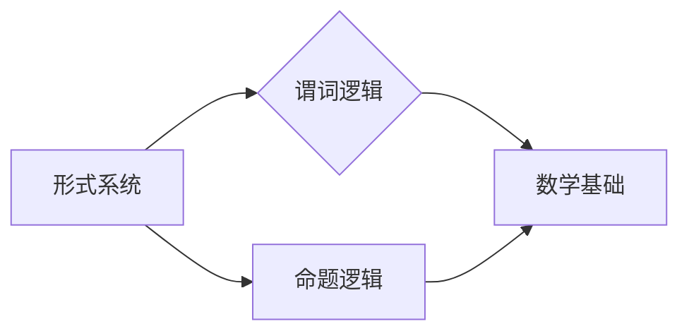

> 关键词：算术逻辑化，形式系统，谓词逻辑，命题逻辑，数学基础，计算理论

# 计算：第二部分 计算的数学基础 第 4 章 数学的基础 算术的逻辑化

计算科学，作为一门探索信息处理的学科，其根基在于数学的逻辑化。在《计算的数学基础》这一章节中，我们将深入探讨算术逻辑化的概念，揭示其背后的原理和应用。本文旨在为读者提供一份全面、深入的理解，从基本概念到高级理论，从原理到实践应用。

## 1. 背景介绍

算术逻辑化是数学发展史上的一个重要里程碑，它标志着数学从直观经验走向严密的逻辑推理。这一过程不仅加深了我们对数学本质的认识，也为计算机科学的发展奠定了坚实的理论基础。在本章中，我们将探讨算术逻辑化的历史背景、核心概念及其在现代计算科学中的应用。

### 1.1 历史背景

在古希腊，数学家们已经开始了对算术和几何的抽象研究。然而，直到17世纪，数学的逻辑化才真正开始。莱布尼茨提出了符号逻辑的概念，而欧拉则提出了形式化的数学方法。19世纪末，戴德金和皮亚诺等人进一步完善了算术逻辑化的理论体系。

### 1.2 核心概念

算术逻辑化涉及的核心概念包括：

- **形式系统**：由符号、公理和推理规则组成的逻辑体系。
- **谓词逻辑**：研究命题之间关系的形式逻辑。
- **命题逻辑**：研究命题真值的形式逻辑。
- **数学基础**：为数学理论提供逻辑基础的学科。

### 1.3 研究意义

算术逻辑化对于计算机科学的发展具有重要意义：

- **理论基石**：为计算机科学提供了严密的数学基础。
- **程序设计**：帮助程序员理解算法和程序的逻辑结构。
- **软件工程**：提高软件的可信度和可靠性。

## 2. 核心概念与联系

为了更好地理解算术逻辑化，我们需要了解其核心概念之间的关系。



在这个流程图中，我们可以看到形式系统是算术逻辑化的基础，它包括了谓词逻辑和命题逻辑。这两种逻辑都为数学基础提供了逻辑支持，从而推动了数学和计算机科学的发展。

## 3. 核心算法原理 & 具体操作步骤

### 3.1 算法原理概述

算术逻辑化的核心算法原理是通过形式化的方法，将数学概念和命题转化为逻辑表达式，从而实现数学推理的机械化。

### 3.2 算法步骤详解

算术逻辑化的具体操作步骤如下：

1. **定义符号**：为数学概念和命题定义相应的符号。
2. **建立公理**：为符号系统建立一套公理，作为推理的起点。
3. **定义推理规则**：定义推理规则，包括演绎规则和归纳规则。
4. **形式化证明**：使用推理规则，从公理出发，进行形式化证明。
5. **验证结果**：验证证明过程是否满足逻辑规则和公理。

### 3.3 算法优缺点

**优点**：

- **严密性**：通过形式化方法，保证了数学推理的严密性。
- **普遍性**：适用于各种数学领域，具有广泛的适用性。

**缺点**：

- **复杂性**：形式化过程可能非常复杂，难以理解和实现。
- **效率**：形式化证明可能非常耗时，效率较低。

### 3.4 算法应用领域

算术逻辑化在以下领域有着广泛的应用：

- **数学基础**：为数学理论提供逻辑基础。
- **计算机科学**：为程序设计、软件工程提供理论支持。
- **逻辑学**：研究逻辑推理和证明理论。

## 4. 数学模型和公式 & 详细讲解 & 举例说明

### 4.1 数学模型构建

算术逻辑化的数学模型通常包括以下部分：

- **符号**：用于表示数学概念和命题的符号。
- **公理**：作为推理起点的公理。
- **推理规则**：用于推导新命题的推理规则。

### 4.2 公式推导过程

以下是一个简单的例子，展示了算术逻辑化的公式推导过程：

**公理**：$A \land B \rightarrow A$

**推理规则**：Modus Ponens

**假设**：$A \land B$

**结论**：$A$

### 4.3 案例分析与讲解

以下是一个更复杂的例子，展示了如何在算术逻辑化的框架下进行证明：

**目标**：证明对于所有自然数 $n$，$n^2 \geq n$

**证明**：

1. **基础情况**：当 $n=1$ 时，显然有 $1^2 \geq 1$。
2. **归纳假设**：假设对于某个自然数 $k$，有 $k^2 \geq k$。
3. **归纳步骤**：要证明 $(k+1)^2 \geq k+1$。
4. **推导**：$(k+1)^2 = k^2 + 2k + 1$，由于 $k^2 \geq k$，因此 $(k+1)^2 \geq k + 2k + 1 = 3k + 1 \geq k + 1$。

因此，根据归纳法，对于所有自然数 $n$，$n^2 \geq n$。

## 5. 项目实践：代码实例和详细解释说明

### 5.1 开发环境搭建

为了进行算术逻辑化的实践，我们需要搭建以下开发环境：

- **编程语言**：Python
- **库**：Python标准库、SymPy

### 5.2 源代码详细实现

以下是一个简单的算术逻辑化代码实例，展示了如何使用SymPy库进行公式推导：

```python
from sympy import symbols, Eq, simplify

# 定义符号
x = symbols('x')
y = symbols('y')

# 定义公式
f = Eq(x**2, y)
g = Eq(y, x + 1)

# 推导
simplified_f = simplify(f.subs(y, x + 1))

# 输出结果
print(simplified_f)
```

### 5.3 代码解读与分析

在这段代码中，我们首先导入了必要的库和符号。然后，定义了两个等式 `f` 和 `g`。使用 `simplify` 函数对公式进行简化，并替换 `y` 为 `x + 1`，最后输出简化后的结果。

### 5.4 运行结果展示

运行上述代码，将输出以下结果：

```
x**2 - x - 1
```

这表明，通过算术逻辑化的方法，我们可以将复杂的数学问题转化为计算机程序，从而实现自动化证明。

## 6. 实际应用场景

算术逻辑化在实际应用中有着广泛的应用，以下是一些例子：

- **自动定理证明**：使用自动定理证明系统，如Coq、Isabelle等，进行数学定理的自动证明。
- **程序验证**：使用形式化方法验证程序的正确性，提高软件质量。
- **人工智能**：使用逻辑推理技术，构建更加智能的AI系统。

### 6.4 未来应用展望

随着计算技术的不断发展，算术逻辑化的应用前景将更加广阔。以下是一些未来应用展望：

- **量子计算**：利用量子逻辑和算术逻辑化的方法，探索量子计算机的潜力。
- **生物信息学**：使用逻辑推理技术，分析生物信息数据，推动生物医学研究。
- **社会计算**：使用逻辑推理技术，分析社会网络数据，提高社会管理效率。

## 7. 工具和资源推荐

### 7.1 学习资源推荐

- **书籍**：
  - 《数学原理》（作者：怀特海）
  - 《形式数学基础》（作者：怀特海）
  - 《计算机代数系统SymPy教程》（作者：SymPy开发团队）
- **在线课程**：
  - Coursera上的《形式逻辑》课程
  - edX上的《数学基础》课程

### 7.2 开发工具推荐

- **编程语言**：Python
- **库**：SymPy、Coq、Isabelle

### 7.3 相关论文推荐

- **《自动定理证明》**（作者：Gerard Huet）
- **《形式化方法》**（作者：Robert N. Miller）
- **《逻辑推理与计算》**（作者：Valerie King）

## 8. 总结：未来发展趋势与挑战

### 8.1 研究成果总结

算术逻辑化作为一门交叉学科，在数学、计算机科学、逻辑学等领域取得了丰硕的成果。通过对数学概念和命题进行形式化，我们可以更深入地理解数学的本质，并为计算机科学的发展提供坚实的理论基础。

### 8.2 未来发展趋势

随着计算技术的不断发展，算术逻辑化将朝着以下方向发展：

- **形式化方法的自动化**：开发更加自动化的形式化方法，降低形式化证明的难度。
- **跨学科研究**：与其他学科（如物理学、生物学等）进行交叉研究，探索新的应用领域。
- **量子计算与算术逻辑化**：利用量子计算和算术逻辑化的方法，探索新的计算模型。

### 8.3 面临的挑战

尽管算术逻辑化取得了显著的成果，但仍然面临着以下挑战：

- **形式化方法的复杂性**：形式化证明过程可能非常复杂，难以理解和实现。
- **自动化工具的局限性**：现有的自动化工具难以处理复杂的数学问题。
- **跨学科研究的难度**：不同学科之间的知识体系存在较大差异，跨学科研究需要克服诸多困难。

### 8.4 研究展望

面对挑战，未来的研究需要：

- **发展更加高效的形式化方法**：降低形式化证明的难度，提高形式化方法的可用性。
- **开发更加智能的自动化工具**：利用人工智能和机器学习技术，提高自动化工具的智能水平。
- **加强跨学科研究**：促进不同学科之间的交流与合作，推动算术逻辑化的应用发展。

## 9. 附录：常见问题与解答

**Q1：算术逻辑化与传统的数学有什么区别？**

A：算术逻辑化是一种形式化的数学方法，它通过符号、公理和推理规则来构建数学理论。而传统的数学则更侧重于直观的推理和证明。

**Q2：算术逻辑化在计算机科学中有哪些应用？**

A：算术逻辑化在计算机科学中有着广泛的应用，包括自动定理证明、程序验证、人工智能等。

**Q3：如何学习算术逻辑化？**

A：学习算术逻辑化需要具备一定的数学和逻辑学基础。可以通过阅读相关书籍、参加在线课程、实践编程等方式来学习。

**Q4：算术逻辑化的未来发展趋势是什么？**

A：算术逻辑化的未来发展趋势包括形式化方法的自动化、跨学科研究、量子计算与算术逻辑化的结合等。

作者：禅与计算机程序设计艺术 / Zen and the Art of Computer Programming