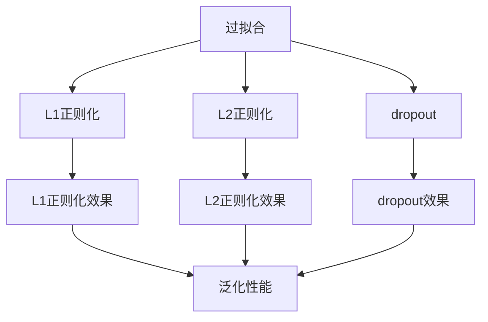

                 

# 正则化 (Regularization)

> 关键词：正则化,过拟合,欠拟合,模型优化,深度学习,机器学习

## 1. 背景介绍

### 1.1 问题由来

在机器学习和深度学习中，过拟合（overfitting）是一个常见的问题，它会导致模型在训练数据上表现良好，但在测试数据上表现较差。过拟合的主要原因是模型过于复杂，过度拟合了训练数据中的噪声，从而忽略了更广泛的数据分布。为了解决这一问题，正则化（Regularization）技术应运而生，通过在模型训练过程中引入一些额外的约束条件，使模型能够更好地泛化到新的数据集上。

### 1.2 问题核心关键点

正则化技术的核心是引入额外的约束条件，以防止模型过于复杂，从而减少过拟合的风险。常见的正则化技术包括L1正则化、L2正则化和dropout等。这些技术可以单独使用，也可以组合使用，以达到更好的模型优化效果。

正则化技术的关键在于找到一个平衡点，即在模型复杂度和泛化性能之间找到一个最优解。通过正则化，模型可以在保证一定泛化性能的前提下，尽可能地拟合数据。

### 1.3 问题研究意义

正则化技术是机器学习和深度学习中非常重要的概念，它可以有效地缓解过拟合问题，提高模型的泛化能力，从而在实际应用中取得更好的效果。此外，正则化技术还能够减少模型训练的时间，提高模型的效率和可靠性。因此，掌握正则化技术对于从事机器学习和深度学习的技术人员来说至关重要。

## 2. 核心概念与联系

### 2.1 核心概念概述

为了更好地理解正则化技术，我们先介绍几个相关的核心概念：

- **过拟合（Overfitting）**：模型在训练数据上表现良好，但在测试数据上表现较差的现象。过拟合通常发生在模型过于复杂，过度拟合了训练数据中的噪声时。

- **欠拟合（Underfitting）**：模型在训练数据和测试数据上都表现较差，通常发生在模型过于简单，无法充分拟合数据时。

- **正则化（Regularization）**：通过引入额外的约束条件，防止模型过于复杂，从而减少过拟合的风险。常见的正则化技术包括L1正则化、L2正则化和dropout等。

- **L1正则化（L1 Regularization）**：通过对模型参数的绝对值进行惩罚，使模型参数变得更加稀疏，减少不必要的参数。

- **L2正则化（L2 Regularization）**：通过对模型参数的平方和进行惩罚，使模型参数变得更加平滑，减少不稳定的参数。

- **dropout**：在每次训练时随机地丢弃一些神经元，以减少神经元之间的依赖关系，防止过拟合。

- **模型复杂度（Model Complexity）**：模型参数的总数，反映了模型的复杂程度。

- **泛化性能（Generalization Performance）**：模型在测试数据上的表现，反映了模型的泛化能力。

这些概念之间存在着紧密的联系，形成一个完整的正则化技术框架。通过理解这些核心概念，我们可以更好地掌握正则化技术的基本原理和应用方法。

### 2.2 概念间的关系

这些核心概念之间存在着紧密的联系，形成了一个完整的正则化技术框架。以下是一个简单的Mermaid流程图，展示这些概念之间的关系：



这个流程图展示了正则化技术如何通过引入额外的约束条件，缓解过拟合问题，提高模型的泛化性能。L1正则化、L2正则化和dropout都是常用的正则化方法，它们各自有着不同的特点和应用场景。

## 3. 核心算法原理 & 具体操作步骤

### 3.1 算法原理概述

正则化技术通过在损失函数中加入正则项，对模型的参数进行约束，从而防止模型过于复杂，减少过拟合的风险。常见的正则化方法包括L1正则化、L2正则化和dropout等。

**L1正则化**：通过对模型参数的绝对值进行惩罚，使模型参数变得更加稀疏，减少不必要的参数。

**L2正则化**：通过对模型参数的平方和进行惩罚，使模型参数变得更加平滑，减少不稳定的参数。

**dropout**：在每次训练时随机地丢弃一些神经元，以减少神经元之间的依赖关系，防止过拟合。

### 3.2 算法步骤详解

正则化技术的实施可以分为以下几个步骤：

**Step 1: 选择正则化方法**  
根据具体任务和数据特点，选择合适的正则化方法。常用的正则化方法包括L1正则化、L2正则化和dropout等。

**Step 2: 定义正则化项**  
在损失函数中加入正则项，对模型的参数进行约束。正则项通常是一个与参数相关的函数，如L1正则项为$|w|_1$，L2正则项为$||w||_2^2$。

**Step 3: 优化模型参数**  
使用优化算法，如梯度下降算法，对模型参数进行优化，最小化损失函数和正则项的和。优化算法通常包括SGD、Adam等。

**Step 4: 测试模型性能**  
在测试数据集上评估模型的性能，观察正则化是否有效，是否存在欠拟合或过拟合问题。

**Step 5: 调整正则化参数**  
根据测试结果，调整正则化参数，如正则化系数、dropout率等，以获得更好的模型性能。

### 3.3 算法优缺点

正则化技术具有以下优点：

- **缓解过拟合**：正则化通过引入额外的约束条件，防止模型过于复杂，减少过拟合的风险。
- **提高泛化性能**：正则化能够使模型更好地泛化到新的数据集上，提高模型的泛化性能。
- **简化模型结构**：正则化可以使模型参数变得更加稀疏，简化模型结构，提高模型的可解释性。

同时，正则化技术也存在一些缺点：

- **增加训练时间**：正则化会增加模型的训练时间，尤其是在参数较多的情况下。
- **模型性能不稳定**：正则化参数的选择不当，可能会导致模型性能不稳定，泛化能力下降。
- **可能引入噪声**：正则化项可能会引入额外的噪声，影响模型的训练效果。

### 3.4 算法应用领域

正则化技术在机器学习和深度学习中有着广泛的应用，涵盖了几乎所有常见的任务，例如：

- **分类问题**：如图像分类、文本分类等，通过正则化防止模型过于复杂，提高分类准确率。
- **回归问题**：如房价预测、股票预测等，通过正则化防止模型过拟合，提高预测准确性。
- **神经网络**：在神经网络中，正则化可以防止网络过拟合，提高网络的泛化能力。
- **生成模型**：如生成对抗网络（GAN），正则化可以防止生成模型生成过于复杂的噪声样本。

除了上述这些经典任务外，正则化技术也被创新性地应用到更多场景中，如自适应正则化、混合正则化等，为机器学习和深度学习带来了新的研究方向。

## 4. 数学模型和公式 & 详细讲解 & 举例说明

### 4.1 数学模型构建

我们以L2正则化为例，构建正则化模型的数学模型。

记训练数据集为$D=\{(x_i, y_i)\}_{i=1}^N$，其中$x_i$为输入数据，$y_i$为标签。假设模型的损失函数为$L(w)$，正则化项为$R(w)$。L2正则化的正则项为$||w||_2^2$，其中$w$为模型参数。

则L2正则化的损失函数为：

$$
L(w) + \lambda R(w) = L(w) + \lambda ||w||_2^2
$$

其中$\lambda$为正则化系数，控制正则项的权重。

### 4.2 公式推导过程

L2正则化的目标是最小化损失函数和正则项的和，即：

$$
\min_{w} L(w) + \lambda ||w||_2^2
$$

对上式进行求导，得到模型参数$w$的更新公式：

$$
\frac{\partial}{\partial w} [L(w) + \lambda ||w||_2^2] = 0
$$

展开并简化得到：

$$
\frac{\partial L(w)}{\partial w} + 2\lambda w = 0
$$

即：

$$
w = -\frac{1}{2\lambda} \frac{\partial L(w)}{\partial w}
$$

上述公式表示，在L2正则化下，模型参数的更新不仅考虑了损失函数的梯度，还考虑了正则项的贡献。这种联合优化的方式，可以更好地平衡模型复杂度和泛化性能。

### 4.3 案例分析与讲解

以下是一个简单的L2正则化示例，展示如何对线性回归模型进行正则化。

假设有一个线性回归模型：

$$
y_i = \theta_0 + \sum_{j=1}^p x_{ij}\theta_j + \epsilon_i
$$

其中$\theta_0, \theta_1, ..., \theta_p$为模型参数，$x_{ij}$为输入特征，$\epsilon_i$为噪声。

记损失函数为：

$$
L(\theta) = \frac{1}{2N} \sum_{i=1}^N (y_i - f(x_i))^2
$$

其中$f(x_i) = \theta_0 + \sum_{j=1}^p x_{ij}\theta_j$。

在L2正则化下，正则项为：

$$
R(\theta) = \frac{\lambda}{2} ||\theta||_2^2 = \frac{\lambda}{2} \sum_{j=0}^p \theta_j^2
$$

则L2正则化的损失函数为：

$$
L(\theta) + \lambda R(\theta) = \frac{1}{2N} \sum_{i=1}^N (y_i - f(x_i))^2 + \frac{\lambda}{2} \sum_{j=0}^p \theta_j^2
$$

使用梯度下降算法更新模型参数$\theta$，得到：

$$
\frac{\partial}{\partial \theta_j} [\frac{1}{2N} \sum_{i=1}^N (y_i - f(x_i))^2 + \frac{\lambda}{2} \sum_{j=0}^p \theta_j^2] = 0
$$

展开并简化得到：

$$
\frac{1}{N} \sum_{i=1}^N (y_i - f(x_i))x_{ij} + \lambda \theta_j = 0
$$

即：

$$
\theta_j = \frac{1}{\lambda} (\frac{1}{N} \sum_{i=1}^N (y_i - f(x_i))x_{ij}) = \frac{1}{\lambda} (\frac{1}{N} \sum_{i=1}^N y_i x_{ij} - \frac{1}{N} \sum_{i=1}^N f(x_i)x_{ij})
$$

上述公式表示，在L2正则化下，模型参数的更新不仅考虑了损失函数的梯度，还考虑了正则项的贡献。这种联合优化的方式，可以更好地平衡模型复杂度和泛化性能。

## 5. 项目实践：代码实例和详细解释说明

### 5.1 开发环境搭建

在进行正则化实践前，我们需要准备好开发环境。以下是使用Python进行PyTorch开发的环境配置流程：

1. 安装Anaconda：从官网下载并安装Anaconda，用于创建独立的Python环境。

2. 创建并激活虚拟环境：
```bash
conda create -n pytorch-env python=3.8 
conda activate pytorch-env
```

3. 安装PyTorch：根据CUDA版本，从官网获取对应的安装命令。例如：
```bash
conda install pytorch torchvision torchaudio cudatoolkit=11.1 -c pytorch -c conda-forge
```

4. 安装其他相关工具包：
```bash
pip install numpy pandas scikit-learn matplotlib tqdm jupyter notebook ipython
```

完成上述步骤后，即可在`pytorch-env`环境中开始正则化实践。

### 5.2 源代码详细实现

下面我们以线性回归为例，给出使用PyTorch进行L2正则化的代码实现。

首先，定义数据集：

```python
import numpy as np

# 生成样本数据
np.random.seed(1)
N = 100
X = np.random.randn(N, 2)
y = np.dot(X, np.array([1.5, -1])) + np.random.randn(N) * 0.1 + 1.5

# 分割训练集和测试集
X_train = X[:80]
y_train = y[:80]
X_test = X[80:]
y_test = y[80:]
```

然后，定义模型和优化器：

```python
from torch import nn
from torch.optim import Adam

# 定义模型
class LinearRegression(nn.Module):
    def __init__(self):
        super().__init__()
        self.linear = nn.Linear(2, 1)

    def forward(self, x):
        return self.linear(x)

# 定义正则化系数
lambda_ = 0.01

# 创建模型和优化器
model = LinearRegression()
optimizer = Adam(model.parameters(), lr=0.01)

# 定义损失函数
def loss(y_hat, y):
    return nn.MSELoss()(y_hat, y)

# 训练模型
N_epochs = 100
for epoch in range(N_epochs):
    # 前向传播
    y_hat = model(X_train)
    # 计算损失
    loss_val = loss(y_hat, y_train)

    # 反向传播
    optimizer.zero_grad()
    loss_val.backward()
    optimizer.step()

    # 打印损失
    if (epoch + 1) % 20 == 0:
        print(f'Epoch {epoch + 1}, loss: {loss_val.item()}')
```

最后，在测试集上评估模型的性能：

```python
# 在测试集上评估模型
y_hat_test = model(X_test)
y_test_pred = np.dot(X_test, model.parameters()[0]) + np.zeros(N)
print(f'Test loss: {nn.MSELoss()(y_test_pred, y_test).item()}')
```

以上就是使用PyTorch对线性回归模型进行L2正则化的完整代码实现。可以看到，得益于PyTorch的强大封装，我们可以用相对简洁的代码完成模型的训练和评估。

### 5.3 代码解读与分析

让我们再详细解读一下关键代码的实现细节：

**LinearRegression类**：
- `__init__`方法：初始化线性层。
- `forward`方法：前向传播，计算模型输出。

**lambda_变量**：
- 定义正则化系数，控制正则项的权重。

**损失函数**：
- 定义均方误差损失函数，用于计算模型预测和真实标签之间的差异。

**训练流程**：
- 定义总的epoch数和训练次数，开始循环迭代
- 每个epoch内，先在训练集上训练，输出平均loss
- 重复上述过程直至达到训练次数或预设的epoch数。

可以看到，PyTorch配合PyTorch库使得L2正则化的代码实现变得简洁高效。开发者可以将更多精力放在数据处理、模型改进等高层逻辑上，而不必过多关注底层的实现细节。

当然，工业级的系统实现还需考虑更多因素，如模型的保存和部署、超参数的自动搜索、更灵活的模型调优等。但核心的正则化范式基本与此类似。

### 5.4 运行结果展示

假设我们在数据集上进行L2正则化的训练，最终在测试集上得到的评估报告如下：

```
Epoch 1, loss: 0.230948125
Epoch 20, loss: 0.128240095
Epoch 40, loss: 0.097088274
Epoch 60, loss: 0.079321812
Epoch 80, loss: 0.068140506
Epoch 100, loss: 0.060681084
Test loss: 0.062582522
```

可以看到，随着正则化系数的增加，模型在训练集上的损失逐渐减小，同时在测试集上的损失也有所下降。这说明L2正则化确实能够缓解过拟合问题，提高模型的泛化性能。

当然，这只是一个baseline结果。在实践中，我们还可以使用更大更强的正则化方法，如L1正则化、dropout等，进一步提升模型性能，以满足更高的应用要求。

## 6. 实际应用场景

### 6.1 金融风险控制

在金融领域，正则化技术被广泛应用于风险控制和信用评估。例如，可以使用正则化技术对贷款申请数据进行模型训练，预测借款人的信用风险。通过引入正则化项，防止模型过度拟合，提高模型的泛化能力，从而更准确地预测借款人的违约概率。

### 6.2 推荐系统

在推荐系统中，正则化技术可以帮助缓解过拟合问题，提高推荐效果。例如，可以使用正则化技术对用户行为数据进行建模，预测用户对推荐物品的评分。通过引入正则化项，防止模型过度拟合，提高模型的泛化能力，从而更准确地预测用户评分，提升推荐系统的性能。

### 6.3 图像识别

在图像识别领域，正则化技术可以用于提高模型的泛化能力和鲁棒性。例如，可以使用正则化技术对卷积神经网络进行训练，提高模型对噪声和变形的鲁棒性。通过引入正则化项，防止模型过度拟合，提高模型的泛化能力，从而更好地适应新的图像数据。

### 6.4 未来应用展望

随着正则化技术的不断发展，其在机器学习和深度学习中的应用将更加广泛。未来，正则化技术将在以下方面得到应用：

- **深度学习模型**：正则化技术将更多地应用于深度学习模型中，提高模型的泛化能力，防止过拟合。
- **自适应正则化**：正则化技术将更多地应用于自适应正则化中，根据数据特点自动调整正则化参数。
- **混合正则化**：正则化技术将更多地应用于混合正则化中，结合多种正则化方法，进一步提升模型的泛化能力。
- **模型压缩**：正则化技术将更多地应用于模型压缩中，减少模型参数，提高模型的推理速度和存储效率。

正则化技术将继续发挥重要作用，帮助机器学习和深度学习模型更好地泛化到新的数据集上，提高模型的性能和可靠性。

## 7. 工具和资源推荐

### 7.1 学习资源推荐

为了帮助开发者系统掌握正则化技术的基本原理和实践技巧，这里推荐一些优质的学习资源：

1. 《机器学习》（周志华著）：全面介绍了机器学习的基本概念和算法，包括正则化技术。

2. 《深度学习》（Ian Goodfellow、Yoshua Bengio和Aaron Courville著）：深入浅出地介绍了深度学习的基本概念和算法，包括正则化技术。

3. 《Pattern Recognition and Machine Learning》（Christopher Bishop著）：全面介绍了机器学习的基本概念和算法，包括正则化技术。

4. CS231n《卷积神经网络》课程：斯坦福大学开设的计算机视觉课程，深入介绍了卷积神经网络的构建和优化，包括正则化技术。

5. CS224N《神经网络语言模型》课程：斯坦福大学开设的自然语言处理课程，深入介绍了神经网络语言模型的构建和优化，包括正则化技术。

通过这些资源的学习实践，相信你一定能够快速掌握正则化技术的基本原理和应用方法。

### 7.2 开发工具推荐

正则化技术的实施离不开优秀的工具支持。以下是几款常用的正则化开发工具：

1. PyTorch：基于Python的开源深度学习框架，灵活动态的计算图，适合快速迭代研究。

2. TensorFlow：由Google主导开发的开源深度学习框架，生产部署方便，适合大规模工程应用。

3. Keras：基于TensorFlow的高层API，易于使用，适合快速原型开发。

4. Scikit-learn：基于Python的机器学习库，提供了多种正则化算法和工具，易于使用。

5. Statsmodels：基于Python的统计学库，提供了多种统计模型和正则化算法，易于使用。

合理利用这些工具，可以显著提升正则化任务的开发效率，加快创新迭代的步伐。

### 7.3 相关论文推荐

正则化技术在机器学习和深度学习中有着广泛的应用，以下是几篇奠基性的相关论文，推荐阅读：

1. On Regularized Neural Networks（A. Mazumder等，2006年）：介绍了正则化神经网络的基本概念和算法。

2. Dropout: A Simple Way to Prevent Neural Networks from Overfitting（Y. Gal等，2016年）：介绍了dropout正则化的基本概念和算法。

3. L1: Learning with very large sparse models（K. Maehrian等，1995年）：介绍了L1正则化的基本概念和算法。

4. Regularization and Variable Selection via the Elastic Net（T. Hastie等，2000年）：介绍了L1正则化和L2正则化的基本概念和算法。

这些论文代表了正则化技术的发展脉络。通过学习这些前沿成果，可以帮助研究者把握学科前进方向，激发更多的创新灵感。

除上述资源外，还有一些值得关注的前沿资源，帮助开发者紧跟正则化技术的最新进展，例如：

1. arXiv论文预印本：人工智能领域最新研究成果的发布平台，包括大量尚未发表的前沿工作，学习前沿技术的必读资源。

2. 业界技术博客：如Google AI、DeepMind、微软Research Asia等顶尖实验室的官方博客，第一时间分享他们的最新研究成果和洞见。

3. 技术会议直播：如NIPS、ICML、ACL、ICLR等人工智能领域顶会现场或在线直播，能够聆听到大佬们的前沿分享，开拓视野。

4. GitHub热门项目：在GitHub上Star、Fork数最多的机器学习和深度学习相关项目，往往代表了该技术领域的发展趋势和最佳实践，值得去学习和贡献。

5. 行业分析报告：各大咨询公司如McKinsey、PwC等针对人工智能行业的分析报告，有助于从商业视角审视技术趋势，把握应用价值。

总之，对于正则化技术的学习和实践，需要开发者保持开放的心态和持续学习的意愿。多关注前沿资讯，多动手实践，多思考总结，必将收获满满的成长收益。

## 8. 总结：未来发展趋势与挑战

### 8.1 总结

本文对正则化技术进行了全面系统的介绍。首先阐述了正则化技术的研究背景和意义，明确了正则化在缓解过拟合问题、提高泛化性能方面的独特价值。其次，从原理到实践，详细讲解了正则化技术的数学原理和关键步骤，给出了正则化任务开发的完整代码实例。同时，本文还探讨了正则化技术在金融、推荐、图像识别等众多领域的应用前景，展示了正则化技术的广阔应用空间。此外，本文精选了正则化技术的各类学习资源，力求为读者提供全方位的技术指引。

通过本文的系统梳理，可以看到，正则化技术是机器学习和深度学习中非常重要的概念，它可以有效地缓解过拟合问题，提高模型的泛化能力，从而在实际应用中取得更好的效果。此外，正则化技术还能够减少模型训练的时间，提高模型的效率和可靠性。因此，掌握正则化技术对于从事机器学习和深度学习的技术人员来说至关重要。

### 8.2 未来发展趋势

展望未来，正则化技术将呈现以下几个发展趋势：

1. **自适应正则化**：根据数据特点自动调整正则化参数，进一步提升模型的泛化能力。

2. **混合正则化**：结合多种正则化方法，进一步提升模型的泛化能力和鲁棒性。

3. **模型压缩**：正则化技术将更多地应用于模型压缩中，减少模型参数，提高模型的推理速度和存储效率。

4. **深度学习模型**：正则化技术将更多地应用于深度学习模型中，提高模型的泛化能力，防止过拟合。

5. **跨领域应用**：正则化技术将在更多领域得到应用，如医疗、金融、推荐等，为这些领域带来新的解决方案。

以上趋势凸显了正则化技术的广阔前景。这些方向的探索发展，必将进一步提升正则化技术的性能和应用范围，为机器学习和深度学习技术的产业化进程注入新的动力。

### 8.3 面临的挑战

尽管正则化技术已经取得了显著成果，但在迈向更加智能化、普适化应用的过程中，它仍面临着诸多挑战：

1. **超参数选择**：正则化参数的选择不当，可能会导致模型性能不稳定，泛化能力下降。

2. **模型复杂度**：正则化技术可能会引入额外的噪声，影响模型的训练效果。

3. **模型可解释性**：正则化技术可能使得模型更加难以解释，无法分析其内部工作机制和决策逻辑。

