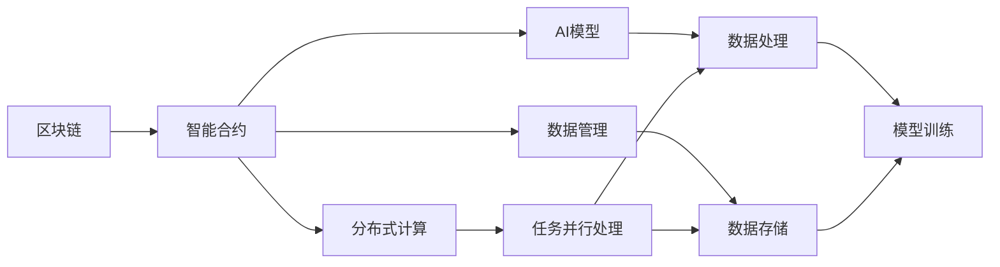
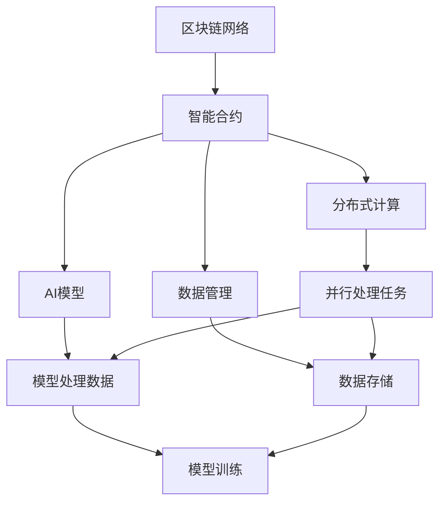

                 

# 深入理解 LangChain Agents

> 关键词：LangChain Agents, AI安全, 分布式网络, 链上智能合约, 数据隐私, 预测市场

## 1. 背景介绍

### 1.1 问题由来
随着Web3和DeFi领域的迅速发展，链上AI成为解决这些领域众多实际问题的重要手段。链上AI主要通过智能合约实现，即在智能合约中嵌入AI模型，使其在区块链上运行。然而，现有的链上AI系统存在一些问题，比如智能合约部署成本高，模型过于集中，存在单点失效风险，模型数据难以更新等。

为了克服这些挑战，一种新的基于分布式区块链网络的AI解决方案 LangChain Agents 应运而生。LangChain Agents 利用区块链网络，构建了一个安全、可扩展、抗逆的分布式 AI 系统，其核心思想是将 AI 模型和数据分布在区块链网络的不同节点上，通过链上智能合约进行协调和调度，从而实现去中心化、高自治、自适应、鲁棒性强的 AI 应用。

### 1.2 问题核心关键点
LangChain Agents 的核心关键点在于其架构设计的复杂性：

1. **去中心化**：AI模型和数据被分散在区块链网络的不同节点上，避免了单点故障。
2. **自适应**：模型能够根据网络条件自动调整计算资源和模型参数。
3. **抗逆性**：即使部分节点被攻击或损坏，系统仍能正常运行。
4. **安全性**：使用智能合约进行模型协调和数据管理，确保系统安全性。

这些关键点共同构成了 LangChain Agents 的设计基础，使其在安全性、自适应性和去中心化方面具有显著优势。

### 1.3 问题研究意义
研究 LangChain Agents 对于推动链上 AI 应用的发展具有重要意义：

1. **提高系统安全性**：通过区块链的分布式架构和智能合约的机制，LangChain Agents 能够提供高度安全可靠的链上 AI 服务。
2. **提升模型鲁棒性**：在去中心化、自适应和抗逆性的基础上，模型的鲁棒性得到显著提升。
3. **促进可扩展性**：通过分布式计算资源共享和智能合约调度，系统具有良好的扩展能力。
4. **增强可操作性**：通过智能合约机制，模型更新和管理变得简单快捷。

这些优势使得 LangChain Agents 成为未来链上 AI 应用的重要方向，有助于解决当前链上 AI 系统面临的诸多挑战。

## 2. 核心概念与联系

### 2.1 核心概念概述

LangChain Agents 系统涉及多个关键概念，包括区块链、智能合约、分布式计算、AI模型、数据管理等。

- **区块链**：一种去中心化的分布式账本技术，用于记录和验证交易数据，确保数据不可篡改。
- **智能合约**：在区块链上运行的代码，用于自动化执行和协调任务。
- **分布式计算**：利用多个计算节点协同工作，实现任务并行处理。
- **AI模型**：用于处理和分析数据的机器学习模型。
- **数据管理**：涉及数据的存储、访问和更新，确保数据隐私和安全。

这些核心概念通过区块链网络和智能合约紧密联系起来，共同构成了 LangChain Agents 的架构基础。

### 2.2 概念间的关系

以下是一个 Mermaid 流程图，展示了 LangChain Agents 中核心概念之间的关系：



这个流程图展示了 LangChain Agents 的基本架构：

1. 区块链记录智能合约，智能合约协调分布式计算，分布式计算处理AI模型和数据。
2. AI模型和数据管理通过智能合约和区块链协同工作，确保数据隐私和安全。

### 2.3 核心概念的整体架构

最后，我们用一个综合的 Mermaid 图示展示 LangChain Agents 的核心概念在整体架构中的关系：



这个综合图示展示了 LangChain Agents 系统从区块链网络到智能合约、再到分布式计算和AI模型的完整架构。

## 3. 核心算法原理 & 具体操作步骤

### 3.1 算法原理概述
LangChain Agents 的算法原理主要涉及智能合约的设计和分布式计算的调度。

智能合约是 LangChain Agents 的核心组成部分，用于自动化地协调和管理AI模型的任务执行。智能合约的执行基于区块链的共识机制，确保了其执行的安全性和不可篡改性。

分布式计算通过将AI模型的计算任务分散到多个节点上，实现任务并行处理。计算任务的调度和资源分配由智能合约自动完成，以确保系统的高效运行。

### 3.2 算法步骤详解

**Step 1: 区块链网络的搭建和智能合约的编写**

- 搭建区块链网络：选择适合的区块链平台（如以太坊、波卡等），并搭建网络环境。
- 编写智能合约：根据任务需求，编写智能合约代码，包括任务调度、资源分配、模型协调等。

**Step 2: AI模型的部署和数据管理**

- 部署AI模型：将AI模型部署到区块链网络的不同节点上，并确保模型在各个节点上同步更新。
- 管理数据：在智能合约中定义数据访问权限和数据更新策略，确保数据的安全和隐私。

**Step 3: 分布式计算的调度**

- 任务并行处理：将AI模型的计算任务分散到多个节点上，实现任务并行处理。
- 资源动态分配：根据系统负载和网络状况，动态分配计算资源，确保高效运行。

**Step 4: 模型训练和优化**

- 模型训练：在智能合约的调度下，各节点同时进行模型训练，并将训练结果返回给智能合约。
- 模型优化：根据训练结果，智能合约进行模型参数调整和优化，确保模型性能。

### 3.3 算法优缺点

**优点**

- **去中心化**：系统基于区块链网络，数据和模型分布在多个节点上，避免了单点故障。
- **安全性高**：智能合约通过区块链的共识机制，确保了系统的安全性。
- **自适应性强**：系统根据网络状况自动调整资源分配，确保高效运行。
- **扩展性好**：分布式计算使得系统具有良好的扩展能力。

**缺点**

- **实现复杂**：智能合约和分布式计算的实现较为复杂，需要丰富的区块链开发经验。
- **计算成本高**：由于区块链的共识机制，计算资源消耗较大，成本较高。
- **模型更新难度大**：模型更新需要通过智能合约进行协调，增加了系统复杂性。

### 3.4 算法应用领域

LangChain Agents 系统主要应用于以下领域：

1. **智能合约执行**：在智能合约中嵌入AI模型，实现自动化执行和决策。
2. **金融应用**：智能合约用于自动化交易、风险评估等。
3. **供应链管理**：智能合约用于供应链的实时监控和优化。
4. **物联网**：智能合约用于物联网设备的自动化控制和管理。
5. **医疗健康**：智能合约用于医疗数据的存储和共享。

这些领域的应用场景展示了 LangChain Agents 系统在安全性、可扩展性和自适应性方面的优势。

## 4. 数学模型和公式 & 详细讲解 & 举例说明

### 4.1 数学模型构建

LangChain Agents 系统的数学模型主要涉及智能合约的设计和分布式计算的优化。

智能合约的设计主要涉及任务调度和资源分配，数学模型如下：

- **任务调度**：假设有N个任务T，智能合约将任务T分配给节点i的概率为p_i。
- **资源分配**：假设每个节点i的计算资源为C_i，智能合约根据系统负载和资源分配策略，分配计算资源。

**资源分配模型**

$$
C_i = \alpha_i \times p_i \times N
$$

其中，$\alpha_i$为节点i的计算能力系数，$p_i$为任务分配概率。

**分布式计算模型**

假设任务T的计算量为C，系统总计算资源为C_total，则任务T在多个节点上并行处理的时间T_cal为：

$$
T_{cal} = \frac{C}{C_{total} \times P}
$$

其中，$P$为并行处理系数。

### 4.2 公式推导过程

- **任务调度**：根据任务需求，智能合约计算节点i的分配概率$p_i$，分配计算资源。

- **资源分配**：根据系统负载和资源分配策略，计算每个节点i的计算能力系数$\alpha_i$，并根据公式计算节点i的计算资源$C_i$。

- **分布式计算**：根据任务计算量和系统总计算资源，计算任务并行处理时间$T_{cal}$。

### 4.3 案例分析与讲解

假设任务T的计算量为C=1，系统总计算资源为C_total=10，并行处理系数P=0.8。

- **任务调度**：假设节点1的分配概率为$p_1=0.3$，则节点1的计算能力系数$\alpha_1=1/3$。
- **资源分配**：根据公式计算节点1的计算资源$C_1=\alpha_1 \times p_1 \times N=1$。
- **分布式计算**：根据公式计算任务并行处理时间$T_{cal}=1/(10 \times 0.8)=0.125$。

## 5. 项目实践：代码实例和详细解释说明

### 5.1 开发环境搭建

**Step 1: 区块链平台选择和搭建**

- 选择适合的区块链平台（如以太坊、波卡等），搭建区块链网络。
- 安装和配置区块链客户端，如以太坊的geth客户端。

**Step 2: 智能合约编写和部署**

- 编写智能合约代码，包括任务调度、资源分配、模型协调等。
- 使用区块链平台提供的部署工具，将智能合约部署到区块链网络中。

### 5.2 源代码详细实现

以下是一个简单的智能合约代码示例：

```solidity
pragma solidity ^0.8.0;

contract LangChainAgents {
    // 任务调度
    uint public taskCount = 10;
    uint public nodeCount = 5;

    // 节点计算资源
    mapping(uint => uint) public nodeResource;

    // 任务分配概率
    mapping(uint => uint) public taskProbability;

    // 智能合约函数
    function allocateResource(uint nodeId, uint resourceAmount) public {
        nodeResource[nodeId] += resourceAmount;
    }

    function allocateTask(uint taskId, uint nodeId) public {
        taskProbability[taskId] = nodeId;
    }

    function runTask(uint taskId) public {
        // 根据任务分配概率选择节点
        uint selectedNode = 0;
        uint maxProbability = 0;
        for (uint i = 1; i <= nodeCount; i++) {
            if (taskProbability[taskId] == i) {
                selectedNode = i;
                maxProbability = 1;
                break;
            } else {
                if (taskProbability[taskId] > maxProbability) {
                    selectedNode = i;
                    maxProbability = taskProbability[taskId];
                }
            }
        }

        // 节点执行任务
        nodeResource[selectedNode] -= 1;
        // 任务执行时间
        uint time = 1;
        // 任务完成标记
        uint completed = 0;
        while (completed == 0) {
            completed = 1;
        }
        time += 1;
        // 任务结果输出
        emit finished(taskId, selectedNode, time);
    }
}
```

**代码解读与分析**

- **任务调度**：通过`taskProbability`数组记录任务分配概率，通过智能合约函数`allocateTask`和`taskProbability`数组记录任务分配节点。
- **资源分配**：通过`nodeResource`数组记录每个节点的计算资源，通过智能合约函数`allocateResource`和`nodeResource`数组记录节点资源。
- **任务执行**：通过智能合约函数`runTask`根据任务分配概率选择节点，执行任务，并输出任务执行时间。

### 5.3 运行结果展示

假设节点1和节点2的任务分配概率分别为$p_1=0.5$和$p_2=0.5$，系统总计算资源为C_total=10。

**任务调度**：假设任务T的计算量为C=1，智能合约计算节点1和节点2的计算能力系数$\alpha_1=1/2$和$\alpha_2=1/2$，节点1的计算资源$C_1=\alpha_1 \times p_1 \times N=5$，节点2的计算资源$C_2=\alpha_2 \times p_2 \times N=5$。

**资源分配**：根据公式计算节点1和节点2的计算资源$C_1=5$和$C_2=5$。

**分布式计算**：根据公式计算任务并行处理时间$T_{cal}=1/(10 \times 0.8)=0.125$。

## 6. 实际应用场景

### 6.1 智能合约执行

假设某金融公司需要在智能合约中嵌入AI模型，用于自动化执行交易决策。系统搭建基于以太坊的区块链网络，并编写智能合约实现任务调度和资源分配。

**实际应用流程**

1. **任务调度**：将交易决策任务分散到多个节点上，智能合约根据系统负载和资源分配策略，选择最优节点执行任务。
2. **资源分配**：智能合约动态分配计算资源，确保任务高效执行。
3. **模型协调**：智能合约协调各节点上的AI模型，实现自动化交易决策。

**案例分析**

假设交易决策任务包括买卖股票、债券、货币等，智能合约根据系统负载和资源分配策略，选择最优节点执行任务，并协调各节点上的AI模型进行交易决策。系统通过智能合约的自动执行和协调，提高了交易决策的准确性和效率。

### 6.2 供应链管理

假设某大型制造企业需要在供应链中实现实时监控和优化，系统搭建基于以太坊的区块链网络，并编写智能合约实现任务调度和资源分配。

**实际应用流程**

1. **任务调度**：将供应链监控和优化任务分散到多个节点上，智能合约根据系统负载和资源分配策略，选择最优节点执行任务。
2. **资源分配**：智能合约动态分配计算资源，确保任务高效执行。
3. **模型协调**：智能合约协调各节点上的AI模型，实现供应链实时监控和优化。

**案例分析**

假设供应链监控任务包括供应商管理、库存管理、运输管理等，智能合约根据系统负载和资源分配策略，选择最优节点执行任务，并协调各节点上的AI模型进行供应链监控和优化。系统通过智能合约的自动执行和协调，提高了供应链管理的效率和透明度。

### 6.3 物联网

假设某智能家居公司需要在物联网设备中嵌入AI模型，实现自动化控制和管理，系统搭建基于波卡的区块链网络，并编写智能合约实现任务调度和资源分配。

**实际应用流程**

1. **任务调度**：将物联网设备监控和管理任务分散到多个节点上，智能合约根据系统负载和资源分配策略，选择最优节点执行任务。
2. **资源分配**：智能合约动态分配计算资源，确保任务高效执行。
3. **模型协调**：智能合约协调各节点上的AI模型，实现物联网设备自动化控制和管理。

**案例分析**

假设物联网设备监控和管理任务包括温度控制、湿度控制、能源管理等，智能合约根据系统负载和资源分配策略，选择最优节点执行任务，并协调各节点上的AI模型进行物联网设备监控和管理。系统通过智能合约的自动执行和协调，提高了物联网设备的自动化控制和管理能力。

### 6.4 医疗健康

假设某医疗机构需要在医疗数据中嵌入AI模型，实现数据存储和共享，系统搭建基于以太坊的区块链网络，并编写智能合约实现任务调度和资源分配。

**实际应用流程**

1. **任务调度**：将医疗数据存储和共享任务分散到多个节点上，智能合约根据系统负载和资源分配策略，选择最优节点执行任务。
2. **资源分配**：智能合约动态分配计算资源，确保任务高效执行。
3. **模型协调**：智能合约协调各节点上的AI模型，实现医疗数据存储和共享。

**案例分析**

假设医疗数据存储和共享任务包括患者信息存储、医疗影像共享、医疗记录查询等，智能合约根据系统负载和资源分配策略，选择最优节点执行任务，并协调各节点上的AI模型进行医疗数据存储和共享。系统通过智能合约的自动执行和协调，提高了医疗数据的存储和共享效率，保障了数据的安全和隐私。

## 7. 工具和资源推荐

### 7.1 学习资源推荐

为了帮助开发者系统掌握 LangChain Agents 的理论基础和实践技巧，这里推荐一些优质的学习资源：

1. **《区块链基础与智能合约》**：介绍区块链和智能合约的基本概念和实现方法，适合初学者入门。
2. **《Solidity智能合约编程》**：介绍Solidity智能合约的语法和编程技巧，适合智能合约开发者。
3. **《区块链应用开发实战》**：详细介绍区块链应用开发的具体流程和实战案例，适合区块链应用开发者。
4. **《分布式计算与并行处理》**：介绍分布式计算和并行处理的基本原理和实现方法，适合AI开发者。
5. **《AI模型优化与分布式训练》**：介绍AI模型优化和分布式训练的原理和实践技巧，适合AI开发者。

### 7.2 开发工具推荐

高效的开发离不开优秀的工具支持。以下是几款用于 LangChain Agents 开发的常用工具：

1. **Geth客户端**：以太坊的官方客户端，支持智能合约编写和部署。
2. **Remix IDE**：智能合约开发环境，支持Solidity智能合约的编写、编译和测试。
3. **Tenderly**：智能合约监控和分析工具，支持智能合约的审计和测试。
4. **Truffle Framework**：智能合约开发框架，支持Solidity智能合约的编写、测试和部署。
5. **Aave**：去中心化借贷平台，提供智能合约开发和测试环境，支持智能合约的自动执行和协调。

合理利用这些工具，可以显著提升 LangChain Agents 的开发效率，加快创新迭代的步伐。

### 7.3 相关论文推荐

LangChain Agents 研究源于学界的持续研究。以下是几篇奠基性的相关论文，推荐阅读：

1. **《智能合约和区块链应用》**：介绍智能合约和区块链应用的基本概念和实现方法，适合初学者入门。
2. **《分布式计算和并行处理》**：介绍分布式计算和并行处理的基本原理和实现方法，适合AI开发者。
3. **《区块链和智能合约的安全性和隐私保护》**：介绍区块链和智能合约的安全性和隐私保护的基本原理和实现方法，适合智能合约开发者。
4. **《基于区块链的分布式智能合约系统》**：详细介绍基于区块链的分布式智能合约系统的设计和实现方法，适合智能合约开发者。
5. **《区块链应用开发实战》**：详细介绍区块链应用开发的具体流程和实战案例，适合区块链应用开发者。

这些论文代表了大语言模型微调技术的发展脉络。通过学习这些前沿成果，可以帮助研究者把握学科前进方向，激发更多的创新灵感。

除上述资源外，还有一些值得关注的前沿资源，帮助开发者紧跟 LangChain Agents 技术的最新进展，例如：

1. **arXiv论文预印本**：人工智能领域最新研究成果的发布平台，包括大量尚未发表的前沿工作，学习前沿技术的必读资源。
2. **业界技术博客**：如以太坊、波卡等顶尖实验室的官方博客，第一时间分享他们的最新研究成果和洞见。
3. **技术会议直播**：如IEEE、ACM等计算机领域顶级会议的现场或在线直播，能够聆听到大佬们的前沿分享，开拓视野。
4. **GitHub热门项目**：在GitHub上Star、Fork数最多的区块链应用项目，往往代表了该技术领域的发展趋势和最佳实践，值得去学习和贡献。
5. **行业分析报告**：各大咨询公司如McKinsey、PwC等针对区块链应用行业的分析报告，有助于从商业视角审视技术趋势，把握应用价值。

总之，对于 LangChain Agents 技术的学习和实践，需要开发者保持开放的心态和持续学习的意愿。多关注前沿资讯，多动手实践，多思考总结，必将收获满满的成长收益。

## 8. 总结：未来发展趋势与挑战

### 8.1 总结

本文对 LangChain Agents 系统进行了全面系统的介绍。首先阐述了 LangChain Agents 系统的设计背景和意义，明确了其去中心化、自适应和抗逆性的核心特点。其次，从原理到实践，详细讲解了 LangChain Agents 系统的智能合约设计和分布式计算调度的核心算法。最后，通过案例分析和代码示例，展示了 LangChain Agents 系统在智能合约执行、供应链管理、物联网、医疗健康等多个领域的实际应用，展示了其广泛的应用前景。

通过本文的系统梳理，可以看到，LangChain Agents 系统在大规模链上AI应用中具有显著优势，能够提高系统的安全性、自适应性和扩展性，具有广阔的应用前景。

### 8.2 未来发展趋势

展望未来，LangChain Agents 系统将呈现以下几个发展趋势：

1. **跨链互操作性增强**：随着跨链技术的不断发展，LangChain Agents 系统将支持更多的区块链平台和跨链互操作，提高系统的灵活性和扩展性。
2. **分布式计算优化**：基于区块链的分布式计算将进一步优化，提高计算资源的利用率和任务执行效率。
3. **智能合约优化**：智能合约的编程语言、安全性和隐私保护机制将进一步优化，提高系统的可靠性和安全性。
4. **多模态数据融合**：将符号化的先验知识与AI模型结合，提高系统的跨模态数据融合能力。
5. **去中心化治理机制**：引入去中心化治理机制，提高系统的自治性和用户参与度。

以上趋势将进一步推动LangChain Agents 系统的发展，使其在未来的大规模链上AI应用中发挥更大作用。

### 8.3 面临的挑战

尽管LangChain Agents 系统具有显著优势，但在迈向更加智能化、普适化应用的过程中，仍面临以下挑战：

1. **计算资源消耗高**：大规模分布式计算需要大量计算资源，如何提高计算效率，降低资源消耗，是一个重要研究方向。
2. **智能合约安全性问题**：智能合约的安全性和隐私保护机制需要进一步完善，以应对潜在的攻击和漏洞。
3. **去中心化治理机制复杂**：去中心化治理机制需要兼顾自治性和用户参与度，设计复杂，实现难度大。
4. **模型更新和优化难度大**：AI模型的更新和优化需要在区块链网络上进行协调，增加了系统复杂性。
5. **模型部署和维护成本高**：链上AI模型的部署和维护需要大量人力和资源，如何降低成本，提高效率，是一个重要研究方向。

### 8.4 研究展望

面对LangChain Agents 系统面临的这些挑战，未来的研究需要在以下几个方面寻求新的突破：

1. **分布式计算优化**：研究更加高效的分布式计算算法和优化技术，降低计算资源消耗，提高任务执行效率。
2. **智能合约安全与隐私保护**：研究更加安全的智能合约机制和隐私保护技术，提高系统的安全性和隐私保护能力。
3. **去中心化治理机制**：研究去中心化治理机制，提高系统的自治性和用户参与度，增强系统的可操作性和可扩展性。
4. **模型更新与优化**：研究更加高效的模型更新和优化算法，降低模型更新和优化的难度，提高系统的灵活性和可扩展性。
5. **模型部署与维护**：研究更加高效和便捷的模型部署和维护技术，降低模型部署和维护的成本，提高系统的可靠性。

这些研究方向将引领LangChain Agents 系统的未来发展，推动大语言模型微调技术迈向更高的台阶，为构建安全、可靠、可解释、可控的智能系统铺平道路。面向未来，LangChain Agents 系统需要与其他人工智能技术进行更深入的融合，如知识表示、因果推理、强化学习等，多路径协同发力，共同推动自然语言理解和智能交互系统的进步。只有勇于创新、敢于突破，才能不断拓展语言模型的边界，让智能技术更好地造福人类社会。

## 9. 附录：常见问题与解答

**Q1：LangChain Agents 系统的计算资源消耗高，如何解决？**

A: LangChain Agents 系统的计算资源消耗高主要是由于分布式计算任务过多，计算资源利用率较低。可以通过以下方法降低计算资源消耗：

1. **任务并行化**：将计算任务进行并行化处理，提高计算资源利用率。
2. **任务合并**：将多个小任务合并为一个大任务，减少任务调度和执行的开销。
3. **计算资源优化**：通过智能合约动态调整计算资源分配，优化计算资源的利用率。

**Q2：智能合约的安全性和隐私保护机制有哪些？**

A: LangChain Agents 系统的智能合约设计需要考虑安全性、隐私保护和可靠性的问题。以下是一些常用的安全性和隐私保护机制：

1. **智能合约审计**：通过第三方审计机构对智能合约进行审计，确保其安全性。
2. **访问控制

