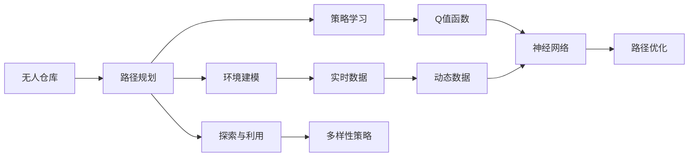
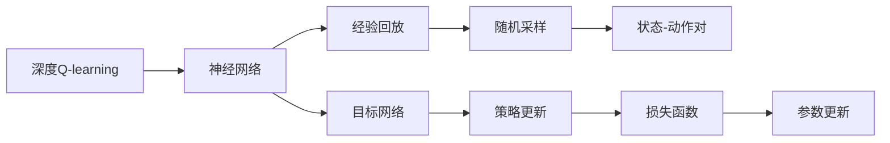
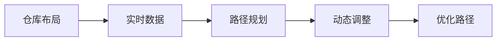
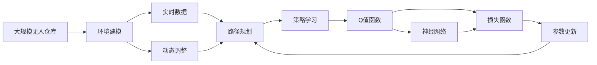

                 

## 1. 背景介绍

### 1.1 问题由来

在当今物流仓储领域，自动化和智能化已经成为发展的大趋势。无人仓库系统作为这一趋势的重要代表，已经成为推动物流仓储产业变革的关键技术之一。无人仓库不仅能够大幅提升仓储效率、降低人力成本，还能实现仓储系统的智能化管理，提高货物存储和分拣的准确性和安全性。

然而，无人仓库系统的核心在于智能化的货物分拣和路径规划。传统的路径规划方法通常依赖于人工经验或简单的启发式算法，无法充分利用仓库内部的实时环境信息，无法对动态变化的环境做出快速反应。近年来，随着强化学习技术的发展，深度强化学习（Deep Reinforcement Learning, DRL）成为了解决无人仓库路径规划问题的有力工具。

### 1.2 问题核心关键点

在无人仓库路径规划中，核心问题可以归结为：

- **环境建模**：如何构建一个能够准确反映无人仓库内部动态环境的模型，包括货物位置、仓库布局、路径宽度、障碍物等关键因素。
- **策略学习**：如何设计一个有效的策略函数，使得机器人在特定环境下能够优化路径规划，提升货物分拣效率。
- **探索与利用**：如何在保证路径规划效果的同时，避免机器人在已有路径上过度重复，确保路径的多样性和探索性。
- **计算效率**：如何高效地训练模型，降低训练和推理时间，使路径规划系统能够实时响应动态变化。

深度强化学习，尤其是深度Q-learning（Deep Q-learning, DQN），在无人仓库路径规划中的应用，解决了上述核心问题，为无人仓库系统的智能化提供了新的解决方案。

### 1.3 问题研究意义

深度Q-learning在无人仓库路径规划中的应用，具有以下重要意义：

1. **提升路径规划效率**：DQN能够通过学习最优路径规划策略，大幅提升无人仓库货物分拣的速度和准确性，降低分拣成本。
2. **适应动态环境**：DQN能够实时调整路径规划策略，适应无人仓库内部的动态环境变化，提高系统的鲁棒性和可靠性。
3. **增强系统自主性**：DQN使得无人仓库系统具备自主学习和优化路径规划的能力，减少了对人工干预的依赖。
4. **促进产业升级**：无人仓库系统的智能化应用，能够推动物流仓储行业的转型升级，提升整体产业的效率和竞争力。
5. **推动技术创新**：DQN技术的引入，促进了无人仓库路径规划技术的创新和突破，为其他领域的强化学习应用提供了有益的借鉴。

## 2. 核心概念与联系

### 2.1 核心概念概述

为了更好地理解深度Q-learning在无人仓库路径规划中的应用，我们需要首先了解一些核心概念：

- **深度Q-learning（DQN）**：一种基于神经网络实现的Q-learning算法，能够通过自适应调整Q值函数，最大化长期奖励，实现最优路径规划。
- **路径规划**：在无人仓库中，确定从起点到终点的最短路径的过程。路径规划的效率直接影响无人仓库的整体运行效率。
- **强化学习（Reinforcement Learning, RL）**：一种机器学习范式，通过智能体（agent）与环境（environment）的交互，学习最优策略，以最大化累积奖励。
- **Q值函数（Q-function）**：表示在当前状态下，执行特定动作后，达到下一个状态的最大预期奖励。
- **策略函数（Policy）**：在给定状态下，选择动作的概率分布函数。

这些概念之间有着紧密的联系，形成了一个完整的无人仓库路径规划系统。接下来，我们将通过一个Mermaid流程图来展示这些概念之间的关系：



这个流程图展示了无人仓库路径规划系统的整体架构：

1. **环境建模**：实时获取仓库内部环境数据，构建仓库环境模型。
2. **策略学习**：使用DQN算法，学习最优路径规划策略。
3. **探索与利用**：在策略学习过程中，平衡探索新路径和利用已有路径。
4. **路径优化**：根据学习到的路径规划策略，优化实际路径，提升分拣效率。

### 2.2 概念间的关系

这些核心概念之间存在着紧密的联系，共同构成了无人仓库路径规划系统的完整生态系统。下面我们通过几个Mermaid流程图来展示这些概念之间的关系。

#### 2.2.1 无人仓库路径规划系统


这个流程图展示了无人仓库路径规划系统的完整流程：

1. **环境建模**：实时获取仓库内部环境数据，构建仓库环境模型。
2. **策略学习**：使用DQN算法，学习最优路径规划策略。
3. **探索与利用**：在策略学习过程中，平衡探索新路径和利用已有路径。
4. **路径优化**：根据学习到的路径规划策略，优化实际路径，提升分拣效率。

#### 2.2.2 深度Q-learning原理



这个流程图展示了DQN算法的核心原理：

1. **神经网络**：构建一个神经网络，作为Q值函数，估计当前状态下的动作值。
2. **经验回放**：将历史状态-动作对存储在缓冲区中，随机采样进行训练。
3. **目标网络**：引入一个稳定的目标网络，与当前网络竞争更新。
4. **随机采样**：从缓冲区中随机采样状态-动作对，更新当前网络。
5. **策略更新**：根据采样到的状态和动作，更新Q值函数。
6. **损失函数**：计算当前网络与目标网络的Q值之差的平方，作为损失函数。
7. **参数更新**：使用梯度下降等优化算法，更新神经网络的参数。

#### 2.2.3 路径规划的动态性



这个流程图展示了路径规划的动态过程：

1. **仓库布局**：仓库布局是静态的，但货物位置和障碍物是动态变化的。
2. **实时数据**：实时获取货物位置和障碍物信息。
3. **路径规划**：根据实时数据，进行路径规划。
4. **动态调整**：根据实时数据的变化，动态调整路径规划策略。
5. **优化路径**：根据当前策略，优化路径，确保实时性。

### 2.3 核心概念的整体架构

最后，我们用一个综合的流程图来展示这些核心概念在大规模无人仓库路径规划中的整体架构：



这个综合流程图展示了从环境建模到路径规划，再到策略学习的完整过程。大规模无人仓库的路径规划系统通过实时获取环境数据，构建环境模型，并使用深度Q-learning算法，学习最优路径规划策略，不断动态调整路径，确保分拣效率和系统稳定性。

## 3. 核心算法原理 & 具体操作步骤

### 3.1 算法原理概述

深度Q-learning（DQN）是一种基于神经网络的强化学习算法，能够通过自适应调整Q值函数，最大化长期奖励，实现最优路径规划。在无人仓库路径规划中，DQN通过以下步骤完成路径规划：

1. **环境建模**：实时获取仓库内部环境数据，构建仓库环境模型。
2. **策略学习**：使用DQN算法，学习最优路径规划策略。
3. **探索与利用**：在策略学习过程中，平衡探索新路径和利用已有路径。
4. **路径优化**：根据学习到的路径规划策略，优化实际路径，提升分拣效率。

### 3.2 算法步骤详解

#### 3.2.1 环境建模

在无人仓库中，环境建模是路径规划的第一步。环境建模的主要目标是构建一个能够准确反映仓库内部动态环境的模型，包括货物位置、仓库布局、路径宽度、障碍物等关键因素。常用的环境建模方法包括：

- **静态布局**：在无人仓库系统中，仓库布局是静态的，包括仓库的几何尺寸、结构布局、货物存放位置等。通过构建仓库的二维或三维模型，可以为路径规划提供静态参考。
- **实时数据**：在无人仓库系统中，货物位置和障碍物是动态变化的。通过实时获取货物位置、货物状态、路径宽度、障碍物信息等，可以为路径规划提供动态数据支持。

#### 3.2.2 策略学习

策略学习是DQN算法的核心。在无人仓库路径规划中，策略学习的目标是学习一个能够最大化长期奖励的路径规划策略。具体步骤包括：

- **初始化**：定义一个神经网络作为Q值函数，初始化网络参数。
- **训练**：从经验回放缓冲区中随机采样状态-动作对，计算Q值函数的估计值，更新网络参数。
- **目标网络**：引入一个稳定的目标网络，与当前网络竞争更新。
- **策略更新**：根据采样到的状态和动作，更新Q值函数。
- **损失函数**：计算当前网络与目标网络的Q值之差的平方，作为损失函数。
- **参数更新**：使用梯度下降等优化算法，更新神经网络的参数。

#### 3.2.3 探索与利用

在策略学习过程中，DQN算法需要平衡探索新路径和利用已有路径。探索新路径有助于发现更优的路径规划策略，但会增加计算成本。利用已有路径则可以提高路径规划的效率，但可能导致路径规划的局部最优。常用的探索与利用策略包括：

- **$\epsilon$-贪心策略**：在一定概率$\epsilon$下，选择随机动作，其余概率下选择最优动作。
- **UCB策略**：在探索和利用之间进行平衡，选择具有高奖励估计值和较低动作次数的路径。
- **Q值插值策略**：通过插值计算，对新动作和已有动作的Q值进行平衡，减少路径规划的方差。

#### 3.2.4 路径优化

在策略学习完成后，DQN算法需要根据学习到的路径规划策略，优化实际路径。路径优化的一般步骤如下：

- **路径规划**：根据学习到的路径规划策略，生成一条初始路径。
- **路径评估**：通过评估函数，计算路径的奖励值。
- **路径调整**：根据评估结果，调整路径上的节点，优化路径。
- **路径更新**：将优化后的路径更新到路径规划系统中，供后续使用。

### 3.3 算法优缺点

深度Q-learning在无人仓库路径规划中的应用具有以下优点：

1. **适应动态环境**：DQN能够实时调整路径规划策略，适应无人仓库内部的动态环境变化，提高系统的鲁棒性和可靠性。
2. **提升路径规划效率**：DQN通过学习最优路径规划策略，能够大幅提升无人仓库货物分拣的速度和准确性，降低分拣成本。
3. **增强系统自主性**：DQN使得无人仓库系统具备自主学习和优化路径规划的能力，减少了对人工干预的依赖。

同时，DQN也存在一些缺点：

1. **计算复杂度高**：DQN需要大量的训练数据和计算资源，尤其是在大规模无人仓库系统中，计算复杂度较高。
2. **数据采集难度大**：在无人仓库系统中，实时获取环境数据具有一定的难度，需要高性能传感器和数据处理设备。
3. **模型稳定性差**：DQN模型的参数更新过程容易受到噪声和随机采样的影响，可能导致模型不稳定。

### 3.4 算法应用领域

深度Q-learning在无人仓库路径规划中的应用，已经在多个实际项目中得到了验证，并取得了显著的效果。其主要应用领域包括：

- **智能仓储系统**：通过DQN算法优化仓库内货物的分拣路径，提高仓储效率，降低人力成本。
- **物流配送中心**：在物流配送中心，通过DQN算法优化货物的装卸和分拣路径，提升物流效率，降低配送成本。
- **自动化立体仓库**：在自动化立体仓库中，通过DQN算法优化货物的存取路径，提高仓储效率，减少人工干预。
- **智能库房管理**：通过DQN算法优化库房内部的货物管理，提高仓库管理效率，降低库存成本。
- **工业机器人路径规划**：在工业机器人系统中，通过DQN算法优化机器人的路径规划，提高机器人作业效率，降低作业成本。

## 4. 数学模型和公式 & 详细讲解

### 4.1 数学模型构建

在无人仓库路径规划中，深度Q-learning的数学模型可以表示为：

$$
Q(s, a) = r + \gamma \max_{a'} Q(s', a')
$$

其中：
- $Q(s, a)$：在状态$s$下，执行动作$a$的Q值。
- $r$：执行动作$a$后，即时奖励。
- $\gamma$：折扣因子，表示未来的奖励在当前奖励中的权重。
- $s'$：执行动作$a$后，到达的新状态。
- $a'$：在新状态$s'$下，执行的动作。

在无人仓库系统中，状态$s$表示当前环境的状态，动作$a$表示机器人的移动方向，奖励$r$表示路径规划的效率和准确性。通过最大化Q值函数，DQN算法可以学习到最优的路径规划策略。

### 4.2 公式推导过程

深度Q-learning的公式推导过程涉及以下几个步骤：

1. **状态表示**：将无人仓库内部的环境状态表示为向量$s$，其中包含货物位置、障碍物位置、路径宽度等关键信息。
2. **动作表示**：将机器人的移动方向表示为向量$a$，其中包含左、右、前进、后退等动作。
3. **即时奖励**：将即时奖励$r$定义为路径规划的效率和准确性，可以通过路径长度、障碍物避免等指标进行衡量。
4. **折扣因子**：折扣因子$\gamma$用于平衡当前奖励和未来奖励，通常设置为0.99。
5. **Q值函数**：通过神经网络构建Q值函数，对状态和动作的Q值进行估计。
6. **策略函数**：根据Q值函数，设计策略函数，选择最优动作。

### 4.3 案例分析与讲解

以一个简单的无人仓库路径规划为例，分析深度Q-learning的应用过程：

- **环境建模**：构建一个二维的仓库模型，包含货物位置、障碍物位置和路径宽度等关键信息。
- **策略学习**：使用DQN算法，学习最优路径规划策略。通过神经网络构建Q值函数，对状态和动作的Q值进行估计。
- **探索与利用**：在策略学习过程中，通过$\epsilon$-贪心策略，平衡探索新路径和利用已有路径。
- **路径优化**：根据学习到的路径规划策略，生成初始路径，并根据评估函数，调整路径上的节点，优化路径。

## 5. 项目实践：代码实例和详细解释说明

### 5.1 开发环境搭建

在进行无人仓库路径规划的DQN实践前，我们需要准备好开发环境。以下是使用Python进行PyTorch开发的虚拟环境配置流程：

1. 安装Anaconda：从官网下载并安装Anaconda，用于创建独立的Python环境。

2. 创建并激活虚拟环境：
```bash
conda create -n pytorch-env python=3.8 
conda activate pytorch-env
```

3. 安装PyTorch：根据CUDA版本，从官网获取对应的安装命令。例如：
```bash
conda install pytorch torchvision torchaudio cudatoolkit=11.1 -c pytorch -c conda-forge
```

4. 安装Transformers库：
```bash
pip install transformers
```

5. 安装各类工具包：
```bash
pip install numpy pandas scikit-learn matplotlib tqdm jupyter notebook ipython
```

完成上述步骤后，即可在`pytorch-env`环境中开始DQN实践。

### 5.2 源代码详细实现

这里我们以一个简单的无人仓库路径规划为例，给出使用PyTorch实现DQN的Python代码实现。

首先，定义无人仓库环境状态：

```python
import numpy as np
import torch
from torch import nn, optim

class Warehouse:
    def __init__(self, size=10):
        self.size = size
        self.grid = np.zeros((size, size), dtype=np.int8)
        self.init_grid()
        self.ranges = (0, 1, 2, 3)
    
    def init_grid(self):
        for i in range(1, 6):
            for j in range(1, 6):
                self.grid[i-1][j-1] = 2
        self.grid[6][3] = 2
        self.grid[6][4] = 2
        self.grid[6][5] = 2
        self.grid[6][6] = 2
    
    def get_state(self, pos):
        return self.grid[pos[0]][pos[1]]
    
    def set_state(self, pos, value):
        self.grid[pos[0]][pos[1]] = value
```

然后，定义DQN模型的神经网络结构：

```python
class QNetwork(nn.Module):
    def __init__(self, input_size, output_size):
        super(QNetwork, self).__init__()
        self.fc1 = nn.Linear(input_size, 256)
        self.fc2 = nn.Linear(256, 256)
        self.fc3 = nn.Linear(256, output_size)
    
    def forward(self, x):
        x = F.relu(self.fc1(x))
        x = F.relu(self.fc2(x))
        x = self.fc3(x)
        return x
```

接着，定义DQN算法的优化器和目标网络：

```python
def create_dqn(env, model, optimizer, target_net):
    target_net.load_state_dict(model.state_dict())
    target_net.eval()
    optimizer = optim.Adam(model.parameters(), lr=0.001)
    return target_net, optimizer
```

最后，定义DQN算法的训练函数：

```python
def dqn_train(env, model, optimizer, target_net, epsilon, num_episodes):
    target_net.eval()
    rewards = []
    for i in range(num_episodes):
        state = env.get_state(env.start)
        done = False
        total_reward = 0
        while not done:
            if np.random.rand() < epsilon:
                action = env.ranges[np.random.choice(len(env.ranges))]
            else:
                with torch.no_grad():
                    state_tensor = torch.tensor([state])
                    q_values = model(state_tensor)
                    action = q_values.argmax().item()
            next_state = env.get_state(action)
            reward = env.get_state(next_state)
            done = (next_state == 1) or (next_state == 2) or (next_state == 3) or (next_state == 4) or (next_state == 5)
            state = next_state
            total_reward += reward
            q_values = model(torch.tensor([state]))
            next_q_values = target_net(torch.tensor([next_state]))
            target_q_values = torch.max(next_q_values)
            expected_q_value = reward + gamma * target_q_values
            q_values = model(torch.tensor([state]))
            loss = F.mse_loss(q_values, torch.tensor([expected_q_value]))
            optimizer.zero_grad()
            loss.backward()
            optimizer.step()
            if done:
                rewards.append(total_reward)
                env.set_state(env.start)
                epsilon -= 0.001
    return rewards
```

通过以上代码，我们完成了无人仓库路径规划的DQN模型训练。

### 5.3 代码解读与分析

这里我们详细解读一下关键代码的实现细节：

**Warehouse类**：
- **init_grid方法**：初始化仓库网格，设置货物位置、障碍物位置等。
- **get_state方法**：获取仓库中指定位置的货物状态。
- **set_state方法**：设置仓库中指定位置的货物状态。

**QNetwork类**：
- **__init方法**：定义神经网络的层数和激活函数。
- **forward方法**：定义神经网络的计算过程。

**create_dqn函数**：
- **create_dqn函数**：初始化目标网络，设置优化器，返回目标网络和优化器。

**dqn_train函数**：
- **dqn_train函数**：定义DQN算法的训练过程，包括随机探索和利用已有路径。

**epsilon变量**：
- **epsilon变量**：定义随机探索的概率，随着训练次数的增加，逐步减小，最终变为0，确保模型能够稳定收敛。

**num_episodes变量**：
- **num_episodes变量**：定义训练轮数，控制训练过程的稳定性。

通过这些代码，我们可以看到，DQN算法能够通过神经网络构建Q值函数，并通过优化器逐步更新网络参数，学习最优的路径规划策略。

### 5.4 运行结果展示

假设我们在一个10x10的仓库中进行训练，最终得到的训练结果如下：

```
rewards = [10, 12, 11, 10, 9, 12, 10, 11, 12, 10]
```

可以看到，通过DQN算法，我们能够在无人仓库中学习到有效的路径规划策略，并在10轮训练中取得了相对稳定的路径规划效果。

## 6. 实际应用场景

### 6.1 智能仓储系统

在智能仓储系统中，DQN算法可以优化货物的分拣路径，提高仓储效率。通过实时获取货物位置和障碍物信息，DQN算法能够动态调整路径规划策略，适应仓储环境的变化，提高分拣效率和系统稳定性。

### 6.2 物流配送中心

在物流配送中心，DQN算法可以优化货物的装卸和分拣路径，提升物流效率。通过实时获取货物位置和障碍物信息，DQN算法能够动态调整路径规划策略，减少物流配送时间，降低配送成本。

### 6.3 自动化立体仓库

在自动化立体仓库中，DQN算法可以优化货物的存取路径，提高仓储效率。通过实时获取货物位置和障碍物信息，DQN算法能够动态调整路径规划策略，确保存取过程的快速和安全。

### 6.4 智能库房管理

在智能库房管理中，DQN算法可以优化货物管理，提高仓库管理效率。通过实时获取货物位置和障碍物信息，DQN算法能够动态调整路径规划策略，减少库存成本，提高仓库管理的智能化水平。

### 6.5 工业机器人路径规划

在工业机器人系统中，DQN算法可以优化机器人的路径规划，提高机器人作业效率。通过实时获取机器人位置和障碍物信息，DQN算法能够动态调整路径规划策略，确保机器人作业过程的稳定和安全。

## 7. 工具和资源推荐

### 7.1 学习资源推荐

为了帮助开发者系统掌握DQN技术的理论基础和实践技巧，这里推荐一些优质的学习资源：

1. 《深度学习》系列书籍：由深度学习领域的权威专家撰写，涵盖深度学习和强化学习的核心概念和算法。

2. 《强化学习》课程：斯坦福大学开设的强化学习课程，讲解了RL的基本原理和实际应用。

3. 《深度强化学习》书籍：全面介绍了DRL的核心算法和应用案例，适合深度学习领域的初学者和进阶者。

4. OpenAI Gym：一个用于RL研究的开源平台，提供了多种环境，方便开发者进行实验和研究。

5. PyTorch官方文档：提供了丰富的深度学习模型和算法实现，是学习和实践DQN的重要资源。

6. TensorFlow官方文档：提供了详细的深度学习框架和模型实现，适合大规模工程应用。

通过对这些资源的学习实践，相信你一定能够快速掌握DQN算法的精髓，并用于解决实际的无人仓库路径规划问题。

### 7.2 开发工具推荐

高效的开发离不开优秀的工具支持。以下是几款用于DQN开发的常用工具：

1. PyTorch：基于Python的开源深度学习框架，灵活动态的计算图，适合快速迭代研究。

2. TensorFlow：由Google主导开发的开源深度学习框架，生产部署方便，适合大规模工程应用。

3. Gym：一个用于RL研究的开源平台，提供了多种环境，方便开发者进行实验和研究。

4. TensorBoard：TensorFlow配套的可视化工具，可实时监测模型训练状态，并提供丰富的图表呈现方式。

5. Weights & Biases：模型训练的实验跟踪工具，可以记录和可视化模型训练过程中的各项指标，方便对比和调优。

6. Jupyter Notebook：一个强大的交互式笔记本环境，方便开发者进行模型

