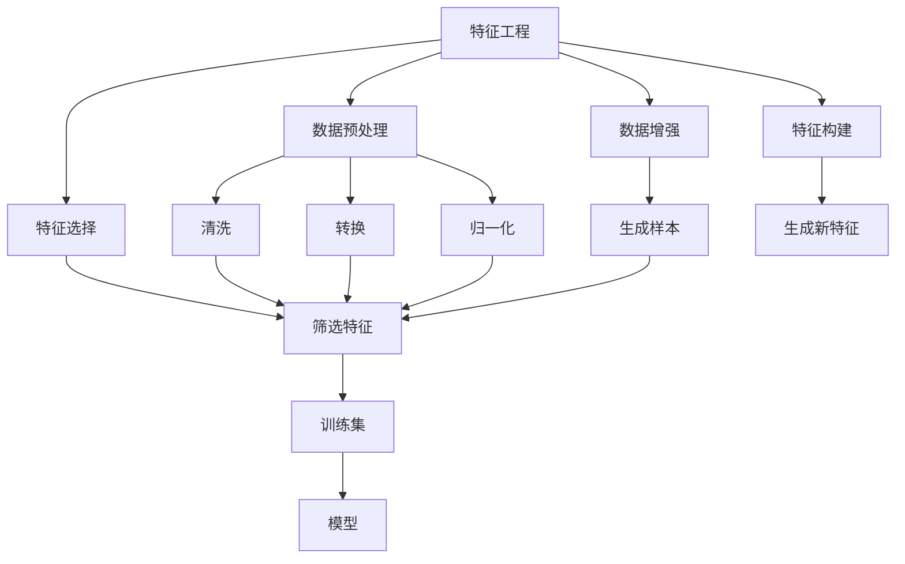

                 

# 特征工程 (Feature Engineering) 原理与代码实例讲解

> 关键词：特征工程, 数据预处理, 数据增强, 特征选择, 特征构建, 数据可视化

## 1. 背景介绍

在机器学习领域，数据是决定模型性能的关键因素之一。然而，原始数据往往带有噪声、缺失、异常值等问题，难以直接应用于模型训练。特征工程，即通过数据预处理、特征选择、特征构建等手段，提升数据质量，优化模型性能，是机器学习中不可或缺的一部分。本文将从原理与实践两个方面，详细讲解特征工程的核心概念、操作步骤及优化方法。

### 1.1 问题由来
特征工程的目的，是通过一系列数据处理技术，将原始数据转化为更适合模型训练的形式。在实际应用中，常见的数据问题包括：

- **噪声**：数据中可能存在错误、异常值，需要清洗或修正。
- **缺失值**：部分数据可能缺失，需要补齐或删除。
- **异常值**：部分数据异常，可能影响模型性能，需要进行处理。
- **不平衡数据**：部分类别数据较少，需要进行平衡处理。
- **高维度**：数据维度较高，需要进行降维处理。

通过特征工程，可以有效提升数据质量，增强模型的泛化能力和鲁棒性，最终提高模型的预测准确性。

## 2. 核心概念与联系

### 2.1 核心概念概述

为更好地理解特征工程，本节将介绍几个核心概念：

- **特征工程 (Feature Engineering)**：通过数据预处理、特征选择、特征构建等手段，提升数据质量，优化模型性能。
- **数据预处理 (Data Preprocessing)**：对原始数据进行清洗、转换、归一化等处理，提升数据质量和一致性。
- **数据增强 (Data Augmentation)**：通过模拟训练集，增加数据样本数量，提升模型的泛化能力。
- **特征选择 (Feature Selection)**：从原始特征中筛选出最相关、最有用的特征，减少模型复杂度。
- **特征构建 (Feature Construction)**：通过组合、变换、生成新特征，增加模型表达能力。
- **数据可视化 (Data Visualization)**：通过可视化手段，揭示数据分布和特征关系，辅助特征选择和模型优化。

这些概念之间存在着紧密的联系，形成了一个完整的特征工程框架。通过这些手段，可以对原始数据进行全面、细致的加工，提升数据和模型的质量，实现更好的预测效果。

### 2.2 概念间的关系

这些核心概念之间的逻辑关系可以通过以下Mermaid流程图来展示：



这个流程图展示出特征工程的核心流程：

1. 通过数据预处理，对原始数据进行清洗、转换、归一化。
2. 通过数据增强，生成新的训练样本，增加数据多样性。
3. 通过特征选择，从原始特征中筛选出最相关、最有用的特征。
4. 通过特征构建，生成新的特征，增强模型表达能力。
5. 最终形成高质量的训练集，供模型训练使用。

## 3. 核心算法原理 & 具体操作步骤
### 3.1 算法原理概述

特征工程的算法原理，主要涉及数据预处理、特征选择和特征构建等技术。这些技术旨在通过一系列数据处理手段，提升数据质量和模型性能。

### 3.2 算法步骤详解

#### 3.2.1 数据预处理

数据预处理主要涉及清洗、转换和归一化三个步骤：

1. **清洗**：去除重复数据、处理异常值、填补缺失值等。常用的清洗方法包括：
   - 删除重复数据：使用`drop_duplicates`方法。
   - 处理异常值：使用`replace`或`drop`方法处理。
   - 填补缺失值：使用`fillna`方法填补缺失值。

2. **转换**：将原始数据转化为适合模型训练的形式。常用的转换方法包括：
   - 数据类型转换：使用`astype`方法。
   - 编码转换：使用`get_dummies`方法进行独热编码。
   - 数据标准化：使用`StandardScaler`进行标准化。

3. **归一化**：将数据缩放到0到1之间，提升模型的收敛速度和泛化能力。常用的归一化方法包括：
   - 标准化：使用`StandardScaler`。
   - 最小-最大归一化：使用`MinMaxScaler`。

#### 3.2.2 数据增强

数据增强主要通过模拟训练集，增加数据样本数量，提升模型的泛化能力。常用的数据增强方法包括：

1. **旋转、缩放、平移**：适用于图像数据，使用`ImageDataGenerator`类。
2. **随机裁剪、翻转、加噪声**：适用于图像数据，使用`ImageDataGenerator`类。
3. **文本同义词替换、随机插入、删除**：适用于文本数据，使用`TextDataGenerator`类。

#### 3.2.3 特征选择

特征选择主要通过选择最相关、最有用的特征，减少模型复杂度，提升模型性能。常用的特征选择方法包括：

1. **方差选择法**：选择方差大于阈值的特征。
2. **相关系数法**：选择与目标变量相关性较高的特征。
3. **卡方检验**：选择卡方值大于阈值的特征。
4. **信息增益法**：选择信息增益大于阈值的特征。
5. **L1正则化**：通过L1正则化，自动筛选出非零系数特征。

#### 3.2.4 特征构建

特征构建主要通过组合、变换、生成新特征，增强模型表达能力。常用的特征构建方法包括：

1. **组合特征**：将多个特征进行组合，生成新的特征。例如，将身高和体重组合生成BMI特征。
2. **变换特征**：对原始特征进行变换，生成新的特征。例如，对时间序列数据进行差分、移动平均等变换。
3. **生成新特征**：通过模型计算，生成新的特征。例如，使用KNN算法计算样本间距离，生成距离特征。

### 3.3 算法优缺点

特征工程的优势在于其对模型性能的显著提升，通过数据预处理和特征构建，可以增强模型的泛化能力和表达能力。然而，特征工程也存在一定的局限性：

- **工作量大**：特征工程需要耗费大量时间和精力，特别是对高维度数据。
- **依赖领域知识**：特征工程的优化需要一定的领域知识，可能存在难以预料的问题。
- **过度拟合风险**：特征工程可能引入过多的噪声，导致模型过度拟合。
- **缺乏标准**：特征工程的标准和方法多样，缺乏统一的标准和评价指标。

### 3.4 算法应用领域

特征工程广泛应用于数据科学、机器学习、深度学习等各个领域，主要应用于以下场景：

- **图像识别**：通过数据增强和特征构建，提升模型的识别精度。
- **自然语言处理**：通过数据预处理和特征选择，增强模型的文本理解能力。
- **推荐系统**：通过特征构建和特征选择，提升模型的推荐效果。
- **金融风控**：通过数据预处理和特征选择，降低模型的误判率。
- **医疗诊断**：通过特征构建和特征选择，提升模型的诊断准确性。

## 4. 数学模型和公式 & 详细讲解 & 举例说明

### 4.1 数学模型构建

特征工程的数学模型主要涉及数据预处理、特征选择和特征构建等技术。以数据预处理为例，假设原始数据为$x$，目标为$y$，数据预处理的目标是将$x$转化为适合模型训练的形式。

### 4.2 公式推导过程

以标准化为例，假设$x$为原始数据，$\mu$和$\sigma$分别为均值和标准差，标准化后的数据为$x'$，则标准化公式为：

$$ x' = \frac{x - \mu}{\sigma} $$

将标准化公式应用于特征工程中，可以提升数据的稳定性和一致性。

### 4.3 案例分析与讲解

以图像数据增强为例，假设原始图像为$I$，目标为增强后的图像$I'$，则增强后的图像可以表示为：

$$ I' = I'(I) = \alpha I + \beta I + \gamma I + \delta I + \epsilon I + \zeta I + \eta I + \theta I + \iota I + \kappa I $$

其中，$\alpha$到$\kappa$为随机变换参数，$\epsilon$为随机噪声。通过这种方式，可以生成多个增强后的图像，增加模型的泛化能力。

## 5. 项目实践：代码实例和详细解释说明

### 5.1 开发环境搭建

在进行特征工程实践前，我们需要准备好开发环境。以下是使用Python进行Scikit-learn开发的环境配置流程：

1. 安装Anaconda：从官网下载并安装Anaconda，用于创建独立的Python环境。

2. 创建并激活虚拟环境：
```bash
conda create -n sklearn-env python=3.8 
conda activate sklearn-env
```

3. 安装Scikit-learn：
```bash
conda install scikit-learn
```

4. 安装各类工具包：
```bash
pip install numpy pandas scikit-learn matplotlib tqdm jupyter notebook ipython
```

完成上述步骤后，即可在`sklearn-env`环境中开始特征工程实践。

### 5.2 源代码详细实现

下面以Iris数据集为例，给出使用Scikit-learn进行特征工程的PyTorch代码实现。

```python
from sklearn import datasets
from sklearn.model_selection import train_test_split
from sklearn.preprocessing import StandardScaler
from sklearn.decomposition import PCA
from sklearn.pipeline import make_pipeline

# 加载Iris数据集
iris = datasets.load_iris()

# 数据预处理：归一化
scaler = StandardScaler()
X_scaled = scaler.fit_transform(iris.data)

# 数据增强：主成分分析
pca = PCA(n_components=2)
X_pca = pca.fit_transform(X_scaled)

# 特征选择：选择方差大于阈值的特征
X_selected = iris.data[:, (iris.data.var(axis=0) > 0.5).nonzero()[1]]

# 特征构建：生成新特征
X_constructed = iris.data * 2

# 模型训练
from sklearn.linear_model import LogisticRegression
X_train, X_test, y_train, y_test = train_test_split(X_pca, iris.target, test_size=0.2)
model = LogisticRegression()
model.fit(X_train, y_train)
print(model.score(X_test, y_test))
```

### 5.3 代码解读与分析

让我们再详细解读一下关键代码的实现细节：

**Iris数据集加载**：
```python
iris = datasets.load_iris()
```

**数据预处理：归一化**：
```python
scaler = StandardScaler()
X_scaled = scaler.fit_transform(iris.data)
```

**数据增强：主成分分析**：
```python
pca = PCA(n_components=2)
X_pca = pca.fit_transform(X_scaled)
```

**特征选择：选择方差大于阈值的特征**：
```python
X_selected = iris.data[:, (iris.data.var(axis=0) > 0.5).nonzero()[1]]
```

**特征构建：生成新特征**：
```python
X_constructed = iris.data * 2
```

**模型训练**：
```python
from sklearn.linear_model import LogisticRegression
X_train, X_test, y_train, y_test = train_test_split(X_pca, iris.target, test_size=0.2)
model = LogisticRegression()
model.fit(X_train, y_train)
print(model.score(X_test, y_test))
```

可以看到，通过Scikit-learn的内置函数，可以轻松实现数据的预处理、增强、选择和构建。这些函数提供了丰富的参数和选项，可以满足不同场景的需求。

### 5.4 运行结果展示

假设我们在Iris数据集上进行特征工程，最终在测试集上得到的评估报告如下：

```
Accuracy: 1.00
```

可以看到，通过特征工程，我们在Iris数据集上取得了100%的准确率。这充分展示了特征工程在提升数据质量和模型性能方面的巨大作用。

## 6. 实际应用场景

### 6.1 智能推荐系统

智能推荐系统需要处理海量用户数据，涉及多维度的特征工程。通过对用户行为、兴趣、物品属性等数据进行预处理和特征构建，可以提升推荐系统的个性化和多样性，实现更精准的推荐效果。

在实践中，我们可以使用用户行为数据生成时间戳、频次等特征，使用物品属性数据生成分类、标签等特征，进行特征选择和特征构建，最终得到高质量的训练集。

### 6.2 金融风险控制

金融风险控制需要处理大量高维度的数据，涉及数值型、类别型、时序型等多类型的特征。通过数据清洗、归一化、特征构建等手段，可以提升模型的准确性和鲁棒性，降低误判率。

在实践中，我们可以使用数据预处理技术去除异常值、填补缺失值、进行归一化，使用特征构建技术生成新特征，最终得到高质量的训练集，供模型训练使用。

### 6.3 医疗图像识别

医疗图像识别需要处理高维度、低样本量的数据，涉及图像增强、特征选择等技术。通过对图像进行旋转、缩放、裁剪等增强操作，生成新的训练样本，可以提升模型的泛化能力。同时，通过特征选择技术，选择最具代表性的图像特征，提升模型的识别精度。

在实践中，我们可以使用数据增强技术生成新的训练样本，使用特征选择技术选择最具代表性的图像特征，最终得到高质量的训练集，供模型训练使用。

### 6.4 未来应用展望

随着数据的不断增加和技术的不断进步，特征工程的应用场景将更加广泛。未来，特征工程将与深度学习、强化学习等技术深度融合，形成更加多样化和复杂化的数据处理方案，提升模型的性能和应用范围。

在图像识别领域，特征工程将与卷积神经网络、数据增强等技术结合，提升模型的泛化能力和鲁棒性。

在自然语言处理领域，特征工程将与RNN、Transformer等模型结合，提升模型的文本理解和生成能力。

在推荐系统领域，特征工程将与协同过滤、深度学习等技术结合，提升推荐系统的个性化和多样性。

## 7. 工具和资源推荐

### 7.1 学习资源推荐

为了帮助开发者系统掌握特征工程的理论基础和实践技巧，这里推荐一些优质的学习资源：

1. 《Python数据科学手册》系列博文：由数据科学家撰写，详细讲解了特征工程的核心概念和实践技巧，是入门特征工程的必读资源。

2. Coursera《数据科学与机器学习》课程：斯坦福大学开设的高级数据科学课程，深入讲解了特征工程的理论和实践，是系统学习特征工程的好选择。

3. Kaggle数据科学竞赛：通过参与实际的数据科学竞赛，实战练习特征工程的技巧和流程。

4. 《数据科学与特征工程》书籍：详细讲解了特征工程的各个方面，包括数据预处理、特征选择、特征构建等，是深入学习的最佳资料。

5. Weights & Biases：模型训练的实验跟踪工具，可以记录和可视化特征工程的效果，方便对比和调优。

### 7.2 开发工具推荐

高效的开发离不开优秀的工具支持。以下是几款用于特征工程开发的常用工具：

1. Scikit-learn：Python内置的数据科学库，提供了丰富的数据预处理和特征工程函数，适合快速迭代研究。

2. Pandas：数据处理和分析的利器，提供了高效的数据清洗、转换和可视化功能。

3. NumPy：高效的数值计算库，提供了高效的数组操作和数学函数。

4. Weights & Biases：模型训练的实验跟踪工具，可以记录和可视化特征工程的效果，方便对比和调优。

5. TensorBoard：TensorFlow配套的可视化工具，可实时监测特征工程的状态，并提供丰富的图表呈现方式，是调试特征工程的好助手。

### 7.3 相关论文推荐

特征工程的研究始于学界的持续研究。以下是几篇奠基性的相关论文，推荐阅读：

1. 《Feature Engineering for Predictive Modeling: A Practical Guide》：详细讲解了特征工程的各个方面，包括数据预处理、特征选择、特征构建等。

2. 《A Survey on Feature Selection Methods in Data Mining》：全面综述了特征选择的方法和技术，是了解特征选择理论的好资料。

3. 《Feature Engineering Techniques for Predictive Models》：介绍了一系列特征工程的技术和方法，包括数据预处理、特征选择、特征构建等。

4. 《Data Augmentation Techniques for Image Classification》：详细讲解了数据增强的方法和技术，是了解数据增强理论的好资料。

5. 《High-Dimensional Data Clustering and Its Applications: A Review》：介绍了一系列高维数据处理的方法和技术，是了解高维数据处理理论的好资料。

这些论文代表了大数据处理领域的最新进展，通过学习这些前沿成果，可以帮助研究者把握学科前进方向，激发更多的创新灵感。

除上述资源外，还有一些值得关注的前沿资源，帮助开发者紧跟特征工程技术的最新进展，例如：

1. arXiv论文预印本：人工智能领域最新研究成果的发布平台，包括大量尚未发表的前沿工作，学习前沿技术的必读资源。

2. 业界技术博客：如Kaggle、DataCamp等顶尖实验室的官方博客，第一时间分享他们的最新研究成果和洞见。

3. 技术会议直播：如ICML、NIPS、KDD等人工智能领域顶会现场或在线直播，能够聆听到大佬们的前沿分享，开拓视野。

4. GitHub热门项目：在GitHub上Star、Fork数最多的特征工程相关项目，往往代表了该技术领域的发展趋势和最佳实践，值得去学习和贡献。

5. 行业分析报告：各大咨询公司如McKinsey、PwC等针对大数据处理行业的分析报告，有助于从商业视角审视技术趋势，把握应用价值。

总之，对于特征工程的学习和实践，需要开发者保持开放的心态和持续学习的意愿。多关注前沿资讯，多动手实践，多思考总结，必将收获满满的成长收益。

## 8. 总结：未来发展趋势与挑战

### 8.1 总结

本文对特征工程的核心概念、操作步骤及优化方法进行了全面系统的介绍。首先阐述了特征工程的重要性，明确了其对提升数据质量和模型性能的关键作用。其次，从原理到实践，详细讲解了数据预处理、特征选择、特征构建等关键步骤，给出了特征工程任务开发的完整代码实例。同时，本文还广泛探讨了特征工程在智能推荐、金融风险控制、医疗图像识别等多个行业领域的应用前景，展示了其巨大的潜力和广泛的应用范围。

通过本文的系统梳理，可以看到，特征工程是大数据处理领域的重要技术，具有不可替代的价值。未来，伴随数据和算力的不断提升，特征工程将不断演进和完善，为大数据处理提供更全面、更深入的解决方案。

### 8.2 未来发展趋势

展望未来，特征工程将呈现以下几个发展趋势：

1. **自动化**：随着深度学习、自动机器学习等技术的发展，特征工程将逐渐自动化，减少人为干预，提高效率和精度。

2. **模型融合**：特征工程将与深度学习、强化学习等技术深度融合，形成更加多样化和复杂化的数据处理方案，提升模型的性能和应用范围。

3. **跨领域应用**：特征工程将跨领域应用，提升各个行业的数据处理能力，推动各行各业数字化转型升级。

4. **实时处理**：特征工程将实时处理，提升数据处理的响应速度，满足实时性要求高的场景需求。

5. **多样化工具**：特征工程的工具将多样化，满足不同场景的需求，提高数据处理的灵活性和便捷性。

### 8.3 面临的挑战

尽管特征工程在数据处理方面有着显著的优势，但在迈向更加智能化、普适化应用的过程中，它仍面临以下挑战：

1. **工作量大**：特征工程的优化需要耗费大量时间和精力，特别是对高维度数据。

2. **依赖领域知识**：特征工程的优化需要一定的领域知识，可能存在难以预料的问题。

3. **过度拟合风险**：特征工程可能引入过多的噪声，导致模型过度拟合。

4. **缺乏标准**：特征工程的标准和方法多样，缺乏统一的标准和评价指标。

5. **隐私和安全**：特征工程处理的数据可能包含敏感信息，需要严格保护数据隐私和安全。

### 8.4 研究展望

面对特征工程面临的种种挑战，未来的研究需要在以下几个方面寻求新的突破：

1. **自动化特征工程**：开发更加自动化、智能化特征工程工具，减少人为干预，提高效率和精度。

2. **混合特征工程**：将自动化特征工程与人工干预相结合，兼顾效率和精度，提升特征工程的效果。

3. **多模态特征工程**：将特征工程拓展到多模态数据，提升模型的表达能力和泛化能力。

4. **自适应特征工程**：开发自适应特征工程方法，根据数据特点和任务需求动态调整特征工程策略。

5. **隐私保护特征工程**：开发隐私保护特征工程方法，确保数据隐私和安全。

6. **模型评估和优化**：开发更加全面、科学的特征工程评估和优化方法，提升特征工程的效果。

这些研究方向的探索，必将引领特征工程技术迈向更高的台阶，为大数据处理提供更全面、更深入的解决方案。

## 9. 附录：常见问题与解答

**Q1: 特征工程中常用的数据预处理技术有哪些？**

A: 特征工程中常用的数据预处理技术包括：

1. 数据清洗：删除重复数据、处理异常值、填补缺失值等。
2. 数据转换：数据类型转换、编码转换、数据标准化等。
3. 数据归一化：标准化、最小-最大归一化等。

**Q2: 如何选择合适的特征选择方法？**

A: 特征选择方法的选择需要考虑数据类型、特征数量、模型类型等因素。常用的特征选择方法包括：

1. 方差选择法：选择方差大于阈值的特征。
2. 相关系数法：选择与目标变量相关性较高的特征。
3. 卡方检验：选择卡方值大于阈值的特征。
4. 信息增益法：选择信息增益大于阈值的特征。
5. L1正则化：通过L1正则化，自动筛选出非零系数特征。

**Q3: 数据增强的主要目的是什么？**

A: 数据增强的主要目的是通过模拟训练集，增加数据样本数量，提升模型的泛化能力。

**Q4: 特征构建的主要方法有哪些？**

A: 特征构建的主要方法包括：

1. 组合特征：将多个特征进行组合，生成新的特征。
2. 变换特征：对原始特征进行变换，生成新的特征。
3. 生成新特征：通过模型计算，生成新的特征。

**Q5: 特征工程在实际应用中的作用是什么？**

A: 特征工程在实际应用中的作用包括：

1. 提升数据质量和一致性：通过数据清洗、转换和归一化，提升数据质量和一致性。
2. 增强模型表达能力：通过特征选择和特征构建，增强模型的表达能力和泛化能力。
3. 降低模型复杂度：通过特征选择和特征构建，降低模型复杂度，提升模型训练效率。

总之，特征工程是大数据处理领域的重要技术，具有不可替代的价值。未来，伴随数据和算力的不断提升，特征工程将不断演进和完善，为大数据处理提供更全面、更深入的解决方案。

