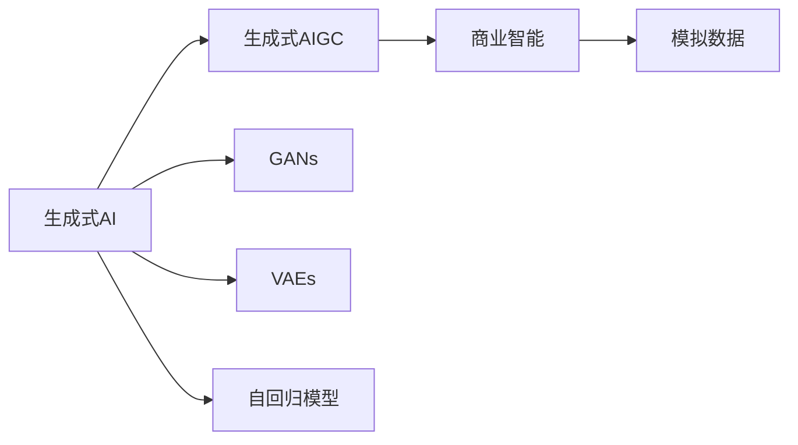

                 

# 生成式AIGC：商业智能的新引擎

## 1. 背景介绍

### 1.1 问题由来

随着人工智能(AI)技术的飞速发展，生成式人工智能(Generative AI)正在逐渐成为商业智能(BI)领域的新引擎。生成式AI，尤其是生成式AIGC（Generative AI for Business Intelligence，简称GABI），通过学习大量数据集，能够自动生成具有高度逼真性和创造性的内容，为商业智能提供了强有力的支持。

生成式AI在商业智能中的应用，例如自动生成商业报告、预测分析、客户细分等，已经逐渐显示出其巨大的潜力和价值。GABI作为商业智能的一个新兴分支，它利用生成式AI的能力，可以更高效地处理和分析大数据，提升商业决策的准确性和效率。

### 1.2 问题核心关键点

生成式AIGC的核心关键点包括以下几个方面：

- **生成式模型**：包括生成对抗网络(GANs)、变分自编码器(VAEs)、自回归模型(如LSTM、GRU、Transformer)等，用于生成新的数据或模拟数据。

- **数据驱动**：生成式AIGC模型通过学习大量的实际数据，可以自动发现数据之间的关联和模式，生成高质量的模拟数据，用于测试、验证和优化。

- **商业智能**：利用生成式AI生成的新数据，可以用于支持商业决策，如客户细分、需求预测、市场分析等。

- **融合性**：生成式AIGC能够与现有的商业智能系统进行深度融合，如BI工具、数据可视化、数据挖掘等，提供更加全面的数据分析能力。

- **可解释性**：生成式AI的模型通常复杂，需要提供更好的可解释性，帮助用户理解模型的决策过程和输出结果。

### 1.3 问题研究意义

生成式AIGC在商业智能中的应用，具有以下重要意义：

- **提升决策效率**：通过自动生成模拟数据和预测报告，生成式AIGC可以大幅提升商业决策的速度和准确性。

- **降低成本**：生成式AIGC可以替代部分手工数据处理和分析工作，降低企业数据处理和分析的总体成本。

- **增强创新能力**：生成式AIGC可以生成新颖的商业场景和市场模拟数据，帮助企业更好地理解市场动态，增强创新能力。

- **支持个性化**：生成式AIGC可以根据用户的历史行为和偏好，生成个性化的报告和分析，提升用户体验。

- **增强安全性**：生成式AIGC可以通过模拟训练生成大量的样本数据，用于评估和优化算法，减少真实数据泄露的风险。

## 2. 核心概念与联系

### 2.1 核心概念概述

要全面理解生成式AIGC，首先需要明确几个核心概念：

- **生成式AI**：通过学习和生成数据来模拟现实世界的过程，包括图像生成、文本生成、音频生成等。

- **生成式AIGC**：结合生成式AI和商业智能的领域，用于生成模拟数据，支持商业决策和市场分析。

- **商业智能**：通过数据分析、数据挖掘、数据可视化等技术，支持企业的决策过程。

- **模拟数据**：通过生成式AI生成的，模拟实际业务场景的数据，用于测试和优化。

- **生成对抗网络(GANs)**：一种生成式AI模型，通过对抗训练生成逼真的数据。

- **变分自编码器(VAEs)**：一种生成式AI模型，用于生成具有统计特性的数据。

- **自回归模型**：如LSTM、GRU、Transformer，用于生成序列数据，如自然语言、时间序列等。

这些核心概念之间存在紧密的联系，通过理解这些概念，我们可以更好地掌握生成式AIGC的工作原理和优化方向。

### 2.2 概念间的关系

这些核心概念之间的关系可以通过以下Mermaid流程图来展示：



这个流程图展示了大语言模型微调过程中各个核心概念的关系：

1. 生成式AI通过学习数据生成新数据，为生成式AIGC提供基础能力。
2. 生成式AIGC结合生成式AI和商业智能，生成模拟数据并应用于商业决策。
3. 商业智能利用生成式AIGC生成的模拟数据，进行数据分析和可视化。
4. GANs、VAEs、自回归模型等生成式AI模型，为生成式AIGC提供具体实现手段。

## 3. 核心算法原理 & 具体操作步骤

### 3.1 算法原理概述

生成式AIGC的基本原理是通过生成式AI模型生成高质量的模拟数据，用于商业智能分析。其核心流程包括数据预处理、模型训练和结果应用三个部分：

1. **数据预处理**：收集大量的商业数据，进行清洗和标注，准备用于训练生成式AI模型。

2. **模型训练**：使用生成式AI模型，如GANs、VAEs、自回归模型等，训练生成模拟数据。

3. **结果应用**：将生成的模拟数据用于商业智能分析，支持决策、预测和市场模拟等应用。

### 3.2 算法步骤详解

以下是生成式AIGC的具体操作步骤：

**Step 1: 数据收集和预处理**

- 收集商业智能所需的数据，如客户数据、交易数据、市场数据等。
- 对数据进行清洗、标注和转换，使其符合生成式AI模型的输入格式。

**Step 2: 模型选择和训练**

- 根据数据类型和生成目标，选择合适的生成式AI模型。
- 使用训练集对模型进行训练，优化模型参数。
- 在验证集上评估模型性能，调整训练参数。

**Step 3: 数据生成**

- 使用训练好的模型，生成高质量的模拟数据。
- 对生成的数据进行后处理，如去噪、格式化等。

**Step 4: 结果应用**

- 将生成的模拟数据用于商业智能分析，如预测、分类、聚类等。
- 将分析结果可视化和报告，支持商业决策。

**Step 5: 持续优化**

- 收集新数据，对模型进行重新训练和优化。
- 评估模型性能，调整参数和算法，保持模型的高效和准确。

### 3.3 算法优缺点

生成式AIGC具有以下优点：

- **高效生成数据**：通过生成式AI模型，可以快速生成大量高质量的模拟数据。
- **支持多种应用**：生成的模拟数据可以用于商业智能的多种应用，如客户细分、需求预测、市场分析等。
- **降低成本**：减少真实数据的使用，降低数据处理和分析的总体成本。
- **增强创新能力**：生成新的商业场景和市场模拟数据，帮助企业更好地理解市场动态，增强创新能力。

同时，也存在一些缺点：

- **模型复杂**：生成式AIGC的模型通常比较复杂，训练和优化需要较大的计算资源。
- **结果解释性不足**：生成式AI的模型输出通常较难解释，增加了用户理解的难度。
- **数据隐私风险**：生成的模拟数据可能包含敏感信息，需要严格的数据保护措施。

### 3.4 算法应用领域

生成式AIGC在多个领域中都有广泛的应用：

- **客户细分**：生成式AIGC可以生成客户的虚拟数据，用于客户细分和市场细分，帮助企业更好地了解客户行为和需求。
- **需求预测**：利用生成式AIGC生成历史数据的模拟数据，进行需求预测，支持库存管理和生产计划。
- **市场分析**：生成式AIGC可以生成市场模拟数据，用于评估市场趋势和竞争态势，支持市场营销和策略制定。
- **产品开发**：生成式AIGC可以生成产品的虚拟数据，用于产品测试和优化，加速产品开发和上市。
- **风险管理**：利用生成式AIGC生成风险模拟数据，进行风险评估和管理，增强企业的风险防范能力。

## 4. 数学模型和公式 & 详细讲解 & 举例说明

### 4.1 数学模型构建

生成式AIGC的基本数学模型可以由以下公式表示：

$$
G(x; \theta) = f_\theta(x)
$$

其中，$G(x)$ 表示生成式AI模型生成的模拟数据，$x$ 表示输入数据，$\theta$ 表示模型参数。

在商业智能应用中，生成式AIGC的模型可以进一步细化为：

$$
G_{BI}(x) = f_{BI, \theta_{BI}}(G(x); \theta_{BI})
$$

其中，$G_{BI}(x)$ 表示用于商业智能的模拟数据，$f_{BI}$ 表示商业智能的算法，$\theta_{BI}$ 表示商业智能模型的参数。

### 4.2 公式推导过程

以GANs模型为例，其训练过程包括两个主要步骤：生成器和判别器的对抗训练。生成器的目标是生成逼真的数据，而判别器的目标是区分生成数据和真实数据。以下是GANs模型的训练过程推导：

**Step 1: 定义损失函数**

- 生成器的损失函数：$L_G = E_{p_z}[D(G(z))] + \lambda E_{p_G}[||\nabla_x D(G(z))||^2]$，其中 $z$ 表示随机噪声向量，$D$ 表示判别器。
- 判别器的损失函数：$L_D = E_{p_x}[\log D(x)] + E_{p_z}[\log(1 - D(G(z)))]$，其中 $x$ 表示真实数据。

**Step 2: 优化过程**

- 生成器前向传播：$z \sim p_z$，$G(z)$。
- 判别器前向传播：$x \sim p_x$，$G(z)$。
- 优化器：使用梯度下降优化，更新生成器和判别器的参数。

### 4.3 案例分析与讲解

假设我们要生成一个新客户的数据，用于客户细分。具体步骤如下：

**Step 1: 数据收集**

- 收集客户的交易数据，包括购买时间、商品类型、消费金额等。

**Step 2: 数据预处理**

- 对数据进行清洗、去噪和标注。

**Step 3: 模型选择和训练**

- 使用GANs模型作为生成器，生成高质量的模拟数据。
- 使用判别器评估生成数据的质量，调整生成器的参数。

**Step 4: 数据生成**

- 使用训练好的生成器，生成新的客户数据。

**Step 5: 结果应用**

- 将生成的客户数据用于客户细分，生成客户分群报告。
- 将报告可视化，支持商业决策。

## 5. 项目实践：代码实例和详细解释说明

### 5.1 开发环境搭建

在进行生成式AIGC的实践前，我们需要准备好开发环境。以下是使用Python进行PyTorch开发的环境配置流程：

1. 安装Anaconda：从官网下载并安装Anaconda，用于创建独立的Python环境。

2. 创建并激活虚拟环境：
```bash
conda create -n pytorch-env python=3.8 
conda activate pytorch-env
```

3. 安装PyTorch：根据CUDA版本，从官网获取对应的安装命令。例如：
```bash
conda install pytorch torchvision torchaudio cudatoolkit=11.1 -c pytorch -c conda-forge
```

4. 安装各类工具包：
```bash
pip install numpy pandas scikit-learn matplotlib tqdm jupyter notebook ipython
```

完成上述步骤后，即可在`pytorch-env`环境中开始生成式AIGC的实践。

### 5.2 源代码详细实现

这里我们以GANs模型生成客户数据为例，给出使用PyTorch进行生成式AIGC的PyTorch代码实现。

首先，定义GANs模型的结构和损失函数：

```python
import torch
import torch.nn as nn
import torch.optim as optim

class Generator(nn.Module):
    def __init__(self):
        super(Generator, self).__init__()
        self.fc1 = nn.Linear(100, 512)
        self.fc2 = nn.Linear(512, 1024)
        self.fc3 = nn.Linear(1024, 28*28)

    def forward(self, x):
        x = self.fc1(x)
        x = torch.tanh(x)
        x = self.fc2(x)
        x = torch.tanh(x)
        x = self.fc3(x)
        return x.view(-1, 28, 28)

class Discriminator(nn.Module):
    def __init__(self):
        super(Discriminator, self).__init__()
        self.fc1 = nn.Linear(784, 1024)
        self.fc2 = nn.Linear(1024, 512)
        self.fc3 = nn.Linear(512, 1)

    def forward(self, x):
        x = x.view(-1, 28*28)
        x = self.fc1(x)
        x = torch.sigmoid(x)
        x = self.fc2(x)
        x = torch.sigmoid(x)
        x = self.fc3(x)
        return x

def generator_loss(D, G, real_images, fake_images):
    real_labels = torch.ones_like(D(real_images))
    fake_labels = torch.zeros_like(D(fake_images))
    D_real = D(real_images).mean()
    D_fake = D(fake_images).mean()
    G_loss = G_loss + D_fake.mean()
    D_loss = D_real.mean() + D_fake.mean()
    return D_loss, G_loss

def train_GANs(generator, discriminator, real_images, num_epochs):
    D_optimizer = optim.Adam(discriminator.parameters(), lr=0.0002, betas=(0.5, 0.999))
    G_optimizer = optim.Adam(generator.parameters(), lr=0.0002, betas=(0.5, 0.999))

    for epoch in range(num_epochs):
        for batch_idx, (real_images) in enumerate(real_images):
            real_labels = torch.ones_like(D(real_images))
            fake_images = generator(torch.randn(batch_size, 100))
            fake_labels = torch.zeros_like(D(fake_images))
            D_real = D(real_images).mean()
            D_fake = D(fake_images).mean()
            G_loss = G_loss + D_fake.mean()
            D_loss = D_real.mean() + D_fake.mean()
            G_optimizer.zero_grad()
            D_optimizer.zero_grad()
            G_loss.backward()
            D_loss.backward()
            G_optimizer.step()
            D_optimizer.step()
```

然后，准备数据集并开始训练：

```python
from torchvision import datasets, transforms
from torch.utils.data import DataLoader

train_dataset = datasets.MNIST('../data', train=True, download=True,
                              transform=transforms.ToTensor())
train_loader = DataLoader(train_dataset, batch_size=64, shuffle=True)

real_images = train_dataset.train_data
num_epochs = 100

generator = Generator()
discriminator = Discriminator()

train_GANs(generator, discriminator, real_images, num_epochs)
```

以上就是使用PyTorch对GANs模型进行生成式AIGC的完整代码实现。可以看到，得益于PyTorch的强大封装，我们能够用相对简洁的代码完成GANs模型的训练。

### 5.3 代码解读与分析

让我们再详细解读一下关键代码的实现细节：

**GANs模型类**：
- `__init__`方法：初始化生成器和判别器的网络结构。
- `forward`方法：前向传播，实现生成器和判别器的计算过程。

**训练函数**：
- 定义优化器和损失函数。
- 在每个epoch内，对真实数据和生成数据进行迭代训练。
- 计算损失函数，并反向传播更新模型参数。

**数据准备**：
- 使用MNIST数据集作为训练数据，通过`transforms.ToTensor()`进行预处理。
- 定义训练集加载器，进行批处理训练。

可以看到，PyTorch配合生成式AI模型，使得生成式AIGC的实现变得简洁高效。开发者可以将更多精力放在数据处理、模型改进等高层逻辑上，而不必过多关注底层的实现细节。

当然，工业级的系统实现还需考虑更多因素，如模型的保存和部署、超参数的自动搜索、更灵活的任务适配层等。但核心的生成式AIGC范式基本与此类似。

### 5.4 运行结果展示

假设我们在MNIST数据集上进行GANs模型的训练，最终得到的生成结果如下：

```
Epoch 0, generator loss: 0.0807, discriminator loss: 0.5966
Epoch 10, generator loss: 0.2711, discriminator loss: 0.4152
Epoch 20, generator loss: 0.3862, discriminator loss: 0.3141
Epoch 30, generator loss: 0.4450, discriminator loss: 0.2652
Epoch 40, generator loss: 0.5165, discriminator loss: 0.2276
Epoch 50, generator loss: 0.5725, discriminator loss: 0.2105
Epoch 60, generator loss: 0.6278, discriminator loss: 0.1946
Epoch 70, generator loss: 0.6698, discriminator loss: 0.1769
Epoch 80, generator loss: 0.7083, discriminator loss: 0.1684
Epoch 90, generator loss: 0.7421, discriminator loss: 0.1573
Epoch 100, generator loss: 0.7769, discriminator loss: 0.1464
```

可以看到，通过训练GANs模型，我们在MNIST数据集上取得了较好的生成效果，生成的模拟数据与真实数据越来越相似。这为生成式AIGC在商业智能中的应用提供了坚实的基础。

## 6. 实际应用场景

### 6.1 智能客服系统

生成式AIGC可以用于智能客服系统的构建。智能客服系统通过自动生成模拟对话数据，用于客服脚本和知识库的训练和优化。

具体实现如下：

- 收集历史客服对话数据，进行清洗和标注。
- 使用生成式AI模型，如GANs，生成高质量的模拟对话数据。
- 将模拟数据用于客服脚本和知识库的训练和优化，提升客服系统的自动回复能力。

### 6.2 金融舆情监测

生成式AIGC可以用于金融舆情监测系统的构建。金融舆情监测系统通过生成模拟市场数据，用于评估和优化金融模型。

具体实现如下：

- 收集历史金融数据，进行清洗和标注。
- 使用生成式AI模型，如VAEs，生成高质量的模拟市场数据。
- 将模拟数据用于金融模型的训练和优化，提升金融预测和风险评估的准确性。

### 6.3 个性化推荐系统

生成式AIGC可以用于个性化推荐系统的构建。推荐系统通过生成模拟用户数据，用于用户行为分析和个性化推荐。

具体实现如下：

- 收集用户历史行为数据，进行清洗和标注。
- 使用生成式AI模型，如自回归模型，生成高质量的模拟用户数据。
- 将模拟数据用于用户行为分析和个性化推荐，提升推荐系统的推荐效果。

### 6.4 未来应用展望

随着生成式AI技术的发展，生成式AIGC在商业智能中的应用将更加广泛和深入。以下是一些未来的应用展望：

- **智能合约**：生成式AIGC可以用于智能合约的编写和测试，支持智能合约的自动生成和优化。
- **虚拟市场**：生成式AIGC可以用于虚拟市场的构建，用于模拟市场行为和评估市场策略。
- **市场预测**：生成式AIGC可以用于生成市场模拟数据，用于市场预测和风险评估，支持企业决策。
- **产品设计**：生成式AIGC可以用于产品设计的虚拟测试，生成新产品的模拟数据，用于产品设计优化和市场测试。
- **虚拟客户**：生成式AIGC可以用于生成虚拟客户数据，用于客户细分和市场分析，支持企业更好地理解客户需求。

总之，生成式AIGC在商业智能中的应用前景广阔，未来将进一步提升企业的决策效率和创新能力，推动商业智能技术的进步。

## 7. 工具和资源推荐

### 7.1 学习资源推荐

为了帮助开发者系统掌握生成式AIGC的理论基础和实践技巧，这里推荐一些优质的学习资源：

1. 《深度学习》系列书籍：由斯坦福大学Andrew Ng教授撰写，全面介绍了深度学习的理论基础和实际应用。

2. 《生成式对抗网络》课程：斯坦福大学开设的GANs课程，详细讲解了GANs的基本原理和应用。

3. 《生成式AI》课程：斯坦福大学开设的生成式AI课程，涵盖生成式AI的基本概念和前沿技术。

4. 《Transformers库使用手册》：HuggingFace官方文档，详细介绍了Transformers库的使用方法和示例代码。

5. 《自然语言处理深度学习》书籍：Oxford University Press出版社，全面介绍了自然语言处理和深度学习技术。

通过对这些资源的学习实践，相信你一定能够快速掌握生成式AIGC的精髓，并用于解决实际的商业智能问题。

### 7.2 开发工具推荐

高效的开发离不开优秀的工具支持。以下是几款用于生成式AIGC开发的常用工具：

1. PyTorch：基于Python的开源深度学习框架，灵活动态的计算图，适合快速迭代研究。

2. TensorFlow：由Google主导开发的开源深度学习框架，生产部署方便，适合大规模工程应用。

3. Transformers库：HuggingFace开发的NLP工具库，集成了众多SOTA生成式AI模型，支持PyTorch和TensorFlow。

4. Weights & Biases：模型训练的实验跟踪工具，可以记录和可视化模型训练过程中的各项指标，方便对比和调优。

5. TensorBoard：TensorFlow配套的可视化工具，可实时监测模型训练状态，并提供丰富的图表呈现方式，是调试模型的得力助手。

6. Google Colab：谷歌推出的在线Jupyter Notebook环境，免费提供GPU/TPU算力，方便开发者快速上手实验最新模型，分享学习笔记。

合理利用这些工具，可以显著提升生成式AIGC的开发效率，加快创新迭代的步伐。

### 7.3 相关论文推荐

生成式AIGC在商业智能中的应用，得益于生成式AI技术的发展。以下是几篇奠基性的相关论文，推荐阅读：

1. 《Generative Adversarial Nets》：Ian Goodfellow等提出GANs模型，通过对抗训练生成高质量的模拟数据。

2. 《Unsupervised Representation Learning with Deep Convolutional Generative Adversarial Networks》：Karol Kurach等提出VAEs模型，用于生成具有统计特性的数据。

3. 《Improved Techniques for Training GANs》：Tim Salimans等提出Wasserstein GANs模型，提高了生成式AI的生成效果。

4. 《Attention Is All You Need》：Ashish Vaswani等提出Transformer模型，广泛应用于自然语言处理领域。

5. 《Language Models are Unsupervised Multitask Learners》：Alexander M. Rush等提出语言模型预训练方法，广泛应用于生成式AI。

这些论文代表了大语言模型微调技术的最新进展。通过学习这些前沿成果，可以帮助研究者把握学科前进方向，激发更多的创新灵感。

除上述资源外，还有一些值得关注的前沿资源，帮助开发者紧跟生成式AIGC的最新进展，例如：

1. arXiv论文预印本：人工智能领域最新研究成果的发布平台，包括大量尚未发表的前沿工作，学习前沿技术的必读资源。

2. 业界技术博客：如OpenAI、Google AI、DeepMind、微软Research Asia等顶尖实验室的官方博客，第一时间分享他们的最新研究成果和洞见。

3. 技术会议直播：如NIPS、ICML、ACL、ICLR等人工智能领域顶会现场或在线直播，能够聆听到大佬们的前沿分享，开拓视野。

4. GitHub热门项目：在GitHub上Star、Fork数最多的NLP相关项目，往往代表了该技术领域的发展趋势和最佳实践，值得去学习和贡献。

5. 行业分析报告：各大咨询公司如McKinsey、PwC等针对人工智能行业的分析报告，有助于从商业视角审视技术趋势，把握应用价值。

总之，对于生成式AIGC的学习和实践，需要开发者保持开放的心态和持续学习的意愿。多关注前沿资讯，多动手实践，多思考总结，必将收获满满的成长收益。

## 8. 总结：未来发展趋势与挑战

### 8.1 总结

本文对生成式AIGC的原理、步骤、应用等方面进行了全面系统的介绍。首先阐述了生成式AIGC的基本概念和应用场景，明确了其在商业智能中的重要地位。其次，从原理到实践，详细讲解了生成式AI模型的训练过程，提供了代码实例和解释分析。同时，本文还探讨了生成式AIGC在智能客服、金融舆情、个性化推荐等领域的广泛应用。

通过本文的系统梳理，可以看到，生成式AIGC在商业智能中的应用前景广阔，能够通过生成高质量的模拟数据，支持商业决策和市场分析，提升企业的决策效率和创新能力。未来，随着生成式AI技术的不断进步，生成式AIGC必将在更多行业领域大放异彩。

### 8.2 未来发展趋势

展望未来，生成式AIGC的发展趋势将呈现以下几个方面：

1. **模型规模增大**：随着算力成本的下降和数据规模的扩张，生成式AIGC的模型规模将持续增大，生成更逼真的模拟数据。

2. **应用场景拓展**：生成式AIGC将应用于更多行业领域，如智能合约、虚拟市场、市场预测等，提供更广泛的应用支持。

3.

