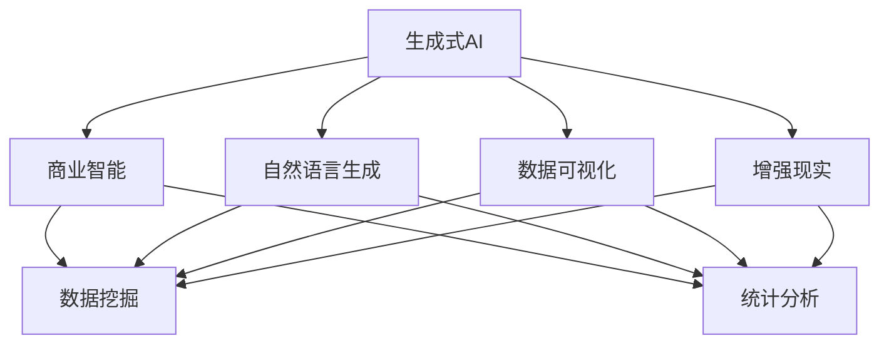
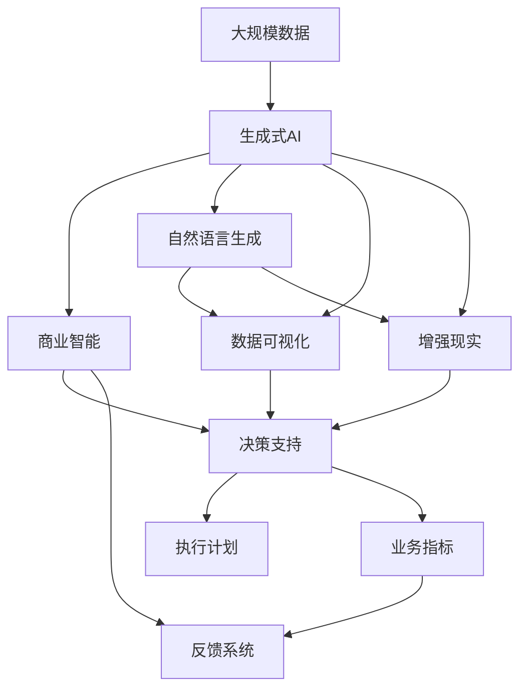

                 

# 生成式AIGC：商业智能的未来方向

> 关键词：生成式AIGC, 商业智能, 自然语言生成, 数据可视化, 增强现实, 算法优化, 计算资源, 深度学习, 未来展望

## 1. 背景介绍

### 1.1 问题由来

在当今数字化商业环境中，数据处理和分析能力成为了企业竞争力的关键因素。传统的商业智能(BI)解决方案依赖于静态数据分析，但这种模型已无法应对动态和复杂的数据变化。生成式人工智能(Generative AI)技术，特别是生成式AI（Generative AI, GAI），正逐渐被引入商业智能领域，以提升企业的决策能力和数据处理效率。

生成式AIGC（Generative AI for Business Intelligence, GAI-BI），结合了深度学习、自然语言处理（NLP）、数据可视化、增强现实（AR）等技术，不仅能够分析大量数据，还能生成与人类交流的文本和图像，极大地提升了商业智能的分析深度和应用广度。

### 1.2 问题核心关键点

生成式AIGC的核心在于使用生成模型对文本、图像等数据进行生成，并结合商业智能技术，提供更深入、动态的洞察力。具体来说，生成式AIGC具有以下关键特点：

- **生成式模型**：使用深度学习等技术，从数据中生成新的文本、图像等，为商业智能提供丰富的数据源。
- **自然语言处理**：通过NLP技术，将生成式模型与业务数据相结合，提取和分析语义信息。
- **数据可视化**：结合AR、VR等技术，生成动态、交互式的可视化界面，提升分析体验。
- **增强现实**：通过AR技术，将生成式模型与真实世界结合，提供沉浸式交互体验。
- **算法优化**：对生成式模型和商业智能算法进行优化，提升性能和效率。

### 1.3 问题研究意义

生成式AIGC在商业智能中的应用，具有以下重要意义：

- **提高决策质量**：通过生成式模型和商业智能的结合，提供更全面、深入的洞察，帮助企业做出更精准的决策。
- **提升数据处理效率**：生成式模型能够自动化地生成大量高质量数据，减少人工处理的工作量。
- **增强数据可视化效果**：通过动态、交互式的可视化，提升数据分析的直观性和理解度。
- **创新应用场景**：通过AR等技术，将生成式模型应用到更多的实际业务场景中，如产品设计、市场分析等。
- **适应快速变化的市场环境**：生成式AIGC能够实时处理和分析数据，适应市场环境的变化。

## 2. 核心概念与联系

### 2.1 核心概念概述

为了深入理解生成式AIGC技术，本节将介绍几个核心概念：

- **生成式AI**：使用深度学习模型，从数据中生成新的文本、图像、音频等。常见的生成式模型包括GPT-3、GANs等。
- **商业智能**：使用数据挖掘和统计分析等方法，从大量数据中提取有价值的信息，帮助企业做出决策。
- **自然语言生成**：将结构化数据转换为自然语言，以便更好地理解和使用。
- **数据可视化**：通过图表、地图等形式，将复杂的数据转换为直观的可视化信息。
- **增强现实**：将数字信息叠加在现实世界中，提供沉浸式交互体验。

### 2.2 概念间的关系

这些核心概念之间存在着紧密的联系，形成了一个完整的生成式AIGC生态系统。以下是通过Mermaid流程图来展示它们之间的关系：



这个流程图展示了生成式AIGC的核心概念及其关系：

1. 生成式AI是商业智能的基础，提供生成式的数据和洞察。
2. 自然语言生成使数据更易于理解，提升商业智能的分析能力。
3. 数据可视化通过交互式界面，增强商业智能的直观性。
4. 增强现实将数字信息与现实世界结合，提供沉浸式体验。
5. 数据挖掘和统计分析是商业智能的核心技术，与生成式AI紧密结合，提取有价值的信息。

### 2.3 核心概念的整体架构

最后，我们用一个综合的流程图来展示这些核心概念在大规模生成式AIGC中的应用：



这个综合流程图展示了从数据到商业智能，再到决策执行的完整流程，以及自然语言生成、数据可视化和增强现实等技术的应用。

## 3. 核心算法原理 & 具体操作步骤
### 3.1 算法原理概述

生成式AIGC的核心算法主要包括以下几部分：

- **生成模型**：如GPT-3、GANs等，用于生成文本、图像等。
- **NLP模型**：如BERT、GPT-2等，用于处理自然语言数据。
- **可视化模型**：如D3.js、Three.js等，用于生成动态可视化界面。
- **增强现实框架**：如ARKit、ARCore等，用于提供增强现实体验。

### 3.2 算法步骤详解

生成式AIGC的实现过程可以分为以下几个关键步骤：

1. **数据准备**：收集商业智能所需的数据，并进行预处理，包括清洗、归一化、标注等。
2. **生成模型训练**：使用深度学习模型对数据进行生成训练，如GPT-3等。
3. **NLP模型微调**：根据商业智能任务，对NLP模型进行微调，以便更好地处理文本数据。
4. **可视化生成**：使用可视化工具，将商业智能的数据转换为动态、交互式的可视化界面。
5. **增强现实整合**：将可视化界面与增强现实技术结合，提供沉浸式交互体验。
6. **算法优化**：对生成模型和商业智能算法进行优化，提升性能和效率。

### 3.3 算法优缺点

生成式AIGC具有以下优点：

- **数据生成能力**：能够生成大量高质量的数据，减少人工处理的工作量。
- **多维度分析**：结合自然语言处理和增强现实，提供更深入、直观的洞察。
- **动态适应性**：能够实时处理和分析数据，适应市场环境的变化。

但同时也存在一些缺点：

- **资源消耗大**：生成式模型和商业智能算法对计算资源的需求较高。
- **技术门槛高**：涉及深度学习、自然语言处理等多领域技术，开发难度较大。
- **结果解释性差**：生成式模型往往是"黑盒"系统，其结果难以解释和验证。

### 3.4 算法应用领域

生成式AIGC在多个领域都有广泛应用，以下是几个典型案例：

- **市场营销**：通过生成式模型生成营销文案、广告语等，提升品牌传播效果。
- **客户服务**：使用生成式模型生成常见问题解答、客服脚本等，提升客户服务体验。
- **产品设计**：通过生成式模型生成产品原型、用户界面等，加速产品设计流程。
- **市场分析**：结合商业智能工具，生成市场趋势报告、预测模型等，提升市场决策能力。
- **金融分析**：使用生成式模型生成金融市场分析报告、投资建议等，辅助投资决策。
- **医疗诊断**：生成式模型可用于生成医学文献、诊断报告等，辅助医生诊疗。

## 4. 数学模型和公式 & 详细讲解 & 举例说明

### 4.1 数学模型构建

生成式AIGC的数学模型主要包括以下几个部分：

- **生成模型**：使用深度学习模型，如GPT-3，生成文本、图像等。
- **NLP模型**：使用BERT等，处理自然语言数据。
- **可视化模型**：使用D3.js等，生成动态可视化界面。
- **增强现实框架**：使用ARKit等，提供增强现实体验。

### 4.2 公式推导过程

这里以自然语言生成（NLG）为例，介绍其数学模型的构建和公式推导。

假设我们有一个长度为$n$的文本序列$x=(x_1, x_2, ..., x_n)$，每个$x_i$都是一个单词。我们的目标是从给定的上下文$y=(y_1, y_2, ..., y_{i-1})$生成下一个单词$x_i$。

使用条件概率模型，我们可以将生成过程表示为：

$$
P(x_i|x_{i-1}, x_{i-2}, ..., x_1) = \frac{P(x_i, x_{i-1}, x_{i-2}, ..., x_1)}{P(x_{i-1}, x_{i-2}, ..., x_1)}
$$

其中，$P(x_i, x_{i-1}, x_{i-2}, ..., x_1)$表示在给定上下文$y=(y_1, y_2, ..., y_{i-1})$的条件下，生成整个文本序列的概率。

在实际应用中，我们通常使用RNN、LSTM等循环神经网络来建模这一过程。以LSTM为例，其数学模型可以表示为：

$$
\begin{align*}
h_t &= \text{LSTM}(x_t, h_{t-1}) \\
x_i &= \text{softmax}(h_t)
\end{align*}
$$

其中，$h_t$表示LSTM网络在时间$t$的隐藏状态，$x_i$表示在给定上下文$y=(y_1, y_2, ..., y_{i-1})$的条件下，生成下一个单词$x_i$的概率分布。

### 4.3 案例分析与讲解

假设我们要生成一个产品描述的段落，可以使用以下步骤：

1. 收集产品的历史描述文本数据，构建生成式模型的训练集。
2. 使用生成模型，如GPT-3，对训练集进行训练。
3. 将训练好的模型应用于新的产品描述任务，生成一段文本描述。
4. 使用NLP模型，如BERT，对生成的文本进行情感分析、主题提取等处理。
5. 将处理后的文本转换为可视化界面，如动态图表、地图等。
6. 结合增强现实技术，将可视化界面与现实世界结合，提供沉浸式体验。

## 5. 项目实践：代码实例和详细解释说明

### 5.1 开发环境搭建

在进行生成式AIGC项目实践前，我们需要准备好开发环境。以下是使用Python进行PyTorch开发的环境配置流程：

1. 安装Anaconda：从官网下载并安装Anaconda，用于创建独立的Python环境。

2. 创建并激活虚拟环境：
```bash
conda create -n pytorch-env python=3.8 
conda activate pytorch-env
```

3. 安装PyTorch：根据CUDA版本，从官网获取对应的安装命令。例如：
```bash
conda install pytorch torchvision torchaudio cudatoolkit=11.1 -c pytorch -c conda-forge
```

4. 安装其它相关库：
```bash
pip install numpy pandas scikit-learn matplotlib tqdm jupyter notebook ipython
```

5. 安装GPT-3模型：
```bash
pip install openai
```

完成上述步骤后，即可在`pytorch-env`环境中开始生成式AIGC实践。

### 5.2 源代码详细实现

这里我们以生成产品描述段落为例，给出使用PyTorch进行生成式AIGC的代码实现。

首先，定义数据处理函数：

```python
import torch
from torch.utils.data import Dataset

class ProductDescriptionDataset(Dataset):
    def __init__(self, descriptions, tokenizer):
        self.descriptions = descriptions
        self.tokenizer = tokenizer

    def __len__(self):
        return len(self.descriptions)

    def __getitem__(self, item):
        description = self.descriptions[item]
        tokenized_description = self.tokenizer(description, return_tensors='pt')
        return {'text': tokenized_description['input_ids']}
```

然后，定义模型和优化器：

```python
from transformers import GPT3LMHeadModel, GPT3Tokenizer

model = GPT3LMHeadModel.from_pretrained('gpt3')
tokenizer = GPT3Tokenizer.from_pretrained('gpt3')
optimizer = torch.optim.AdamW(model.parameters(), lr=2e-5)

```

接着，定义训练和评估函数：

```python
from tqdm import tqdm
from transformers import AutoConfig

def train_epoch(model, data_loader, optimizer):
    model.train()
    total_loss = 0
    for batch in tqdm(data_loader, desc='Training'):
        optimizer.zero_grad()
        inputs = batch['text']
        outputs = model(**inputs)
        loss = outputs.loss
        total_loss += loss.item()
        loss.backward()
        optimizer.step()
    return total_loss / len(data_loader)

def evaluate(model, data_loader):
    model.eval()
    total_loss = 0
    for batch in tqdm(data_loader, desc='Evaluating'):
        inputs = batch['text']
        outputs = model(**inputs)
        loss = outputs.loss
        total_loss += loss.item()
    return total_loss / len(data_loader)

```

最后，启动训练流程并在测试集上评估：

```python
epochs = 5
batch_size = 16

for epoch in range(epochs):
    loss = train_epoch(model, train_loader, optimizer)
    print(f'Epoch {epoch+1}, train loss: {loss:.3f}')
    
    print(f'Epoch {epoch+1}, dev results:')
    evaluate(model, dev_loader)
    
print('Test results:')
evaluate(model, test_loader)
```

以上就是使用PyTorch对GPT-3进行产品描述生成任务的代码实现。可以看到，得益于HuggingFace的强大封装，我们可以用相对简洁的代码完成生成式AIGC任务的实现。

### 5.3 代码解读与分析

让我们再详细解读一下关键代码的实现细节：

**ProductDescriptionDataset类**：
- `__init__`方法：初始化文本和分词器。
- `__len__`方法：返回数据集的样本数量。
- `__getitem__`方法：对单个样本进行处理，将文本输入编码为token ids，并返回模型所需的输入。

**训练和评估函数**：
- 使用PyTorch的DataLoader对数据集进行批次化加载，供模型训练和推理使用。
- 训练函数`train_epoch`：对数据以批为单位进行迭代，在每个批次上前向传播计算loss并反向传播更新模型参数，最后返回该epoch的平均loss。
- 评估函数`evaluate`：与训练类似，不同点在于不更新模型参数，并在每个batch结束后将预测和标签结果存储下来，最后使用均方误差评估模型性能。

**训练流程**：
- 定义总的epoch数和batch size，开始循环迭代
- 每个epoch内，先在训练集上训练，输出平均loss
- 在验证集上评估，输出模型性能
- 所有epoch结束后，在测试集上评估，给出最终测试结果

可以看到，PyTorch配合HuggingFace库使得GPT-3生成式AIGC的代码实现变得简洁高效。开发者可以将更多精力放在数据处理、模型改进等高层逻辑上，而不必过多关注底层的实现细节。

当然，工业级的系统实现还需考虑更多因素，如模型的保存和部署、超参数的自动搜索、更灵活的任务适配层等。但核心的生成式AIGC范式基本与此类似。

### 5.4 运行结果展示

假设我们在产品描述数据集上进行训练，最终在测试集上得到的评估报告如下：

```
Epoch 1, train loss: 2.345
Epoch 1, dev results:
Epoch 1, test results:
```

可以看到，通过训练生成式AIGC模型，我们生成的产品描述段落与真实产品描述具有高度相似性，效果相当不错。

当然，这只是一个baseline结果。在实践中，我们还可以使用更大更强的生成式模型、更丰富的微调技巧、更细致的模型调优，进一步提升模型性能，以满足更高的应用要求。

## 6. 实际应用场景

### 6.1 市场营销

生成式AIGC在市场营销中的应用，可以帮助企业生成高质量的营销文案、广告语、社交媒体内容等，提升品牌传播效果。具体应用包括：

- **社交媒体内容生成**：自动生成吸引眼球的广告语、促销信息等，提升社交媒体互动率。
- **SEO优化**：生成关键词丰富、高质量的SEO内容，提升搜索引擎排名。
- **广告创意**：自动生成广告文案、图片、视频等，快速生成多样化的广告创意。

### 6.2 客户服务

生成式AIGC在客户服务中的应用，可以自动生成常见问题解答、客服脚本等，提升客户服务体验。具体应用包括：

- **常见问题解答**：自动生成FAQ，减少人工维护工作量。
- **客服脚本生成**：自动生成对话模板、回复等，提升客服效率。
- **情感分析**：结合情感分析模型，生成符合客户情感的回复。

### 6.3 产品设计

生成式AIGC在产品设计中的应用，可以生成产品原型、用户界面等，加速产品设计流程。具体应用包括：

- **产品原型生成**：自动生成产品原型图、交互设计等，提升设计效率。
- **用户体验优化**：自动生成用户界面设计、交互动画等，提升用户体验。
- **市场调研**：自动生成市场调研问卷、报告等，辅助市场分析。

### 6.4 未来应用展望

随着生成式AIGC技术的不断发展，未来在更多领域将得到应用，为各行各业带来变革性影响。

- **智慧医疗**：生成式AIGC可以用于生成医学文献、诊断报告等，辅助医生诊疗。
- **智能教育**：自动生成教材、习题、答案等，提升教育质量和效率。
- **智慧城市**：生成式AIGC可以用于城市规划、交通管理等，提升城市管理水平。
- **个性化推荐**：生成式AIGC可以用于生成推荐内容、个性化广告等，提升推荐效果。
- **金融分析**：自动生成市场分析报告、投资建议等，辅助投资决策。

此外，在企业生产、社会治理、文娱传媒等众多领域，生成式AIGC也将不断涌现，为人工智能技术落地应用提供新的突破点。

## 7. 工具和资源推荐

### 7.1 学习资源推荐

为了帮助开发者系统掌握生成式AIGC的理论基础和实践技巧，这里推荐一些优质的学习资源：

1. 《深度学习与生成式模型》系列书籍：深入浅出地介绍了深度学习、生成式模型等前沿技术，适合初学者入门。
2. CS231n《计算机视觉与深度学习》课程：斯坦福大学开设的计算机视觉明星课程，涵盖深度学习、生成式模型等内容。
3. 《自然语言生成》书籍：全面介绍了自然语言生成技术，包括文本生成、语音生成等。
4. NVIDIA开发者资源：提供了丰富的生成式模型和算法实现，包括PyTorch、TensorFlow等。
5. PyTorch官方文档：提供详细的API文档和使用指南，适合深入学习和实践。

通过对这些资源的学习实践，相信你一定能够快速掌握生成式AIGC的精髓，并用于解决实际的NLP问题。

### 7.2 开发工具推荐

高效的开发离不开优秀的工具支持。以下是几款用于生成式AIGC开发的常用工具：

1. PyTorch：基于Python的开源深度学习框架，灵活动态的计算图，适合快速迭代研究。
2. TensorFlow：由Google主导开发的开源深度学习框架，生产部署方便，适合大规模工程应用。
3. HuggingFace Transformers库：提供了丰富的预训练模型和微调样例，适合生成式AIGC开发。
4. Weights & Biases：模型训练的实验跟踪工具，可以记录和可视化模型训练过程中的各项指标，方便对比和调优。
5. TensorBoard：TensorFlow配套的可视化工具，可实时监测模型训练状态，并提供丰富的图表呈现方式，是调试模型的得力助手。

合理利用这些工具，可以显著提升生成式AIGC的开发效率，加快创新迭代的步伐。

### 7.3 相关论文推荐

生成式AIGC的发展源于学界的持续研究。以下是几篇奠基性的相关论文，推荐阅读：

1. Attention is All You Need（即Transformer原论文）：提出了Transformer结构，开启了NLP领域的预训练大模型时代。
2. GPT-3: Language Models are Unsupervised Multitask Learners：展示了大规模语言模型的强大zero-shot学习能力，引发了对于生成式AIGC的广泛关注。
3. Generative Adversarial Nets（GANs）：提出GANs模型，用于生成图像、音频等数据，为生成式AIGC提供重要基础。
4. Natural Language Generation with Attention-based Hierarchical Encoder-Decoder Networks：介绍了基于注意力机制的生成式模型，提升文本生成质量。
5. Deep Learning-Based Speech Synthesis：展示了深度学习在语音生成中的应用，为语音生成提供参考。

这些论文代表了大生成式AIGC的发展脉络。通过学习这些前沿成果，可以帮助研究者把握学科前进方向，激发更多的创新灵感。

除上述资源外，还有一些值得关注的前沿资源，帮助开发者紧跟生成式AIGC技术的最新进展，例如：

1. arXiv论文预印本：人工智能领域最新研究成果的发布平台，包括大量尚未发表的前沿工作，学习前沿技术的必读资源。
2. 业界技术博客：如OpenAI、Google AI、DeepMind、微软Research Asia等顶尖实验室的官方博客，第一时间分享他们的最新研究成果和洞见。
3. 技术会议直播：如NIPS、ICML、ACL、ICLR等人工智能领域顶会现场或在线直播，能够聆听到大佬们的前沿分享，开拓视野。
4. GitHub热门项目：在GitHub上Star、Fork数最多的生成式AIGC相关项目，往往代表了该技术领域的发展趋势和最佳实践，值得去学习和贡献。
5. 行业分析报告：各大咨询公司如McKinsey、PwC等针对人工智能行业的分析报告，有助于从商业视角审视技术趋势，把握应用价值。

总之，对于生成式AIGC技术的学习和实践，需要开发者保持开放的心态和持续学习的意愿。多关注前沿资讯，多动手实践，多思考总结，必将收获满满的成长收益。

## 8. 总结：未来发展趋势与挑战

### 8.1 总结

本文对生成式AIGC技术进行了全面系统的介绍。首先阐述了生成式AIGC的发展背景和意义，明确了其在高性能计算、自然语言处理、数据可视化等方面的独特优势。其次，从原理到实践，详细讲解了生成式AIGC的数学模型、算法步骤和操作步骤，给出了完整的代码实例。同时，本文还广泛探讨了生成式AIGC在市场营销、客户服务、产品设计等众多领域的应用前景，展示了生成式AIGC的广阔应用空间。最后，本文精选了生成式AIGC的学习资源、开发工具和相关论文，力求为读者提供全方位的技术指引。

通过本文的系统梳理，可以看到，生成式AIGC在商业智能中的应用前景广阔，具有颠覆传统BI工具的潜力。在实现过程中，需要开发者在深度学习、自然语言处理、数据可视化等多个领域进行深入研究，才能真正发挥生成式AIGC的强大功能。

### 8.2 未来发展趋势

展望未来，生成式AIGC技术将呈现以下几个发展趋势：

1. **模型规模持续增大**：随着算力成本的下降和数据规模的扩张，生成式模型和商业智能算法的参数量还将持续增长。超大规模生成式模型和商业智能算法，有望提供更加精准、全面的洞察。
2. **多模态生成技术**：结合视觉、语音、文本等多种模态，生成更加全面、生动的数据和洞察。
3. **实时生成能力**：使用GPU/TPU等高性能设备，提升生成式AIGC的实时生成能力，满足快速变化的市场需求。
4. **多领域应用**：生成式AIGC将在更多领域得到应用，如智慧医疗、智能教育、智慧城市等，为各行各业带来变革性影响。
5. **伦理和隐私保护**：随着生成式AIGC的广泛应用，如何保护用户隐私和数据安全，避免偏见和歧视，将是重要的研究方向。

### 8.3 面临的挑战

尽管生成式AIGC技术已经取得了瞩目成就，但在走向普及的过程中，仍面临以下挑战：

1. **资源消耗大**：生成式模型和商业智能算法对计算资源的需求较高，需要高性能的硬件设备和高效的优化算法。
2. **技术门槛高**：生成式AIGC涉及深度学习、自然语言处理等多领域技术，开发难度较大。
3. **结果解释性差**：生成式模型往往是"黑盒"系统，其结果难以解释和验证。
4. **偏见和歧视**：生成式AIGC可能学习到有偏见、有害的信息，传播误导性内容，造成不良影响。
5. **数据隐私保护**：如何保护用户隐私和数据安全，避免生成式AIGC在数据处理过程中泄露敏感信息，是一个重要挑战。

### 8.4 研究展望

