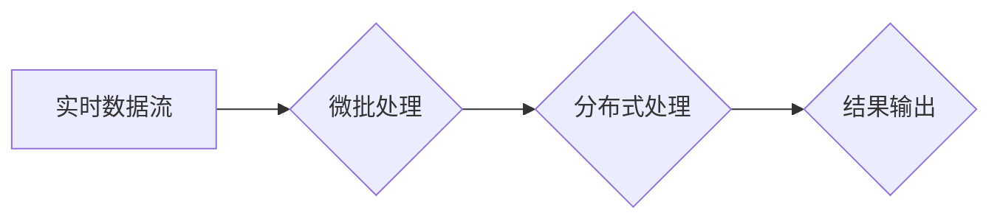

# Spark Streaming原理与代码实例讲解

> 关键词：Spark Streaming, 实时流处理, 消息队列, 微批处理, 模式融合, 窗口操作, 弹性调度

## 1. 背景介绍

随着互联网和物联网的快速发展，数据量呈爆炸式增长，实时数据处理成为大数据领域中一个至关重要的方向。Spark Streaming是Apache Spark生态系统中专门用于实时数据流处理的一个组件。它提供了高吞吐量、容错性强、可扩展性好的特性，可以轻松地将Spark的强大数据处理能力应用于实时数据流。

### 1.1 问题的由来

传统的批处理系统在处理实时数据时存在以下问题：

- 延迟高：批处理系统需要等待数据积累到一定量后才能进行计算，导致响应时间过长。
- 批次依赖：批处理系统的处理结果依赖于特定的时间窗口，难以进行实时决策。
- 复杂性高：将批处理系统改造为实时系统需要大量的改动，开发难度大。

Spark Streaming的出现，正是为了解决上述问题，它允许用户以高吞吐量、低延迟的方式处理实时数据流，并能够与Spark的其他组件无缝集成。

### 1.2 研究现状

Spark Streaming自2013年开源以来，已经发展成为一个成熟且功能强大的实时流处理框架。它支持多种数据源，如Kafka、Flume、Twitter等，并且能够与其他Spark组件（如Spark SQL、MLlib等）进行集成。

### 1.3 研究意义

Spark Streaming在实时数据处理领域具有重要的研究意义和应用价值：

- **高吞吐量**：Spark Streaming能够处理每秒上百万条数据，满足实时性要求。
- **低延迟**：Spark Streaming的微批处理机制能够实现低延迟的实时数据处理。
- **容错性**：Spark Streaming利用Spark的弹性调度机制，保证了系统的容错性。
- **可扩展性**：Spark Streaming可以轻松地扩展到集群规模，以处理更大规模的数据流。

### 1.4 本文结构

本文将分为以下几个部分：

- 核心概念与联系
- 核心算法原理 & 具体操作步骤
- 数学模型和公式 & 详细讲解 & 举例说明
- 项目实践：代码实例和详细解释说明
- 实际应用场景
- 工具和资源推荐
- 总结：未来发展趋势与挑战
- 附录：常见问题与解答

## 2. 核心概念与联系

### 2.1 核心概念

- **实时数据流**：指在短时间内产生的大量数据，如网络日志、传感器数据等。
- **批处理**：指将数据分成多个批次进行处理，每批数据之间可能存在时间间隔。
- **微批处理**：指将数据分成极小的时间间隔进行处理，每批数据量小，处理速度快。
- **弹性调度**：指根据资源需求动态地分配计算资源。
- **容错性**：指系统在面对故障时能够自动恢复，继续正常运行。
- **可扩展性**：指系统能够处理更大规模的数据。

### 2.2 联系

Spark Streaming的核心是将实时数据流转换为微批处理，然后利用Spark的弹性调度机制进行分布式处理。以下是一个简化的Mermaid流程图，展示了Spark Streaming的基本工作流程：



## 3. 核心算法原理 & 具体操作步骤

### 3.1 算法原理概述

Spark Streaming通过以下原理实现实时数据流处理：

1. **数据源接入**：Spark Streaming支持多种数据源，如Kafka、Flume、Twitter等，可以将数据源接入到Spark Streaming系统中。
2. **微批处理**：将实时数据流划分为极小的时间间隔（例如1秒），每个时间间隔内的数据组成一个微批。
3. **分布式处理**：将微批发送到Spark集群进行分布式处理。
4. **结果输出**：处理结果可以输出到数据库、文件系统、仪表盘等。

### 3.2 算法步骤详解

1. **初始化Spark Streaming上下文**：创建一个SparkContext对象，它负责与Spark集群通信。
2. **创建数据源**：根据需要选择合适的数据源，并创建相应的DStream对象。
3. **定义处理逻辑**：使用Spark的Transformation或Action操作对DStream进行转换或计算。
4. **启动流处理作业**：调用`start()`方法启动流处理作业。
5. **等待作业完成**：调用`awaitTermination()`方法等待作业完成。

### 3.3 算法优缺点

**优点**：

- **高吞吐量**：Spark Streaming能够处理每秒上百万条数据。
- **低延迟**：微批处理机制可以实现低延迟的实时数据处理。
- **容错性**：弹性调度机制保证了系统的容错性。
- **可扩展性**：可以轻松地扩展到集群规模。

**缺点**：

- **资源消耗**：Spark Streaming需要额外的资源进行数据缓存和处理。
- **学习曲线**：Spark Streaming的学习曲线相对较陡峭。

### 3.4 算法应用领域

Spark Streaming在以下领域具有广泛的应用：

- **网络日志分析**：实时分析Web日志，监控网站性能，追踪用户行为。
- **实时监控**：监控服务器性能、网络流量等，及时发现异常情况。
- **物联网**：处理来自传感器的实时数据，如温度、湿度、振动等。
- **机器学习**：实时更新模型，进行实时预测和分析。

## 4. 数学模型和公式 & 详细讲解 & 举例说明

### 4.1 数学模型构建

Spark Streaming的微批处理机制可以看作是一个滑动窗口模型。以下是一个简化的数学模型：

$$
D(t) = \{x_1, x_2, \ldots, x_n\}
$$

其中 $D(t)$ 表示时间 $t$ 的数据窗口，$x_i$ 表示窗口内的数据点。

### 4.2 公式推导过程

假设我们有一个每秒生成一条数据的实时数据流，我们将数据流划分为每10秒一个窗口，每秒处理一个窗口内的数据。则时间 $t$ 的数据窗口可以表示为：

$$
D(t) = \{x_{t-9}, x_{t-8}, \ldots, x_t\}
$$

### 4.3 案例分析与讲解

假设我们要计算每10秒内点击量的平均值，以下是一个使用PySpark进行计算的示例：

```python
from pyspark.streaming import StreamingContext
from pyspark.sql import SparkSession

# 创建StreamingContext
ssc = StreamingContext(sc, 1)  # 每秒处理一次

# 创建SparkSession
spark = SparkSession.builder.appName("ClickCount").getOrCreate()

# 创建DStream
dstream = ssc.socketTextStream("localhost", 9999)

# 定义处理逻辑
def click_count(window):
    lines = window.map(lambda line: 1)  # 将每行数据映射为1
    counts = lines.count()  # 计算窗口内的数据数量
    return counts

# 应用处理逻辑
result = dstream.window(windowDuration=10).transform(click_count)

# 打印结果
result.pprint()

# 启动流处理作业
ssc.start()

# 等待流处理作业完成
ssc.awaitTermination()
```

在这个例子中，我们创建了一个每秒处理一次的StreamingContext，然后从本地主机的9999端口读取数据。对于每个10秒的窗口，我们计算窗口内的数据数量，并打印出来。

## 5. 项目实践：代码实例和详细解释说明

### 5.1 开发环境搭建

在进行Spark Streaming开发前，我们需要搭建以下开发环境：

1. 安装Java Development Kit (JDK)
2. 安装Scala
3. 安装Apache Spark
4. 安装PySpark

### 5.2 源代码详细实现

以下是一个简单的Spark Streaming程序，它从Kafka读取数据，计算每分钟内不同主题的点击量，并将结果输出到控制台：

```python
from pyspark import SparkContext
from pyspark.streaming import StreamingContext
from pyspark.streaming.kafka import KafkaUtils

# 创建StreamingContext
ssc = StreamingContext(sc, 1)  # 每秒处理一次

# 创建Kafka Direct Stream
direct_kafka_stream = KafkaUtils.createDirectStream(ssc, ["clicks"], {"metadata.broker.list":"localhost:9092"})

# 定义处理逻辑
def click_count(rdd):
    for key, value in rdd.collect():
        print(f"{key}: {value}")

# 应用处理逻辑
direct_kafka_stream.map(lambda x: (x, 1)).reduceByKey(lambda a, b: a+b).foreachRDD(click_count)

# 启动流处理作业
ssc.start()

# 等待流处理作业完成
ssc.awaitTermination()
```

### 5.3 代码解读与分析

- `SparkContext`：用于与Spark集群通信。
- `StreamingContext`：用于创建流处理上下文。
- `KafkaUtils.createDirectStream`：创建一个从Kafka读取数据的DStream。
- `direct_kafka_stream.map`：将Kafka消息映射为一个元组，其中第一个元素是主题名称，第二个元素是消息内容。
- `reduceByKey`：计算每个主题的点击量总和。
- `foreachRDD`：对每个RDD应用自定义的处理逻辑，即打印每个主题的点击量。

### 5.4 运行结果展示

运行上述程序后，你将看到每个主题的点击量总和输出到控制台。

## 6. 实际应用场景

### 6.1 网络日志分析

Spark Streaming可以用来分析网络日志，监控网站性能，追踪用户行为。例如，可以实时统计每个页面的访问量、用户访问路径、用户行为分析等。

### 6.2 实时监控

Spark Streaming可以用来监控服务器性能、网络流量等，及时发现异常情况。例如，可以实时监控服务器的CPU、内存、磁盘使用率，以及网络带宽等。

### 6.3 物联网

Spark Streaming可以用来处理来自传感器的实时数据，如温度、湿度、振动等。例如，可以实时监测气象数据、工业设备运行状态等。

### 6.4 机器学习

Spark Streaming可以用来进行实时预测和分析。例如，可以实时更新模型，进行实时预测，或者实时分析数据，发现异常模式。

## 7. 工具和资源推荐

### 7.1 学习资源推荐

- Apache Spark官方文档：https://spark.apache.org/docs/latest/
- PySpark官方文档：https://spark.apache.org/docs/latest/api/python/
- Spark Streaming官方文档：https://spark.apache.org/docs/latest/streaming/
- 《Spark Streaming Programming Guide》：https://spark.apache.org/docs/latest/streaming-programming-guide.html

### 7.2 开发工具推荐

- IntelliJ IDEA：https://www.jetbrains.com/idea/
- PyCharm：https://www.jetbrains.com/pycharm/

### 7.3 相关论文推荐

- "Spark Streaming: Large-Scale Real-Time Computation Using Spark" by Matei Zaharia et al.
- "Micro-batching for Efficient Online Learning" by Carter T. Butts et al.

## 8. 总结：未来发展趋势与挑战

### 8.1 研究成果总结

Spark Streaming自开源以来，已经发展成为一个成熟且功能强大的实时流处理框架。它解决了传统批处理系统在实时数据处理方面的局限性，为实时数据处理提供了高效、可靠、可扩展的解决方案。

### 8.2 未来发展趋势

- **更高效的数据处理**：随着硬件和算法的进步，Spark Streaming将进一步提高数据处理效率。
- **更丰富的API**：Spark Streaming将提供更多丰富的API，方便用户进行更复杂的流处理任务。
- **更广泛的应用场景**：Spark Streaming将应用于更多领域，如金融、医疗、物联网等。

### 8.3 面临的挑战

- **资源消耗**：Spark Streaming需要额外的资源进行数据缓存和处理。
- **复杂性**：Spark Streaming的学习曲线相对较陡峭。

### 8.4 研究展望

Spark Streaming将继续优化其性能和易用性，并探索更多应用场景，为实时数据处理领域做出更大的贡献。

## 9. 附录：常见问题与解答

**Q1：Spark Streaming与Apache Flink有什么区别？**

A: Spark Streaming和Apache Flink都是用于实时流处理的框架，但它们在架构和实现上有一些区别。Spark Streaming基于微批处理机制，而Apache Flink基于事件驱动模型。Spark Streaming在易用性和社区支持方面略胜一筹，而Apache Flink在性能和可扩展性方面表现更佳。

**Q2：Spark Streaming如何处理大量数据？**

A: Spark Streaming可以利用Spark的弹性调度机制，动态地分配计算资源，以处理大量数据。此外，Spark Streaming还支持数据分区，可以并行处理数据，提高处理效率。

**Q3：Spark Streaming如何保证容错性？**

A: Spark Streaming利用Spark的弹性调度机制，当节点失败时，可以自动重启失败节点上的任务，保证系统的容错性。

**Q4：Spark Streaming如何与其他Spark组件集成？**

A: Spark Streaming可以与Spark的其他组件无缝集成，如Spark SQL、MLlib等。用户可以使用Spark SQL进行数据查询和分析，使用MLlib进行机器学习等。

---

作者：禅与计算机程序设计艺术 / Zen and the Art of Computer Programming