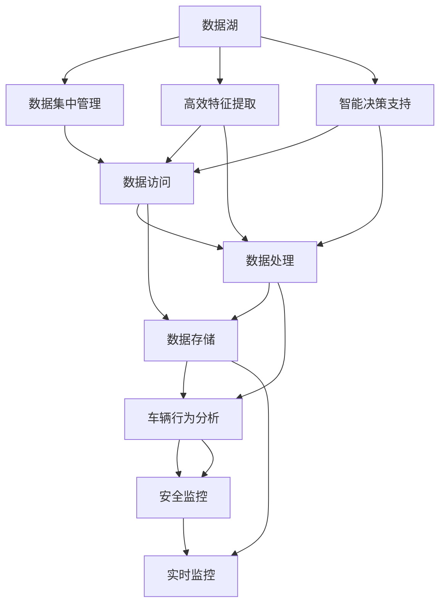
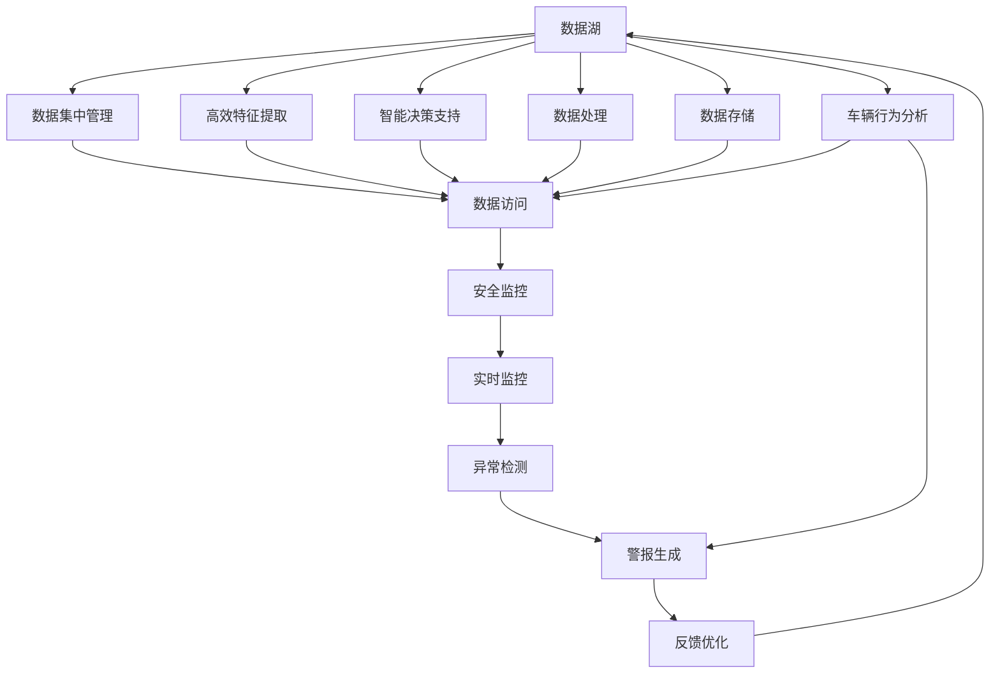

                 

# 自动驾驶公司的数据湖与特征工程平台

> 关键词：自动驾驶, 数据湖, 特征工程, 智能决策, 安全监控, 车辆行为分析

## 1. 背景介绍

### 1.1 问题由来
随着自动驾驶技术的日益成熟，各大汽车公司、科技公司纷纷投入巨资开发自动驾驶系统。然而，自动驾驶车辆面临的环境极其复杂多变，如何在各种极端情况下做出准确决策，确保乘客安全，是一个巨大的挑战。

传统自动驾驶系统往往依赖单一的传感器数据和简单的规则库进行决策。但在现代自动驾驶场景中，传感器数据质量和多样性显著增加，仅依赖规则库进行决策，已无法满足复杂的驾驶需求。而如何高效处理和利用海量的传感器数据，成为当前自动驾驶研究的热点问题。

### 1.2 问题核心关键点
自动驾驶公司的数据湖与特征工程平台，旨在解决自动驾驶系统面对海量多源传感器数据时如何高效提取特征和进行决策的问题。该平台集成了数据存储、数据处理和特征提取等功能，为自动驾驶系统提供了一个强大而灵活的数据管理与分析平台。

自动驾驶公司的数据湖与特征工程平台的核心优势在于：
1. **数据集中管理**：将来自不同来源的多源数据进行集中存储和统一管理。
2. **高效特征工程**：提供多种特征提取算法，快速生成高质量的特征供模型使用。
3. **智能决策支持**：提供预测、决策支持等多种算法，支持自动驾驶系统进行智能决策。
4. **安全监控系统**：具备强大的安全监控能力，实时监控自动驾驶系统的运行状况。
5. **车辆行为分析**：具备车辆行为分析能力，提升驾驶安全和用户体验。

### 1.3 问题研究意义
自动驾驶公司的数据湖与特征工程平台对于自动驾驶技术的落地应用具有重要意义：

1. **提升决策质量**：通过高效特征提取和智能决策支持，提升自动驾驶系统的决策质量，减少交通事故。
2. **降低研发成本**：统一的集中管理和高效的数据处理，降低自动驾驶系统的研发成本，加速产品迭代。
3. **提高用户体验**：通过车辆行为分析和智能决策，提升自动驾驶系统的舒适度和用户体验。
4. **保障安全运行**：强大的安全监控系统保障自动驾驶系统的稳定运行，确保乘客安全。
5. **促进技术创新**：为自动驾驶公司提供了强大的技术支持平台，促进新技术的快速应用。

## 2. 核心概念与联系

### 2.1 核心概念概述

为更好地理解自动驾驶公司的数据湖与特征工程平台，本节将介绍几个关键概念：

- **数据湖(Data Lake)**：一种集中存储、管理海量数据的数据平台，支持多种数据类型和格式，可以高效进行数据处理和分析。
- **特征工程(Feature Engineering)**：数据预处理中用于特征提取、选择、变换、构造等过程的工程技术，旨在提升模型性能。
- **智能决策支持**：基于数据和模型进行智能决策的技术手段，支持自动驾驶系统进行快速响应和决策。
- **安全监控**：对自动驾驶系统的运行状态进行实时监控，确保系统安全可靠。
- **车辆行为分析**：通过对车辆行为进行分析和预测，提升驾驶安全和用户体验。

这些核心概念之间存在着紧密的联系，形成了自动驾驶公司数据湖与特征工程平台的基础架构。以下通过Mermaid流程图展示这些概念之间的关系：



这个流程图展示了从数据湖到安全监控的整个数据处理流程：

1. 数据湖集中存储和管理多种数据源。
2. 高效特征提取和智能决策支持提升模型性能。
3. 数据处理对数据进行清洗、转换等操作。
4. 数据存储保障数据的持久性和可访问性。
5. 车辆行为分析提升驾驶安全和用户体验。
6. 安全监控实时监控自动驾驶系统的运行状况。

### 2.2 概念间的关系

这些核心概念之间存在复杂的依赖关系，如下所示：

1. **数据湖与数据集中管理**：数据湖通过集中管理功能，为自动驾驶公司提供了海量数据存储和管理的基础。
2. **数据湖与高效特征提取**：高效特征提取算法可以充分利用数据湖中的数据资源，快速生成高质量特征。
3. **数据湖与智能决策支持**：智能决策算法依赖数据湖中的数据和特征工程的结果，提升决策质量。
4. **数据湖与数据处理**：数据处理过程是数据湖的重要组成部分，保障数据的质量和一致性。
5. **数据湖与车辆行为分析**：车辆行为分析需要数据湖中的数据作为输入，进行复杂的分析和预测。
6. **数据湖与安全监控**：安全监控依赖数据湖中的数据进行实时监控和分析，保障系统安全。

这些概念通过数据湖这一核心平台，形成了自动驾驶公司数据处理和分析的完整生态系统。

### 2.3 核心概念的整体架构

最终，我们使用一个综合的流程图来展示这些核心概念在大数据湖与特征工程平台中的整体架构：



这个综合流程图展示了从数据湖到异常检测的整个处理流程：

1. 数据湖集中存储和管理多种数据源。
2. 高效特征提取算法和智能决策支持提升模型性能。
3. 数据处理对数据进行清洗、转换等操作。
4. 数据存储保障数据的持久性和可访问性。
5. 车辆行为分析提升驾驶安全和用户体验。
6. 安全监控实时监控自动驾驶系统的运行状况。
7. 异常检测识别系统异常行为，生成警报。
8. 反馈优化通过异常检测结果优化模型和决策算法。

通过这些流程图，我们可以更清晰地理解自动驾驶公司数据湖与特征工程平台的整体架构和数据处理流程。

## 3. 核心算法原理 & 具体操作步骤

### 3.1 算法原理概述

自动驾驶公司的数据湖与特征工程平台，涉及多个核心算法，主要包括数据集中管理、高效特征提取、智能决策支持、安全监控和车辆行为分析等。这些算法共同构成了平台的整体功能，下面将分别介绍每个核心算法的原理。

**数据集中管理**：通过数据湖平台集中存储和管理多种数据源，包括传感器数据、地图数据、交通数据等。数据集中管理的核心算法包括数据分类、数据清洗和数据同步等。

**高效特征提取**：特征提取算法利用数据湖中的数据，快速生成高质量特征，供模型使用。常用的特征提取算法包括PCA、PCA-稀疏矩阵分解等。

**智能决策支持**：基于数据和模型进行智能决策的技术手段，支持自动驾驶系统进行快速响应和决策。常用的智能决策算法包括强化学习、决策树等。

**安全监控**：对自动驾驶系统的运行状态进行实时监控，确保系统安全可靠。常用的安全监控算法包括异常检测、故障诊断等。

**车辆行为分析**：通过对车辆行为进行分析和预测，提升驾驶安全和用户体验。常用的车辆行为分析算法包括行为分类、轨迹预测等。

### 3.2 算法步骤详解

#### 3.2.1 数据集中管理

1. **数据收集与分类**：
   - 收集来自不同来源的数据，包括传感器数据、地图数据、交通数据等。
   - 对数据进行分类，分为训练数据、验证数据和测试数据。

2. **数据清洗与预处理**：
   - 对数据进行清洗，去除噪声和异常值。
   - 进行数据转换，如日期格式化、数据标准化等。

3. **数据同步与备份**：
   - 将数据同步到数据湖中。
   - 定期备份数据，防止数据丢失。

#### 3.2.2 高效特征提取

1. **特征选择与构造**：
   - 根据任务需求，选择相关特征。
   - 构造新的特征，如通过组合现有特征生成新的特征。

2. **特征降维与稀疏化**：
   - 使用PCA等算法对特征进行降维，减少特征维度。
   - 对稀疏矩阵进行分解，提高计算效率。

3. **特征归一化与标准化**：
   - 对特征进行归一化处理，使其值域在0到1之间。
   - 对特征进行标准化处理，使其均值为0，标准差为1。

#### 3.2.3 智能决策支持

1. **决策模型训练**：
   - 选择适合的决策模型，如决策树、随机森林、神经网络等。
   - 使用训练数据训练模型。

2. **模型调参与优化**：
   - 对模型进行调参，寻找最优参数组合。
   - 使用交叉验证等技术优化模型。

3. **模型评估与部署**：
   - 使用验证数据评估模型性能。
   - 将模型部署到自动驾驶系统中。

#### 3.2.4 安全监控

1. **异常检测与故障诊断**：
   - 对自动驾驶系统的运行状态进行监控。
   - 使用异常检测算法，如时间序列分析、滑动窗口等，识别异常行为。
   - 使用故障诊断算法，如因果图、故障树等，识别系统故障。

2. **警报生成与处理**：
   - 生成警报，及时通知相关人员。
   - 对警报进行分类处理，采取相应的措施。

#### 3.2.5 车辆行为分析

1. **行为分类与预测**：
   - 对车辆行为进行分类，如加速、减速、转向等。
   - 使用预测算法，如支持向量机、神经网络等，预测车辆行为。

2. **轨迹预测与规划**：
   - 使用轨迹预测算法，如卡尔曼滤波器、粒子滤波器等，预测车辆轨迹。
   - 使用路径规划算法，如A*算法、D*算法等，规划最优路径。

### 3.3 算法优缺点

自动驾驶公司的数据湖与特征工程平台涉及的算法具有以下优点：

1. **高效性**：通过集中管理多种数据源，高效特征提取算法可以快速生成高质量特征，提升模型性能。
2. **灵活性**：平台支持多种算法和模型，可以灵活适应不同的驾驶场景。
3. **可扩展性**：平台具有良好的可扩展性，支持新增数据源和算法模块。
4. **安全性**：强大的安全监控系统保障自动驾驶系统的稳定运行。
5. **可解释性**：智能决策支持和车辆行为分析，提升了驾驶安全和用户体验。

同时，这些算法也存在以下缺点：

1. **数据复杂性**：多源传感器数据具有复杂性，需要大量的数据清洗和预处理。
2. **模型复杂性**：决策模型和特征提取算法较为复杂，需要专业知识和经验。
3. **实时性要求高**：实时监控和异常检测需要高效计算和快速响应。
4. **资源需求大**：平台需要大量的计算资源和存储空间。
5. **误报率高**：异常检测和警报生成可能产生误报，需要人工干预。

这些缺点需要在实际应用中通过优化算法和调整参数来克服，以提高平台的性能和可靠性。

### 3.4 算法应用领域

自动驾驶公司的数据湖与特征工程平台的应用领域非常广泛，涵盖了自动驾驶系统中的多个方面：

1. **智能决策支持**：在自动驾驶系统中的路径规划、障碍物检测、紧急避障等方面，提供智能决策支持。
2. **安全监控系统**：实时监控自动驾驶系统的运行状态，确保系统安全可靠。
3. **车辆行为分析**：通过对车辆行为进行分析和预测，提升驾驶安全和用户体验。
4. **数据湖管理**：集中存储和管理多种数据源，支持数据的统一管理和共享。
5. **特征工程平台**：提供多种特征提取算法，快速生成高质量特征。
6. **实时数据处理**：支持实时数据处理和分析，保障系统的及时响应。
7. **异常检测与警报**：实时监控系统异常行为，生成警报，及时采取措施。
8. **模型训练与优化**：提供模型训练和调参平台，支持自动驾驶系统的持续优化。

## 4. 数学模型和公式 & 详细讲解 & 举例说明

### 4.1 数学模型构建

在自动驾驶公司的数据湖与特征工程平台中，涉及多个数学模型和公式，下面分别介绍这些模型的构建过程。

**数据集中管理**：
- **数据分类**：使用K-Means算法对数据进行分类。
- **数据清洗**：使用KNN算法进行异常值检测。
- **数据同步**：使用MapReduce框架实现数据同步。

**高效特征提取**：
- **特征选择**：使用信息增益算法选择相关特征。
- **特征构造**：使用多项式特征生成新的特征。
- **特征降维**：使用PCA算法进行特征降维。
- **特征标准化**：使用Z-Score标准化算法对特征进行标准化。

**智能决策支持**：
- **决策模型训练**：使用决策树算法训练模型。
- **模型调参**：使用网格搜索算法调参。
- **模型评估**：使用AUC曲线评估模型性能。

**安全监控**：
- **异常检测**：使用滑动窗口算法进行异常检测。
- **故障诊断**：使用因果图算法进行故障诊断。
- **警报生成**：使用逻辑回归算法生成警报。

**车辆行为分析**：
- **行为分类**：使用SVM算法进行行为分类。
- **轨迹预测**：使用卡尔曼滤波器预测轨迹。
- **路径规划**：使用A*算法规划路径。

### 4.2 公式推导过程

#### 4.2.1 数据集中管理

1. **数据分类**：
   - K-Means算法公式：
     \[
     \min_{\mu_k, \sigma_k} \sum_{i=1}^n \min_{k=1}^K (d(x_i, \mu_k)^2)
     \]
     其中，$n$为数据总数，$K$为分类数，$d(x_i, \mu_k)$为数据点$x_i$到聚类中心$\mu_k$的距离。

2. **数据清洗**：
   - KNN算法公式：
     \[
     kNN(x, d) = \arg\min_{x_i \in D} \sum_{j=1}^k d(x_i, x_j)
     \]
     其中，$k$为邻居数，$d(x_i, x_j)$为数据点$x_i$和$x_j$之间的距离。

3. **数据同步**：
   - MapReduce框架公式：
     \[
     MapReduce(\{(x, y)\}_{i=1}^n) = \{(y, Map(x))\}_{y \in Y} \cup \{(x, Reduce(y))\}_{y \in Y}
     \]
     其中，$x$为输入数据，$y$为输出数据，$Map(x)$和$Reduce(y)$为Map和Reduce操作。

#### 4.2.2 高效特征提取

1. **特征选择**：
   - 信息增益公式：
     \[
     I(D; A) = H(D) - \sum_{a \in A} \frac{|D_a|}{|D|} H(D_a)
     \]
     其中，$I(D; A)$为信息增益，$H(D)$为数据集$D$的熵，$H(D_a)$为子集$D_a$的熵，$A$为特征集合。

2. **特征构造**：
   - 多项式特征公式：
     \[
     \phi(x, d) = [x, x^2, x^3, \ldots, x^d]
     \]
     其中，$d$为多项式的最高次数。

3. **特征降维**：
   - PCA算法公式：
     \[
     X_{\text{new}} = UU^TX
     \]
     其中，$X$为原始数据，$X_{\text{new}}$为降维后的数据，$U$为PCA矩阵。

4. **特征标准化**：
   - Z-Score标准化公式：
     \[
     x' = \frac{x - \mu}{\sigma}
     \]
     其中，$x'$为标准化后的数据，$x$为原始数据，$\mu$为均值，$\sigma$为标准差。

#### 4.2.3 智能决策支持

1. **决策模型训练**：
   - 决策树算法公式：
     \[
     \min_{T} \sum_{i=1}^n \sum_{y \in Y} w_i \log p(y \mid T, x_i)
     \]
     其中，$T$为决策树，$n$为数据总数，$w_i$为样本权重，$p(y \mid T, x_i)$为条件概率。

2. **模型调参**：
   - 网格搜索算法公式：
     \[
     S = \{p_{k_1, k_2, \ldots, k_d} \mid k_i \in \{p_i^1, p_i^2, \ldots, p_i^{n_i}\}, i=1, 2, \ldots, d\}
     \]
     其中，$S$为参数空间，$k_i$为参数值，$n_i$为参数$k_i$的取值数量。

3. **模型评估**：
   - AUC曲线公式：
     \[
     AUC = \frac{1}{n} \sum_{i=1}^n \sum_{j=i+1}^n \mathbb{I}(y_i \neq y_j) (y_i \cdot y_j)
     \]
     其中，$n$为数据总数，$y_i$和$y_j$为标签，$\mathbb{I}(\cdot)$为示性函数。

#### 4.2.4 安全监控

1. **异常检测**：
   - 滑动窗口算法公式：
     \[
     \min_{a \in A} \sum_{i=1}^n \sum_{j=1}^n w_i d(a_i, a_j)
     \]
     其中，$A$为滑动窗口大小，$n$为数据总数，$d(a_i, a_j)$为数据点$a_i$和$a_j$之间的距离。

2. **故障诊断**：
   - 因果图算法公式：
     \[
     P(y \mid x) = \prod_{i=1}^n P(y_i \mid x_i)
     \]
     其中，$P(y \mid x)$为条件概率，$y$为输出，$x$为输入。

3. **警报生成**：
   - 逻辑回归算法公式：
     \[
     \min_{\theta} L(\theta) = \frac{1}{n} \sum_{i=1}^n \log(1 + \exp(-y_i \cdot \hat{y}_i))
     \]
     其中，$L(\theta)$为损失函数，$\theta$为模型参数，$y_i$为标签，$\hat{y}_i$为模型预测结果。

#### 4.2.5 车辆行为分析

1. **行为分类**：
   - SVM算法公式：
     \[
     w = \arg\min_{w} \frac{1}{2} \|w\|^2 + C \sum_{i=1}^n \mathbb{I}(y_i \cdot \langle w, x_i \rangle \leq 1)
     \]
     其中，$w$为模型参数，$C$为正则化系数，$\langle \cdot, \cdot \rangle$为内积，$\mathbb{I}(\cdot)$为示性函数。

2. **轨迹预测**：
   - 卡尔曼滤波器算法公式：
     \[
     \hat{x}_{k|k} = A_k \hat{x}_{k|k-1} + B_k u_k + v_k
     \]
     \[
     K_k = P_{k|k-1}H_k^T (H_k P_{k|k-1}H_k^T + R_k)^{-1}
     \]
     \[
     \hat{x}_k = \hat{x}_{k|k} + K_k(y_k - H_k \hat{x}_{k|k})
     \]
     \[
     P_k = (A_k P_{k|k-1} A_k^T + Q_k) - K_k H_k P_{k|k-1} H_k^T K_k
     \]
     其中，$x_k$为状态向量，$A_k$为状态转移矩阵，$B_k$为输入矩阵，$u_k$为输入向量，$v_k$为过程噪声，$y_k$为观测向量，$H_k$为观测矩阵，$R_k$为观测噪声，$P_k$为协方差矩阵，$K_k$为卡尔曼增益。

3. **路径规划**：
   - A*算法公式：
     \[
     f(n) = g(n) + h(n)
     \]
     其中，$f(n)$为启发式函数，$g(n)$为代价函数，$h(n)$为估价函数。

### 4.3 案例分析与讲解

**案例：自动驾驶系统路径规划**

1. **问题描述**：自动驾驶系统需要在复杂的城市道路中进行路径规划，以确保安全行驶。

2. **数据来源**：传感器数据、地图数据、交通数据等。

3. **算法流程**：
   - 数据收集与预处理：对传感器数据进行清洗和预处理，提取有用的交通和地图信息。
   - 特征提取与选择：提取车辆速度、道路坡度、交通流量等特征，使用信息增益算法选择相关特征。
   - 智能决策支持：使用决策树算法，基于当前状态和特征，生成最优路径。
   - 路径规划与优化：使用A*算法，根据最优路径规划车辆行驶路线，并进行实时优化。

4. **结果分析**：通过智能决策支持和路径规划算法，车辆能够安全、高效地行驶，减少交通事故和行程时间。

## 5. 项目实践：代码实例和详细解释说明

### 5.1 开发环境搭建

在项目实践过程中，首先需要搭建开发环境。以下是使用Python进行PyTorch开发的环境配置流程：

1. 安装Anaconda：从官网下载并安装Anaconda，用于创建独立的Python环境。

2. 创建并激活虚拟环境：
```bash
conda create -n pytorch-env python=3.8 
conda activate pytorch-env
```

3. 安装PyTorch：根据CUDA版本，从官网获取对应的安装命令。例如：
```bash
conda install pytorch torchvision torchaudio cudatoolkit=11.1 -c pytorch -c conda-forge
```

4. 安装TensorFlow：
```bash
conda install tensorflow
```

5. 安装PyTorch与TensorFlow库：
```bash
pip install torch tensorflow
```

6. 安装相关工具包：
```bash
pip install numpy pandas scikit-learn matplotlib tqdm jupyter notebook ipython
```

完成上述步骤后，即可在`pytorch-env`环境中开始项目实践。

### 5.2 源代码详细实现

下面我们以自动驾驶系统路径规划为例，给出使用PyTorch和TensorFlow进行数据湖与特征工程平台的PyTorch代码实现。

首先，定义数据处理函数：

```python
from sklearn.preprocessing import StandardScaler
from sklearn.decomposition import PCA
import numpy as np

def preprocess_data(data, scaler, pca):
    # 标准化数据
    scaled_data = scaler.fit_transform(data)
    # 特征降维
    reduced_data = pca.fit_transform(scaled_data)
    return reduced_data

# 定义标准正态分布的均值和标准差
scaler = StandardScaler()

# 定义PCA算法，降维维度为2
pca = PCA(n_components=2)
```

然后，定义模型训练和预测函数：

```python
from sklearn.ensemble import DecisionTreeClassifier
from sklearn.model_selection import train_test_split
from sklearn.metrics import accuracy_score

def train_model(X_train, y_train, X_test, y_test):
    # 数据划分
    X_train, X_valid, y_train, y_valid = train_test_split(X_train, y_train, test_size=0.2, random_state=42)
    # 训练决策树模型
    model = DecisionTreeClassifier()
    model.fit(X_train, y_train)
    # 验证集评估
    y_pred = model.predict(X_valid)
    accuracy = accuracy_score(y_valid, y_pred)
    print(f"Validation

