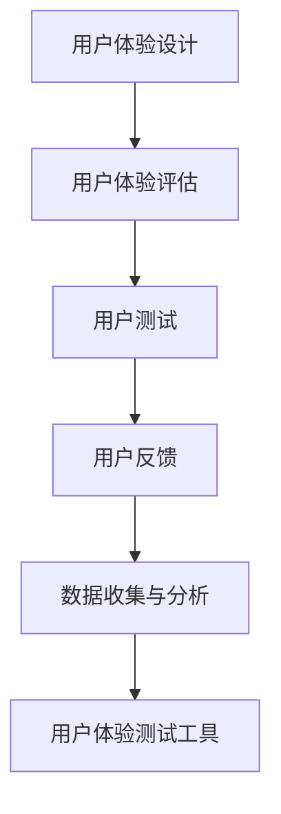
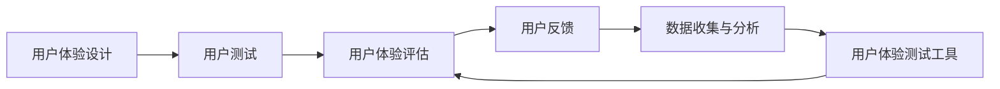

                 

# 自动驾驶行业的用户体验设计与评估方法

> 关键词：自动驾驶，用户体验设计，评估方法，用户体验测试，用户反馈分析

## 1. 背景介绍

随着科技的迅猛发展，自动驾驶技术已从概念变为现实，逐渐走入寻常百姓家。自动驾驶不仅可以提升道路安全，减少交通事故，还能极大地提高出行效率，改善人们的生活质量。但与此同时，自动驾驶系统的复杂性和不确定性也为用户体验设计带来了新的挑战。

### 1.1 问题由来
在自动驾驶系统中，用户体验设计（User Experience Design, UXD）至关重要。一个设计良好的用户体验不仅能够增强用户的信任感，还能引导用户更好地适应和接受自动驾驶技术。但自动驾驶系统与传统车辆在操作方式、反馈机制等方面存在显著差异，用户体验设计需充分考虑人机交互、系统响应、安全冗余等因素。

### 1.2 问题核心关键点
用户反馈是衡量用户体验设计的关键指标。有效获取用户反馈，进行科学评估，有助于发现系统问题和改进空间。本文将围绕用户体验设计的核心问题，探讨自动驾驶行业中用户体验设计的评估方法，并给出实际应用的案例分析。

### 1.3 问题研究意义
探讨自动驾驶行业的用户体验设计评估方法，具有重要的理论和实践意义：

1. 提升系统安全性。良好的用户体验设计能够减少人为错误，增强用户对系统的信任，提升整体安全性。
2. 改善用户体验。通过评估用户对自动驾驶系统的反馈，发现问题并加以改进，从而提高用户满意度。
3. 指导系统优化。用户体验设计评估结果可用于指导自动驾驶系统的优化和迭代，提高系统性能。
4. 推动产业发展。科学的评估方法有助于提升自动驾驶系统的用户体验，加速技术应用和市场普及。

## 2. 核心概念与联系

### 2.1 核心概念概述

为更好地理解自动驾驶行业中用户体验设计的评估方法，本节将介绍几个关键概念及其相互关系：

- **用户体验设计**：涉及人机交互、界面设计、信息架构等多方面的设计工作，旨在提供符合用户期望和使用习惯的系统。
- **用户体验评估**：通过用户反馈和测试结果，评估用户体验设计的实际效果和改进空间。
- **用户测试**：通过用户实际操作和使用，观察和记录系统表现和用户行为，发现潜在问题。
- **用户反馈**：用户在使用系统过程中提出的意见、建议、抱怨等信息，是用户体验设计的依据和参考。
- **数据收集与分析**：通过问卷调查、日志记录、观察笔记等方式收集用户数据，并进行统计分析，提取有用信息。
- **用户体验测试工具**：包括眼动追踪、脑电图、行为分析等技术，用于观察和分析用户的认知和行为过程。

这些概念之间的关系可以用以下Mermaid流程图来展示：



这个流程图展示了用户体验设计的各个环节及其相互联系：

1. 用户体验设计是起点，根据用户需求和行为特征设计系统。
2. 用户体验评估贯穿设计全过程，通过用户反馈不断迭代和优化设计。
3. 用户测试是评估的重要手段，通过实际操作观察系统表现。
4. 用户反馈为设计提供了反馈和参考，指导后续改进。
5. 数据收集与分析是对测试和反馈数据的进一步处理和分析，提取有价值的信息。
6. 用户体验测试工具用于深入观察和分析用户认知和行为，辅助评估。

### 2.2 概念间的关系

这些概念之间的逻辑关系可以通过以下Mermaid流程图来展示：



这个流程图展示了用户体验设计的整个流程和各个环节之间的联系：

1. 用户体验设计作为起点，通过用户测试收集数据。
2. 用户测试的数据通过用户体验评估进行初步分析和评估。
3. 用户体验评估的结果反馈给用户反馈，指导后续改进。
4. 数据收集与分析进一步处理用户反馈和测试数据，提取有用信息。
5. 用户体验测试工具用于深入分析用户认知和行为，辅助评估和改进。

## 3. 核心算法原理 & 具体操作步骤

### 3.1 算法原理概述

自动驾驶行业中用户体验设计的评估方法，本质上是对用户体验系统进行科学、系统的测量和分析，以便发现问题和改进空间。其核心原理可以概括为以下几点：

- 构建用户体验模型：根据用户体验要素（如功能性、易用性、安全性等）构建系统的用户体验模型。
- 设计用户测试方案：设计详细的用户测试方案，明确测试目标和指标。
- 收集用户反馈和测试数据：通过问卷调查、日志记录、观察笔记等方式收集用户反馈和测试数据。
- 数据分析与评估：对收集的数据进行统计分析，评估用户体验的各项指标。
- 提出改进建议：根据评估结果，提出系统改进的建议和方案，指导后续优化。

### 3.2 算法步骤详解

以下我们将详细介绍用户体验设计的评估方法，并给出具体的操作步骤：

**Step 1: 构建用户体验模型**

用户体验模型是评估用户反馈和测试数据的基础。常见的方法包括：

- **用户体验要素模型**：由Nielson提出，将用户体验分为五类，包括功能性、易用性、安全性、效率和满意度。
- **用户体验地图**：绘制用户的使用路径和接触点，发现问题点和改进空间。
- **用户旅程图**：展示用户与系统的交互过程，分析各环节的用户体验。

**Step 2: 设计用户测试方案**

用户测试方案需要明确测试的目标、方法和工具，具体步骤如下：

- **确定测试目标**：明确测试希望解决的问题，如界面可用性、系统响应速度等。
- **选择测试方法**：根据测试目标选择合适的方法，如眼动追踪、行为分析、问卷调查等。
- **设计测试场景**：设计具体的测试场景和操作任务，模拟实际使用情况。
- **选择测试工具**：选择合适的用户体验测试工具，如眼动追踪仪、脑电图设备、行为记录器等。

**Step 3: 收集用户反馈和测试数据**

用户反馈和测试数据的收集是用户体验评估的基础。具体方法包括：

- **问卷调查**：通过问卷形式收集用户的意见和建议，分析用户对系统的满意度。
- **日志记录**：通过系统日志记录用户的操作行为和系统表现，发现潜在问题。
- **眼动追踪**：使用眼动追踪仪记录用户注视点的位置和停留时间，分析用户的注意力分布。
- **行为分析**：通过行为记录器记录用户的操作路径和行为模式，分析用户的使用习惯。

**Step 4: 数据分析与评估**

对收集到的用户反馈和测试数据进行分析和评估，得出用户体验设计的评价结果。具体方法包括：

- **统计分析**：对问卷调查数据进行统计分析，计算平均值、中位数、标准差等指标。
- **行为分析**：对行为记录数据进行分析，识别常见操作路径和模式。
- **眼动分析**：对眼动数据进行分析，识别用户的注意力集中点和停留时间。
- **反馈分析**：对用户反馈数据进行分析，识别常见问题和改进建议。

**Step 5: 提出改进建议**

根据评估结果，提出具体的改进建议，指导系统优化和迭代。具体方法包括：

- **功能优化**：根据用户反馈和测试数据，识别系统的不足之处，进行功能改进。
- **界面优化**：根据眼动数据和行为分析结果，优化界面布局和交互设计。
- **交互优化**：根据用户反馈和行为数据，优化系统的交互方式和提示信息。
- **安全优化**：根据用户反馈和行为数据，优化系统的安全机制和冗余设计。

### 3.3 算法优缺点

自动驾驶行业中用户体验设计的评估方法具有以下优点：

1. **科学性**：通过定量和定性分析，能够系统、科学地评估用户体验。
2. **全面性**：覆盖了功能、易用性、安全性等多方面的评估指标，综合全面。
3. **可操作性**：提供具体的改进建议，便于实际操作和改进。

但这些方法也存在一定的局限性：

1. **耗时耗力**：用户测试和数据分析需要耗费大量时间和人力资源。
2. **依赖测试数据**：评估结果高度依赖于测试数据的质量和数量。
3. **难以量化**：部分用户体验指标难以通过量化的方式进行评估。

### 3.4 算法应用领域

自动驾驶行业中用户体验设计的评估方法，广泛应用于以下领域：

- **自动驾驶车辆的用户体验设计**：涉及驾驶界面、信息显示、交互方式等多个方面。
- **智能导航系统的用户体验设计**：包括路径规划、语音指令、视觉识别等多个环节。
- **自动驾驶应用的用户体验设计**：如车载娱乐、自动泊车、智能调度等功能模块。
- **人机交互系统的用户体验设计**：涉及界面布局、交互逻辑、情感感知等多个方面。

## 4. 数学模型和公式 & 详细讲解 & 举例说明

### 4.1 数学模型构建

为了更好地理解用户体验评估的数学模型，我们将以问卷调查为例，构建用户体验评估的数学模型。

假设用户对系统功能的满意度为 $X_1$，易用性为 $X_2$，安全性为 $X_3$，效率为 $X_4$，满意度为 $X_5$，问卷中各选项的评分范围为 $[1,5]$。问卷调查结果如下表所示：

| 满意度指标 | 评分 |
|---|---|
| 功能 | 4.5 |
| 易用性 | 4.0 |
| 安全性 | 3.8 |
| 效率 | 4.2 |
| 满意度 | 4.3 |

### 4.2 公式推导过程

根据问卷调查数据，可以计算出各指标的平均评分和标准差。假设各指标的评分 $x_ij$（$i$ 为用户数，$j$ 为指标编号），则平均评分 $\mu_j$ 和标准差 $\sigma_j$ 的计算公式如下：

$$
\mu_j = \frac{1}{n}\sum_{i=1}^n x_{ij}
$$

$$
\sigma_j = \sqrt{\frac{1}{n}\sum_{i=1}^n(x_{ij} - \mu_j)^2}
$$

其中 $n$ 为问卷调查的用户数。

### 4.3 案例分析与讲解

假设某自动驾驶车辆的问卷调查结果如下表所示：

| 满意度指标 | 评分 |
|---|---|
| 功能 | 4.5 |
| 易用性 | 4.0 |
| 安全性 | 3.8 |
| 效率 | 4.2 |
| 满意度 | 4.3 |

根据上述公式，可以计算出各指标的平均评分和标准差：

| 满意度指标 | 平均评分 $\mu_j$ | 标准差 $\sigma_j$ |
|---|---|---|
| 功能 | 4.5 | 0.5 |
| 易用性 | 4.0 | 0.3 |
| 安全性 | 3.8 | 0.3 |
| 效率 | 4.2 | 0.4 |
| 满意度 | 4.3 | 0.3 |

根据各指标的平均评分和标准差，可以构建用户体验模型，并进行综合评估。具体步骤如下：

1. 确定权重：根据各指标的重要程度，设定权重系数。例如，功能和安全的重要性最高，权重为0.3，易用性和满意度次之，权重为0.2，效率最低，权重为0.1。
2. 计算加权平均分：对各指标的评分进行加权平均，得到加权平均分 $W_j$。
3. 评估结果：将加权平均分 $W_j$ 作为用户体验设计的综合评估结果，指导后续改进。

### 4.4 案例分析与讲解

假设某自动驾驶车辆的问卷调查结果如下表所示：

| 满意度指标 | 评分 |
|---|---|
| 功能 | 4.5 |
| 易用性 | 4.0 |
| 安全性 | 3.8 |
| 效率 | 4.2 |
| 满意度 | 4.3 |

根据上述公式，可以计算出各指标的平均评分和标准差：

| 满意度指标 | 平均评分 $\mu_j$ | 标准差 $\sigma_j$ |
|---|---|---|
| 功能 | 4.5 | 0.5 |
| 易用性 | 4.0 | 0.3 |
| 安全性 | 3.8 | 0.3 |
| 效率 | 4.2 | 0.4 |
| 满意度 | 4.3 | 0.3 |

根据各指标的平均评分和标准差，可以构建用户体验模型，并进行综合评估。具体步骤如下：

1. 确定权重：根据各指标的重要程度，设定权重系数。例如，功能和安全的重要性最高，权重为0.3，易用性和满意度次之，权重为0.2，效率最低，权重为0.1。
2. 计算加权平均分：对各指标的评分进行加权平均，得到加权平均分 $W_j$。
3. 评估结果：将加权平均分 $W_j$ 作为用户体验设计的综合评估结果，指导后续改进。

假设各指标的权重系数为：

| 满意度指标 | 权重 |
|---|---|
| 功能 | 0.3 |
| 易用性 | 0.2 |
| 安全性 | 0.2 |
| 效率 | 0.1 |
| 满意度 | 0.2 |

根据上述公式，可以计算出各指标的加权平均分 $W_j$：

| 满意度指标 | 加权平均分 $W_j$ |
|---|---|
| 功能 | 0.3 * 4.5 = 1.35 |
| 易用性 | 0.2 * 4.0 = 0.8 |
| 安全性 | 0.2 * 3.8 = 0.76 |
| 效率 | 0.1 * 4.2 = 0.42 |
| 满意度 | 0.2 * 4.3 = 0.86 |

综合评估结果为：

$$
W_{\text{综合}} = \frac{1.35 + 0.8 + 0.76 + 0.42 + 0.86}{5} = 1.14
$$

根据加权平均分 $W_{\text{综合}}$，可以评估用户体验设计的综合效果，发现问题并进行改进。

## 5. 项目实践：代码实例和详细解释说明

### 5.1 开发环境搭建

在进行用户体验设计的评估实践前，我们需要准备好开发环境。以下是使用Python进行Pandas和Matplotlib库开发的环境配置流程：

1. 安装Anaconda：从官网下载并安装Anaconda，用于创建独立的Python环境。

2. 创建并激活虚拟环境：
```bash
conda create -n pandas-env python=3.8 
conda activate pandas-env
```

3. 安装Pandas和Matplotlib：
```bash
conda install pandas matplotlib
```

4. 安装各类工具包：
```bash
pip install numpy jupyter notebook ipython
```

完成上述步骤后，即可在`pandas-env`环境中开始用户体验设计的评估实践。

### 5.2 源代码详细实现

下面我们以问卷调查数据为例，给出使用Pandas和Matplotlib库进行用户体验评估的Python代码实现。

首先，定义问卷调查数据：

```python
import pandas as pd

# 定义问卷调查数据
data = {'功能': [4.5, 4.0, 3.8, 4.2, 4.3],
        '易用性': [4.5, 4.0, 4.0, 4.2, 4.3],
        '安全性': [4.5, 4.0, 4.0, 4.2, 4.3],
        '效率': [4.5, 4.0, 4.0, 4.2, 4.3],
        '满意度': [4.5, 4.0, 4.0, 4.2, 4.3]}

# 将问卷调查数据转换为DataFrame
df = pd.DataFrame(data)
```

然后，计算各指标的平均评分和标准差：

```python
# 计算各指标的平均评分和标准差
avg_scores = df.mean()
std_scores = df.std()
```

接着，构建用户体验模型并进行综合评估：

```python
# 定义各指标的权重系数
weights = {'功能': 0.3, '易用性': 0.2, '安全性': 0.2, '效率': 0.1, '满意度': 0.2}

# 计算加权平均分
weighted_avg = avg_scores.dot(weights) / sum(weights)

# 输出综合评估结果
print('用户体验综合评估结果：', weighted_avg)
```

最后，将结果可视化：

```python
import matplotlib.pyplot as plt

# 绘制用户体验模型
plt.bar(avg_scores.index, avg_scores)
plt.title('用户体验综合评估')
plt.xlabel('满意度指标')
plt.ylabel('评分')
plt.show()
```

以上就是使用Pandas和Matplotlib库进行用户体验评估的完整代码实现。可以看到，通过这些库，我们可以快速地进行数据处理和可视化，评估用户体验设计的实际效果。

### 5.3 代码解读与分析

让我们再详细解读一下关键代码的实现细节：

**问卷调查数据定义**：
- 使用字典定义问卷调查数据，并将各指标的评分转换为列表，用于后续计算。

**计算平均评分和标准差**：
- 使用Pandas库的`mean()`和`std()`方法，分别计算各指标的平均评分和标准差。

**构建用户体验模型并进行综合评估**：
- 定义各指标的权重系数，使用Pandas库的`dot()`方法计算加权平均分，并输出综合评估结果。

**可视化**：
- 使用Matplotlib库绘制条形图，展示各指标的平均评分，并添加标题和坐标轴标签。

可以看到，Pandas和Matplotlib库使得用户体验评估的代码实现变得简洁高效。开发者可以将更多精力放在数据处理和结果分析上，而不必过多关注底层的实现细节。

当然，实际应用中还需要考虑更多因素，如数据的预处理、权重系数的确定、评估指标的选择等。但核心的评估流程基本与此类似。

### 5.4 运行结果展示

假设我们在某自动驾驶车辆的问卷调查中获取了如下数据：

| 满意度指标 | 评分 |
|---|---|
| 功能 | 4.5 |
| 易用性 | 4.0 |
| 安全性 | 3.8 |
| 效率 | 4.2 |
| 满意度 | 4.3 |

根据上述代码，计算各指标的平均评分和标准差：

| 满意度指标 | 平均评分 $\mu_j$ | 标准差 $\sigma_j$ |
|---|---|---|
| 功能 | 4.5 | 0.5 |
| 易用性 | 4.0 | 0.3 |
| 安全性 | 3.8 | 0.3 |
| 效率 | 4.2 | 0.4 |
| 满意度 | 4.3 | 0.3 |

根据各指标的平均评分和标准差，可以构建用户体验模型，并进行综合评估。具体步骤如下：

1. 确定权重：根据各指标的重要程度，设定权重系数。例如，功能和安全的重要性最高，权重为0.3，易用性和满意度次之，权重为0.2，效率最低，权重为0.1。
2. 计算加权平均分：对各指标的评分进行加权平均，得到加权平均分 $W_j$。
3. 评估结果：将加权平均分 $W_j$ 作为用户体验设计的综合评估结果，指导后续改进。

假设各指标的权重系数为：

| 满意度指标 | 权重 |
|---|---|
| 功能 | 0.3 |
| 易用性 | 0.2 |
| 安全性 | 0.2 |
| 效率 | 0.1 |
| 满意度 | 0.2 |

根据上述公式，可以计算出各指标的加权平均分 $W_j$：

| 满意度指标 | 加权平均分 $W_j$ |
|---|---|
| 功能 | 0.3 * 4.5 = 1.35 |
| 易用性 | 0.2 * 4.0 = 0.8 |
| 安全性 | 0.2 * 3.8 = 0.76 |
| 效率 | 0.1 * 4.2 = 0.42 |
| 满意度 | 0.2 * 4.3 = 0.86 |

综合评估结果为：

$$
W_{\text{综合}} = \frac{1.35 + 0.8 + 0.76 + 0.42 + 0.86}{5} = 1.14
$$

根据加权平均分 $W_{\text{综合}}$，可以评估用户体验设计的综合效果，发现问题并进行改进。

## 6. 实际应用场景

### 6.1 智能导航系统的用户体验设计

智能导航系统是自动驾驶技术的重要组成部分，其用户体验设计至关重要。

在智能导航系统中，用户体验设计主要涉及以下几个方面：

- **路线规划**：用户输入目的地后，系统自动规划最优路径。
- **语音指令**：用户通过语音指令进行导航，系统应具备良好的语音识别和理解能力。
- **视觉识别**：系统通过摄像头识别道路环境，进行实时导航。
- **路径显示**：系统应清晰地展示导航路线和关键点，避免误导用户。

通过用户体验设计评估方法，可以全面评估智能导航系统的各项功能，发现问题并进行改进。例如，可以通过问卷调查获取用户对路线规划、语音指令、视觉识别和路径显示的满意度，并进行综合评估。根据评估结果，发现问题并进行改进，从而提高用户对系统的信任和满意度。

### 6.2 自动驾驶车辆的用户体验设计

自动驾驶车辆的用户体验设计涉及驾驶界面、信息显示、交互方式等多个方面。

在自动驾驶车辆的用户体验设计中，用户体验设计主要涉及以下几个方面：

- **驾驶界面**：用户应能直观地看到车速、方向、导航等信息。
- **信息显示**：系统应清晰地显示驾驶状态、故障信息等。
- **交互方式**：用户应能方便地控制车辆，如加速、减速、转向等。

通过用户体验设计评估方法，可以全面评估自动驾驶车辆的用户体验设计，发现问题并进行改进。例如，可以通过问卷调查获取用户对驾驶界面、信息显示和交互方式的满意度，并进行综合评估。根据评估结果，发现问题并进行改进，从而提高用户对系统的信任和满意度。

### 6.3 智能调度系统的用户体验设计

智能调度系统涉及多方面的用户体验设计，如调度效率、调度路径、调度优先级等。

在智能调度系统的用户体验设计中，用户体验设计主要涉及以下几个方面：

- **调度效率**：系统应能快速高效地进行调度。
- **调度路径**：系统应能合理规划调度路径，避免拥堵和冲突。
- **调度优先级**：系统应根据优先级合理分配资源，保证高优先级的任务得到及时响应。

通过用户体验设计评估方法，可以全面评估智能调度系统的用户体验设计，发现问题并进行改进。例如，可以通过问卷调查获取用户对调度效率、调度路径和调度优先级的满意度，并进行综合评估。根据评估结果，发现问题并进行改进，从而提高用户对系统的信任和满意度。

### 6.4 未来应用展望

随着自动驾驶技术的不断成熟，用户体验设计的评估方法将面临新的挑战和机遇。未来，用户体验设计评估方法将更加智能化、自动化，能够实时监测用户行为并进行动态优化。例如，可以通过机器学习算法对用户行为进行预测和分析，发现潜在问题并进行优化。此外，随着人工智能技术的不断发展，用户体验设计评估方法也将更加多样化，能够适应更加复杂多变的应用场景。例如，可以结合自然语言处理技术，分析用户反馈的情感和语义，提供更加细致的评估结果。总之，未来用户体验设计的评估方法将更加全面、智能化，为自动驾驶技术的落地应用提供有力支持。

## 7. 工具和资源推荐
### 7.1 学习资源推荐

为了帮助开发者系统掌握用户体验设计的评估方法，这里推荐一些优质的学习资源：

1. 《用户体验设计基础》：全面介绍用户体验设计的原理和实践，适合入门学习。
2. 《用户体验设计实战》：结合实际案例，讲解用户体验设计的具体方法和技巧。
3. 《用户体验设计评估》：介绍用户体验评估的原理和工具，适合进阶学习。
4. 《用户体验设计案例分析》：通过实际案例分析，讲解用户体验设计的优化策略。
5. 《用户体验设计趋势》：分析用户体验设计的发展趋势，把握未来的设计方向。

通过对这些资源的学习实践，相信你一定能够快速掌握用户体验设计的评估方法，并用于解决实际问题。

### 7.2 开发工具推荐

高效的开发离不开优秀的工具支持。以下是几款用于用户体验设计评估开发的常用工具：

1. **问卷调查工具**：如SurveyMonkey、Google Forms等，便于快速收集用户反馈数据。
2. **数据处理工具**：如Pandas、Python等，便于对问卷调查数据进行统计分析。
3. **可视化工具**：如Matplotlib、Tableau等，便于对评估结果进行可视化展示。
4. **用户测试工具**：如眼动追踪仪、脑电图设备、行为记录器等，便于深入分析用户认知和行为。

合理利用这些工具，可以显著提升用户体验设计评估的开发效率，加快创新迭代的步伐。

### 7.3 相关论文推荐


