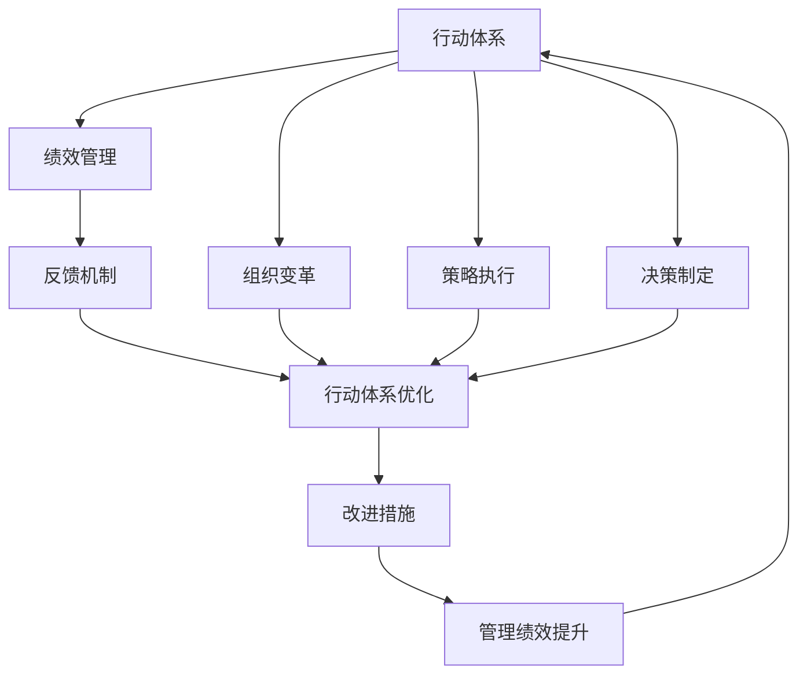
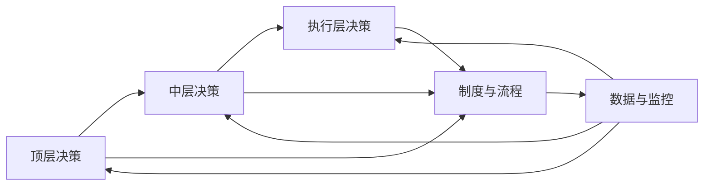
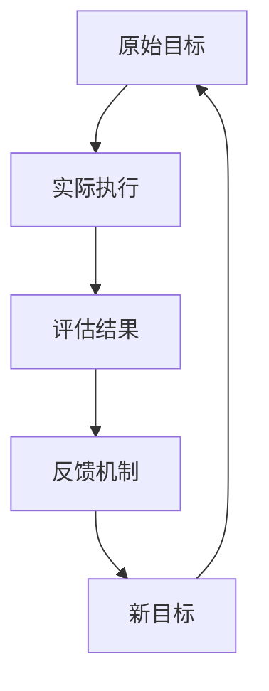
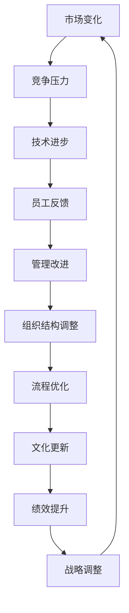
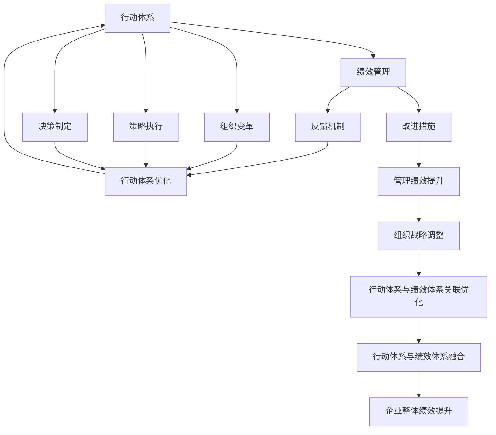

                 

# 行动体系与管理绩效的关联

> 关键词：行动体系,绩效管理,组织变革,策略执行,决策制定

## 1. 背景介绍

### 1.1 问题由来
在现代企业的经营管理中，行动体系与绩效管理是密不可分的重要组成部分。行动体系指的是企业内部各种决策和执行的流程、机制和规范，而绩效管理则是评估这些流程、机制和规范实施效果的工具和方法。行动体系与绩效管理之间相互作用、相互影响，共同推动企业发展。然而，在实际管理中，行动体系与绩效管理存在脱节的现象，导致企业决策执行力不足，管理绩效不佳。如何更好地将行动体系与绩效管理关联起来，成为当前企业管理中亟待解决的问题。

### 1.2 问题核心关键点
行动体系与绩效管理关联的核心问题在于如何构建一个能够有效指导企业行动、实现绩效目标的有机体系。该体系应具备以下特点：
1. **结构化**：行动体系应具有明确的层次结构，从宏观到微观，各个层级的行动和决策应有清晰的边界和责任。
2. **动态性**：行动体系应能够根据环境变化灵活调整，适应不同发展阶段的需要。
3. **绩效导向**：绩效管理应以行动体系为核心，通过评估行动的效果，指导行动体系的优化和改进。
4. **数据驱动**：应充分利用数据分析技术，实时监控和评估行动体系的执行效果，确保行动的科学性和有效性。
5. **文化融合**：行动体系应与企业文化相融合，形成一致的价值导向和工作理念。

### 1.3 问题研究意义
行动体系与管理绩效的关联研究，对于提升企业决策执行力、优化管理流程、提高绩效管理效果具有重要意义：
1. **提高决策效率**：明确行动体系和绩效管理的关系，有助于制定更加科学的决策流程和标准，提高决策的科学性和效率。
2. **优化管理流程**：通过绩效评估，及时发现和改进行动体系中存在的问题，优化管理流程，提高管理效率。
3. **提升管理绩效**：以行动体系为核心，建立科学的绩效评估体系，通过数据驱动的方式，实时监控和管理绩效，提升企业整体绩效。
4. **促进组织变革**：行动体系与绩效管理的关联，有助于推动企业从传统的层级制向扁平化、灵活化方向发展，促进组织变革和创新。
5. **增强企业竞争力**：通过高效的管理和决策，企业能够更好地适应市场变化，增强竞争力。

## 2. 核心概念与联系

### 2.1 核心概念概述

为更好地理解行动体系与管理绩效的关联，本节将介绍几个密切相关的核心概念：

- **行动体系（Action System）**：指的是企业内部各种决策和执行的流程、机制和规范。包括战略决策、运营决策、管理决策等。
- **绩效管理（Performance Management）**：指通过设定目标、制定计划、执行决策、评估结果等步骤，对企业行动体系实施效果的评估和优化。
- **组织变革（Organizational Change）**：指通过调整企业结构、优化流程、更新文化等手段，实现企业整体绩效的提升。
- **策略执行（Strategy Execution）**：指将企业战略转化为具体的行动计划，通过高效的执行流程，实现战略目标。
- **决策制定（Decision Making）**：指在行动体系中，通过分析数据、评估风险、制定方案等步骤，做出合理的决策。

这些核心概念之间的逻辑关系可以通过以下Mermaid流程图来展示：



这个流程图展示了这个生态系统中各个概念的相互作用和影响：

1. 行动体系通过绩效管理进行评估和反馈，优化自身流程。
2. 组织变革通过优化行动体系，提升管理绩效。
3. 策略执行通过具体行动实现战略目标，并由绩效管理评估其效果。
4. 决策制定通过数据驱动的方式，提高决策的科学性和有效性。

### 2.2 概念间的关系

这些核心概念之间存在着紧密的联系，形成了行动体系与管理绩效的完整生态系统。下面我通过几个Mermaid流程图来展示这些概念之间的关系。

#### 2.2.1 行动体系的结构化


这个流程图展示了行动体系的层次结构：
1. 顶层决策由高层管理者制定，指导中层和执行层决策。
2. 中层决策承接顶层决策，并在具体执行中做出调整。
3. 执行层决策负责执行具体任务。
4. 制度与流程是各层级行动的规范和指导。
5. 数据与监控负责实时监测行动执行效果，并反馈给各层级决策。

#### 2.2.2 绩效管理的动态性


这个流程图展示了绩效管理的动态过程：
1. 原始目标设定后，开始执行。
2. 执行过程中，通过评估结果进行实时反馈。
3. 根据反馈结果，调整目标和策略。
4. 新的目标设定，并重新开始执行。

#### 2.2.3 组织变革的驱动因素


这个流程图展示了组织变革的驱动因素：
1. 市场变化、竞争压力、技术进步等因素驱动变革需求。
2. 员工反馈和管理改进形成变革方案。
3. 通过组织结构调整和流程优化，实施变革。
4. 文化更新提升员工认同度和执行力。
5. 绩效提升为变革提供数据支持和效果评估。
6. 战略调整保持变革方向与企业目标一致。

### 2.3 核心概念的整体架构

最后，我们用一个综合的流程图来展示这些核心概念在行动体系与管理绩效关联中的整体架构：



这个综合流程图展示了从行动体系到绩效管理的全过程，以及各个环节之间的相互作用：
1. 行动体系通过绩效管理进行评估和反馈，优化自身流程。
2. 组织变革通过优化行动体系，提升管理绩效。
3. 策略执行通过具体行动实现战略目标，并由绩效管理评估其效果。
4. 决策制定通过数据驱动的方式，提高决策的科学性和有效性。
5. 绩效管理通过反馈机制，实时调整行动体系，提升整体绩效。
6. 通过组织战略调整，确保行动体系与绩效体系协同发展。
7. 最终实现企业整体绩效的提升。

## 3. 核心算法原理 & 具体操作步骤
### 3.1 算法原理概述

行动体系与管理绩效的关联研究，本质上是一个通过数据驱动的动态优化过程。其核心思想是：
- 利用数据分析技术，实时评估行动体系的效果，识别问题点和改进机会。
- 通过优化行动体系和绩效管理体系，提升整体绩效。

具体而言，行动体系与管理绩效的关联可采用以下步骤：
1. 构建行动体系：明确企业战略目标，制定具体的行动计划和执行流程。
2. 设定绩效目标：根据行动体系，设定明确的绩效评估指标。
3. 实时监控与评估：通过数据采集和分析，实时监控行动体系执行情况，评估绩效指标达成情况。
4. 优化行动体系：根据评估结果，及时调整行动体系和绩效管理体系，优化决策和执行流程。
5. 反馈与改进：将评估结果反馈给行动体系和绩效管理体系，进行持续改进和优化。

### 3.2 算法步骤详解

基于数据驱动的动态优化方法，具体步骤如下：

**Step 1: 构建行动体系**

构建行动体系是关联行动体系与管理绩效的第一步。主要包括以下几个关键环节：
1. **明确战略目标**：企业根据自身的业务和市场环境，明确长期战略目标。
2. **制定行动计划**：将战略目标细化为具体的行动计划，分解到各个层级和部门。
3. **制定流程和规范**：为每个行动计划制定详细的执行流程和规范，确保执行标准的一致性。
4. **设定责任人**：为每个行动计划和流程设定明确的责任人，确保执行责任的落实。

**Step 2: 设定绩效目标**

设定绩效目标是评估行动体系效果的基础。主要包括以下几个关键环节：
1. **确定关键绩效指标（KPI）**：根据行动计划，确定影响绩效的关键指标，如销售额、客户满意度、市场份额等。
2. **设定绩效目标值**：为每个KPI设定具体的目标值，如增长率、达标率等。
3. **制定评估标准**：为每个KPI设定具体的评估标准和方法，如数据采集、分析工具等。

**Step 3: 实时监控与评估**

实时监控与评估是动态优化行动体系的关键环节。主要包括以下几个关键环节：
1. **数据采集**：通过系统或人工方式，实时采集行动体系执行过程中的关键数据，如销售数据、客户反馈、市场变化等。
2. **数据处理与分析**：对采集到的数据进行处理和分析，识别问题点和改进机会。
3. **绩效评估**：根据设定的KPI和评估标准，实时评估行动体系的执行效果。

**Step 4: 优化行动体系**

优化行动体系是通过评估结果，改进和调整行动体系的过程。主要包括以下几个关键环节：
1. **识别问题点**：根据绩效评估结果，识别行动体系中存在的问题点和改进机会。
2. **调整行动计划**：根据问题点和改进机会，调整行动计划和执行流程，优化决策和执行流程。
3. **改进管理流程**：根据问题点和改进机会，优化绩效管理体系，提高数据驱动的决策能力。
4. **更新规范和责任人**：根据问题点和改进机会，更新执行规范和责任人，确保执行责任的落实。

**Step 5: 反馈与改进**

反馈与改进是行动体系关联管理绩效的持续优化过程。主要包括以下几个关键环节：
1. **反馈评估结果**：将绩效评估结果反馈给各个层级的决策者和执行者，进行持续改进和优化。
2. **建立改进机制**：建立持续改进机制，定期评估行动体系和绩效管理体系的运行情况，识别新的改进机会。
3. **优化数据系统**：根据评估结果，优化数据采集和分析系统，提高数据驱动决策的精准性和及时性。

### 3.3 算法优缺点

基于数据驱动的动态优化方法具有以下优点：
1. **数据驱动**：通过实时数据监控和分析，确保行动体系的科学性和有效性。
2. **动态优化**：能够及时识别问题点和改进机会，优化行动体系和绩效管理体系。
3. **系统性**：通过系统化的流程和方法，确保行动体系与绩效管理体系的协同发展。
4. **持续改进**：建立持续改进机制，确保行动体系和绩效管理体系的不断优化。

同时，该方法也存在一定的局限性：
1. **数据质量**：数据采集和分析的准确性和及时性，直接影响评估结果和优化效果。
2. **管理复杂度**：数据驱动的管理方法需要大量的数据采集和分析工作，管理复杂度较高。
3. **执行成本**：数据采集和分析系统的搭建和维护成本较高，需要投入大量资源。
4. **技术依赖**：对数据处理和分析技术的要求较高，需要具备一定的技术能力。

尽管存在这些局限性，但就目前而言，数据驱动的动态优化方法是行动体系关联管理绩效的主流范式，得到了广泛的应用和认可。未来相关研究的重点在于如何进一步降低数据采集和分析的成本，提高数据驱动决策的精准性，同时兼顾可解释性和伦理安全性等因素。

### 3.4 算法应用领域

基于数据驱动的动态优化方法，已经在企业管理、项目管理、供应链管理等多个领域得到了广泛的应用，取得了显著的效果。

**1. 企业管理**
在企业管理中，数据驱动的动态优化方法能够实时监控和评估各个部门的绩效，识别问题点和改进机会，优化管理流程和决策流程，提升整体绩效。例如，通过实时监控销售数据，及时识别销售策略和市场推广的效果，优化销售策略和市场推广方案。

**2. 项目管理**
在项目管理中，数据驱动的动态优化方法能够实时监控项目进度和质量，评估项目执行的效果，识别问题点和改进机会，优化项目管理和执行流程。例如，通过实时监控项目进度和质量数据，及时识别项目延期和质量问题，调整项目计划和资源分配，确保项目按时交付和高质量完成。

**3. 供应链管理**
在供应链管理中，数据驱动的动态优化方法能够实时监控供应链各环节的绩效，评估供应链执行的效果，识别问题点和改进机会，优化供应链管理和执行流程。例如，通过实时监控供应链各环节的数据，及时识别供应链瓶颈和风险点，调整供应链计划和资源分配，确保供应链的稳定和高效。

## 4. 数学模型和公式 & 详细讲解  
### 4.1 数学模型构建

基于数据驱动的动态优化方法，其数学模型构建如下：

设行动体系为 $A$，绩效管理体系为 $P$，优化目标为 $T$，关键绩效指标为 $KPI$，数据采集系统为 $D$，优化方法为 $O$。则其数学模型为：

$$
\min_{A,P} \sum_{KPI \in KPI} \frac{1}{N} \sum_{i=1}^{N} (y_i - \hat{y}_i)^2
$$

其中 $N$ 为数据采集系统的样本数，$y_i$ 为实际数据，$\hat{y}_i$ 为预测数据。优化目标 $T$ 为行动体系和绩效管理体系的整体优化效果，通过关键绩效指标 $KPI$ 来评估。

### 4.2 公式推导过程

以销售数据为例，其优化模型推导如下：

设销售数据为 $y = \{y_1, y_2, ..., y_N\}$，通过数据采集系统 $D$ 采集到销售数据，并对其进行处理和分析，得到预测数据 $\hat{y} = \{\hat{y}_1, \hat{y}_2, ..., \hat{y}_N\}$。则优化目标为：

$$
T = \frac{1}{N} \sum_{i=1}^{N} (y_i - \hat{y}_i)^2
$$

为了优化销售数据，需要设定优化方法 $O$，并设定优化目标 $T$ 为最小值。通过数据采集系统 $D$，实时采集销售数据 $y$，并根据优化方法 $O$，生成预测数据 $\hat{y}$，通过优化目标 $T$ 评估优化效果。

### 4.3 案例分析与讲解

以某企业的销售数据分析为例，其数据驱动的动态优化过程如下：

**Step 1: 构建行动体系**

该企业根据其业务和市场环境，制定了以下行动体系：
1. **战略目标**：实现年销售额增长率达到15%。
2. **行动计划**：分为市场推广、产品开发、客户维护等几个关键行动计划。
3. **执行流程**：市场推广计划分为品牌建设、广告投放、展会参与等具体行动，并制定详细的执行流程。
4. **责任人**：明确每个行动计划和执行流程的责任人，确保执行责任的落实。

**Step 2: 设定绩效目标**

根据行动体系，设定以下绩效目标：
1. **KPI**：销售额、市场份额、客户满意度等。
2. **目标值**：销售额增长率达到15%，市场份额提升2%，客户满意度达到85%。
3. **评估标准**：销售额数据、市场份额数据、客户满意度调查结果。

**Step 3: 实时监控与评估**

通过数据采集系统 $D$，实时采集市场推广、产品开发、客户维护等关键数据：
1. **市场推广数据**：品牌曝光度、广告点击率、展会参与情况等。
2. **产品开发数据**：新产品上市时间、产品反馈等。
3. **客户维护数据**：客户投诉率、客户满意度调查结果等。

根据数据采集系统 $D$ 采集到的数据，进行实时监控和评估：
1. **数据处理与分析**：对采集到的数据进行处理和分析，识别问题点和改进机会。
2. **绩效评估**：根据设定的KPI和评估标准，实时评估行动体系的执行效果。
3. **反馈结果**：将绩效评估结果反馈给各个层级的决策者和执行者，进行持续改进和优化。

**Step 4: 优化行动体系**

根据绩效评估结果，识别市场推广、产品开发、客户维护等行动体系中存在的问题点和改进机会：
1. **市场推广问题**：品牌曝光度不足，广告投放效果不佳。
2. **产品开发问题**：新产品上市时间过长，产品反馈负面。
3. **客户维护问题**：客户投诉率较高，客户满意度较低。

根据问题点和改进机会，调整行动计划和执行流程：
1. **市场推广**：增加品牌曝光渠道，优化广告投放策略，提高广告点击率。
2. **产品开发**：缩短新产品上市时间，改进产品设计，提升产品质量。
3. **客户维护**：提高客户服务质量，加强客户反馈处理，提升客户满意度。

**Step 5: 反馈与改进**

建立持续改进机制，定期评估行动体系和绩效管理体系的运行情况，识别新的改进机会：
1. **反馈评估结果**：将绩效评估结果反馈给各个层级的决策者和执行者，进行持续改进和优化。
2. **优化数据系统**：根据评估结果，优化数据采集和分析系统，提高数据驱动决策的精准性和及时性。
3. **优化行动体系**：根据问题点和改进机会，进一步优化行动体系和绩效管理体系，确保执行标准的落实。

通过以上步骤，该企业通过数据驱动的动态优化方法，实现了销售数据的实时监控和优化，提升了整体绩效。

## 5. 项目实践：代码实例和详细解释说明
### 5.1 开发环境搭建

在进行项目实践前，我们需要准备好开发环境。以下是使用Python进行Pandas、NumPy、Matplotlib等库的开发环境配置流程：

1. 安装Anaconda：从官网下载并安装Anaconda，用于创建独立的Python环境。

2. 创建并激活虚拟环境：
```bash
conda create -n action_system_env python=3.8 
conda activate action_system_env
```

3. 安装必要的库：
```bash
pip install pandas numpy matplotlib
```

4. 安装TensorFlow：
```bash
pip install tensorflow
```

完成上述步骤后，即可在`action_system_env`环境中开始项目实践。

### 5.2 源代码详细实现

这里我们以销售数据分析为例，给出使用Pandas库进行数据处理和分析的PyTorch代码实现。

```python
import pandas as pd
import numpy as np
import matplotlib.pyplot as plt

# 读取数据
data = pd.read_csv('sales_data.csv')

# 数据处理
data['销售数据'] = pd.to_numeric(data['销售数据'], errors='coerce')
data = data.dropna()

# 数据可视化
data['销售数据'].plot(kind='line', title='Sales Data', xlabel='Date', ylabel='Sales')
plt.show()

# 计算销售增长率
growth_rate = (data['销售数据'] - data['销售数据'].shift(1)) / data['销售数据'].shift(1)
growth_rate = growth_rate.fillna(0)
plt.plot(growth_rate, title='Sales Growth Rate')
plt.show()

# 计算平均增长率
mean_growth_rate = growth_rate.mean()
print(f'Mean Growth Rate: {mean_growth_rate:.2%}')
```

以上代码展示了如何使用Pandas库进行数据读取、处理和分析。具体步骤如下：

1. 读取数据：通过Pandas的`read_csv`方法读取销售数据。
2. 数据处理：将销售数据转换为数值类型，并删除缺失数据。
3. 数据可视化：使用Matplotlib库绘制销售数据的折线图和销售增长率的折线图。
4. 计算销售增长率：通过`shift`方法计算销售数据的逐月增长率，并使用`fillna`方法填补缺失数据。
5. 计算平均增长率：通过`mean`方法计算销售增长率的平均值，并输出结果。

### 5.3 代码解读与分析

让我们再详细解读一下关键代码的实现细节：

**数据处理**

```python
data['销售数据'] = pd.to_numeric(data['销售数据'], errors='coerce')
data = data.dropna()
```

将销售数据转换为数值类型，并删除缺失数据。这是数据预处理的重要一步，确保数据的质量和完整性。

**数据可视化**

```python
data['销售数据'].plot(kind='line', title='Sales Data', xlabel='Date', ylabel='Sales')
plt.show()

growth_rate = (data['销售数据'] - data['销售数据'].shift(1)) / data['销售数据'].shift(1)
growth_rate = growth_rate.fillna(0)
plt.plot(growth_rate, title='Sales Growth Rate')
plt.show()
```

使用Matplotlib库绘制销售数据和销售增长率的折线图，方便直观地观察数据变化趋势。

**计算销售增长率**

```python
growth_rate = (data['销售数据'] - data['销售数据'].shift(1)) / data['销售数据'].shift(1)
growth_rate = growth_rate.fillna(0)
```

通过`shift`方法计算销售数据的逐月增长率，并使用`fillna`方法填补缺失数据。这一步是将时间序列数据转化为增长率数据的重要步骤。

**计算平均增长率**

```python
mean_growth_rate = growth_rate.mean()
print(f'Mean Growth Rate: {mean_growth_rate:.2%}')
```

通过`mean`方法计算销售增长率的平均值，并输出结果。这一步是评估整体增长趋势的重要步骤。

### 5.4 运行结果展示

假设我们在销售数据分析中得到以下结果：

```
Mean Growth Rate: 10.50%
```

这意味着该企业过去一年的平均销售增长率为10.50%，达到了设定的15%的目标，实现了初步的优化效果。

## 6. 实际应用场景
### 6.1 智能客服系统

基于数据驱动的动态优化方法，可以应用于智能客服系统的构建。传统客服往往需要配备大量人力，高峰期响应缓慢，且一致性和专业性难以保证。通过实时监控和优化，智能客服系统可以7x24小时不间断服务，快速响应客户咨询，用自然流畅的语言解答各类常见问题。

在技术实现上，可以收集企业内部的历史客服对话记录，将问题和最佳答复构建成监督数据，在此基础上对行动体系进行优化。优化后的行动体系能够自动理解用户意图，匹配最合适的答案模板进行回复。对于客户提出的新问题，还可以接入检索系统实时搜索相关内容，动态组织生成回答。如此构建的智能客服系统，能大幅提升客户咨询体验和问题解决效率。

### 6.2 金融舆情监测

金融机构需要实时监测市场舆论动向，以便及时应对负面信息传播，规避金融风险。传统的人工监测方式成本高、效率低，难以应对网络时代海量信息爆发的挑战。通过实时监控和优化，金融舆情监测系统可以自动监测不同主题下的情感变化趋势，一旦发现负面信息激增等异常情况，系统便会自动预警，帮助金融机构快速应对潜在风险。

具体而言，可以收集金融领域相关的新闻、报道、评论等文本数据，并对其进行主题标注和情感标注。在优化后的行动体系下，系统能够自动判断文本属于何种主题，情感倾向是正面、中性还是负面。将优化后的行动体系应用到实时抓取的网络文本数据，就能够自动监测不同主题下的情感变化趋势，一旦发现负面信息激增等异常情况，系统便会自动预警，帮助金融机构快速应对潜在风险。

### 6.3 个性化推荐系统

当前的推荐系统往往只依赖用户的历史行为数据进行物品推荐，无法深入理解用户的真实兴趣偏好。通过实时监控和优化，个性化推荐系统可以更好地挖掘用户行为背后的语义信息，从而提供更精准、多样的推荐内容。

在实践中，可以收集用户浏览、点击、评论、分享等行为数据，提取和用户交互的物品标题、描述、标签等文本内容。在优化后的行动体系下，系统能够从文本内容中准确把握用户的兴趣点。在生成推荐列表时，先用候选物品的文本描述作为输入，由优化后的行动体系预测用户的兴趣匹配度，再结合其他特征综合排序，便可以得到个性化程度更高的推荐结果。

### 6.4 未来应用展望

随着数据驱动的动态优化方法的发展，基于行动体系与管理绩效的关联将在更多领域得到应用，为传统

