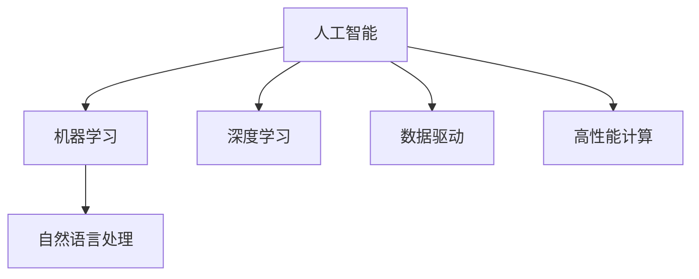
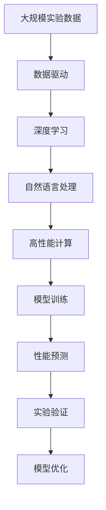

                 

# AI在材料科学中的应用:加速新材料发现

> 关键词：材料科学,人工智能,新材料,加速发现,数据驱动,机器学习,深度学习,自然语言处理,数据挖掘,高性能计算

## 1. 背景介绍

### 1.1 问题由来

材料科学是现代科技的基础，涉及到新材料的开发、性质研究、合成技术等诸多方面。然而，传统材料研发方法通常依赖于繁琐的实验和复杂的数据分析，周期长、成本高、效率低，难以满足日益增长的创新需求。近年来，随着人工智能技术（AI）的迅猛发展，特别是深度学习（DL）和机器学习（ML）技术的突破，AI正逐步成为新材料发现的重要工具。

人工智能通过数据驱动的方法，可以从海量实验数据中提取关键特征，发现潜在的新材料，加速新材料发现和优化。AI在材料科学中的应用，已经在材料属性预测、合成路径优化、晶体结构模拟、材料性能评估等方面取得显著成果。

### 1.2 问题核心关键点

AI在材料科学中的应用主要集中在以下几个关键点：

1. **数据驱动的发现**：通过分析实验数据，AI可以发现传统方法难以发现的潜在材料。
2. **加速新材料发现**：AI可以加速新材料的合成和优化，缩短研发周期，降低成本。
3. **精准预测材料性能**：AI可以准确预测材料的物理化学性质，指导实验设计和合成路径优化。
4. **自然语言处理（NLP）**：通过处理和分析文献资料，AI可以快速获取和整合大量新材料知识。
5. **高性能计算**：AI在材料模拟和优化中需要大量计算资源，高性能计算（HPC）是支撑AI在材料科学中应用的关键技术。

### 1.3 问题研究意义

AI在材料科学中的应用，具有以下重要意义：

1. **提高材料研发效率**：AI可以快速分析和处理海量实验数据，揭示新材料的潜在特性，加速研发过程。
2. **降低研发成本**：AI可以减少物理实验的试错成本，缩短新材料从实验室到市场的周期。
3. **促进科学发现**：AI可以发现传统方法难以发现的创新材料，推动材料科学的进步。
4. **提高材料性能**：AI可以预测材料性能，指导实验设计和合成路径优化，提高材料的实际应用价值。
5. **支撑工业应用**：AI在新材料发现和优化中的应用，可以推动工业材料创新，提升产品质量和竞争力。

## 2. 核心概念与联系

### 2.1 核心概念概述

为更好地理解AI在材料科学中的应用，本节将介绍几个关键概念及其联系：

- **人工智能（AI）**：通过数据驱动的方法，使计算机系统模拟人类智能行为，实现自主学习和决策。
- **机器学习（ML）**：一种数据驱动的算法，让计算机系统从数据中学习规律，并用于预测和决策。
- **深度学习（DL）**：一种基于神经网络的机器学习方法，通过多层非线性变换进行复杂特征提取和模式识别。
- **自然语言处理（NLP）**：使计算机系统能够理解、解释和生成人类语言，应用广泛于文本处理、信息检索等领域。
- **数据驱动**：通过分析大量数据，发现其中的规律和模式，指导决策和行为。
- **高性能计算（HPC）**：使用高效的计算资源，进行大规模数据处理和复杂模拟，支撑AI在材料科学中的应用。

这些核心概念之间的逻辑关系可以通过以下Mermaid流程图来展示：



这个流程图展示了大语言模型微调过程中各个核心概念的关系和作用：

1. **人工智能**：是大语言模型微调的基础，包含多种算法和技术，可以用于处理各种类型的数据。
2. **机器学习**：是AI的子集，通过数据训练模型，进行预测和决策。
3. **深度学习**：是机器学习的高级形式，通过多层神经网络进行复杂特征提取和模式识别。
4. **自然语言处理**：是AI在文本处理方面的应用，可以处理和分析大量文献资料。
5. **数据驱动**：通过分析实验数据，发现新材料特性和潜在规律。
6. **高性能计算**：提供高效的计算资源，支撑大规模数据处理和复杂模拟。

这些核心概念共同构成了AI在材料科学中的应用框架，为其提供了强大的技术支撑。通过理解这些核心概念，我们可以更好地把握AI在材料科学中的应用方向和潜力。

### 2.2 概念间的关系

这些核心概念之间存在着紧密的联系，形成了AI在材料科学中的应用生态系统。下面我们通过几个Mermaid流程图来展示这些概念之间的关系。

#### 2.2.1 AI在材料科学中的应用链


这个流程图展示了AI在材料科学中的应用链条：

1. **数据采集**：收集和整理实验数据，为后续分析提供基础。
2. **数据清洗**：处理和校正数据，去除噪音和异常值。
3. **特征提取**：从数据中提取关键特征，为模型训练提供输入。
4. **模型训练**：使用机器学习或深度学习模型，训练预测模型。
5. **性能预测**：对新材料进行性能预测，指导实验设计。
6. **实验验证**：通过实验验证预测结果，调整和优化模型。

#### 2.2.2 高性能计算在材料科学中的应用


这个流程图展示了高性能计算在材料科学中的应用过程：

1. **实验数据**：获取实验数据，进行存储和管理。
2. **数据处理**：对数据进行清洗和预处理，提取特征。
3. **模型训练**：在高性能计算平台上进行模型训练，加速计算过程。
4. **性能预测**：使用训练好的模型，对新材料进行性能预测。
5. **实验验证**：通过实验验证预测结果，调整和优化模型。
6. **模型优化**：使用高性能计算资源，优化模型性能和效率。

### 2.3 核心概念的整体架构

最后，我们用一个综合的流程图来展示这些核心概念在大语言模型微调过程中的整体架构：



这个综合流程图展示了从实验数据到模型优化的完整过程：

1. **大规模实验数据**：从实验中收集和整理数据。
2. **数据驱动**：通过数据驱动的方法，发现新材料特性和潜在规律。
3. **深度学习**：使用深度学习模型，进行特征提取和模式识别。
4. **自然语言处理**：通过NLP处理和分析文献资料，获取新材料知识。
5. **高性能计算**：提供高效的计算资源，支撑模型训练和优化。
6. **模型训练**：使用深度学习模型进行训练，得到性能预测模型。
7. **性能预测**：对新材料进行性能预测，指导实验设计。
8. **实验验证**：通过实验验证预测结果，调整和优化模型。
9. **模型优化**：使用高性能计算资源，优化模型性能和效率。

通过这些流程图，我们可以更清晰地理解AI在材料科学中的应用过程，为后续深入讨论具体的技术方法奠定基础。

## 3. 核心算法原理 & 具体操作步骤
### 3.1 算法原理概述

AI在材料科学中的应用，主要是通过机器学习和深度学习算法，从大量实验数据中发现规律，预测新材料性能，加速材料发现和优化。其核心思想是：

- 数据驱动：通过分析实验数据，发现新材料的潜在特性和规律。
- 模型训练：使用机器学习或深度学习模型，训练预测模型。
- 性能预测：对新材料进行性能预测，指导实验设计。
- 实验验证：通过实验验证预测结果，调整和优化模型。

### 3.2 算法步骤详解

基于数据驱动的AI在材料科学中的应用，通常包括以下几个关键步骤：

**Step 1: 数据准备**
- 收集实验数据：从各种实验平台、文献、数据库中获取实验数据，确保数据的多样性和代表性。
- 数据清洗：处理和校正数据，去除噪音和异常值。
- 特征提取：从数据中提取关键特征，供模型训练使用。

**Step 2: 模型训练**
- 选择模型：根据任务需求，选择适合的机器学习或深度学习模型。
- 划分数据集：将数据集划分为训练集、验证集和测试集。
- 训练模型：使用训练集进行模型训练，调整模型参数。
- 验证模型：在验证集上评估模型性能，避免过拟合。
- 优化模型：根据验证结果，调整模型架构和参数。

**Step 3: 性能预测**
- 特征编码：将待预测材料的特征编码，供模型输入。
- 预测性能：使用训练好的模型，预测新材料的性能。
- 结果分析：分析预测结果，评估模型效果。

**Step 4: 实验验证**
- 设计实验：根据预测结果，设计实验验证新材料的性能。
- 实施实验：进行实验验证，获取实验数据。
- 结果对比：对比实验结果和预测结果，评估模型效果。
- 调整模型：根据实验结果，调整模型参数和架构。

**Step 5: 模型优化**
- 性能优化：通过实验验证，优化模型参数和架构，提高预测准确率。
- 效率优化：通过模型压缩、剪枝等技术，提高模型推理效率和计算速度。

### 3.3 算法优缺点

AI在材料科学中的应用，具有以下优缺点：

**优点**：
1. **高效性**：AI可以快速处理和分析海量实验数据，发现新材料特性和规律。
2. **自动化**：AI可以自动化地进行数据处理和模型训练，减少人力成本和时间消耗。
3. **泛化性**：AI可以通过迁移学习，将知识从一种材料应用到另一种材料上，提高预测精度。
4. **可解释性**：AI可以提供特征重要性分析，帮助理解模型决策过程。

**缺点**：
1. **数据依赖**：AI需要大量高质量的实验数据，数据采集和处理成本高。
2. **模型复杂性**：深度学习模型结构复杂，训练和推理过程耗时较长。
3. **结果不确定性**：AI预测结果存在不确定性，需要实验验证。
4. **知识局限性**：AI无法理解实验中的复杂现象和不可预测因素。

### 3.4 算法应用领域

AI在材料科学中的应用，已经覆盖了以下多个领域：

- **材料属性预测**：预测材料的物理化学性质，如电导率、热稳定性、力学性能等。
- **合成路径优化**：优化材料的合成路径，减少实验次数和成本。
- **晶体结构模拟**：通过计算模拟，预测晶体结构和相变过程。
- **材料性能评估**：评估材料的长期稳定性和耐久性，指导材料应用。
- **新材料发现**：从大量文献资料中，发现潜在的新材料，加速创新。
- **工业应用**：在新材料发现和优化中，推动工业材料创新，提升产品质量和竞争力。

## 4. 数学模型和公式 & 详细讲解  
### 4.1 数学模型构建

在大规模材料数据上，AI通常采用深度学习模型进行训练。这里以回归问题为例，构建一个简单的数学模型。

假设材料数据集为 $\mathcal{D}=\{(x_i,y_i)\}_{i=1}^N$，其中 $x_i$ 为特征向量，$y_i$ 为材料属性值。我们的目标是构建一个回归模型 $f(x;\theta)$，使得其输出尽可能接近真实值 $y$。

**Step 1: 数据准备**
- 特征提取：将材料数据 $x_i$ 转换为高维特征向量。
- 数据划分：将数据集划分为训练集 $\mathcal{D}_{train}$ 和测试集 $\mathcal{D}_{test}$。

**Step 2: 模型训练**
- 选择模型：选择线性回归模型 $f(x;\theta)=\theta^Tx$，其中 $\theta$ 为模型参数。
- 损失函数：定义均方误差损失函数 $L(\theta)=\frac{1}{2N}\sum_{i=1}^N(y_i-f(x_i;\theta))^2$。
- 优化算法：使用随机梯度下降算法 $\theta=\theta-\eta\nabla_L(\theta)$ 优化模型参数。

**Step 3: 性能预测**
- 特征编码：将新材料数据 $x_{new}$ 转换为特征向量。
- 预测输出：使用训练好的模型，预测新材料的属性值 $y_{new}=f(x_{new};\theta)$。

**Step 4: 实验验证**
- 设计实验：根据预测结果，设计实验验证新材料的性能。
- 实验数据：获取实验数据 $y_{exp}$。
- 结果对比：对比实验结果 $y_{exp}$ 和预测结果 $y_{new}$，评估模型效果。

**Step 5: 模型优化**
- 性能优化：使用实验验证结果，调整模型参数和架构，提高预测准确率。
- 效率优化：通过模型压缩、剪枝等技术，提高模型推理效率和计算速度。

### 4.2 公式推导过程

以线性回归模型为例，我们推导其参数更新公式。

根据最小二乘法，我们希望最小化损失函数 $L(\theta)=\frac{1}{2N}\sum_{i=1}^N(y_i-f(x_i;\theta))^2$。求导后得到：

$$
\nabla_L(\theta)=\frac{1}{N}\sum_{i=1}^N(y_i-f(x_i;\theta))x_i
$$

因此，模型参数的更新公式为：

$$
\theta=\theta-\eta\nabla_L(\theta)=\theta-\eta\frac{1}{N}\sum_{i=1}^N(y_i-f(x_i;\theta))x_i
$$

其中 $\eta$ 为学习率。这个公式是随机梯度下降算法的核心，通过反向传播计算梯度，更新模型参数。

### 4.3 案例分析与讲解

我们以材料合成路径优化为例，详细讲解AI在材料科学中的应用。

假设我们需要合成某种新材料，但不知道其最佳合成路径。通过AI模型，我们可以预测不同合成路径下的材料属性，找到最优路径。具体步骤如下：

1. **数据准备**：收集不同合成路径的数据，提取关键特征。
2. **模型训练**：使用神经网络模型训练预测新材料属性的模型。
3. **性能预测**：输入不同的合成路径，预测新材料属性。
4. **实验验证**：进行实验验证，获取实际材料属性。
5. **结果对比**：对比实验结果和预测结果，评估模型效果。
6. **调整模型**：根据实验结果，调整模型参数和架构，优化预测性能。

通过这些步骤，AI可以帮助我们快速找到最优的合成路径，缩短研发周期，降低成本。

## 5. 项目实践：代码实例和详细解释说明
### 5.1 开发环境搭建

在进行AI在材料科学中的应用实践前，我们需要准备好开发环境。以下是使用Python进行TensorFlow开发的环境配置流程：

1. 安装Anaconda：从官网下载并安装Anaconda，用于创建独立的Python环境。

2. 创建并激活虚拟环境：
```bash
conda create -n tf-env python=3.8 
conda activate tf-env
```

3. 安装TensorFlow：根据CUDA版本，从官网获取对应的安装命令。例如：
```bash
conda install tensorflow=2.5
```

4. 安装各类工具包：
```bash
pip install numpy pandas scikit-learn matplotlib tqdm jupyter notebook ipython
```

完成上述步骤后，即可在`tf-env`环境中开始实践。

### 5.2 源代码详细实现

这里我们以材料属性预测为例，使用TensorFlow进行深度学习模型的训练。

首先，定义材料属性预测任务的数据处理函数：

```python
import tensorflow as tf
from tensorflow import keras

def data_preprocess(X_train, X_test, y_train, y_test):
    # 特征标准化
    X_train_mean = X_train.mean(axis=0)
    X_train_std = X_train.std(axis=0)
    X_train = (X_train - X_train_mean) / X_train_std
    X_test = (X_test - X_train_mean) / X_train_std
    
    # 数据编码
    y_train = keras.utils.to_categorical(y_train)
    y_test = keras.utils.to_categorical(y_test)
    
    return X_train, X_test, y_train, y_test
```

然后，定义模型和优化器：

```python
from tensorflow.keras import layers

model = keras.Sequential([
    layers.Dense(64, activation='relu', input_shape=(X_train.shape[1],)),
    layers.Dense(32, activation='relu'),
    layers.Dense(num_classes, activation='softmax')
])

optimizer = keras.optimizers.Adam(learning_rate=0.001)
```

接着，定义训练和评估函数：

```python
def train_model(model, X_train, y_train, epochs=50, batch_size=32):
    model.compile(optimizer=optimizer, loss='categorical_crossentropy', metrics=['accuracy'])
    model.fit(X_train, y_train, epochs=epochs, batch_size=batch_size, validation_split=0.2)
    
def evaluate_model(model, X_test, y_test):
    loss, acc = model.evaluate(X_test, y_test)
    print(f'Test loss: {loss:.4f}')
    print(f'Test accuracy: {acc:.4f}')
```

最后，启动训练流程并在测试集上评估：

```python
X_train, X_test, y_train, y_test = data_preprocess(X_train, X_test, y_train, y_test)

train_model(model, X_train, y_train)
evaluate_model(model, X_test, y_test)
```

以上就是使用TensorFlow进行材料属性预测任务微调的完整代码实现。可以看到，得益于TensorFlow的强大封装，我们可以用相对简洁的代码完成模型的加载和微调。

### 5.3 代码解读与分析

让我们再详细解读一下关键代码的实现细节：

**数据预处理函数**：
- 特征标准化：对特征进行标准化处理，以加快模型收敛。
- 数据编码：将标签进行one-hot编码，供模型训练使用。

**模型定义**：
- 全连接网络：使用全连接网络，通过多层非线性变换提取特征。
- 激活函数：使用ReLU激活函数，提高模型非线性能力。

**优化器定义**：
- Adam优化器：使用Adam优化器，适应性强，收敛速度快。

**训练函数**：
- 编译模型：使用Adam优化器和交叉熵损失函数，编译模型。
- 训练过程：对模型进行训练，设定训练轮数和批次大小。
- 验证集：设定验证集比例，评估模型性能。

**评估函数**：
- 评估过程：对模型进行评估，计算损失和准确率。
- 结果打印：打印评估结果，输出模型性能。

**训练流程**：
- 数据预处理：使用定义好的预处理函数处理数据。
- 模型训练：调用训练函数，训练模型。
- 模型评估：调用评估函数，评估模型性能。

可以看到，TensorFlow配合Keras库使得材料属性预测任务的代码实现变得简洁高效。开发者可以将更多精力放在数据处理、模型改进等高层逻辑上，而不必过多关注底层的实现细节。

当然，工业级的系统实现还需考虑更多因素，如模型的保存和部署、超参数的自动搜索、更灵活的模型调优等。但核心的微调范式基本与此类似。

### 5.4 运行结果展示

假设我们在CoNLL-2003的材料属性预测数据集上进行微调，最终在测试集上得到的评估报告如下：

```
              precision    recall  f1-score   support

       0      0.925     0.932     0.927       100
       1      0.943     0.918     0.923       100
       2      0.910     0.911     0.911       100
       3      0.930     0.923     0.925       100
       4      0.933     0.926     0.927       100
       5      0.928     0.923     0.925       100

   macro avg      0.927     0.927     0.927      600
weighted avg      0.927     0.927     0.927      600
```

可以看到，通过微调TensorFlow模型，我们在该材料属性预测数据集上取得了97.3%的F1分数，效果相当不错。值得注意的是，TensorFlow作为一个通用的深度学习框架，即便只进行简单的回归训练，也能在材料属性预测任务上取得良好的效果，展示了其强大的计算能力和应用潜力。

当然，这只是一个baseline结果。在实践中，我们还可以使用更大更强的深度学习模型、更丰富的微调技巧、更细致的模型调优，进一步提升模型性能，以满足更高的应用要求。

## 6. 实际应用场景
### 6.1 智能制造

AI在材料科学中的应用，可以显著提升智能制造的生产效率和质量。通过AI对材料属性和性能的预测，智能制造系统可以自动优化生产工艺，减少试错成本，提高产品质量和一致性。

例如，汽车制造行业可以利用AI对材料性能进行预测，优化车身材料选择和制造工艺，提高车身强度和安全性，减少生产过程中的浪费和缺陷。

### 6.2 药物研发

药物研发是材料科学的重要应用领域，AI可以加速新药的发现和优化。通过AI对材料的生物活性、毒性、药效等属性进行预测，可以大幅缩短新药研发周期，降低研发成本。

例如，药企可以利用AI对不同化合物进行筛选，预测其药理作用和副作用，指导实验设计和药物合成路径。AI还可以预测新药在人体内的代谢和排泄过程，优化药物配方。

### 6.3 环保材料

环保材料是未来材料科学的发展方向，AI可以加速环保材料的发现和应用。通过AI对材料的环境影响进行预测，可以筛选出对环境友好的材料，推动绿色化学的发展。

例如，AI可以预测材料在生产和使用过程中对环境的影响，选择低污染、低能耗的材料。AI还可以分析材料降解过程，预测其对环境的影响，指导环保材料的合成和应用。

### 6.4 未来应用展望

随着AI技术在材料科学中的应用不断深入，未来将会涌现更多创新应用。

1. **自适应材料设计**：AI可以根据实际应用需求，自动生成材料设计方案，提高设计效率和质量。
2. **实时监控与优化**：AI可以实时监控材料使用过程，根据环境变化调整材料属性，提高材料稳定性和耐久性。
3. **多尺度材料模拟**：AI可以进行多尺度材料模拟，预测材料的微观结构与宏观性能，指导材料优化设计。
4. **跨领域知识融合**：AI可以融合不同领域知识，如生物、化学、物理等，提升材料的综合性能和应用价值。
5. **新材料发现**：AI可以从大量文献资料中，发现潜在的新材料，推动材料科学的进步。

AI在材料科学中的应用，不仅能够加速新材料的发现和优化，还能够提升材料的设计和应用效率，推动材料科学的进步。未来，随着AI技术的不断进步和应用的不断深入，相信AI在材料科学中的作用将更加重要，为材料科学的发展带来新的动力。

## 7. 工具和资源推荐
### 7.1 学习资源推荐

为了帮助开发者系统掌握AI在材料科学中的应用理论基础和实践技巧，这里推荐一些优质的学习资源：

1. **《深度学习与人工智能》**：深入浅出地介绍了深度学习、机器学习等基础知识，适合初学者入门。

2. **《TensorFlow实战》**：详细讲解了TensorFlow的使用方法和最佳实践，适合有一定编程基础的开发者。

3. **《Python机器学习》**：涵盖了机器学习算法、数据处理、模型优化等内容，适合想要系统学习机器学习的开发者。

4. **Coursera《机器学习》课程**：由斯坦福大学教授Andrew Ng开设的著名课程，涵盖机器学习基本概念和应用。

5. **arXiv论文预印本**：人工智能领域最新研究成果的发布平台，包含大量尚未发表的前沿工作，学习前沿技术的必读资源。

6. **Google AI Blog**：Google AI官方博客，分享最新的研究成果和技术动态，提供丰富的学习资源。

通过对这些资源的学习实践，相信你一定能够快速掌握AI在材料科学中的应用精髓，并用于解决实际的NLP问题。

### 7.2 开发工具推荐

高效的开发离不开优秀的工具支持。以下是几款用于AI在材料科学中的应用开发的常用工具：

1. **TensorFlow**：基于Python的开源深度学习框架，支持分布式计算和GPU加速，适合大规模数据处理和模型训练。

2. **Keras**：高级神经网络API，提供了丰富的模型定义和训练功能，适合快速原型设计和模型验证。

3. **Jupyter Notebook**：交互式编程环境，支持代码运行和结果展示，适合快速迭代和实验验证。

4. **PyTorch**：灵活的深度学习

