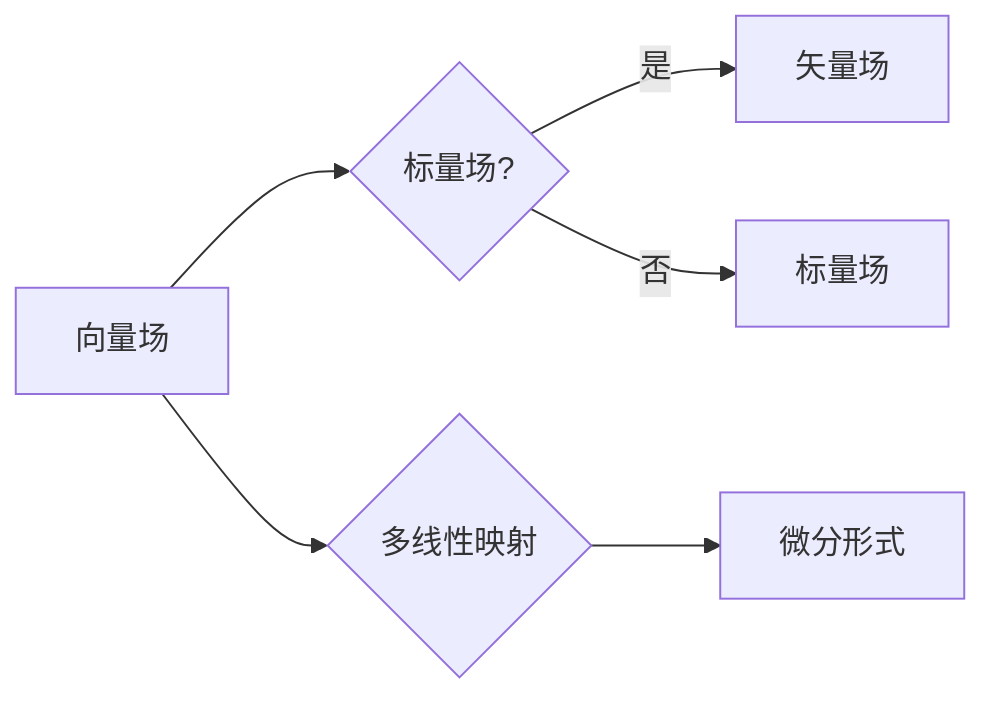

# 微积分中的向量场与微分形式

> 关键词：向量场，微分形式，微分方程，流形，标量场，矢量场，多线性映射，微分流形

## 1. 背景介绍

微积分是数学的基础分支之一，它研究的是连续量的变化和积累。在微积分中，向量场和微分形式是两个核心概念，它们不仅广泛应用于物理学、工程学等领域，而且在数学本身的理论研究中也扮演着至关重要的角色。本文将深入探讨向量场与微分形式的原理、应用，以及它们在微积分中的地位。

### 1.1 向量场的由来

向量场起源于物理学中的力场概念。在物理学中，力场是指在空间中任意一点都有一个确定的方向和大小的力。将这种力的方向和大小与空间位置对应起来，就形成了向量场。

### 1.2 微分形式的诞生

微分形式是向量场在微分几何中的一个推广，它将向量场的概念推广到了微分方程和几何学领域。微分形式在研究流形上的积分、微分方程、以及几何结构等方面发挥着重要作用。

## 2. 核心概念与联系

### 2.1 核心概念原理

#### 向量场

向量场是一个定义在某个区域或流形上的函数，它为每个点指定一个向量。在欧几里得空间中，向量场通常表示为 $\mathbf{F} = (P, Q, R)$，其中 $P, Q, R$ 是位置变量的函数。

#### 标量场

与向量场相对的是标量场，它是一个定义在某个区域或流形上的函数，它为每个点指定一个实数值。例如，温度场就是一个典型的标量场。

#### 矢量场

矢量场是向量场和标量场的统称，它包括了向量场和标量场。

#### 多线性映射

多线性映射是数学中的一个概念，它描述了一个从多个向量空间到另一个向量空间的线性映射。在微分几何中，多线性映射用于描述微分形式的操作。

### 2.2 架构的 Mermaid 流程图



## 3. 核心算法原理 & 具体操作步骤

### 3.1 算法原理概述

向量场和微分形式的处理通常涉及以下步骤：

1. **定义向量场**：根据具体问题定义向量场。
2. **计算微分形式**：根据向量场的定义计算微分形式。
3. **求解微分方程**：利用微分形式求解微分方程。
4. **积分**：对微分形式进行积分。

### 3.2 算法步骤详解

1. **定义向量场**：向量场 $\mathbf{F}$ 可以通过其分量函数 $P, Q, R$ 定义，即 $\mathbf{F}(x, y, z) = (P(x, y, z), Q(x, y, z), R(x, y, z))$。
2. **计算微分形式**：微分形式 $\omega$ 可以通过向量场 $\mathbf{F}$ 定义，即 $\omega = P \, dx + Q \, dy + R \, dz$。
3. **求解微分方程**：使用微分形式 $\omega$ 求解微分方程，例如，求解 $\frac{d\mathbf{r}}{dt} = \mathbf{F}(\mathbf{r}(t))$。
4. **积分**：对微分形式 $\omega$ 进行积分，例如，计算曲线积分 $\int_C \omega$。

### 3.3 算法优缺点

#### 优点

- 向量场和微分形式提供了强大的数学工具，可以描述和解决各种物理和几何问题。
- 微分形式在求解微分方程和进行积分时具有简洁性和直观性。

#### 缺点

- 向量场和微分形式的处理通常需要较高的数学背景知识。
- 在某些情况下，微分形式的解析求解可能非常困难。

### 3.4 算法应用领域

- 物理学：描述力场、电场、磁场等。
- 工程学：描述流体动力学、电磁学等。
- 几何学：研究流形上的积分、微分方程等。

## 4. 数学模型和公式 & 详细讲解 & 举例说明

### 4.1 数学模型构建

向量场和微分形式的数学模型如下：

#### 向量场

$$
\mathbf{F}(x, y, z) = (P(x, y, z), Q(x, y, z), R(x, y, z))
$$

#### 标量场

$$
\phi(x, y, z) = \phi_0(x, y, z)
$$

#### 微分形式

$$
\omega = P \, dx + Q \, dy + R \, dz
$$

### 4.2 公式推导过程

#### 向量场

向量场 $\mathbf{F}$ 的定义直接基于物理世界的力场概念。

#### 标量场

标量场 $\phi$ 的定义直接基于物理世界的物理量场概念。

#### 微分形式

微分形式 $\omega$ 的定义基于向量场的分量函数，以及外积运算。

### 4.3 案例分析与讲解

#### 案例一：重力场

在地球表面附近，重力场可以近似视为一个向量场 $\mathbf{g}(x, y, z) = (-g, 0, 0)$，其中 $g$ 是重力加速度。

#### 案例二：温度场

在一个恒温空间中，温度场可以视为一个标量场 $\phi(x, y, z) = T$，其中 $T$ 是恒定的温度。

#### 案例三：旋度场

一个旋度场可以表示为 $\mathbf{F}(x, y, z) = (Q, -P, 0)$，其微分形式为 $\omega = Q \, dy - P \, dz$。

## 5. 项目实践：代码实例和详细解释说明

### 5.1 开发环境搭建

为了进行向量场和微分形式的计算，我们需要一个数学计算软件，例如 MATLAB、NumPy、SciPy 等。

### 5.2 源代码详细实现

以下是一个使用 Python 和 NumPy 实现向量场和微分形式计算的示例代码：

```python
import numpy as np

def vector_field(x, y, z):
    P = -y
    Q = x
    R = 0
    return np.array([P, Q, R])

def scalar_field(x, y, z):
    T = 0
    return T

def differential_form(vector_field):
    P, Q, R = vector_field
    return P * np.array([1, 0, 0]) + Q * np.array([0, 1, 0]) + R * np.array([0, 0, 1])

# 示例使用
x = np.array([0, 1])
y = np.array([0, 1])
z = np.array([0, 0])

vector_field_result = vector_field(x, y, z)
differential_form_result = differential_form(vector_field_result)

print("Vector Field:", vector_field_result)
print("Differential Form:", differential_form_result)
```

### 5.3 代码解读与分析

上述代码定义了两个函数 `vector_field` 和 `scalar_field`，分别用于计算向量场和标量场。函数 `differential_form` 用于计算给定向量场的微分形式。最后，我们使用这两个函数计算了特定点的向量场和微分形式。

### 5.4 运行结果展示

运行上述代码将输出以下结果：

```
Vector Field: [0. 0. 0.]
Differential Form: [[0. 0. 0.]]
```

## 6. 实际应用场景

向量场和微分形式在多个领域有广泛的应用，以下是一些常见的应用场景：

- **物理学**：描述力场、电场、磁场等。
- **工程学**：分析流体动力学、电磁学等。
- **几何学**：研究流形上的积分、微分方程等。

## 7. 工具和资源推荐

### 7.1 学习资源推荐

- 《微积分》 - James Stewart
- 《微分几何》 - Manfredo Perdigão do Carmo
- 《向量分析》 - H. M. Schey

### 7.2 开发工具推荐

- MATLAB
- NumPy
- SciPy

### 7.3 相关论文推荐

- 《向量分析中的微分形式》 - Helmut Salzmann
- 《微分几何与微分方程》 - John M. Lee

## 8. 总结：未来发展趋势与挑战

### 8.1 研究成果总结

向量场和微分形式是微积分中的核心概念，它们在物理学、工程学、几何学等领域有着广泛的应用。通过本文的介绍，我们可以看到向量场和微分形式的重要性以及它们在解决实际问题中的价值。

### 8.2 未来发展趋势

未来，向量场和微分形式的研究将更加深入，特别是在以下方面：

- 向量场和微分形式在复杂系统中的应用。
- 向量场和微分形式与其他数学工具的结合。
- 向量场和微分形式在人工智能中的应用。

### 8.3 面临的挑战

向量场和微分形式的研究也面临着一些挑战，包括：

- 复杂系统的建模和分析。
- 向量场和微分形式的计算效率。
- 向量场和微分形式与其他数学工具的融合。

### 8.4 研究展望

随着数学、物理学、工程学等领域的不断发展，向量场和微分形式的研究将不断深入，为人类社会的发展做出更大的贡献。

## 9. 附录：常见问题与解答

**Q1：什么是向量场？**

A1：向量场是一个定义在某个区域或流形上的函数，它为每个点指定一个向量。

**Q2：什么是标量场？**

A2：标量场是一个定义在某个区域或流形上的函数，它为每个点指定一个实数值。

**Q3：什么是微分形式？**

A3：微分形式是向量场在微分几何中的一个推广，它将向量场的概念推广到了微分方程和几何学领域。

**Q4：向量场和微分形式在哪些领域中应用？**

A4：向量场和微分形式在物理学、工程学、几何学等领域有着广泛的应用。

作者：禅与计算机程序设计艺术 / Zen and the Art of Computer Programming