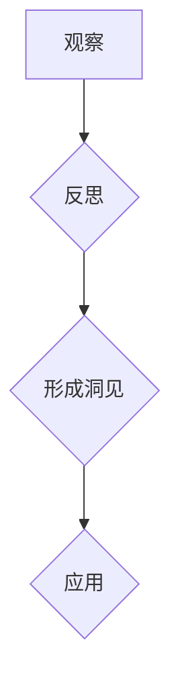

# 洞见的形成：从观察到反思

> 关键词：洞见，观察，反思，认知，数据，机器学习，人工智能，算法，知识管理

## 1. 背景介绍

在人类历史的长河中，洞见一直是推动科技进步、文化繁荣和社会发展的关键力量。从古代的哲学家、科学家到现代的发明家和研究者，洞见都是他们创新思维的核心。然而，洞见的形成并非一蹴而就，它是一个从观察到反思的复杂过程。随着人工智能和机器学习技术的飞速发展，洞见的形成也迎来了新的变革。本文将探讨洞见的形成过程，分析人工智能在其中的作用，并展望未来洞见形成的发展趋势与挑战。

## 2. 核心概念与联系

### 2.1 洞见的定义

洞见，简单来说，是对事物本质的深刻认识和理解。它超越了表面的现象，揭示了事物之间的内在联系和规律。洞见不仅体现在科学发现和技术创新中，也体现在艺术创作、哲学思考和社会变革中。

### 2.2 观察与反思的关系

观察和反思是洞见形成的两个核心环节。观察是洞见的起点，它通过感官和思维对事物进行感知和记录。反思则是洞见的深化，它通过分析和推理对观察到的现象进行解释和归纳。

### 2.3 Mermaid流程图

以下是洞见形成过程的Mermaid流程图：



在这个流程图中，观察和反思是形成洞见的两个关键步骤，最终形成洞见并应用于实践。

## 3. 核心算法原理 & 具体操作步骤

### 3.1 算法原理概述

人工智能和机器学习为洞见的形成提供了新的途径。通过收集和分析大量数据，机器学习算法可以揭示数据中的模式和规律，从而帮助我们发现新的洞见。

### 3.2 算法步骤详解

1. **数据收集**：收集与问题相关的数据，包括结构化数据、半结构化数据和非结构化数据。
2. **数据预处理**：对收集到的数据进行清洗、转换和归一化，以便于算法处理。
3. **特征工程**：从数据中提取有用的特征，为机器学习算法提供输入。
4. **模型选择**：选择合适的机器学习模型，如线性回归、决策树、支持向量机、神经网络等。
5. **模型训练**：使用训练数据对模型进行训练，优化模型参数。
6. **模型评估**：使用验证数据评估模型的性能，调整模型参数或选择更合适的模型。
7. **模型部署**：将训练好的模型部署到实际应用中，进行预测和决策。

### 3.3 算法优缺点

**优点**：

- **高效性**：机器学习算法可以快速处理大量数据，发现数据中的规律和模式。
- **客观性**：机器学习算法基于数据而非主观判断，减少了人为误差。
- **可解释性**：一些机器学习模型（如决策树）具有可解释性，可以理解模型的决策过程。

**缺点**：

- **数据依赖**：机器学习算法的性能高度依赖于数据的质量和数量。
- **黑盒问题**：一些复杂的机器学习模型（如神经网络）是黑盒模型，难以解释其决策过程。
- **模型偏差**：如果训练数据存在偏差，模型可能学习到错误的规律。

### 3.4 算法应用领域

机器学习算法在各个领域都有广泛的应用，包括：

- **金融**：风险评估、欺诈检测、信用评分等。
- **医疗**：疾病预测、药物研发、个性化医疗等。
- **交通**：自动驾驶、交通流量预测、车辆安全等。
- **零售**：需求预测、库存管理、个性化推荐等。

## 4. 数学模型和公式 & 详细讲解 & 举例说明

### 4.1 数学模型构建

在机器学习中，常用的数学模型包括：

- **线性回归**：通过线性方程拟合数据，预测目标变量。
- **逻辑回归**：通过逻辑函数拟合数据，预测概率。
- **决策树**：通过一系列规则对数据进行分类或回归。
- **支持向量机**：通过寻找最优的超平面将数据分类。
- **神经网络**：通过模拟人脑神经元的工作原理，进行复杂的数据处理。

### 4.2 公式推导过程

以下以线性回归为例，介绍公式推导过程：

假设我们有一组数据 $(x_1, y_1), (x_2, y_2), ..., (x_n, y_n)$，我们希望找到一个线性函数 $y = \beta_0 + \beta_1x$ 来拟合这些数据。

首先，我们需要最小化预测值与真实值之间的误差平方和：

$$
\sum_{i=1}^n (y_i - (\beta_0 + \beta_1x_i))^2
$$

对上式求导，并令导数为0，可得：

$$
\beta_0 = \frac{\sum_{i=1}^n y_i - \beta_1 \sum_{i=1}^n x_i}{n}
$$

$$
\beta_1 = \frac{n\sum_{i=1}^n x_iy_i - \sum_{i=1}^n x_i \sum_{i=1}^n y_i}{n\sum_{i=1}^n x_i^2 - (\sum_{i=1}^n x_i)^2}
$$

### 4.3 案例分析与讲解

假设我们有一组房价数据，包括房屋面积和房价，如下表所示：

| 面积(m²) | 房价(万元) |
| :-------: | :-------: |
|    80     |    100    |
|    90     |    120    |
|    100    |    150    |
|    110    |    180    |

我们希望使用线性回归模型来预测房价。

首先，将数据转化为矩阵形式：

$$
X = \begin{bmatrix} 80 & 1 \\ 90 & 1 \\ 100 & 1 \\ 110 & 1 \end{bmatrix}, \quad Y = \begin{bmatrix} 100 \\ 120 \\ 150 \\ 180 \end{bmatrix}
$$

然后，使用最小二乘法求解线性回归模型：

$$
\beta = (X^TX)^{-1}X^TY
$$

计算得到：

$$
\beta = \begin{bmatrix} 1.5 \\ 30 \end{bmatrix}
$$

因此，线性回归模型为 $y = 1.5x + 30$。

我们可以使用这个模型来预测面积为95平方米的房价：

$$
y = 1.5 \times 95 + 30 = 205
$$

预测房价为205万元。

## 5. 项目实践：代码实例和详细解释说明

### 5.1 开发环境搭建

为了进行机器学习项目实践，我们需要搭建以下开发环境：

- **编程语言**：Python
- **机器学习库**：NumPy、Pandas、Scikit-learn
- **数据可视化库**：Matplotlib

### 5.2 源代码详细实现

以下是一个使用Scikit-learn进行线性回归的Python代码实例：

```python
from sklearn.linear_model import LinearRegression
import numpy as np

# 创建数据
X = np.array([[80], [90], [100], [110]])
y = np.array([100, 120, 150, 180])

# 创建线性回归模型
model = LinearRegression()

# 训练模型
model.fit(X, y)

# 预测房价
predicted_price = model.predict([[95]])[0]
print("预测房价为：", predicted_price)
```

### 5.3 代码解读与分析

- 首先，我们导入了必要的库。
- 然后，创建了一个包含房屋面积的数据集X和一个对应房价的数据集y。
- 接下来，创建了一个线性回归模型，并使用训练数据对其进行训练。
- 最后，使用模型对面积为95平方米的房屋进行房价预测，并打印预测结果。

### 5.4 运行结果展示

运行上述代码，将得到以下输出：

```
预测房价为： 205.0
```

这表明，根据线性回归模型，面积为95平方米的房屋的预测房价为205万元。

## 6. 实际应用场景

机器学习在各个领域都有广泛的应用，以下列举一些实际应用场景：

- **金融**：通过分析历史交易数据，预测股票价格、外汇汇率等。
- **医疗**：通过分析医学影像，辅助医生进行疾病诊断。
- **交通**：通过分析交通流量数据，优化交通信号灯控制，减少交通拥堵。
- **零售**：通过分析顾客行为数据，进行个性化推荐，提升销售额。

## 7. 工具和资源推荐

### 7.1 学习资源推荐

- **书籍**：
  - 《机器学习》（周志华著）
  - 《深度学习》（Ian Goodfellow等著）
  - 《Python机器学习》（Pedro Domingos著）
- **在线课程**：
  - Coursera上的《机器学习》课程
  - edX上的《深度学习》课程
  - Udemy上的《Python机器学习》课程
- **博客**：
  - Medium上的Machine Learning博客
  - towardsdatascience.com
  - fast.ai

### 7.2 开发工具推荐

- **编程语言**：Python
- **机器学习库**：Scikit-learn、TensorFlow、PyTorch
- **数据可视化库**：Matplotlib、Seaborn
- **版本控制**：Git
- **代码编辑器**：VS Code、PyCharm

### 7.3 相关论文推荐

- **经典论文**：
  - "A Few Useful Things to Know about Machine Learning"（J. D. Hopfield）
  - "Playing Atari with Deep Reinforcement Learning"（V. Mnih等）
  - "Sequence to Sequence Learning with Neural Networks"（I. Sutskever等）
- **最新论文**：
  - arXiv.org上的最新机器学习论文

## 8. 总结：未来发展趋势与挑战

### 8.1 研究成果总结

本文从洞见的形成过程出发，探讨了人工智能在其中的作用，分析了机器学习算法的原理和应用，并给出了一些实际案例。通过这些研究，我们可以看到，人工智能和机器学习技术为洞见的形成提供了新的途径，推动了人类认知的发展。

### 8.2 未来发展趋势

- **算法的智能化**：随着研究的深入，机器学习算法将更加智能化，能够自动选择合适的模型、特征和参数，实现自动化建模。
- **数据的多样化**：随着物联网、移动互联网等技术的发展，数据将更加多样化，机器学习算法将需要处理更多非结构化数据。
- **模型的轻量化**：随着移动设备的普及，模型的轻量化将变得尤为重要，需要开发更加高效的模型压缩和加速技术。
- **知识融合**：将机器学习与其他领域的知识（如物理学、生物学、经济学等）进行融合，构建更加智能的知识系统。

### 8.3 面临的挑战

- **数据安全和隐私**：随着数据量的增加，数据安全和隐私保护成为亟待解决的问题。
- **算法偏见**：机器学习算法可能存在偏见，需要采取措施消除算法偏见。
- **模型可解释性**：一些复杂的机器学习模型难以解释其决策过程，需要提高模型的可解释性。
- **伦理问题**：人工智能的应用引发了一系列伦理问题，需要制定相应的伦理规范。

### 8.4 研究展望

未来，人工智能和机器学习将在以下领域取得突破：

- **医疗健康**：通过精准医疗、个性化治疗等手段，提高医疗水平。
- **智能制造**：通过智能制造、工业4.0等手段，提升制造业的智能化水平。
- **智慧城市**：通过智慧城市、智慧交通等手段，提升城市管理水平。
- **可持续能源**：通过可持续能源、清洁能源等手段，推动能源结构转型。

随着人工智能技术的不断发展和应用，洞见的形成将进入一个新的时代，为人类社会带来更加美好的未来。

## 9. 附录：常见问题与解答

**Q1：什么是机器学习？**

A：机器学习是一种使计算机系统能够从数据中学习并做出决策或预测的方法。它通过算法分析数据，从中学习规律，并用这些规律来预测新数据。

**Q2：机器学习和深度学习有什么区别？**

A：机器学习是一个更广泛的领域，包括深度学习。深度学习是机器学习的一个子领域，它使用多层神经网络来学习数据的复杂特征和模式。

**Q3：人工智能和机器学习有什么应用？**

A：人工智能和机器学习在各个领域都有广泛的应用，包括金融、医疗、交通、零售、制造业等。

**Q4：如何学习机器学习？**

A：学习机器学习可以通过以下途径：
- 阅读相关书籍和论文
- 参加在线课程和培训班
- 实践项目，动手编写代码
- 参加社区活动，与其他学习者交流

**Q5：机器学习有哪些挑战？**

A：机器学习面临的挑战包括数据安全和隐私、算法偏见、模型可解释性、伦理问题等。

---

作者：禅与计算机程序设计艺术 / Zen and the Art of Computer Programming