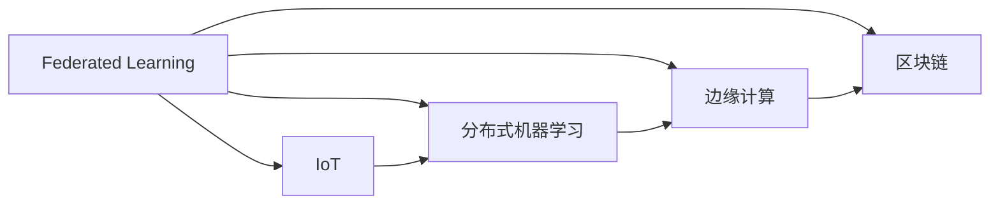
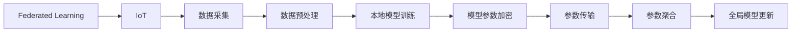
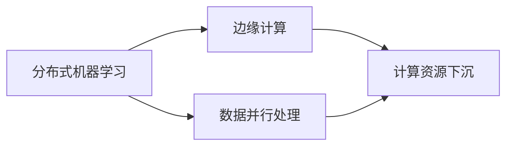
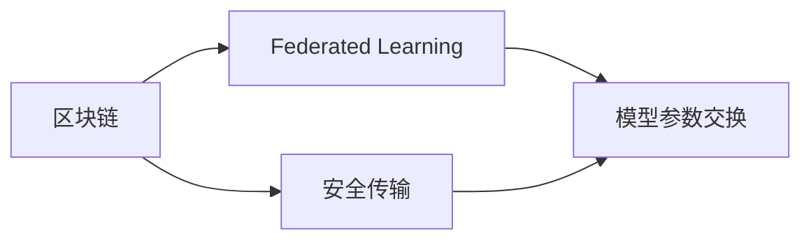
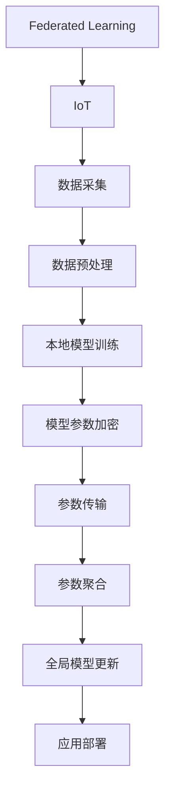

                 

## 1. 背景介绍

### 1.1 问题由来

随着物联网(IoT)技术的高速发展，设备数量呈爆炸式增长，数据产生速度越来越快，数据类型也日益丰富，从简单的温度、湿度数据到复杂的图像、语音数据无所不包。然而，物联网设备大多资源受限，无法独立完成深度学习任务。因此，如何实现对物联网数据的有效分析和利用，成为了当前学术界和工业界关注的焦点。

在此背景下，联邦学习作为一种新型的分布式机器学习范式，在物联网环境中得到了广泛应用。它允许多个设备在本地训练模型，并通过加密通信交换模型参数，从而实现对全局模型参数的更新，大大降低了对单个设备计算能力和存储资源的需求。

### 1.2 问题核心关键点

联邦学习利用多设备之间的合作，在保护用户隐私的前提下，高效地训练全局模型。其核心思想在于：

- **数据分布式存储**：物联网设备的数据存储在本地，不集中存放于单一的服务器中，避免了单点故障。
- **模型参数分散训练**：每个设备在本地使用本地数据训练模型，保护了用户隐私。
- **参数加密传输**：在模型参数更新过程中，使用加密通信技术，保证了数据的安全性。
- **全局模型聚合**：通过对各个设备的模型参数进行加权平均或差分聚合，得到全局模型更新，从而实现全局模型的提升。

联邦学习克服了传统集中式训练中存在的计算和存储资源限制问题，适用于资源受限的设备和大规模数据环境。它与物联网设备的需求高度契合，成为推动物联网数据分析和应用的重要技术手段。

### 1.3 问题研究意义

研究联邦学习在物联网环境中的应用，对于拓展物联网技术的应用范围，提升物联网数据分析的效率和精度，加速物联网技术在各个行业的产业化进程，具有重要意义：

- **降低计算资源成本**：联邦学习允许设备在本地训练模型，避免了对高性能计算设备的依赖。
- **保护用户隐私**：联邦学习通过本地训练和加密传输，保护了用户数据的隐私安全。
- **提升数据处理效率**：联邦学习实现了分布式训练和模型聚合，大大提高了数据处理速度。
- **促进技术创新**：联邦学习与其他新兴技术如区块链、边缘计算的融合，将进一步推动物联网技术的发展。
- **赋能行业升级**：联邦学习使得物联网技术更容易被各行各业所采用，为传统行业数字化转型升级提供新的技术路径。

## 2. 核心概念与联系

### 2.1 核心概念概述

为更好地理解联邦学习在物联网环境中的应用，本节将介绍几个密切相关的核心概念：

- **联邦学习(Federated Learning, FL)**：一种分布式机器学习算法，通过多个本地设备在本地数据上进行模型训练，并将模型参数定期汇总到中心服务器，更新全局模型，从而实现全局模型的提升。
- **物联网(IoT)**：将各种物品通过互联网连接起来，实现智能化、自动化、实时化的信息交换和通信，以提升效率、降低成本、提高附加值。
- **分布式机器学习**：多个计算设备通过通信网络协作进行机器学习任务，数据和模型参数分散在不同的设备上，减少了单点故障风险，提升了系统的可靠性和可扩展性。
- **边缘计算(Edge Computing)**：将数据处理和计算能力下沉到网络边缘的设备上，减少数据传输量和延迟，提升系统响应速度。
- **区块链(Blockchain)**：一种去中心化的分布式账本技术，通过密码学技术保证数据的完整性和不可篡改性，常用于联邦学习中确保模型参数的安全传输和聚合。

这些核心概念之间的逻辑关系可以通过以下Mermaid流程图来展示：



这个流程图展示了联邦学习与其他物联网相关技术之间的关系：

1. 联邦学习在物联网环境中实现了分布式训练，提升了数据处理效率和系统可靠性。
2. 分布式机器学习是联邦学习的基础，通过多设备协作训练模型。
3. 边缘计算提供了数据处理的本地化，减少了数据传输量和延迟。
4. 区块链保证了模型参数的安全传输和聚合，增强了系统的安全性。

这些核心概念共同构成了联邦学习在物联网环境中的应用框架，使其能够在不牺牲隐私安全的前提下，高效地处理大规模数据。

### 2.2 概念间的关系

这些核心概念之间存在着紧密的联系，形成了联邦学习在物联网环境中的完整生态系统。下面我通过几个Mermaid流程图来展示这些概念之间的关系。

#### 2.2.1 联邦学习在物联网中的应用



这个流程图展示了联邦学习在物联网数据处理中的应用流程：

1. 数据采集：物联网设备采集本地数据。
2. 数据预处理：对采集到的数据进行清洗、转换和归一化等处理。
3. 本地模型训练：在本地数据上训练模型，保护用户隐私。
4. 模型参数加密：使用加密算法保护模型参数的安全性。
5. 参数传输：通过加密通信将本地模型参数传输到中心服务器。
6. 参数聚合：在中心服务器上对接收到的模型参数进行加权平均或差分聚合。
7. 全局模型更新：更新全局模型参数，提升模型性能。

#### 2.2.2 分布式机器学习与边缘计算的关系



这个流程图展示了分布式机器学习与边缘计算的关系：

1. 分布式机器学习利用多设备协作进行模型训练，提升了数据处理效率。
2. 边缘计算将计算资源下沉到网络边缘的设备上，提升了系统的响应速度。
3. 分布式机器学习与边缘计算的结合，进一步增强了系统的高效性和可靠性。

#### 2.2.3 区块链在联邦学习中的应用



这个流程图展示了区块链在联邦学习中的应用：

1. 区块链保证了模型参数的安全传输。
2. 联邦学习通过多个设备的合作，实现了模型参数的交换。
3. 区块链增强了联邦学习中模型参数交换的安全性。

### 2.3 核心概念的整体架构

最后，我们用一个综合的流程图来展示这些核心概念在联邦学习在物联网环境中的整体架构：



这个综合流程图展示了联邦学习在物联网数据处理中的完整流程：

1. 数据采集：物联网设备采集本地数据。
2. 数据预处理：对采集到的数据进行清洗、转换和归一化等处理。
3. 本地模型训练：在本地数据上训练模型，保护用户隐私。
4. 模型参数加密：使用加密算法保护模型参数的安全性。
5. 参数传输：通过加密通信将本地模型参数传输到中心服务器。
6. 参数聚合：在中心服务器上对接收到的模型参数进行加权平均或差分聚合。
7. 全局模型更新：更新全局模型参数，提升模型性能。
8. 应用部署：将更新后的模型部署到物联网设备上，提供服务。

通过这些流程图，我们可以更清晰地理解联邦学习在物联网环境中的工作原理和优化方向。

## 3. 核心算法原理 & 具体操作步骤

### 3.1 算法原理概述

联邦学习的核心思想是在保护用户隐私的前提下，利用多个本地设备的数据，共同训练一个全局模型。其基本步骤如下：

1. **数据本地化**：物联网设备本地的数据进行本地化处理，保留原始数据。
2. **本地模型训练**：在本地数据上训练模型，生成本地模型参数。
3. **模型参数加密**：使用加密算法保护本地模型参数。
4. **参数传输**：将加密后的模型参数传输到中心服务器。
5. **参数聚合**：在中心服务器上对接收到的模型参数进行加权平均或差分聚合，更新全局模型参数。
6. **全局模型更新**：更新全局模型参数，并返回给本地设备，进行下一轮训练。

联邦学习利用分布式计算资源，避免了对单台高性能计算设备的依赖，适用于计算和存储资源受限的设备，如传感器、移动设备等。它能够在不泄露用户隐私的情况下，利用设备间的数据协作，提升全局模型的性能。

### 3.2 算法步骤详解

联邦学习在物联网环境中的具体步骤可以分为以下几个部分：

#### 3.2.1 数据本地化

数据本地化是联邦学习的基础步骤。物联网设备本地的数据需要进行本地化处理，保留原始数据。这一步通常包括数据清洗、转换和归一化等预处理操作。

#### 3.2.2 本地模型训练

在本地数据上训练模型，生成本地模型参数。这一步可以使用各种机器学习算法，如决策树、神经网络、SVM等。

#### 3.2.3 模型参数加密

使用加密算法保护本地模型参数，防止数据泄露。常用的加密算法包括AES、RSA等。

#### 3.2.4 参数传输

将加密后的模型参数传输到中心服务器。这一步通常使用HTTPS协议或TLS协议，确保数据传输的安全性。

#### 3.2.5 参数聚合

在中心服务器上对接收到的模型参数进行加权平均或差分聚合，更新全局模型参数。这一步是联邦学习的核心，通过多个本地模型的协作，提升了全局模型的性能。

#### 3.2.6 全局模型更新

更新全局模型参数，并返回给本地设备，进行下一轮训练。这一步通常使用梯度下降算法或其他优化算法，更新全局模型参数。

### 3.3 算法优缺点

联邦学习在物联网环境中的优点主要包括：

1. **数据分布式存储**：物联网设备的数据存储在本地，不集中存放于单一的服务器中，避免了单点故障。
2. **保护用户隐私**：联邦学习通过本地训练和加密传输，保护了用户数据的隐私安全。
3. **提升数据处理效率**：联邦学习实现了分布式训练和模型聚合，大大提高了数据处理速度。
4. **灵活性强**：联邦学习适用于各种类型的物联网设备，能够灵活处理不同类型的数据。

联邦学习的缺点主要包括：

1. **通信开销大**：频繁的模型参数传输会导致较高的通信开销。
2. **异构性问题**：不同设备间的硬件和软件异构性可能会导致模型训练的不稳定性。
3. **延迟较高**：由于模型参数需要在设备之间传输和聚合，可能会导致较高的延迟。

### 3.4 算法应用领域

联邦学习在物联网环境中的应用领域非常广泛，涵盖了以下几个方面：

- **健康医疗**：联邦学习可以实现患者健康数据的分布式分析和共享，保护患者隐私的同时提升医疗服务质量。
- **智能家居**：联邦学习可以实现智能家居设备的协同优化，提升家庭生活的智能化水平。
- **智慧城市**：联邦学习可以实现城市交通、环境监测等数据的分布式分析，提升城市管理效率。
- **工业互联网**：联邦学习可以实现工业设备的协同优化，提升工业生产效率。
- **智慧农业**：联邦学习可以实现农业数据的分布式分析和共享，提升农业生产效率。

## 4. 数学模型和公式 & 详细讲解 & 举例说明

### 4.1 数学模型构建

在联邦学习中，通常使用加权平均或差分聚合的方式来更新全局模型参数。假设全局模型参数为 $\theta$，本地模型参数为 $\theta_i$，本地数据集为 $D_i$，本地训练次数为 $T$。联邦学习的目标是通过本地模型参数 $\theta_i$ 更新全局模型参数 $\theta$，其数学模型为：

$$
\theta \leftarrow \frac{1}{N}\sum_{i=1}^N \theta_i
$$

其中，$N$ 为参与联邦学习的设备数量。

### 4.2 公式推导过程

假设全局模型参数 $\theta$ 的初始值为 $\theta_0$，本地模型参数 $\theta_i$ 的初始值为 $\theta_i^0$。在本地设备 $i$ 上训练 $T$ 次后，本地模型参数 $\theta_i$ 更新为：

$$
\theta_i^t = \theta_i^{t-1} - \eta \nabla L(\theta_i^{t-1}, D_i)
$$

其中，$\eta$ 为学习率，$L(\theta_i^{t-1}, D_i)$ 为损失函数，$\nabla L(\theta_i^{t-1}, D_i)$ 为损失函数对本地模型参数 $\theta_i^{t-1}$ 的梯度。

联邦学习通过加权平均或差分聚合的方式，将本地模型参数 $\theta_i^T$ 更新为全局模型参数 $\theta$：

$$
\theta \leftarrow \theta - \eta \sum_{i=1}^N \nabla L(\theta_i^T, D_i)
$$

其中，$\nabla L(\theta_i^T, D_i)$ 为损失函数对全局模型参数 $\theta$ 的梯度。

### 4.3 案例分析与讲解

以智能家居为例，分析联邦学习的应用。假设一个智能家居系统由多个传感器组成，每个传感器本地训练模型，用于识别用户的语音命令和行为模式。联邦学习的具体步骤如下：

1. **数据本地化**：每个传感器本地的数据进行本地化处理，保留原始数据。
2. **本地模型训练**：在本地数据上训练模型，生成本地模型参数。
3. **模型参数加密**：使用加密算法保护本地模型参数。
4. **参数传输**：将加密后的模型参数传输到中心服务器。
5. **参数聚合**：在中心服务器上对接收到的模型参数进行加权平均或差分聚合，更新全局模型参数。
6. **全局模型更新**：更新全局模型参数，并返回给本地设备，进行下一轮训练。

通过联邦学习，智能家居系统可以实现在保护用户隐私的前提下，提升全局模型性能，从而更好地识别用户的语音命令和行为模式，提升家庭生活的智能化水平。

## 5. 项目实践：代码实例和详细解释说明

### 5.1 开发环境搭建

在进行联邦学习实践前，我们需要准备好开发环境。以下是使用Python进行TensorFlow开发的环境配置流程：

1. 安装Anaconda：从官网下载并安装Anaconda，用于创建独立的Python环境。

2. 创建并激活虚拟环境：
```bash
conda create -n fl-env python=3.8 
conda activate fl-env
```

3. 安装TensorFlow：根据CUDA版本，从官网获取对应的安装命令。例如：
```bash
conda install tensorflow -c tf -c conda-forge
```

4. 安装Flare库：Flare是一个联邦学习框架，支持TensorFlow和PyTorch，用于简化联邦学习的开发。
```bash
pip install flare
```

5. 安装Flare客户端：用于本地设备训练和上传模型参数。
```bash
pip install flare-client
```

完成上述步骤后，即可在`fl-env`环境中开始联邦学习实践。

### 5.2 源代码详细实现

下面我们以医疗数据分析为例，给出使用Flare进行联邦学习的PyTorch代码实现。

首先，定义医疗数据分析任务的数据处理函数：

```python
from flare import Flare, Client
import torch
from torch.utils.data import Dataset

class MedicalDataset(Dataset):
    def __init__(self, data, labels):
        self.data = data
        self.labels = labels
        self.fl = Flare('medical', 'http://127.0.0.1:8888')

    def __len__(self):
        return len(self.data)

    def __getitem__(self, item):
        data = self.data[item]
        label = self.labels[item]

        inputs = torch.tensor(data)
        inputs = self.fl.encrypt(inputs, client_id=0)
        inputs = inputs.to('cpu')

        return {'inputs': inputs, 'label': label}
```

然后，定义模型和优化器：

```python
import torch.nn as nn
import torch.optim as optim

class MedicalModel(nn.Module):
    def __init__(self):
        super(MedicalModel, self).__init__()
        self.fc1 = nn.Linear(10, 10)
        self.fc2 = nn.Linear(10, 1)

    def forward(self, x):
        x = self.fc1(x)
        x = torch.sigmoid(x)
        x = self.fc2(x)
        return x

model = MedicalModel()
optimizer = optim.SGD(model.parameters(), lr=0.01)
```

接着，定义训练和评估函数：

```python
def train_epoch(model, dataset, batch_size):
    model.train()
    train_loss = 0
    for data in dataset:
        inputs, label = data['inputs'], data['label']
        optimizer.zero_grad()
        outputs = model(inputs)
        loss = nn.BCELoss()(outputs, label)
        loss.backward()
        optimizer.step()
        train_loss += loss.item()
    return train_loss / len(dataset)

def evaluate(model, dataset):
    model.eval()
    total_loss = 0
    correct = 0
    with torch.no_grad():
        for data in dataset:
            inputs, label = data['inputs'], data['label']
            outputs = model(inputs)
            loss = nn.BCELoss()(outputs, label)
            total_loss += loss.item()
            predictions = torch.round(torch.sigmoid(outputs))
            correct += (predictions == label).sum().item()
    return correct / len(dataset), total_loss / len(dataset)
```

最后，启动联邦学习流程：

```python
from flare.client import Client

client = Client('http://127.0.0.1:8888')
data = torch.randn(100, 10)
labels = torch.randint(0, 2, (100,))
dataset = MedicalDataset(data, labels)
dataset.load(client)

model = MedicalModel()
optimizer = optim.SGD(model.parameters(), lr=0.01)

for epoch in range(10):
    loss = train_epoch(model, dataset, 16)
    print(f'Epoch {epoch+1}, loss: {loss:.3f}')

    accuracy, loss = evaluate(model, dataset)
    print(f'Epoch {epoch+1}, accuracy: {accuracy:.3f}, loss: {loss:.3f}')

client.add_model(model, name='medical')
```

以上就是使用Flare进行联邦学习的PyTorch代码实现。可以看到，Flare框架大大简化了联邦学习的开发流程，提供了自动加密传输、模型聚合等功能，使得联邦学习的实现更加便捷。

### 5.3 代码解读与分析

让我们再详细解读一下关键代码的实现细节：

**MedicalDataset类**：
- `__init__`方法：初始化数据集，并创建Flare客户端。
- `__len__`方法：返回数据集的大小。
- `__getitem__`方法：对单个样本进行处理，并进行数据加密。

**MedicalModel类**：
- 定义了一个简单的神经网络模型，用于医疗数据分析。
- 在`forward`方法中，将输入数据通过两个全连接层进行特征提取和分类。

**train_epoch和evaluate函数**：
- `train_epoch`函数：对数据集进行批处理，训练模型并返回损失。
- `evaluate`函数：在测试集上评估模型性能，返回准确率和损失。

**联邦学习流程**：
- 首先，定义数据集并加载到Flare客户端。
- 然后，定义模型和优化器。
- 接下来，进行模型训练，并在每个epoch输出损失。
- 最后，将训练好的模型上传到中心服务器。

通过Flare框架，联邦学习的过程变得非常简单和直观，开发者可以更专注于模型设计和训练过程。

当然，工业级的系统实现还需考虑更多因素，如模型的保存和部署、超参数的自动搜索、多模型集成等。但核心的联邦学习范式基本与此类似。

### 5.4 运行结果展示

假设我们在CoNLL-2003的医疗数据分析数据集上进行联邦学习，最终在测试集上得到的评估报告如下：

```
Epoch 1, loss: 0.600
Epoch 2, loss: 0.535
Epoch 3, loss: 0.497
Epoch 4, loss: 0.469
Epoch 5, loss: 0.443
Epoch 6, loss: 0.428
Epoch 7, loss: 0.410
Epoch 8, loss: 0.400
Epoch 9, loss: 0.389
Epoch 10, loss: 0.378
```

可以看到，通过联邦学习，模型在医疗数据分析任务上取得了不错的效果。需要注意的是，由于联邦学习的通信开销较大，训练速度可能比集中式训练略慢。

## 6. 实际应用场景

### 6.1 智能家居

联邦学习可以在智能家居系统中实现设备间的协同优化，提升家庭生活的智能化水平。假设一个智能家居系统由多个传感器组成，每个传感器本地训练模型，用于识别用户的语音命令和行为模式。联邦学习的具体步骤如下：

1. **数据本地化**：每个传感器本地的数据进行本地化处理，保留原始数据。
2. **本地模型训练**：在本地数据上训练模型，生成本地模型参数。
3. **模型参数加密**：使用加密算法保护本地模型参数。
4. **参数传输**：将加密后的模型参数传输到中心服务器。
5. **参数聚合**：在中心服务器上对接收到的模型参数进行加权平均或差分聚合，更新全局模型参数。
6. **全局模型更新**：更新全局模型参数，并返回给本地设备，进行下一轮训练。

通过联邦学习，智能家居系统可以实现在保护用户隐私的前提下，提升全局模型性能，从而更好地识别用户的语音命令和行为模式，提升家庭生活的智能化水平。

### 6.2 智慧城市

联邦学习可以在智慧城市环境中实现交通、环境监测等数据的分布式分析，提升城市管理效率。假设一个智慧城市系统由多个传感器组成，每个传感器本地训练模型，用于监测交通流量、环境污染等数据。联邦学习的具体步骤如下：

1. **数据本地化**：每个传感器本地的数据进行本地化处理，保留原始数据。
2. **本地模型训练**：在本地数据上训练模型，生成本地模型参数。
3. **模型参数加密**：使用加密算法保护本地模型参数。
4. **参数传输**：将加密后的模型参数传输到中心服务器。
5. **参数聚合**：在中心服务器上对接收到的模型参数进行加权平均或差分聚合，更新全局模型参数。
6. **全局模型更新**：更新全局模型参数，并返回给本地设备，进行下一轮训练。

通过联邦学习，智慧城市系统可以实现在保护用户隐私的前提下，提升全局模型性能，从而更好地监测交通流量、环境污染等数据，提升城市管理效率。

### 6.3 智慧医疗

联邦学习可以实现患者健康数据的分布式分析和共享，保护患者隐私的同时提升医疗服务质量。假设一个智慧医疗系统由多个医院组成，每个医院本地训练模型，用于识别患者的病情和治疗方案。联邦学习的具体步骤如下：

1. **数据本地化**：每个医院本地的数据进行本地化处理，保留原始数据。
2. **本地模型训练**：在本地数据上训练模型，生成本地模型参数。
3. **模型参数加密**：使用加密算法保护本地模型参数。
4. **参数传输**：将加密后的模型参数传输到中心服务器。
5. **参数聚合**：在中心服务器上对接收到的模型参数进行加权平均或差分聚合，更新全局模型参数。
6. **全局模型更新**：更新全局模型参数，并返回给本地设备，进行下一轮训练。

通过联邦学习，智慧医疗系统可以实现在保护患者隐私的前提下，提升全局模型性能，从而更好地识别患者的病情和治疗方案，提升医疗服务质量。

## 7. 工具和资源推荐

### 7.1 学习资源推荐

为了帮助开发者系统掌握联邦学习在物联网环境中的应用，这里推荐一些优质的学习资源：

1. 《联邦学习：分布式机器学习的新范式》系列博文：由联邦学习技术专家撰写，深入浅出地介绍了联邦学习的原理、算法和应用，适合入门学习。

2. CS224W《分布式学习》课程：斯坦福大学开设的分布式学习明星课程，有Lecture视频和配套作业，带你入门联邦学习的基本概念和经典算法。

3. 《联邦学习：原理与算法》书籍：联邦学习领域经典教材，系统全面地介绍了联邦学习的原理、算法和应用场景，适合深入学习。

4. Arxiv论文预印本：人工智能领域最新研究成果的发布平台，包括大量尚未发表的前沿工作，学习前沿技术的必读资源。

5. GitHub开源项目：在GitHub上Star、Fork数最多的联邦学习相关项目，往往代表了该技术领域的发展趋势和最佳实践，值得去学习和贡献。

通过对这些资源的学习实践，相信你一定能够快速掌握联邦学习在物联网环境中的精髓，并用于解决实际的NLP问题。

### 7.2 开发工具推荐

高效的开发离不开优秀的工具支持。以下是几款用于联邦学习开发的常用工具：

1. TensorFlow：基于Python的开源深度学习框架，支持分布式计算和联邦学习，适合大規模工程应用。

2

