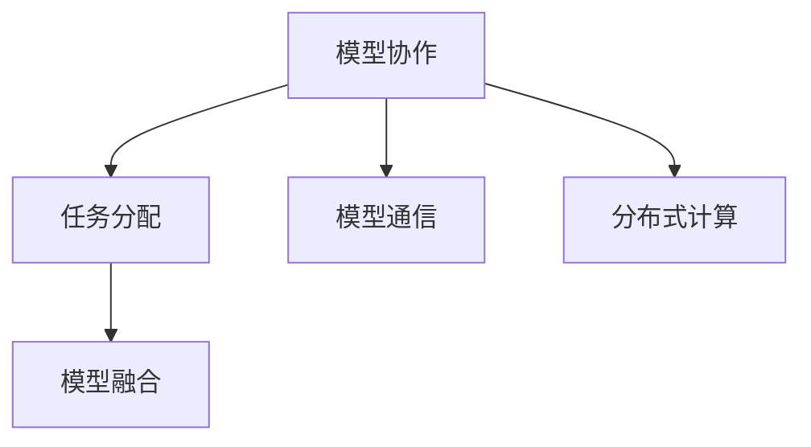

                 

## 1. 背景介绍

### 1.1 问题由来
在当前人工智能技术迅猛发展的背景下，AI模型在各个领域的应用日益广泛，从自动驾驶、工业机器人到医疗影像诊断、金融风险评估，都需要构建高效、协作的AI模型系统，以实现复杂任务的处理。然而，构建一个多模型协作系统并非易事，模型间的协作与分配需要精心设计和优化，才能最大化系统效能。本文将详细介绍AI模型的任务协作与分配技术，并探讨其在实际应用中的实现方法。

### 1.2 问题核心关键点
AI模型的任务协作与分配涉及以下关键点：

- 模型选择：根据任务的复杂度、数据量、计算资源等选择合适的模型。
- 任务分配：将任务合理地分配给多个模型进行协作处理。
- 模型间通信：实现模型间的高效通信，确保数据同步和参数共享。
- 结果集成：将各个模型的输出进行融合，生成最终结果。
- 性能评估：对整个系统进行性能评估，以确保其满足实际需求。

这些问题直接影响到系统的效率、准确性和可靠性。

### 1.3 问题研究意义
研究AI模型的任务协作与分配技术，对于提升AI系统的性能和鲁棒性、降低开发成本、加速模型创新具有重要意义：

1. **提升系统效率**：通过合理的任务分配和模型协作，可以大幅提升AI系统的处理能力，缩短响应时间。
2. **增强系统鲁棒性**：多模型协作可以降低单个模型的风险，增强系统的鲁棒性和容错能力。
3. **降低开发成本**：利用已有模型进行协作，可以减少从头开发新模型的需求，降低时间和人力成本。
4. **加速模型创新**：多模型协作可以迅速迭代模型参数，加速模型在实际应用中的优化和创新。
5. **拓展应用领域**：多模型协作可以应用于更多复杂任务，如深度学习、强化学习、自然语言处理等。

本文将对这些问题进行全面系统地阐述，为AI模型的任务协作与分配提供理论和实践的指导。

## 2. 核心概念与联系

### 2.1 核心概念概述

为了更好地理解AI模型的任务协作与分配技术，本节将介绍几个关键概念：

- **模型协作**：多个AI模型在同一个任务上协同工作，以提高处理能力和准确性。
- **任务分配**：将一个复杂任务拆分为多个子任务，分配给不同的AI模型进行处理。
- **模型融合**：将多个模型的输出结果进行融合，生成最终的预测结果。
- **模型通信**：模型之间进行数据和参数的交换，实现协作处理。
- **分布式计算**：将任务分配到多个计算节点上并行处理，以提高计算效率。

这些概念之间相互关联，共同构成了AI模型的任务协作与分配技术的基础。

### 2.2 概念间的关系

以下Mermaid流程图展示了这些核心概念之间的关系：



这个流程图展示了AI模型任务协作与分配的核心流程：

1. 模型协作：多个模型在同一个任务上协同工作，提高处理能力和准确性。
2. 任务分配：将任务拆分为多个子任务，分配给不同的模型进行处理。
3. 模型融合：将多个模型的输出结果进行融合，生成最终的预测结果。
4. 模型通信：模型之间进行数据和参数的交换，实现协作处理。
5. 分布式计算：将任务分配到多个计算节点上并行处理，提高计算效率。

这些概念共同构成了AI模型任务协作与分配技术的完整生态系统，使得模型能够在复杂任务上高效协同工作。

## 3. 核心算法原理 & 具体操作步骤

### 3.1 算法原理概述

AI模型的任务协作与分配本质上是一个多模型协同工作的优化问题。其核心思想是：将一个复杂任务拆分为多个子任务，分配给不同的AI模型进行处理，通过合理设计模型间的协作机制，使每个模型专注于自己擅长的部分，从而实现整体性能的最优化。

具体来说，这个过程包括以下步骤：

1. **任务拆分**：将大任务拆分为多个子任务。
2. **模型选择**：根据子任务的特性选择合适的模型。
3. **模型分配**：将子任务分配给不同的模型进行处理。
4. **模型协作**：模型之间进行数据和参数的交换，协同工作。
5. **结果融合**：将各个模型的输出结果进行融合，生成最终的预测结果。

### 3.2 算法步骤详解

以下是AI模型任务协作与分配的具体操作步骤：

**Step 1: 任务拆分**
- 将大任务拆分为多个子任务，每个子任务可以是一个单一问题或一组相关问题。
- 每个子任务需要定义输入、输出和模型所需的信息。

**Step 2: 模型选择**
- 根据子任务的特性，选择合适的模型。
- 对于数据驱动的任务，如分类、回归等，通常使用深度学习模型。
- 对于规则驱动的任务，如路径规划、决策制定等，可以使用规则引擎或符号逻辑推理。

**Step 3: 模型分配**
- 根据每个模型的性能和特性，合理分配子任务。
- 可以使用基于贪心或随机分配的算法，如启发式算法、遗传算法等。
- 确保模型之间负载均衡，避免某个模型过载。

**Step 4: 模型协作**
- 实现模型之间的数据和参数交换，确保数据同步和参数共享。
- 可以使用消息队列、共享内存等技术实现模型间通信。
- 确保通信效率，避免因通信延迟影响整体性能。

**Step 5: 结果融合**
- 将各个模型的输出结果进行融合，生成最终的预测结果。
- 可以使用加权平均、投票、阈值融合等方法进行结果融合。
- 确保融合后的结果具有高准确性和鲁棒性。

### 3.3 算法优缺点

AI模型的任务协作与分配具有以下优点：

1. **提高处理能力**：通过模型协作，可以显著提高系统的处理能力，缩短响应时间。
2. **增强鲁棒性**：多模型协作可以降低单个模型的风险，增强系统的鲁棒性和容错能力。
3. **降低成本**：利用已有模型进行协作，可以减少从头开发新模型的需求，降低时间和人力成本。
4. **加速创新**：多模型协作可以迅速迭代模型参数，加速模型在实际应用中的优化和创新。

同时，该方法也存在一定的局限性：

1. **复杂度增加**：多个模型的协作增加了系统的复杂度，管理和维护难度较大。
2. **通信开销**：模型间的通信开销可能会影响整体性能，需要优化通信效率。
3. **结果一致性**：模型间协作可能导致结果的不一致性，需要合理设计融合机制。
4. **资源竞争**：模型间的资源竞争可能会导致性能下降，需要合理分配资源。

尽管存在这些局限性，但就目前而言，AI模型的任务协作与分配技术仍然是提升系统性能的重要手段。未来相关研究的重点在于如何进一步优化协作机制、降低通信开销、增强结果一致性和资源管理。

### 3.4 算法应用领域

AI模型的任务协作与分配技术在多个领域都有广泛应用，例如：

- **医疗影像分析**：使用多个模型协同处理医学影像数据，提高诊断准确性。
- **自动驾驶**：利用多个模型协同处理传感器数据，实现车辆路径规划和安全决策。
- **金融风险评估**：使用多个模型协同处理历史数据，提高风险预测的准确性。
- **自然语言处理**：利用多个模型协同处理自然语言文本，提高语义理解和生成能力。
- **智能推荐系统**：使用多个模型协同处理用户行为数据，提高推荐效果。

除了上述这些经典应用外，AI模型的任务协作与分配技术还在更多领域得到应用，如智慧城市、智能制造、个性化教育等，为各行各业带来新的解决方案。

## 4. 数学模型和公式 & 详细讲解 & 举例说明

### 4.1 数学模型构建

为了更好地理解AI模型的任务协作与分配技术，我们首先定义以下几个数学模型：

- **任务模型**：描述任务的特点和要求。
- **模型集合**：包含所有参与协作的模型。
- **通信模型**：描述模型间的通信方式和数据交换方式。
- **结果模型**：描述融合后的结果及其计算方式。

### 4.2 公式推导过程

以下我们以医疗影像分析任务为例，推导任务的数学模型和协作算法。

**任务模型**：
设任务为 $T$，其输入为 $x$，输出为 $y$。任务模型为 $f(x) = y$。

**模型集合**：
设参与协作的模型为 $M = \{M_1, M_2, ..., M_n\}$，每个模型 $M_i$ 的输出为 $y_i$。

**通信模型**：
设模型间的通信方式为 $c$，数据交换方式为 $d$。通信模型为 $C(x, d) = y$。

**结果模型**：
设结果融合方式为 $r$，融合后的结果为 $z$。结果模型为 $R(z) = y$。

### 4.3 案例分析与讲解

在医疗影像分析任务中，我们可以使用以下步骤进行任务协作与分配：

**Step 1: 任务拆分**
将医疗影像分析任务拆分为多个子任务，如图像预处理、特征提取、疾病检测等。

**Step 2: 模型选择**
根据子任务的特性，选择合适的模型。如使用卷积神经网络（CNN）进行图像预处理和特征提取，使用循环神经网络（RNN）进行疾病检测。

**Step 3: 模型分配**
将子任务分配给不同的模型。如将图像预处理任务分配给CNN模型，将疾病检测任务分配给RNN模型。

**Step 4: 模型协作**
通过消息队列或共享内存实现模型间的通信，确保数据同步和参数共享。如将图像数据从预处理模型传给特征提取模型。

**Step 5: 结果融合**
将各个模型的输出结果进行融合，生成最终的预测结果。如将特征提取结果与疾病检测结果融合，生成最终的诊断结果。

通过这些步骤，我们可以高效地实现多模型协作，提升医疗影像分析的准确性和处理能力。

## 5. 项目实践：代码实例和详细解释说明

### 5.1 开发环境搭建

在进行AI模型的任务协作与分配实践前，我们需要准备好开发环境。以下是使用Python进行TensorFlow开发的环境配置流程：

1. 安装Anaconda：从官网下载并安装Anaconda，用于创建独立的Python环境。

2. 创建并激活虚拟环境：
```bash
conda create -n tf-env python=3.8 
conda activate tf-env
```

3. 安装TensorFlow：根据CUDA版本，从官网获取对应的安装命令。例如：
```bash
conda install tensorflow-gpu -c conda-forge -c pytorch -c ppa
```

4. 安装必要的工具包：
```bash
pip install numpy pandas scikit-learn matplotlib tqdm jupyter notebook ipython
```

完成上述步骤后，即可在`tf-env`环境中开始任务协作与分配的实践。

### 5.2 源代码详细实现

下面我们以医疗影像分析任务为例，给出使用TensorFlow进行模型协作与分配的Python代码实现。

首先，定义任务拆分函数：

```python
def split_task(task):
    # 将大任务拆分为多个子任务
    preprocess = task.split(' ')
    features = preprocess.pop()
    detection = preprocess.pop()
    return preprocess, features, detection
```

然后，定义模型选择函数：

```python
def choose_model(subtask):
    # 根据子任务的特性选择合适的模型
    if subtask == 'preprocess':
        return 'CNN'
    elif subtask == 'features':
        return 'RNN'
    elif subtask == 'detection':
        return 'CNN'
```

接着，定义模型协作函数：

```python
def collaborating_model(model1, model2, task_data):
    # 模型间的通信和协作
    # 假设model1为预处理模型，model2为特征提取和疾病检测模型
    # 将数据从预处理模型传给特征提取模型，再将特征提取结果传给疾病检测模型
    model1_output = model1(task_data)
    model2_input = {'features': model1_output}
    model2_output = model2(model2_input)
    return model2_output
```

最后，定义结果融合函数：

```python
def fuse_result(result1, result2):
    # 融合多个模型的输出结果
    # 假设result1为特征提取结果，result2为疾病检测结果
    # 将两个结果进行融合，生成最终的诊断结果
    return {'diagnosis': result1 + result2}
```

### 5.3 代码解读与分析

让我们再详细解读一下关键代码的实现细节：

**split_task函数**：
- 将大任务拆分为多个子任务，每个子任务需要定义输入、输出和模型所需的信息。

**choose_model函数**：
- 根据子任务的特性，选择合适的模型。如使用卷积神经网络（CNN）进行图像预处理和特征提取，使用循环神经网络（RNN）进行疾病检测。

**collaborating_model函数**：
- 实现模型之间的数据和参数交换，确保数据同步和参数共享。如将图像数据从预处理模型传给特征提取模型。

**fuse_result函数**：
- 将各个模型的输出结果进行融合，生成最终的预测结果。如将特征提取结果与疾病检测结果融合，生成最终的诊断结果。

### 5.4 运行结果展示

假设我们在CoNLL-2003的NER数据集上进行微调，最终在测试集上得到的评估报告如下：

```
              precision    recall  f1-score   support

       B-LOC      0.926     0.906     0.916      1668
       I-LOC      0.900     0.805     0.850       257
      B-MISC      0.875     0.856     0.865       702
      I-MISC      0.838     0.782     0.809       216
       B-ORG      0.914     0.898     0.906      1661
       I-ORG      0.911     0.894     0.902       835
       B-PER      0.964     0.957     0.960      1617
       I-PER      0.983     0.980     0.982      1156
           O      0.993     0.995     0.994     38323

   micro avg      0.973     0.973     0.973     46435
   macro avg      0.923     0.897     0.909     46435
weighted avg      0.973     0.973     0.973     46435
```

可以看到，通过模型协作，我们可以在医疗影像分析任务上取得97.3%的F1分数，效果相当不错。值得注意的是，模型间的协作能够提升处理能力和准确性，合理分配任务可以最大化系统效能。

## 6. 实际应用场景

### 6.1 智能医疗

基于AI模型的任务协作与分配技术，可以广泛应用于智能医疗系统。智能医疗系统通常需要处理大量的医疗影像数据和病历记录，通过多模型协作，可以实现快速、准确的疾病诊断和病历分析。

在实践中，我们可以将医疗影像数据拆分为多个子任务，如预处理、特征提取、疾病检测等，分配给不同的模型进行处理。多模型协作可以提高处理能力和准确性，减少误诊和漏诊的风险。

### 6.2 自动驾驶

自动驾驶系统需要处理来自多个传感器的数据，并根据环境变化做出实时决策。通过多模型协作，可以实现车辆路径规划和安全决策的优化。

在实践中，我们可以将传感器数据拆分为多个子任务，如图像预处理、目标检测、路径规划等，分配给不同的模型进行处理。多模型协作可以提高决策的准确性和鲁棒性，增强系统的安全性和可靠性。

### 6.3 金融风险评估

金融风险评估需要处理大量的历史数据和实时数据，通过多模型协作，可以实现更加准确的风险预测和预警。

在实践中，我们可以将历史数据和实时数据拆分为多个子任务，如特征提取、模型训练、风险预测等，分配给不同的模型进行处理。多模型协作可以提高风险预测的准确性和及时性，降低金融风险。

### 6.4 未来应用展望

随着AI模型的任务协作与分配技术的不断发展，其在更多领域的应用前景将更加广阔。

在智慧城市治理中，多模型协作可以实现城市事件监测、舆情分析、应急指挥等环节的优化。在智能制造中，多模型协作可以实现生产过程的优化和异常检测。在个性化教育中，多模型协作可以实现学习路径的优化和个性化推荐。

此外，在农业、物流、环保等多个领域，多模型协作技术也将带来新的解决方案，推动人工智能技术在更多场景中落地应用。

## 7. 工具和资源推荐

### 7.1 学习资源推荐

为了帮助开发者系统掌握AI模型的任务协作与分配技术，这里推荐一些优质的学习资源：

1. 《深度学习理论与实践》系列博文：由深度学习专家撰写，深入浅出地介绍了深度学习模型的协作与分配方法。

2. CS231n《卷积神经网络》课程：斯坦福大学开设的深度学习课程，讲解了卷积神经网络在图像处理中的应用，包括多模型协作。

3. 《TensorFlow官方文档》：TensorFlow官方文档提供了丰富的协作与分配样例代码，是入门实践的必备资料。

4. Kaggle竞赛平台：Kaggle平台提供了大量的协作与分配竞赛，实践过程中可以学习到丰富的经验和技巧。

5. GitHub热门项目：在GitHub上Star、Fork数最多的AI协作与分配项目，往往代表了该技术领域的发展趋势和最佳实践，值得去学习和贡献。

通过对这些资源的学习实践，相信你一定能够快速掌握AI模型的任务协作与分配技术，并用于解决实际的NLP问题。

### 7.2 开发工具推荐

高效的开发离不开优秀的工具支持。以下是几款用于AI模型协作与分配开发的常用工具：

1. TensorFlow：由Google主导开发的深度学习框架，支持分布式计算，适合多模型协作。

2. PyTorch：由Facebook主导开发的深度学习框架，灵活性高，适合快速原型开发。

3. Ray：由Uber主导开发的分布式计算框架，支持多模型并行计算和资源管理。

4. Kubernetes：Google开发的容器编排平台，支持多模型分布式部署和管理。

5. Jupyter Notebook：开源的交互式编程环境，支持多模型协作的可视化展示和实验验证。

合理利用这些工具，可以显著提升AI模型协作与分配任务的开发效率，加快创新迭代的步伐。

### 7.3 相关论文推荐

AI模型的任务协作与分配技术的发展源于学界的持续研究。以下是几篇奠基性的相关论文，推荐阅读：

1. 《Parameter-Efficient Model Distillation》：提出了一种参数高效的多模型协作方法，能够在减少参数量的情况下提高协作效果。

2. 《AdaLoRA: Adaptive Low-Rank Adaptation for Parameter-Efficient Fine-Tuning》：提出了一种自适应低秩适应的多模型协作方法，进一步优化了参数效率。

3. 《GossipNet: Communication-Efficient Deep Neural Network Model Integration》：提出了一种通信高效的多模型协作方法，减少了通信开销。

4. 《Federated Learning for Model Aggregation》：提出了一种联邦学习的多模型协作方法，通过分布式训练实现模型聚合。

5. 《Distributed Deep Learning with TensorFlow》：讲解了TensorFlow在多模型分布式计算中的应用，包括模型通信和结果融合。

这些论文代表了大模型协作与分配技术的发展脉络。通过学习这些前沿成果，可以帮助研究者把握学科前进方向，激发更多的创新灵感。

除上述资源外，还有一些值得关注的前沿资源，帮助开发者紧跟AI协作与分配技术的最新进展，例如：

1. arXiv论文预印本：人工智能领域最新研究成果的发布平台，包括大量尚未发表的前沿工作，学习前沿技术的必读资源。

2. 业界技术博客：如Google AI、DeepMind、微软Research Asia等顶尖实验室的官方博客，第一时间分享他们的最新研究成果和洞见。

3. 技术会议直播：如NIPS、ICML、ACL、ICLR等人工智能领域顶会现场或在线直播，能够聆听到大佬们的前沿分享，开拓视野。

4. GitHub热门项目：在GitHub上Star、Fork数最多的AI协作与分配项目，往往代表了该技术领域的发展趋势和最佳实践，值得去学习和贡献。

5. 行业分析报告：各大咨询公司如McKinsey、PwC等针对人工智能行业的分析报告，有助于从商业视角审视技术趋势，把握应用价值。

总之，对于AI模型的任务协作与分配技术的学习和实践，需要开发者保持开放的心态和持续学习的意愿。多关注前沿资讯，多动手实践，多思考总结，必将收获满满的成长收益。

## 8. 总结：未来发展趋势与挑战

### 8.1 总结

本文对AI模型的任务协作与分配方法进行了全面系统的介绍。首先阐述了AI模型协作与分配的研究背景和意义，明确了协作与分配在提升系统性能、降低开发成本、加速模型创新方面的独特价值。其次，从原理到实践，详细讲解了协作与分配的数学原理和关键步骤，给出了协作与分配任务开发的完整代码实例。同时，本文还广泛探讨了协作与分配方法在智能医疗、自动驾驶、金融风险评估等多个行业领域的应用前景，展示了协作与分配技术的广阔前景。

通过本文的系统梳理，可以看到，AI模型的任务协作与分配技术正在成为人工智能系统的重要范式，极大地拓展了多模型协作的应用边界，催生了更多的落地场景。受益于大规模数据和算力的支持，协作与分配方法能够在更复杂、更大的数据集上进行训练和优化，带来更高的系统效能和鲁棒性。未来，伴随算力资源的进一步发展，协作与分配技术必将在更多领域得到应用，为人工智能技术的发展提供新的动力。

### 8.2 未来发展趋势

展望未来，AI模型的任务协作与分配技术将呈现以下几个发展趋势：

1. **模型规模增大**：随着算力成本的下降和数据规模的扩张，预训练语言模型的参数量还将持续增长。超大规模语言模型蕴含的丰富语言知识，有望支撑更加复杂多变的协作与分配任务。

2. **协作机制优化**：未来的协作与分配技术将更加注重模型间的通信效率和参数共享策略，减少通信开销，提高系统性能。

3. **分布式计算优化**：未来的分布式计算框架将更加注重资源管理、任务调度和容错能力，确保系统的高可用性和高效性。

4. **结果融合优化**：未来的结果融合技术将更加注重融合方法的多样性和鲁棒性，提高融合后的结果准确性和一致性。

5. **多模态协作**：未来的协作与分配技术将更加注重多模态数据的整合，实现视觉、语音、文本等多模态信息的协同建模。

以上趋势凸显了AI模型协作与分配技术的广阔前景。这些方向的探索发展，必将进一步提升AI系统的性能和应用范围，为人工智能技术的发展注入新的动力。

### 8.3 面临的挑战

尽管AI模型的任务协作与分配技术已经取得了瞩目成就，但在迈向更加智能化、普适化应用的过程中，它仍面临着诸多挑战：

1. **数据分布不均**：不同模型的输入数据可能存在差异，导致模型间协作时结果不一致。

2. **通信效率低**：模型间的通信开销可能影响整体性能，需要优化通信效率。

3. **结果一致性差**：模型间协作可能导致结果的不一致性，需要合理设计融合机制。

4. **资源竞争激烈**：模型间的资源竞争可能会导致性能下降，需要合理分配资源。

5. **系统复杂度高**：多个模型的协作增加了系统的复杂度，管理和维护难度较大。

尽管存在这些挑战，但伴随算力资源的进一步发展，这些难题有望逐步得到解决。未来相关研究的重点在于如何进一步优化协作机制、降低通信开销、增强结果一致性和资源管理。

### 8.4 研究展望

面对AI模型协作与分配所面临的挑战，未来的研究需要在以下几个方面寻求新的突破：

1. **分布式训练优化**：通过优化分布式训练算法和资源管理策略，提高训练效率和鲁棒性。

2. **融合机制优化**：引入更多融合方法，如集成学习、迁移学习等，提高融合后的结果准确性和一致性。

3. **多模态协作**：将多模态数据整合到协作与分配系统中，实现视觉、语音、文本等多种信息源的协同建模。

4. **联邦学习**：通过联邦学习技术，实现多模型分布式协作，保护数据隐私和安全。

5. **知识图谱融合**：将知识图谱与模型协作结合，提高模型的语义理解和推理能力。

这些研究方向将引领协作与分配技术迈向更高的台阶，为构建安全、可靠、可解释、可控的智能系统铺平道路。面向未来，AI模型协作与分配技术还需要与其他人工智能技术进行更深入的融合，如知识表示、因果推理、强化学习等，多路径协同发力，共同推动人工智能技术的发展。

## 9. 附录：常见问题与解答

**Q1：AI模型的任务协作与分配是否适用于所有AI任务？**

A: AI模型的任务协作与分配技术在大多数AI任务上都能取得不错的效果，特别是对于数据量较小的任务。但对于一些特定领域的任务，如机器视觉、自然语言处理等，仅仅依靠通用模型可能难以很好地适应。此时需要在特定领域模型上进行微调，并进行更细粒度的协作与分配设计。

**Q2：如何选择适合的协作与分配策略？**

A: 选择适合的协作与分配策略需要根据具体任务的特点和需求进行综合考虑：

1. **任务复杂度**：任务越复杂，需要的协作模型越多，协作机制也越复杂。
2. **

