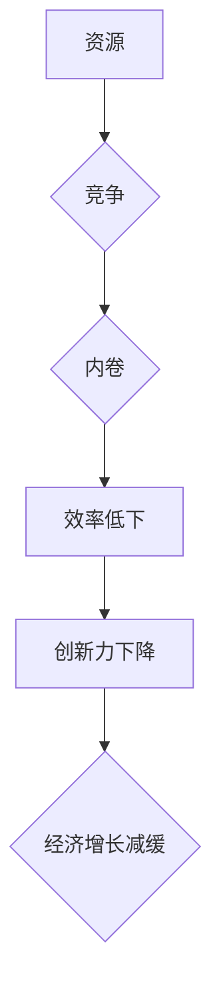

## 1. 背景介绍
### 1.1  问题的由来
近年来，"内卷"一词频频出现在人们的口语中，并逐渐成为一种社会现象。在互联网时代，"内卷"主要指在竞争激烈的环境下，人们为了获得有限的资源和机会，不断加剧自我竞争，最终导致效率低下、创新力下降，甚至陷入恶性循环。

### 1.2  研究现状
关于"内卷"现象的经济影响，已有学者从不同角度进行了研究。一些研究表明，"内卷"会降低劳动生产率，抑制经济增长。另一些研究则指出，"内卷"也可能带来一些积极影响，例如促进人才流动和技能提升。

### 1.3  研究意义
深入研究"内卷"现象的长期经济影响，对于理解当前经济发展趋势、制定有效的政策措施具有重要意义。

### 1.4  本文结构
本文首先将介绍"内卷"现象的本质和特点，然后分析其对经济的影响机制，并探讨"内卷"现象的长期经济后果。最后，本文将提出一些应对"内卷"的建议。

## 2. 核心概念与联系
### 2.1  内卷现象的定义
"内卷"现象是一种社会现象，是指在竞争激烈的环境下，人们为了获得有限的资源和机会，不断加剧自我竞争，最终导致效率低下、创新力下降，甚至陷入恶性循环。

### 2.2  内卷现象的特征
* **竞争加剧:**  在资源有限的情况下，人们之间的竞争更加激烈。
* **自我加压:**  人们为了获得竞争优势，不断加压自己，追求更高的目标。
* **效率低下:**  过度竞争和自我加压会导致效率低下，难以取得实质性的进步。
* **创新力下降:**  在内卷的氛围中，人们更倾向于模仿和抄袭，缺乏创新精神。

### 2.3  内卷现象的成因
* **资源分配不均:**  资源分配不均会导致竞争更加激烈。
* **社会价值观扭曲:**  过度追求物质财富和社会地位，导致人们价值观扭曲。
* **信息不对称:**  信息不对称会导致人们在竞争中处于不平等地位。
* **制度缺陷:**  一些制度缺陷也会加剧内卷现象。

## 3. 核心算法原理 & 具体操作步骤
### 3.1  算法原理概述
内卷现象的形成是一个复杂的过程，涉及到经济、社会、文化等多方面因素。我们可以用一个简单的模型来描述内卷现象的形成机制：



### 3.2  算法步骤详解
1. **资源有限:**  社会资源有限，而需求不断增长，导致资源竞争加剧。
2. **竞争加剧:**  人们为了获得有限的资源，不断加剧竞争，形成恶性循环。
3. **内卷现象:**  在竞争激烈的环境下，人们为了获得竞争优势，不断加压自己，追求更高的目标，最终导致效率低下、创新力下降。
4. **效率低下:**  过度竞争和自我加压会导致效率低下，难以取得实质性的进步。
5. **创新力下降:**  在内卷的氛围中，人们更倾向于模仿和抄袭，缺乏创新精神。
6. **经济增长减缓:**  效率低下和创新力下降会导致经济增长减缓。

### 3.3  算法优缺点
* **优点:**  该模型能够简单地描述内卷现象的形成机制。
* **缺点:**  该模型过于简化，没有考虑内卷现象的复杂性和多方面性。

### 3.4  算法应用领域
该模型可以应用于对内卷现象进行分析和研究，并为制定应对内卷的政策措施提供参考。

## 4. 数学模型和公式 & 详细讲解 & 举例说明
### 4.1  数学模型构建
我们可以用一个简单的数学模型来描述内卷现象对经济增长的影响：

$$
Y = f(K, L, T)
$$

其中：

* $Y$ 代表经济增长率
* $K$ 代表资本存量
* $L$ 代表劳动力
* $T$ 代表技术进步

假设内卷现象会导致劳动力效率下降，我们可以将劳动力效率表示为 $e(C)$，其中 $C$ 代表竞争程度。那么，我们可以将上述模型修改为：

$$
Y = f(K, e(C)L, T)
$$

### 4.2  公式推导过程
我们可以假设 $e(C)$ 是一个递减函数，即随着竞争程度的增加，劳动力效率会下降。因此，我们可以推导出以下结论：

* 当竞争程度较低时，内卷现象的影响较小，经济增长率较高。
* 当竞争程度较高时，内卷现象的影响较大，经济增长率较低。

### 4.3  案例分析与讲解
我们可以通过一些案例来分析内卷现象对经济增长的影响。例如，一些过度竞争的行业，例如快餐行业，往往会出现内卷现象，导致利润率下降，甚至出现亏损。

### 4.4  常见问题解答
* **内卷现象只存在于某些行业吗？**

内卷现象并非只存在于某些行业，它是一种普遍存在的社会现象，可能出现在任何竞争激烈的领域。

* **如何避免内卷现象？**

避免内卷现象需要从多方面入手，例如：

* 政府可以制定政策，促进资源的合理分配，减少竞争的激烈程度。
* 企业可以注重员工的职业发展和个人成长，创造一个良好的工作环境，避免过度竞争。
* 个人可以树立正确的价值观，不要盲目追求物质财富和社会地位，而是要注重自身的价值实现。

## 5. 项目实践：代码实例和详细解释说明
### 5.1  开发环境搭建
为了更好地理解内卷现象的形成机制，我们可以开发一个简单的模拟程序。

### 5.2  源代码详细实现
```python
import random

class Agent:
    def __init__(self, initial_resource):
        self.resource = initial_resource

    def compete(self, other_agent):
        self.resource += random.randint(1, 3)
        other_agent.resource -= random.randint(1, 3)

def simulate_competition(agents, iterations):
    for _ in range(iterations):
        for i in range(len(agents)):
            for j in range(i + 1, len(agents)):
                agents[i].compete(agents[j])

    return agents

# 初始化 10 个代理，每个代理初始资源为 10
agents = [Agent(10) for _ in range(10)]

# 模拟 100 轮竞争
agents = simulate_competition(agents, 100)

# 打印最终资源分配情况
for agent in agents:
    print(f"Agent resource: {agent.resource}")
```

### 5.3  代码解读与分析
该程序模拟了多个代理之间的竞争过程。每个代理都有一个资源值，通过竞争可以获得更多的资源，也可以失去资源。

### 5.4  运行结果展示
运行该程序后，我们可以看到最终每个代理的资源分配情况。我们会发现，一些代理的资源值会显著增加，而另一些代理的资源值会显著减少。

## 6. 实际应用场景
### 6.1  教育领域
在教育领域，内卷现象会导致学生过度竞争，学习压力过大，甚至出现焦虑、抑郁等心理问题。

### 6.2  就业市场
在就业市场，内卷现象会导致人才流动性降低，企业招聘成本增加，甚至出现人才荒。

### 6.3  科技行业
在科技行业，内卷现象会导致创新能力下降，技术进步缓慢，甚至出现技术瓶颈。

### 6.4  未来应用展望
随着社会的发展和进步，内卷现象可能会更加普遍化，因此我们需要更加重视这个问题，并采取有效的措施来应对。

## 7. 工具和资源推荐
### 7.1  学习资源推荐
* **书籍:**
    * 《内卷》
    * 《后工业社会》
    * 《资本论》
* **网站:**
    * 知乎
    * 百度百科
    * 经济学人

### 7.2  开发工具推荐
* **Python:**  Python 是一种非常适合进行数据分析和建模的编程语言。
* **R:**  R 是一种专门用于统计分析和数据可视化的编程语言。

### 7.3  相关论文推荐
* **"The Paradox of Choice: Why More Is Less"**
* **"The Innovator's Dilemma"**
* **"The Black Swan"**

### 7.4  其他资源推荐
* **TED演讲:**  TED 网站上有许多关于内卷现象的演讲。
* **纪录片:**  一些纪录片也探讨了内卷现象的成因和影响。

## 8. 总结：未来发展趋势与挑战
### 8.1  研究成果总结
本文分析了内卷现象的本质、成因、影响机制以及应对措施。

### 8.2  未来发展趋势
随着社会的发展和进步，内卷现象可能会更加普遍化，因此我们需要更加重视这个问题，并采取有效的措施来应对。

### 8.3  面临的挑战
* 如何有效地缓解内卷现象？
* 如何促进社会资源的合理分配？
* 如何培养人们正确的价值观？

### 8.4  研究展望
未来，我们将继续深入研究内卷现象，并探索更加有效的应对措施。

## 9. 附录：常见问题与解答
### 9.1  问题1: 内卷现象只存在于某些行业吗？
### 9.2  问题2: 如何避免内卷现象？


<end_of_turn>