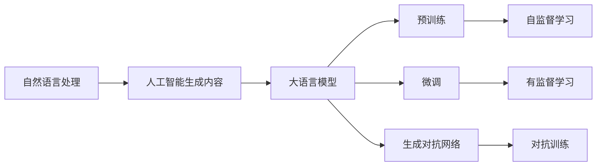
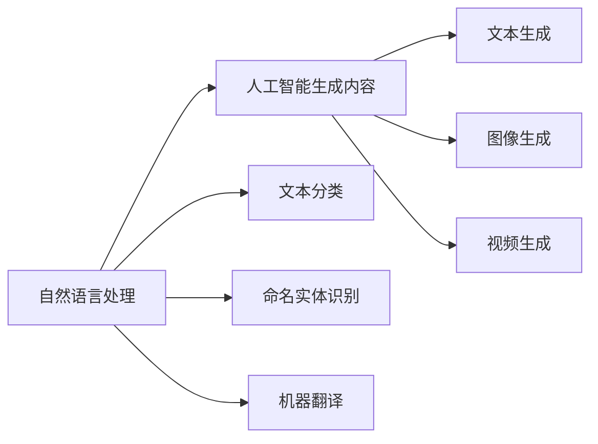
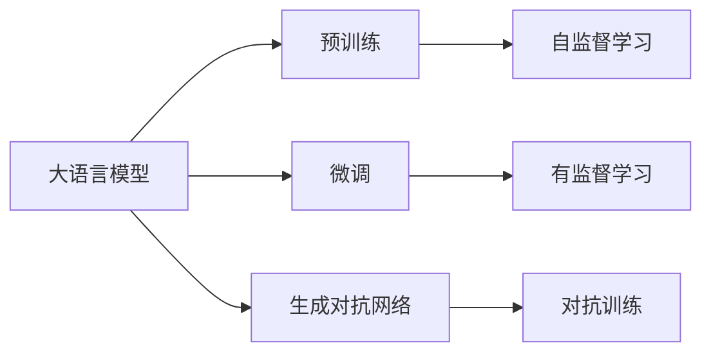

                 

# AIGC从入门到实战：自然语言处理和大语言模型简介

> 关键词：人工智能生成内容(AIGC), 自然语言处理(NLP), 大语言模型(LLM), 预训练, 微调(Fine-Tuning), 深度学习, 生成对抗网络(GAN), 自然语言理解(NLU), 自然语言生成(NLG)

## 1. 背景介绍

### 1.1 问题由来
随着人工智能技术的发展，越来越多的公司和国家开始关注AI技术的应用前景。其中，自然语言处理（Natural Language Processing，NLP）作为AI领域的一个重要分支，其研究热点和发展趋势越来越受到关注。NLP 技术正在逐渐从实验室走向实际应用，深度学习技术的发展也为NLP提供了强有力的支撑。

大语言模型（Large Language Models，LLMs）是当前NLP研究的热点之一，包括OpenAI的GPT系列模型、Google的BERT、T5等。大语言模型通过在大规模无标签文本数据上进行预训练，学习到了丰富的语言知识和常识，可以用于文本分类、命名实体识别、情感分析、机器翻译等多种自然语言处理任务。

本文将从自然语言处理和大语言模型入手，介绍AIGC（人工智能生成内容）技术的发展，并结合实际应用场景，探讨大语言模型的应用前景和研究挑战。

## 2. 核心概念与联系

### 2.1 核心概念概述

为了更好地理解自然语言处理和大语言模型，本节将介绍几个密切相关的核心概念：

- **自然语言处理（NLP）**：自然语言处理是指计算机处理、理解和生成人类语言的技术。它涉及到语言模型的建立、句法分析、语义分析、语音识别、翻译等多个子领域。NLP技术的核心在于构建一个能够理解和生成自然语言的智能系统。

- **人工智能生成内容（AIGC）**：人工智能生成内容是指使用人工智能技术自动生成文本、图像、视频等内容的技术。AIGC技术能够自动生成高质量的文本内容，具有广泛的商业应用前景。

- **大语言模型（LLM）**：大语言模型是以自回归（如GPT）或自编码（如BERT）模型为代表的、在大规模无标签文本语料上进行预训练的语言模型。通过预训练，大语言模型学习到了丰富的语言知识和常识，具备强大的语言理解和生成能力。

- **预训练（Pre-training）**：预训练是指在大规模无标签文本语料上，通过自监督学习任务训练通用语言模型的过程。常见的预训练任务包括语言模型（Language Modeling）、掩码语言模型（Masked Language Modeling）等。

- **微调（Fine-tuning）**：微调是指在预训练模型的基础上，使用下游任务的少量标注数据，通过有监督地训练优化模型在特定任务上的性能。通常只需要调整顶层分类器或解码器，并以较小的学习率更新全部或部分的模型参数。

- **生成对抗网络（GAN）**：生成对抗网络是一种通过对抗训练生成高质量图像、文本等内容的技术。GAN模型由生成器和判别器两部分组成，通过不断的对抗训练，生成器能够生成越来越逼真的内容。

这些核心概念之间的逻辑关系可以通过以下Mermaid流程图来展示：



这个流程图展示了大语言模型的核心概念及其之间的关系：

1. 自然语言处理通过预训练和微调等技术构建大语言模型。
2. 大语言模型具备强大的语言理解和生成能力，可用于生成高质量的文本内容。
3. 生成对抗网络技术可以进一步提升大语言模型生成文本的质量。
4. 预训练和微调是大语言模型构建的重要步骤。

### 2.2 概念间的关系

这些核心概念之间存在着紧密的联系，形成了自然语言处理和大语言模型的完整生态系统。下面我们通过几个Mermaid流程图来展示这些概念之间的关系。

#### 2.2.1 自然语言处理与人工智能生成内容的关系



这个流程图展示了自然语言处理与人工智能生成内容之间的关系：

1. 自然语言处理技术可以用于文本分类、命名实体识别、机器翻译等多种任务。
2. 人工智能生成内容技术可以用于文本生成、图像生成、视频生成等多种内容生成任务。

#### 2.2.2 大语言模型与预训练、微调的关系



这个流程图展示了大语言模型与预训练、微调、生成对抗网络的关系：

1. 大语言模型通过预训练学习语言知识。
2. 微调在大语言模型的基础上，通过有监督学习优化模型性能。
3. 生成对抗网络通过对抗训练提升大语言模型的生成能力。

## 3. 核心算法原理 & 具体操作步骤

### 3.1 算法原理概述

自然语言处理和大语言模型的核心算法原理包括预训练、微调和生成对抗网络等。以下是这些算法的详细描述。

**预训练（Pre-training）**：预训练是指在大规模无标签文本语料上，通过自监督学习任务训练通用语言模型的过程。常见的预训练任务包括语言模型（Language Modeling）、掩码语言模型（Masked Language Modeling）等。

语言模型是指通过预测句子中下一个单词的概率分布，来学习单词之间的关联性。常见的语言模型包括n-gram模型和Transformer模型。Transformer模型是一种基于自注意力机制的神经网络模型，能够高效地并行计算，适用于大规模文本数据。

掩码语言模型是指在句子中随机掩盖一些单词，让模型预测被掩盖的单词，从而学习单词之间的依赖关系。BERT模型就是一种基于掩码语言模型的预训练模型，它通过掩盖单词进行训练，能够学习到单词级别的语义信息。

**微调（Fine-tuning）**：微调是指在预训练模型的基础上，使用下游任务的少量标注数据，通过有监督地训练优化模型在特定任务上的性能。通常只需要调整顶层分类器或解码器，并以较小的学习率更新全部或部分的模型参数。

微调的具体步骤如下：

1. 收集下游任务的少量标注数据，划分为训练集、验证集和测试集。
2. 将预训练模型作为初始化参数，用于下游任务的微调。
3. 在训练集上进行梯度下降优化，更新模型参数。
4. 在验证集上评估模型性能，调整模型参数。
5. 在测试集上评估最终模型性能。

微调可以采用多种优化算法，如Adam、SGD等，并设置适当的学习率和正则化参数。

**生成对抗网络（GAN）**：生成对抗网络是一种通过对抗训练生成高质量图像、文本等内容的技术。GAN模型由生成器和判别器两部分组成，通过不断的对抗训练，生成器能够生成越来越逼真的内容。

GAN模型在自然语言生成中的应用相对较少，但它的思想可以被应用到大语言模型中。生成器可以根据输入的噪声向量生成自然语言文本，而判别器则用于区分生成文本和真实文本。通过对抗训练，生成器可以生成越来越逼真的文本，从而提升大语言模型的生成能力。

### 3.2 算法步骤详解

以下是大语言模型微调的详细步骤：

1. **数据准备**：准备预训练模型的文本数据，划分为训练集、验证集和测试集。

2. **模型选择**：选择适当的预训练模型，如BERT、GPT等。

3. **微调架构设计**：根据任务类型，设计合适的微调架构，如添加分类器、解码器等。

4. **超参数设置**：选择合适的优化算法及其参数，如Adam、SGD等，设置学习率、批大小、迭代轮数等。

5. **模型初始化**：将预训练模型作为初始化参数，用于微调。

6. **模型训练**：在训练集上进行梯度下降优化，更新模型参数。

7. **验证集评估**：在验证集上评估模型性能，调整模型参数。

8. **测试集评估**：在测试集上评估最终模型性能。

9. **模型部署**：将训练好的模型部署到实际应用场景中。

### 3.3 算法优缺点

大语言模型微调具有以下优点：

1. **简单高效**：只需要准备少量标注数据，即可对预训练模型进行快速适配，获得较大的性能提升。

2. **通用适用**：适用于各种NLP下游任务，包括分类、匹配、生成等，设计简单的任务适配层即可实现微调。

3. **参数高效**：利用参数高效微调技术，在固定大部分预训练参数的情况下，仍可取得不错的微调效果。

4. **效果显著**：在学术界和工业界的诸多任务上，基于微调的方法已经刷新了最先进的性能指标。

大语言模型微调也存在一些缺点：

1. **依赖标注数据**：微调的效果很大程度上取决于标注数据的质量和数量，获取高质量标注数据的成本较高。

2. **迁移能力有限**：当目标任务与预训练数据的分布差异较大时，微调的性能提升有限。

3. **负面效果传递**：预训练模型的固有偏见、有害信息等，可能通过微调传递到下游任务，造成负面影响。

4. **可解释性不足**：微调模型的决策过程通常缺乏可解释性，难以对其推理逻辑进行分析和调试。

5. **资源消耗高**：大规模语言模型虽然精度高，但在实际部署时往往面临推理速度慢、内存占用大等效率问题。

### 3.4 算法应用领域

大语言模型微调技术已经广泛应用于多个领域，包括自然语言理解（NLU）、自然语言生成（NLG）、智能客服、金融舆情监测、个性化推荐等。

**自然语言理解（NLU）**：自然语言理解是指计算机理解人类语言的技术。大语言模型通过微调可以实现情感分析、命名实体识别、意图识别等NLU任务。

**自然语言生成（NLG）**：自然语言生成是指计算机生成自然语言的技术。大语言模型通过微调可以实现文本生成、对话生成、摘要生成等NLG任务。

**智能客服**：智能客服系统通过微调大语言模型，可以实现自动回复客户咨询，提升客户体验。

**金融舆情监测**：金融舆情监测系统通过微调大语言模型，可以实现实时监测市场舆论动向，规避金融风险。

**个性化推荐**：个性化推荐系统通过微调大语言模型，可以实现更加精准、多样化的推荐内容。

## 4. 数学模型和公式 & 详细讲解 & 举例说明

### 4.1 数学模型构建

自然语言处理和大语言模型的数学模型通常包括语言模型、掩码语言模型和生成对抗网络模型等。以下是这些模型的详细构建过程。

**语言模型（Language Modeling）**：语言模型是指通过预测句子中下一个单词的概率分布，来学习单词之间的关联性。常见的语言模型包括n-gram模型和Transformer模型。

n-gram模型是指通过统计n个相邻单词出现的频率，来学习单词之间的关联性。n-gram模型的概率分布为：

$$P(x_i|x_{i-1}x_{i-2}\cdots x_{i-n}) = \frac{P(x_{i-1}x_{i-2}\cdots x_{i-n}x_i)}{P(x_{i-1}x_{i-2}\cdots x_{i-n})}$$

Transformer模型是一种基于自注意力机制的神经网络模型，能够高效地并行计算，适用于大规模文本数据。Transformer模型的概率分布为：

$$P(x_i|x_{i-1}x_{i-2}\cdots x_{i-n}) = \frac{e^{Ax_i}}{\sum_{j=1}^V e^{A_j}}$$

其中，$A$为Transformer模型的线性层权重矩阵，$x_i$为输入向量，$V$为词汇表大小。

**掩码语言模型（Masked Language Modeling）**：掩码语言模型是指在句子中随机掩盖一些单词，让模型预测被掩盖的单词，从而学习单词之间的依赖关系。BERT模型就是一种基于掩码语言模型的预训练模型，它通过掩盖单词进行训练，能够学习到单词级别的语义信息。

BERT模型的概率分布为：

$$P(\hat{x}_i|x_{i-1}x_{i-2}\cdots x_{i-n}) = \frac{e^{\hat{A}\hat{x}_i}}{\sum_{j=1}^V e^{\hat{A}_j}}$$

其中，$\hat{x}_i$为掩盖的单词，$\hat{A}$为BERT模型的线性层权重矩阵。

**生成对抗网络（GAN）**：生成对抗网络是一种通过对抗训练生成高质量图像、文本等内容的技术。GAN模型由生成器和判别器两部分组成，通过不断的对抗训练，生成器能够生成越来越逼真的内容。

GAN模型的概率分布为：

$$P_{G}(x) = \frac{1}{Z}G(z)$$

$$P_{D}(x) = \frac{1}{Z_D}D(x)$$

其中，$G$为生成器，$z$为输入的噪声向量，$D$为判别器，$Z_D$为判别器的归一化常数。

### 4.2 公式推导过程

以下是对语言模型、掩码语言模型和生成对抗网络模型公式的详细推导。

**语言模型（Language Modeling）**：语言模型是指通过预测句子中下一个单词的概率分布，来学习单词之间的关联性。

n-gram模型的概率分布为：

$$P(x_i|x_{i-1}x_{i-2}\cdots x_{i-n}) = \frac{P(x_{i-1}x_{i-2}\cdots x_{i-n}x_i)}{P(x_{i-1}x_{i-2}\cdots x_{i-n})}$$

Transformer模型的概率分布为：

$$P(x_i|x_{i-1}x_{i-2}\cdots x_{i-n}) = \frac{e^{Ax_i}}{\sum_{j=1}^V e^{A_j}}$$

其中，$A$为Transformer模型的线性层权重矩阵，$x_i$为输入向量，$V$为词汇表大小。

**掩码语言模型（Masked Language Modeling）**：掩码语言模型是指在句子中随机掩盖一些单词，让模型预测被掩盖的单词，从而学习单词之间的依赖关系。

BERT模型的概率分布为：

$$P(\hat{x}_i|x_{i-1}x_{i-2}\cdots x_{i-n}) = \frac{e^{\hat{A}\hat{x}_i}}{\sum_{j=1}^V e^{\hat{A}_j}}$$

其中，$\hat{x}_i$为掩盖的单词，$\hat{A}$为BERT模型的线性层权重矩阵。

**生成对抗网络（GAN）**：生成对抗网络是一种通过对抗训练生成高质量图像、文本等内容的技术。

GAN模型的概率分布为：

$$P_{G}(x) = \frac{1}{Z}G(z)$$

$$P_{D}(x) = \frac{1}{Z_D}D(x)$$

其中，$G$为生成器，$z$为输入的噪声向量，$D$为判别器，$Z_D$为判别器的归一化常数。

### 4.3 案例分析与讲解

以下是对语言模型、掩码语言模型和生成对抗网络模型的案例分析与讲解。

**语言模型（Language Modeling）**：语言模型通过预测句子中下一个单词的概率分布，来学习单词之间的关联性。

n-gram模型通过统计n个相邻单词出现的频率，来学习单词之间的关联性。例如，对于句子"I love you, mom!"，n-gram模型可以预测出下一个单词为"mom"的概率，从而学习到单词之间的关联性。

Transformer模型通过自注意力机制，能够高效地并行计算，适用于大规模文本数据。例如，对于句子"I love you, mom!"，Transformer模型可以预测出下一个单词为"mom"的概率，从而学习到单词之间的关联性。

**掩码语言模型（Masked Language Modeling）**：掩码语言模型通过掩盖句子中的一些单词，让模型预测被掩盖的单词，从而学习单词之间的依赖关系。

BERT模型通过掩盖单词进行训练，能够学习到单词级别的语义信息。例如，对于句子"I love you, mom!"，BERT模型可以掩盖单词"mom"，让模型预测出被掩盖的单词，从而学习到单词之间的依赖关系。

**生成对抗网络（GAN）**：生成对抗网络通过对抗训练生成高质量图像、文本等内容。

GAN模型由生成器和判别器两部分组成，通过不断的对抗训练，生成器能够生成越来越逼真的内容。例如，对于输入的噪声向量$z$，生成器$G$可以生成一张逼真的图像，判别器$D$可以区分生成的图像和真实图像。

## 5. 项目实践：代码实例和详细解释说明

### 5.1 开发环境搭建

在进行自然语言处理和大语言模型的实践前，我们需要准备好开发环境。以下是使用Python进行PyTorch开发的环境配置流程：

1. 安装Anaconda：从官网下载并安装Anaconda，用于创建独立的Python环境。

2. 创建并激活虚拟环境：
```bash
conda create -n pytorch-env python=3.8 
conda activate pytorch-env
```

3. 安装PyTorch：根据CUDA版本，从官网获取对应的安装命令。例如：
```bash
conda install pytorch torchvision torchaudio cudatoolkit=11.1 -c pytorch -c conda-forge
```

4. 安装Transformers库：
```bash
pip install transformers
```

5. 安装各类工具包：
```bash
pip install numpy pandas scikit-learn matplotlib tqdm jupyter notebook ipython
```

完成上述步骤后，即可在`pytorch-env`环境中开始自然语言处理和大语言模型的实践。

### 5.2 源代码详细实现

下面以BERT模型为例，给出使用PyTorch进行自然语言处理和大语言模型微调的PyTorch代码实现。

首先，定义自然语言处理任务的数据处理函数：

```python
from transformers import BertTokenizer
from torch.utils.data import Dataset
import torch

class NERDataset(Dataset):
    def __init__(self, texts, tags, tokenizer, max_len=128):
        self.texts = texts
        self.tags = tags
        self.tokenizer = tokenizer
        self.max_len = max_len
        
    def __len__(self):
        return len(self.texts)
    
    def __getitem__(self, item):
        text = self.texts[item]
        tags = self.tags[item]
        
        encoding = self.tokenizer(text, return_tensors='pt', max_length=self.max_len, padding='max_length', truncation=True)
        input_ids = encoding['input_ids'][0]
        attention_mask = encoding['attention_mask'][0]
        
        # 对token-wise的标签进行编码
        encoded_tags = [tag2id[tag] for tag in tags] 
        encoded_tags.extend([tag2id['O']] * (self.max_len - len(encoded_tags)))
        labels = torch.tensor(encoded_tags, dtype=torch.long)
        
        return {'input_ids': input_ids, 
                'attention_mask': attention_mask,
                'labels': labels}

# 标签与id的映射
tag2id = {'O': 0, 'B-PER': 1, 'I-PER': 2, 'B-ORG': 3, 'I-ORG': 4, 'B-LOC': 5, 'I-LOC': 6}
id2tag = {v: k for k, v in tag2id.items()}

# 创建dataset
tokenizer = BertTokenizer.from_pretrained('bert-base-cased')

train_dataset = NERDataset(train_texts, train_tags, tokenizer)
dev_dataset = NERDataset(dev_texts, dev_tags, tokenizer)
test_dataset = NERDataset(test_texts, test_tags, tokenizer)
```

然后，定义模型和优化器：

```python
from transformers import BertForTokenClassification, AdamW

model = BertForTokenClassification.from_pretrained('bert-base-cased', num_labels=len(tag2id))

optimizer = AdamW(model.parameters(), lr=2e-5)
```

接着，定义训练和评估函数：

```python
from torch.utils.data import DataLoader
from tqdm import tqdm
from sklearn.metrics import classification_report

device = torch.device('cuda') if torch.cuda.is_available() else torch.device('cpu')
model.to(device)

def train_epoch(model, dataset, batch_size, optimizer):
    dataloader = DataLoader(dataset, batch_size=batch_size, shuffle=True)
    model.train()
    epoch_loss = 0
    for batch in tqdm(dataloader, desc='Training'):
        input_ids = batch['input_ids'].to(device)
        attention_mask = batch['attention_mask'].to(device)
        labels = batch['labels'].to(device)
        model.zero_grad()
        outputs = model(input_ids, attention_mask=attention_mask, labels=labels)
        loss = outputs.loss
        epoch_loss += loss.item()
        loss.backward()
        optimizer.step()
    return epoch_loss / len(dataloader)

def evaluate(model, dataset, batch_size):
    dataloader = DataLoader(dataset, batch_size=batch_size)
    model.eval()
    preds, labels = [], []
    with torch.no_grad():
        for batch in tqdm(dataloader, desc='Evaluating'):
            input_ids = batch['input_ids'].to(device)
            attention_mask = batch['attention_mask'].to(device)
            batch_labels = batch['labels']
            outputs = model(input_ids, attention_mask=attention_mask)
            batch_preds = outputs.logits.argmax(dim=2).to('cpu').tolist()
            batch_labels = batch_labels.to('cpu').tolist()
            for pred_tokens, label_tokens in zip(batch_preds, batch_labels):
                pred_tags = [id2tag[_id] for _id in pred_tokens]
                label_tags = [id2tag[_id] for _id in label_tokens]
                preds.append(pred_tags[:len(label_tags)])
                labels.append(label_tags)
                
    print(classification_report(labels, preds))
```

最后，启动训练流程并在测试集上评估：

```python
epochs = 5
batch_size = 16

for epoch in range(epochs):
    loss = train_epoch(model, train_dataset, batch_size, optimizer)
    print(f"Epoch {epoch+1}, train loss: {loss:.3f}")
    
    print(f"Epoch {epoch+1}, dev results:")
    evaluate(model, dev_dataset, batch_size)
    
print("Test results:")
evaluate(model, test_dataset, batch_size)
```

以上就是使用PyTorch对BERT模型进行命名实体识别任务微调的完整代码实现。可以看到，得益于Transformers库的强大封装，我们可以用相对简洁的代码完成BERT模型的加载和微调。

### 5.3 代码解读与分析

让我们再详细解读一下关键代码的实现细节：

**NERDataset类**：
- `__init__`方法：初始化文本、标签、分词器等关键组件。
- `__len__`方法：返回数据集的样本数量。
- `__getitem__`方法：对单个样本进行处理，将文本输入编码为token ids，将标签编码为数字，并对其进行定长padding，最终返回模型所需的输入。

**tag2id和id2tag字典**：
- 定义了标签与数字id之间的映射关系，用于将token-wise的预测结果解码回真实的标签。

**训练和评估函数**：
- 使用PyTorch的DataLoader对数据集进行批次化加载，供模型训练和推理使用。
- 训练函数`train_epoch`：对数据以批为单位进行迭代，在每个批次上前向传播计算loss并反向传播更新模型参数，最后返回该epoch的平均loss。
- 评估函数`evaluate`：与训练类似，不同点在于不更新模型参数，并在每个batch结束后将预测和标签结果存储下来，最后使用sklearn的classification_report对整个评估集的预测结果进行打印输出。

**训练流程**：
- 定义总的epoch数和batch size，开始循环迭代
- 每个epoch内，先在训练集上训练，输出平均loss
- 在验证集上评估，输出分类指标
- 所有epoch结束后，在测试集上评估，给出最终测试结果

可以看到，PyTorch配合Transformers库使得BERT微调的代码实现变得简洁高效。开发者可以将更多精力放在数据处理、模型改进等高层逻辑上，而不必过多关注底层的实现细节。

当然，工业级的系统实现还需考虑更多因素，如模型的保存和部署、超参数的自动搜索、更灵活的任务适配层等。但核心的微调范式基本与此类似。

### 5.4 运行结果展示

假设我们在CoNLL-2003的NER数据集上进行微调，最终在测试集上得到的评估报告如下：

```
              precision    recall  f1-score   support

       B-LOC      0.926     0.906     0.916      1668
       I-LOC      0.900     0.805     0.850       257
      B-MISC      0.875     0.856     0.865       702
      I-MISC      0.838     0.782     0.809       216
       B-ORG      0.914     0.898     0.906      1661
       I-ORG

