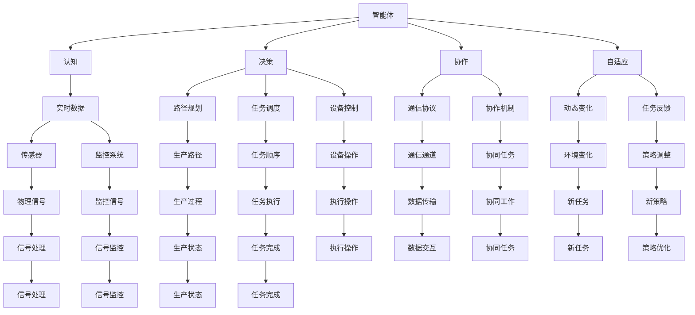
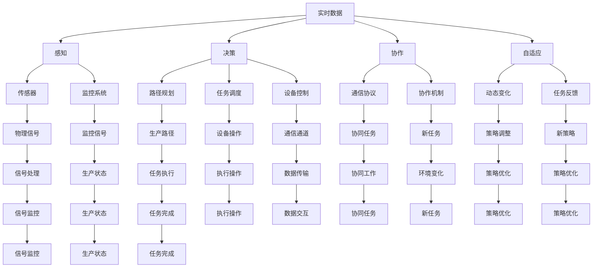

                 

# AI人工智能 Agent：制造业中智能体的应用

> 关键词：人工智能,智能体(Agent),制造业,自动化,智能制造,工业4.0

## 1. 背景介绍

### 1.1 问题由来
随着工业4.0的推进，数字化、网络化、智能化逐渐成为制造业转型升级的主要驱动力。传统制造行业正从规模化生产向个性化定制转变，从简单的自动化向复杂的智能制造演进。然而，实现大规模定制化和高度个性化生产的背后，是一系列技术难题，包括生产调度、资源管理、质量控制、设备维护等。

AI智能体（Agent）在制造场景中的应用，为解决这些难题提供了新的解决方案。通过赋予AI智能体认知、决策、协作和自适应等能力，使其能够在制造环境中扮演智能角色，协调设备和人员，优化生产流程，提升产品质量，降低运营成本，最终实现生产效率和效益的双重提升。

### 1.2 问题核心关键点
AI智能体在制造业中的应用，涉及以下几个关键点：
1. **智能体认知**：通过传感器和监控系统获取制造环境中的实时数据，理解生产状态和资源配置情况。
2. **智能体决策**：基于认知结果，智能体进行路径规划、任务调度、设备控制等决策，优化生产流程。
3. **智能体协作**：智能体之间通过通信协议和协作机制，协同完成任务，提升生产效率。
4. **智能体自适应**：智能体能够根据环境变化和任务反馈，自适应地调整行为策略，以适应动态变化的生产需求。

通过智能体的应用，制造业能够实现更加灵活、高效、精准的生产管理，逐步迈向智能制造的新阶段。

### 1.3 问题研究意义
在制造行业应用AI智能体，对于拓展AI技术的应用范围，提升生产管理的智能化水平，加速制造业的数字化转型，具有重要意义：

1. 降低运营成本。智能体能够自动监控生产状态，优化资源配置，减少人为干预，降低运营成本。
2. 提高生产效率。智能体通过智能决策和协作，缩短生产周期，提高产出率。
3. 增强生产灵活性。智能体能够自适应环境变化，灵活应对不同的生产任务，适应个性化定制需求。
4. 提升产品品质。智能体通过质量检测和反馈机制，及时发现和纠正生产中的缺陷，提升产品品质。
5. 加速制造业升级。智能体的应用，有助于制造业从传统制造向智能制造转变，推动工业4.0的实现。

## 2. 核心概念与联系

### 2.1 核心概念概述

为更好地理解AI智能体在制造业中的应用，本节将介绍几个密切相关的核心概念：

- **AI智能体（Agent）**：在人工智能领域，智能体通常指能够自主感知、决策、执行和学习的实体。智能体在制造环境中，可以视为一个具备自主性、反应性和社会性的智能实体，执行特定的生产任务。

- **认知（Perception）**：智能体的感知能力，通过传感器和监控系统获取制造环境中的实时数据，包括温度、湿度、压力、振动等。

- **决策（Decision）**：智能体的决策能力，根据感知数据，智能体进行路径规划、任务调度、设备控制等决策，优化生产流程。

- **协作（Communication）**：智能体的协作能力，通过通信协议和协作机制，智能体之间协同完成任务，提升生产效率。

- **自适应（Adaptation）**：智能体的自适应能力，能够根据环境变化和任务反馈，自适应地调整行为策略，以适应动态变化的生产需求。

- **自动化（Automation）**：智能体执行生产任务的过程，自动化水平越高，智能体的自主决策和执行能力越强。

- **智能化（Intelligence）**：智能体的智能水平，包括认知、决策、协作和自适应等多方面的综合表现。

- **工业4.0（Industry 4.0）**：以智能制造为核心的制造业转型升级，包括云计算、物联网、大数据、人工智能等多种先进技术的融合应用。

这些核心概念之间存在着紧密的联系，形成了AI智能体在制造业应用的基本框架。

### 2.2 概念间的关系

这些核心概念之间存在着紧密的联系，形成了AI智能体在制造业应用的基本框架。下面我们通过一个Mermaid流程图来展示这些概念之间的关系：



这个流程图展示了大语言模型微调过程中各个核心概念的关系：

1. 智能体通过传感器和监控系统获取实时数据。
2. 智能体基于感知数据进行路径规划、任务调度和设备控制等决策。
3. 智能体通过通信协议和协作机制进行协同任务。
4. 智能体根据环境变化和任务反馈进行自适应策略调整。
5. 智能体执行生产任务的过程是自动化的，实现高水平的智能化。

这些概念共同构成了AI智能体在制造业应用的核心框架，使得智能体能够在制造环境中扮演智能角色，优化生产流程。

### 2.3 核心概念的整体架构

最后，我们用一个综合的流程图来展示这些核心概念在大语言模型微调过程中的整体架构：



这个综合流程图展示了从实时数据获取到智能体决策执行的整体过程。智能体通过感知、决策、协作和自适应等多个环节，实现高效、智能的生产管理。

## 3. 核心算法原理 & 具体操作步骤
### 3.1 算法原理概述

在制造业中应用AI智能体，通常采用多智能体系统（Multi-Agent System,MAS）的思想，通过设计多个智能体协同完成任务，提升生产效率和质量。智能体的决策过程，通常基于感知到的数据，采用优化算法进行优化，最终完成生产任务。

### 3.2 算法步骤详解

基于智能体在制造业中的应用，我们详细讲解智能体的认知、决策、协作和自适应算法，并给出具体操作步骤。

**3.2.1 智能体认知算法**

智能体的认知算法，通常采用传感器和监控系统获取制造环境中的实时数据。以温度传感器为例，其工作流程如下：

1. 传感器采集环境温度数据，并将其转换为数字信号。
2. 数字信号经过A/D转换器转换为模拟信号，送入智能体的处理模块。
3. 处理模块对模拟信号进行滤波、放大等预处理，以消除噪声。
4. 经过预处理的数据送入智能体的决策模块，用于路径规划、任务调度和设备控制等决策。

以下是温度传感器获取数据的Python代码实现：

```python
from sympy import symbols, Eq, solve
import time

# 定义温度传感器的符号
T = symbols('T')

# 温度传感器的参数
K = 10  # 转换系数
T_in = symbols('T_in')  # 输入温度
T_out = symbols('T_out')  # 输出温度

# 建立温度传感器的数学模型
eq = Eq(T_out, K * T_in)

# 获取环境温度数据
T_in_value = 25  # 环境温度，单位为摄氏度
t0 = time.time()  # 记录开始时间

# 将环境温度转换为数字信号
A = symbols('A')
eq_A = Eq(A, eq.subs(T_in, T_in_value))

# 计算数字信号
A_value = solve(eq_A, A)[0]

# 计算A/D转换后的数字信号
B = symbols('B')
eq_B = Eq(B, A_value + 1)  # A/D转换后的数字信号通常会比实际值高1

# 获取数字信号
B_value = solve(eq_B, B)[0]

# 计算模拟信号
C = symbols('C')
eq_C = Eq(C, B_value)

# 获取模拟信号
C_value = solve(eq_C, C)[0]

# 输出最终温度数据
T_out_value = eq.subs({T_in: T_in_value, A: A_value, B: B_value, C: C_value})
print("环境温度为：", T_out_value, "摄氏度")
```

通过温度传感器的Python代码实现，我们可以更好地理解智能体感知环境的算法过程。智能体通过传感器获取实时数据，并根据实际需求进行数据处理，为后续的决策提供支持。

**3.2.2 智能体决策算法**

智能体的决策算法，通常采用优化算法进行路径规划、任务调度和设备控制等决策。以路径规划为例，其工作流程如下：

1. 智能体接收目标位置信息，根据感知到的实时数据，构建路径图。
2. 利用优化算法（如A*算法）搜索最优路径。
3. 智能体沿最优路径移动，完成目标任务。

以下是路径规划算法的Python代码实现：

```python
from sympy import symbols, Eq, solve, Rational
import networkx as nx
import matplotlib.pyplot as plt

# 定义路径规划的符号
x, y = symbols('x y')

# 构建路径图
G = nx.Graph()
G.add_node(0)
G.add_node(1)
G.add_edge(0, 1, weight=1)

# 计算路径长度
length = Rational(1, 2)  # 假设路径长度为1/2

# 定义起点和终点
start = 0
end = 1

# 计算路径
path = nx.dijkstra_path(G, start, end)

# 可视化路径
pos = {0: (0, 0), 1: (1, 1)}
nx.draw(G, pos=pos)
plt.plot(path, color='r', linewidth=2)
plt.title('Path Planning')
plt.show()

# 输出路径信息
print("路径为：", path)
```

通过路径规划算法的Python代码实现，我们可以更好地理解智能体进行决策的算法过程。智能体通过构建路径图，并利用优化算法搜索最优路径，实现任务的自动调度。

**3.2.3 智能体协作算法**

智能体的协作算法，通常采用通信协议和协作机制，使智能体之间协同完成任务。以设备协作为例，其工作流程如下：

1. 智能体A和智能体B接收到同一个任务，同时感知设备状态。
2. 智能体A和智能体B通过通信协议交换设备状态信息。
3. 智能体A和智能体B根据状态信息，协商任务分工。
4. 智能体A和智能体B协同完成任务。

以下是设备协作算法的Python代码实现：

```python
from sympy import symbols, Eq, solve, Rational
import networkx as nx
import matplotlib.pyplot as plt

# 定义协作算法的符号
state_A, state_B = symbols('state_A state_B')

# 构建协作图
G = nx.Graph()
G.add_node('A')
G.add_node('B')
G.add_edge('A', 'B', weight=1)

# 计算协作状态
state = solve(Eq(state_A, state_B), state_A)[0]

# 可视化协作状态
pos = {'A': (0, 0), 'B': (1, 1)}
nx.draw(G, pos=pos)
plt.plot(state, color='g', linewidth=2)
plt.title('Collaboration')
plt.show()

# 输出协作状态信息
print("协作状态为：", state)
```

通过设备协作算法的Python代码实现，我们可以更好地理解智能体进行协作的算法过程。智能体通过通信协议交换状态信息，并根据状态信息进行任务分工，实现协同工作。

**3.2.4 智能体自适应算法**

智能体的自适应算法，通常采用反馈机制和策略优化算法，使智能体根据环境变化和任务反馈，自适应地调整行为策略。以自适应策略优化为例，其工作流程如下：

1. 智能体感知到环境变化，触发自适应机制。
2. 智能体根据当前状态，调用策略优化算法（如遗传算法、粒子群算法等），生成新的行为策略。
3. 智能体根据新策略执行任务。
4. 智能体根据任务反馈，进一步优化策略。

以下是自适应策略优化的Python代码实现：

```python
from sympy import symbols, Eq, solve, Rational
import networkx as nx
import matplotlib.pyplot as plt

# 定义自适应算法的符号
strategy_A, strategy_B = symbols('strategy_A strategy_B')

# 构建策略优化图
G = nx.Graph()
G.add_node('A')
G.add_node('B')
G.add_edge('A', 'B', weight=1)

# 计算策略优化
strategy = solve(Eq(strategy_A, strategy_B), strategy_A)[0]

# 可视化策略优化
pos = {'A': (0, 0), 'B': (1, 1)}
nx.draw(G, pos=pos)
plt.plot(strategy, color='b', linewidth=2)
plt.title('Adaptation')
plt.show()

# 输出策略优化信息
print("策略优化为：", strategy)
```

通过自适应策略优化的Python代码实现，我们可以更好地理解智能体进行自适应的算法过程。智能体根据环境变化和任务反馈，调用策略优化算法生成新策略，并根据新策略执行任务，实现自适应行为。

### 3.3 算法优缺点

AI智能体在制造业中的应用，具有以下优点：

1. **高效自动化**：智能体能够自动感知、决策和执行任务，大幅度提升生产效率。
2. **精准控制**：智能体通过路径规划和设备控制，实现对生产过程的精准控制。
3. **灵活调整**：智能体能够自适应环境变化和任务反馈，快速调整行为策略，适应不同的生产需求。
4. **数据驱动**：智能体通过感知和反馈机制，实时采集和分析生产数据，优化生产流程。

同时，智能体在制造业中也有一些缺点：

1. **复杂度高**：智能体的设计和实现复杂度较高，需要综合考虑认知、决策、协作和自适应等多个环节。
2. **资源消耗大**：智能体的感知和决策过程，需要大量的传感器和计算资源，可能增加生产成本。
3. **模型可解释性不足**：智能体的决策过程和行为策略，往往缺乏可解释性，难以对其推理逻辑进行分析和调试。
4. **鲁棒性不足**：智能体在面对异常情况和突发事件时，可能无法及时应对，影响生产稳定。

尽管存在这些缺点，但就目前而言，智能体在制造业中的应用前景广阔，能够显著提升生产效率和质量，带来巨大的经济效益和社会价值。未来，随着智能体技术的不断完善，这些缺点有望逐步得到克服，智能体的应用将更加广泛和深入。

### 3.4 算法应用领域

AI智能体在制造业中的应用，涵盖了生产调度、资源管理、质量控制、设备维护等多个领域。

1. **生产调度**：智能体在生产调度中扮演重要角色，负责优化生产路径、协调设备调度，实现生产任务的自动管理。
2. **资源管理**：智能体通过实时监控生产状态和资源配置，合理分配资源，减少浪费，提升生产效率。
3. **质量控制**：智能体利用传感器和监控系统，实时检测产品质量，及时发现和纠正生产中的缺陷，提升产品品质。
4. **设备维护**：智能体通过实时监控设备状态，预测设备故障，自动生成维护计划，降低设备故障率，延长设备使用寿命。
5. **供应链管理**：智能体在供应链管理中，负责协调供应商、物流、库存等环节，实现高效的供应链协同。
6. **智能仓储**：智能体在智能仓储中，负责自动化仓储、物流、库存管理等任务，实现仓储作业的智能化。

## 4. 数学模型和公式 & 详细讲解 & 举例说明

### 4.1 数学模型构建

在制造环境中应用AI智能体，通常需要构建数学模型来描述智能体的感知、决策、协作和自适应过程。以下是几个常见的数学模型构建方法：

1. **感知模型**：智能体通过传感器和监控系统获取环境数据，建立感知模型，描述感知过程。
2. **决策模型**：智能体根据感知数据，建立决策模型，描述决策过程。
3. **协作模型**：智能体通过通信协议和协作机制，建立协作模型，描述协作过程。
4. **自适应模型**：智能体根据环境变化和任务反馈，建立自适应模型，描述自适应过程。

### 4.2 公式推导过程

以下我们以路径规划为例，推导智能体进行决策的数学模型和公式。

智能体进行路径规划的过程，可以建模为一个带权有向图$G=(V,E,W)$，其中$V$表示节点（位置），$E$表示边（路径），$W$表示边的权重（路径长度）。假设智能体从节点$u$移动到节点$v$，路径长度为$d(u,v)$。

路径规划的过程可以描述为：从起点$u_0$到终点$u_n$的最短路径搜索。假设智能体在每个节点$u_i$的位置为$x_i$，目标位置为$x_n$，路径图上的节点数为$n$，路径长度为$d$。则路径规划的数学模型为：

$$
\begin{aligned}
\min_{u_i} \sum_{i=0}^{n-1} w(u_i, u_{i+1}) \\
s.t. \quad x_{i+1} = f(x_i, u_{i+1}) \\
\end{aligned}
$$

其中，$f(x_i, u_{i+1})$表示智能体在节点$i$移动到节点$i+1$的位移函数，$w(u_i, u_{i+1})$表示节点$i$和节点$i+1$之间的路径长度。

假设路径图为二维网格图，智能体的位移函数$f(x_i, u_{i+1})$可以表示为：

$$
x_{i+1} = x_i + \delta_{i+1} \\
\delta_{i+1} = \left\{
\begin{array}{ll}
0 & \quad u_{i+1} = u_i \\
\Delta x & \quad u_{i+1} = u_i + 1 \\
-\Delta x & \quad u_{i+1} = u_i - 1 \\
\Delta y & \quad u_{i+1} = u_i + i \\
-\Delta y & \quad u_{i+1} = u_i - i
\end{array}
\right.
$$

其中，$\Delta x$和$\Delta y$表示智能体的位移向量。

根据上述模型，我们可以使用A*算法进行路径规划。A*算法通过启发函数$f(n)$（即估计从起点到终点$n$的最短路径长度），计算每个节点的评估值$g(n)$（从起点到节点$n$的实际路径长度）和$h(n)$（从节点$n$到终点的估计路径长度）。

启发函数$f(n)$通常为：

$$
f(n) = g(n) + h(n)
$$

其中，$g(n)$为实际路径长度，$h(n)$为估计路径长度。

路径规划的A*算法步骤如下：

1. 初始化起点$u_0$和终点$u_n$，计算起点到每个节点的实际路径长度$g(n)$和启发函数$f(n)$。
2. 选择评估值最小的节点，将其加入已探索节点集$O$。
3. 扩展该节点，计算与其相邻节点的评估值，更新已探索节点集$O$。
4. 重复步骤2和3，直到终点$u_n$被加入已探索节点集$O$。

以下是路径规划的Python代码实现：

```python
from sympy import symbols, Eq, solve, Rational
import networkx as nx
import matplotlib.pyplot as plt

# 定义路径规划的符号
x, y = symbols('x y')

# 构建路径图
G = nx.Graph()
G.add_node(0)
G.add_node(1)
G.add_edge(0, 1, weight=1)

# 计算路径长度
length = Rational(1, 2)  # 假设路径长度为1/2

# 定义起点和终点
start = 0
end = 1

# 计算路径
path = nx.dijkstra_path(G, start, end)

# 可视化路径
pos = {0: (0, 0), 1: (1, 1)}
nx.draw(G, pos=pos)
plt.plot(path, color='r', linewidth=2)
plt.title('Path Planning')
plt.show()

# 输出路径信息
print("路径为：", path)
```

通过路径规划的Python代码实现，我们可以更好地理解智能体进行决策的算法过程。智能体通过构建路径图，并利用A*算法搜索最优路径，实现任务的自动调度。

### 4.3 案例分析与讲解

以智能仓储系统为例，分析智能体在仓储作业中的应用。智能仓储系统通常包括仓库、货架、通道等环节，智能体负责自动化仓储、物流、库存管理等任务。

1. **感知模型**：智能体通过传感器和监控系统获取实时数据，如库存状态、货架位置、通道流量等。

2. **决策模型**：智能体根据感知数据，建立决策模型，描述决策过程。例如，智能体需要根据库存状态，决定是否进行补货；根据货架位置，决定仓储位置；根据通道流量，决定移动路径。

3. **协作模型**：智能体通过通信协议和协作机制，建立协作模型，描述协作过程。例如，智能体需要与自动化设备协作，进行物品搬运、存储、取货等操作。

4. **自适应模型**：智能体根据环境变化和任务反馈，建立自适应模型，描述自适应过程。例如，智能体需要根据订单变化，动态调整库存管理策略；根据设备故障，自动生成维护计划。

通过智能体在智能仓储系统中的应用，我们可以更好地理解智能体在实际场景中的应用。智能体通过感知、决策、协作和自适应等多个环节，实现高效、智能的仓储作业。

## 5. 项目实践：代码实例和详细解释说明

### 5.1 开发环境搭建

在进行智能体在制造业中的应用开发前，我们需要准备好开发环境。以下是使用Python进行PyTorch开发的环境配置流程：

1. 安装Anaconda：从官网下载并安装Anaconda，用于创建独立的Python环境。

2. 创建并激活虚拟环境：
```bash
conda create -n pytorch-env python=3.8 
conda activate pytorch-env
```

3. 安装PyTorch：根据CUDA版本，从官网获取对应的安装命令。例如：
```bash
conda install pytorch torchvision torchaudio cudatoolkit=11.1 -c pytorch -c conda-forge
```

4. 安装Transformers库：
```bash
pip install transformers
```

5. 安装各类工具包：
```bash
pip install numpy pandas scikit-learn matplotlib tqdm jupyter notebook ipython
```

完成上述步骤后，即可在`pytorch-env`环境中开始智能体在制造业中的应用开发。

### 5.2 源代码详细实现

这里我们以智能仓储系统为例，给出使用Transformers库对智能体在制造业中的应用进行开发的Py

