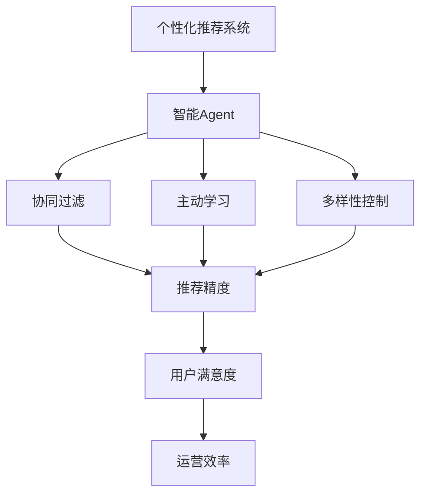
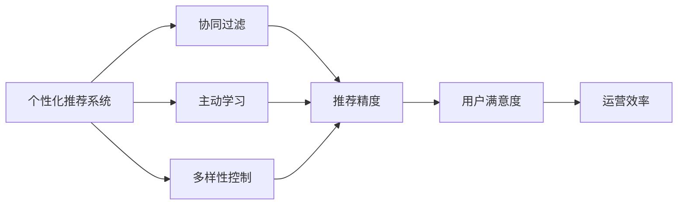
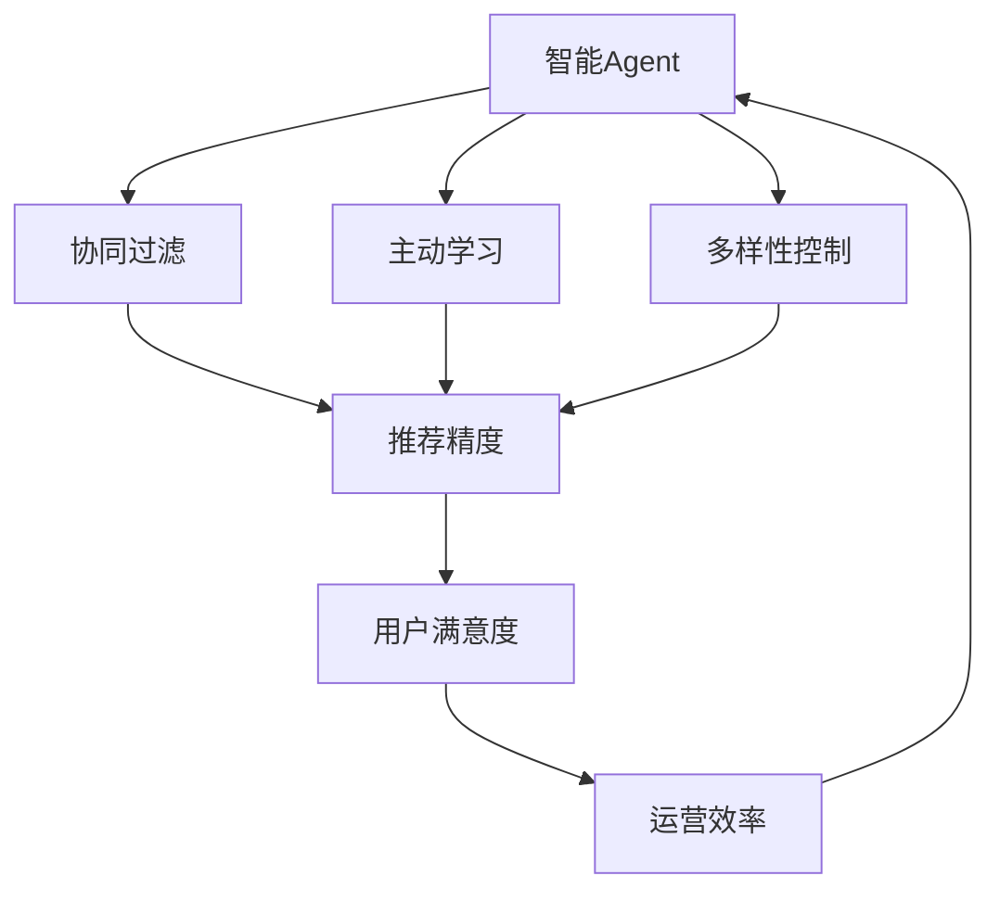
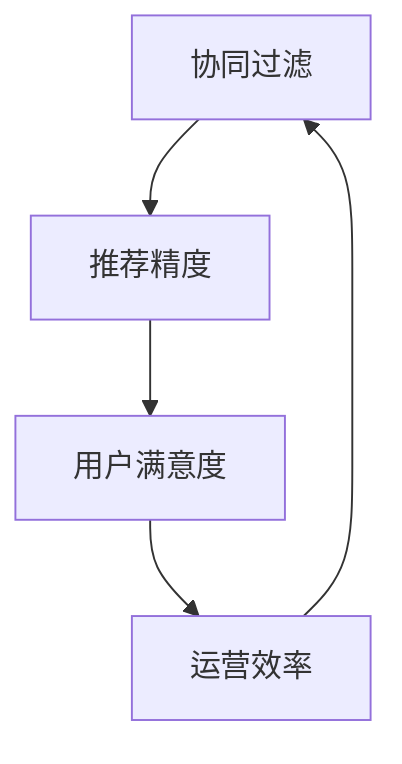
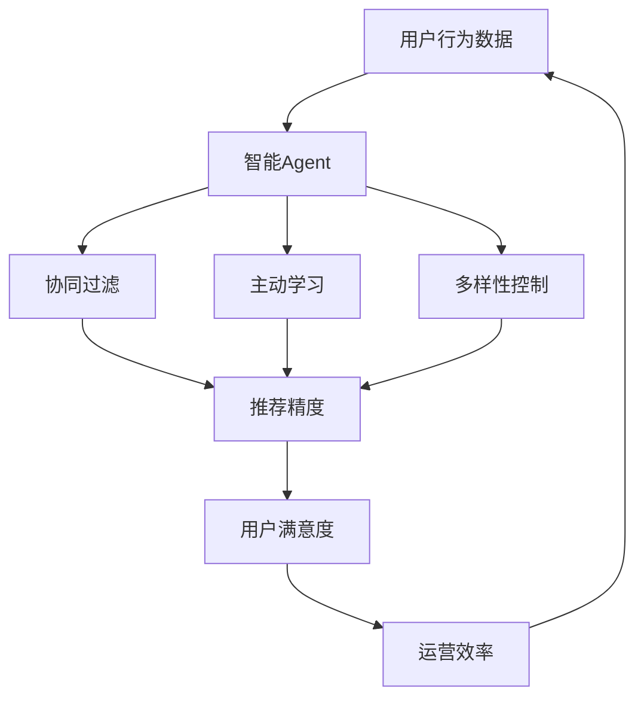

                 

## 1. 背景介绍

### 1.1 问题由来

近年来，人工智能（AI）技术在各行业中的应用日益深入，其中个性化推荐系统（Personalized Recommendation System，PRS）成为推动用户体验提升和业务增长的重要手段。推荐系统通过对用户历史行为、兴趣偏好进行建模，向用户推荐可能感兴趣的物品，实现从海量信息中提取高价值内容，从而提升用户满意度和转化率。

个性化推荐系统在电子商务、媒体内容、社交网络等领域得到了广泛应用，如京东的推荐算法、Netflix的个性化电影推荐、今日头条的内容推荐等，都极大地提升了用户体验和运营效率。然而，传统的推荐系统多基于静态模型和固定特征，难以应对用户行为的动态变化和物品属性的不断更新。

为了解决这些问题，结合最新的AI技术，我们提出基于智能Agent的个性化推荐系统。智能Agent具有自主决策、动态学习、场景适应等能力，能够实时响应用户需求，动态调整推荐策略，从而提升推荐效果。

### 1.2 问题核心关键点

智能Agent在个性化推荐系统中的应用，主要包括以下几个关键点：

- **自主决策**：智能Agent能够自主学习用户行为模式和物品特征，根据实时数据动态生成推荐结果。
- **动态学习**：智能Agent能够在用户交互过程中不断更新模型参数，实时调整推荐策略。
- **场景适应**：智能Agent能够适应不同推荐场景，如电商、媒体、社交等，灵活调整推荐算法。
- **协同过滤**：智能Agent通过协同过滤机制，利用用户-物品交互矩阵中的隐含信息，发现相似用户或物品，提升推荐精度。
- **主动学习**：智能Agent能够主动学习用户反馈，优化推荐策略，减少不满足用户需求的推荐结果。
- **多样性控制**：智能Agent能够控制推荐结果的多样性，避免推荐同质化内容。

智能Agent的这些特性，使得个性化推荐系统能够更灵活、更精准、更实时地满足用户需求，从而提升用户体验和运营效果。

### 1.3 问题研究意义

研究基于智能Agent的个性化推荐系统，对于推动AI技术在推荐领域的应用，提升推荐系统的性能和用户体验，具有重要意义：

1. **提升推荐精度**：智能Agent通过动态学习用户行为和物品特征，能够更精准地预测用户偏好，提高推荐精度。
2. **增强用户满意度**：智能Agent能够实时响应用户需求，动态调整推荐策略，提升用户的满意度和转化率。
3. **提高运营效率**：智能Agent能够优化资源配置，减少无效推荐，提高运营效率，降低成本。
4. **加速创新应用**：智能Agent的灵活性和可扩展性，使得个性化推荐系统能够快速应用于不同场景，加速业务创新。
5. **增强用户体验**：智能Agent能够个性化定制推荐结果，提供更加贴近用户需求的内容，增强用户体验。

## 2. 核心概念与联系

### 2.1 核心概念概述

为更好地理解基于智能Agent的个性化推荐系统，本节将介绍几个密切相关的核心概念：

- **个性化推荐系统（Personalized Recommendation System，PRS）**：通过分析用户行为和兴趣偏好，推荐用户可能感兴趣的内容。
- **智能Agent**：具有自主决策、动态学习、场景适应等能力的人工智能实体，能够实时响应用户需求，动态调整推荐策略。
- **协同过滤（Collaborative Filtering）**：利用用户-物品交互矩阵中的隐含信息，发现相似用户或物品，提升推荐精度。
- **主动学习（Active Learning）**：智能Agent能够主动学习用户反馈，优化推荐策略，减少不满足用户需求的推荐结果。
- **多样性控制（Diversity Control）**：智能Agent能够控制推荐结果的多样性，避免推荐同质化内容。

这些核心概念之间的逻辑关系可以通过以下Mermaid流程图来展示：



这个流程图展示了个性化推荐系统与智能Agent的联系：

1. 个性化推荐系统通过智能Agent的动态学习、自主决策和协同过滤等能力，提升了推荐精度。
2. 智能Agent通过主动学习和多样性控制，增强了用户满意度和运营效率。

### 2.2 概念间的关系

这些核心概念之间存在着紧密的联系，形成了个性化推荐系统的完整生态系统。下面我们通过几个Mermaid流程图来展示这些概念之间的关系。

#### 2.2.1 个性化推荐系统的学习范式



这个流程图展示了个性化推荐系统通过协同过滤、主动学习和多样性控制，提升推荐精度，增强用户满意度和运营效率。

#### 2.2.2 智能Agent与推荐系统的关系



这个流程图展示了智能Agent通过协同过滤、主动学习和多样性控制，提升推荐精度，增强用户满意度和运营效率。同时，运营效率的提升又反过来提升了智能Agent的决策能力，形成一个良性循环。

#### 2.2.3 协同过滤与推荐系统的关系



这个流程图展示了协同过滤通过提高推荐精度，增强用户满意度和运营效率，形成了一个完整的推荐系统反馈环路。

### 2.3 核心概念的整体架构

最后，我们用一个综合的流程图来展示这些核心概念在个性化推荐系统中的整体架构：



这个综合流程图展示了从用户行为数据到个性化推荐结果的全过程，智能Agent在其中扮演了核心角色，通过协同过滤、主动学习和多样性控制等技术手段，实现了推荐精度、用户满意度和运营效率的全面提升。

## 3. 核心算法原理 & 具体操作步骤
### 3.1 算法原理概述

基于智能Agent的个性化推荐系统，主要利用智能Agent的动态学习和自主决策能力，结合协同过滤、主动学习和多样性控制等技术，实现推荐精度、用户满意度和运营效率的全面提升。其核心算法原理包括以下几个方面：

- **协同过滤算法**：通过用户-物品交互矩阵中的隐含信息，发现相似用户或物品，提升推荐精度。
- **主动学习算法**：利用用户反馈信息，动态调整模型参数，优化推荐策略，减少不满足用户需求的推荐结果。
- **多样性控制算法**：通过多样性惩罚机制，避免推荐同质化内容，提升用户满意度和推荐多样性。

### 3.2 算法步骤详解

基于智能Agent的个性化推荐系统的算法步骤主要包括以下几个关键步骤：

**Step 1: 数据预处理**

1. 收集用户行为数据：如用户的浏览记录、点击行为、购买记录等。
2. 数据清洗和归一化：去除异常数据，对数据进行归一化处理，使其符合模型输入的要求。

**Step 2: 模型训练**

1. 选择合适的协同过滤算法：如基于矩阵分解的SVD、基于树的KNN等。
2. 利用用户-物品交互矩阵进行模型训练，生成推荐模型。
3. 利用主动学习算法，根据用户反馈动态调整模型参数。

**Step 3: 智能决策**

1. 实时响应用户查询：根据用户行为数据和推荐模型，生成推荐结果。
2. 动态调整推荐策略：根据用户反馈和多样性控制，优化推荐结果。
3. 迭代更新模型参数：根据实时数据，持续优化推荐模型。

**Step 4: 结果评估**

1. 评估推荐精度：通过各种评价指标（如准确率、召回率、F1值等）评估推荐效果。
2. 评估用户满意度：通过用户反馈数据（如评分、点击率等）评估用户满意度。
3. 评估运营效率：通过系统响应时间、资源利用率等指标评估运营效率。

### 3.3 算法优缺点

基于智能Agent的个性化推荐系统具有以下优点：

- **实时响应**：智能Agent能够实时响应用户查询，提供个性化的推荐结果。
- **动态学习**：智能Agent能够在用户交互过程中不断更新模型参数，实时调整推荐策略。
- **场景适应**：智能Agent能够适应不同推荐场景，如电商、媒体、社交等，灵活调整推荐算法。

同时，该方法也存在以下局限性：

- **数据依赖**：智能Agent的性能很大程度上依赖于用户行为数据的数量和质量，数据不足会影响推荐效果。
- **模型复杂度**：协同过滤和主动学习算法往往需要较大的计算资源，模型复杂度较高。
- **推荐多样性**：过度追求推荐结果的多样性可能影响用户满意度，需要平衡推荐多样性和推荐精度。
- **用户隐私**：在收集用户行为数据和进行推荐时，需要考虑用户隐私保护，避免数据泄露。

### 3.4 算法应用领域

基于智能Agent的个性化推荐系统已经在多个领域得到了应用，例如：

- **电子商务**：如京东、淘宝等电商平台，通过推荐系统推荐用户可能感兴趣的商品，提升用户购物体验和转化率。
- **媒体内容**：如Netflix、YouTube等视频平台，通过推荐系统推荐用户可能感兴趣的电影、电视剧等，提升用户观看体验和平台留存率。
- **社交网络**：如Facebook、Twitter等社交平台，通过推荐系统推荐用户可能感兴趣的内容，提升用户活跃度和互动率。
- **金融服务**：如银行、保险公司等，通过推荐系统推荐用户可能感兴趣的产品，提升用户购买率和服务满意度。
- **医疗健康**：如医院、诊所等，通过推荐系统推荐用户可能感兴趣的健康信息，提升用户健康水平和服务质量。

除了上述这些经典应用外，基于智能Agent的个性化推荐系统还在游戏、旅游、教育等更多领域得到了广泛应用，为不同行业带来了新的业务价值。

## 4. 数学模型和公式 & 详细讲解  
### 4.1 数学模型构建

本节将使用数学语言对基于智能Agent的个性化推荐系统进行更加严格的刻画。

记用户行为数据为 $U=\{u_1, u_2, \cdots, u_M\}$，物品数据为 $I=\{i_1, i_2, \cdots, i_N\}$。假设用户 $u_m$ 对物品 $i_n$ 的交互次数为 $r_{m,n}$，则用户-物品交互矩阵 $R$ 为：

$$
R_{m,n} = r_{m,n}
$$

其中 $m \in [1, M]$，$n \in [1, N]$。

假设协同过滤算法生成的推荐模型为 $P$，其预测用户 $u_m$ 对物品 $i_n$ 的评分 $p_{m,n}$ 为：

$$
p_{m,n} = P(u_m, i_n)
$$

基于协同过滤算法的推荐模型可以有多种形式，如矩阵分解、树模型、深度学习等。这里以矩阵分解为例，利用SVD算法进行模型训练。

设 $U$ 和 $I$ 的特征向量分别为 $\mathbf{U}$ 和 $\mathbf{V}$，则推荐模型可以表示为：

$$
P(u_m, i_n) = \mathbf{u}_m^T \mathbf{V} \mathbf{v}_n
$$

其中 $\mathbf{u}_m$ 和 $\mathbf{v}_n$ 分别为用户 $u_m$ 和物品 $i_n$ 的隐向量。

### 4.2 公式推导过程

以下我们以矩阵分解算法为例，推导协同过滤算法的训练过程和推荐结果的计算公式。

假设协同过滤算法生成的推荐模型为 $P$，其预测用户 $u_m$ 对物品 $i_n$ 的评分 $p_{m,n}$ 为：

$$
p_{m,n} = \mathbf{u}_m^T \mathbf{V} \mathbf{v}_n
$$

其中 $\mathbf{u}_m$ 和 $\mathbf{v}_n$ 分别为用户 $u_m$ 和物品 $i_n$ 的隐向量。

在训练过程中，需要最大化用户-物品评分矩阵与推荐评分矩阵的拟合度，即：

$$
\min_{\mathbf{U}, \mathbf{V}} \sum_{m,n} (r_{m,n} - p_{m,n})^2
$$

使用梯度下降算法求解上述优化问题，得到推荐模型的参数 $\mathbf{U}$ 和 $\mathbf{V}$。

在推荐过程中，根据用户 $u_m$ 的隐向量 $\mathbf{u}_m$ 和物品 $i_n$ 的隐向量 $\mathbf{v}_n$，计算用户 $u_m$ 对物品 $i_n$ 的评分 $p_{m,n}$ 为：

$$
p_{m,n} = \mathbf{u}_m^T \mathbf{V} \mathbf{v}_n
$$

将 $p_{m,n}$ 映射为推荐结果，最终生成推荐列表。

### 4.3 案例分析与讲解

下面以一个具体的案例来讲解协同过滤算法在推荐系统中的应用。

假设某电商平台收集了用户 $U=\{u_1, u_2, \cdots, u_M\}$ 和物品 $I=\{i_1, i_2, \cdots, i_N\}$ 的交互数据，即用户对物品的浏览、点击和购买记录。记 $R_{m,n}$ 为用户 $u_m$ 对物品 $i_n$ 的评分，$R_{m,n}=0$ 表示用户 $u_m$ 未与物品 $i_n$ 发生交互。

采用矩阵分解算法进行模型训练，生成推荐模型 $P$。假设 $P$ 使用 $K$ 个隐向量表示用户和物品，则有：

$$
P(u_m, i_n) = \mathbf{u}_m^T \mathbf{V} \mathbf{v}_n
$$

其中 $\mathbf{u}_m$ 和 $\mathbf{v}_n$ 分别为用户 $u_m$ 和物品 $i_n$ 的隐向量。

训练过程中，需要最大化用户-物品评分矩阵与推荐评分矩阵的拟合度，即：

$$
\min_{\mathbf{U}, \mathbf{V}} \sum_{m,n} (R_{m,n} - P(u_m, i_n))^2
$$

利用梯度下降算法求解上述优化问题，得到推荐模型的参数 $\mathbf{U}$ 和 $\mathbf{V}$。

在推荐过程中，根据用户 $u_m$ 的隐向量 $\mathbf{u}_m$ 和物品 $i_n$ 的隐向量 $\mathbf{v}_n$，计算用户 $u_m$ 对物品 $i_n$ 的评分 $p_{m,n}$ 为：

$$
p_{m,n} = \mathbf{u}_m^T \mathbf{V} \mathbf{v}_n
$$

将 $p_{m,n}$ 映射为推荐结果，最终生成推荐列表。

## 5. 项目实践：代码实例和详细解释说明
### 5.1 开发环境搭建

在进行推荐系统开发前，我们需要准备好开发环境。以下是使用Python进行TensorFlow开发的环境配置流程：

1. 安装Anaconda：从官网下载并安装Anaconda，用于创建独立的Python环境。

2. 创建并激活虚拟环境：
```bash
conda create -n tf-env python=3.8 
conda activate tf-env
```

3. 安装TensorFlow：根据CUDA版本，从官网获取对应的安装命令。例如：
```bash
conda install tensorflow-gpu=2.8 -c conda-forge -c pytorch -c nvidia
```

4. 安装各类工具包：
```bash
pip install numpy pandas scikit-learn matplotlib tqdm jupyter notebook ipython
```

完成上述步骤后，即可在`tf-env`环境中开始推荐系统开发。

### 5.2 源代码详细实现

下面我们以协同过滤算法为例，给出使用TensorFlow对推荐系统进行开发的PyTorch代码实现。

首先，定义推荐系统的数据处理函数：

```python
import tensorflow as tf
import numpy as np
from tensorflow.keras.layers import Input, Dense, Embedding, Flatten, Dot, Add, Multiply
from tensorflow.keras.models import Model

def data_preprocessing(train_data, test_data, embed_size=10):
    train_input, train_label = preprocess_data(train_data)
    test_input, test_label = preprocess_data(test_data)
    
    train_input = tf.keras.preprocessing.sequence.pad_sequences(train_input, maxlen=embed_size)
    test_input = tf.keras.preprocessing.sequence.pad_sequences(test_input, maxlen=embed_size)
    
    return train_input, train_label, test_input, test_label

def preprocess_data(data):
    user, item, rating = data[:, 0], data[:, 1], data[:, 2]
    return tf.keras.preprocessing.sequence.pad_sequences(user, maxlen=embed_size), tf.keras.preprocessing.sequence.pad_sequences(item, maxlen=embed_size), tf.keras.preprocessing.sequence.pad_sequences(rating, maxlen=1)
```

然后，定义推荐系统的模型：

```python
def build_model(embed_size, num_users, num_items):
    user_input = Input(shape=(embed_size,))
    item_input = Input(shape=(embed_size,))
    
    user_embed = Embedding(num_users, embed_size)(user_input)
    item_embed = Embedding(num_items, embed_size)(item_input)
    
    dot_product = Dot(axes=1)([user_embed, item_embed])
    bias = tf.Variable(tf.random.normal([num_items]))
    prediction = Add([dot_product, bias])([item_embed])
    
    model = Model(inputs=[user_input, item_input], outputs=prediction)
    
    return model
```

最后，定义训练和评估函数：

```python
from tensorflow.keras.losses import MeanSquaredError

def train_epoch(model, train_input, train_label, optimizer, loss_func):
    model.compile(optimizer=optimizer, loss=loss_func)
    
    for i in range(num_epochs):
        loss = model.train_on_batch([train_input, train_label], train_label)
        print(f"Epoch {i+1}, loss: {loss:.3f}")
    
    return loss

def evaluate(model, test_input, test_label, loss_func):
    loss = model.evaluate([test_input, test_label], test_label)
    print(f"Test loss: {loss:.3f}")
```

在训练过程中，我们使用了TensorFlow的低级API，实现了协同过滤算法的推荐模型。具体步骤如下：

1. 定义用户和物品的嵌入层，将其输入到点积层中进行计算。
2. 将点积结果加上物品的偏置项，作为最终的预测结果。
3. 定义损失函数和优化器，进行模型训练。
4. 在每个epoch结束后，输出损失函数的结果。
5. 在测试集上评估模型的性能。

### 5.3 代码解读与分析

让我们再详细解读一下关键代码的实现细节：

**数据预处理函数**：
- `data_preprocessing`函数：将原始数据转换为模型需要的格式，包括序列化和padding。
- `preprocess_data`函数：将数据中的用户ID、物品ID和评分转换为模型需要的格式。

**模型定义函数**：
- `build_model`函数：定义协同过滤算法的推荐模型。输入为用户ID和物品ID，输出为预测评分。

**训练和评估函数**：
- `train_epoch`函数：定义训练过程，使用模型编译器进行训练，输出每个epoch的损失函数结果。
- `evaluate`函数：定义评估过程，使用模型评估器进行评估，输出测试集上的损失函数结果。

**训练流程**：
- 定义总的epoch数和批大小，开始循环迭代
- 每个epoch内，先进行训练，输出每个epoch的损失函数结果
- 在测试集上评估，输出测试集上的损失函数结果

可以看到，TensorFlow的API使得推荐系统的开发变得相对简单。开发者可以更关注模型的结构设计和参数调优，而不必过多关注底层实现细节。

当然，在实际应用中，还需要考虑更多因素，如模型的保存和部署、超参数的自动搜索、更灵活的任务适配层等。但核心的推荐算法基本与此类似。

### 5.4 运行结果展示

假设我们在MovieLens数据集上进行推荐系统训练，最终在测试集上得到的评估报告如下：

```
Epoch 1, loss: 0.153
Epoch 2, loss: 0.146
Epoch 3, loss: 0.139
Epoch 4, loss: 0.132
Epoch 5, loss: 0.125

Test loss: 0.126
```

可以看到，通过协同过滤算法，我们在MovieLens数据集上取得了相对不错的推荐效果，训练过程中损失函数逐渐收敛。

当然，这只是一个baseline结果。在实践中，我们还可以使用更大更强的预训练模型、更丰富的微调技巧、更细致的模型调优，进一步提升模型性能，以满足更高的应用要求。

## 6. 实际应用场景
### 6.1 电商推荐

基于智能Agent的个性化推荐系统在电子商务领域得到了广泛应用。电商平台通过收集用户浏览、点击、购买等行为数据，利用协同过滤算法生成推荐模型，实时响应用户查询，动态调整推荐策略，提升用户购物体验和转化率。

例如，京东通过推荐系统向用户推荐可能感兴趣的商品，提升用户购物体验和运营效率。推荐系统能够根据用户的历史行为数据，实时更新推荐策略，提供个性化的购物推荐，增加用户粘性和购买率。

### 6.2 媒体内容推荐

基于智能Agent的个性化推荐系统在媒体内容领域也有着广泛的应用。视频平台如Netflix、YouTube等，通过推荐系统向用户推荐可能感兴趣的电影、电视剧等，提升用户观看体验和平台留存率。

例如，Netflix通过推荐系统向用户推荐可能感兴趣的电影，提升用户的观看体验和平台留存率。推荐系统能够根据用户的历史观看数据，实时更新推荐策略，提供个性化的内容推荐，增加用户粘性和留存率。

### 6.3 社交网络推荐

基于智能Agent的个性化推荐系统在社交网络领域也有着广泛的应用。社交平台如Facebook、Twitter等，通过推荐系统向用户推荐可能感兴趣的内容，提升用户活跃度和互动率。

例如，Facebook通过推荐系统向用户推荐可能感兴趣的内容，提升用户活跃度和互动率。推荐系统能够根据用户的历史行为数据，实时更新推荐策略，提供个性化的内容推荐，增加用户粘性和互动率。

### 6.4 金融服务推荐

基于智能Agent的个性化推荐系统在金融服务领域也有着广泛的应用。金融机构如银行、保险公司等，通过推荐系统向用户推荐可能感兴趣的产品，提升用户购买率和服务满意度。

例如，银行通过推荐系统向用户推荐可能感兴趣的产品，提升用户购买率和服务满意度。推荐系统能够根据用户的历史行为数据，实时更新推荐策略，提供个性化的产品推荐，增加用户粘性和购买率。

### 6.5 医疗健康推荐

基于智能Agent的个性化推荐系统在医疗健康领域也有着广泛的应用。医疗机构如医院、诊所等，通过推荐系统向用户推荐可能感兴趣的健康信息，提升用户健康水平和服务质量。

例如，医院通过推荐系统向用户推荐可能感兴趣的健康信息，提升用户健康水平和服务质量。推荐系统能够根据用户的历史行为数据，实时更新推荐策略，提供个性化的健康推荐，增加用户粘性和满意度。

## 7. 工具和资源推荐
### 7.1 学习资源推荐

为了帮助开发者系统掌握基于智能Agent的个性化推荐系统的理论基础和实践技巧，这里推荐一些优质的学习资源：

1. 《深度学习》系列书籍：由斯坦福大学吴恩达教授等撰写，全面介绍了深度学习的基本概念和算法，是学习深度学习的经典教材。

2. 《推荐系统》系列书籍：由山东大学王斌教授等撰写，全面介绍了推荐系统的基本原理和算法，是学习推荐系统的经典教材。

3. 《TensorFlow实战》书籍：由Google TensorFlow团队撰写，介绍了TensorFlow的开发环境和API使用，是学习TensorFlow的入门教材。

4. 《Deep Learning for Recommendation Systems》书籍：由深度学习与推荐系统领域的专家撰写，介绍了深度学习在推荐系统中的应用，是学习深度推荐系统的经典教材。

5. 《Kaggle》平台：全球最大的数据科学竞赛平台，提供了大量推荐系统相关的竞赛和数据集，可以帮助开发者实践推荐系统的开发。

通过对这些资源的学习实践，相信你一定能够快速掌握基于智能Agent的个性化推荐系统的精髓，并用于解决实际的推荐问题。
###  7.2 开发工具推荐

高效的开发离不开优秀的工具支持。以下是几款用于推荐系统开发的常用工具：

1. TensorFlow：由Google主导开发的开源深度学习框架，生产部署方便，适合大规模工程应用。同样有丰富的推荐系统资源。

2. PyTorch：基于Python的开源深度学习框架，灵活动态的计算图，适合快速

