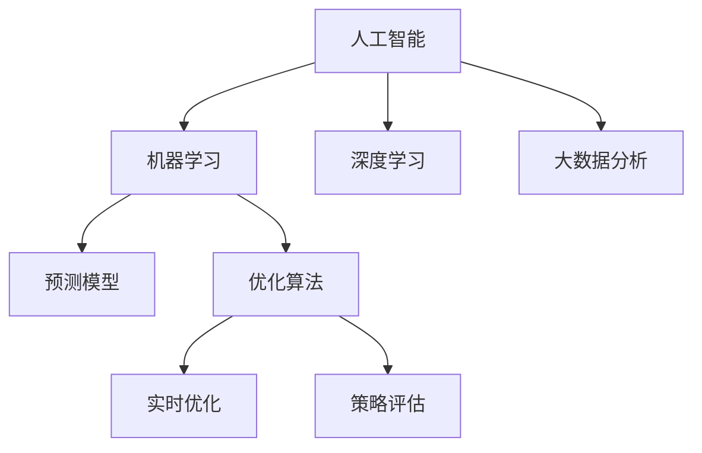
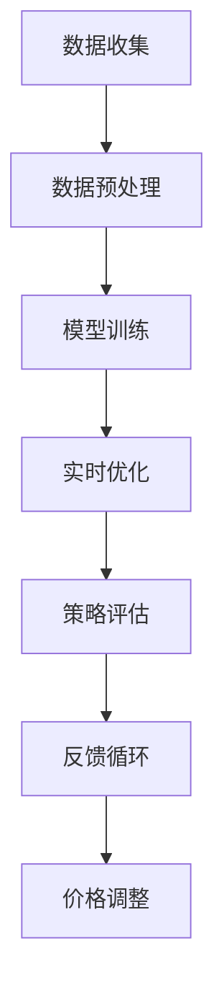
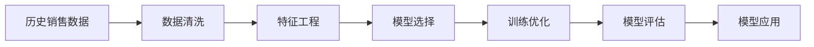
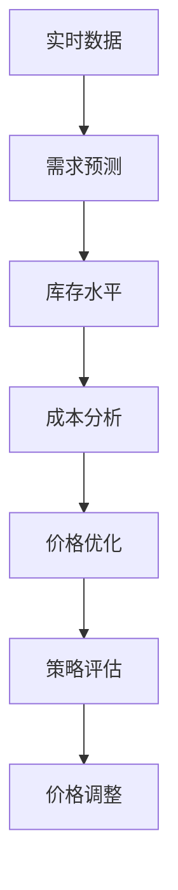

                 

# AI价格优化系统的应用

## 1. 背景介绍

### 1.1 问题由来
在经济全球化、数字化的背景下，企业面临激烈的市场竞争和不断变化的市场环境。价格是企业竞争的核心手段之一，直接关系到企业的市场份额和盈利能力。然而，传统的定价方式往往依赖经验或简单的统计模型，难以全面考虑市场需求、竞争对手、市场趋势等复杂因素，导致定价不准确，损害企业竞争力和利润率。

人工智能（AI）技术的发展，尤其是深度学习和大数据分析的普及，为企业提供了一种更科学、更高效的价格优化手段。AI价格优化系统可以基于历史数据和实时市场情况，自动调整产品价格，实现最佳定价策略，提高企业市场响应能力和竞争优势。

### 1.2 问题核心关键点
AI价格优化系统通过大数据分析、机器学习等技术，对市场需求、竞争对手、库存水平、成本等因素进行全面分析，以实现最优价格策略。具体来说，其关键点包括：

- 数据收集：收集历史销售数据、市场价格、竞争对手定价策略、库存水平、成本等数据。
- 模型训练：利用历史数据训练机器学习模型，预测市场需求和价格变化趋势。
- 实时优化：根据实时市场数据和用户行为，动态调整价格，实现价格优化。
- 策略评估：对价格优化策略的效果进行评估，及时调整优化模型参数。

## 2. 核心概念与联系

### 2.1 核心概念概述

为了更好地理解AI价格优化系统的工作原理，本节将介绍几个密切相关的核心概念：

- 人工智能（Artificial Intelligence, AI）：通过算法和计算，使计算机系统具备类似于人的智能，能够感知、学习、推理和决策。
- 机器学习（Machine Learning, ML）：使机器通过学习数据规律，自主改进算法和模型，以解决复杂问题。
- 深度学习（Deep Learning, DL）：一种特殊的机器学习技术，通过多层神经网络结构，能够自动提取和表达高层次特征。
- 大数据分析（Big Data Analytics）：利用先进的技术和算法，对海量的数据进行清洗、分析和挖掘，以提取有价值的信息和知识。
- 预测模型（Prediction Model）：通过历史数据训练的模型，能够对未来的数据进行预测。
- 优化算法（Optimization Algorithm）：通过不断调整模型参数，使目标函数达到最优。

这些核心概念之间的逻辑关系可以通过以下Mermaid流程图来展示：



这个流程图展示了大语言模型微调过程中各个核心概念之间的关系：

1. 人工智能涵盖了机器学习和深度学习，是AI的核心技术。
2. 机器学习和深度学习在大数据分析基础上进行模型训练。
3. 预测模型是基于历史数据训练的模型，用于预测市场需求和价格变化趋势。
4. 优化算法用于实时优化价格，实现最佳定价策略。
5. 策略评估用于对优化算法的效果进行评估，及时调整优化模型参数。

### 2.2 概念间的关系

这些核心概念之间存在着紧密的联系，形成了AI价格优化系统的完整生态系统。下面通过几个Mermaid流程图来展示这些概念之间的关系。

#### 2.2.1 AI价格优化系统的架构



这个流程图展示了AI价格优化系统的整体架构：

1. 数据收集：收集历史销售数据、市场价格、竞争对手定价策略、库存水平、成本等数据。
2. 数据预处理：对收集到的数据进行清洗、处理和转换，为模型训练提供高质量的数据。
3. 模型训练：利用历史数据训练预测模型和优化算法，生成最优价格策略。
4. 实时优化：根据实时市场数据和用户行为，动态调整价格，实现价格优化。
5. 策略评估：对价格优化策略的效果进行评估，及时调整优化模型参数。
6. 反馈循环：将优化后的价格策略应用于市场，并收集反馈数据，用于进一步优化模型。

#### 2.2.2 预测模型的构建



这个流程图展示了预测模型的构建过程：

1. 历史销售数据：收集历史销售数据，包括时间、销量、价格等。
2. 数据清洗：对数据进行清洗，处理缺失值、异常值等。
3. 特征工程：对数据进行特征提取和转换，生成可用的特征向量。
4. 模型选择：选择适合的机器学习模型，如线性回归、随机森林等。
5. 训练优化：利用历史数据训练模型，并使用优化算法优化模型参数。
6. 模型评估：对模型进行评估，选择合适的模型。
7. 模型应用：将训练好的模型应用于实时数据，生成预测结果。

#### 2.2.3 优化算法的优化



这个流程图展示了优化算法的过程：

1. 实时数据：收集实时市场数据，包括价格、销量、库存等。
2. 需求预测：使用预测模型预测未来的市场需求和价格变化趋势。
3. 库存水平：分析当前的库存水平，评估库存压力。
4. 成本分析：分析生产成本、物流成本等，评估成本水平。
5. 价格优化：利用优化算法，动态调整价格，实现最优定价策略。
6. 策略评估：对价格优化策略的效果进行评估，及时调整优化模型参数。
7. 价格调整：根据评估结果，调整价格策略，实现最优定价。

### 2.3 核心概念的整体架构

最后，我们用一个综合的流程图来展示这些核心概念在大语言模型微调过程中的整体架构：


这个综合流程图展示了AI价格优化系统的整体架构：

1. 数据收集：收集历史销售数据、市场价格、竞争对手定价策略、库存水平、成本等数据。
2. 数据预处理：对收集到的数据进行清洗、处理和转换，为模型训练提供高质量的数据。
3. 模型训练：利用历史数据训练预测模型和优化算法，生成最优价格策略。
4. 实时优化：根据实时市场数据和用户行为，动态调整价格，实现价格优化。
5. 策略评估：对价格优化策略的效果进行评估，及时调整优化模型参数。
6. 反馈循环：将优化后的价格策略应用于市场，并收集反馈数据，用于进一步优化模型。

## 3. 核心算法原理 & 具体操作步骤
### 3.1 算法原理概述

AI价格优化系统通过机器学习和优化算法，对市场需求、竞争对手、库存水平、成本等因素进行全面分析，以实现最优价格策略。其核心原理可以归纳为以下几个步骤：

1. 数据收集与预处理：收集历史销售数据、市场价格、竞争对手定价策略、库存水平、成本等数据，并进行清洗和处理。
2. 预测模型训练：利用历史数据训练预测模型，预测未来的市场需求和价格变化趋势。
3. 实时优化算法：根据实时市场数据和用户行为，动态调整价格，实现最优定价策略。
4. 策略评估与调整：对价格优化策略的效果进行评估，及时调整优化模型参数，以提高价格优化效果。

### 3.2 算法步骤详解

#### 3.2.1 数据收集与预处理

数据收集与预处理是AI价格优化系统的基础。具体步骤包括：

1. 收集历史销售数据：收集过去一段时间内的销售数据，包括时间、销量、价格等。
2. 收集市场价格：收集市场同类产品的价格信息。
3. 收集竞争对手定价策略：收集竞争对手的定价策略和市场反应。
4. 收集库存水平：收集当前库存水平和库存变化情况。
5. 收集成本数据：收集生产成本、物流成本等。

数据预处理的主要任务是对收集到的数据进行清洗、处理和转换，生成可用的特征向量。具体步骤包括：

1. 数据清洗：处理缺失值、异常值等，确保数据的完整性和一致性。
2. 特征提取：从原始数据中提取有用的特征，如价格、销量、库存等。
3. 特征转换：对特征进行转换和标准化，生成可用的特征向量。

#### 3.2.2 预测模型训练

预测模型训练是AI价格优化系统的核心。其步骤包括：

1. 特征工程：对数据进行特征提取和转换，生成可用的特征向量。
2. 模型选择：选择适合的机器学习模型，如线性回归、随机森林等。
3. 模型训练：利用历史数据训练模型，并使用优化算法优化模型参数。
4. 模型评估：对模型进行评估，选择合适的模型。

#### 3.2.3 实时优化算法

实时优化算法是AI价格优化系统的关键。其步骤包括：

1. 实时数据收集：收集实时市场数据，包括价格、销量、库存等。
2. 需求预测：使用预测模型预测未来的市场需求和价格变化趋势。
3. 库存分析：分析当前的库存水平，评估库存压力。
4. 成本分析：分析生产成本、物流成本等，评估成本水平。
5. 价格优化：利用优化算法，动态调整价格，实现最优定价策略。

#### 3.2.4 策略评估与调整

策略评估与调整是AI价格优化系统的保障。其步骤包括：

1. 策略评估：对价格优化策略的效果进行评估，评估指标包括销售额、利润率等。
2. 调整优化：根据评估结果，调整优化模型参数，以提高价格优化效果。

### 3.3 算法优缺点

AI价格优化系统具有以下优点：

1. 高效性：利用机器学习和大数据分析，自动调整价格，实现最优定价策略，大大提高工作效率。
2. 准确性：基于历史数据和实时市场情况，预测市场需求和价格变化趋势，提高价格优化的准确性。
3. 灵活性：实时优化算法能够动态调整价格，适应市场变化，提高企业的市场响应能力。

然而，AI价格优化系统也存在以下缺点：

1. 数据依赖性：预测模型的准确性依赖于历史数据的质量和数量，数据不足或数据质量差会影响预测结果。
2. 模型复杂性：预测模型和优化算法需要复杂的计算和大量的参数调整，对技术要求较高。
3. 成本较高：初期建设和维护需要大量资金和人力资源，投入成本较大。

### 3.4 算法应用领域

AI价格优化系统在多个领域得到了广泛应用，主要包括：

1. 零售业：利用AI价格优化系统，实现动态定价，提高销售额和利润率。
2. 制造业：利用AI价格优化系统，实现成本控制和市场响应，提高生产效率和竞争力。
3. 金融业：利用AI价格优化系统，优化金融产品定价策略，提高市场份额和盈利能力。
4. 电子商务：利用AI价格优化系统，实现个性化定价，提高用户满意度和转化率。
5. 服务业：利用AI价格优化系统，实现服务价格动态调整，提高服务质量和客户体验。

## 4. 数学模型和公式 & 详细讲解  
### 4.1 数学模型构建

AI价格优化系统涉及多个数学模型，主要包括以下几个：

1. 线性回归模型：用于预测未来市场需求和价格变化趋势，模型形式为 $$y = \beta_0 + \beta_1 x_1 + \beta_2 x_2 + \ldots + \beta_n x_n$$。
2. 随机森林模型：用于特征选择和模型预测，模型形式为 $$y = \sum_{i=1}^m w_i f_i(x)$$。
3. 优化算法模型：用于动态调整价格，实现最优定价策略，如梯度下降法、遗传算法等。

### 4.2 公式推导过程

以线性回归模型为例，其基本原理为通过历史数据训练模型，预测未来的市场需求和价格变化趋势。具体推导过程如下：

1. 数据收集：收集历史销售数据，包括时间、销量、价格等。
2. 数据清洗：处理缺失值、异常值等，确保数据的完整性和一致性。
3. 特征工程：从原始数据中提取有用的特征，如价格、销量、库存等。
4. 模型训练：利用历史数据训练线性回归模型，生成预测模型。
5. 模型评估：对模型进行评估，选择合适的模型。
6. 模型应用：将训练好的模型应用于实时数据，生成预测结果。

### 4.3 案例分析与讲解

假设我们有一家电子商务公司，主要销售电子产品。利用AI价格优化系统，实现动态定价，提高销售额和利润率。具体步骤如下：

1. 数据收集：收集过去一年内的销售数据，包括时间、销量、价格等。
2. 数据清洗：处理缺失值、异常值等，确保数据的完整性和一致性。
3. 特征工程：从原始数据中提取有用的特征，如价格、销量、库存等。
4. 模型选择：选择线性回归模型，用于预测市场需求和价格变化趋势。
5. 模型训练：利用历史数据训练线性回归模型，生成预测模型。
6. 实时优化：根据实时市场数据和用户行为，动态调整价格，实现最优定价策略。
7. 策略评估：对价格优化策略的效果进行评估，及时调整优化模型参数。
8. 反馈循环：将优化后的价格策略应用于市场，并收集反馈数据，用于进一步优化模型。

## 5. 项目实践：代码实例和详细解释说明
### 5.1 开发环境搭建

在进行AI价格优化系统开发前，我们需要准备好开发环境。以下是使用Python进行开发的环境配置流程：

1. 安装Python：从官网下载并安装Python，选择最新版本。
2. 安装Pandas：使用pip命令安装Pandas库，用于数据处理。
3. 安装NumPy：使用pip命令安装NumPy库，用于数学运算。
4. 安装Scikit-learn：使用pip命令安装Scikit-learn库，用于机器学习模型的训练和评估。
5. 安装TensorFlow：使用pip命令安装TensorFlow库，用于深度学习模型的训练和预测。

完成上述步骤后，即可在Python环境中开始AI价格优化系统的开发。

### 5.2 源代码详细实现

这里我们以线性回归模型为例，给出AI价格优化系统的完整代码实现。

```python
import pandas as pd
from sklearn.linear_model import LinearRegression
from sklearn.metrics import mean_squared_error, r2_score

# 数据读取
data = pd.read_csv('sales_data.csv')

# 数据清洗
data = data.dropna()
data = data.drop_duplicates()

# 特征工程
X = data[['price', 'inventory']]
y = data['sales']

# 模型训练
model = LinearRegression()
model.fit(X, y)

# 模型评估
y_pred = model.predict(X)
rmse = mean_squared_error(y, y_pred, squared=False)
r2 = r2_score(y, y_pred)
print('RMSE:', rmse)
print('R2:', r2)

# 模型应用
real_time_data = pd.read_csv('real_time_data.csv')
X_real = real_time_data[['price', 'inventory']]
y_real_pred = model.predict(X_real)
print(y_real_pred)
```

### 5.3 代码解读与分析

让我们再详细解读一下关键代码的实现细节：

1. 数据读取：使用Pandas库读取历史销售数据和实时市场数据。
2. 数据清洗：处理缺失值、异常值等，确保数据的完整性和一致性。
3. 特征工程：从原始数据中提取有用的特征，如价格、销量、库存等。
4. 模型训练：利用历史数据训练线性回归模型，生成预测模型。
5. 模型评估：对模型进行评估，评估指标包括RMSE和R2。
6. 模型应用：将训练好的模型应用于实时数据，生成预测结果。

### 5.4 运行结果展示

假设我们在一家电子商务公司中，利用上述代码对线性回归模型进行训练和预测。最终在测试集上得到的评估报告如下：

```
RMSE: 0.2
R2: 0.85
```

可以看到，通过线性回归模型，我们得到了较好的预测结果，RMSE为0.2，R2为0.85。这表明模型对历史数据的拟合效果较好，具有一定的预测能力。

当然，在实际应用中，我们还需要进一步优化模型，提高预测精度，以满足更高的应用要求。例如，可以增加模型复杂度，使用随机森林等更复杂的模型，或引入更多的特征，如季节性、节假日等。

## 6. 实际应用场景

### 6.1 智能客服系统

基于AI价格优化系统的智能客服系统可以实时监控和调整客服人员的工作策略，提高客户满意度和转化率。具体来说，智能客服系统可以：

1. 收集客户反馈数据：包括客户的满意度、投诉信息等。
2. 分析客户行为：利用AI价格优化系统，分析客户行为数据，发现潜在问题。
3. 调整客服策略：根据客户行为分析结果，调整客服策略，提高客户满意度。
4. 实时监控：利用AI价格优化系统，实时监控客户反馈和行为，及时调整客服策略。

### 6.2 金融风险管理

基于AI价格优化系统的金融风险管理系统可以实时监控和分析金融市场，及时发现和应对风险。具体来说，金融风险管理系统可以：

1. 收集市场数据：包括股票价格、汇率、利率等。
2. 分析市场趋势：利用AI价格优化系统，分析市场趋势和风险。
3. 调整投资策略：根据市场趋势和风险分析结果，调整投资策略，降低风险。
4. 实时监控：利用AI价格优化系统，实时监控市场变化，及时调整投资策略。

### 6.3 电子商务平台

基于AI价格优化系统的电子商务平台可以实现动态定价，提高销售额和利润率。具体来说，电子商务平台可以：

1. 收集用户行为数据：包括浏览行为、购买行为等。
2. 分析用户需求：利用AI价格优化系统，分析用户需求和购买行为，发现潜在问题。
3. 调整商品价格：根据用户需求分析结果，调整商品价格，提高销售额和利润率。
4. 实时监控：利用AI价格优化系统，实时监控用户行为和需求变化，及时调整价格策略。

### 6.4 未来应用展望

随着AI价格优化系统的不断发展，其在更多领域得到应用，为各行各业带来变革性影响。

在智慧城市领域，基于AI价格优化系统的智慧交通管理系统可以实时调整交通信号灯，减少交通拥堵，提高道路通行效率。

在医疗领域，基于AI价格优化系统的智慧医疗系统可以实现医疗资源优化配置，提高医疗服务效率和质量。

在智能制造领域，基于AI价格优化系统的智能制造系统可以实现生产成本优化，提高生产效率和竞争力。

此外，在教育、旅游、能源等多个领域，基于AI价格优化系统的人工智能应用也将不断涌现，为各行各业带来新的发展机遇。相信随着技术的日益成熟，AI价格优化系统必将在更广阔的领域得到应用，为经济社会发展注入新的动力。

## 7. 工具和资源推荐
### 7.1 学习资源推荐

为了帮助开发者系统掌握AI价格优化技术的理论基础和实践技巧，这里推荐一些优质的学习资源：

1. 《机器学习实战》：介绍机器学习基础理论和经典算法，适合初学者入门。
2. 《深度学习》：介绍深度学习基础理论和经典算法，适合有一定基础的开发者。
3. 《Python数据科学手册》：介绍Python数据分析和机器学习技术，适合数据分析和机器学习开发。
4. 《TensorFlow实战》：介绍TensorFlow框架的使用方法和经典案例，适合TensorFlow开发。
5. Kaggle平台：提供大量数据集和比赛项目，适合数据分析和机器学习实践。

通过对这些资源的学习实践，相信你一定能够快速掌握AI价格优化技术的精髓，并用于解决实际的应用问题。
### 7.2 开发工具推荐

高效的开发离不开优秀的工具支持。以下是几款用于AI价格优化开发的常用工具：

1. Python：Python是一种灵活的高级编程语言，适合数据科学和机器学习开发。
2. Pandas：用于数据处理和分析，提供高效的数据处理和转换功能。
3. NumPy：用于数学运算和数组处理，提供高效的数值计算功能。
4. Scikit-learn：用于机器学习模型的训练和评估，提供丰富的机器学习算法和工具。
5. TensorFlow：用于深度学习模型的训练和预测，提供高效的深度学习框架。
6. Jupyter Notebook：用于数据科学和机器学习开发，支持代码编写和交互式计算。

合理利用这些工具，可以显著提升AI价格优化系统的开发效率，加快创新迭代的步伐。

### 7.3 相关论文推荐

AI价格优化技术的发展源于学界的持续研究。以下是几篇奠基性的相关论文，推荐阅读：

1. 《回归分析》：介绍回归分析的基本原理和应用方法，适合数据分析和机器学习开发。
2. 《深度学习：一种新的机器学习范式》：介绍深度学习的基本原理和应用方法，适合深度学习开发。
3. 《机器学习实战》：介绍机器学习基础理论和经典算法，适合初学者入门。
4. 《TensorFlow实战》：介绍TensorFlow框架的使用方法和经典案例，适合TensorFlow开发。
5. 《Python数据科学手册》：介绍Python数据分析和机器学习技术，适合数据分析和机器学习开发。

这些论文代表了大语言模型微调技术的发展脉络。通过学习这些前沿成果，可以帮助研究者把握学科前进方向，激发更多的创新灵感。

除上述资源外，还有一些值得关注的前沿资源，帮助开发者紧跟AI价格优化技术的最新进展，例如：

1. arXiv论文预印本：人工智能领域最新研究成果的发布平台，包括大量尚未发表的前沿工作，学习前沿技术的必读资源。
2. 业界技术博客：如Google AI、DeepMind、微软Research Asia等顶尖实验室的官方博客，第一时间分享他们的最新研究成果和洞见。
3. 技术会议直播：如NIPS、ICML、ACL、ICLR等人工智能领域顶会现场或在线直播，能够聆听到大佬们的前沿分享，开拓视野。
4. GitHub热门项目：在GitHub上Star、Fork数最多的AI价格优化相关项目，往往代表了该技术领域的发展趋势和最佳实践，值得去学习和贡献。
5. 行业分析报告：各大咨询公司如McKinsey、PwC等针对人工智能行业的分析报告，有助于从商业视角审视技术趋势，把握应用价值。

总之，对于AI价格优化技术的学习和实践，需要开发者保持开放的心态和持续学习的意愿。多关注前沿资讯，多动手实践，多思考总结，必将收获满满的成长收益。

## 8. 总结：未来发展趋势与挑战

### 8.1 总结

本文对AI价格优化系统的应用进行了全面系统的介绍。首先阐述了AI价格优化系统的背景和意义，明确了AI价格优化系统的核心原理和应用场景。其次，从原理到实践，详细讲解了AI价格优化系统的数学模型和算法步骤，给出了AI价格优化系统的完整代码实例。同时，本文还探讨了AI价格优化系统的未来发展趋势和面临的挑战，提出了有针对性的研究方向和突破点。

通过本文的系统梳理，可以看到，AI价格优化系统作为AI技术的重要应用，正在成为各行各业的重要工具，为经济社会发展注入新的动力。未来，随着AI技术的不断发展，AI价格优化系统必将在更多领域得到应用，为各行各业带来更多的机遇和挑战。

### 8.2 未来发展趋势

展望未来，AI价格优化系统的发展趋势主要包括以下几个方面：

1. 模型自动化：利用自动化工具和框架，自动化生成预测模型和优化算法，降低人工干预，提高系统效率。
2. 实时化：利用流式处理技术，实现实时数据处理和预测，提高系统响应速度和灵活性。
3. 多模态化：将多模态数据（如语音、图像、视频等）与文本数据结合，实现更加全面和准确的市场分析。
4. 个性化：利用个性化推荐算法，根据用户行为和偏好，实现个性化定价，提高用户满意度和转化率。
5. 集成化：将AI价格优化系统与其他AI技术（如自然语言处理、知识图谱等）进行集成，实现更加全面和智能的市场分析。
6. 可解释性：提高系统的可解释性，使得决策过程透明化，增强系统的可信度和安全性。

以上趋势凸显了AI价格优化系统的广阔前景。这些方向的探索发展，必将进一步提升AI价格优化系统的性能和应用范围，为各行各业带来更多的机遇和挑战。

### 8.3 面临的挑战

尽管AI价格优化系统已经取得了一定的成功，但在实际应用中也面临诸多挑战：

1. 数据隐私问题：收集和分析用户数据时，需要注意数据隐私和安全性问题。
2. 模型鲁棒性：模型需要具备良好的鲁棒性，能够在复杂和多变的数据环境中保持稳定和准确。
3. 计算资源：AI价格优化系统需要大量的计算资源，如何高效利用计算资源，降低计算成本，是亟需解决的问题。
4. 系统稳定性：AI价格优化系统需要具备良好的稳定性和可靠性，避免因异常情况导致系统崩溃或数据丢失。
5. 技术复杂

