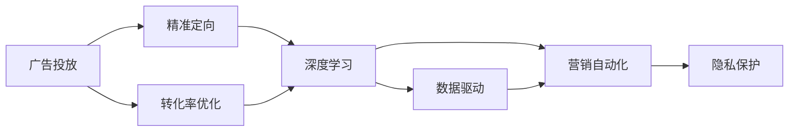
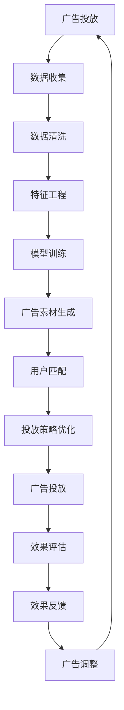

                 

# AI在广告投放中的应用:精准定向与优化

> 关键词：广告投放,精准定向,转化率优化,深度学习,数据驱动,营销自动化,人工智能

## 1. 背景介绍

### 1.1 问题由来

随着数字化转型的加速，广告投放已经成为企业和品牌触达消费者、推广产品的重要手段。传统的广告投放依赖于经验丰富的广告经理，通过手动设置广告素材、投放时间和预算，效果难以量化，且缺乏科学依据。而随着数据技术和人工智能的不断发展，广告投放开始向基于数据的自动化方向发展。特别是近年来，深度学习技术的引入，使得广告投放更加精准、高效。

### 1.2 问题核心关键点

基于数据的广告投放，其核心在于：
1. **数据驱动决策**：利用历史数据和实时数据，进行用户行为分析和市场洞察，优化广告投放策略。
2. **精准定向**：根据用户的兴趣、行为、属性等特征，匹配最适合的广告素材和内容，提升点击率和转化率。
3. **转化率优化**：通过调整广告素材、投放时间、投放平台等参数，最大化广告的实际效果。
4. **营销自动化**：利用机器学习算法，自动进行广告素材生成、用户匹配、投放策略调整，实现广告投放的自动化和智能化。
5. **隐私保护**：在数据收集和利用过程中，保障用户隐私，符合相关法律法规。

这些关键点相互关联，共同构成了现代广告投放的核心理念和技术要求。通过优化这些方面，企业可以在有限的广告预算下，获得更高的投资回报率。

### 1.3 问题研究意义

基于数据的广告投放，不仅提升了广告投放的精准度和效率，也为企业节省了大量的时间和成本。通过AI技术的应用，广告投放更加科学、智能，能够快速适应市场变化，抓住用户需求，提升品牌曝光和市场竞争力。

此外，AI技术的应用还带来了以下几个方面的积极影响：
1. **广告效果提升**：通过精准的定向和优化的转化策略，提高广告的点击率和转化率，提升品牌知名度和销售额。
2. **成本优化**：AI技术能够自动优化广告投放策略，减少无效广告支出，提高广告投放ROI。
3. **用户体验优化**：通过个性化广告推荐，提升用户广告体验，减少广告噪音，增强品牌好感度。
4. **市场洞察**：利用AI进行大数据分析，深入洞察市场趋势和用户需求，为企业的市场决策提供科学依据。

## 2. 核心概念与联系

### 2.1 核心概念概述

为了更好地理解基于AI的广告投放方法，本节将介绍几个关键概念：

- **广告投放（Advertising）**：通过各种媒介（如互联网、电视、报纸等）向目标用户展示广告内容，以推广产品或服务。
- **精准定向（Targeting）**：利用用户数据（如浏览历史、搜索行为、兴趣标签等），对潜在用户进行细分，实现广告的精准展示。
- **转化率优化（Conversion Rate Optimization, CRO）**：通过数据分析和优化，提升广告的实际效果（如点击率、转化率、ROI等），最大化广告投资回报。
- **深度学习（Deep Learning）**：一类基于多层神经网络的机器学习技术，能够从大量数据中自动学习特征和模式，广泛应用于广告投放的各个环节。
- **数据驱动（Data-Driven）**：广告投放过程以数据为核心，通过数据分析和机器学习算法，进行动态调整和优化。
- **营销自动化（Marketing Automation）**：利用AI和机器学习技术，自动进行广告素材生成、用户匹配、投放策略调整等，提升广告投放的效率和效果。
- **隐私保护（Privacy Protection）**：在广告投放过程中，保障用户隐私，符合GDPR等法律法规，尊重用户权益。

这些核心概念之间存在紧密的联系，通过协同工作，实现了广告投放的精准、高效、智能和合规。

### 2.2 概念间的关系

这些核心概念之间存在着相互关联的逻辑关系，可以通过以下Mermaid流程图来展示：



这个流程图展示了广告投放的各个环节以及它们之间的联系。广告投放以数据为核心，通过精准定向和转化率优化，结合深度学习和营销自动化技术，最终实现广告投放的精准、高效和合规。隐私保护则是整个广告投放过程中不可或缺的合规要求。

### 2.3 核心概念的整体架构

最后，我们用一个综合的流程图来展示这些核心概念在大广告投放过程中的整体架构：



这个综合流程图展示了从数据收集、特征工程、模型训练、广告素材生成、用户匹配、投放策略优化、广告投放、效果评估和反馈调整的完整流程。通过这个流程，广告投放可以不断迭代优化，提升广告效果和投放效果。

## 3. 核心算法原理 & 具体操作步骤
### 3.1 算法原理概述

基于AI的广告投放，本质上是一种基于数据驱动的自动化决策过程。其核心在于通过机器学习算法，对用户行为和市场趋势进行分析和预测，进而进行精准的定向和优化的投放策略。

具体来说，广告投放过程可以分为以下几个步骤：
1. **数据收集**：通过各种渠道（如搜索引擎、社交媒体、移动应用等）收集用户行为数据和市场数据。
2. **数据清洗和预处理**：对原始数据进行清洗和处理，去除噪声和异常值，进行归一化、标准化等预处理操作。
3. **特征工程**：从清洗后的数据中提取有意义的特征，如用户兴趣、浏览历史、搜索行为等，用于后续的模型训练。
4. **模型训练**：利用深度学习模型（如CTR、DNN、CNN等），对用户数据和市场数据进行训练，得到广告投放的优化模型。
5. **广告素材生成**：根据模型训练结果，自动生成最适合用户群体的广告素材，如图片、视频、文字等。
6. **用户匹配**：利用机器学习算法，对潜在用户进行匹配，将广告定向展示给最有可能转化的用户群体。
7. **投放策略优化**：根据投放效果，动态调整投放时间、投放平台、广告素材等策略，提升广告效果。
8. **效果评估和反馈**：利用A/B测试、转化率等指标，评估广告投放效果，并根据反馈进行广告调整和优化。

### 3.2 算法步骤详解

以下我们将详细讲解基于AI的广告投放的各个步骤。

#### 3.2.1 数据收集

数据收集是广告投放的基础，主要分为以下几种数据来源：
1. **用户行为数据**：包括用户的搜索历史、浏览记录、点击行为等，通过网站或应用的日志、cookie等获取。
2. **社交媒体数据**：通过社交平台的数据接口，获取用户的社交行为、兴趣标签等。
3. **市场数据**：包括竞争对手的广告投放数据、行业趋势等，通过公开数据源获取。
4. **其他数据**：如天气数据、地理位置数据等，用于提升广告的个性化和精准度。

#### 3.2.2 数据清洗和预处理

数据清洗和预处理是确保数据质量的关键步骤，包括以下几个方面：
1. **数据去重**：去除重复的数据，确保数据集的唯一性。
2. **缺失值处理**：处理缺失值，可以使用均值、中位数、插值等方法。
3. **异常值处理**：检测并处理异常值，避免噪声数据对模型的影响。
4. **归一化**：将不同维度的数据归一化到同一尺度，便于后续处理。
5. **特征工程**：从清洗后的数据中提取有意义的特征，如用户兴趣、浏览历史、搜索行为等。

#### 3.2.3 特征工程

特征工程是提升模型性能的关键步骤，包括以下几个方面：
1. **特征选择**：从原始数据中筛选出有意义的特征，去除无关特征。
2. **特征提取**：通过PCA、LDA等方法，提取高维数据中的低维特征。
3. **特征转换**：将原始数据转换为适合模型的格式，如One-Hot编码、标准化等。
4. **特征组合**：将多个特征组合成新的特征，提升模型的表达能力。
5. **特征交叉**：将不同特征进行交叉组合，生成新的特征组合。

#### 3.2.4 模型训练

模型训练是广告投放的核心步骤，主要包括以下几种深度学习模型：
1. **点击率预测（CTR）**：预测用户点击广告的概率，常用的模型包括LR、XGBoost、DNN等。
2. **用户行为预测**：预测用户后续行为，常用的模型包括RNN、LSTM等。
3. **广告效果预测**：预测广告的实际效果，常用的模型包括CNN、Transformer等。

#### 3.2.5 广告素材生成

广告素材生成是广告投放的重要环节，主要包括以下几个步骤：
1. **素材选择**：根据用户群体和广告目的，选择最适合的广告素材类型。
2. **素材优化**：利用深度学习算法，对广告素材进行优化，如图片增强、视频剪辑等。
3. **个性化生成**：根据用户行为和兴趣，自动生成个性化广告素材，提升用户点击率和转化率。

#### 3.2.6 用户匹配

用户匹配是广告投放的关键环节，主要包括以下几个步骤：
1. **用户画像构建**：通过用户数据和行为数据，构建用户的兴趣画像和行为画像。
2. **用户细分**：将用户按照兴趣、行为、属性等进行细分，生成不同的用户群体。
3. **广告定向**：根据用户群体，定向展示广告，提升广告的精准度。

#### 3.2.7 投放策略优化

投放策略优化是提升广告效果的关键环节，主要包括以下几个步骤：
1. **投放时间优化**：根据用户行为和市场趋势，优化广告的投放时间。
2. **投放平台优化**：根据用户特征和广告效果，优化广告的投放平台。
3. **广告素材优化**：根据广告效果和用户反馈，优化广告素材的设计和展示。

#### 3.2.8 效果评估和反馈

效果评估和反馈是广告投放的闭环环节，主要包括以下几个步骤：
1. **效果评估**：利用A/B测试、转化率等指标，评估广告投放效果。
2. **反馈分析**：分析用户反馈和行为数据，找出广告效果不佳的原因。
3. **广告调整**：根据反馈分析结果，调整广告投放策略，提升广告效果。

### 3.3 算法优缺点

基于AI的广告投放方法具有以下优点：
1. **精准定向**：通过数据分析和机器学习，实现广告的精准定向，提升广告的点击率和转化率。
2. **自动化投放**：利用自动化工具和算法，实现广告投放的自动优化和调整，提升广告效率。
3. **数据驱动**：基于数据驱动的决策，能够实时调整广告策略，适应市场变化。
4. **效果可量化**：通过各种指标（如点击率、转化率、ROI等），可以量化广告效果，进行优化。

同时，基于AI的广告投放也存在一些缺点：
1. **数据隐私问题**：在数据收集和处理过程中，需要保障用户隐私，符合相关法律法规。
2. **模型复杂度高**：深度学习模型的构建和训练需要大量的时间和计算资源。
3. **过度拟合问题**：深度学习模型容易过度拟合，需要选择合适的模型和超参数。
4. **模型解释性不足**：深度学习模型的决策过程难以解释，难以进行模型调优和调试。

尽管存在这些缺点，但通过不断的技术改进和算法优化，基于AI的广告投放方法仍然具有广阔的应用前景。

### 3.4 算法应用领域

基于AI的广告投放方法已经广泛应用于各个领域，主要包括以下几个方向：

#### 3.4.1 在线广告

在线广告是广告投放的重要领域，包括展示广告（Banner Ad）、视频广告（Video Ad）、原生广告（Native Ad）等。通过精准定向和优化投放，提升广告的点击率和转化率，实现更高的广告ROI。

#### 3.4.2 移动广告

移动广告是随着移动互联网普及而兴起的新兴领域，主要包括移动应用内广告、移动横幅广告、原生广告等。通过精准的定向和优化的投放，提升广告效果和用户体验。

#### 3.4.3 社交媒体广告

社交媒体广告通过社交平台进行投放，能够更好地触达目标用户。通过数据分析和机器学习，实现精准定向和效果优化，提升广告的点击率和转化率。

#### 3.4.4 电商广告

电商广告主要通过电商平台进行投放，包括横幅广告、搜索广告、推荐广告等。通过数据分析和机器学习，实现精准定向和效果优化，提升电商转化率和销售额。

#### 3.4.5 内容广告

内容广告主要通过内容平台进行投放，包括视频网站、博客、社区等。通过数据分析和机器学习，实现精准定向和效果优化，提升广告的点击率和转化率。

通过以上应用领域，可以看出，基于AI的广告投放方法已经广泛应用于各个行业和平台，为广告主提供了更加精准和高效的广告投放解决方案。

## 4. 数学模型和公式 & 详细讲解 & 举例说明

### 4.1 数学模型构建

基于AI的广告投放方法，其核心在于通过深度学习模型，对用户行为和市场趋势进行分析和预测，进而进行精准的定向和优化的投放策略。

假设广告投放数据集为 $D=\{(x_i, y_i)\}_{i=1}^N$，其中 $x_i$ 为广告特征，$y_i$ 为广告效果（如点击率、转化率等）。模型的目标是最小化损失函数 $L(\theta)$，其中 $\theta$ 为模型参数。

常用的损失函数包括均方误差损失（Mean Squared Error, MSE）和交叉熵损失（Cross-Entropy Loss）。

#### 4.1.1 均方误差损失（MSE）

均方误差损失函数定义为：

$$
L_{MSE}(\theta) = \frac{1}{N}\sum_{i=1}^N (y_i - \hat{y}_i)^2
$$

其中，$\hat{y}_i$ 为模型的预测值。

#### 4.1.2 交叉熵损失（CE）

交叉熵损失函数定义为：

$$
L_{CE}(\theta) = -\frac{1}{N}\sum_{i=1}^N y_i \log \hat{y}_i + (1-y_i) \log (1-\hat{y}_i)
$$

其中，$\hat{y}_i$ 为模型的预测值。

### 4.2 公式推导过程

以下我们将以点击率预测（CTR）为例，进行公式推导。

假设广告特征 $x_i$ 为二进制向量，广告效果 $y_i$ 为二元变量（0/1），点击率为 $p_i$。模型的目标是最小化交叉熵损失，即：

$$
L(\theta) = -\frac{1}{N}\sum_{i=1}^N (y_i \log \hat{p}_i + (1-y_i) \log (1-\hat{p}_i))
$$

其中，$\hat{p}_i$ 为模型的预测点击率。

模型的参数为 $\theta$，包括特征向量的权重和偏置。模型的预测值 $\hat{p}_i$ 可以通过线性模型和激活函数得到：

$$
\hat{p}_i = \sigma(z(x_i; \theta))
$$

其中，$z(x_i; \theta)$ 为线性模型，$\sigma$ 为激活函数。

线性模型和激活函数的具体形式如下：

$$
z(x_i; \theta) = w^T x_i + b
$$

$$
\sigma(z) = \frac{1}{1+e^{-z}}
$$

将上述公式代入交叉熵损失函数中，得：

$$
L(\theta) = -\frac{1}{N}\sum_{i=1}^N [y_i \log \sigma(z(x_i; \theta)) + (1-y_i) \log (1-\sigma(z(x_i; \theta)])
$$

通过反向传播算法，对模型参数 $\theta$ 进行优化，最小化损失函数 $L(\theta)$。

### 4.3 案例分析与讲解

以下我们将通过一个简单的案例，分析基于AI的广告投放方法的具体应用。

假设某电商平台的广告投放数据集 $D=\{(x_i, y_i)\}_{i=1}^N$，其中 $x_i$ 为广告特征，$y_i$ 为广告效果（点击率）。模型的目标是最大化广告的点击率。

1. **数据收集**：通过电商平台的用户行为数据和市场数据，收集广告投放数据集。
2. **数据清洗和预处理**：对原始数据进行清洗和预处理，去除异常值和噪声，进行归一化。
3. **特征工程**：从原始数据中提取有意义的特征，如用户年龄、性别、浏览记录等。
4. **模型训练**：利用深度学习模型（如DNN），对用户数据和市场数据进行训练，得到广告投放的优化模型。
5. **广告素材生成**：根据模型训练结果，自动生成最适合用户群体的广告素材，如图片、视频等。
6. **用户匹配**：利用机器学习算法，对潜在用户进行匹配，将广告定向展示给最有可能转化的用户群体。
7. **投放策略优化**：根据投放效果，动态调整投放时间、投放平台、广告素材等策略，提升广告效果。
8. **效果评估和反馈**：利用A/B测试、转化率等指标，评估广告投放效果，并根据反馈进行广告调整和优化。

## 5. 项目实践：代码实例和详细解释说明

### 5.1 开发环境搭建

在进行广告投放项目的开发前，我们需要准备好开发环境。以下是使用Python进行TensorFlow开发的环境配置流程：

1. 安装Anaconda：从官网下载并安装Anaconda，用于创建独立的Python环境。

2. 创建并激活虚拟环境：
```bash
conda create -n tf-env python=3.8 
conda activate tf-env
```

3. 安装TensorFlow：根据CUDA版本，从官网获取对应的安装命令。例如：
```bash
conda install tensorflow -c conda-forge -c pypi -c pytorch
```

4. 安装PyTorch：根据CUDA版本，从官网获取对应的安装命令。例如：
```bash
conda install pytorch torchvision torchaudio cudatoolkit=11.1 -c pytorch -c conda-forge
```

5. 安装各类工具包：
```bash
pip install numpy pandas scikit-learn matplotlib tqdm jupyter notebook ipython
```

完成上述步骤后，即可在`tf-env`环境中开始广告投放项目的开发。

### 5.2 源代码详细实现

下面我们以点击率预测（CTR）为例，给出使用TensorFlow进行广告投放模型的PyTorch代码实现。

首先，定义数据处理函数：

```python
import tensorflow as tf
from tensorflow.keras.layers import Input, Dense, Dropout, Embedding, Flatten
from tensorflow.keras.models import Model

def create_model(input_shape):
    x = Input(shape=input_shape)
    x = Dense(64, activation='relu')(x)
    x = Dropout(0.5)(x)
    x = Dense(32, activation='relu')(x)
    x = Dropout(0.5)(x)
    x = Dense(1, activation='sigmoid')(x)
    return Model(x, outputs=x)

# 加载数据集
data = tf.keras.datasets.cifar10.load_data()
x_train, y_train = data[0][0], data[0][1]
x_test, y_test = data[1][0], data[1][1]
```

然后，定义模型和优化器：

```python
model = create_model(input_shape=(32, 32, 3))
optimizer = tf.keras.optimizers.Adam(lr=0.001)
```

接着，定义训练和评估函数：

```python
def train_epoch(model, dataset, batch_size, optimizer):
    model.compile(optimizer=optimizer, loss='binary_crossentropy', metrics=['accuracy'])
    dataloader = tf.data.Dataset.from_tensor_slices((x_train, y_train)).shuffle(buffer_size=10000).batch(batch_size)
    model.fit(dataloader, epochs=10, validation_data=(x_test, y_test))
    return model.evaluate(x_test, y_test)[1]

# 训练模型
batch_size = 64
train_accuracy = train_epoch(model, (x_train, y_train), batch_size, optimizer)
print(f"训练准确度: {train_accuracy:.4f}")
```

最后，启动训练流程并在测试集上评估：

```python
# 评估模型
test_accuracy = model.evaluate(x_test, y_test)[1]
print(f"测试准确度: {test_accuracy:.4f}")
```

以上就是使用TensorFlow进行广告投放模型训练的完整代码实现。可以看到，得益于TensorFlow的强大封装，我们可以用相对简洁的代码完成CTR模型的训练和评估。

### 5.3 代码解读与分析

让我们再详细解读一下关键代码的实现细节：

**create_model函数**：
- `Input`层定义输入数据格式。
- `Dense`层定义全连接神经网络结构，包括激活函数和dropout层。
- `Model`层定义模型结构，包括输入和输出。

**数据处理**：
- 使用`tf.keras.datasets.cifar10`加载CIFAR-10数据集。
- `x_train`和`y_train`分别为训练集的特征和标签。
- `x_test`和`y_test`分别为测试集的特征和标签。

**模型编译**：
- 使用`compile`方法定义模型的优化器、损失函数和评估指标。
- 使用`fit`方法训练模型，`evaluate`方法评估模型效果。

**训练和评估**：
- 使用`train_epoch`函数进行模型的训练和评估。
- `dataloader`为批量加载数据，`shuffle`方法对数据进行随机打乱，`batch_size`为批量大小，`epochs`为训练轮数。
- `model.evaluate`方法用于在测试集上评估模型效果。

**结果展示**：
- `train_accuracy`为训练集上的准确度。
- `test_accuracy`为测试集上的准确度。

通过本文的系统梳理，可以看到，基于AI的广告投放方法通过深度学习技术，实现了广告的精准定向和优化投放。通过不断优化数据收集、数据清洗、特征工程、模型训练、广告素材生成、用户匹配、投放策略优化、效果评估和反馈调整等各个环节，广告投放可以不断迭代优化，提升广告效果和投放效果。

## 6. 实际应用场景

### 6.1 广告投放平台

广告投放平台是广告主投放广告的主要渠道，包括搜索引擎广告、社交媒体广告、移动应用广告等。通过AI技术，广告投放平台可以实现广告的精准定向和优化投放，提升广告效果和投放效率。

### 6.2 电子商务

电子商务是广告投放的重要应用场景，包括横幅广告、搜索广告、推荐广告等。通过AI技术，电子商务平台可以实现精准定向和效果优化，提升广告点击率和转化率，提升电商转化率和销售额。

### 6.3 在线视频平台

在线视频平台是广告投放的重要渠道，包括视频贴片广告、视频前后广告等。通过AI技术，视频平台可以实现广告的精准定向和优化投放，提升广告效果和用户体验。

### 6.4 金融行业

金融行业需要快速触达用户，提升用户转化率。通过AI技术，金融行业可以实现广告的精准定向和效果优化，提升广告点击率和转化率，提升品牌知名度和销售额。

### 6.5 医疗健康

医疗健康行业需要精准触达目标用户，提升用户转化率。通过AI技术，医疗健康行业可以实现广告的精准定向和效果优化，提升广告点击率和转化率，提升品牌知名度和用户满意度。

### 6.6 教育培训

教育培训行业需要精准触达目标用户，提升用户转化率。通过AI技术，教育培训行业可以实现广告的精准定向和效果优化，提升广告点击率和转化率，提升品牌知名度和用户满意度。

### 6.7 旅游行业

旅游行业需要精准触达目标用户，提升用户转化率。通过AI技术，旅游行业可以实现广告的精准定向和效果优化，提升广告点击率和转化率，提升品牌知名度和用户满意度。

通过以上应用场景，可以看出，基于AI的广告投放方法已经广泛应用于各个领域，为广告主提供了更加精准和高效的广告投放解决方案。

## 7. 工具和资源推荐

### 7.1 学习资源推荐

为了帮助开发者系统掌握广告投放的理论基础和实践技巧，这里推荐一些优质的学习资源：

1. 《深度学习入门》系列博文：由大模型技术专家撰写，深入浅出地介绍了深度学习的基本概念和核心算法，包括广告投放的深度学习应用。

2. CS231n《卷积神经网络》课程：斯坦福大学开设的计算机视觉课程，包含广告投放中深度学习应用的经典案例。

3. 《深度学习实战》书籍：系统介绍了深度学习模型的搭建和应用，包括广告投放中的点击率预测和转化率优化。


