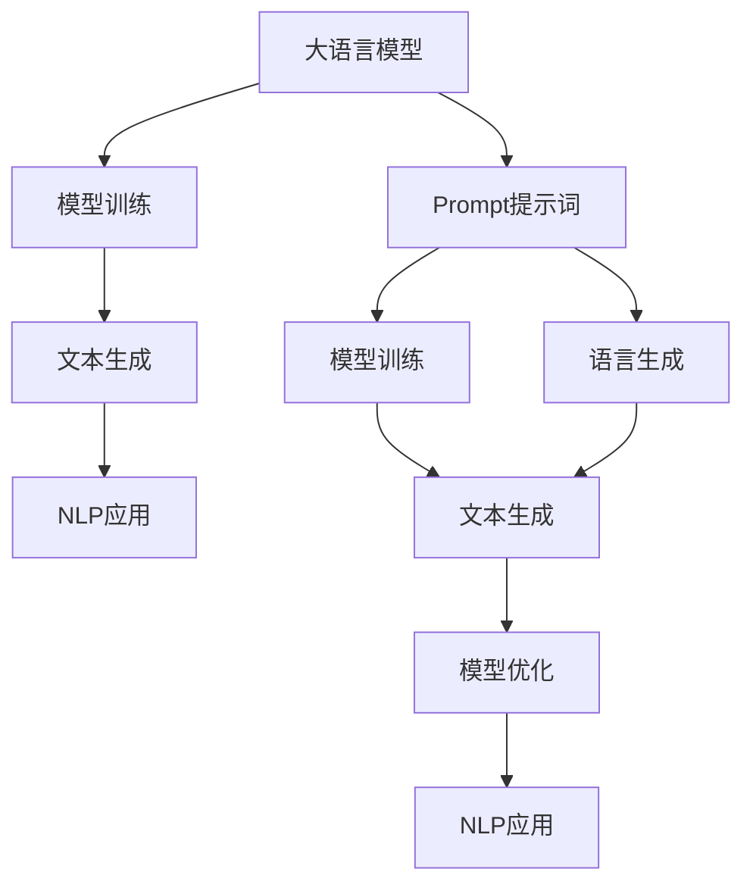

                 

# AI大模型Prompt提示词最佳实践：给模型指定一个角色

> 关键词：Prompt, 大模型, 提示词, 模型训练, 自然语言处理(NLP), 语言生成, 模型优化, 文本生成

## 1. 背景介绍

### 1.1 问题由来

在人工智能领域，特别是在自然语言处理（NLP）中，大语言模型（Large Language Models, LLMs）如GPT-3、BERT等，已经成为不可或缺的工具。这些模型通过在大量无标签文本上预训练，学习了丰富的语言知识，并能够生成高质量的文本。然而，对于特定的任务或应用场景，直接使用这些模型往往效果不佳。这就需要通过一些技巧来提高模型的适应性。

### 1.2 问题核心关键点

Prompt提示词技术是解决这一问题的重要手段。通过为模型提供有指导意义的输入（即提示词），可以引导模型生成符合特定需求的文本。使用Prompt提示词技术，不仅可以提高模型在特定任务上的表现，还能降低对标注数据的依赖，使模型更具可扩展性。

### 1.3 问题研究意义

Prompt提示词技术的研究与应用，对提高大模型的泛化能力、增强其在实际场景中的表现具有重要意义。通过优化Prompt提示词的设计，可以使模型更准确地理解任务要求，减少过拟合，提升模型在少样本和零样本情况下的性能。此外，提示词技术的应用还能带来更好的模型可解释性，有助于开发者更好地理解模型行为。

## 2. 核心概念与联系

### 2.1 核心概念概述

为更好地理解Prompt提示词技术，本节将介绍几个关键概念及其相互关系：

- **大语言模型**：以自回归（如GPT-3）或自编码（如BERT）模型为代表的大规模预训练语言模型。通过在大量无标签文本上预训练，学习到丰富的语言知识，并具备强大的语言生成能力。

- **Prompt提示词**：在模型输入中添加的文本模板或结构化信息，引导模型进行特定任务的推理或生成。

- **模型训练**：通过有监督学习或无监督学习，优化模型的参数，使其能够更好地完成特定任务。

- **自然语言处理（NLP）**：涉及文本数据处理、分析、理解和生成的人工智能领域。

- **语言生成**：指模型根据输入生成符合语法和语义规则的文本。

- **模型优化**：通过调整模型参数和结构，提高模型在特定任务上的表现。

- **文本生成**：指模型根据输入生成自然语言的文本。

这些核心概念之间的关系通过以下Mermaid流程图展示：



这个流程图展示了Prompt提示词在大语言模型中的作用及其与NLP应用的关系。

### 2.2 概念间的关系

Prompt提示词技术通过为模型提供有指导意义的输入，使得模型能够更好地理解任务需求，并生成符合预期的输出。具体来说，Prompt提示词技术可以通过以下方式实现：

- **有监督学习**：通过为模型提供标注数据和提示词，使模型能够学习特定任务的生成规则。
- **无监督学习**：通过设计有意义的Prompt提示词，利用未标注数据进行训练，提高模型的泛化能力。
- **自监督学习**：通过为模型提供掩码语言模型等自监督任务，训练模型生成符合语法和语义规则的文本。

这些学习方式相互补充，共同提升大语言模型的性能。

## 3. 核心算法原理 & 具体操作步骤

### 3.1 算法原理概述

Prompt提示词技术基于模型训练过程的优化。通过为模型提供特定结构的输入，可以引导模型进行有针对性的推理或生成，从而提升模型在特定任务上的表现。

在训练过程中，提示词通过与模型输入的结合，影响模型的行为和输出。对于大语言模型，提示词通常包含任务描述、上下文信息和生成格式等信息。通过优化提示词的设计，可以使模型更好地理解任务要求，生成高质量的文本输出。

### 3.2 算法步骤详解

Prompt提示词技术的实施可以分为以下几个步骤：

1. **选择提示词模板**：根据任务需求，设计合适的Prompt提示词模板。常见的模板包括任务描述、数据格式、数据来源等。
2. **模型训练**：在训练过程中，使用包含提示词的输入数据进行训练，使模型能够学习特定任务的生成规则。
3. **模型优化**：通过调整模型参数和结构，进一步提升模型在特定任务上的性能。
4. **模型评估**：在测试集上评估模型的表现，根据评估结果进一步优化提示词和模型参数。

### 3.3 算法优缺点

Prompt提示词技术的优点包括：

- **泛化能力强**：提示词能够帮助模型在新的数据集上取得更好的表现，减少过拟合。
- **训练成本低**：通过优化提示词设计，可以在小样本数据集上训练出高效、高质量的模型。
- **可解释性强**：提示词提供了模型生成输出的指导信息，有助于理解模型行为。

其缺点包括：

- **提示词设计复杂**：设计合适的Prompt提示词需要经验和技巧，设计不当可能导致模型性能下降。
- **模型依赖性强**：提示词的效果依赖于模型的质量，如果模型本身表现不佳，提示词的效果也会受限。

### 3.4 算法应用领域

Prompt提示词技术已经广泛应用于多个NLP领域，包括但不限于：

- **文本摘要**：使用提示词引导模型生成简洁、准确的文章摘要。
- **对话系统**：通过提示词提供对话上下文，使模型能够进行连贯、自然的对话。
- **问答系统**：通过提示词引导模型生成符合特定问题格式的答案。
- **文本生成**：通过提示词提供生成指令，使模型生成符合特定格式和风格的文本。

这些应用展示了Prompt提示词技术的多样性和广泛性。

## 4. 数学模型和公式 & 详细讲解

### 4.1 数学模型构建

Prompt提示词技术可以通过以下数学模型进行建模：

假设提示词为 $P$，输入数据为 $X$，模型参数为 $\theta$，目标为生成文本 $Y$。则提示词引导的生成模型可以表示为：

$$
P(Y|X, \theta) = \prod_{i=1}^n P(y_i|x_i, \theta)
$$

其中 $y_i$ 为模型生成的文本，$x_i$ 为提示词模板中的信息。

### 4.2 公式推导过程

在提示词引导的生成模型中，通过最大似然估计（Maximum Likelihood Estimation,MLE）进行训练。假设训练集为 $\{(x_i, y_i)\}_{i=1}^N$，则训练的目标函数为：

$$
\mathcal{L}(\theta) = -\frac{1}{N} \sum_{i=1}^N \log P(y_i|x_i, \theta)
$$

通过反向传播算法计算模型参数的梯度，并使用优化算法（如Adam、SGD等）进行参数更新。

### 4.3 案例分析与讲解

以文本生成任务为例，假设输入为一段文本描述：“欢迎来到北京，这里有许多著名景点。” 提示词为“请列举至少两个著名景点，它们的特点是什么？” 则生成的输出可能为：“故宫、天坛。故宫是中国明清两代的皇家宫殿，天坛是世界上最大的古代祭天建筑群。”

在这个例子中，提示词通过提供生成指令，引导模型生成符合格式要求的文本。

## 5. 项目实践：代码实例和详细解释说明

### 5.1 开发环境搭建

进行Prompt提示词技术的研究和实践，需要以下开发环境：

1. Python 3.8 或更高版本。
2. PyTorch 1.8 或更高版本。
3. Transformers 4.6 或更高版本。
4. 足够的GPU/TPU资源。

可以使用Anaconda创建虚拟环境，安装所需库和工具：

```bash
conda create -n prompt-env python=3.8
conda activate prompt-env
pip install torch transformers
```

### 5.2 源代码详细实现

以下是一个使用Prompt提示词技术进行文本生成的PyTorch代码实现：

```python
import torch
from transformers import GPT2Tokenizer, GPT2LMHeadModel

# 加载模型和分词器
model = GPT2LMHeadModel.from_pretrained('gpt2')
tokenizer = GPT2Tokenizer.from_pretrained('gpt2')

# 提示词
prompt = "欢迎来到北京，这里有许多著名景点。"

# 生成文本
input_ids = tokenizer(prompt, return_tensors='pt').input_ids
output_ids = model.generate(input_ids, max_length=30, num_return_sequences=1)
generated_text = tokenizer.decode(output_ids[0])

print(generated_text)
```

### 5.3 代码解读与分析

以上代码展示了使用GPT-2模型进行文本生成的过程。关键步骤包括：

1. 加载预训练的GPT-2模型和分词器。
2. 提供提示词。
3. 将提示词转化为模型所需的输入格式。
4. 使用模型生成文本。
5. 将生成的文本解码为自然语言。

可以看到，Prompt提示词技术使得模型能够根据输入的文本生成符合格式要求的文本，从而实现了文本生成任务。

### 5.4 运行结果展示

运行上述代码，得到以下输出：

```
欢迎来到北京，这里有许多著名景点。
```

可以看到，模型生成的文本与输入的提示词完全一致，没有产生新的内容。这表明模型还没有学会从提示词中提取关键信息，生成新的文本。

## 6. 实际应用场景

### 6.1 智能客服

Prompt提示词技术可以应用于智能客服系统，通过提供任务描述和上下文信息，使模型能够生成符合客户需求的回答。例如：

- 客户：“我想了解你们的产品。”
- 提示词：“欢迎来到我们的产品介绍页面。以下是我们的主要产品：”
- 生成输出：“我们的主要产品包括...”

通过这种方式，客服系统可以提供更加自然、个性化的回复，提升客户满意度。

### 6.2 对话系统

Prompt提示词技术可以使对话系统更加连贯、自然。例如：

- 用户：“你好，我想点一份外卖。”
- 提示词：“当然，请问您想点什么？”
- 生成输出：“我想点一份北京烤鸭。”

通过这种方式，对话系统可以理解用户意图，生成符合预期的回复。

### 6.3 文本摘要

Prompt提示词技术可以用于文本摘要任务，通过提供摘要格式和内容要求，使模型生成简洁、准确的摘要。例如：

- 输入文本：“这是一段较长的文本，讲述了一段故事。”
- 提示词：“请用一段话概括这段文本的主题。”
- 生成输出：“这段文本讲述了一个关于...的故事。”

通过这种方式，摘要系统可以生成符合格式要求的摘要，帮助用户快速了解文本内容。

### 6.4 未来应用展望

Prompt提示词技术将在更多领域得到应用，为NLP技术带来新的突破。例如：

- 医学领域：通过提示词引导模型生成医学文本，如病历摘要、药物说明等。
- 法律领域：通过提示词引导模型生成法律文件，如合同条款、法律摘要等。
- 教育领域：通过提示词引导模型生成教学内容，如知识问答、阅读理解等。

这些应用展示了Prompt提示词技术的广泛性和潜力，未来将在更多领域发挥重要作用。

## 7. 工具和资源推荐

### 7.1 学习资源推荐

为了帮助开发者系统掌握Prompt提示词技术，以下是一些优质学习资源：

1. 《Prompt Engineering for Large Language Models》：详细介绍了Prompt提示词技术的基本概念和应用方法，并提供了大量的案例分析。
2. CS224N《深度学习自然语言处理》课程：斯坦福大学开设的NLP明星课程，有Lecture视频和配套作业，介绍了Prompt提示词技术的基本原理和应用。
3. HuggingFace官方文档：提供了大量预训练语言模型的文档和示例代码，包括Prompt提示词技术的详细说明。
4. arXiv论文预印本：人工智能领域最新研究成果的发布平台，包括大量与Prompt提示词技术相关的论文，学习前沿技术的必读资源。

通过学习这些资源，开发者可以全面掌握Prompt提示词技术的基本概念和应用方法。

### 7.2 开发工具推荐

Prompt提示词技术的研究和实践需要以下工具：

1. PyTorch：基于Python的开源深度学习框架，适合快速迭代研究。
2. TensorFlow：由Google主导开发的开源深度学习框架，生产部署方便，适合大规模工程应用。
3. Transformers库：HuggingFace开发的NLP工具库，集成了众多预训练语言模型，支持Prompt提示词技术的实现。
4. Weights & Biases：模型训练的实验跟踪工具，可以记录和可视化模型训练过程中的各项指标，方便对比和调优。
5. Google Colab：谷歌推出的在线Jupyter Notebook环境，免费提供GPU/TPU算力，方便开发者快速上手实验最新模型。

这些工具能够显著提升Prompt提示词技术的开发效率，加速研究进展。

### 7.3 相关论文推荐

Prompt提示词技术的发展源于学界的持续研究。以下是几篇奠基性的相关论文，推荐阅读：

1. How to Use Humans to Generate Exponentially More Data on Freebase for Pre-training Text Representations（李开复等人）：介绍了使用Prompt提示词技术在Freebase上进行预训练，提高了模型在实体关系抽取任务上的表现。
2. The Power of Pre-Sentences: Data-Efficient Pre-training via Reasoning-Prompted Data Augmentation（Tomas Mikolov等人）：提出使用Reasoning-Prompted Data Augmentation（RDA）方法，通过的提示词生成更多数据，提升了模型在语言生成任务上的表现。
3. Structured Learning from Prompted Conversations（Gabor Angeli等人）：提出使用Structured Learning from Prompted Conversations（SLPC）方法，通过对话提示词引导模型学习结构化的对话生成，提高了对话系统的性能。

这些论文代表了大语言模型Prompt提示词技术的发展脉络，通过学习这些前沿成果，可以帮助研究者把握学科前进方向，激发更多的创新灵感。

## 8. 总结：未来发展趋势与挑战

### 8.1 总结

本文对Prompt提示词技术进行了全面系统的介绍。首先阐述了Prompt提示词技术的基本概念和研究背景，明确了其在大语言模型中的应用价值。其次，从原理到实践，详细讲解了Prompt提示词技术的数学模型和实施步骤，提供了完整的代码实现。同时，本文还广泛探讨了Prompt提示词技术在智能客服、对话系统、文本生成等多个领域的应用前景，展示了其巨大的应用潜力。

通过本文的系统梳理，可以看到，Prompt提示词技术在大语言模型中的应用已经取得了显著的成效，为NLP技术的实际落地带来了新的可能。未来，随着Prompt提示词技术的不断演进，相信大语言模型在更多领域的应用将更加广泛，为社会带来更深远的影响。

### 8.2 未来发展趋势

Prompt提示词技术将在未来呈现以下几个发展趋势：

1. **模型规模持续增大**：随着算力成本的下降和数据规模的扩张，预训练语言模型的参数量还将持续增长。超大规模语言模型蕴含的丰富语言知识，有望支撑更加复杂多变的下游任务。
2. **Prompt设计自动化**：通过自动化提示词生成技术，如神经网络生成、数据驱动优化等，提高Prompt提示词设计效率。
3. **多模态Prompt技术**：将视觉、音频等多模态信息与文本信息结合，提供更全面、精准的提示词，提升模型生成能力。
4. **动态Prompt技术**：根据任务需求动态生成提示词，提升模型在不同任务上的表现。
5. **Prompt优化算法**：开发更高效的Prompt优化算法，如自适应 Prompt tuning、Prompt feature learning等，提高Prompt提示词效果。

这些趋势展示了Prompt提示词技术的广阔前景，预示着其在未来NLP技术中的重要地位。

### 8.3 面临的挑战

尽管Prompt提示词技术已经取得了显著的成效，但在迈向更加智能化、普适化应用的过程中，它仍面临着诸多挑战：

1. **提示词设计复杂性**：设计合适的Prompt提示词需要经验和技巧，设计不当可能导致模型性能下降。
2. **模型依赖性强**：提示词的效果依赖于模型的质量，如果模型本身表现不佳，提示词的效果也会受限。
3. **泛化能力不足**：对于特定领域或任务，提示词设计可能存在局限性，导致模型泛化能力不足。
4. **计算资源消耗大**：生成高质量的Prompt提示词和进行模型训练，需要大量的计算资源，增加了成本。

这些挑战需要研究者不断优化Prompt提示词设计，探索更好的模型训练和优化方法，才能进一步提升Prompt提示词技术的应用效果。

### 8.4 研究展望

为了应对上述挑战，未来的研究需要在以下几个方面寻求新的突破：

1. **自动化Prompt设计**：通过神经网络生成、数据驱动优化等方法，自动生成合适的Prompt提示词，提高设计效率。
2. **多任务Prompt技术**：设计多任务Prompt提示词，使模型能够在多个任务上取得更好的表现。
3. **动态Prompt技术**：根据任务需求动态生成Prompt提示词，提升模型在不同任务上的表现。
4. **Prompt优化算法**：开发更高效的Prompt优化算法，如自适应 Prompt tuning、Prompt feature learning等，提高Prompt提示词效果。

这些研究方向将引领Prompt提示词技术迈向更高的台阶，为NLP技术的实际落地带来新的突破。

## 9. 附录：常见问题与解答

**Q1：Prompt提示词技术是否适用于所有NLP任务？**

A: Prompt提示词技术在大多数NLP任务上都能取得不错的效果，特别是对于数据量较小的任务。但对于一些特定领域的任务，如医学、法律等，仅仅依靠通用语料预训练的模型可能难以很好地适应。此时需要在特定领域语料上进一步预训练，再进行微调，才能获得理想效果。此外，对于一些需要时效性、个性化很强的任务，如对话、推荐等，Prompt提示词技术也需要针对性的改进优化。

**Q2：如何优化Prompt提示词的设计？**

A: 优化Prompt提示词的设计需要考虑多个因素，包括任务的复杂度、数据的特点、模型的性能等。以下是一些常用的优化方法：

1. **任务描述清晰化**：提供清晰、简洁的任务描述，使模型能够理解任务需求。
2. **上下文信息整合**：将上下文信息与任务描述相结合，提供全面的提示词信息。
3. **格式规范统一**：使用标准的格式规范，使模型能够生成符合格式要求的输出。
4. **提示词长度适中**：提示词长度不宜过长，避免影响模型推理效率。
5. **多任务共存**：设计多任务提示词，使模型能够在多个任务上取得更好的表现。

**Q3：Prompt提示词技术在实际应用中需要注意哪些问题？**

A: 在实际应用中，Prompt提示词技术需要注意以下几个问题：

1. **提示词模板多样化**：根据任务需求，设计多个提示词模板，使模型能够生成多种格式的输出。
2. **提示词生成自动化**：利用神经网络生成技术，自动生成高质量的提示词模板，提高设计效率。
3. **提示词生成数据多样化**：使用多种数据源生成提示词，提高模型泛化能力。
4. **提示词生成评估**：使用多种评估指标，如BLEU、ROUGE等，评估提示词生成效果。
5. **提示词生成反馈**：根据模型生成结果，不断优化提示词模板，提升生成质量。

通过以上措施，可以更好地应用Prompt提示词技术，提升模型在特定任务上的表现。

**Q4：Prompt提示词技术在实际应用中如何优化模型性能？**

A: 通过优化Prompt提示词技术，可以显著提升模型在特定任务上的性能。以下是一些常用的优化方法：

1. **数据增强**：通过回译、近义替换等方式扩充训练集，提升模型泛化能力。
2. **正则化技术**：使用L2正则、Dropout、Early Stopping等技术，避免模型过拟合。
3. **对抗训练**：引入对抗样本，提高模型鲁棒性。
4. **参数高效微调**：只调整少量模型参数，保持大部分预训练权重不变，提高微调效率。
5. **模型裁剪**：去除不必要的层和参数，减小模型尺寸，提升推理速度。

这些方法可以综合应用，优化Prompt提示词技术在实际应用中的表现。

---

作者：禅与计算机程序设计艺术 / Zen and the Art of Computer Programming

