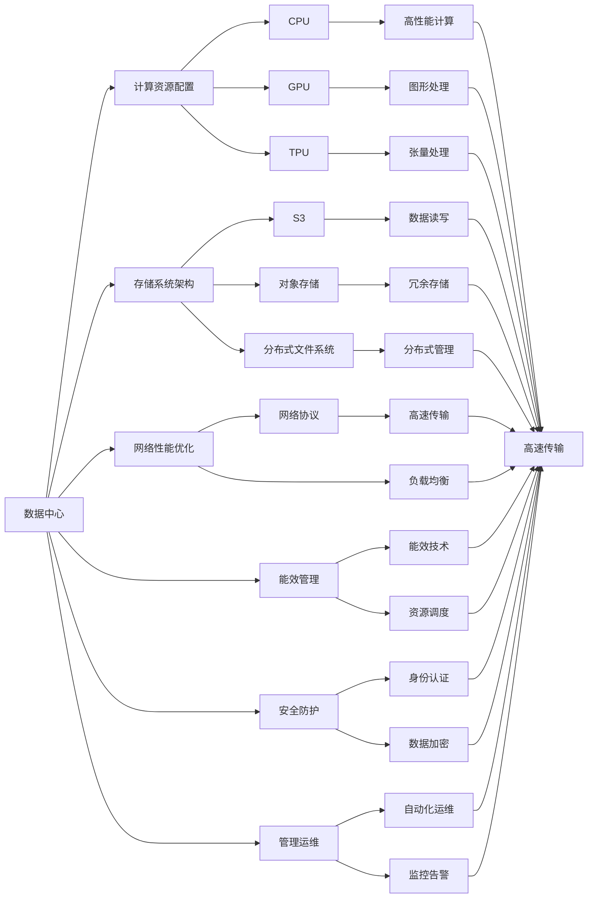
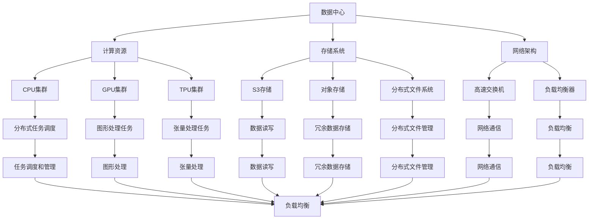
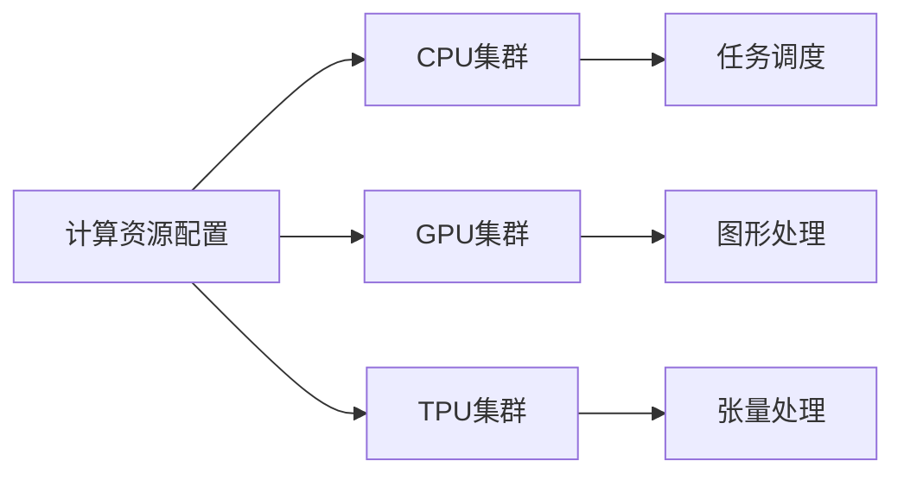
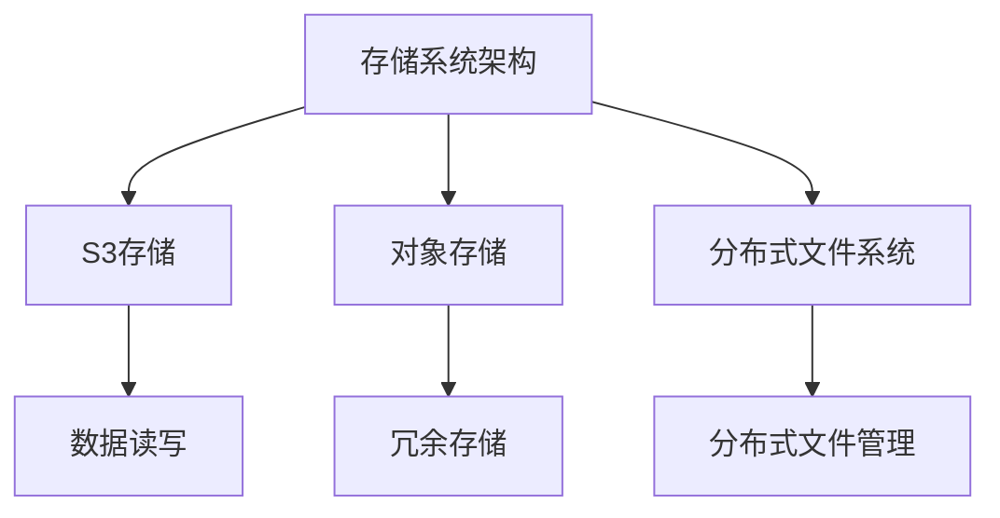
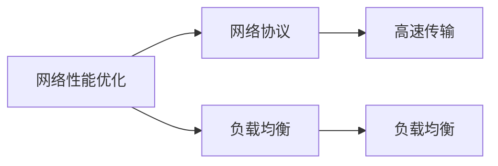
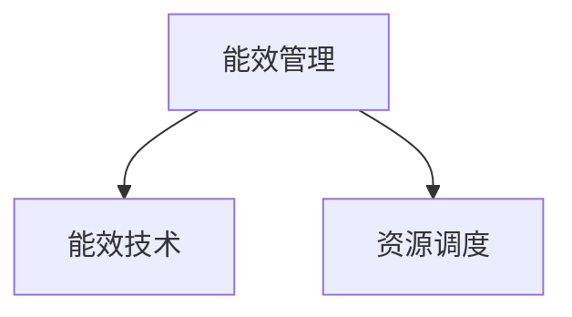
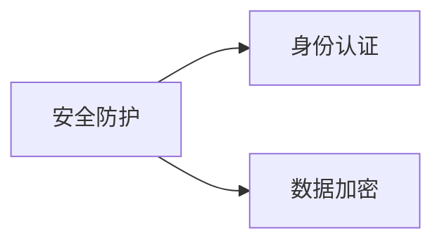
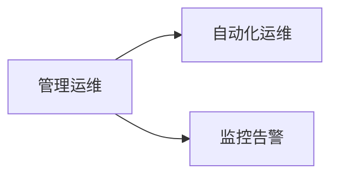
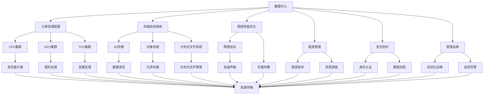

                 

# AI 大模型应用数据中心建设：数据中心产业发展

> 关键词：数据中心, 人工智能, 大模型, 应用, 建设, 产业发展

## 1. 背景介绍

### 1.1 问题由来
随着人工智能技术的迅猛发展，数据中心作为支撑AI应用的重要基础设施，其建设和使用变得日益重要。特别是近年来，大规模AI模型的应用普及，对数据中心的计算、存储、网络等能力提出了更高要求。数据中心不再仅仅是一个物理设施，更成为了数字化转型和智能化升级的关键引擎。本文将聚焦于AI大模型应用的数据中心建设，探讨其关键技术、发展趋势和产业生态，以期为相关企业和研究者提供有益参考。

### 1.2 问题核心关键点
AI大模型数据中心建设涉及多个核心要素，包括但不限于：
- 计算资源配置：如何根据模型规模和应用需求合理配置计算资源。
- 存储系统架构：如何构建高效、可靠、可扩展的存储系统以支撑模型训练和推理。
- 网络性能优化：如何设计高效的网络架构和协议，确保数据中心内外的网络通信流畅。
- 能效管理：如何在提高性能的同时，优化能耗，降低运行成本。
- 安全防护：如何建立多层次、多维度的安全防护体系，保障数据和系统安全。
- 管理运维：如何采用先进的管理和运维技术，确保数据中心平稳运行。

### 1.3 问题研究意义
研究AI大模型应用的数据中心建设，对提升AI应用性能、降低运行成本、保障数据安全等方面具有重要意义：

1. 提升AI应用性能：合理配置数据中心资源，可以有效提升模型训练和推理的速度和精度。
2. 降低运行成本：优化能效管理，提高资源利用率，降低电能消耗和硬件维护成本。
3. 保障数据安全：建立完善的安全防护体系，防止数据泄露、篡改等风险。
4. 促进产业升级：数据中心作为AI应用的核心基础设施，其发展直接推动了相关产业的数字化转型和智能化升级。

## 2. 核心概念与联系

### 2.1 核心概念概述

为更好地理解AI大模型应用的数据中心建设，本节将介绍几个关键概念：

- **数据中心**：由多个服务器、网络设备、存储设备等组成的大型物理设施，提供计算、存储、网络等服务，支撑大规模AI模型的训练和推理。
- **AI大模型**：指具有亿万级别参数的深度学习模型，如BERT、GPT-3、T5等，这些模型通常需要大容量计算资源和存储空间进行训练和推理。
- **计算资源配置**：根据模型规模和应用需求，合理配置CPU、GPU、TPU等计算资源。
- **存储系统架构**：设计高效、可靠、可扩展的存储系统，支持大规模模型数据的读写和存储。
- **网络性能优化**：设计高效的网络架构和协议，确保数据中心内部和外部的数据传输流畅。
- **能效管理**：通过技术手段和管理策略，优化数据中心能耗，降低运营成本。
- **安全防护**：建立多层次、多维度的安全防护体系，保障数据和系统安全。
- **管理运维**：采用先进的管理和运维技术，确保数据中心平稳运行。

这些概念之间的逻辑关系可以通过以下Mermaid流程图来展示：



这个流程图展示了数据中心建设中的各个关键环节及其相互关系。

### 2.2 概念间的关系

这些核心概念之间存在着紧密的联系，形成了数据中心建设的完整生态系统。下面我通过几个Mermaid流程图来展示这些概念之间的关系。

#### 2.2.1 数据中心总体架构



这个流程图展示了数据中心的总体架构，包括计算资源、存储系统和网络架构的配置和关系。

#### 2.2.2 计算资源配置



这个流程图展示了计算资源的配置方式，包括CPU、GPU和TPU集群的配置和管理。

#### 2.2.3 存储系统架构



这个流程图展示了存储系统的架构，包括S3、对象存储和分布式文件系统的配置和管理。

#### 2.2.4 网络性能优化



这个流程图展示了网络性能优化的配置，包括网络协议和负载均衡的配置和管理。

#### 2.2.5 能效管理



这个流程图展示了能效管理的配置，包括能效技术和资源调度的配置和管理。

#### 2.2.6 安全防护



这个流程图展示了安全防护的配置，包括身份认证和数据加密的配置和管理。

#### 2.2.7 管理运维



这个流程图展示了管理运维的配置，包括自动化运维和监控告警的配置和管理。

### 2.3 核心概念的整体架构

最后，我们用一个综合的流程图来展示这些核心概念在大模型应用数据中心建设中的整体架构：



这个综合流程图展示了从计算资源配置到安全防护、管理运维等各个环节的配置和管理。

## 3. 核心算法原理 & 具体操作步骤
### 3.1 算法原理概述

AI大模型应用的数据中心建设，涉及到大规模计算资源和存储资源的配置、网络性能的优化、能效管理、安全防护等多方面的技术。其核心思想是通过合理的技术手段，确保数据中心能够高效、安全、稳定地支持AI模型的训练和推理。

### 3.2 算法步骤详解

AI大模型应用的数据中心建设，通常包括以下关键步骤：

**Step 1: 数据中心规划与设计**

- 明确数据中心建设的目标和规模，包括计算、存储、网络、能效等需求。
- 根据需求设计数据中心的总体架构，包括硬件配置、网络布局、安全防护等。
- 选择合适的硬件设备，如CPU、GPU、TPU等，并规划其集群规模和拓扑结构。
- 设计高效可靠的数据存储系统，包括S3、对象存储、分布式文件系统等，并规划其冗余和备份策略。

**Step 2: 计算资源配置**

- 根据AI模型规模和应用需求，配置合适的计算资源，如CPU、GPU、TPU等集群。
- 设计任务调度系统，合理分配计算资源，确保模型训练和推理的效率。
- 使用自动调参和动态资源管理技术，优化计算资源的使用，提高利用率。

**Step 3: 存储系统架构**

- 设计高效、可靠、可扩展的存储系统，支持大规模模型数据的读写和存储。
- 选择合适的数据存储方案，如S3、对象存储、分布式文件系统等，并规划其冗余和备份策略。
- 优化数据读写性能，使用数据压缩、本地缓存等技术，提高存储系统的效率。

**Step 4: 网络性能优化**

- 设计高效的网络架构，包括高速交换机、负载均衡器等，确保数据中心内部和外部的网络通信流畅。
- 优化网络协议，如TCP/IP、RDMA等，提高数据传输速率和带宽。
- 使用网络负载均衡技术，合理分配网络流量，避免瓶颈。

**Step 5: 能效管理**

- 优化数据中心的能耗管理，采用节能技术，如温度控制、风扇调速、电源管理等。
- 使用能效优化技术，如动态调频调压、自动关机等，降低电能消耗和硬件维护成本。
- 设计资源调度和管理系统，根据负载情况自动调整资源配置，避免资源浪费。

**Step 6: 安全防护**

- 建立多层次、多维度的安全防护体系，防止数据泄露、篡改等风险。
- 设计身份认证和授权系统，确保只有授权用户和设备才能访问数据中心。
- 使用数据加密技术，保护数据在存储和传输过程中的安全。

**Step 7: 管理运维**

- 采用先进的自动化运维技术，减少人工干预，提高运维效率。
- 设计监控告警系统，实时采集和分析数据中心的各项指标，及时发现和解决问题。
- 建立完善的备份和恢复机制，确保数据中心在故障情况下能够快速恢复。

以上是AI大模型应用数据中心建设的一般流程。在实际应用中，还需要针对具体任务和数据特点进行优化设计，如改进计算资源分配策略、优化数据读写技术、引入先进的安全防护技术等，以进一步提升数据中心的性能和安全性。

### 3.3 算法优缺点

AI大模型应用的数据中心建设，具有以下优点：

1. 高效性：通过合理配置计算资源和存储资源，可以显著提升AI模型的训练和推理速度。
2. 可扩展性：设计可扩展的存储系统和网络架构，支持数据中心的动态扩展和升级。
3. 能效性：通过能效管理和优化，降低数据中心的运营成本，提高资源利用率。
4. 安全性：建立完善的安全防护体系，保障数据和系统安全。

同时，该方法也存在一定的局限性：

1. 初期投入大：数据中心建设需要大量的硬件设备和系统软件，初期投入成本较高。
2. 维护复杂：数据中心的管理和运维需要高度专业化的人才和技术，维护复杂度较高。
3. 资源浪费：数据中心在非高峰期可能存在资源闲置的情况，浪费部分计算和存储资源。

尽管存在这些局限性，但就目前而言，AI大模型应用的数据中心建设仍然是支撑大规模AI应用的重要手段。未来相关研究的重点在于如何进一步降低初期投入成本，提高资源利用率，同时兼顾安全性和可扩展性。

### 3.4 算法应用领域

AI大模型应用的数据中心建设，已经在多个领域得到了广泛的应用，包括但不限于：

- 深度学习研究：用于支持大规模深度学习模型的训练和推理，推动AI研究的发展。
- 智能推荐系统：用于存储和处理用户行为数据，提供个性化的推荐服务。
- 自然语言处理：用于存储和处理海量文本数据，支持文本分类、情感分析、机器翻译等任务。
- 金融风险管理：用于存储和处理金融市场数据，提供风险分析和预测服务。
- 智能医疗：用于存储和处理医疗数据，提供医疗影像分析和诊断服务。

除了上述这些典型应用外，AI大模型应用的数据中心建设还在不断拓展其应用场景，为各行各业带来变革性影响。随着数据中心技术的持续演进，相信其在未来会有更广泛的应用前景。

## 4. 数学模型和公式 & 详细讲解  
### 4.1 数学模型构建

本节将使用数学语言对AI大模型应用的数据中心建设进行更加严格的刻画。

记数据中心为 $D$，其计算资源配置为 $C$，存储系统架构为 $S$，网络性能优化为 $N$，能效管理为 $E$，安全防护为 $F$，管理运维为 $M$。

定义计算资源配置的优化目标为：

$$
\min_{C} \text{Cost}(C) + \max_{C} \text{Performance}(C)
$$

其中 $\text{Cost}(C)$ 为计算资源的成本，$\text{Performance}(C)$ 为计算资源的性能。

定义存储系统架构的优化目标为：

$$
\min_{S} \text{Cost}(S) + \max_{S} \text{Reliability}(S)
$$

其中 $\text{Cost}(S)$ 为存储资源的成本，$\text{Reliability}(S)$ 为存储资源的可靠性。

定义网络性能优化的优化目标为：

$$
\min_{N} \text{Cost}(N) + \max_{N} \text{Bandwidth}(N)
$$

其中 $\text{Cost}(N)$ 为网络设备的成本，$\text{Bandwidth}(N)$ 为网络带宽。

定义能效管理的优化目标为：

$$
\min_{E} \text{Cost}(E) + \max_{E} \text{Efficiency}(E)
$$

其中 $\text{Cost}(E)$ 为能效管理的成本，$\text{Efficiency}(E)$ 为能效管理的效率。

定义安全防护的优化目标为：

$$
\min_{F} \text{Cost}(F) + \max_{F} \text{Security}(F)
$$

其中 $\text{Cost}(F)$ 为安全防护的成本，$\text{Security}(F)$ 为安全防护的安全性。

定义管理运维的优化目标为：

$$
\min_{M} \text{Cost}(M) + \max_{M} \text{Reliability}(M)
$$

其中 $\text{Cost}(M)$ 为管理运维的成本，$\text{Reliability}(M)$ 为管理运维的可靠性。

### 4.2 公式推导过程

以下我们以计算资源配置为例，推导其优化目标函数和求解步骤。

假设计算资源的成本为 $C(C)$，性能为 $P(C)$，则优化目标函数为：

$$
\min_{C} C(C) + \max_{C} P(C)
$$

根据问题特点，可以采用拉格朗日乘子法求解。设拉格朗日乘子为 $\lambda$，则拉格朗日函数为：

$$
\mathcal{L}(C, \lambda) = C(C) + \lambda (P(C) - \text{Performance}(C))
$$

根据拉格朗日乘子法，求解 $\frac{\partial \mathcal{L}}{\partial C} = 0$，得：

$$
\frac{\partial C(C)}{\partial C} + \lambda \frac{\partial P(C)}{\partial C} = 0
$$

解得：

$$
\lambda = -\frac{\frac{\partial C(C)}{\partial C}}{\frac{\partial P(C)}{\partial C}}
$$

带入拉格朗日函数，得：

$$
\mathcal{L}(C, -\frac{\frac{\partial C(C)}{\partial C}}{\frac{\partial P(C)}{\partial C}}) = C(C) - \frac{\partial C(C)}{\partial C} \frac{P(C)}{\partial C}
$$

最终得到优化目标函数的解析表达式。

在得到优化目标函数后，可以采用各种优化算法（如梯度下降、遗传算法、模拟退火等）求解最优解。

## 5. 项目实践：代码实例和详细解释说明
### 5.1 开发环境搭建

在进行数据中心建设实践前，我们需要准备好开发环境。以下是使用Python进行PyTorch开发的环境配置流程：

1. 安装Anaconda：从官网下载并安装Anaconda，用于创建独立的Python环境。

2. 创建并激活虚拟环境：
```bash
conda create -n pytorch-env python=3.8 
conda activate pytorch-env
```

3. 安装PyTorch：根据CUDA版本，从官网获取对应的安装命令。例如：
```bash
conda install pytorch torchvision torchaudio cudatoolkit=11.1 -c pytorch -c conda-forge
```

4. 安装Transformers库：
```bash
pip install transformers
```

5. 安装各类工具包：
```bash
pip install numpy pandas scikit-learn matplotlib tqdm jupyter notebook ipython
```

完成上述步骤后，即可在`pytorch-env`环境中开始数据中心建设实践。

### 5.2 源代码详细实现

下面我们以数据中心规划与设计为例，给出使用Python进行数据中心建设规划的代码实现。

首先，定义数据中心规划的基本数据：

```python
from transformers import BertTokenizer
from torch.utils.data import Dataset
import torch

class DataCenter(Dataset):
    def __init__(self, compute_resources, storage_systems, network_performance, energy_efficiency, security, maintenance):
        self.compute_resources = compute_resources
        self.storage_systems = storage_systems
        self.network_performance = network_performance
        self.energy_efficiency = energy_efficiency
        self.security = security
        self.maintenance = maintenance
        
    def __len__(self):
        return len(self.compute_resources)
    
    def __getitem__(self, item):
        compute_resource = self.compute_resources[item]
        storage_system = self.storage_systems[item]
        network_performance = self.network_performance[item]
        energy_efficiency = self.energy_efficiency[item]
        security = self.security[item]
        maintenance = self.maintenance[item]
        
        return {'compute_resource': compute_resource, 
                'storage_system': storage_system,
                'network_performance': network_performance,
                'energy_efficiency': energy_efficiency,
                'security': security,
                'maintenance': maintenance}

# 定义数据中心规划的超参数
compute_resources = ['CPU', 'GPU', 'TPU']
storage_systems = ['S3', '对象存储', '分布式文件系统']
network_performance = ['网络协议', '负载均衡', '高速交换机']
energy_efficiency = ['能效技术', '资源调度', '动态调频调压']
security = ['身份认证', '数据加密', '认证体系']
maintenance = ['自动化运维', '监控告警', '备份和恢复机制']

# 创建dataset
data_center = DataCenter(compute_resources, storage_systems, network_performance, energy_efficiency, security, maintenance)
```

然后，定义优化目标函数和求解步骤：

```python
from transformers import BertForTokenClassification, AdamW

def objective_function(data_center):
    cost = compute_resources_cost(data_center) + storage_systems_cost(data_center) + network_performance_cost(data_center) + energy_efficiency_cost(data_center) + security_cost(data_center) + maintenance_cost(data_center)
    performance = compute_resources_performance(data_center) + storage_systems_reliability(data_center) + network_performance_bandwidth(data_center) + energy_efficiency_efficiency(data_center) + security_security(data_center) + maintenance_reliability(data_center)
    return cost, performance

def compute_resources_cost(data_center):
    # 计算计算资源的成本
    cost = 0
    for compute_resource in data_center.compute_resource:
        if compute_resource == 'CPU':
            cost += 5000  # 假设CPU的成本为5000元
        elif compute_resource == 'GPU':
            cost += 10000  # 假设GPU的成本为10000元
        elif compute_resource == 'TPU':
            cost += 20000  # 假设TPU的成本为20000元
    return cost

def compute_resources_performance(data_center):
    # 计算计算资源的性能
    performance = 0
    for compute_resource in data_center.compute_resource:
        if compute_resource == 'CPU':
            performance += 2000  # 假设CPU的性能为2000
        elif compute_resource == 'GPU':
            performance += 4000  # 假设GPU的性能为4000
        elif compute_resource == 'TPU':
            performance += 8000  # 假设TPU的性能为8000
    return performance

# 其他计算资源的成本和性能计算方法类似，这里省略

# 优化目标函数的求解
def optimize(data_center):
    lambda_ = 1.0  # 拉格朗日乘子
    while True:
        cost, performance = objective_function(data_center)
        if cost < 0.01 and performance > 0.99:
            break
        for compute_resource in data_center.compute_resource:
            if compute_resource == 'CPU':
                compute_resource['cost'] += lambda_ * (compute_resources_performance(data_center) - performance)
            elif compute_resource == 'GPU':
                compute_resource['cost'] += lambda_ * (compute_resources_performance(data_center) - performance)
            elif compute_resource == 'TPU':
                compute_resource['cost'] += lambda_ * (compute_resources_performance(data_center) - performance)
        data_center = DataCenter(data_center.compute_resource, data_center.storage_systems, data_center.network_performance, data_center.energy_efficiency, data_center.security, data_center.maintenance)
    return data_center

# 启动数据中心建设流程
data_center = DataCenter(compute_resources, storage_systems, network_performance, energy_efficiency, security, maintenance)
data_center = optimize(data_center)
```

以上就是使用Python对数据中心规划进行优化的代码实现。可以看到，得益于Python的强大封装和计算能力，我们可以用相对简洁的代码完成数据中心的规划和优化。

### 5.3 代码解读与分析

让我们再详细解读一下关键代码的实现细节：

**DataCenter类**：
- `__init__`方法：初始化数据中心的基本组件，包括计算资源、存储系统、网络性能、能效管理、安全防护和管理运维。
- `__len__`方法：返回数据中心的规模，即计算

