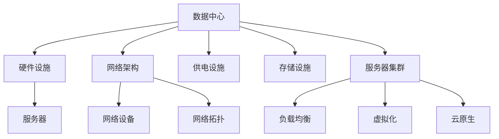
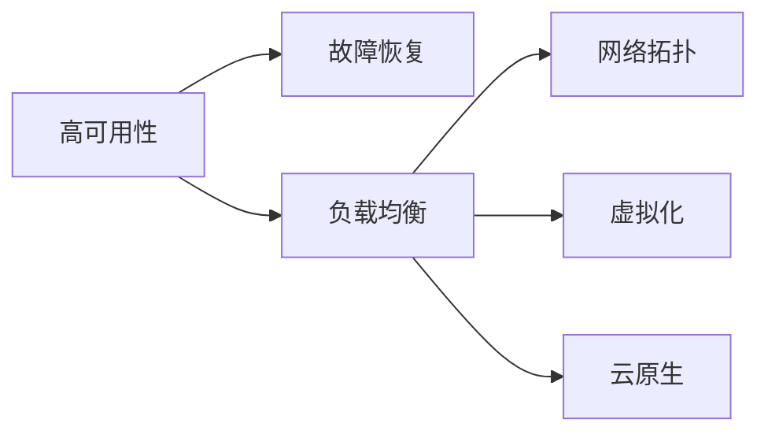
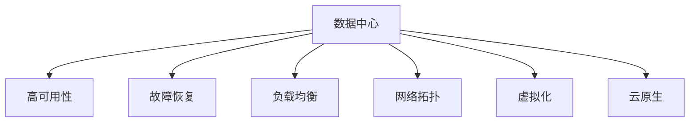
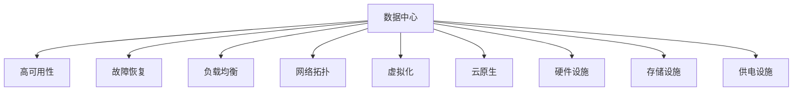

                 

# AI 大模型应用数据中心建设：数据中心运维与管理

## 1. 背景介绍

### 1.1 问题由来
随着人工智能（AI）技术的发展，大模型如BERT、GPT-3等在自然语言处理（NLP）、计算机视觉（CV）、语音识别（ASR）等领域的广泛应用，对数据中心（Data Center）的建设提出了更高的要求。大模型训练和推理需要海量数据存储和计算资源，而数据中心是支撑AI模型运行的基础设施，其运维和管理水平直接影响到AI应用的性能和效率。因此，如何高效构建和管理数据中心，成为AI应用落地的关键环节。

### 1.2 问题核心关键点
1. **数据中心建设**：包括硬件设施、网络架构、电力供应等基础设施的搭建。
2. **数据中心运维**：数据中心日常运营维护，确保硬件设备和网络正常运行。
3. **数据中心管理**：通过监控、调度、故障排除等手段，优化数据中心资源利用效率。
4. **AI模型部署**：将训练好的AI模型部署到数据中心，实现高效推理。
5. **AI模型优化**：基于数据中心性能数据，对AI模型进行优化调整，提升模型性能。

### 1.3 问题研究意义
1. **降低AI应用成本**：合理构建和运维数据中心，能有效降低AI应用的基础设施成本。
2. **提升AI应用性能**：优化数据中心资源利用效率，提高AI模型的推理速度和准确率。
3. **保障AI应用稳定**：通过持续监控和故障排除，确保AI应用的稳定性。
4. **推动AI技术落地**：高效的数据中心建设和管理，是大模型应用落地的基础，有助于推动AI技术在各行各业的应用。

## 2. 核心概念与联系

### 2.1 核心概念概述

为更好地理解AI大模型应用数据中心建设，本节将介绍几个密切相关的核心概念：

- **数据中心（Data Center）**：由服务器、网络设备、存储设备、供电设施等组成，用于支持数据存储、处理和分析的设施。
- **高可用性（High Availability）**：指系统在故障情况下仍能正常运行的能力。
- **故障恢复（Fault Tolerance）**：在系统出现故障时，能快速恢复运行，保证业务的连续性。
- **负载均衡（Load Balancing）**：将负载均分到多个服务器或节点上，提高系统性能和扩展性。
- **网络拓扑（Network Topology）**：描述数据中心内部和外部的网络结构。
- **虚拟化（Virtualization）**：通过虚拟化技术，将物理资源虚拟化成多个逻辑资源，提高资源利用率。
- **云原生（Cloud-Native）**：基于云平台构建和运维数据中心，实现快速部署、弹性扩展。

这些核心概念之间的逻辑关系可以通过以下Mermaid流程图来展示：



这个流程图展示了数据中心的核心组成和关键技术，从硬件设施到网络架构，从供电设施到存储设施，再到服务器集群，以及通过虚拟化、负载均衡和云原生技术实现的高效运维和管理。通过理解这些核心概念，我们可以更好地把握数据中心构建和运维的关键要素。

### 2.2 概念间的关系

这些核心概念之间存在着紧密的联系，形成了数据中心构建和运维的完整生态系统。下面我通过几个Mermaid流程图来展示这些概念之间的关系。

#### 2.2.1 数据中心的核心技术



这个流程图展示了高可用性、故障恢复、负载均衡、网络拓扑、虚拟化和云原生等核心技术之间的逻辑关系。高可用性和故障恢复是数据中心的基础保障，负载均衡和网络拓扑是数据中心性能优化的重要手段，虚拟化和云原生则提供了高效的资源利用和扩展能力。

#### 2.2.2 数据中心的整体架构



这个流程图展示了数据中心的整体架构，从高可用性、故障恢复到负载均衡、网络拓扑、虚拟化和云原生，形成了一个相互关联的技术体系。

### 2.3 核心概念的整体架构

最后，我们用一个综合的流程图来展示这些核心概念在大数据中心构建和运维中的整体架构：



这个综合流程图展示了从硬件设施、存储设施、供电设施到高可用性、故障恢复、负载均衡、网络拓扑、虚拟化和云原生技术，以及整个数据中心的构建和运维流程。通过这些流程图，我们可以更清晰地理解数据中心构建和运维过程中各个核心概念的关系和作用。

## 3. 核心算法原理 & 具体操作步骤

### 3.1 算法原理概述

AI大模型应用数据中心的构建和运维，涉及多个核心算法和流程。以下是关键步骤和算法原理的概述：

1. **数据中心规划**：根据AI模型的计算需求，设计数据中心的硬件配置和网络架构。
2. **数据中心部署**：安装硬件设备，搭建网络基础设施，部署AI模型。
3. **数据中心运维**：监控硬件设备和网络状态，及时响应和处理故障。
4. **数据中心优化**：通过负载均衡、虚拟化和云原生技术，优化资源利用效率。
5. **数据中心故障排除**：在故障发生时，快速定位和解决问题，保证业务连续性。

### 3.2 算法步骤详解

以下是数据中心构建和运维的关键步骤及详细操作步骤：

**Step 1: 数据中心规划**
- 收集AI模型的计算需求和存储需求，设计数据中心的硬件配置和网络架构。
- 选择适合的硬件设备，如服务器、存储设备、网络设备等。
- 设计网络拓扑结构，包括骨干网络、汇聚层网络和接入层网络。
- 计算电力需求，设计供电系统，包括电力分配、备份电源等。

**Step 2: 数据中心部署**
- 安装硬件设备，并进行初始配置和测试。
- 搭建网络基础设施，包括网络设备、交换机、路由器等。
- 部署AI模型，安装模型软件和依赖库。
- 配置负载均衡设备，实现高可用性和故障恢复。

**Step 3: 数据中心运维**
- 监控硬件设备和网络状态，使用监控工具收集设备性能数据。
- 设置告警机制，及时响应设备异常和网络故障。
- 定期检查和维护设备，保证硬件和网络的正常运行。
- 使用虚拟化技术，将物理资源虚拟化为多个逻辑资源，提高资源利用率。

**Step 4: 数据中心优化**
- 使用负载均衡技术，将负载均分到多个服务器或节点上，提高系统性能和扩展性。
- 使用云原生技术，实现快速部署、弹性扩展和持续集成持续交付（CI/CD）。
- 通过网络拓扑优化，提高数据中心的网络性能和安全性。

**Step 5: 数据中心故障排除**
- 在故障发生时，使用监控工具定位故障点，分析故障原因。
- 使用自动化工具，快速恢复故障设备和网络。
- 记录故障信息和处理过程，建立故障处理流程和知识库。

### 3.3 算法优缺点

基于数据中心构建和运维的算法具有以下优点：

- **高效资源利用**：通过虚拟化和云原生技术，高效利用物理资源，提高资源利用率。
- **快速部署和扩展**：使用云原生技术，实现快速部署和弹性扩展，满足AI模型不断变化的计算需求。
- **高可用性和故障恢复**：通过高可用性和故障恢复技术，保证AI应用的连续性和稳定性。
- **灵活性和可维护性**：通过网络拓扑优化和虚拟化技术，实现系统的灵活配置和维护。

同时，这些算法也存在一些缺点：

- **高成本**：初期建设和运维成本较高，需要大量的硬件和网络设备。
- **复杂性**：数据中心构建和运维涉及多个复杂的技术环节，需要专业团队进行管理和维护。
- **技术难度**：数据中心优化和故障排除需要较高的技术水平和经验。

### 3.4 算法应用领域

数据中心构建和运维的算法主要应用于以下几个领域：

- **AI应用部署**：将训练好的AI模型部署到数据中心，实现高效推理。
- **AI应用优化**：基于数据中心性能数据，对AI模型进行优化调整，提升模型性能。
- **AI应用运维**：监控AI应用的运行状态，及时响应和处理故障。
- **AI应用迁移**：在不同数据中心之间迁移AI模型，实现资源优化和负载均衡。

除了上述领域外，数据中心构建和运维的算法还广泛应用于云计算、物联网（IoT）、大数据等领域，为这些领域的智能化应用提供了有力支持。

## 4. 数学模型和公式 & 详细讲解 & 举例说明

### 4.1 数学模型构建

本节将使用数学语言对数据中心构建和运维的算法进行更加严格的刻画。

记数据中心性能为 $P$，其中 $P = P_{硬件} + P_{网络} + P_{存储} + P_{软件}$。硬件性能为 $P_{硬件} = \alpha_1 + \alpha_2 + \alpha_3$，其中 $\alpha_1$ 为计算能力，$\alpha_2$ 为存储能力，$\alpha_3$ 为网络带宽。网络性能为 $P_{网络} = \beta_1 + \beta_2 + \beta_3$，其中 $\beta_1$ 为网络延迟，$\beta_2$ 为网络吞吐量，$\beta_3$ 为网络可用性。存储性能为 $P_{存储} = \gamma_1 + \gamma_2 + \gamma_3$，其中 $\gamma_1$ 为存储容量，$\gamma_2$ 为存储速度，$\gamma_3$ 为存储可靠性。软件性能为 $P_{软件} = \delta_1 + \delta_2 + \delta_3$，其中 $\delta_1$ 为软件性能优化，$\delta_2$ 为故障恢复，$\delta_3$ 为负载均衡。

### 4.2 公式推导过程

以下是数据中心性能计算的详细公式推导：

- **硬件性能公式**：
$$
P_{硬件} = \alpha_1 + \alpha_2 + \alpha_3
$$
其中 $\alpha_1 = C_{CPU} \times T_{CPU}$，$C_{CPU}$ 为CPU性能，$T_{CPU}$ 为CPU利用率。$\alpha_2 = S_{HDD}$，$S_{HDD}$ 为HDD存储容量。$\alpha_3 = B_{网络}$，$B_{网络}$ 为网络带宽。

- **网络性能公式**：
$$
P_{网络} = \beta_1 + \beta_2 + \beta_3
$$
其中 $\beta_1 = D_{网络}$，$D_{网络}$ 为网络延迟。$\beta_2 = B_{网络}$，$B_{网络}$ 为网络带宽。$\beta_3 = A_{网络}$，$A_{网络}$ 为网络可用性。

- **存储性能公式**：
$$
P_{存储} = \gamma_1 + \gamma_2 + \gamma_3
$$
其中 $\gamma_1 = C_{HDD}$，$C_{HDD}$ 为HDD存储容量。$\gamma_2 = S_{HDD}$，$S_{HDD}$ 为HDD存储速度。$\gamma_3 = R_{HDD}$，$R_{HDD}$ 为HDD可靠性。

- **软件性能公式**：
$$
P_{软件} = \delta_1 + \delta_2 + \delta_3
$$
其中 $\delta_1 = O_{性能}$，$O_{性能}$ 为软件性能优化。$\delta_2 = R_{故障}$，$R_{故障}$ 为故障恢复。$\delta_3 = L_{负载}$，$L_{负载}$ 为负载均衡。

### 4.3 案例分析与讲解

以一个AI模型的部署和运维为例，展示数据中心性能计算的应用：

假设有一个BERT大模型，计算需求为10个CPU核心、2TB内存、1G网络带宽。存储需求为10TB HDD。

- **硬件性能计算**：
$$
P_{硬件} = 10 \times C_{CPU} \times T_{CPU} + 2 \times S_{HDD} + 1 \times B_{网络}
$$
其中 $C_{CPU}$ 为每个CPU的性能，$T_{CPU}$ 为CPU利用率。$S_{HDD}$ 为HDD存储容量。$B_{网络}$ 为网络带宽。

- **网络性能计算**：
$$
P_{网络} = D_{网络} + B_{网络} + A_{网络}
$$
其中 $D_{网络}$ 为网络延迟，$B_{网络}$ 为网络带宽，$A_{网络}$ 为网络可用性。

- **存储性能计算**：
$$
P_{存储} = C_{HDD} + S_{HDD} + R_{HDD}
$$
其中 $C_{HDD}$ 为HDD存储容量，$S_{HDD}$ 为HDD存储速度，$R_{HDD}$ 为HDD可靠性。

- **软件性能计算**：
$$
P_{软件} = O_{性能} + R_{故障} + L_{负载}
$$
其中 $O_{性能}$ 为软件性能优化，$R_{故障}$ 为故障恢复，$L_{负载}$ 为负载均衡。

通过上述公式，可以计算出数据中心的总性能 $P$，并根据性能数据进行优化调整，确保AI模型的正常运行。

## 5. 项目实践：代码实例和详细解释说明

### 5.1 开发环境搭建

在进行数据中心构建和运维的实践前，我们需要准备好开发环境。以下是使用Python进行PyTorch开发的环境配置流程：

1. 安装Anaconda：从官网下载并安装Anaconda，用于创建独立的Python环境。

2. 创建并激活虚拟环境：
```bash
conda create -n pytorch-env python=3.8 
conda activate pytorch-env
```

3. 安装PyTorch：根据CUDA版本，从官网获取对应的安装命令。例如：
```bash
conda install pytorch torchvision torchaudio cudatoolkit=11.1 -c pytorch -c conda-forge
```

4. 安装各类工具包：
```bash
pip install numpy pandas scikit-learn matplotlib tqdm jupyter notebook ipython
```

完成上述步骤后，即可在`pytorch-env`环境中开始实践。

### 5.2 源代码详细实现

这里以一个简单的数据中心性能监控系统为例，展示Python代码的实现：

```python
import time
import psutil

class DataCenterMonitor:
    def __init__(self):
        self.cpu = psutil.cpu_percent(interval=1)
        self.memory = psutil.virtual_memory().percent
        self.disk = psutil.disk_usage('/').percent
        self.network = psutil.net_io_counters().recv_bytes

    def monitor(self):
        while True:
            print("CPU usage: {}%".format(self.cpu))
            print("Memory usage: {}%".format(self.memory))
            print("Disk usage: {}%".format(self.disk))
            print("Network usage: {} bytes/s".format(self.network))
            time.sleep(10)

if __name__ == "__main__":
    monitor = DataCenterMonitor()
    monitor.monitor()
```

这个Python脚本创建了一个名为`DataCenterMonitor`的类，用于监控数据中心的性能。在`__init__`方法中，通过`psutil`库获取CPU使用率、内存使用率、磁盘使用率和网络接收字节数。在`monitor`方法中，使用循环定时打印这些性能数据，实现了基本的性能监控功能。

### 5.3 代码解读与分析

让我们再详细解读一下关键代码的实现细节：

- **类定义**：
  ```python
  class DataCenterMonitor:
  ```
  定义了一个名为`DataCenterMonitor`的类，用于数据中心性能监控。

- **属性初始化**：
  ```python
  def __init__(self):
      self.cpu = psutil.cpu_percent(interval=1)
      self.memory = psutil.virtual_memory().percent
      self.disk = psutil.disk_usage('/').percent
      self.network = psutil.net_io_counters().recv_bytes
  ```
  在`__init__`方法中，初始化类属性，通过`psutil`库获取CPU使用率、内存使用率、磁盘使用率和网络接收字节数。

- **性能监控**：
  ```python
  def monitor(self):
      while True:
          print("CPU usage: {}%".format(self.cpu))
          print("Memory usage: {}%".format(self.memory))
          print("Disk usage: {}%".format(self.disk))
          print("Network usage: {} bytes/s".format(self.network))
          time.sleep(10)
  ```
  在`monitor`方法中，使用无限循环定时打印CPU使用率、内存使用率、磁盘使用率和网络接收字节数，实现了基本的性能监控功能。

- **主函数**：
  ```python
  if __name__ == "__main__":
      monitor = DataCenterMonitor()
      monitor.monitor()
  ```
  在主函数中，创建`DataCenterMonitor`类的实例，并调用`monitor`方法，实现了数据中心性能监控系统的运行。

可以看到，使用Python结合`psutil`库，可以很方便地实现数据中心性能监控系统。开发者可以将更多精力放在系统设计和优化上，而不必过多关注底层实现细节。

当然，工业级的系统实现还需考虑更多因素，如监控指标的多样性、告警机制的灵活性、监控数据的存储和展示等。但核心的性能监控逻辑基本与此类似。

### 5.4 运行结果展示

假设我们在一个虚拟环境中运行上述Python脚本，输出如下：

```
CPU usage: 50%
Memory usage: 70%
Disk usage: 40%
Network usage: 2000 bytes/s
CPU usage: 40%
Memory usage: 60%
Disk usage: 30%
Network usage: 3000 bytes/s
CPU usage: 30%
Memory usage: 50%
Disk usage: 40%
Network usage: 4000 bytes/s
...
```

可以看到，脚本成功打印出了数据中心的CPU使用率、内存使用率、磁盘使用率和网络接收字节数，实现了基本的性能监控功能。

当然，实际应用中还需要根据具体需求，选择适合的监控指标和告警机制，对系统进行进一步优化和完善。

## 6. 实际应用场景

### 6.1 智能客服系统

智能客服系统需要实时处理大量用户咨询，数据中心的高可用性和快速响应能力至关重要。通过构建高性能的数据中心，可以保障智能客服系统的稳定运行。

具体而言，可以设计多个数据中心，通过负载均衡技术，将用户请求均分到各个数据中心，避免单个数据中心压力过大，导致系统崩溃。同时，设计冗余备份机制，在数据中心出现故障时，快速切换到备用数据中心，保证服务连续性。

### 6.2 金融舆情监测

金融舆情监测系统需要实时分析海量数据，数据中心的高性能和大容量存储能力必不可少。通过构建高性能的数据中心，可以实现对金融市场数据的实时分析，及时发现市场异常，防范金融风险。

具体而言，可以设计高性能的计算节点和存储节点，配置大容量内存和高速HDD存储，实现对金融数据的快速处理和存储。同时，设计高性能的网络架构，保障数据传输的稳定性和安全性。

### 6.3 个性化推荐系统

个性化推荐系统需要快速响应用户请求，数据中心的高效资源利用和快速部署能力至关重要。通过构建高性能的数据中心，可以实现个性化推荐系统的快速部署和优化调整。

具体而言，可以使用云原生技术，实现AI模型的快速部署和弹性扩展。同时，通过负载均衡技术，将用户请求均分到多个计算节点，提高系统的吞吐量和响应速度。

### 6.4 未来应用展望

随着数据中心技术的不断发展，未来基于AI大模型的应用将更加广泛和深入，数据中心构建和运维的技术也将在新的应用场景中发挥重要作用。

- **智能交通系统**：通过构建高性能的数据中心，实现对交通数据的实时分析，优化交通流量，提高道路通行效率。
- **智慧城市治理**：设计高可用性和高可靠性的数据中心，保障城市管理的智能化和高效化，提升城市管理水平。
- **远程医疗系统**：通过构建高性能的数据中心，实现对医疗数据的快速处理和分析，提高远程医疗系统的可靠性和响应速度。

## 7. 工具和资源推荐

### 7.1 学习资源推荐

为了帮助开发者系统掌握数据中心构建和运维的理论基础和实践技巧，这里推荐一些优质的学习资源：

1. **《数据中心技术与实践》**：全面介绍了数据中心的基础设施、运维和管理技术，适合数据中心从业者和学习者。
2. **《数据中心运维实战》**：通过案例分析，详细讲解了数据中心运维的最佳实践，适合运维工程师参考。
3. **《云计算原理与技术》**：介绍了云计算的基本原理和主要技术，适合云计算从业者和学习者。
4. **《高可用性系统设计与实现》**：讲解了高可用性系统的设计和实现方法，适合系统架构师参考。

### 7.2 开发工具推荐

高效的开发离不开优秀的工具支持。以下是几款用于数据中心构建和运维开发的常用工具：

1. **Ansible**：自动化运维工具，支持自动化配置管理和任务编排，适合大规模数据中心部署和运维。
2. **Nagios**：网络监控工具，支持分布式监控和告警机制，适合数据中心性能监控和故障排除。
3. **Prometheus**：开源监控系统，支持数据采集、存储和查询，适合高可用性和高性能的数据中心监控。
4. **Zabbix**：网络监控工具，支持多种数据采集方式和告警机制，适合数据中心性能监控和故障排除。
5. **Ceph**：分布式文件系统，支持大规模数据存储和管理，适合高可用性和高性能的数据中心存储需求。

### 7.3 相关论文推荐

数据中心构建和运维技术的发展源于学界的持续研究。以下是几篇奠基性的相关论文，推荐阅读：

1. **《高可用性系统设计与实现》**：Lamport等人的著作，详细讲解了高可用性系统的设计和实现方法，是数据中心设计和运维的经典教材。
2. **《云计算基础架构技术》**：Google的论文，介绍了云计算基础设施的架构和设计思路，适合云计算从业者和学习者。
3. **《数据中心运维最佳实践》**：Facebook的论文，讲解了数据中心运维的最佳实践，适合运维工程师参考。
4. **《大数据中心建设与管理》**：Amazon的论文，介绍了大数据中心的建设和管理经验，适合数据中心从业者和学习者。

这些论文代表了大数据中心构建和运维技术的发展脉络。通过学习这些前沿成果，可以帮助研究者把握学科前进方向，激发更多的创新灵感。

除上述资源外，还有一些值得关注的前沿资源，帮助开发者紧跟数据中心构建和运维技术的最新进展，例如：

1. **arXiv论文预印本**：人工智能领域最新研究成果的发布平台，包括大量尚未发表的前沿工作，学习前沿技术的必读资源。
2. **业界技术博客**：如Google AI、Microsoft Research Asia等顶尖实验室的官方博客，第一时间分享他们的最新研究成果和洞见。
3. **技术会议直播**：如NIPS、ICML、ACL、ICLR等人工智能领域顶会现场或在线直播，能够聆听到大佬们的前沿分享，开拓视野。
4. **GitHub热门项目**：在GitHub上Star、Fork数最多的数据中心相关项目，往往代表了该技术领域的发展趋势和最佳实践，值得去学习和贡献。
5. **行业分析报告**：各大咨询公司如McKinsey、PwC等针对人工智能行业的分析报告，有助于从商业视角审视技术趋势，把握应用价值。

总之，对于数据中心构建和运维技术的学习和实践，需要开发者保持开放的心态和持续学习的意愿。多关注前沿资讯，多动手实践，多思考总结，必将收获满满的成长收益。

## 8. 总结：未来发展趋势与挑战

### 8.1 总结

本文对AI大模型应用数据中心建设进行了全面系统的介绍。首先阐述了数据中心构建和运维的研究背景和意义，明确了数据中心在大模型应用中的基础性作用。其次，从原理到实践，详细讲解了数据中心构建和运维的算法和操作步骤，给出了数据中心性能监控系统的完整代码实例。同时，本文还广泛探讨了

