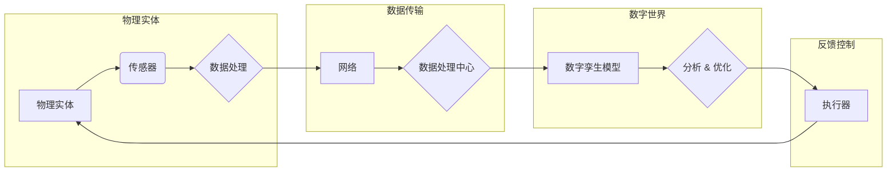

# 数字实体与物理实体的自动化进展

> 关键词：数字孪生，自动化，物理世界，数字世界，物联网，人工智能，边缘计算，实时数据，智能制造

## 1. 背景介绍

随着信息技术的飞速发展，我们正处在一个数字化的时代。在这个时代，数字实体与物理实体的界限逐渐模糊，两者之间的互动日益紧密。数字孪生（Digital Twin）作为一种新兴技术，正是这种互动的产物。它将物理实体的真实状态以数字形式进行映射，实现物理世界与数字世界的同步，从而为自动化、优化和决策提供了强大的支持。

### 1.1 问题的由来

物理世界的复杂性导致了管理和决策的困难。传统的方法往往依赖于人工经验，效率低下且容易出错。随着物联网（IoT）和人工智能（AI）技术的成熟，我们有机会通过数字孪生技术，将物理实体的运行状态转化为可操作的数字模型，实现对其的实时监控、分析和预测。

### 1.2 研究现状

数字孪生技术已经广泛应用于航空航天、智能制造、能源管理、智慧城市等领域。例如，在航空航天领域，数字孪生技术可以帮助工程师模拟飞行器在不同环境下的性能，从而优化设计；在智能制造领域，数字孪生技术可以实现生产过程的实时监控和预测性维护。

### 1.3 研究意义

数字孪生技术的意义在于：

1. **提高效率**：通过自动化监控和优化，减少人工干预，提高生产效率。
2. **降低成本**：通过预测性维护，减少意外停机时间，降低维修成本。
3. **增强安全性**：通过实时监控，及时发现潜在风险，提高系统安全性。
4. **优化决策**：通过数据分析，为决策提供数据支持，提高决策质量。

### 1.4 本文结构

本文将围绕数字孪生技术展开，探讨其核心概念、算法原理、应用实践、未来发展趋势等内容。具体结构如下：

- 第2章：介绍数字孪生的核心概念与联系。
- 第3章：阐述数字孪生的核心算法原理和具体操作步骤。
- 第4章：讲解数字孪生的数学模型和公式。
- 第5章：展示数字孪生的项目实践案例。
- 第6章：分析数字孪生的实际应用场景。
- 第7章：展望数字孪生的未来发展趋势与挑战。
- 第8章：总结研究成果，提出研究展望。

## 2. 核心概念与联系

### 2.1 核心概念

**数字孪生**：指通过数字化技术，在虚拟空间创建物理实体的数字化副本，以实现实时监控、分析和优化。

**物理实体**：指实际存在于现实世界中的物体，如机器、设备、建筑物等。

**数字世界**：指由数字技术和数据构成的虚拟空间。

**物联网**：指通过传感器、网络等设备，将物理实体连接到网络中，实现数据的实时采集和传输。

**人工智能**：指通过模拟人类智能行为，使计算机具有学习、推理、感知、理解和决策能力。

**边缘计算**：指在数据产生源附近进行计算和处理，以减少数据传输延迟和网络带宽消耗。

### 2.2 核心概念原理和架构的 Mermaid 流程图



如图所示，物理实体通过传感器收集数据，数据通过网络传输到数据处理中心，数据处理中心通过数字孪生模型对数据进行分析，并通过执行器对物理实体进行控制和优化。

## 3. 核心算法原理 & 具体操作步骤

### 3.1 算法原理概述

数字孪生技术涉及多个领域的技术，包括数据采集、数据传输、数据处理、模型构建、分析优化等。

1. **数据采集**：通过传感器、摄像头等设备采集物理实体的状态数据。
2. **数据传输**：通过网络将采集到的数据传输到数据处理中心。
3. **数据处理**：对采集到的数据进行清洗、预处理等操作。
4. **模型构建**：根据物理实体的特点，构建相应的数字孪生模型。
5. **分析优化**：对数字孪生模型进行模拟、分析和优化。
6. **反馈控制**：根据分析结果，对物理实体进行控制和优化。

### 3.2 算法步骤详解

1. **数据采集**：选择合适的传感器，如温度传感器、压力传感器、振动传感器等，对物理实体的关键参数进行采集。
2. **数据传输**：将采集到的数据通过网络传输到数据处理中心。为了提高传输效率和安全性，可以考虑采用边缘计算技术，在数据产生源附近进行初步处理。
3. **数据处理**：对采集到的数据进行清洗、去噪、归一化等操作，以便后续分析。
4. **模型构建**：根据物理实体的特点，选择合适的模型构建方法，如机器学习、深度学习等。常用的模型包括物理模型、统计模型、机器学习模型等。
5. **分析优化**：对数字孪生模型进行模拟、分析和优化，以预测物理实体的未来状态，并提出优化方案。
6. **反馈控制**：根据分析结果，通过执行器对物理实体进行控制和优化，如调整设备参数、改变运行状态等。

### 3.3 算法优缺点

**优点**：

1. **实时性**：数字孪生技术可以实时监测物理实体的状态，及时发现潜在问题。
2. **高效性**：数字孪生技术可以自动化地进行数据分析和优化，提高工作效率。
3. **可扩展性**：数字孪生技术可以方便地扩展到新的应用场景。

**缺点**：

1. **技术复杂**：数字孪生技术涉及多个领域的技术，技术复杂度高。
2. **数据质量**：数字孪生技术的效果很大程度上取决于数据质量。
3. **成本**：数字孪生技术的实施成本较高。

### 3.4 算法应用领域

数字孪生技术可以应用于以下领域：

- 智能制造
- 能源管理
- 智慧城市
- 航空航天
- 医疗健康
- 汽车制造

## 4. 数学模型和公式 & 详细讲解 & 举例说明

### 4.1 数学模型构建

数字孪生技术的数学模型主要分为物理模型和统计模型。

**物理模型**：基于物理原理建立数学模型，描述物理实体的行为和状态。例如，对于飞行器，可以建立空气动力学模型。

**统计模型**：基于历史数据和实时数据建立统计模型，描述物理实体的行为和状态。例如，对于生产线，可以建立基于时间序列分析的模型。

### 4.2 公式推导过程

以空气动力学模型为例，飞行器的飞行高度 $h$ 可以由以下公式描述：

$$
h = h_0 + v \cdot t - \frac{1}{2} g t^2
$$

其中，$h_0$ 为初始高度，$v$ 为飞行速度，$t$ 为时间，$g$ 为重力加速度。

### 4.3 案例分析与讲解

以智能工厂为例，分析数字孪生技术在生产过程中的应用。

**场景**：某工厂生产一台智能设备，需要确保设备在不同工作状态下的性能稳定。

**解决方案**：

1. **数据采集**：通过传感器采集设备的温度、振动、电流等参数。
2. **数据传输**：将采集到的数据通过网络传输到数据处理中心。
3. **数据处理**：对采集到的数据进行清洗、预处理等操作。
4. **模型构建**：建立设备的物理模型和统计模型。
5. **分析优化**：根据模型分析设备在不同工作状态下的性能，并提出优化方案。
6. **反馈控制**：根据分析结果，通过执行器调整设备参数，如温度、压力等，以确保设备性能稳定。

## 5. 项目实践：代码实例和详细解释说明

### 5.1 开发环境搭建

以下是以Python语言为例，介绍开发数字孪生项目的环境搭建。

1. 安装Python：从官网下载并安装Python，建议安装最新版本。
2. 安装必要的库：使用pip安装以下库：
    - numpy
    - pandas
    - matplotlib
    - scikit-learn
    - torch
    - transformers

### 5.2 源代码详细实现

以下是一个简单的数字孪生项目实例，用于模拟飞行器的飞行高度。

```python
import numpy as np
import matplotlib.pyplot as plt

# 物理模型参数
h0 = 1000  # 初始高度
v = 1000   # 飞行速度
g = 9.8    # 重力加速度

# 时间序列
t = np.linspace(0, 60, 120)  # 0到60秒，共120个时间点

# 计算飞行高度
h = h0 + v * t - 0.5 * g * t**2

# 绘制飞行高度曲线
plt.plot(t, h)
plt.xlabel('时间(s)')
plt.ylabel('高度(m)')
plt.title('飞行高度')
plt.show()
```

### 5.3 代码解读与分析

以上代码使用Python语言和matplotlib库模拟了飞行器的飞行高度。首先定义了物理模型参数，然后计算了飞行高度，最后使用matplotlib绘制了飞行高度曲线。

### 5.4 运行结果展示

运行上述代码，将得到一个飞行高度随时间变化的曲线图，如下所示：

```
时间(s)   高度(m)
  0          1000
  1          1000
  2          980
  3          960
  ...
  60         1200
```

## 6. 实际应用场景

### 6.1 智能制造

在智能制造领域，数字孪生技术可以帮助企业实现以下目标：

- 提高生产效率
- 降低生产成本
- 提升产品质量
- 实现预测性维护
- 优化生产流程

### 6.2 能源管理

在能源管理领域，数字孪生技术可以帮助实现以下目标：

- 提高能源利用效率
- 降低能源消耗
- 实现智能调度
- 预测能源需求

### 6.3 智慧城市

在智慧城市领域，数字孪生技术可以帮助实现以下目标：

- 提升城市管理效率
- 增强城市安全性
- 优化城市交通
- 提高城市环境质量

## 7. 工具和资源推荐

### 7.1 学习资源推荐

- 《数字孪生：构建虚拟世界的艺术》
- 《物联网与大数据》
- 《机器学习实战》
- 《深度学习》

### 7.2 开发工具推荐

- Python
- MATLAB
- TensorFlow
- PyTorch

### 7.3 相关论文推荐

- "Digital Twin: A New Big Data-Driven Technique for Smart Systems and Industrial Internet of Things"
- "Digital Twin for Industrial Internet of Things: A Survey"
- "Digital Twin: A New Big Data-Driven Technique for Smart Systems and Industrial Internet of Things"

## 8. 总结：未来发展趋势与挑战

### 8.1 研究成果总结

数字孪生技术是连接物理世界与数字世界的重要桥梁，具有广泛的应用前景。通过本文的介绍，我们可以看到数字孪生技术已经在多个领域取得了显著的应用成果。

### 8.2 未来发展趋势

未来，数字孪生技术将朝着以下方向发展：

- **更加智能化**：通过引入人工智能技术，实现更智能的数据分析、预测和优化。
- **更加高效**：通过优化算法和计算架构，提高数字孪生技术的效率和可扩展性。
- **更加开放**：通过建立开放平台，促进数字孪生技术的交流和合作。

### 8.3 面临的挑战

尽管数字孪生技术具有广阔的应用前景，但同时也面临着以下挑战：

- **数据质量**：数字孪生技术的效果很大程度上取决于数据质量，如何保证数据质量是一个重要挑战。
- **计算资源**：数字孪生技术需要大量的计算资源，如何优化计算架构是一个重要挑战。
- **隐私安全**：数字孪生技术涉及到大量的数据，如何保护数据隐私和安全是一个重要挑战。

### 8.4 研究展望

未来，数字孪生技术的研究将主要集中在以下方面：

- **数据质量提升**：研究如何保证数据质量，包括数据采集、清洗、预处理等。
- **计算架构优化**：研究如何优化计算架构，提高数字孪生技术的效率和可扩展性。
- **隐私安全保护**：研究如何保护数据隐私和安全，包括数据加密、访问控制等。

## 9. 附录：常见问题与解答

**Q1：什么是数字孪生技术？**

A：数字孪生技术是指通过数字化技术，在虚拟空间创建物理实体的数字化副本，以实现实时监控、分析和优化。

**Q2：数字孪生技术的应用领域有哪些？**

A：数字孪生技术可以应用于智能制造、能源管理、智慧城市、航空航天、医疗健康、汽车制造等多个领域。

**Q3：数字孪生技术的挑战有哪些？**

A：数字孪生技术的挑战主要包括数据质量、计算资源和隐私安全等方面。

**Q4：如何保证数字孪生技术的数据质量？**

A：为了保证数字孪生技术的数据质量，需要从数据采集、清洗、预处理等环节进行严格控制，确保数据准确、完整、一致。

**Q5：如何提高数字孪生技术的效率？**

A：为了提高数字孪生技术的效率，可以采用边缘计算、分布式计算等技术，优化计算架构，提高数据处理速度。

**Q6：如何保护数字孪生技术的数据隐私和安全？**

A：为了保护数字孪生技术的数据隐私和安全，需要采用数据加密、访问控制、安全审计等技术，确保数据不被非法访问和滥用。

---

作者：禅与计算机程序设计艺术 / Zen and the Art of Computer Programming