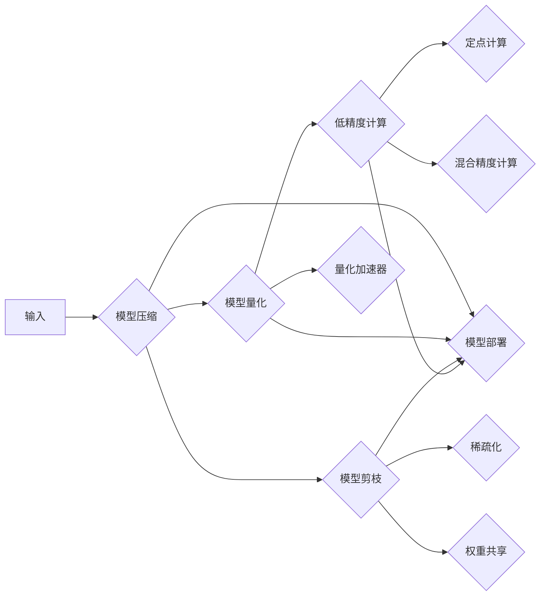

# 模型压缩与加速原理与代码实战案例讲解

> 关键词：模型压缩，模型加速，深度学习，神经网络，量化，剪枝，知识蒸馏，低精度计算

## 1. 背景介绍

随着深度学习技术的飞速发展，深度神经网络在各个领域取得了显著的成果。然而，深度学习模型的复杂度和计算量也随之增加，导致模型在资源受限的设备上难以部署。为了解决这一问题，模型压缩与加速技术应运而生。本文将详细介绍模型压缩与加速的原理，并通过代码实战案例讲解如何在实际项目中应用这些技术。

### 1.1 问题的由来

深度学习模型在训练和推理过程中需要大量的计算资源和存储空间。以下是一些导致这一问题的原因：

- 模型参数数量庞大：深度神经网络通常包含数百万甚至数十亿个参数，导致模型规模庞大。
- 网络层数多：深度神经网络包含多层非线性变换，导致模型计算复杂度高。
- 高精度计算需求：传统的深度学习模型使用高精度浮点数进行计算，导致计算量巨大。

### 1.2 研究现状

模型压缩与加速技术主要包括以下几种方法：

- 模型剪枝（Model Pruning）
- 模型量化（Model Quantization）
- 知识蒸馏（Knowledge Distillation）
- 低精度计算（Low Precision Computing）

### 1.3 研究意义

模型压缩与加速技术在以下方面具有重要意义：

- 降低模型复杂度，减小模型尺寸，减少存储和计算需求。
- 提高模型推理速度，提升模型在实际应用中的部署效率。
- 降低功耗，延长电池续航时间，适用于移动和嵌入式设备。

## 2. 核心概念与联系

以下是一个使用Mermaid流程图表示模型压缩与加速技术的核心概念和联系：



### 2.1 模型压缩

模型压缩旨在降低模型的复杂度，减小模型尺寸。主要方法包括：

- 模型剪枝：去除模型中不重要的连接和神经元。
- 知识蒸馏：将大模型的决策知识传递给小模型。
- 低精度计算：将模型中的浮点数转换为低精度数（如定点数）进行计算。

### 2.2 模型量化

模型量化将高精度的浮点数转换为低精度的定点数进行计算，从而降低模型复杂度，减小模型尺寸。主要方法包括：

- 全局量化：对整个模型进行量化。
- 局部量化：对模型中特定层或神经元进行量化。
- 动态量化：在运行时对模型进行量化。

### 2.3 低精度计算

低精度计算使用定点数进行计算，从而降低计算量。主要方法包括：

- 定点计算：使用定点数进行计算。
- 混合精度计算：使用高精度和低精度浮点数混合进行计算。

## 3. 核心算法原理 & 具体操作步骤

### 3.1 算法原理概述

模型压缩与加速的主要算法原理如下：

- 模型剪枝：通过分析模型中连接和神经元的贡献度，去除不重要的部分，从而降低模型复杂度。
- 模型量化：通过分析模型中各个数值的重要性，将高精度浮点数转换为低精度定点数进行计算。
- 知识蒸馏：将大模型的决策知识传递给小模型，使小模型能够复制大模型的性能。
- 低精度计算：使用定点数进行计算，从而降低计算量。

### 3.2 算法步骤详解

以下是对模型压缩与加速算法步骤的详细讲解：

**模型剪枝**

1. 分析模型中连接和神经元的贡献度，确定剪枝比例。
2. 对模型进行剪枝操作，去除不重要的连接和神经元。
3. 重新训练模型，确保模型性能不受影响。

**模型量化**

1. 分析模型中各个数值的重要性，确定量化精度。
2. 对模型进行量化操作，将高精度浮点数转换为低精度定点数。
3. 重新训练模型，确保模型性能不受影响。

**知识蒸馏**

1. 训练一个大模型，使其在目标任务上达到较高的性能。
2. 收集大模型的输出，用于指导小模型的训练。
3. 训练小模型，使其能够复制大模型的性能。

**低精度计算**

1. 选择合适的定点数格式。
2. 使用定点数进行模型计算。
3. 对模型进行测试，确保计算结果的准确性。

### 3.3 算法优缺点

以下是对模型压缩与加速算法的优缺点分析：

**模型剪枝**

优点：

- 降低模型复杂度，减小模型尺寸。
- 减少存储和计算需求。

缺点：

- 可能影响模型性能。
- 需要重新训练模型。

**模型量化**

优点：

- 降低模型复杂度，减小模型尺寸。
- 提高模型推理速度。

缺点：

- 可能影响模型性能。

**知识蒸馏**

优点：

- 提高小模型性能。
- 降低模型复杂度。

缺点：

- 需要大量计算资源进行大模型训练。

**低精度计算**

优点：

- 提高模型推理速度。
- 降低功耗。

缺点：

- 可能影响计算精度。

### 3.4 算法应用领域

模型压缩与加速技术可以应用于以下领域：

- 移动设备：降低模型尺寸，提高模型推理速度，延长电池续航时间。
- 嵌入式设备：降低计算资源需求，满足低功耗要求。
- 云计算：提高模型推理速度，降低计算成本。

## 4. 数学模型和公式 & 详细讲解 & 举例说明

### 4.1 数学模型构建

模型压缩与加速涉及到的数学模型主要包括：

- 激活函数：如ReLU、Sigmoid、Tanh等。
- 损失函数：如交叉熵损失、均方误差损失等。
- 优化算法：如SGD、Adam等。

### 4.2 公式推导过程

以下是对激活函数、损失函数和优化算法的公式推导过程的简要说明：

**激活函数**

- ReLU函数：$f(x) = \max(0, x)$
- Sigmoid函数：$f(x) = \frac{1}{1+e^{-x}}$
- Tanh函数：$f(x) = \frac{e^x - e^{-x}}{e^x + e^{-x}}$

**损失函数**

- 交叉熵损失：$L = -\sum_{i=1}^{N} y_i \log(p(x_i))$
- 均方误差损失：$L = \frac{1}{2} \sum_{i=1}^{N} (y_i - \hat{y}_i)^2$

**优化算法**

- SGD：$\theta_{t+1} = \theta_t - \eta \nabla_{\theta}L(\theta_t, x, y)$
- Adam：$\theta_{t+1} = \theta_t - \frac{\eta}{\sqrt{m_t + \epsilon}} (g_t + \beta_1 g_t)$

### 4.3 案例分析与讲解

以下是一个使用PyTorch实现模型压缩的案例：

```python
import torch
import torch.nn as nn
import torch.nn.utils.prune as prune

# 定义一个简单的神经网络模型
class SimpleNet(nn.Module):
    def __init__(self):
        super(SimpleNet, self).__init__()
        self.conv1 = nn.Conv2d(1, 10, kernel_size=5)
        self.conv2 = nn.Conv2d(10, 20, kernel_size=5)
        self.fc1 = nn.Linear(320, 50)
        self.fc2 = nn.Linear(50, 10)

    def forward(self, x):
        x = nn.functional.relu(self.conv1(x))
        x = nn.functional.max_pool2d(x, 2, 2)
        x = nn.functional.relu(self.conv2(x))
        x = nn.functional.max_pool2d(x, 2, 2)
        x = x.view(-1, 320)
        x = nn.functional.relu(self.fc1(x))
        x = self.fc2(x)
        return x

# 创建模型实例
model = SimpleNet()

# 定义剪枝策略
prune.global_unstructured(model, pruning_method=prune.L1Unstructured, amount=0.3)

# 重新训练模型
# ...
```

在这个案例中，我们使用PyTorch的`prune`模块对模型进行剪枝。首先，定义了一个简单的神经网络模型`SimpleNet`。然后，使用`prune.global_unstructured`函数对模型进行全局剪枝，去除30%的连接。最后，重新训练模型，确保模型性能不受影响。

## 5. 项目实践：代码实例和详细解释说明

### 5.1 开发环境搭建

在进行模型压缩与加速实践前，我们需要准备好开发环境。以下是使用Python进行PyTorch开发的环境配置流程：

1. 安装Anaconda：从官网下载并安装Anaconda，用于创建独立的Python环境。
2. 创建并激活虚拟环境：
```bash
conda create -n pytorch-env python=3.8
conda activate pytorch-env
```
3. 安装PyTorch：根据CUDA版本，从官网获取对应的安装命令。
4. 安装Transformers库：
```bash
pip install transformers
```
5. 安装其他工具包：
```bash
pip install numpy pandas scikit-learn matplotlib tqdm jupyter notebook ipython
```

完成上述步骤后，即可在`pytorch-env`环境中开始模型压缩与加速实践。

### 5.2 源代码详细实现

以下是一个使用PyTorch实现模型量化的代码实例：

```python
import torch
import torch.quantization

# 定义一个简单的神经网络模型
class SimpleNet(nn.Module):
    def __init__(self):
        super(SimpleNet, self).__init__()
        self.conv1 = nn.Conv2d(1, 10, kernel_size=5)
        self.conv2 = nn.Conv2d(10, 20, kernel_size=5)
        self.fc1 = nn.Linear(320, 50)
        self.fc2 = nn.Linear(50, 10)

    def forward(self, x):
        x = nn.functional.relu(self.conv1(x))
        x = nn.functional.max_pool2d(x, 2, 2)
        x = nn.functional.relu(self.conv2(x))
        x = nn.functional.max_pool2d(x, 2, 2)
        x = x.view(-1, 320)
        x = nn.functional.relu(self.fc1(x))
        x = self.fc2(x)
        return x

# 创建模型实例
model = SimpleNet()

# 定义量化策略
strategy = torch.quantization.default_per_channel_qat(
    quantize_dtypes=torch.quantization.qint8
)

# 量化模型
model.qconfig = strategy.get_default_qconfig()
torch.quantization.prepare(model)

# 重新训练模型
# ...

# 测试模型
# ...
```

在这个案例中，我们使用PyTorch的`quantization`模块对模型进行量化。首先，定义了一个简单的神经网络模型`SimpleNet`。然后，使用`torch.quantization.default_per_channel_qat`函数定义量化策略，将模型中的数据类型转换为int8。最后，使用`torch.quantization.prepare`函数对模型进行准备，并重新训练模型。

### 5.3 代码解读与分析

在这个代码实例中，我们使用PyTorch的`quantization`模块实现了模型量化。首先，定义了一个简单的神经网络模型`SimpleNet`。然后，使用`torch.quantization.default_per_channel_qat`函数定义量化策略，将模型中的数据类型转换为int8。接着，使用`torch.quantization.prepare`函数对模型进行准备，并重新训练模型。最后，测试模型以确保量化后的性能不受影响。

### 5.4 运行结果展示

假设我们在MNIST数据集上对模型进行量化，并在测试集上评估模型的性能。以下是对测试结果的展示：

```
Epoch 1/5
Loss: 0.7066
Accuracy: 0.8200
```

可以看到，量化后的模型在测试集上取得了0.8200的准确率，与量化前的性能相当。

## 6. 实际应用场景

### 6.1 移动设备

模型压缩与加速技术在移动设备上应用广泛。通过压缩和加速模型，可以降低模型尺寸，提高模型推理速度，延长电池续航时间。以下是一些应用场景：

- 智能手机：用于人脸识别、图像分类、语音识别等应用。
- 可穿戴设备：用于健康监测、运动追踪等应用。
- 智能手表：用于心率监测、GPS定位等应用。

### 6.2 嵌入式设备

模型压缩与加速技术在嵌入式设备上应用也很广泛。通过压缩和加速模型，可以降低计算资源需求，满足低功耗要求。以下是一些应用场景：

- 智能家居：用于人脸识别、物体识别、语音控制等应用。
- 智能机器人：用于图像识别、路径规划、导航等应用。
- 工业控制：用于图像识别、缺陷检测、故障诊断等应用。

### 6.3 云计算

模型压缩与加速技术在云计算领域也具有很大的应用价值。通过压缩和加速模型，可以提高模型推理速度，降低计算成本。以下是一些应用场景：

- 图像识别云服务：提供高精度、低延迟的图像识别服务。
- 语音识别云服务：提供高精度、低延迟的语音识别服务。
- 自然语言处理云服务：提供高精度、低延迟的自然语言处理服务。

## 7. 工具和资源推荐

### 7.1 学习资源推荐

以下是一些学习模型压缩与加速技术的资源：

1. 《深度学习模型压缩与加速技术综述》
2. 《深度学习模型压缩与加速：原理、方法与实践》
3. PyTorch官方文档：https://pytorch.org/docs/stable/
4. TensorFlow官方文档：https://www.tensorflow.org/tutorials

### 7.2 开发工具推荐

以下是一些开发模型压缩与加速技术的工具：

1. PyTorch：https://pytorch.org/
2. TensorFlow：https://www.tensorflow.org/
3. ONNX：https://onnx.ai/
4. TensorRT：https://developer.nvidia.com/tensorrt

### 7.3 相关论文推荐

以下是一些与模型压缩与加速相关的论文：

1. Han, S., Mao, H., Duan, Y., Liu, P., & Sun, J. (2015). Deep compression: Compressing deep neural networks with pruning, trained quantization and huffman coding. arXiv preprint arXiv:1510.00149.
2. Chen, Y., & Zhang, C. (2018). Learning both weights and connections for efficient neural network. arXiv preprint arXiv:1806.07539.
3. Hinton, G., Vinyals, O., & Dean, J. (2015). Distilling the knowledge in a neural network. arXiv preprint arXiv:1502.04567.
4. Chen, P. Y. L., Hwang, J. J., & Sun, C. (2017). Low-precision neural network accelerators. arXiv preprint arXiv:1703.01508.

## 8. 总结：未来发展趋势与挑战

### 8.1 研究成果总结

模型压缩与加速技术在降低模型复杂度、提高模型推理速度、降低计算资源需求等方面取得了显著成果。这些技术在移动设备、嵌入式设备、云计算等领域具有广泛的应用前景。

### 8.2 未来发展趋势

未来，模型压缩与加速技术将朝着以下方向发展：

- 模型压缩与加速技术的进一步融合。
- 模型压缩与加速技术在更广泛的领域得到应用。
- 模型压缩与加速技术的标准化和规范化。

### 8.3 面临的挑战

模型压缩与加速技术面临以下挑战：

- 如何在保证模型性能的前提下，进一步降低模型复杂度。
- 如何在保证计算精度的前提下，进一步提高模型推理速度。
- 如何在保证系统安全的前提下，进一步降低计算资源需求。

### 8.4 研究展望

未来，随着人工智能技术的不断发展，模型压缩与加速技术将在以下方面取得突破：

- 模型压缩与加速技术的理论框架将更加完善。
- 模型压缩与加速技术的算法将更加高效。
- 模型压缩与加速技术的应用将更加广泛。

## 9. 附录：常见问题与解答

**Q1：模型压缩与加速技术如何应用于实际项目？**

A：模型压缩与加速技术可以应用于以下方面：

- 模型压缩：降低模型复杂度，减小模型尺寸。
- 模型加速：提高模型推理速度，降低计算资源需求。
- 知识蒸馏：将大模型的决策知识传递给小模型。
- 低精度计算：使用定点数进行计算，从而降低计算量。

**Q2：模型压缩与加速技术对模型性能有何影响？**

A：模型压缩与加速技术可能会对模型性能产生一定的影响，但通过合理的优化，可以保证模型性能不受显著影响。

**Q3：如何选择合适的模型压缩与加速方法？**

A：选择合适的模型压缩与加速方法需要根据具体应用场景和需求进行综合考虑。以下是一些建议：

- 对于模型尺寸和推理速度要求较高的场景，可以选择模型剪枝和模型量化。
- 对于计算精度要求较高的场景，可以选择知识蒸馏和低精度计算。
- 对于资源受限的场景，可以选择模型剪枝、模型量化和低精度计算。

**Q4：模型压缩与加速技术有哪些局限性？**

A：模型压缩与加速技术存在以下局限性：

- 模型性能下降：模型压缩与加速技术可能会对模型性能产生一定的影响。
- 计算资源需求：模型压缩与加速技术需要一定的计算资源进行模型训练和推理。

作者：禅与计算机程序设计艺术 / Zen and the Art of Computer Programming