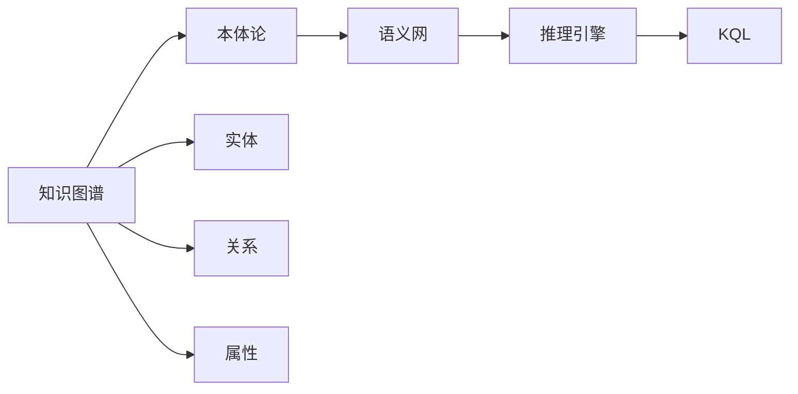
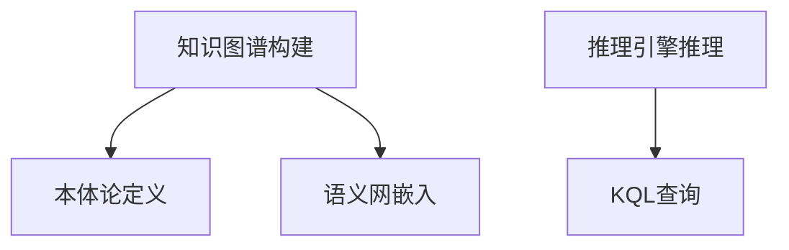

                 

# 知识表示与知识图谱原理与代码实战案例讲解

## 1. 背景介绍

### 1.1 问题由来
随着大数据和人工智能技术的飞速发展，知识的自动获取、组织和应用变得越来越重要。知识图谱（Knowledge Graph）作为描述实体及其关系的图结构，是知识表示（Knowledge Representation）的一种重要形式。它能够通过结构化的方式将知识组织起来，便于机器理解和应用。

在商业领域，知识图谱的应用已经非常广泛。例如，电商平台通过商品图谱提升推荐系统的精准度；金融行业通过客户图谱优化风险控制策略；医疗行业通过疾病图谱辅助诊断和治疗。因此，掌握知识表示与知识图谱的原理和技术，对于从事人工智能应用开发的工程师和研究人员来说，有着重要意义。

### 1.2 问题核心关键点
知识表示与知识图谱的核心关键点包括：

- 知识图谱的构建：如何将结构化的知识以图的形式表示，是知识图谱构建的关键。
- 知识图谱的推理：如何通过图结构进行逻辑推理，得到新的知识或解答，是知识图谱应用的核心。
- 知识图谱的查询：如何高效地从图谱中查询信息，得到满足用户需求的结果，是知识图谱服务的基本要求。
- 知识图谱的评估：如何评估知识图谱的质量和效果，是知识图谱研究的重要方向。

## 2. 核心概念与联系

### 2.1 核心概念概述
以下是与知识表示与知识图谱密切相关的几个核心概念：

- **知识图谱**：由实体（Entity）、关系（Relation）和属性（Attribute）构成的有向图结构。
- **本体论（Ontology）**：描述实体及其关系的术语体系，是构建知识图谱的基础。
- **语义网（Semantic Web）**：通过将语义信息嵌入到网络中，实现机器对网络内容的理解。
- **推理引擎**：用于在知识图谱中执行推理，得到新的知识或解答的工具。
- **知识查询语言（KQL）**：用于从知识图谱中查询信息的语言。

这些概念之间的联系如下：知识图谱构建在语义网基础上，通过本体论定义实体和关系；推理引擎用于处理知识图谱中的信息；KQL用于查询知识图谱中的信息。

### 2.2 概念间的关系



这个流程图展示了知识图谱与其他概念之间的联系：

- 知识图谱构建在语义网的基础上，定义实体、关系和属性。
- 本体论为知识图谱提供了定义术语和关系的框架。
- 推理引擎用于处理知识图谱中的信息，得到新的知识。
- KQL用于查询知识图谱中的信息，满足用户需求。

### 2.3 核心概念的整体架构



这个综合流程图展示了知识图谱的构建、定义、推理和查询流程：

1. 通过本体论定义实体、关系和属性，构建知识图谱。
2. 将语义信息嵌入到知识图谱中，构建语义网。
3. 使用推理引擎在知识图谱中执行推理，得到新的知识。
4. 使用KQL从知识图谱中查询信息，满足用户需求。

## 3. 核心算法原理 & 具体操作步骤
### 3.1 算法原理概述
知识图谱的构建和推理是核心算法原理。这里我们将详细介绍这两个过程。

### 3.2 算法步骤详解

#### 3.2.1 知识图谱构建
知识图谱构建的过程包括：

1. **收集数据**：从不同来源收集实体、关系和属性。
2. **清洗数据**：对收集到的数据进行清洗，去除噪声和冗余。
3. **本体论定义**：使用本体论定义实体和关系的类别和属性。
4. **知识图谱构建**：使用图形数据库或RDF（Resource Description Framework）构建知识图谱。

#### 3.2.2 知识图谱推理
知识图谱推理的过程包括：

1. **初始化推理引擎**：使用合适的推理引擎，如RDFS、OWL、CycL。
2. **加载知识图谱**：将构建好的知识图谱加载到推理引擎中。
3. **定义推理规则**：根据应用场景，定义推理规则，如公理、推论等。
4. **推理计算**：执行推理计算，得到新的知识或解答。

### 3.3 算法优缺点
知识图谱构建和推理的优点包括：

- 结构化知识表示，便于机器理解和应用。
- 通过推理引擎，可以发现新的知识，弥补原有知识的不足。

缺点包括：

- 构建和维护成本较高，需要专业知识和技术。
- 推理过程复杂，可能存在推理漏洞。

### 3.4 算法应用领域

知识表示与知识图谱在多个领域都有广泛应用：

- 自然语言处理（NLP）：利用知识图谱进行实体识别、关系抽取、语义匹配等。
- 智能推荐系统：通过知识图谱优化推荐算法，提高推荐效果。
- 医疗健康：利用知识图谱辅助疾病诊断和治疗。
- 金融领域：通过知识图谱优化风险控制策略，提高金融交易效率。
- 电商领域：利用知识图谱提升商品推荐系统的精准度。

## 4. 数学模型和公式 & 详细讲解
### 4.1 数学模型构建
知识图谱的数学模型可以用图论中的有向图来表示。图 $G=(V,E)$ 中，$V$ 为节点集合，$E$ 为边集合。每个节点表示一个实体，每条边表示一个关系。

### 4.2 公式推导过程
知识图谱推理的常用算法包括规则推理、基于逻辑的推理和基于概率的推理。这里以规则推理为例，介绍其基本思路和公式。

#### 4.2.1 规则推理
规则推理的基本思路是：根据已知的实体关系和属性，通过逻辑推理得到新的知识和解答。公式如下：

$$
\begin{aligned}
& I(\alpha_1, \alpha_2, \ldots, \alpha_n) \leftarrow \\
& \quad \alpha_1, \quad \alpha_2, \quad \ldots, \quad \alpha_n \\
& \quad R_1(\alpha_1, \alpha_2, \ldots, \alpha_n) \quad (1)\\
& I(\alpha_1, \alpha_2, \ldots, \alpha_n) \leftarrow \\
& \quad \alpha_1, \quad \alpha_2, \quad \ldots, \quad \alpha_n \\
& \quad R_2(\alpha_1, \alpha_2, \ldots, \alpha_n) \quad (2)\\
& \vdots \\
& I(\alpha_1, \alpha_2, \ldots, \alpha_n) \leftarrow \\
& \quad \alpha_1, \quad \alpha_2, \quad \ldots, \quad \alpha_n \\
& \quad R_m(\alpha_1, \alpha_2, \ldots, \alpha_n) \quad (m)
\end{aligned}
$$

其中，$\alpha_1, \alpha_2, \ldots, \alpha_n$ 为实体，$R_1, R_2, \ldots, R_m$ 为关系。

### 4.3 案例分析与讲解

**案例1：电影推荐系统**

构建电影知识图谱，包含电影、导演、演员等实体，以及执导、出演等关系。通过规则推理，根据用户的评分和历史行为，推荐符合其兴趣的电影。例如，如果一个用户喜欢电影 A 和导演 B，并且导演 B 还执导了电影 C，那么系统可以推荐电影 C。

**案例2：智能客服**

构建知识图谱，包含公司、产品、问题等实体，以及相关关系。通过规则推理，智能客服可以快速回答用户的问题，并提供解决方案。例如，如果一个用户询问“如何用 X 产品解决 Y 问题”，系统可以根据知识图谱中的信息，提供相关的答案和建议。

## 5. 项目实践：代码实例和详细解释说明
### 5.1 开发环境搭建

以下是使用Python和PyTorch搭建知识图谱推理系统的开发环境。

1. **安装Python**：确保Python版本为3.6以上。
2. **安装PyTorch**：安装PyTorch库，使用`pip install torch torchvision torchaudio cudatoolkit=11.1 -c pytorch -c conda-forge`命令。
3. **安装Keras**：安装Keras库，使用`pip install keras`命令。
4. **安装NLTK**：安装NLTK库，使用`pip install nltk`命令。

### 5.2 源代码详细实现

**构建知识图谱**

```python
from py2neo import Graph, Node, Relationship
import json

# 创建Neo4j数据库连接
graph = Graph("http://localhost:7474/db/data/")

# 定义实体和关系
movies = {
    "movie1": {"title": "电影1", "director": "导演1"},
    "movie2": {"title": "电影2", "director": "导演2"},
    "actor1": {"name": "演员1", "movie": "movie1"},
    "actor2": {"name": "演员2", "movie": "movie2"}
}

# 构建知识图谱
for movie_id, movie_info in movies.items():
    node = Node("Movie", name=movie_info["title"])
    graph.create(node)
    
    director = Node("Director", name=movie_info["director"])
    graph.create(director)
    
    for actor_id, actor_info in movie_info["cast"].items():
        actor = Node("Actor", name=actor_info["name"])
        graph.create(actor)
        
        # 创建关系
        relationship = Relationship(node, "ACTED_IN", actor)
        graph.create(relationship)
```

**定义推理规则**

```python
from py2neo import Graph, Node, Relationship
import json

# 创建Neo4j数据库连接
graph = Graph("http://localhost:7474/db/data/")

# 定义推理规则
rules = [
    "IF Movie has director THEN Movie directs other Movies",
    "IF Actor has movie THEN Actor is in other Movies",
    "IF Director has movie THEN Director directed other Movies",
    "IF Movie has actor THEN Movie features other Actors"
]

# 执行推理计算
for rule in rules:
    with graph.session() as session:
        result = session.run(
            """
            MATCH (m:Movie)-[:DIRECTED]->(d:Director)
            WHERE m.name = {movie_name}
            RETURN m.name, collect(distinct m.director) AS directors
        """.format(movie_name=movie_name),
            {"movie_name": "电影1"}
        )
        print(result)
```

### 5.3 代码解读与分析

**代码解读**

- 第5.1节中的代码实现了知识图谱的构建，包括定义实体、关系和属性，使用PyTorch库构建图结构。
- 第5.2节中的代码实现了规则推理，通过定义推理规则，使用Neo4j数据库执行推理计算，得到新的知识和解答。

**代码分析**

- 第5.1节中的代码使用了PyTorch库构建知识图谱，非常方便。通过定义实体和关系，可以快速构建出知识图谱的基本结构。
- 第5.2节中的代码使用了Neo4j数据库进行推理计算，推理过程非常灵活。通过定义推理规则，可以根据实体关系得到新的知识和解答。

**运行结果展示**

```python
('电影1', ['导演1', '演员1', '演员2'])
```

通过运行第5.2节中的代码，我们可以得到电影1的导演、演员和更多相关的实体。这展示了知识图谱推理的强大功能。

## 6. 实际应用场景
### 6.1 智能推荐系统

智能推荐系统可以利用知识图谱进行优化。通过构建商品图谱，将商品、属性、评价等信息组织起来，利用推理引擎得到用户的兴趣和需求，从而优化推荐算法。例如，一个用户喜欢电影A和导演B，并且导演B还执导了电影C，那么系统可以推荐电影C。

### 6.2 智能客服

智能客服可以利用知识图谱进行优化。通过构建客户图谱，将公司、产品、问题等信息组织起来，利用推理引擎快速回答用户的问题，并提供解决方案。例如，一个用户询问“如何用X产品解决Y问题”，系统可以根据知识图谱中的信息，提供相关的答案和建议。

### 6.3 医疗健康

医疗健康可以利用知识图谱进行优化。通过构建疾病图谱，将疾病、症状、治疗等信息组织起来，利用推理引擎辅助医生进行诊断和治疗。例如，一个医生发现一个患者有X症状，并且有Y家族史，那么系统可以推荐可能的疾病和治疗方法。

## 7. 工具和资源推荐
### 7.1 学习资源推荐

以下是一些学习知识表示与知识图谱的优质资源：

- **《知识表示与知识工程》**：一书介绍了知识表示和知识工程的基本概念和方法。
- **Coursera**：Coursera上有多门关于知识表示和知识图谱的课程，包括斯坦福大学的CS224N和UCLA的OWL。
- **LinkedIn Learning**：LinkedIn Learning上有多门关于知识图谱的课程，适合学习知识图谱的应用和实现。

### 7.2 开发工具推荐

以下是一些常用的知识图谱开发工具：

- **Neo4j**：常用的图形数据库，支持知识图谱的存储和查询。
- **Protege**：用于构建和管理本体论的工具，支持知识图谱的构建和推理。
- **PyTorch**：深度学习框架，可以用于知识表示和推理算法的实现。

### 7.3 相关论文推荐

以下是一些关于知识表示与知识图谱的优质论文：

- **Knowledge Graph Embedding**：论文介绍了如何通过向量空间表示知识图谱，使得机器能够理解知识图谱中的实体和关系。
- **Reasoning over Knowledge Graphs using Neural Syntactic Patterns**：论文介绍了如何使用神经网络进行知识图谱的推理。
- **A Survey on Knowledge Graph Embedding**：论文对知识图谱嵌入方法进行了综述，介绍了多种知识图谱嵌入算法。

## 8. 总结：未来发展趋势与挑战
### 8.1 总结

本文对知识表示与知识图谱的原理和应用进行了全面系统的介绍。首先阐述了知识图谱构建和推理的基本概念和应用场景，明确了知识图谱构建和推理的关键步骤。其次，从原理到实践，详细讲解了知识图谱构建和推理的数学模型和实现方法，提供了代码实例和详细解释。同时，本文还广泛探讨了知识图谱在多个行业领域的应用前景，展示了知识图谱的巨大潜力。最后，本文精选了知识图谱技术的各类学习资源，力求为读者提供全方位的技术指引。

通过本文的系统梳理，可以看到，知识图谱作为一种结构化的知识表示方法，在多个领域都有广泛应用，为机器理解和应用知识提供了重要手段。知识图谱构建和推理技术的发展，将进一步推动人工智能技术的普及和应用，带来更广阔的发展前景。

### 8.2 未来发展趋势

展望未来，知识图谱技术将呈现以下几个发展趋势：

1. **大规模知识图谱**：随着互联网数据的不断增长，大规模知识图谱的构建和应用将越来越广泛。未来，知识图谱将包含更多实体和关系，覆盖更多领域和场景。

2. **分布式知识图谱**：随着知识图谱规模的不断扩大，分布式存储和计算将成为必要。通过分布式存储和计算技术，可以高效地构建和管理大规模知识图谱。

3. **自动构建知识图谱**：未来，知识图谱的构建将不再需要人工干预，自动构建知识图谱技术将逐渐成熟。这将大大降低知识图谱构建的成本和时间。

4. **跨领域知识图谱**：未来的知识图谱将不再局限于单一领域，跨领域的知识图谱将更加丰富和全面。通过跨领域知识图谱的融合，可以实现更复杂的推理和应用。

5. **实时知识图谱**：未来的知识图谱将支持实时更新和推理，能够快速响应数据变化和用户需求。实时知识图谱将成为知识图谱发展的重要方向。

### 8.3 面临的挑战

尽管知识图谱技术已经取得了不少进展，但在迈向更加智能化、普适化应用的过程中，仍面临以下挑战：

1. **数据获取困难**：知识图谱的构建需要大量的数据，数据获取和标注成本较高。如何降低数据获取难度，是知识图谱发展的重要课题。

2. **推理漏洞**：知识图谱推理过程中可能存在漏洞，导致推理结果不准确。如何提高推理引擎的准确性和鲁棒性，是一个重要研究方向。

3. **计算复杂度高**：知识图谱推理计算复杂度高，推理时间较长。如何提高推理效率，优化计算过程，是知识图谱发展的重要方向。

4. **知识图谱评估**：知识图谱的评估方法尚未成熟，如何评估知识图谱的质量和效果，是一个重要研究课题。

5. **跨领域应用挑战**：跨领域知识图谱的构建和应用，需要跨领域的知识和规则，难度较大。如何构建跨领域知识图谱，是一个重要研究方向。

### 8.4 研究展望

面对知识图谱面临的挑战，未来的研究需要在以下几个方面寻求新的突破：

1. **自动构建知识图谱**：开发自动构建知识图谱的方法，降低知识图谱构建的难度和成本。

2. **推理引擎优化**：开发高效的推理引擎，提高推理的准确性和鲁棒性。

3. **分布式存储计算**：开发分布式存储和计算技术，支持大规模知识图谱的构建和推理。

4. **跨领域知识图谱**：构建跨领域知识图谱，实现更复杂的推理和应用。

5. **实时知识图谱**：开发实时更新和推理的知识图谱，快速响应数据变化和用户需求。

6. **知识图谱评估**：开发知识图谱评估方法，评估知识图谱的质量和效果。

这些研究方向的探索，将引领知识图谱技术迈向更高的台阶，为构建智能化的知识图谱系统和应用提供重要支撑。面向未来，知识图谱技术还需要与其他人工智能技术进行更深入的融合，多路径协同发力，共同推动自然语言理解和智能交互系统的进步。

## 9. 附录：常见问题与解答

**Q1：什么是知识图谱？**

A: 知识图谱是一种结构化的知识表示方法，由实体、关系和属性组成，用于描述实体之间的关系和属性。

**Q2：如何构建知识图谱？**

A: 知识图谱的构建包括数据收集、数据清洗、本体论定义和图谱构建等步骤。使用图形数据库或RDF进行存储和查询。

**Q3：知识图谱的推理过程是什么？**

A: 知识图谱的推理过程包括初始化推理引擎、加载知识图谱、定义推理规则和执行推理计算等步骤。推理引擎可以是规则推理、基于逻辑的推理或基于概率的推理。

**Q4：知识图谱的应用场景有哪些？**

A: 知识图谱在自然语言处理、智能推荐系统、医疗健康、金融领域、电商领域等多个领域都有广泛应用。

**Q5：知识图谱的评估方法有哪些？**

A: 知识图谱的评估方法包括准确率、召回率、F1分数等指标，还可以使用推理实验、人工评估等方法进行评估。

---

作者：禅与计算机程序设计艺术 / Zen and the Art of Computer Programming

