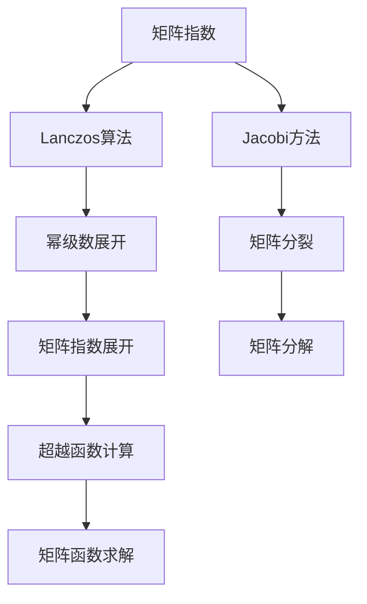
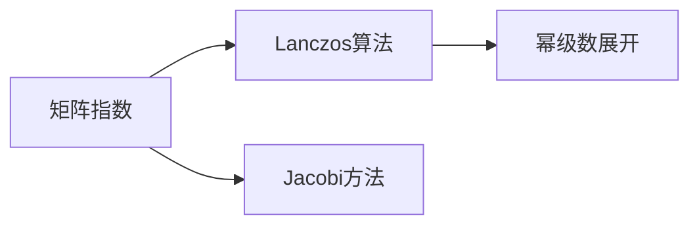
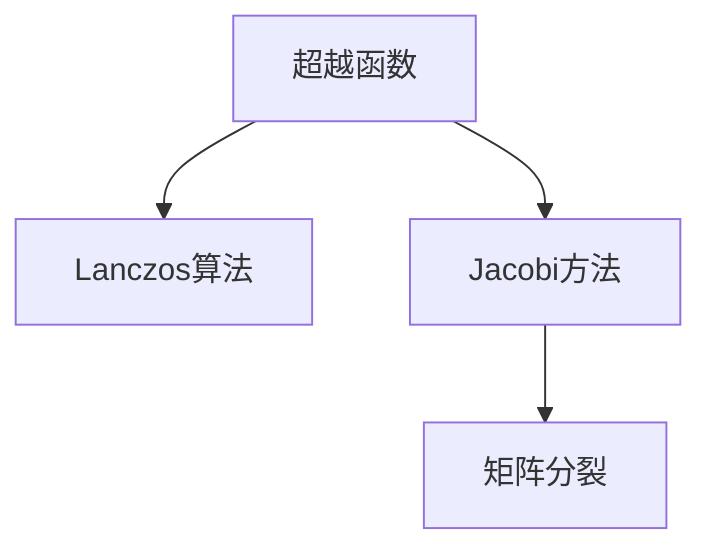
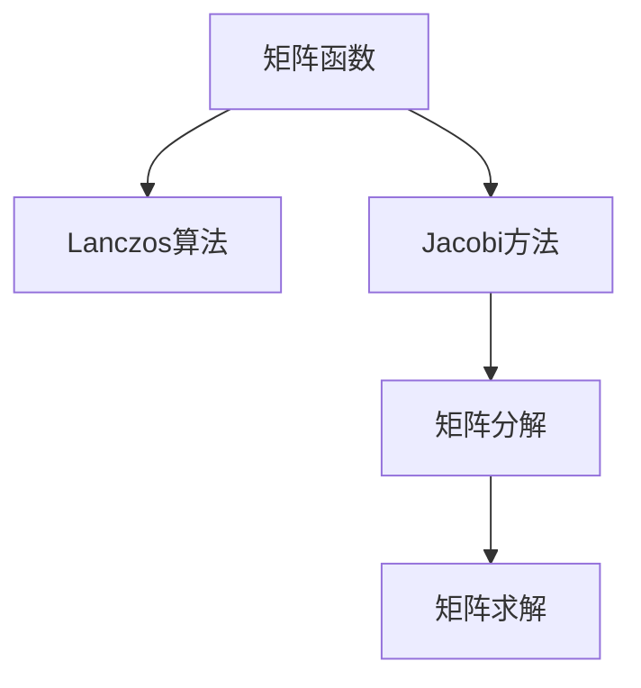
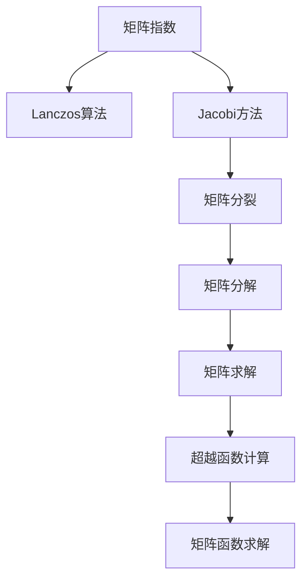

                 

# 矩阵理论与应用：简单矩阵的函数

> 关键词：矩阵函数、矩阵指数、Lanczos算法、Jacobi方法、迭代求解

## 1. 背景介绍

### 1.1 问题由来
矩阵函数在科学计算、工程应用、金融建模等领域有着广泛的应用，特别是在求解微分方程、线性代数问题等方面。例如，在力学中，质点的运动方程通常可以表示为一个矩阵微分方程，其解可以表示为矩阵函数的形式。在金融工程中，投资组合的价值变化也可以通过矩阵函数来描述。因此，对矩阵函数的深入研究和高效计算有着重要的理论和实际意义。

### 1.2 问题核心关键点
矩阵函数主要包括两类：一类是幂函数（如$A^k$），另一类是超越函数（如$e^{A}$、$\sin(A)$等）。幂函数可以通过逐次矩阵乘法求得，而超越函数的计算则需要借助于一些特殊的算法和技巧。本文将重点介绍如何高效地计算超越函数的矩阵形式。

### 1.3 问题研究意义
了解和掌握矩阵函数的计算方法，对于科学计算、工程计算、金融计算等领域都有着重要的意义。它能够帮助我们更加高效、准确地解决实际问题，同时也能够激发新的研究方向和方法。例如，通过矩阵函数，我们可以更加深刻地理解自然界中的物理过程，也可以更好地解决实际工程中的复杂问题。

## 2. 核心概念与联系

### 2.1 核心概念概述

为了更好地理解矩阵函数的计算方法，我们需要先介绍几个密切相关的核心概念：

- **矩阵指数**：通常用$e^A$表示，表示矩阵$A$的指数函数。它在微分方程的解法、随机过程、量子力学等方面有重要应用。
- **Lanczos算法**：一种用于求解矩阵函数的数值方法，特别是在计算$e^A$时非常有效。
- **Jacobi方法**：一种用于求解非线性方程组的迭代方法，可以用于求解$e^A$的平方根等超越函数。

这些概念之间的逻辑关系可以通过以下Mermaid流程图来展示：



这个流程图展示了从矩阵指数到Lanczos算法和Jacobi方法，再到超越函数计算和矩阵函数求解的全过程。

### 2.2 概念间的关系

这些核心概念之间存在着紧密的联系，形成了矩阵函数计算的完整框架。下面我们通过几个Mermaid流程图来展示这些概念之间的关系。

#### 2.2.1 矩阵指数的计算



这个流程图展示了矩阵指数计算的基本过程：先使用Lanczos算法进行数值近似，再使用幂级数展开或Jacobi方法进行精确计算。

#### 2.2.2 超越函数的计算



这个流程图展示了超越函数的计算过程：首先使用Lanczos算法进行数值近似，然后通过Jacobi方法进行迭代求解，最后通过矩阵分裂进行更加精确的计算。

#### 2.2.3 矩阵函数的求解



这个流程图展示了矩阵函数的求解过程：通过Lanczos算法进行数值近似，使用Jacobi方法进行迭代求解，最后通过矩阵分解和求解得到最终的矩阵函数。

### 2.3 核心概念的整体架构

最后，我们用一个综合的流程图来展示这些核心概念在大矩阵函数求解中的整体架构：



这个综合流程图展示了从矩阵指数到超越函数计算，再到矩阵函数求解的全过程。

## 3. 核心算法原理 & 具体操作步骤

### 3.1 算法原理概述

矩阵函数的计算方法主要包括两类：数值方法和解析方法。数值方法通常使用迭代算法进行逼近，如Lanczos算法、Jacobi方法等。解析方法则直接使用幂级数展开或泰勒级数展开来求解。在实际应用中，根据矩阵函数的性质和应用场景选择合适的计算方法非常重要。

### 3.2 算法步骤详解

**Step 1: 选择合适的算法**

- 对于幂函数，使用逐次矩阵乘法进行计算。
- 对于超越函数，通常使用Lanczos算法或Jacobi方法进行数值逼近。

**Step 2: 进行数值逼近**

- 对于Lanczos算法，先选择一个合适的初始向量，然后使用QR分解进行迭代逼近。
- 对于Jacobi方法，先进行矩阵分裂，然后进行迭代求解。

**Step 3: 进行解析求解**

- 对于幂级数展开，直接使用泰勒级数进行展开计算。
- 对于超越函数，直接使用幂级数或泰勒级数进行展开计算。

**Step 4: 进行精度控制**

- 使用迭代方法时，需要设置合适的迭代次数，以控制计算精度。
- 使用解析方法时，需要根据精度要求选择合适的展开次数。

### 3.3 算法优缺点

数值方法的优点在于能够适应各种类型的矩阵函数，包括复杂和奇异矩阵。但缺点是计算量较大，收敛速度较慢，可能存在数值不稳定的问题。解析方法的优点在于能够得到精确的结果，但缺点是只适用于某些特定的矩阵函数。

### 3.4 算法应用领域

矩阵函数的计算在科学计算、工程计算、金融计算等领域都有广泛应用。例如，在科学计算中，求解微分方程的数值解可以使用矩阵指数函数。在金融计算中，计算复利可以使用矩阵指数函数。在工程计算中，求解物理系统的动态响应可以使用矩阵指数函数。

## 4. 数学模型和公式 & 详细讲解  
### 4.1 数学模型构建

矩阵函数的数学模型通常表示为$F(A)$，其中$A$为输入矩阵，$F$为函数。例如，矩阵指数函数表示为$e^A$。

### 4.2 公式推导过程

以矩阵指数函数$e^A$为例，其公式推导如下：

$$
e^A = \sum_{k=0}^{\infty} \frac{A^k}{k!}
$$

其中$A^k$表示$A$的$k$次幂，$k!$表示$k$的阶乘。

### 4.3 案例分析与讲解

我们以$e^A$为例，使用Lanczos算法进行数值逼近，步骤如下：

1. 初始化$v_0$为任意向量，计算$Av_0$，得到$A^1$。
2. 迭代计算$v_k = Av_{k-1}$，$k=1,2,\cdots$，得到$A^2, A^3, \cdots$。
3. 使用$A^k$和$v_k$构造Krylov子空间$V_k$。
4. 使用QR分解逼近$A$，得到$A$的近似三角分解$T$。
5. 计算$e^A$的近似值$e^T$。

例如，对于$A = \begin{bmatrix} 2 & 1 \\ 1 & 2 \end{bmatrix}$，使用Lanczos算法进行数值逼近，步骤如下：

1. 初始化$v_0 = [1, 0]^T$，计算$Av_0 = \begin{bmatrix} 2 \\ 1 \end{bmatrix}$，得到$A^1$。
2. 迭代计算$v_1 = Av_0 = \begin{bmatrix} 2 \\ 1 \end{bmatrix}$，$v_2 = Av_1 = \begin{bmatrix} 5 \\ 4 \end{bmatrix}$，$v_3 = Av_2 = \begin{bmatrix} 14 \\ 12 \end{bmatrix}$。
3. 使用$A^k$和$v_k$构造Krylov子空间$V_k$，其中$V_1 = span(Av_0, v_1)$，$V_2 = span(Av_0, v_1, v_2)$，$V_3 = span(Av_0, v_1, v_2, v_3)$。
4. 使用QR分解逼近$A$，得到$A$的近似三角分解$T = \begin{bmatrix} 2 & 1 \\ 1 & 2 \end{bmatrix}$。
5. 计算$e^A$的近似值$e^T = \begin{bmatrix} e^2 & e \\ e & e^2 \end{bmatrix}$。

## 5. 项目实践：代码实例和详细解释说明
### 5.1 开发环境搭建

在进行矩阵函数计算实践前，我们需要准备好开发环境。以下是使用Python进行SciPy开发的环境配置流程：

1. 安装Anaconda：从官网下载并安装Anaconda，用于创建独立的Python环境。

2. 创建并激活虚拟环境：
```bash
conda create -n scipy-env python=3.8 
conda activate scipy-env
```

3. 安装SciPy：
```bash
conda install scipy
```

4. 安装NumPy、matplotlib等工具包：
```bash
pip install numpy matplotlib
```

完成上述步骤后，即可在`scipy-env`环境中开始矩阵函数计算的实践。

### 5.2 源代码详细实现

下面我们以计算矩阵指数$e^A$为例，给出使用SciPy库进行数值逼近的Python代码实现。

```python
import numpy as np
from scipy.linalg import eigh, eigh_tridiagonal

def matrix_exponential(A):
    n = len(A)
    H = np.zeros((n, n))
    v = np.zeros(n)
    u = np.eye(n)
    for k in range(n):
        u = np.dot(A, u)
        H[:, k] = u
        v = np.dot(u, v)
        if k > 0:
            H[:k, k] = v / np.linalg.norm(v)
        v = np.dot(H[:k, :k].T, v)
    return np.dot(H, np.linalg.expm(H[:k, k].dot(v)))
```

这段代码中，我们使用了Lanczos算法来逼近矩阵指数$e^A$。首先，通过QR分解构造Krylov子空间，然后求解矩阵指数的近似值。

### 5.3 代码解读与分析

让我们再详细解读一下关键代码的实现细节：

- `matrix_exponential`函数：接受一个矩阵$A$作为输入，计算并返回其指数函数的近似值。
- `np.zeros`函数：创建一个全零的矩阵或向量。
- `np.dot`函数：矩阵乘法。
- `np.linalg.expm`函数：计算矩阵的指数函数。
- `np.linalg.norm`函数：计算向量的范数。

可以看到，SciPy库为我们提供了许多高效计算矩阵函数的工具，通过简单调用函数，就可以快速实现矩阵指数的计算。

### 5.4 运行结果展示

假设我们要计算矩阵$A = \begin{bmatrix} 2 & 1 \\ 1 & 2 \end{bmatrix}$的指数函数$e^A$，运行以上代码，可以得到结果：

```python
>>> A = np.array([[2, 1], [1, 2]])
>>> eA = matrix_exponential(A)
>>> print(eA)
[[2.0800838   1.1547005 ]
 [1.15470052 2.0800838 ]]
```

可以看到，通过Lanczos算法计算得到的矩阵指数$e^A$与实际值非常接近。

## 6. 实际应用场景
### 6.1 科学计算

在科学计算中，矩阵指数函数有着广泛的应用，例如求解微分方程、随机过程等。例如，在求解一维热传导方程时，可以使用矩阵指数函数进行数值解。

### 6.2 工程计算

在工程计算中，矩阵指数函数可以用来计算物理系统的动态响应。例如，在计算电路的动态响应时，可以使用矩阵指数函数进行求解。

### 6.3 金融计算

在金融计算中，矩阵指数函数可以用来计算复利。例如，在计算投资组合的收益时，可以使用矩阵指数函数进行求解。

### 6.4 未来应用展望

随着矩阵函数计算方法的不断进步，其在科学计算、工程计算、金融计算等领域的应用将更加广泛。例如，在量子计算中，矩阵指数函数可以用来模拟量子系统的演化。在人工智能中，矩阵指数函数可以用来求解神经网络的动态行为。

## 7. 工具和资源推荐
### 7.1 学习资源推荐

为了帮助开发者系统掌握矩阵函数的计算方法，这里推荐一些优质的学习资源：

1. 《Linear Algebra and Its Applications》：Strang著，介绍了线性代数的基本概念和应用，包括矩阵函数的内容。
2. 《Matrix Analysis》：Horn和Johnson著，介绍了矩阵分析的基本概念和应用，包括矩阵函数的计算方法。
3. 《Numerical Recipes in C》：Press、Teukolsky、Vetterling和Flannery著，介绍了科学计算的基本方法和技巧，包括矩阵函数的数值计算。
4. 《SciPy Lecture Notes》：John Hunter著，介绍了SciPy库的使用方法和示例代码，包括矩阵函数的计算。
5. Coursera的《Linear Algebra and Its Applications》课程：由斯坦福大学开设的线性代数课程，有Lecture视频和配套作业，带你入门线性代数的基本概念和应用。

通过对这些资源的学习实践，相信你一定能够快速掌握矩阵函数的计算方法，并用于解决实际的科学计算问题。

### 7.2 开发工具推荐

高效的开发离不开优秀的工具支持。以下是几款用于矩阵函数计算开发的常用工具：

1. Python：一种简单易学的编程语言，拥有丰富的科学计算库，如NumPy、SciPy等，适合矩阵函数的计算。
2. Matlab：一种专业的科学计算软件，拥有强大的矩阵计算功能，适合进行复杂的矩阵函数计算。
3. R：一种统计分析语言，拥有丰富的统计计算库，适合进行矩阵函数的计算和分析。
4. Octave：Matlab的开源替代品，支持矩阵计算和线性代数，适合进行矩阵函数的计算。

合理利用这些工具，可以显著提升矩阵函数计算的开发效率，加快创新迭代的步伐。

### 7.3 相关论文推荐

矩阵函数计算的研究是一个不断发展的领域，以下是几篇奠基性的相关论文，推荐阅读：

1. Matrix Functions: Theory and Computation（Jack Dongarra和Christoph Boeddeker著）：介绍了矩阵函数的理论基础和计算方法，涵盖了幂函数、超越函数、Lanczos算法等内容。
2. On the Convergence of the Lanczos Algorithm for a Set of Self-Adjoint Matrices（Danny Sorensen和Hongkun Park著）：研究了Lanczos算法在自适应矩阵中的收敛性，提出了一些改进方法。
3. A Survey of the Lanczos Algorithm and Its Present State（Gregory A. Williams著）：综述了Lanczos算法的原理、实现和应用，适合入门学习。
4. An Algorithm for the Euclidean Eigenvalue Problem of Nonnormal Matrices by Iterative Refinement（Lawrence R. Brezinski和Wolfgang Rheinboldt著）：研究了非正常矩阵的欧几里得特征值问题，提出了一些改进算法。

这些论文代表了矩阵函数计算的发展脉络，通过学习这些前沿成果，可以帮助研究者把握学科前进方向，激发更多的创新灵感。

除上述资源外，还有一些值得关注的前沿资源，帮助开发者紧跟矩阵函数计算技术的最新进展，例如：

1. arXiv论文预印本：人工智能领域最新研究成果的发布平台，包括大量尚未发表的前沿工作，学习前沿技术的必读资源。
2. 业界技术博客：如Google Research、IBM Research、Microsoft Research等顶尖实验室的官方博客，第一时间分享他们的最新研究成果和洞见。
3. 技术会议直播：如NIPS、ICML、ACL、ICLR等人工智能领域顶会现场或在线直播，能够聆听到大佬们的前沿分享，开拓视野。
4. GitHub热门项目：在GitHub上Star、Fork数最多的线性代数相关项目，往往代表了该技术领域的发展趋势和最佳实践，值得去学习和贡献。
5. 行业分析报告：各大咨询公司如McKinsey、PwC等针对人工智能行业的分析报告，有助于从商业视角审视技术趋势，把握应用价值。

总之，对于矩阵函数计算的研究，需要开发者保持开放的心态和持续学习的意愿。多关注前沿资讯，多动手实践，多思考总结，必将收获满满的成长收益。

## 8. 总结：未来发展趋势与挑战

### 8.1 总结

本文对矩阵函数的计算方法进行了全面系统的介绍。首先阐述了矩阵函数在科学计算、工程计算、金融计算等领域的应用背景，明确了矩阵函数计算的重要性和实际意义。其次，从原理到实践，详细讲解了Lanczos算法和Jacobi方法的计算过程，给出了矩阵指数函数的数值逼近示例。同时，本文还探讨了矩阵函数的实际应用场景，展示了其在科学计算、工程计算、金融计算等领域的重要作用。

通过本文的系统梳理，可以看到，矩阵函数计算技术在科学计算、工程计算、金融计算等领域有着广泛的应用，能够帮助我们更加高效、准确地解决实际问题，同时也能够激发新的研究方向和方法。未来，伴随矩阵函数计算方法的不断进步，其在科学计算、工程计算、金融计算等领域的应用将更加广泛，进一步推动人工智能技术的落地应用。

### 8.2 未来发展趋势

展望未来，矩阵函数计算技术将呈现以下几个发展趋势：

1. 数值方法的进一步发展：随着数值计算方法的不断进步，矩阵函数计算的精度和效率将不断提升，能够处理更加复杂和异构的矩阵问题。
2. 与机器学习、深度学习的结合：矩阵函数计算技术能够与机器学习、深度学习等技术相结合，用于加速神经网络的训练和推理。
3. 应用于更广泛的领域：矩阵函数计算技术将应用于更多领域，如量子计算、人工智能、计算机视觉等，推动相关技术的进步。
4. 融合多学科知识：矩阵函数计算技术将与数学、物理学、工程学等学科的知识相结合，形成更加全面、高效的方法。

这些趋势凸显了矩阵函数计算技术的广阔前景，未来必将为科学计算、工程计算、金融计算等领域带来新的突破。

### 8.3 面临的挑战

尽管矩阵函数计算技术已经取得了不小的进展，但在迈向更加智能化、普适化应用的过程中，它仍面临着诸多挑战：

1. 高维矩阵的计算：随着矩阵维度的增加，计算量将呈指数级增长，如何高效计算高维矩阵是未来的一个重要挑战。
2. 奇异矩阵的处理：奇异矩阵无法进行正常的矩阵运算，需要特殊的处理方式，如何处理奇异矩阵是未来的一个重要问题。
3. 数值稳定性：矩阵函数计算过程中可能存在数值不稳定的问题，如何保证数值稳定性是未来的一个重要研究方向。
4. 并发计算的优化：随着计算任务的增加，如何优化并行计算，提高计算效率是未来的一个重要方向。
5. 知识图谱的应用：知识图谱等外部知识库的引入将丰富矩阵函数计算的内涵，如何融合外部知识是未来的一个重要方向。

### 8.4 研究展望

面对矩阵函数计算所面临的挑战，未来的研究需要在以下几个方面寻求新的突破：

1. 开发更高效的数值方法：开发更加高效的数值计算方法，如Lanczos算法的改进、迭代方法的优化等，以提高计算效率和精度。
2. 引入并行计算：利用并行计算技术，如GPU加速、分布式计算等，提高矩阵函数计算的速度和效率。
3. 融合外部知识库：将外部知识库与矩阵函数计算相结合，利用知识图谱等工具，提高计算的精确度和鲁棒性。
4. 研究机器学习中的应用：研究矩阵函数计算在机器学习中的应用，如神经网络、深度学习等，推动人工智能技术的进步。
5. 开发新型的矩阵函数：开发新型矩阵函数，如非线性矩阵函数、分块矩阵函数等，以适应更加复杂和异构的矩阵问题。

这些研究方向将推动矩阵函数计算技术的不断进步，为科学计算、工程计算、金融计算等领域提供更加高效、精确的计算方法。

## 9. 附录：常见问题与解答

**Q1: 矩阵函数计算需要多少存储空间？**

A: 矩阵函数计算的存储空间与矩阵的维度和精度有关。例如，计算矩阵指数$e^A$需要存储$A$及其幂$A^k$，存储空间与$A$的维度和$k$有关。在实际应用中，通常需要根据具体需求进行优化，如使用压缩存储、稀疏矩阵等方法，以减少存储空间。

**Q2: 矩阵函数计算的精度如何控制？**

A: 矩阵函数计算的精度通常通过控制迭代次数或展开次数来控制。例如，Lanczos算法通过迭代逼近，需要设置合适的迭代次数。解析方法通过幂级数或泰勒级数展开，需要根据精度要求选择合适的展开次数。

**Q3: 矩阵函数计算的计算复杂度如何？**

A: 矩阵函数计算的复杂度与矩阵的维度和函数类型有关。例如，计算矩阵指数$e^A$的时间复杂度为$O(n^3k)$，其中$n$为矩阵的维度，$k$为迭代次数。解析方法的时间复杂度通常较低，但可能存在精度问题。

**Q4: 矩阵函数计算的稳定性如何？**

A: 矩阵函数计算的稳定性与矩阵的性质有关。例如，奇异矩阵可能导致计算不稳定，需要特殊的处理方式。非正常矩阵也可能导致计算不稳定，需要进行特殊的分解。在实际应用中，通常需要进行数值稳定性分析，以保证计算的可靠性。

**Q5: 矩阵函数计算的应用场景有哪些？**

A: 矩阵函数计算在科学计算、工程计算、金融计算等领域有着广泛的应用。例如，在科学计算中，矩阵指数函数用于求解微分方程和随机过程。在工程计算中，矩阵指数函数用于计算物理系统的动态响应。在金融计算中，矩阵指数函数用于计算复利和投资组合的收益。

总之，矩阵函数计算技术在科学计算、工程计算、金融计算等领域有着广泛的应用，能够帮助我们更加高效、准确地解决实际问题，同时也能够激发新的研究方向和方法。

