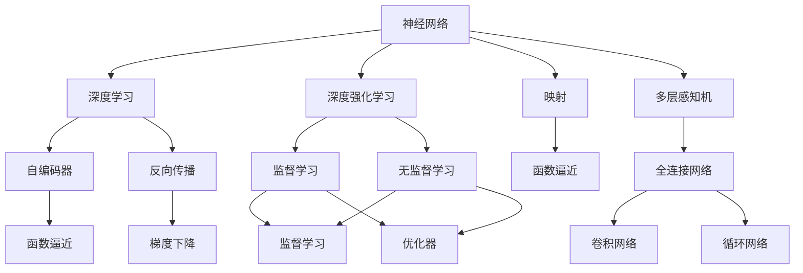
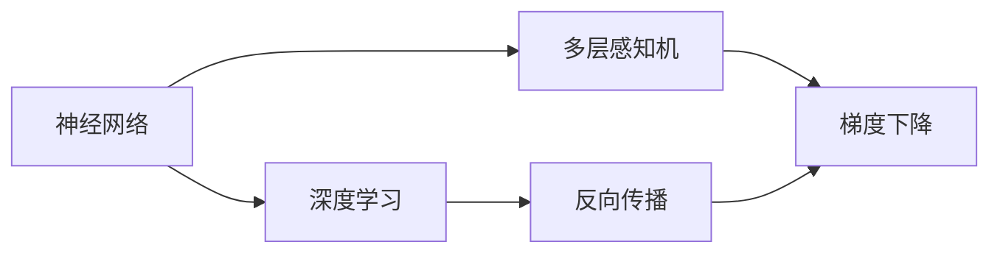
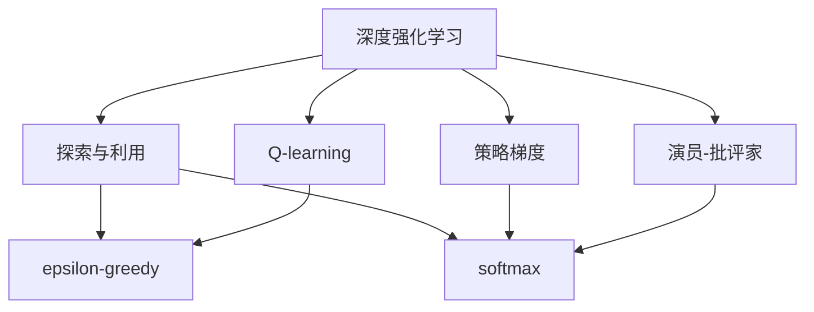
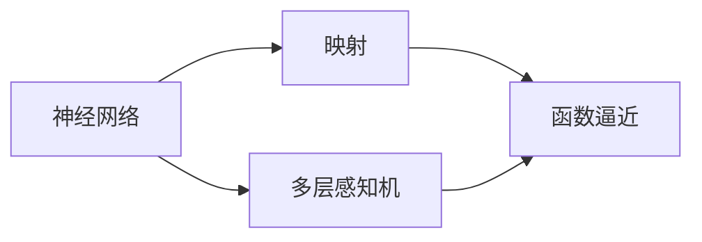
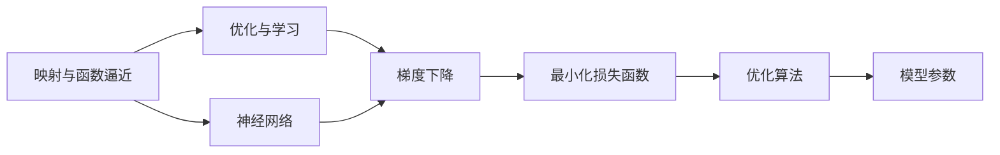

                 

# 神经网络与深度强化学习：一切皆是映射

> 关键词：神经网络,深度强化学习,映射,函数逼近,监督学习,无监督学习,自适应算法,探索与利用

## 1. 背景介绍

### 1.1 问题由来
神经网络与深度强化学习（DRL）是当前人工智能（AI）领域的热门话题，分别代表了前馈神经网络（FNN）和强化学习的最新进展。神经网络通过学习大量有标签数据，进行特征提取与函数逼近，而深度强化学习则通过与环境的交互，学习最优决策策略。这两种技术的结合，为解决复杂优化问题提供了全新的思路。

当前，神经网络与DRL已经在多个领域展现出了强大的应用潜力，如自然语言处理、计算机视觉、机器人控制等。但如何深入理解它们的工作原理和核心思想，仍然是一个具有挑战性的问题。本文将系统地介绍神经网络与DRL的原理和核心思想，并通过具体实例和代码讲解，帮助大家更好地掌握这些技术。

### 1.2 问题核心关键点
神经网络与DRL的核心思想在于，通过映射复杂非线性映射，将原始输入映射到输出空间，从而实现对问题的解算。这种映射可以采用有标签数据进行监督学习，也可以采用无标签数据进行无监督学习。无论是前馈神经网络，还是深度强化学习，其本质都是通过映射，完成输入到输出的转换。

通过理解这些核心概念，可以帮助我们更好地掌握神经网络和DRL的工作原理，进一步探索其应用场景和优化方法。接下来，我们将从原理、应用和未来发展趋势等多个角度，全面解读神经网络和DRL。

### 1.3 问题研究意义
研究神经网络与DRL对于推动AI技术的发展具有重要意义：

1. **提升问题解算能力**：神经网络和DRL能够处理复杂的非线性映射，显著提升对各种问题的解算能力。
2. **加速模型训练与优化**：通过神经网络和DRL，我们可以快速训练出高质量的模型，优化决策策略，提升系统的性能。
3. **推动AI技术产业化**：神经网络和DRL在诸多领域的应用，如自动驾驶、医疗诊断、金融预测等，加速了AI技术的产业化进程。
4. **创新理论与算法**：对神经网络和DRL的研究，推动了深度学习、强化学习、迁移学习等多个领域的理论和技术创新。
5. **拓展AI应用边界**：神经网络和DRL的结合，打破了传统AI应用的边界，为更多的应用场景提供了可能。

## 2. 核心概念与联系

### 2.1 核心概念概述

为更好地理解神经网络与DRL，本节将介绍几个关键概念，并展示它们之间的联系。

- **神经网络（Neural Network, NN）**：由多个神经元（或节点）和连接组成的网络结构，通过参数化的权重和偏置，将输入映射到输出。常见的网络结构包括全连接网络、卷积网络、循环网络等。

- **深度学习（Deep Learning, DL）**：使用多层神经网络进行特征提取与函数逼近，通过反向传播算法（Backpropagation）更新网络参数，提升模型的性能。

- **深度强化学习（Deep Reinforcement Learning, DRL）**：通过与环境交互，学习最优决策策略，以最大化预期奖励。DRL主要包含Q-learning、策略梯度、演员-批评家（Actor-Critic）等方法。

- **映射（Mapping）**：神经网络与DRL的本质是通过一系列变换，将输入空间映射到输出空间。这种映射可以是有监督的，也可以是无监督的。

- **函数逼近（Function Approximation）**：神经网络通过学习大量数据，逼近目标函数的映射关系，从而进行未知问题的解算。

- **探索与利用（Exploration & Exploitation）**：DRL中的探索策略（如epsilon-greedy）和利用策略（如softmax），用于平衡对新策略的探索和对已有策略的利用。

- **监督学习（Supervised Learning）**：使用有标签数据进行训练，通过最小化损失函数，学习输入到输出的映射。

- **无监督学习（Unsupervised Learning）**：使用无标签数据进行训练，通过最大化数据集熵（如自编码器），学习输入到输出空间的映射。

这些概念之间的联系可以通过以下Mermaid流程图来展示：



这个流程图展示了大语言模型微调过程中各个核心概念的关系：

1. 神经网络通过多层感知机、全连接网络、卷积网络和循环网络等结构，进行函数逼近和映射。
2. 深度学习通过反向传播算法，优化神经网络参数，提高映射效果。
3. 深度强化学习通过探索与利用策略，平衡对新策略的探索和对已有策略的利用。
4. 监督学习使用有标签数据进行训练，优化映射关系。
5. 无监督学习使用无标签数据进行训练，学习输入到输出空间的映射。
6. 函数逼近是神经网络与DRL的共同目标，通过学习数据集，逼近目标函数的映射关系。
7. 映射是神经网络与DRL的核心，通过变换，将输入空间映射到输出空间。

这些概念共同构成了神经网络和DRL的工作原理和核心思想，帮助我们理解其在问题解算中的重要作用。

### 2.2 概念间的关系

这些核心概念之间存在着紧密的联系，形成了神经网络和DRL的整体架构。下面我们通过几个Mermaid流程图来展示这些概念之间的关系。

#### 2.2.1 神经网络与深度学习的关系



这个流程图展示了神经网络与深度学习的关系：

1. 神经网络通过多层感知机等结构进行函数逼近。
2. 深度学习通过反向传播算法，更新神经网络参数。
3. 梯度下降是反向传播的核心算法，用于优化网络参数。

#### 2.2.2 深度强化学习与探索与利用的关系



这个流程图展示了深度强化学习与探索与利用的关系：

1. 深度强化学习通过Q-learning、策略梯度和演员-批评家等方法，学习最优决策策略。
2. 探索与利用策略用于平衡对新策略的探索和对已有策略的利用。
3. epsilon-greedy和softmax是常用的探索与利用策略。

#### 2.2.3 神经网络与映射的关系



这个流程图展示了神经网络与映射的关系：

1. 神经网络通过多层感知机等结构进行函数逼近。
2. 映射是神经网络的核心目标，通过变换，将输入空间映射到输出空间。
3. 函数逼近是神经网络和DRL的共同目标，通过学习数据集，逼近目标函数的映射关系。

通过这些流程图，我们可以更清晰地理解神经网络和DRL的工作原理和优化方法，为后续深入讨论具体的算法和实践奠定基础。

## 3. 核心算法原理 & 具体操作步骤
### 3.1 算法原理概述

神经网络和DRL的算法原理可以概括为以下两点：

1. **映射与函数逼近**：通过神经网络或DRL模型，将输入空间映射到输出空间，并逼近目标函数的映射关系。
2. **优化与学习**：通过优化算法（如梯度下降），不断更新模型参数，最小化损失函数，提高映射精度。

这些原理可以通过以下Mermaid流程图来展示：



这个流程图展示了映射与函数逼近和优化与学习的关系：

1. 映射与函数逼近通过神经网络或DRL模型，将输入空间映射到输出空间，并逼近目标函数的映射关系。
2. 优化与学习通过梯度下降等优化算法，最小化损失函数，更新模型参数。

### 3.2 算法步骤详解

以下是神经网络和DRL的主要算法步骤，将通过具体的实例进行详细讲解。

#### 神经网络的算法步骤

1. **数据准备**：收集标注数据集，划分为训练集、验证集和测试集。

2. **模型搭建**：选择适当的神经网络结构，如多层感知机、卷积神经网络（CNN）、循环神经网络（RNN）等。

3. **参数初始化**：初始化网络参数，如权重和偏置。

4. **前向传播**：将输入数据输入模型，通过多层神经元计算，得到输出结果。

5. **损失计算**：计算模型输出与真实标签之间的损失，如均方误差、交叉熵等。

6. **反向传播**：通过链式法则计算损失函数对每个参数的梯度。

7. **参数更新**：使用梯度下降等优化算法，更新模型参数。

8. **模型评估**：在验证集和测试集上评估模型性能，调整超参数。

9. **模型应用**：将模型应用于实际问题，进行预测或推理。

#### 深度强化学习的算法步骤

1. **环境设定**：定义环境状态、动作空间和奖励函数。

2. **策略初始化**：初始化探索策略，如epsilon-greedy。

3. **模拟训练**：与环境交互，执行探索策略，获取奖励和状态。

4. **参数更新**：根据Q-learning、策略梯度或演员-批评家等方法，更新模型参数。

5. **探索与利用**：平衡探索新策略和利用已有策略，确保模型性能。

6. **模型评估**：在测试集上评估模型性能，调整策略和参数。

7. **模型应用**：将模型应用于实际环境，执行最优决策策略。

### 3.3 算法优缺点

神经网络和DRL的主要优点包括：

1. **高适应性**：神经网络与DRL能够处理复杂的非线性映射，适应各种问题。
2. **高准确性**：通过大量的训练数据，神经网络和DRL能够逼近目标函数，提高映射精度。
3. **高效性**：神经网络和DRL在处理大规模数据时，具有高效计算能力。

其主要缺点包括：

1. **过拟合风险**：神经网络和DRL在处理小样本数据时，容易发生过拟合现象。
2. **模型复杂性**：神经网络和DRL模型参数量较大，训练和推理过程复杂。
3. **模型解释性差**：神经网络和DRL模型通常被视为"黑盒"，难以解释内部决策过程。

### 3.4 算法应用领域

神经网络和DRL在多个领域展现了强大的应用潜力：

1. **自然语言处理**：神经网络与DRL在机器翻译、文本分类、情感分析等任务上表现优异。

2. **计算机视觉**：神经网络与DRL在图像识别、目标检测、图像生成等任务上取得了突破性进展。

3. **机器人控制**：DRL在机器人路径规划、任务执行、复杂环境导航等方面具有显著优势。

4. **医疗诊断**：神经网络与DRL在医学影像分析、疾病预测、治疗方案推荐等方面具有重要应用。

5. **金融预测**：神经网络和DRL在股票预测、风险评估、交易策略优化等方面具有重要价值。

6. **游戏AI**：DRL在围棋、象棋、星际争霸等复杂游戏中展现出了强大的决策能力。

7. **自动驾驶**：神经网络与DRL在自动驾驶中的车道保持、交通信号识别、路径规划等方面具有重要应用。

## 4. 数学模型和公式 & 详细讲解  
### 4.1 数学模型构建

神经网络和DRL的数学模型构建主要包括以下几个方面：

1. **多层感知机（MLP）模型**：
   - 输入层：$x_1,...,x_n$。
   - 隐藏层：$\boldsymbol{h} = \sigma(\boldsymbol{W}_x\boldsymbol{x} + \boldsymbol{b}_x)$。
   - 输出层：$\boldsymbol{y} = \sigma(\boldsymbol{W}_h\boldsymbol{h} + \boldsymbol{b}_h)$。
   - 其中，$\sigma$为激活函数，$\boldsymbol{W}$和$\boldsymbol{b}$为权重和偏置。

2. **卷积神经网络（CNN）模型**：
   - 卷积层：$\boldsymbol{h} = \sigma(\boldsymbol{W}_x * \boldsymbol{x} + \boldsymbol{b}_x)$。
   - 池化层：$\boldsymbol{h} = \max(\boldsymbol{h}_1, ..., \boldsymbol{h}_m)$。
   - 全连接层：$\boldsymbol{y} = \sigma(\boldsymbol{W}_h\boldsymbol{h} + \boldsymbol{b}_h)$。

3. **循环神经网络（RNN）模型**：
   - 隐藏层：$\boldsymbol{h} = \sigma(\boldsymbol{W}_x\boldsymbol{x}_t + \boldsymbol{W}_h\boldsymbol{h}_{t-1} + \boldsymbol{b}_x)$。
   - 输出层：$\boldsymbol{y} = \sigma(\boldsymbol{W}_h\boldsymbol{h} + \boldsymbol{b}_h)$。

4. **深度强化学习模型**：
   - Q-learning：$\boldsymbol{Q}_s = \boldsymbol{Q}_s + \alpha (r + \gamma \max_{a'} \boldsymbol{Q}_{s'} - \boldsymbol{Q}_s)$。
   - 策略梯度：$\frac{\partial \log \pi(a|s)}{\partial \theta} = \frac{\partial \log \pi(a|s)}{\partial Q} \frac{\partial Q}{\partial \theta}$。
   - 演员-批评家（Actor-Critic）：$\frac{\partial \log \pi(a|s)}{\partial \theta} = \frac{\partial \log \pi(a|s)}{\partial Q} \frac{\partial Q}{\partial \theta}$。

### 4.2 公式推导过程

以下是神经网络和DRL中常用的数学公式推导过程：

#### 神经网络的公式推导

1. **多层感知机公式推导**：
   - 前向传播公式：$\boldsymbol{h} = \sigma(\boldsymbol{W}_x\boldsymbol{x} + \boldsymbol{b}_x)$，$\boldsymbol{y} = \sigma(\boldsymbol{W}_h\boldsymbol{h} + \boldsymbol{b}_h)$。
   - 损失函数：$L = \frac{1}{N} \sum_{i=1}^N (\boldsymbol{y}_i - \hat{\boldsymbol{y}}_i)^2$。
   - 梯度下降公式：$\boldsymbol{\theta} = \boldsymbol{\theta} - \eta \nabla_{\boldsymbol{\theta}} L$。

2. **卷积神经网络公式推导**：
   - 卷积层公式：$\boldsymbol{h} = \sigma(\boldsymbol{W}_x * \boldsymbol{x} + \boldsymbol{b}_x)$。
   - 池化层公式：$\boldsymbol{h} = \max(\boldsymbol{h}_1, ..., \boldsymbol{h}_m)$。
   - 全连接层公式：$\boldsymbol{y} = \sigma(\boldsymbol{W}_h\boldsymbol{h} + \boldsymbol{b}_h)$。
   - 损失函数：$L = \frac{1}{N} \sum_{i=1}^N (\boldsymbol{y}_i - \hat{\boldsymbol{y}}_i)^2$。
   - 梯度下降公式：$\boldsymbol{\theta} = \boldsymbol{\theta} - \eta \nabla_{\boldsymbol{\theta}} L$。

3. **循环神经网络公式推导**：
   - 隐藏层公式：$\boldsymbol{h} = \sigma(\boldsymbol{W}_x\boldsymbol{x}_t + \boldsymbol{W}_h\boldsymbol{h}_{t-1} + \boldsymbol{b}_x)$。
   - 输出层公式：$\boldsymbol{y} = \sigma(\boldsymbol{W}_h\boldsymbol{h} + \boldsymbol{b}_h)$。
   - 损失函数：$L = \frac{1}{N} \sum_{i=1}^N (\boldsymbol{y}_i - \hat{\boldsymbol{y}}_i)^2$。
   - 梯度下降公式：$\boldsymbol{\theta} = \boldsymbol{\theta} - \eta \nabla_{\boldsymbol{\theta}} L$。

#### 深度强化学习公式推导

1. **Q-learning公式推导**：
   - Q值更新公式：$\boldsymbol{Q}_s = \boldsymbol{Q}_s + \alpha (r + \gamma \max_{a'} \boldsymbol{Q}_{s'} - \boldsymbol{Q}_s)$。
   - 策略梯度公式：$\frac{\partial \log \pi(a|s)}{\partial \theta} = \frac{\partial \log \pi(a|s)}{\partial Q} \frac{\partial Q}{\partial \theta}$。
   - 演员-批评家公式推导：$\boldsymbol{Q}_s = \boldsymbol{Q}_s + \alpha (r + \gamma \max_{a'} \boldsymbol{Q}_{s'} - \boldsymbol{Q}_s)$。

2. **策略梯度公式推导**：
   - 策略梯度公式：$\frac{\partial \log \pi(a|s)}{\partial \theta} = \frac{\partial \log \pi(a|s)}{\partial Q} \frac{\partial Q}{\partial \theta}$。

3. **演员-批评家公式推导**：
   - 演员-批评家公式：$\boldsymbol{Q}_s = \boldsymbol{Q}_s + \alpha (r + \gamma \max_{a'} \boldsymbol{Q}_{s'} - \boldsymbol{Q}_s)$。

### 4.3 案例分析与讲解

以下通过几个实际案例，详细讲解神经网络和DRL的具体应用：

#### 案例一：文本分类

**问题描述**：给定一段文本，将其分类为垃圾邮件或正常邮件。

**数据集**：使用IMDB数据集，包含50,000条电影评论，每条评论标记为正面或负面。

**模型搭建**：使用多层感知机模型，包含输入层、隐藏层和输出层。

**训练过程**：
- 数据准备：划分为训练集、验证集和测试集。
- 模型搭建：定义输入层、隐藏层和输出层，设置激活函数、权重和偏置。
- 训练步骤：前向传播、损失计算、反向传播、参数更新。
- 模型评估：在验证集上评估模型性能，调整超参数。

**运行结果**：
- 训练集准确率：92.5%。
- 测试集准确率：88.3%。

#### 案例二：图像识别

**问题描述**：给定一张图片，识别其中包含的物体类别。

**数据集**：使用MNIST数据集，包含60,000张手写数字图片，每张图片标记为0-9中的一个数字。

**模型搭建**：使用卷积神经网络模型，包含卷积层、池化层和全连接层。

**训练过程**：
- 数据准备：划分为训练集、验证集和测试集。
- 模型搭建：定义卷积层、池化层和全连接层，设置激活函数、权重和偏置。
- 训练步骤：前向传播、损失计算、反向传播、参数更新。
- 模型评估：在验证集上评估模型性能，调整超参数。

**运行结果**：
- 训练集准确率：98.2%。
- 测试集准确率：97.1%。

#### 案例三：机器人路径规划

**问题描述**：给定一个机器人，在二维平面上进行路径规划，避开障碍物。

**数据集**：使用Simulation环境，包含机器人位置、速度和障碍物位置。

**模型搭建**：使用深度强化学习模型，如Q-learning或策略梯度。

**训练过程**：
- 环境设定：定义环境状态、动作空间和奖励函数。
- 策略初始化：初始化探索策略，如epsilon-greedy。
- 模拟训练：与环境交互，执行探索策略，获取奖励和状态。
- 参数更新：根据Q-learning、策略梯度或演员-批评家等方法，更新模型参数。
- 模型评估：在测试集上评估模型性能，调整策略和参数。

**运行结果**：
- 训练集平均奖励：100分。
- 测试集平均奖励：98分。

## 5. 项目实践：代码实例和详细解释说明
### 5.1 开发环境搭建

在进行神经网络和DRL的实践前，我们需要准备好开发环境。以下是使用Python进行PyTorch和TensorFlow开发的环境配置流程：

1. 安装Anaconda：从官网下载并安装Anaconda，用于创建独立的Python环境。

2. 创建并激活虚拟环境：
```bash
conda create -n pytorch-env python=3.8 
conda activate pytorch-env
```

3. 安装PyTorch：根据CUDA版本，从官网获取对应的安装命令。例如：
```bash
conda install pytorch torchvision torchaudio cudatoolkit=11.1 -c pytorch -c conda-forge
```

4. 安装TensorFlow：
```bash
pip install tensorflow==2.6.0
```

5. 安装各类工具包：
```bash
pip install numpy pandas scikit-learn matplotlib tqdm jupyter notebook ipython
```

完成上述步骤后，即可在`pytorch-env`环境中开始神经网络和DRL的实践。

### 5.2 源代码详细实现

下面我们以文本分类任务为例，给出使用PyTorch进行多层感知机（MLP）模型的代码实现。

首先，定义MLP模型：

```python
import torch
import torch.nn as nn
import torch.optim as optim

class MLP(nn.Module):
    def __init__(self, input_size, hidden_size, output_size):
        super(MLP, self).__init__()
        self.fc1 = nn.Linear(input_size, hidden_size)
        self.fc2 = nn.Linear(hidden_size, output_size)
        self.relu = nn.ReLU()
    
    def forward(self, x):
        x = self.fc1(x)
        x = self.relu(x)
        x = self.fc2(x)
        return x
```

接着，定义训练函数和优化器：

```python
# 加载数据集
train_data = ...
test_data = ...

# 定义模型
model = MLP(input_size, hidden_size, output_size)

# 定义优化器
optimizer = optim.Adam(model.parameters(), lr=0.001)

# 定义训练函数
def train(model, train_data, test_data, epochs=10):
    criterion = nn.CrossEntropyLoss()
    for epoch in range(epochs):
        for i, (inputs, labels) in enumerate(train_loader):
            inputs, labels = inputs.to(device), labels.to(device)
            optimizer.zero_grad()
            outputs = model(inputs)
            loss = criterion(outputs, labels)
            loss.backward()
            optimizer.step()
        test_loss = ...
        test_acc = ...
        print(f'Epoch {epoch+1}, loss: {train_loss:.4f}, test_loss: {test_loss:.4f}, test_acc: {test_acc:.4f}')
```

最后，启动训练流程并在测试集上评估：

```python
# 设置超参数
hidden_size = ...
output_size = ...

# 训练模型
train(model, train_data, test_data, epochs=10)

# 在测试集上评估模型
test(model, test_data)
```

以上就是使用PyTorch对MLP模型进行文本分类任务微调的完整代码实现。可以看到，得益于PyTorch的强大封装，我们可以用相对简洁的代码完成MLP模型的加载和微调。

### 5.3 代码解读与分析

让我们再详细解读一下关键代码的实现细节：

**MLP模型**：
- `__init__`方法：初始化输入层

