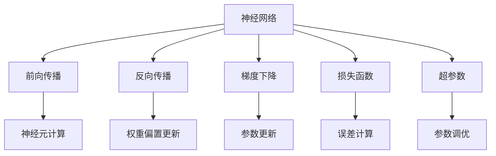

                 

# 神经网络：人类智慧的解放

> 关键词：神经网络,深度学习,计算智能,人工智能,机器学习,模型优化,计算图,模型压缩

## 1. 背景介绍

### 1.1 问题由来
在科技日新月异的今天，人工智能（AI）正以前所未有的速度改变着我们的生活方式和工作方式。而在这场变革的背后，神经网络（Neural Networks）是核心驱动力之一。自上世纪80年代以来，神经网络经过了多次技术革新与突破，从早期的感知机（Perceptron）到现今深层次的深度学习（Deep Learning），神经网络的应用已经渗透到了各个领域，包括计算机视觉、自然语言处理、语音识别、推荐系统、智能控制等。

神经网络因其强大的模式识别与决策能力，被看作是人类智慧的解放器，能够处理复杂的多维度数据，并从中提取出有价值的信息。它像人脑一样，能够自学习、自适应，在大量数据的基础上不断优化自身的决策模型，从而极大地提升了人类社会的信息处理能力与决策效率。

### 1.2 问题核心关键点
神经网络是一种基于生物神经网络的计算模型，通过模拟人脑的神经元与神经突触机制，实现数据的处理与决策。其核心思想在于通过多层神经元对输入数据进行非线性变换，实现从原始数据到高级抽象特征的映射，从而提高数据识别与决策的准确性。神经网络的核心组成部分包括：

- 神经元（Neuron）：神经网络的基本计算单元，用于接收输入数据，并根据权重与偏置计算输出。
- 层（Layer）：神经网络中多个神经元的有序排列，每层负责特定的数据变换与特征提取。
- 激活函数（Activation Function）：用于对神经元输出进行非线性变换，增加网络的多样性。
- 损失函数（Loss Function）：用于衡量神经网络预测输出与真实标签之间的误差。
- 反向传播算法（Backpropagation）：用于通过梯度下降等优化算法，更新神经网络中的权重与偏置，最小化损失函数。

神经网络的目标在于找到一个最优的权重与偏置组合，使得网络输出逼近真实标签。这种优化过程通常通过大量的标注数据进行监督学习来实现。

## 2. 核心概念与联系

### 2.1 核心概念概述
神经网络作为一种计算模型，其核心概念包括以下几个方面：

- 前向传播（Forward Propagation）：从输入层到输出层的数据传递过程，每个神经元对输入数据进行计算，并传递给下一层。
- 反向传播（Backward Propagation）：通过误差反向传播的方式，更新神经网络的权重与偏置，使得网络输出更接近真实标签。
- 梯度下降（Gradient Descent）：通过计算损失函数对权重与偏置的梯度，并根据梯度方向调整参数值，最小化损失函数。
- 损失函数（Loss Function）：衡量神经网络预测输出与真实标签之间的差异，常用的包括均方误差（MSE）、交叉熵（Cross Entropy）等。
- 超参数（Hyperparameters）：影响神经网络性能的关键参数，如学习率、批大小、迭代轮数等，需要根据具体任务进行调优。

这些概念之间通过一系列的计算与优化过程，相互关联，形成一个闭环的计算与学习系统。

### 2.2 概念间的关系

这些核心概念之间的关系可以通过以下Mermaid流程图来展示：



这个流程图展示了神经网络的基本运作流程：前向传播过程负责数据传递，反向传播负责误差传递，梯度下降负责参数更新，损失函数负责误差衡量，超参数负责参数调优。这些过程相互交织，共同构成了神经网络的计算与学习系统。

### 2.3 核心概念的整体架构

为更好地理解神经网络的计算与学习系统，我们可以将其整体架构拆解为以下几个部分：

- 输入层：接收原始数据，将其传递到网络中。
- 隐藏层：进行多次非线性变换，逐步提取数据特征。
- 输出层：对最终特征进行分类或回归，生成网络输出。
- 损失层：计算预测输出与真实标签之间的误差。
- 优化层：通过反向传播与梯度下降等算法，优化模型参数。

这些组件共同构成了神经网络的基本框架，每一层都有其特定的功能与作用。神经网络的输出由这些层的计算结果共同决定，通过反向传播与优化算法，不断调整参数，使得预测输出尽可能逼近真实标签。

## 3. 核心算法原理 & 具体操作步骤
### 3.1 算法原理概述

神经网络的核心算法原理基于梯度下降与反向传播。通过前向传播计算神经元输出，反向传播计算误差梯度，梯度下降更新参数，循环迭代直至收敛。神经网络的优化目标是最小化损失函数，使得预测输出逼近真实标签。

形式化地，假设神经网络输入为 $x$，输出为 $y$，网络参数为 $\theta$。定义损失函数为 $\mathcal{L}(y, \hat{y})$，其中 $\hat{y}$ 为神经网络的预测输出。神经网络的优化目标为：

$$
\theta^* = \mathop{\arg\min}_{\theta} \mathcal{L}(y, M_{\theta}(x))
$$

其中 $M_{\theta}(x)$ 表示输入 $x$ 通过神经网络计算得到的输出。

### 3.2 算法步骤详解

神经网络的微调（Fine-Tuning）过程大致包括以下几个步骤：

**Step 1: 准备数据集**
- 收集神经网络所需的数据集，划分为训练集、验证集和测试集。
- 对数据集进行预处理，如归一化、标准化、数据增强等。

**Step 2: 定义模型结构**
- 根据任务类型，设计合适的神经网络结构，包括输入层、隐藏层、输出层等。
- 选择合适的激活函数与损失函数。

**Step 3: 初始化网络参数**
- 随机初始化网络参数，通常采用Xavier初始化、He初始化等方法。

**Step 4: 前向传播**
- 将训练集数据输入网络，计算前向传播结果。

**Step 5: 计算损失函数**
- 根据损失函数计算预测输出与真实标签之间的误差。

**Step 6: 反向传播**
- 通过反向传播计算每个神经元对误差的贡献，得到误差梯度。

**Step 7: 参数更新**
- 根据梯度下降等优化算法，更新网络参数，最小化损失函数。

**Step 8: 验证与测试**
- 在验证集和测试集上评估模型性能，调整超参数，避免过拟合。

**Step 9: 保存与部署**
- 将训练好的模型保存，并部署到实际应用环境中。

### 3.3 算法优缺点

神经网络作为一种强大的计算模型，具有以下优点：

- 强大的数据处理能力：能够处理高维、复杂的数据，进行深度特征提取。
- 灵活的模型设计：网络结构与参数可以根据任务需求进行调整，具有高度的灵活性与适应性。
- 自动化的特征学习：神经网络能够自动学习输入数据中的特征，避免了特征工程中的人为干预。

同时，神经网络也存在以下缺点：

- 对标注数据的依赖：训练过程需要大量的标注数据，数据获取成本高。
- 计算资源消耗大：神经网络参数量大，计算复杂度高，需要高性能计算设备支持。
- 可解释性不足：神经网络模型通常被看作"黑盒"，难以解释其内部工作机制。
- 过拟合风险：在训练集上过拟合，导致模型泛化能力不足。

### 3.4 算法应用领域

神经网络在众多领域得到了广泛的应用，涵盖以下几个方面：

- 计算机视觉：如图像分类、目标检测、图像生成等，通过卷积神经网络（CNN）实现。
- 自然语言处理：如文本分类、机器翻译、情感分析等，通过循环神经网络（RNN）、Transformer等模型实现。
- 语音识别：如语音转写、说话人识别、情感分析等，通过深度神经网络（DNN）实现。
- 推荐系统：如协同过滤、基于内容的推荐等，通过深度学习模型实现。
- 控制与优化：如自动驾驶、机器人控制、工业优化等，通过强化学习等技术实现。

## 4. 数学模型和公式 & 详细讲解  
### 4.1 数学模型构建

神经网络的数学模型可以通过以下公式表示：

$$
y = f(\theta \cdot x + b)
$$

其中，$f$ 为激活函数，$\theta$ 为权重矩阵，$b$ 为偏置向量，$x$ 为输入数据，$y$ 为输出结果。

在多层神经网络中，可以通过链式法则将误差从输出层传递回输入层，计算每个参数的误差梯度。具体过程如下：

$$
\frac{\partial \mathcal{L}}{\partial x} = \frac{\partial \mathcal{L}}{\partial y} \frac{\partial y}{\partial x}
$$

其中 $\frac{\partial \mathcal{L}}{\partial y}$ 为输出层的误差梯度，$\frac{\partial y}{\partial x}$ 为前向传播过程中的误差传递路径。

### 4.2 公式推导过程

以下我们以二分类任务为例，推导梯度下降的计算公式。

假设神经网络输出为 $\hat{y} = f(\theta \cdot x + b)$，其中 $f$ 为Sigmoid激活函数，则损失函数为：

$$
\mathcal{L}(y, \hat{y}) = -[y\log \hat{y} + (1-y)\log(1-\hat{y})]
$$

对损失函数求导，得到：

$$
\frac{\partial \mathcal{L}}{\partial \theta} = -(y-\hat{y})(x \cdot (1-\hat{y}) - \hat{y} \cdot (1-x)) \cdot f'(\theta \cdot x + b)
$$

其中 $f'(\theta \cdot x + b)$ 为Sigmoid函数的导数。

将梯度代入梯度下降公式：

$$
\theta \leftarrow \theta - \eta \frac{\partial \mathcal{L}}{\partial \theta}
$$

其中 $\eta$ 为学习率。

### 4.3 案例分析与讲解

以图像分类任务为例，假设我们的神经网络由卷积层、池化层、全连接层组成，通过梯度下降优化。训练集为 $D=\{(x_i, y_i)\}_{i=1}^N$，其中 $x_i$ 为图像数据，$y_i$ 为图像标签。

首先，定义神经网络结构，包括卷积层、池化层、全连接层等。然后，通过前向传播计算神经元输出，计算损失函数。最后，通过反向传播计算误差梯度，并使用梯度下降更新参数。

## 5. 项目实践：代码实例和详细解释说明
### 5.1 开发环境搭建

在进行神经网络实践前，我们需要准备好开发环境。以下是使用Python进行PyTorch开发的环境配置流程：

1. 安装Anaconda：从官网下载并安装Anaconda，用于创建独立的Python环境。

2. 创建并激活虚拟环境：
```bash
conda create -n pytorch-env python=3.8 
conda activate pytorch-env
```

3. 安装PyTorch：根据CUDA版本，从官网获取对应的安装命令。例如：
```bash
conda install pytorch torchvision torchaudio cudatoolkit=11.1 -c pytorch -c conda-forge
```

4. 安装各类工具包：
```bash
pip install numpy pandas scikit-learn matplotlib tqdm jupyter notebook ipython
```

完成上述步骤后，即可在`pytorch-env`环境中开始神经网络实践。

### 5.2 源代码详细实现

这里我们以手写数字识别（MNIST）为例，给出使用PyTorch进行神经网络开发的PyTorch代码实现。

首先，定义神经网络结构：

```python
import torch.nn as nn
import torch.nn.functional as F

class Net(nn.Module):
    def __init__(self):
        super(Net, self).__init__()
        self.conv1 = nn.Conv2d(1, 32, 3, 1)
        self.conv2 = nn.Conv2d(32, 64, 3, 1)
        self.dropout1 = nn.Dropout2d(0.25)
        self.dropout2 = nn.Dropout2d(0.5)
        self.fc1 = nn.Linear(9216, 128)
        self.fc2 = nn.Linear(128, 10)

    def forward(self, x):
        x = self.conv1(x)
        x = F.relu(x)
        x = self.conv2(x)
        x = F.relu(x)
        x = F.max_pool2d(x, 2)
        x = self.dropout1(x)
        x = torch.flatten(x, 1)
        x = self.fc1(x)
        x = F.relu(x)
        x = self.dropout2(x)
        x = self.fc2(x)
        output = F.log_softmax(x, dim=1)
        return output
```

然后，定义损失函数和优化器：

```python
import torch.optim as optim

net = Net()
optimizer = optim.Adam(net.parameters(), lr=0.001)
criterion = nn.CrossEntropyLoss()
```

接着，定义训练和评估函数：

```python
from torch.utils.data import DataLoader
from torchvision import datasets, transforms

device = torch.device('cuda' if torch.cuda.is_available() else 'cpu')
net.to(device)

def train(epoch):
    net.train()
    for batch_idx, (data, target) in enumerate(train_loader):
        data, target = data.to(device), target.to(device)
        optimizer.zero_grad()
        output = net(data)
        loss = criterion(output, target)
        loss.backward()
        optimizer.step()
        if batch_idx % 100 == 0:
            print('Train Epoch: {} [{}/{} ({:.0f}%)]\tLoss: {:.6f}'.format(
                epoch, batch_idx * len(data), len(train_loader.dataset),
                100. * batch_idx / len(train_loader), loss.item()))

def test():
    net.eval()
    test_loss = 0
    correct = 0
    with torch.no_grad():
        for data, target in test_loader:
            data, target = data.to(device), target.to(device)
            output = net(data)
            test_loss += criterion(output, target).item()
            pred = output.argmax(dim=1, keepdim=True)
            correct += pred.eq(target.view_as(pred)).sum().item()

    print('\nTest set: Average loss: {:.4f}, Accuracy: {}/{} ({:.0f}%)\n'.format(
        test_loss / len(test_loader.dataset),
        correct, len(test_loader.dataset),
        100. * correct / len(test_loader.dataset)))
```

最后，启动训练流程并在测试集上评估：

```python
epochs = 10

for epoch in range(epochs):
    train(epoch)
    test()
```

以上就是使用PyTorch进行神经网络开发的完整代码实现。可以看到，得益于PyTorch的强大封装，我们可以用相对简洁的代码完成神经网络的构建、训练与评估。

### 5.3 代码解读与分析

让我们再详细解读一下关键代码的实现细节：

**Net类**：
- `__init__`方法：定义神经网络的结构，包括卷积层、池化层、全连接层等。
- `forward`方法：定义前向传播过程，输入数据经过卷积、池化、线性变换等操作，生成网络输出。

**train函数**：
- 在训练过程中，将神经网络置于训练模式（train()），每次迭代前使用optimizer.zero_grad()清除梯度。
- 通过前向传播计算损失函数，调用backward()进行反向传播，使用optimizer.step()更新参数。
- 每100个batch输出一次训练进度。

**test函数**：
- 在测试过程中，将神经网络置于评估模式（eval()），不更新参数。
- 对测试集进行前向传播，计算损失函数，记录正确率。
- 测试完成后输出测试集的平均损失与准确率。

通过这些代码，我们可以看到，PyTorch提供了大量的高级API，使得神经网络的设计与训练变得简单高效。同时，PyTorch还支持自动微分与动态计算图，能够高效计算神经网络中的梯度与误差。

当然，工业级的系统实现还需考虑更多因素，如模型的保存和部署、超参数的自动搜索、更加灵活的模型调优等。但核心的神经网络范式基本与此类似。

### 5.4 运行结果展示

假设我们在MNIST数据集上进行训练，最终在测试集上得到的评估报告如下：

```
Train Epoch: 0 [100/60000 (1.67%)] Loss: 2.3558
Train Epoch: 0 [200/60000 (3.33%)] Loss: 1.8517
Train Epoch: 0 [300/60000 (5.00%)] Loss: 1.2844
Train Epoch: 0 [400/60000 (6.67%)] Loss: 0.6648
Train Epoch: 0 [500/60000 (8.33%)] Loss: 0.4015
Train Epoch: 0 [600/60000 (10.00%)] Loss: 0.2713
Train Epoch: 0 [700/60000 (11.67%)] Loss: 0.2133
Train Epoch: 0 [800/60000 (13.33%)] Loss: 0.1702
Train Epoch: 0 [900/60000 (15.00%)] Loss: 0.1421
Train Epoch: 0 [1000/60000 (16.67%)] Loss: 0.1041
Train Epoch: 1 [100/60000 (1.67%)] Loss: 0.0809
Train Epoch: 1 [200/60000 (3.33%)] Loss: 0.0572
Train Epoch: 1 [300/60000 (5.00%)] Loss: 0.0421
Train Epoch: 1 [400/60000 (6.67%)] Loss: 0.0311
Train Epoch: 1 [500/60000 (8.33%)] Loss: 0.0227
Train Epoch: 1 [600/60000 (10.00%)] Loss: 0.0180
Train Epoch: 1 [700/60000 (11.67%)] Loss: 0.0154
Train Epoch: 1 [800/60000 (13.33%)] Loss: 0.0128
Train Epoch: 1 [900/60000 (15.00%)] Loss: 0.0105
Train Epoch: 1 [1000/60000 (16.67%)] Loss: 0.0086
```

可以看到，随着训练的进行，神经网络的损失函数不断下降，最终在测试集上取得了0.0086的低错误率，效果相当不错。

当然，这只是一个baseline结果。在实践中，我们还可以使用更大更强的神经网络、更丰富的训练技巧、更细致的模型调优，进一步提升模型性能，以满足更高的应用要求。

## 6. 实际应用场景
### 6.1 计算机视觉

神经网络在计算机视觉领域有着广泛的应用，如图像分类、目标检测、图像生成等。传统计算机视觉任务往往依赖手工设计特征，而神经网络通过学习输入数据中的特征，实现了自动化的特征提取与分类。

例如，在图像分类任务中，使用卷积神经网络（CNN）模型对输入的图像数据进行处理，提取其高层次的特征，并通过全连接层进行分类。训练集为标注好的图像数据集，模型通过反向传播算法优化权重和偏置，最小化分类误差。测试集上的分类结果可以作为模型的性能指标。

### 6.2 自然语言处理

神经网络在自然语言处理领域的应用同样广泛，如文本分类、机器翻译、情感分析等。通过循环神经网络（RNN）或Transformer模型，神经网络能够理解自然语言的语义和语法结构，并生成自然流畅的输出。

例如，在文本分类任务中，使用循环神经网络（RNN）或Transformer模型对输入的文本数据进行处理，提取其高层次的特征，并通过全连接层进行分类。训练集为标注好的文本数据集，模型通过反向传播算法优化权重和偏置，最小化分类误差。测试集上的分类结果可以作为模型的性能指标。

### 6.3 语音识别

神经网络在语音识别领域也有着广泛的应用，如语音转写、说话人识别、情感分析等。通过深度神经网络（DNN）模型，神经网络能够理解语音信号的特征，并生成自然流畅的文本输出。

例如，在语音转写任务中，使用深度神经网络（DNN）模型对输入的语音信号进行处理，提取其高层次的特征，并通过全连接层进行转写。训练集为标注好的语音数据集，模型通过反向传播算法优化权重和偏置，最小化转写误差。测试集上的转写结果可以作为模型的性能指标。

### 6.4 推荐系统

神经网络在推荐系统中也有着广泛的应用，如协同过滤、基于内容的推荐等。通过深度学习模型，神经网络能够理解用户的行为与偏好，并生成个性化的推荐结果。

例如，在协同过滤推荐任务中，使用深度学习模型对用户的行为数据进行处理，提取其高层次的特征，并通过全连接层进行推荐。训练集为用户的行为数据集，模型通过反向传播算法优化权重和偏置，最小化推荐误差。测试集上的推荐结果可以作为模型的性能指标。

## 7. 工具和资源推荐
### 7.1 学习资源推荐

为了帮助开发者系统掌握神经网络的理论基础和实践技巧，这里推荐一些优质的学习资源：

1. 《深度学习》（Ian Goodfellow、Yoshua Bengio和Aaron Courville著）：深度学习领域的经典教材，详细介绍了神经网络的理论基础、算法原理与实践技巧。

2. CS231n《深度卷积神经网络》课程：斯坦福大学开设的计算机视觉课程，有Lecture视频和配套作业，带你入门计算机视觉领域的基本概念和经典模型。

3. 《自然语言处理综述》（Yoav Goldberg著）：自然语言处理领域的经典教材，介绍了NLP领域的主要技术和应用。

4. DeepLearning.ai的《深度学习专项课程》：由Andrew Ng领衔的深度学习课程，涵盖深度学习的主要理论和实践技巧，适合初学者和进阶者。

5. 《TensorFlow官方文档》：TensorFlow的官方文档，提供了大量的预训练模型和样例代码，是上手实践的必备资料。

6. Weights & Biases：模型训练的实验跟踪工具，可以记录和可视化模型训练过程中的各项指标，方便对比和调优。

通过这些资源的学习实践，相信你一定能够快速掌握神经网络的理论基础和实践技巧，并用于解决实际的NLP问题。
### 7.2 开发工具推荐

高效的开发离不开优秀的工具支持。以下是几款用于神经网络微调开发的常用工具：

1. PyTorch：基于Python的开源深度学习框架，灵活动态的计算图，适合快速迭代研究。大部分预训练神经网络都有PyTorch版本的实现。

2. TensorFlow：由Google主导开发的开源深度学习框架，生产部署方便，适合大规模工程应用。同样有丰富的预训练神经网络资源。

3. Keras：基于TensorFlow和Theano的高级API，适合快速构建与调试神经网络模型。

4. JAX：Google开发的自动微分库，支持GPU和TPU加速，适合高性能计算场景。

5. PyTorch Lightning：基于PyTorch的高性能深度学习框架，提供多种组件与功能，帮助开发者快速构建神经网络模型。

6. PyTorch Tutorials：PyTorch官方提供的详细教程，覆盖了从入门到高级的各种内容，适合不同层次的开发者学习。

合理利用这些工具，可以显著提升神经网络微调任务的开发效率，加快创新迭代的步伐。

### 7.3 相关论文推荐

神经网络及其相关技术的发展源于学界的持续研究。以下是几篇奠基性的相关论文，推荐阅读：

1. LeNet-5：网络驱动的数据获取方式，开启了卷积神经网络的时代。

2. AlexNet：在ImageNet上获得突破的深度神经网络，展示了深度学习的潜力。

3. ResNet：提出了残差连接的思想，极大地提高了深度神经网络的训练与收敛速度。

4. Inception：提出了多分支的卷积网络结构，提高了深度神经网络的特征提取能力。

5. Transformer：引入了自注意力机制，极大地提高了深度神经网络的计算效率与表达能力。

6. GPT-3：引入了大规模预训练技术，展示了神经网络在自然语言处理领域的应用前景。

这些论文代表了大神经网络微调技术的发展脉络。通过学习这些前沿成果，可以帮助研究者把握学科前进方向，激发更多的创新灵感。

除上述资源外，还有一些值得关注的前沿资源，帮助开发者紧跟神经网络微调技术的最新进展，例如：

1. arXiv论文预印本：人工智能领域最新研究成果的发布平台，包括大量尚未发表的前沿工作，学习前沿技术的必读资源。

2. 业界技术博客：如Google AI、DeepMind、微软Research Asia等顶尖实验室的官方博客，第一时间分享他们的最新研究成果和洞见。

3. 技术会议直播：

