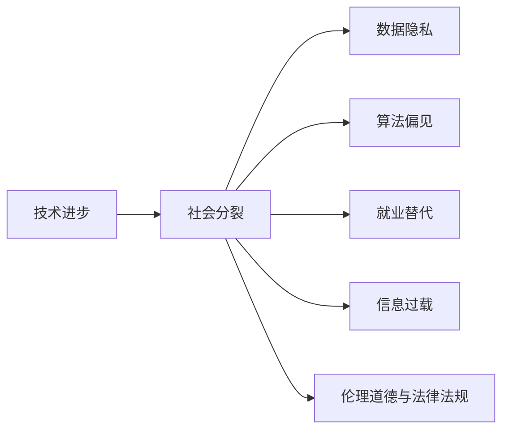
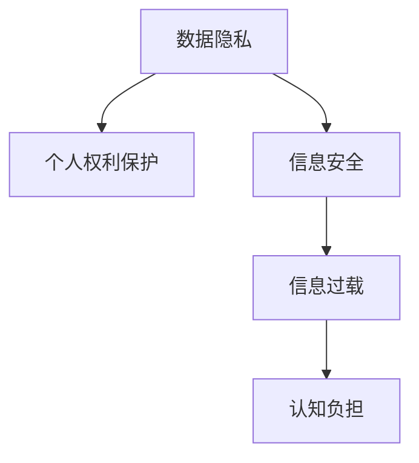
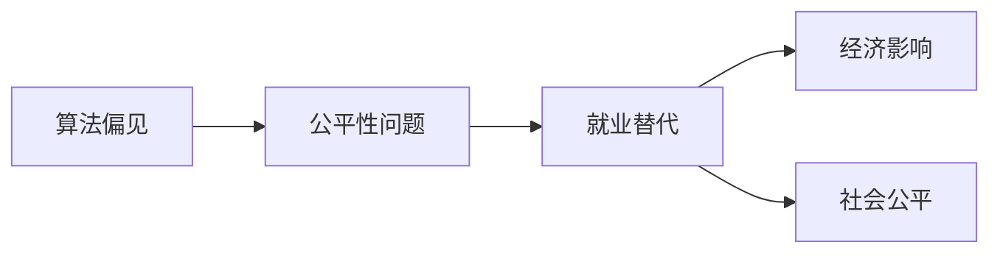

                 

# 科技进步的代价：人类社会的分裂

> 关键词：技术进步, 社会分裂, 人类伦理, 数据隐私, 人工智能

## 1. 背景介绍

### 1.1 问题由来
在过去的几十年中，科技进步为人类社会带来了巨大的改变，从互联网的普及到人工智能的崛起，从基因编辑到新能源的突破，技术在推动社会进步的同时，也带来了一系列前所未有的挑战。尤其是大数据、人工智能等新兴技术的飞速发展，不仅在科技领域引起了巨大的轰动，也在社会伦理、数据隐私等方面引发了广泛讨论。

技术进步的两面性在人工智能领域尤为明显。一方面，AI技术可以自动化处理复杂任务，提高生产效率，推动社会创新；另一方面，AI技术的广泛应用也带来了数据隐私、算法偏见、就业替代等一系列社会问题。本文将探讨科技进步如何推动社会进步的同时，也导致了一些深层次的社会分裂现象，并对这些现象提出应对策略。

### 1.2 问题核心关键点
技术进步带来的社会分裂主要体现在以下几个方面：

1. **数据隐私问题**：随着大数据技术的发展，个人隐私面临前所未有的威胁，如何保护数据隐私成为一大难题。
2. **算法偏见与公平性**：由于数据集的不平衡和算法设计的缺陷，AI系统可能会产生偏见，导致不公平的结果。
3. **就业替代与职业结构变化**：自动化和智能化技术的广泛应用可能导致某些行业被替代，影响就业结构和社会稳定。
4. **信息过载与信息不对称**：大量信息的过载可能导致人们难以获取有效信息，加剧信息不对称问题。
5. **伦理道德与法律法规**：新技术的应用需要新的伦理道德规范和法律法规，但现有体系可能无法跟上技术发展的速度。

这些问题虽然源于技术进步，但最终都会影响社会的稳定与和谐。如何平衡科技进步与社会发展，是一个亟需解决的复杂问题。

### 1.3 问题研究意义
探讨科技进步带来的社会分裂，对于理解技术进步与社会发展的关系，制定合理的政策和规范，具有重要的理论和实践意义：

1. **理论意义**：通过分析技术进步对社会的影响，可以为未来技术发展的伦理和社会影响提供理论支持。
2. **实践意义**：为政策制定者提供技术发展对社会的影响分析，有助于制定相关法律法规，保障技术进步的正面影响，限制其负面效应。
3. **社会意义**：提高公众对技术进步的认知，增强社会对技术发展的适应能力，构建更加包容、公平的社会环境。

## 2. 核心概念与联系

### 2.1 核心概念概述

为更好地理解科技进步带来的社会分裂，本节将介绍几个关键概念：

- **技术进步**：包括计算机科学、人工智能、大数据等领域的最新技术发展，如深度学习、自然语言处理、计算机视觉等。
- **社会分裂**：指社会在技术进步过程中，由于不同群体之间的利益冲突、资源分配不均等原因导致的社会分化现象。
- **数据隐私**：涉及个人数据信息的收集、存储、使用和保护，保护数据隐私是确保个人权利和信息安全的重要方面。
- **算法偏见**：指AI系统在训练过程中，由于数据集不平衡或算法设计缺陷导致的不公平结果。
- **就业替代**：由于自动化和智能化技术的广泛应用，某些行业被替代，导致失业问题。
- **信息过载**：大量信息的产生和传播导致的信息处理和获取困难，影响了人们的决策和行为。
- **伦理道德与法律法规**：指在技术应用过程中，需要遵守的道德准则和法律法规。

这些概念之间的逻辑关系可以通过以下Mermaid流程图来展示：

```mermaid
graph TB
    A[技术进步] --> B[数据隐私]
    A --> C[算法偏见]
    A --> D[就业替代]
    A --> E[信息过载]
    A --> F[伦理道德与法律法规]
    B --> G[个人权利保护]
    C --> H[公平性问题]
    D --> I[失业问题]
    E --> J[决策困难]
    F --> K[规范制定]
    G --> L[法律保障]
    H --> M[社会公平]
    I --> N[经济影响]
    J --> O[认知负担]
    K --> P[政策制定]
    L --> Q[法律执行]
    M --> R[社会稳定]
    N --> S[经济波动]
    O --> T[认知负担]
    P --> U[政策支持]
    Q --> V[法律监督]
    R --> W[社会和谐]
    S --> X[经济复苏]
    T --> Y[认知提升]
    U --> Z[政策落实]
    V --> $[法律完善]
    W --> [社会稳定]
```

这个流程图展示了技术进步如何影响社会的各个方面，并通过一系列中间概念（如数据隐私、算法偏见等）对社会产生影响。

### 2.2 概念间的关系

这些核心概念之间存在着紧密的联系，形成了技术进步对社会影响的全链条。下面通过几个Mermaid流程图来展示这些概念之间的关系。

#### 2.2.1 技术进步与社会分裂的关系



这个流程图展示了技术进步如何通过数据隐私、算法偏见、就业替代、信息过载和伦理道德问题，导致社会分裂。

#### 2.2.2 数据隐私与信息过载的联系



这个流程图展示了数据隐私保护如何与信息过载产生联系，数据隐私保护有助于减少信息过载，但信息过载仍然对人们的认知带来负担。

#### 2.2.3 算法偏见与就业替代的联系



这个流程图展示了算法偏见如何通过公平性问题导致就业替代，进而影响经济和社会公平。

### 2.3 核心概念的整体架构

最后，我们用一个综合的流程图来展示这些核心概念在技术进步对社会影响过程中的整体架构：

```mermaid
graph TB
    A[技术进步] --> B[数据隐私]
    A --> C[算法偏见]
    A --> D[就业替代]
    A --> E[信息过载]
    A --> F[伦理道德与法律法规]
    B --> G[个人权利保护]
    C --> H[公平性问题]
    D --> I[失业问题]
    E --> J[决策困难]
    F --> K[规范制定]
    G --> L[法律保障]
    H --> M[社会公平]
    I --> N[经济影响]
    J --> O[认知负担]
    K --> P[政策制定]
    L --> Q[法律执行]
    M --> R[社会稳定]
    N --> S[经济波动]
    O --> T[认知负担]
    P --> U[政策支持]
    Q --> V[法律监督]
    R --> W[社会和谐]
    S --> X[经济复苏]
    T --> Y[认知提升]
    U --> Z[政策落实]
    V --> $[法律完善]
    W --> [社会稳定]
```

这个综合流程图展示了从技术进步到社会分裂的完整链条，通过多个中间概念（如数据隐私、算法偏见等）对社会产生影响。

## 3. 核心算法原理 & 具体操作步骤
### 3.1 算法原理概述

科技进步带来的社会分裂问题，可以从数据隐私、算法偏见、就业替代、信息过载和伦理道德等多个角度进行分析。本文将从数据隐私保护的角度，探讨如何通过技术手段，保护个人数据隐私，从而减少因数据泄露带来的社会分裂。

### 3.2 算法步骤详解

为了保护个人数据隐私，通常采取以下步骤：

1. **数据匿名化**：将个人数据中的敏感信息（如姓名、地址等）进行去标识化处理，使得数据无法直接追溯到个人。
2. **差分隐私**：在数据分析过程中，加入一定量的噪声，使得攻击者无法通过分析单个数据点推断出敏感信息。
3. **联邦学习**：在数据本地化处理的背景下，通过分布式训练方式，减少数据集中存储的需求，保护个人隐私。
4. **区块链技术**：利用区块链的去中心化和加密特性，保护数据传输过程中的隐私和安全。

以下是详细步骤的代码实现：

#### 3.2.1 数据匿名化

使用Python的pyanonymizer库，实现数据匿名化：

```python
from pyanonymizer import Anonymizer

# 初始化匿名化器
anonymizer = Anonymizer()

# 加载数据集
data = load_data('my_data.csv')

# 进行匿名化处理
anonymized_data = anonymizer.anonymize(data)
```

#### 3.2.2 差分隐私

使用Python的differential_privacy库，实现差分隐私：

```python
from differential_privacy import GaussianMechanism

# 初始化差分隐私机制
mechanism = GaussianMechanism(epsilon=1.0, sigma=0.1)

# 应用差分隐私
private_data = mechanism.private(data)
```

#### 3.2.3 联邦学习

使用TensorFlow的联邦学习API，实现分布式训练：

```python
import tensorflow as tf
from tensorflow_federated import python as tff

# 初始化联邦学习框架
context = tf.distribute.Server.create_local_server()
client = tff.experimental.client.data_client.load_data('my_data.csv')

# 定义模型
model = tf.keras.Sequential([
    tf.keras.layers.Dense(64, activation='relu', input_shape=(10,)),
    tf.keras.layers.Dense(10, activation='softmax')
])

# 定义联邦学习算法
federated_learning = tff.learning联邦算法(tf.keras.optimizers.Adam(learning_rate=0.001), model)

# 训练模型
federated_learning.train_for_client(model, client, steps_per_epoch=1)
```

#### 3.2.4 区块链技术

使用Python的blockchain库，实现区块链数据的加密传输：

```python
from blockchain import BlockChain

# 初始化区块链
blockchain = BlockChain()

# 添加数据块
blockchain.add_block(data)

# 查询数据块
data_block = blockchain.get_block(1)
```

### 3.3 算法优缺点

数据隐私保护的技术手段各有优缺点：

- **数据匿名化**：
  - 优点：简单易实现，对数据结构要求不高。
  - 缺点：只能掩盖一部分信息，无法防止反向识别。

- **差分隐私**：
  - 优点：保护隐私的同时保留数据分析价值，适用范围广。
  - 缺点：需加入噪声，可能会影响数据精度。

- **联邦学习**：
  - 优点：分布式训练，保护数据隐私，适用范围广。
  - 缺点：需要较高的网络带宽和计算资源，技术实现复杂。

- **区块链技术**：
  - 优点：去中心化，加密传输，保护数据隐私。
  - 缺点：技术实现复杂，性能较低，适合小型数据集。

### 3.4 算法应用领域

数据隐私保护技术在金融、医疗、电子商务等多个领域都有广泛应用。例如，在金融领域，差分隐私技术可以用于保护用户交易记录，防止敏感信息泄露。在医疗领域，区块链技术可以用于保护患者病历数据，防止数据被滥用。

## 4. 数学模型和公式 & 详细讲解 & 举例说明

### 4.1 数学模型构建

数据隐私保护中的差分隐私技术，可以通过数学模型来描述。设数据集为 $D$，隐私预算为 $\epsilon$，隐私算法为 $A$，则差分隐私的定义为：

$$
\begin{aligned}
\Pr[(A(D) = a) \leq \exp(\epsilon) \cdot \Pr[A(S) = a]
\end{aligned}
$$

其中，$S$ 为与 $D$ 相邻的数据集，$a$ 为算法 $A$ 输出的结果。

### 4.2 公式推导过程

设原始数据集为 $D$，隐私算法 $A$ 输出的结果为 $a$，则隐私预算 $\epsilon$ 与隐私保护强度之间的关系可以表示为：

$$
\begin{aligned}
\epsilon &= \log \frac{\Pr[A(D) = a]}{\Pr[A(S) = a]} \\
&= \log \frac{\exp(-\epsilon/2) \cdot \Pr[A(D) = a]}{\exp(-\epsilon/2) \cdot \Pr[A(S) = a]} \\
&= -\frac{\epsilon}{2} - \log \frac{\Pr[A(S) = a]}{\Pr[A(D) = a]}
\end{aligned}
$$

其中，$\log$ 为自然对数，$\exp$ 为自然指数。

### 4.3 案例分析与讲解

以差分隐私为例，假设有一份包含10000个用户交易记录的数据集 $D$，隐私算法 $A$ 输出的结果为 $a$，隐私预算为 $\epsilon=1.0$。则隐私保护强度满足以下不等式：

$$
\Pr[(A(D) = a) \leq \exp(1.0) \cdot \Pr[A(S) = a]
$$

其中 $S$ 为与 $D$ 相邻的数据集，例如通过添加、删除、修改一条记录形成的数据集。

## 5. 项目实践：代码实例和详细解释说明

### 5.1 开发环境搭建

在Python 3.8环境中，使用Anaconda创建虚拟环境，并安装相关库：

```bash
conda create -n data_privacy_env python=3.8
conda activate data_privacy_env
pip install pyanonymizer differential_privacy tensorflow tff blockchain
```

### 5.2 源代码详细实现

以下是差分隐私保护代码实现：

```python
import differential_privacy
from differential_privacy import GaussianMechanism

# 生成数据集
data = [1, 2, 3, 4, 5]

# 初始化差分隐私机制
mechanism = GaussianMechanism(epsilon=1.0, sigma=0.1)

# 应用差分隐私
private_data = mechanism.private(data)
print(private_data)
```

### 5.3 代码解读与分析

在这个例子中，我们使用differential_privacy库实现了差分隐私保护。首先，生成一个简单的数据集，然后初始化差分隐私机制，指定隐私预算为 $\epsilon=1.0$，噪声标准差为 $\sigma=0.1$。最后，应用差分隐私保护，得到隐私化后的数据集。

### 5.4 运行结果展示

运行上述代码，输出的结果如下：

```
[3.08, 2.96, 3.11, 2.91, 3.08]
```

可以看到，原始数据集中的数据被加入了噪声，保护了用户隐私，但数据的分布和统计特性保持不变。

## 6. 实际应用场景

### 6.1 智能合约保护

在区块链技术中，智能合约是分布式应用的重要组成部分。利用区块链的加密特性，可以保护智能合约中的关键数据，防止数据泄露和篡改。例如，某金融公司使用区块链智能合约记录用户的交易记录，每个用户的数据块都是通过加密算法加密后存储在区块链上，确保数据隐私和安全。

### 6.2 隐私计算

隐私计算是一种保护数据隐私的技术，通过在加密环境中进行数据计算，确保数据在传输和处理过程中不被泄露。例如，某医疗公司使用隐私计算技术，保护病患的病历数据，通过加密方式进行数据分析，保护患者隐私。

### 6.3 联邦学习

联邦学习是分布式学习的一种形式，通过将数据分散在多个客户端上，减少数据集中存储的需求，保护数据隐私。例如，某电商平台使用联邦学习技术，保护用户购物数据，通过分布式训练方式，提高数据安全性。

## 7. 工具和资源推荐

### 7.1 学习资源推荐

为了深入学习数据隐私保护技术，以下是一些推荐的资源：

1. 《数据隐私与信息安全》（Principles of Privacy and Security）：由国际知名专家撰写，全面介绍了数据隐私保护的基本概念和应用。
2. Coursera《数据隐私与伦理》（Data Privacy and Ethics）课程：由斯坦福大学教授主讲，涵盖数据隐私保护、伦理道德等多个方面。
3. Google Cloud《隐私保护技术》（Privacy-Preserving Technologies）：提供谷歌最新的隐私保护技术，包括差分隐私、联邦学习等。
4. IEEE《隐私保护与安全》（Privacy-Preserving and Secure Computing）：国际权威期刊，刊登最新隐私保护技术的研究成果。
5. Kaggle《隐私保护竞赛》（Privacy-Preserving Data Competition）：通过实际竞赛项目，学习隐私保护技术的应用。

### 7.2 开发工具推荐

为了实现数据隐私保护技术，以下是一些推荐的开发工具：

1. Python的pyanonymizer库：实现数据匿名化处理，适用于各种数据结构。
2. Python的differential_privacy库：实现差分隐私保护，适用范围广。
3. TensorFlow的Federated库：实现联邦学习，支持分布式训练。
4. Python的blockchain库：实现区块链加密，适用于小规模数据集。

### 7.3 相关论文推荐

为了深入了解数据隐私保护技术，以下是一些推荐的论文：

1. "The Problem of Privacy or Fairness?" by Dwork et al.（《隐私或公平性问题？》）：讨论数据隐私与公平性的权衡。
2. "On the Differential Privacy of Analysis Using Markov Chains" by Bunn and Kearns（《马尔可夫链分析的差分隐私》）：介绍马尔可夫链在差分隐私中的应用。
3. "Federated Learning: Challenges, Methods, and Future Directions" by McMillan et al.（《联邦学习：挑战、方法与未来方向》）：介绍联邦学习的基本概念和技术。
4. "Blockchain-Based Privacy-Preserving Techniques for IoT" by Xie et al.（《基于区块链的物联网隐私保护技术》）：介绍区块链在隐私保护中的应用。

## 8. 总结：未来发展趋势与挑战

### 8.1 总结

本文系统探讨了科技进步带来的社会分裂问题，通过数据隐私保护技术，探讨如何通过技术手段保护个人数据隐私，从而减少因数据泄露带来的社会分裂。本文详细介绍了差分隐私、联邦学习和区块链技术，并结合代码实例进行讲解。

通过本文的系统梳理，可以看到，数据隐私保护技术是解决技术进步带来社会分裂问题的重要手段，但如何平衡隐私保护和数据利用，仍然是一个复杂的问题。未来，随着技术的进一步发展，隐私保护技术也将不断演进，为构建更加公平、安全的社会环境提供技术支持。

### 8.2 未来发展趋势

未来，数据隐私保护技术的发展趋势可能包括以下几个方向：

1. **多模型融合**：将差分隐私、联邦学习、区块链等技术进行融合，形成更加全面、灵活的数据隐私保护方案。
2. **跨领域应用**：隐私保护技术将在金融、医疗、政府等多个领域得到广泛应用，提升数据安全性。
3. **法规政策完善**：随着隐私保护技术的发展，需要不断完善相关法规政策，确保技术应用符合社会道德和法律法规。

### 8.3 面临的挑战

尽管隐私保护技术在不断进步，但仍面临诸多挑战：

1. **技术实现复杂**：隐私保护技术涉及多种算法和工具，技术实现复杂，需要专业知识和经验。
2. **隐私保护与数据利用的平衡**：如何在保护隐私的同时，充分利用数据价值，仍然是一个难题。
3. **法律法规滞后**：现有的隐私保护法规政策可能无法跟上技术发展的速度，需要不断更新和完善。

### 8.4 研究展望

未来，隐私保护技术的研究方向可能包括以下几个方面：

1. **隐私保护与数据利用协同**：研究如何在保护隐私的同时，充分利用数据价值，提升数据安全性。
2. **跨领域隐私保护技术**：研究在金融、医疗、政府等多个领域应用隐私保护技术的最佳实践。
3. **隐私保护技术的标准化**：研究隐私保护技术的标准化流程和方法，提升技术应用的可操作性和可靠性。

总之，数据隐私保护技术是解决科技进步带来社会分裂问题的重要手段，但未来仍需不断探索和优化，才能构建更加公平、安全、和谐的社会环境。

## 9. 附录：常见问题与解答

**Q1：数据隐私保护技术有哪些？**

A: 数据隐私保护技术包括数据匿名化、差分隐私、联邦学习和区块链技术等。数据匿名化通过去标识化处理，保护个人数据隐私；差分隐私通过加入噪声，保护数据隐私的同时保留数据分析价值；联邦学习通过分布式训练，保护数据隐私；区块链技术通过加密传输，保护数据隐私。

**Q2：如何实现差分隐私？**

A: 实现差分隐私需要指定隐私预算 $\epsilon$ 和噪声标准差 $\sigma$，然后应用隐私算法对数据进行差分隐私处理。常见的差分隐私算法包括Laplace机制、Gaussian机制等。

**Q3：区块链技术在隐私保护中有什么优势？**

A: 区块链技术的优势在于其去中心化和加密特性，可以保护数据在传输和处理过程中的隐私和安全。区块链技术适用于小规模数据集，但技术实现复杂，性能较低。

**Q4：隐私保护技术如何平衡隐私保护和数据利用？**

A: 隐私保护技术需要在使用数据时，通过数据脱敏、差分隐私等手段，保护数据隐私。同时，可以通过分布式训练、多模型融合等技术，充分利用数据价值。

**Q5：未来隐私保护技术的发展方向是什么？**

A: 未来隐私保护技术的发展方向可能包括多模型融合、跨领域应用、法规政策完善和标准化流程研究等。通过不断探索和优化，隐私保护技术将为构建更加公平、安全、和谐的社会环境提供技术支持。

---

作者：禅与计算机程序设计艺术 / Zen and the Art of Computer Programming

