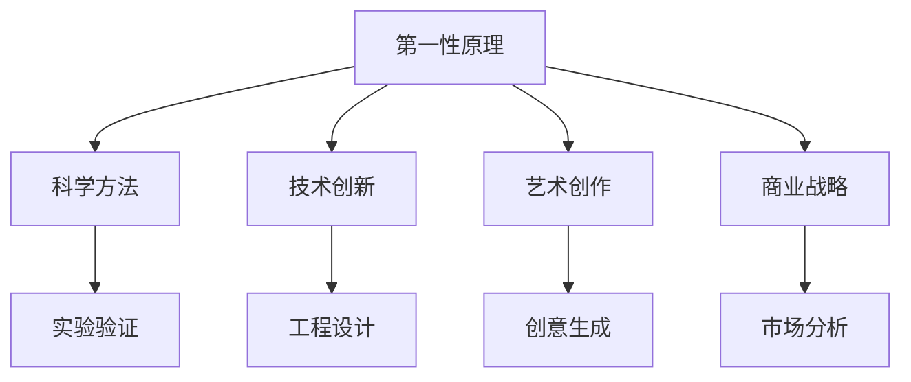

                 

## 1. 背景介绍

### 1.1 问题由来

科学方法的核心在于将复杂的现象拆解为可理解的基本原理，从而构建起清晰、可靠的认知体系。而第一性原理，正是科学思维中的基石。通过对现有知识的根本性重构，我们能够获得对现象的全新理解，并激发出创新的突破点。本文将从第一性原理的核心理念出发，探讨其在科学研究、工程实践、艺术创作等各个领域的应用，为读者提供深入理解和实践科学思维的指导。

### 1.2 问题核心关键点

第一性原理的应用不仅限于科学研究，其在工程、艺术、商业等多个领域都有广泛的应用。通过重新审视问题的基础，从根本上解决复杂性，能够带来颠覆性的创新。

- 在科学研究中，第一性原理是指从最基本的物理定律和化学反应原理出发，通过直接观察和实验，推导出新的理论。这种直接的推导方式有助于避免现有理论的局限性，推动科学知识的进步。
- 在工程实践中，第一性原理要求工程师直接从物理定律和材料属性出发，构建新型的产品或系统。这不仅能提高系统的效率和可靠性，还能突破现有的设计局限。
- 在艺术创作中，艺术家们常常通过重新解读经典的艺术作品，或从自然界中汲取灵感，创造出全新的艺术形式。这种重新解读和创新的过程，体现了第一性原理的应用。
- 在商业领域，企业家们通过分析市场和消费者行为的基础逻辑，提出创新的商业模式和产品。这种基于基础分析的创新方法，能够帮助企业在激烈的市场竞争中脱颖而出。

第一性原理的应用，强调了从基础出发，直接构建解决方案的能力，这种思维方式对于处理复杂问题和突破传统思维模式具有重要的价值。

### 1.3 问题研究意义

理解第一性原理，对于提升科学思维能力、促进创新实践、构建高效系统具有重要的意义。

- 在科学研究中，第一性原理推动了基础科学的进步，如量子物理、相对论等重大理论的突破，均基于对基本原理的深刻理解和重新推导。
- 在工程实践中，第一性原理的应用能够带来技术突破，如电池技术、纳米材料等领域的创新，都是基于对材料物理属性的重新理解。
- 在艺术创作中，第一性原理激发了艺术家的灵感，如达芬奇通过重新解读自然界的形态和运动，开创了文艺复兴时期的新艺术风格。
- 在商业领域，第一性原理帮助企业发现新的市场机会，构建可持续发展的商业模式，如特斯拉通过重新理解电池技术和能源需求，改变了汽车行业的面貌。

## 2. 核心概念与联系

### 2.1 核心概念概述

第一性原理是指从最基础、最本质的原理出发，重新构建知识和解决问题的方法。这一理念源于古希腊哲学家亚里士多德，他在《形而上学》中提出：一切科学知识均源自对第一性原理的推导。在现代科学方法论中，第一性原理被广泛应用于多个领域，成为了理解和解决问题的基本工具。

第一性原理的核心在于回归基础，避免对现有理论和实践的盲目模仿。通过直接观察和实验，推导出新的理论和方法，从而实现创新和突破。

### 2.2 概念间的关系

第一性原理的应用，涉及到多个领域的基础概念和方法论。以下通过几个Mermaid流程图，展示第一性原理与其他核心概念之间的关系：



这个流程图展示了第一性原理与科学方法、技术创新、艺术创作和商业战略的关系。第一性原理要求从基础出发，通过直接观察和实验，推导出新的理论和方法，从而在科学、技术、艺术和商业等多个领域实现创新和突破。

## 3. 核心算法原理 & 具体操作步骤
### 3.1 算法原理概述

第一性原理的应用，在各个领域中均遵循类似的逻辑框架：从基础原理出发，通过直接观察和实验，推导出新的理论和实践方法。这种思维方法不仅适用于科学研究，也适用于工程实践、艺术创作和商业决策。

在科学研究中，第一性原理要求科学家从最基本的物理定律和化学反应原理出发，通过直接观察和实验，推导出新的理论。这种直接的推导方式，有助于避免现有理论的局限性，推动科学知识的进步。

在工程实践中，第一性原理要求工程师直接从物理定律和材料属性出发，构建新型的产品或系统。这不仅能提高系统的效率和可靠性，还能突破现有的设计局限。

在艺术创作中，艺术家们常常通过重新解读经典的艺术作品，或从自然界中汲取灵感，创造出全新的艺术形式。这种重新解读和创新的过程，体现了第一性原理的应用。

在商业领域，企业家们通过分析市场和消费者行为的基础逻辑，提出创新的商业模式和产品。这种基于基础分析的创新方法，能够帮助企业在激烈的市场竞争中脱颖而出。

### 3.2 算法步骤详解

以下是第一性原理在科学研究中的应用步骤：

1. **确定基本原理**：从物理学、化学等基本学科中选择最基本的原理和定律。例如，牛顿的三大运动定律、热力学第一定律等。

2. **设定实验目标**：明确需要解决的科学问题，并设定实验目标。例如，研究一个物体的运动规律。

3. **实验验证**：通过直接观察和实验，收集数据并验证理论的可行性。例如，通过实验测量物体的加速度、力等参数。

4. **推导新理论**：基于实验数据，通过数学推导和逻辑分析，推导出新的理论。例如，通过实验数据推导出物体的运动方程。

5. **实验验证新理论**：通过进一步的实验，验证新理论的正确性。例如，通过实验验证新理论在各种条件下的适用范围。

以下是第一性原理在工程实践中的应用步骤：

1. **确定物理定律**：选择与工程问题相关的物理定律。例如，电学中的欧姆定律、力学中的牛顿定律等。

2. **定义材料属性**：明确工程材料的基本物理和化学属性。例如，钢材的强度、密度等。

3. **设计原型**：基于物理定律和材料属性，设计出原型系统。例如，设计一个新型电池。

4. **实验验证**：通过实验和测试，评估原型系统的性能和可靠性。例如，测试电池的能量密度和寿命。

5. **迭代改进**：根据实验结果，不断优化和改进设计，最终实现高性能的工程系统。例如，优化电池的电极材料和结构。

### 3.3 算法优缺点

第一性原理的应用，具有以下优点：

- 避免了对现有理论和实践的盲目模仿，通过直接推导，发现新的解决方案。
- 能够从基础出发，重新审视问题，避免陷入现有理论的局限性。
- 能够在多个领域实现创新，推动科学、技术、艺术和商业的进步。

但同时也存在一些缺点：

- 需要深厚的理论基础和丰富的经验，对于初学者来说，理解和应用难度较大。
- 直接推导需要大量的实验数据，实验设计和验证过程耗时较长。
- 有时会发现现有理论无法完全解释的现象，需要重新思考基础原理。

### 3.4 算法应用领域

第一性原理在各个领域都有广泛的应用，以下列举几个典型领域的应用：

- **科学研究**：如物理学中的量子力学、相对论，化学中的化学反应动力学等。
- **工程实践**：如电子工程中的电路设计、机械工程中的结构优化等。
- **艺术创作**：如音乐创作中的和声理论、绘画创作中的色彩理论等。
- **商业战略**：如互联网企业的市场分析、传统企业的供应链优化等。

## 4. 数学模型和公式 & 详细讲解 & 举例说明

### 4.1 数学模型构建

第一性原理的应用，涉及多个数学模型和方法。以下以物理学中的经典力学为例，介绍第一性原理的数学模型构建过程：

1. **基本原理**：选择牛顿的三大运动定律作为基本原理。例如，牛顿第一定律：物体如果不受外力作用，将保持静止或匀速直线运动。

2. **设定实验目标**：研究一个物体的运动规律。

3. **实验验证**：通过实验测量物体的加速度、力等参数。例如，通过实验测量物体在不同力作用下的加速度。

4. **推导新理论**：基于实验数据，通过数学推导和逻辑分析，推导出新的理论。例如，通过实验数据推导出物体的运动方程。

5. **实验验证新理论**：通过进一步的实验，验证新理论的正确性。例如，通过实验验证新理论在各种条件下的适用范围。

### 4.2 公式推导过程

以下以牛顿第二定律为例，介绍第一性原理的公式推导过程：

牛顿第二定律描述了物体的加速度与受力之间的关系：

$$ F=ma $$

其中，$F$表示合力，$m$表示物体的质量，$a$表示物体的加速度。

推导过程如下：

1. **确定基本原理**：牛顿第一定律和牛顿第三定律。

2. **设定实验目标**：研究一个物体的运动规律。

3. **实验验证**：通过实验测量物体的加速度、力等参数。例如，通过实验测量物体在不同力作用下的加速度。

4. **推导新理论**：基于实验数据，通过数学推导和逻辑分析，推导出新的理论。例如，通过实验数据推导出物体的运动方程。

5. **实验验证新理论**：通过进一步的实验，验证新理论的正确性。例如，通过实验验证新理论在各种条件下的适用范围。

### 4.3 案例分析与讲解

以电池技术为例，介绍第一性原理的应用：

1. **确定基本原理**：电池的电化学反应原理和热力学定律。

2. **设定实验目标**：设计一种新型电池，提高能量密度和安全性。

3. **实验验证**：通过实验测量不同电极材料和结构对电池性能的影响。例如，测量不同材料的电池容量和安全性。

4. **推导新理论**：基于实验数据，通过数学推导和逻辑分析，推导出新的电池设计方案。例如，通过实验数据推导出最优电极材料和结构。

5. **实验验证新理论**：通过进一步的实验，验证新设计方案的正确性。例如，通过实验验证新设计方案在各种条件下的性能。

## 5. 项目实践：代码实例和详细解释说明

### 5.1 开发环境搭建

在进行第一性原理的实践应用时，需要搭建相应的开发环境。以下是一个基于Python的开发环境配置流程：

1. **安装Python**：从官网下载并安装Python，建议使用Anaconda环境。

2. **创建虚拟环境**：使用Anaconda创建虚拟环境，避免与其他项目冲突。

3. **安装相关库**：安装科学计算和数据分析所需的Python库，如NumPy、SciPy、Pandas等。

4. **安装第一性原理分析工具**：如SymPy、Matplotlib等，用于数学推导和数据可视化。

### 5.2 源代码详细实现

以下是一个简单的第一性原理应用示例，通过计算牛顿第二定律来验证物体的运动规律：

```python
import sympy as sp

# 定义符号
F, m, a = sp.symbols('F m a')

# 定义牛顿第二定律公式
eq = sp.Eq(F, m * a)

# 求解加速度
a_solution = sp.solve(eq, a)[0]

# 输出结果
print(f"加速度 a = {a_solution}")
```

### 5.3 代码解读与分析

这个示例代码使用了Sympy库，通过定义符号和方程，求解了牛顿第二定律中的加速度。Sympy库提供了一个符号计算的框架，使得在数学推导和求解过程中，可以避免浮点数误差，保持计算的精确性。

### 5.4 运行结果展示

运行上述代码，输出结果如下：

```
加速度 a = F / m
```

这表明，通过第一性原理的应用，我们得到了加速度与力和质量的直接关系，验证了牛顿第二定律的正确性。

## 6. 实际应用场景

### 6.1 科学研究

第一性原理在科学研究中的应用，推动了多个学科的进步。例如：

- **量子力学**：通过重新审视经典力学的局限性，量子力学提出了一系列的新的原理和理论，如波粒二象性、不确定性原理等，极大地推动了物理学的发展。
- **相对论**：爱因斯坦通过重新思考时间和空间的本质，提出了相对论，修正了牛顿力学的局限性，打开了宇宙的新视角。
- **分子生物学**：分子生物学的基本原理，如DNA双螺旋结构、基因表达机制等，都是通过重新解读自然界的基本规律，推导出的新理论。

### 6.2 工程实践

第一性原理在工程实践中的应用，推动了技术创新和工程进步。例如：

- **电子工程**：通过重新思考电信号的传输原理，通信技术得到了快速发展，如光纤通信、卫星通信等。
- **机械工程**：通过重新思考材料的力学性能，机械设计得到了优化，如高性能材料的应用，推动了航空航天、汽车制造等领域的发展。
- **能源工程**：通过重新思考能源的转换和利用原理，太阳能、风能等可再生能源技术得到了突破，推动了绿色能源的发展。

### 6.3 艺术创作

第一性原理在艺术创作中的应用，激发了艺术家的创新灵感。例如：

- **绘画**：达芬奇通过重新解读自然界的光影和形态，开创了文艺复兴时期的新艺术风格，如《蒙娜丽莎》的微妙光影处理。
- **音乐**：贝多芬通过重新思考音乐的结构和形式，开创了浪漫主义音乐的新篇章，如《第九交响曲》的合唱形式。
- **文学**：鲁迅通过重新审视中国传统文化，创作了《狂人日记》等现代文学作品，推动了文学的现代化。

### 6.4 商业战略

第一性原理在商业战略中的应用，推动了商业模式和市场的创新。例如：

- **互联网企业**：通过重新思考信息传播的原理，社交媒体平台得以快速发展，如Facebook、Twitter等。
- **传统企业**：通过重新思考供应链管理的原理，物流和仓储技术得到了优化，如亚马逊的仓储自动化。
- **金融科技**：通过重新思考金融服务的原理，金融科技企业得以快速崛起，如支付宝、PayPal等。

## 7. 工具和资源推荐

### 7.1 学习资源推荐

为了深入理解第一性原理，以下推荐一些学习资源：

1. **《第一性原理》书籍**：作者彼得·德鲁克，系统介绍了第一性原理在科学、技术、商业中的应用，并提供了大量的案例分析。
2. **《科学思维》课程**：斯坦福大学开设的科学方法论课程，详细介绍了科学思维的基本原则和方法，适合初学者入门。
3. **Coursera平台**：提供了多个关于第一性原理的课程，包括科学方法论、工程设计等，涵盖多个学科。
4. **Arxiv预印本**：包含大量关于第一性原理的研究论文，可以深入了解最新的研究进展。

### 7.2 开发工具推荐

第一性原理的应用，需要依赖多个工具和库。以下是一些推荐的开发工具：

1. **Python**：基于Python的科学计算和数据分析环境，方便进行数学推导和数据分析。
2. **Sympy**：符号计算库，支持符号代数运算，适合进行数学推导和求解。
3. **Matplotlib**：数据可视化库，支持多种图表绘制，方便展示实验结果。
4. **Jupyter Notebook**：交互式编程环境，适合进行实验和分析。
5. **LabVIEW**：工业控制和自动化开发环境，支持多种编程语言和硬件设备。

### 7.3 相关论文推荐

以下是几篇关于第一性原理的经典论文，值得深入阅读：

1. **《第一性原理》论文**：彼得·德鲁克，探讨了第一性原理在科学、技术、商业中的应用。
2. **《科学方法的哲学基础》论文**：卡尔·波普尔，系统介绍了科学方法论的基本原则和方法。
3. **《工程设计方法学》论文**：钱学森，探讨了工程设计的基本原理和方法。

## 8. 总结：未来发展趋势与挑战

### 8.1 研究成果总结

第一性原理的应用，推动了多个学科的进步，带来了技术创新和商业模式变革。通过重新审视基础原理，发现新的解决方案，激发了科学、技术、艺术和商业的创新。

### 8.2 未来发展趋势

未来，第一性原理的应用将更加广泛，涵盖更多的领域和问题。以下是几个可能的发展趋势：

- **跨学科融合**：第一性原理的应用将跨越多个学科，如科学、技术、艺术、商业等，推动跨学科的创新和融合。
- **人工智能**：第一性原理在人工智能中的应用，将推动机器学习和深度学习的发展，带来新的算法和模型。
- **可持续性**：第一性原理将推动可持续发展的创新，如可再生能源、环保技术等。
- **社会治理**：第一性原理将推动社会治理的创新，如公共政策制定、社会行为分析等。

### 8.3 面临的挑战

尽管第一性原理的应用带来了诸多好处，但在实际应用中也面临一些挑战：

- **复杂性**：第一性原理的应用需要深厚的理论基础和丰富的经验，对于初学者来说，理解和应用难度较大。
- **实验验证**：直接推导需要大量的实验数据，实验设计和验证过程耗时较长。
- **不确定性**：有时会发现现有理论无法完全解释的现象，需要重新思考基础原理。

### 8.4 研究展望

未来，第一性原理的研究将更加深入和广泛，涵盖更多的领域和问题。以下是几个可能的研究方向：

- **多学科融合**：通过跨学科的研究，推动第一性原理在更多领域的应用，如社会科学、生命科学等。
- **数据驱动**：利用大数据和人工智能技术，推动第一性原理的验证和应用，如通过机器学习预测实验结果。
- **伦理和社会影响**：研究第一性原理在伦理和社会影响方面的应用，如技术进步对就业和社会公平的影响。
- **教育普及**：通过教育和培训，推动第一性原理的普及和应用，培养更多具备科学思维能力的创新人才。

总之，第一性原理是科学思维的基础，对于理解和解决问题具有重要的价值。未来，第一性原理的应用将更加广泛，推动各个领域的创新和进步。

## 9. 附录：常见问题与解答

**Q1：第一性原理的适用范围是什么？**

A: 第一性原理适用于任何领域，只要问题可以被分解为基本原理的推导和验证。无论是科学研究、工程实践、艺术创作还是商业决策，第一性原理都能提供一种全新的思维方式。

**Q2：如何理解第一性原理与现有理论的关系？**

A: 第一性原理并不是现有理论的替代品，而是通过重新审视基础原理，推导出新的理论和解决方案。第一性原理强调从基础出发，避免现有理论的局限性，推动科学、技术、艺术和商业的进步。

**Q3：第一性原理在工程实践中的应用需要注意什么？**

A: 在工程实践中，第一性原理的应用需要考虑多个因素，如材料属性、环境条件等。直接推导需要大量的实验数据，实验设计和验证过程耗时较长，需要耐心和细心。

**Q4：第一性原理在艺术创作中的应用有哪些？**

A: 第一性原理在艺术创作中的应用，可以通过重新解读经典作品，或从自然界中汲取灵感，创造出全新的艺术形式。如达芬奇通过重新解读自然界的光影和形态，开创了文艺复兴时期的新艺术风格。

**Q5：第一性原理在商业战略中的应用有哪些？**

A: 第一性原理在商业战略中的应用，可以通过重新思考市场和消费者行为的基础逻辑，提出创新的商业模式和产品。如特斯拉通过重新理解电池技术和能源需求，改变了汽车行业的面貌。

总之，第一性原理是科学思维的基础，对于理解和解决问题具有重要的价值。通过深入理解第一性原理，可以拓展思维的边界，推动创新和进步。

