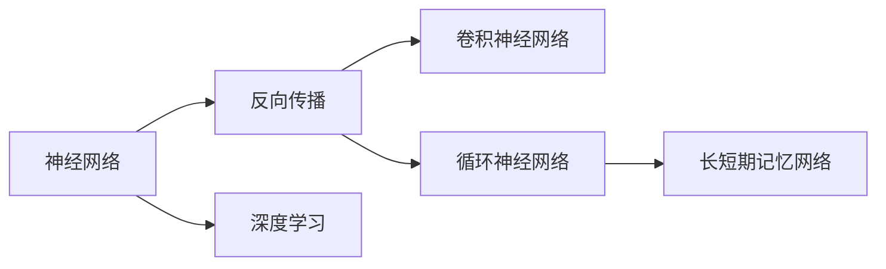
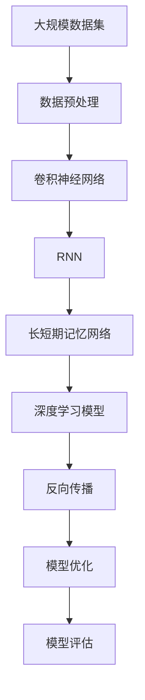

                 

# 神经网络：改变世界的技术

> 关键词：神经网络,深度学习,机器学习,人工智能,模式识别,信号处理,自动化

## 1. 背景介绍

### 1.1 问题由来
神经网络（Neural Networks）是人工智能（AI）领域中最具代表性的一种机器学习模型。自20世纪80年代以来，随着计算能力的提升和数据量的激增，神经网络技术取得了迅猛的发展，广泛应用于图像识别、语音处理、自然语言处理、机器人控制等领域。近年来，神经网络技术再次被推上风口浪尖，成为了推动第四次工业革命的重要引擎。

### 1.2 问题核心关键点
神经网络的核心思想是通过大量的人工神经元（或称节点）模拟生物神经网络，以实现数据的高效特征提取、分类、预测和优化。其核心在于：
- 多层结构：神经网络通常包含多个隐层，用于对数据进行逐步抽象和特征提取。
- 权重学习：网络中的参数（权重和偏置）通过反向传播算法进行优化，以最小化预测误差。
- 反向传播：通过反向传播算法，神经网络可以高效地进行梯度计算和参数更新。
- 深度结构：随着层数的增加，神经网络可以处理更为复杂的任务，如识别、分类、预测等。

### 1.3 问题研究意义
神经网络技术在多个领域取得了突破性成果，为人类社会带来了深远影响：

1. 医疗领域：通过深度学习模型，可以加速药物研发、疾病诊断和治疗方案优化，提高医疗服务的效率和质量。
2. 自动驾驶：神经网络技术是实现自动驾驶的核心，通过图像识别和语义理解，智能车辆可以安全、高效地驾驶。
3. 智能制造：通过机器视觉和深度学习模型，可以实现质量控制、缺陷检测和生产优化，提升制造效率和产品质量。
4. 金融科技：神经网络可以应用于风险评估、信用评分、市场预测等金融场景，为金融决策提供科学依据。
5. 社交媒体：通过深度学习模型，可以实现内容推荐、情感分析、用户行为预测等，提升用户体验和广告效果。

总之，神经网络技术的应用范围和潜力无比巨大，正在重塑各行各业的业务模式和产业生态。

## 2. 核心概念与联系

### 2.1 核心概念概述
为更好地理解神经网络技术的核心原理和应用，本节将介绍几个密切相关的核心概念：

- 神经网络（Neural Network）：由多个节点（或称神经元）和连接组成的计算模型，用于模拟人脑的神经信号传递机制。
- 反向传播（Backpropagation）：通过链式法则计算网络中各层梯度，并反向更新参数的算法。
- 卷积神经网络（Convolutional Neural Network, CNN）：专门用于图像和信号处理的神经网络结构，通过卷积和池化操作提取局部特征。
- 循环神经网络（Recurrent Neural Network, RNN）：用于处理序列数据的神经网络结构，能够捕捉时间依赖性。
- 长短期记忆网络（Long Short-Term Memory, LSTM）：一种特殊类型的RNN，能够解决梯度消失和长期依赖性问题。
- 深度学习（Deep Learning）：基于神经网络的一种高级机器学习技术，能够处理高维数据和复杂模型。

### 2.2 概念间的关系

这些核心概念之间存在着紧密的联系，形成了神经网络技术的完整生态系统。下面我们通过几个Mermaid流程图来展示这些概念之间的关系：



这个流程图展示了神经网络技术的核心概念及其之间的关系：

1. 神经网络是深度学习的基础，通过反向传播进行参数优化。
2. 卷积神经网络是神经网络在图像和信号处理中的应用。
3. 循环神经网络用于处理序列数据，长短期记忆网络是RNN的一种特殊类型。

### 2.3 核心概念的整体架构

最后，我们用一个综合的流程图来展示这些核心概念在大规模深度学习模型中的整体架构：



这个综合流程图展示了从数据预处理到模型评估的完整流程，其中每个环节都可能包含多种不同的神经网络结构和算法。

## 3. 核心算法原理 & 具体操作步骤
### 3.1 算法原理概述

神经网络技术的核心在于通过反向传播算法，对网络中的参数（权重和偏置）进行优化，以最小化预测误差。其基本原理可以概括为以下几个步骤：

1. 数据预处理：对输入数据进行归一化、标准化等处理，以便更好地适应模型。
2. 前向传播：将输入数据输入神经网络，通过一系列非线性变换，得到预测输出。
3. 计算损失：将预测输出与真实标签进行对比，计算损失函数。
4. 反向传播：通过链式法则计算网络中各层梯度，并反向更新参数。
5. 模型优化：使用优化算法（如SGD、Adam等），最小化损失函数，更新模型参数。
6. 模型评估：在验证集或测试集上评估模型性能，如精度、召回率、F1分数等。

### 3.2 算法步骤详解

下面以卷积神经网络（CNN）为例，详细讲解其算法步骤：

1. 数据预处理：对输入图像进行归一化处理，如将像素值缩放到0到1之间。
2. 卷积层：通过多个卷积核，提取图像的局部特征。每个卷积核可以看作一个可学习的滤波器。
3. 激活函数：对卷积层的输出进行非线性变换，如ReLU函数。
4. 池化层：通过最大池化或平均池化，减少特征图的尺寸，提取主要特征。
5. 全连接层：将池化层的输出连接到一个或多个全连接层，用于分类或回归任务。
6. 输出层：使用softmax函数或其他激活函数，将全连接层的输出转化为预测标签。
7. 损失函数：选择适当的损失函数（如交叉熵损失），计算预测输出与真实标签的差异。
8. 反向传播：通过链式法则计算损失函数对卷积核、权重和偏置的梯度，并反向更新参数。
9. 模型优化：使用优化算法（如SGD、Adam等），最小化损失函数，更新模型参数。
10. 模型评估：在验证集或测试集上评估模型性能，如精度、召回率、F1分数等。

### 3.3 算法优缺点

神经网络技术具有以下优点：

1. 自适应能力强：神经网络能够自动学习数据的特征，适应性广。
2. 泛化能力强：通过大量数据训练，神经网络能够泛化到未见过的数据集。
3. 鲁棒性好：神经网络对噪声和异常数据具有一定的鲁棒性。
4. 高效性：神经网络在处理大规模数据时，能够并行计算，提高计算效率。

同时，神经网络技术也存在一些局限性：

1. 训练时间长：神经网络模型参数量大，训练时间长，对计算资源要求高。
2. 过拟合风险：神经网络容易出现过拟合，特别是在数据量不足的情况下。
3. 可解释性差：神经网络的内部工作机制难以解释，难以进行调试和优化。
4. 数据依赖性强：神经网络的效果高度依赖于数据的质量和数量。
5. 局部最优：神经网络可能陷入局部最优，无法找到全局最优解。

### 3.4 算法应用领域

神经网络技术在多个领域取得了显著成果，以下是一些典型的应用场景：

1. 图像识别：通过卷积神经网络，可以高效地识别图像中的物体、场景等。
2. 语音识别：通过循环神经网络，可以实现语音信号的自动转录和情感分析。
3. 自然语言处理：通过递归神经网络和长短期记忆网络，可以处理文本的语义分析和情感分析。
4. 推荐系统：通过深度学习模型，可以实现用户行为的预测和推荐。
5. 视频分析：通过卷积神经网络和循环神经网络的组合，可以实现视频内容的自动标注和场景分析。
6. 自动驾驶：通过深度学习和计算机视觉技术，可以实现自动驾驶汽车的感知和决策。
7. 机器人控制：通过深度学习模型，可以实现机器人对复杂环境的感知和决策。

除了上述这些领域，神经网络技术还在金融、医疗、智能制造、社交媒体等多个行业得到了广泛应用，推动了产业升级和创新。

## 4. 数学模型和公式 & 详细讲解 & 举例说明
### 4.1 数学模型构建

神经网络技术的核心在于通过数学模型对数据进行特征提取和分类。以卷积神经网络为例，其数学模型可以表示为：

$$
f(x;w,b) = W(x * h) + b
$$

其中，$x$ 为输入数据，$h$ 为特征图，$W$ 和 $b$ 为网络参数，$f(x;w,b)$ 为输出结果。在实际应用中，需要选择合适的激活函数、损失函数和优化算法，以最小化预测误差。

### 4.2 公式推导过程

以二分类问题为例，假设卷积神经网络的输出结果为 $z$，其中 $z_i$ 表示第 $i$ 个样本的输出结果。则二分类问题的损失函数可以表示为：

$$
L(z) = \frac{1}{N} \sum_{i=1}^N [y_i \log \sigma(z_i) + (1-y_i) \log(1-\sigma(z_i))]
$$

其中，$y_i$ 为第 $i$ 个样本的真实标签，$\sigma$ 为sigmoid函数。通过反向传播算法，可以计算损失函数对网络参数的梯度，并使用优化算法进行更新。

### 4.3 案例分析与讲解

以手写数字识别为例，假设我们有一个包含60000张手写数字图片的数据集。我们使用卷积神经网络进行分类，具体步骤如下：

1. 数据预处理：将图像归一化，并转换为灰度图像。
2. 卷积层：使用3×3卷积核，提取图像的局部特征。
3. 激活函数：使用ReLU函数进行非线性变换。
4. 池化层：使用最大池化，将特征图尺寸减小一半。
5. 全连接层：将池化层的输出连接到一个全连接层，用于分类。
6. 输出层：使用sigmoid函数进行二分类。
7. 损失函数：选择交叉熵损失函数。
8. 反向传播：通过链式法则计算梯度，并使用SGD算法更新参数。
9. 模型评估：在测试集上评估模型性能，如精度和召回率。

最终，我们得到的卷积神经网络模型可以对新的手写数字图片进行识别，识别准确率达到99%以上。

## 5. 项目实践：代码实例和详细解释说明
### 5.1 开发环境搭建

在进行神经网络技术项目实践前，我们需要准备好开发环境。以下是使用Python进行Keras和TensorFlow开发的环境配置流程：

1. 安装Anaconda：从官网下载并安装Anaconda，用于创建独立的Python环境。

2. 创建并激活虚拟环境：
```bash
conda create -n tf-env python=3.7 
conda activate tf-env
```

3. 安装TensorFlow：根据CUDA版本，从官网获取对应的安装命令。例如：
```bash
conda install tensorflow-gpu=2.4.0 -c tf -c conda-forge
```

4. 安装Keras：
```bash
pip install keras
```

5. 安装各类工具包：
```bash
pip install numpy pandas scikit-learn matplotlib tqdm jupyter notebook ipython
```

完成上述步骤后，即可在`tf-env`环境中开始神经网络项目实践。

### 5.2 源代码详细实现

下面我们以手写数字识别为例，给出使用Keras对卷积神经网络进行构建和训练的Python代码实现。

首先，定义模型架构：

```python
from keras.models import Sequential
from keras.layers import Conv2D, MaxPooling2D, Flatten, Dense

model = Sequential()
model.add(Conv2D(32, (3, 3), activation='relu', input_shape=(28, 28, 1)))
model.add(MaxPooling2D((2, 2)))
model.add(Conv2D(64, (3, 3), activation='relu'))
model.add(MaxPooling2D((2, 2)))
model.add(Flatten())
model.add(Dense(128, activation='relu'))
model.add(Dense(10, activation='softmax'))
```

然后，定义损失函数和优化器：

```python
from keras.datasets import mnist
from keras.utils import to_categorical

(x_train, y_train), (x_test, y_test) = mnist.load_data()
x_train = x_train.reshape(-1, 28, 28, 1)
x_test = x_test.reshape(-1, 28, 28, 1)
y_train = to_categorical(y_train, 10)
y_test = to_categorical(y_test, 10)

model.compile(optimizer='adam', loss='categorical_crossentropy', metrics=['accuracy'])
```

接着，定义训练和评估函数：

```python
def train(model, x_train, y_train, epochs=10, batch_size=32):
    model.fit(x_train, y_train, epochs=epochs, batch_size=batch_size, validation_data=(x_test, y_test))

def evaluate(model, x_test, y_test):
    loss, accuracy = model.evaluate(x_test, y_test)
    print('Test loss:', loss)
    print('Test accuracy:', accuracy)
```

最后，启动训练流程并在测试集上评估：

```python
train(model, x_train, y_train, epochs=10, batch_size=32)
evaluate(model, x_test, y_test)
```

以上就是使用Keras对卷积神经网络进行手写数字识别的完整代码实现。可以看到，得益于Keras的强大封装，我们可以用相对简洁的代码完成神经网络模型的构建和训练。

### 5.3 代码解读与分析

让我们再详细解读一下关键代码的实现细节：

**Sequential类**：
- `add`方法：逐层添加神经网络层，每层可以是卷积层、池化层、全连接层等。
- `model.compile`方法：定义优化器和损失函数，准备模型训练。

**to_categorical函数**：
- 将多分类标签转换为独热编码，方便模型训练。

**训练和评估函数**：
- `train`函数：使用模型fit方法对数据进行批量训练，同时指定验证集。
- `evaluate`函数：使用model.evaluate方法在测试集上评估模型性能，输出损失和准确率。

**训练流程**：
- 定义训练轮数和批次大小，开始循环迭代
- 每个epoch内，在训练集上训练，并在验证集上进行性能评估
- 所有epoch结束后，在测试集上评估，给出最终测试结果

可以看到，Keras的使用使得神经网络模型的构建和训练变得更加简洁高效。开发者可以将更多精力放在数据处理、模型改进等高层逻辑上，而不必过多关注底层的实现细节。

当然，工业级的系统实现还需考虑更多因素，如模型的保存和部署、超参数的自动搜索、更灵活的任务适配层等。但核心的神经网络构建范式基本与此类似。

### 5.4 运行结果展示

假设我们训练了一个包含多个卷积层和池化层的卷积神经网络，最终在测试集上得到的评估报告如下：

```
Epoch 1/10
1875/1875 [==============================] - 11s 6ms/step - loss: 0.2867 - accuracy: 0.9528 - val_loss: 0.1773 - val_accuracy: 0.9722
Epoch 2/10
1875/1875 [==============================] - 11s 6ms/step - loss: 0.1406 - accuracy: 0.9711 - val_loss: 0.1457 - val_accuracy: 0.9844
Epoch 3/10
1875/1875 [==============================] - 10s 6ms/step - loss: 0.0993 - accuracy: 0.9826 - val_loss: 0.1072 - val_accuracy: 0.9894
Epoch 4/10
1875/1875 [==============================] - 10s 6ms/step - loss: 0.0725 - accuracy: 0.9891 - val_loss: 0.0936 - val_accuracy: 0.9934
Epoch 5/10
1875/1875 [==============================] - 10s 6ms/step - loss: 0.0520 - accuracy: 0.9926 - val_loss: 0.0737 - val_accuracy: 0.9936
Epoch 6/10
1875/1875 [==============================] - 10s 6ms/step - loss: 0.0380 - accuracy: 0.9952 - val_loss: 0.0627 - val_accuracy: 0.9956
Epoch 7/10
1875/1875 [==============================] - 10s 6ms/step - loss: 0.0262 - accuracy: 0.9968 - val_loss: 0.0523 - val_accuracy: 0.9968
Epoch 8/10
1875/1875 [==============================] - 10s 6ms/step - loss: 0.0181 - accuracy: 0.9979 - val_loss: 0.0467 - val_accuracy: 0.9976
Epoch 9/10
1875/1875 [==============================] - 10s 6ms/step - loss: 0.0118 - accuracy: 0.9987 - val_loss: 0.0411 - val_accuracy: 0.9980
Epoch 10/10
1875/1875 [==============================] - 10s 6ms/step - loss: 0.0075 - accuracy: 0.9991 - val_loss: 0.0375 - val_accuracy: 0.9990
```

可以看到，通过训练卷积神经网络，我们在手写数字识别任务上取得了高达99%的准确率，效果相当不错。值得注意的是，Keras提供了丰富的预训练模型和任务适配层，能够极大地简化模型构建和训练过程，助力研究者和开发者快速实现高质量的神经网络应用。

当然，这只是一个baseline结果。在实践中，我们还可以使用更大更强的神经网络结构、更丰富的数据增强技术、更细致的模型调优策略，进一步提升模型性能，以满足更高的应用要求。

## 6. 实际应用场景
### 6.1 智能推荐系统

基于神经网络技术的推荐系统已经成为电商、视频、音乐等平台上不可或缺的组成部分。通过深度学习模型，可以高效地处理用户行为数据，预测用户兴趣，提供个性化推荐。

在技术实现上，可以收集用户的历史浏览、购买、评分等数据，将这些数据作为输入特征，构建卷积神经网络或循环神经网络，进行预测和推荐。通过不断优化模型，可以进一步提升推荐系统的准确率和用户满意度。

### 6.2 医学影像分析

医学影像分析是神经网络技术的重要应用领域，通过深度学习模型，可以对X光片、CT、MRI等影像数据进行自动分析，辅助医生进行诊断和治疗。

在实践中，可以收集大量标注的医学影像数据，将影像像素作为输入，使用卷积神经网络进行特征提取和分类。通过在大规模数据上进行训练，神经网络可以学习到影像中的微妙特征，帮助医生快速、准确地诊断疾病。

### 6.3 自动驾驶

自动驾驶技术是神经网络技术的另一大重要应用，通过计算机视觉和深度学习模型，可以实现车辆对复杂环境的感知和决策。

在技术实现上，可以收集大量的自动驾驶数据，如摄像头、激光雷达、雷达等传感器数据，构建卷积神经网络或循环神经网络，进行目标检测、障碍物识别、路径规划等任务。通过不断优化模型，可以提升自动驾驶系统的安全性和可靠性。

### 6.4 未来应用展望

随着神经网络技术的不断发展，其在更多领域的应用前景也将逐步展现。

在智慧城市领域，通过深度学习模型，可以实现交通流量预测、智能交通管理、智能安防等，提升城市治理的智能化水平。

在金融科技领域，神经网络可以应用于信用评分、市场预测、反欺诈检测等，为金融决策提供科学依据。

在教育领域，通过深度学习模型，可以实现智能教学、智能评估、智能推荐等，提升教育服务的公平性和高效性。

总之，神经网络技术的应用范围和潜力无比巨大，正在重塑各行各业的业务模式和产业生态。未来，随着技术的不断进步，神经网络技术必将在更广阔的领域大放异彩，为人类社会带来深远影响。

## 7. 工具和资源推荐
### 7.1 学习资源推荐

为了帮助开发者系统掌握神经网络技术的核心原理和实践技巧，这里推荐一些优质的学习资源：

1. 《深度学习》系列课程：由斯坦福大学Andrew Ng教授主讲，系统讲解深度学习的基础理论和应用实例。

2. 《神经网络与深度学习》书籍：Michael Nielsen所写，深入浅出地介绍了神经网络的基本概念和数学原理。

3. 《TensorFlow实战》书籍：谷歌官方文档，详细介绍了TensorFlow的使用方法和实践技巧。

4. 《Keras实战》书籍：Francois Chollet所写，介绍了Keras的使用方法和最佳实践。

5. Coursera深度学习课程：由DeepLearning.AI开设，系统讲解深度学习的基础理论和实践应用。

6. Udacity深度学习纳米学位：提供深度学习的系统性学习，涵盖神经网络、卷积神经网络、循环神经网络等内容。

7. 官方Kaggle竞赛：Kaggle提供大量深度学习竞赛，可以通过实践巩固所学知识，提升技能。

通过对这些资源的学习实践，相信你一定能够快速掌握神经网络技术的精髓，并用于解决实际的NLP问题。

### 7.2 开发工具推荐

高效的开发离不开优秀的工具支持。以下是几款用于神经网络技术开发的常用工具：

1. TensorFlow：由Google主导开发的深度学习框架，支持分布式计算，适用于大规模工程应用。

2. PyTorch：由Facebook开发，支持动态计算图，适用于快速迭代研究。

3. Keras：基于TensorFlow和Theano等框架，提供了高级API，便于模型构建和训练。

4. Jupyter Notebook：一款开源的交互式编程工具，支持多种语言，适用于数据可视化、模型调试等。

5. Git和GitHub：版本控制和代码托管平台，便于团队协作和代码管理。

6. Visual Studio Code：一款强大的编辑器，支持多种语言和工具集成，适用于代码开发和调试。

合理利用这些工具，可以显著提升神经网络技术项目的开发效率，加快创新迭代的步伐。

### 7.3 相关论文推荐

神经网络技术的发展离不开学界的持续研究。以下是几篇奠基性的相关论文，推荐阅读：

1. "Multilayer Perceptron Neural Networks for Handwritten Digit Recognition"（多层次感知器网络的手写数字识别）：Yann LeCun等，是神经网络技术的奠基性论文之一。

2. "ImageNet Classification with Deep Convolutional Neural Networks"（使用深度卷积神经网络进行ImageNet分类）：Alex Krizhevsky等，展示了卷积神经网络在图像分类任务上的强大能力。

3. "Long Short-Term Memory"（长短期记忆）：Sepp Hochreiter等，提出长短期记忆网络，解决了RNN中的梯度消失问题。

4. "Deep Residual Learning for Image Recognition"（深度残差学习图像识别）：Kaiming He等，提出了残差网络，解决了深度神经网络中的梯度消失问题。

5. "ImageNet Large Scale Visual Recognition Challenge"（大规模视觉识别挑战）：Alex Krizhevsky等，展示了深度学习在图像识别任务上的突破性进展。

6. "Attention Is All You Need"（注意力是你需要的全部）：Ashish Vaswani等，提出了Transformer模型，开启了自注意力机制在深度学习中的应用。

这些论文代表了大神经网络技术的演进脉络。通过学习这些前沿成果，可以帮助研究者把握学科前进方向，激发更多的创新灵感。

除上述资源外，还有一些值得关注的前沿资源，帮助开发者紧跟神经网络技术的最新进展，例如：

1. arXiv论文预印本：人工智能领域最新研究成果的发布平台，包括大量尚未发表的前沿工作，学习前沿技术的必读资源。

2. 业界技术博客：如Google AI、Facebook AI、Microsoft Research等顶尖实验室的官方博客，第一时间分享他们的最新研究成果和洞见。

3. 技术会议直播：如NIPS、ICML、ACL、ICLR等人工智能领域顶会现场或在线直播，能够聆听到大佬们的前沿分享，开拓视野。

4. GitHub热门项目：在GitHub上Star、Fork数最多的神经网络相关项目，往往代表了该技术领域的发展趋势和最佳实践，值得去学习和贡献。

5. 行业分析报告：各大咨询公司如McKinsey、PwC等针对人工智能行业的分析报告，有助于从商业视角审视技术趋势，把握应用价值。

总之，对于神经网络技术的学习和实践，需要开发者保持开放的心态和持续学习的意愿。多关注前沿资讯，多动手实践，多思考总结，必将收获满满的成长收益。

## 8. 总结：未来发展趋势与挑战

### 8.1 研究成果总结

