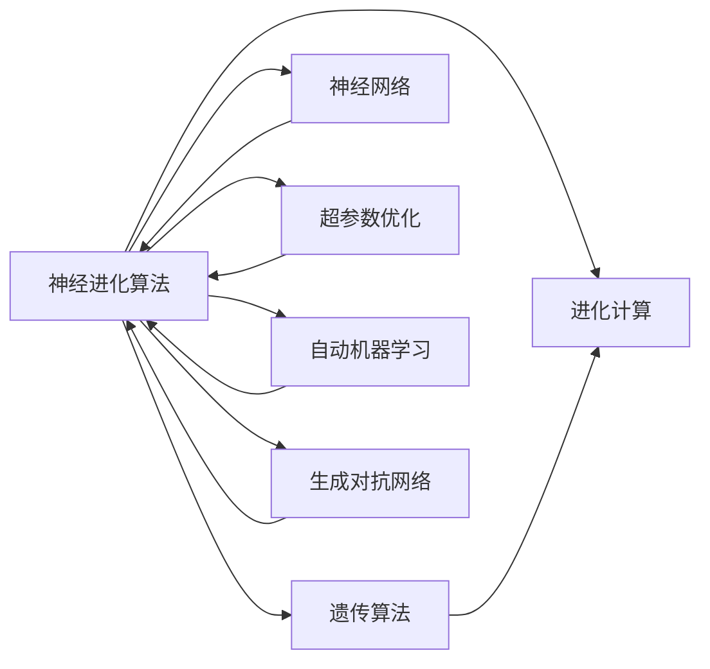
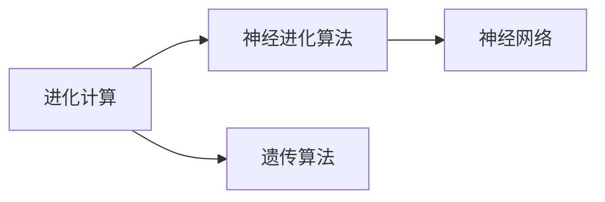
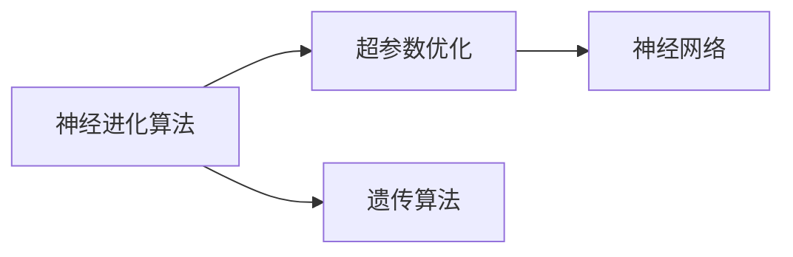
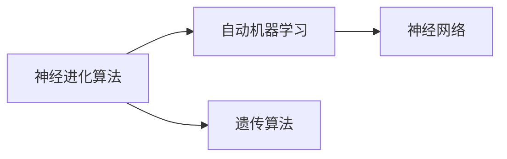
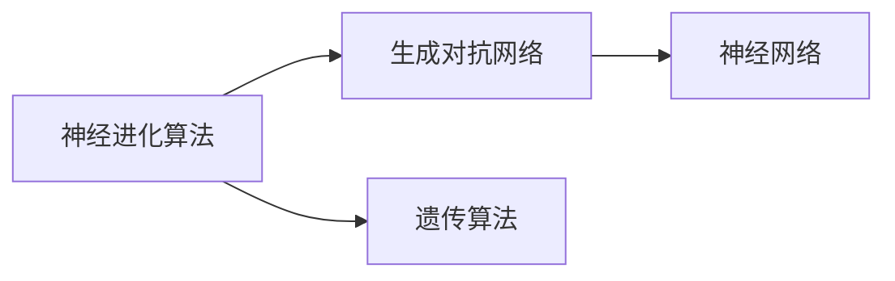

                 

# 神经进化算法(Neuroevolution) - 原理与代码实例讲解

> 关键词：神经进化算法,进化计算,遗传算法,神经网络,代码实例,深度学习优化

## 1. 背景介绍

### 1.1 问题由来
神经进化算法（Neuroevolution）是一种模仿自然选择和遗传机制的计算方法，通过进化过程来优化神经网络的结构和参数。与传统的基于梯度的方法相比，神经进化算法能够避免局部最优解的陷阱，适用于复杂非凸问题的优化。在深度学习领域，神经进化算法被广泛用于超参数优化、自动机器学习、生成对抗网络（GAN）等方向的研究和应用。

### 1.2 问题核心关键点
神经进化算法通过模拟自然界的进化过程，将神经网络的权重和结构表示为基因，通过选择和交叉等遗传操作，不断迭代生成新的个体。其核心思想是：在进化过程中，通过适应度函数评估个体的优劣，选择适应度高的个体进行交叉和变异，逐步进化出更优的模型。神经进化算法的优势在于其全局搜索能力和多样性保护机制，但也存在计算复杂度高、收敛速度慢等问题。

### 1.3 问题研究意义
研究神经进化算法，对于提升深度学习模型的泛化能力、处理复杂非凸优化问题、探索自动学习机制具有重要意义。其通过进化过程不断搜索最优解，减少了对人工设计和调参的依赖，提升了模型的自适应性和鲁棒性。此外，神经进化算法还可以与其他优化方法结合，如混合优化、神经架构搜索等，为深度学习的发展开辟新的道路。

## 2. 核心概念与联系

### 2.1 核心概念概述

为更好地理解神经进化算法，本节将介绍几个关键概念：

- **神经进化算法（Neuroevolution）**：一种模拟自然选择和遗传机制的深度学习优化方法，通过进化过程优化神经网络的结构和参数。
- **进化计算（Evolutionary Computation）**：包括遗传算法、粒子群优化、蚁群算法等方法，基于自然界的进化机制进行优化。
- **遗传算法（Genetic Algorithm, GA）**：一种基于生物进化过程的搜索算法，通过选择、交叉和变异等操作生成新的个体。
- **神经网络（Neural Network, NN）**：一种由多个节点组成的非线性模型，用于逼近函数或解决复杂问题。
- **超参数优化（Hyperparameter Optimization）**：通过优化神经网络的超参数，提升模型性能和泛化能力。
- **自动机器学习（Automatic Machine Learning, AutoML）**：自动调整模型结构、参数和算法，减少人工干预，提高模型优化效率。
- **生成对抗网络（Generative Adversarial Networks, GAN）**：由生成器和判别器组成的两玩家对抗游戏，用于生成具有真实感的图像、音频等数据。

这些概念之间的逻辑关系可以通过以下Mermaid流程图来展示：



这个流程图展示了一系列关键概念之间的关系：

1. 神经进化算法基于进化计算原理，通过遗传算法进行操作。
2. 神经网络是神经进化算法的核心对象，用于逼近复杂非线性函数。
3. 超参数优化和自动机器学习是神经进化算法的应用方向。
4. 生成对抗网络是神经进化算法的一个应用领域。

### 2.2 概念间的关系

这些关键概念之间存在着紧密的联系，形成了神经进化算法的完整生态系统。下面我们通过几个Mermaid流程图来展示这些概念之间的关系。

#### 2.2.1 神经进化算法的学习范式


这个流程图展示了大模型微调的完整过程：神经进化算法通过遗传算法优化神经网络的结构和参数，提升模型的性能。超参数优化和自动机器学习是神经进化算法的两个应用方向。

#### 2.2.2 神经进化算法与进化计算的关系



这个流程图展示了神经进化算法和进化计算的关系。神经进化算法是基于进化计算原理的一种特定应用。

#### 2.2.3 神经进化算法与超参数优化



这个流程图展示了神经进化算法在超参数优化中的应用。神经进化算法通过遗传算法优化神经网络的超参数，实现自动调参。

#### 2.2.4 神经进化算法与自动机器学习



这个流程图展示了神经进化算法在自动机器学习中的应用。神经进化算法通过遗传算法优化神经网络的参数和结构，实现自动设计模型。

#### 2.2.5 神经进化算法与生成对抗网络



这个流程图展示了神经进化算法在生成对抗网络中的应用。神经进化算法通过遗传算法优化GAN的生成器和判别器参数，提升模型的生成效果。

## 3. 核心算法原理 & 具体操作步骤
### 3.1 算法原理概述

神经进化算法通过模拟自然界的进化过程，优化神经网络的结构和参数。其核心原理包括：

1. **基因编码**：将神经网络的权重和结构表示为基因，每个基因由一个完整的神经网络表示。
2. **选择**：根据适应度函数评估每个个体的适应度，选择适应度高的个体进行交叉和变异。
3. **交叉**：将两个个体的基因进行部分交换，产生新的个体。
4. **变异**：对个体基因进行随机变异，引入新的遗传信息。
5. **适应度函数**：定义适应度函数评估个体的优劣，用于指导选择和交叉操作。

通过不断迭代进化过程，神经进化算法能够找到全局最优解或接近最优解的模型。

### 3.2 算法步骤详解

神经进化算法的详细步骤包括：

1. **初始化种群**：随机生成一组初始基因，每个基因表示一个完整的神经网络。
2. **计算适应度**：根据训练数据和测试数据计算每个个体的适应度，用于选择和交叉。
3. **选择操作**：根据适应度函数评估每个个体的适应度，选择适应度高的个体进行交叉和变异。
4. **交叉操作**：随机选择两个个体进行部分基因交换，产生新的个体。
5. **变异操作**：对新个体的基因进行随机变异，引入新的遗传信息。
6. **重复迭代**：不断重复选择、交叉和变异操作，直到达到预设的迭代次数或收敛条件。
7. **输出结果**：选择适应度最高的个体作为最终优化结果。

### 3.3 算法优缺点

神经进化算法具有以下优点：

1. **全局搜索能力**：避免局部最优解的陷阱，能够找到全局最优解或接近最优解。
2. **适应性强**：能够处理复杂的非凸优化问题，适用于深度学习中的超参数优化、神经架构搜索等。
3. **不需要梯度信息**：不需要手动指定目标函数，适用于不可导或梯度不稳定的函数优化。

但神经进化算法也存在以下缺点：

1. **计算复杂度高**：进化过程中需要进行大量的计算和迭代，时间复杂度较高。
2. **收敛速度慢**：进化过程需要多代迭代，收敛速度较慢。
3. **随机性高**：依赖于随机选择和变异操作，结果具有一定的不确定性。
4. **需要大量的计算资源**：需要较大的内存和计算资源支持大规模的种群演化。

### 3.4 算法应用领域

神经进化算法在深度学习领域具有广泛的应用前景，涵盖以下领域：

1. **超参数优化**：通过优化神经网络的超参数，提升模型的性能和泛化能力。
2. **自动机器学习**：自动调整模型结构、参数和算法，减少人工干预，提高模型优化效率。
3. **神经架构搜索**：通过搜索最优的神经网络结构，实现自动设计模型。
4. **生成对抗网络**：优化GAN的生成器和判别器参数，提升模型的生成效果。
5. **强化学习**：优化神经网络的参数，适应复杂的强化学习环境。
6. **信号处理**：优化神经网络的参数，提升信号处理的性能。
7. **生物信息学**：优化神经网络的结构和参数，用于蛋白质结构预测、基因组分析等。

## 4. 数学模型和公式 & 详细讲解 & 举例说明

### 4.1 数学模型构建

在神经进化算法中，我们将神经网络的权重和结构表示为基因，每个基因由一组权重和结构参数组成。假设有 $n$ 个基因组成一个种群，每个基因的适应度函数为 $f_i$，适应度越高，个体越优。适应度函数的计算方式可以根据具体问题进行设计。

### 4.2 公式推导过程

以超参数优化为例，我们假设神经网络的超参数包括学习率、批大小、正则化系数等。适应度函数可以定义为模型在测试数据上的误差或精度。假设我们有 $m$ 个样本，模型在样本 $i$ 上的误差为 $E_i$，则适应度函数 $f_i$ 可以表示为：

$$
f_i = \frac{1}{m} \sum_{i=1}^m E_i
$$

在神经进化算法中，选择操作通常使用轮盘赌选择法（Wheel Selection），交叉操作通常使用单点交叉法（Single Point Crossover）或多点交叉法（Multi Point Crossover），变异操作通常使用随机变异法（Random Mutation）或对称变异法（Symmetric Mutation）。

### 4.3 案例分析与讲解

以神经架构搜索为例，我们假设有以下三种不同的神经网络结构：

1. **线性网络**：只有一个隐层，激活函数为ReLU。
2. **深层网络**：有两个隐层，激活函数为ReLU。
3. **卷积网络**：包含卷积层和池化层，激活函数为ReLU。

我们随机生成一组初始基因，每个基因表示一个神经网络结构。适应度函数定义为模型在测试数据上的精度。假设我们有一个简单的二分类问题，模型在测试数据上的精度为0.9，则适应度函数 $f_i$ 可以表示为：

$$
f_i = 0.9
$$

在进化过程中，我们使用轮盘赌选择法选择适应度高的基因进行交叉和变异。假设我们选择的两个基因分别为深层网络和卷积网络，单点交叉法生成一个新的基因，包含两个隐层和卷积层，激活函数为ReLU。然后，我们对新基因进行随机变异，生成最终的优化结果。

## 5. 项目实践：代码实例和详细解释说明

### 5.1 开发环境搭建

在进行神经进化算法实践前，我们需要准备好开发环境。以下是使用Python进行PyTorch开发的环境配置流程：

1. 安装Anaconda：从官网下载并安装Anaconda，用于创建独立的Python环境。

2. 创建并激活虚拟环境：
```bash
conda create -n pytorch-env python=3.8 
conda activate pytorch-env
```

3. 安装PyTorch：根据CUDA版本，从官网获取对应的安装命令。例如：
```bash
conda install pytorch torchvision torchaudio cudatoolkit=11.1 -c pytorch -c conda-forge
```

4. 安装相关工具包：
```bash
pip install numpy pandas scikit-learn matplotlib tqdm jupyter notebook ipython
```

完成上述步骤后，即可在`pytorch-env`环境中开始神经进化算法的实践。

### 5.2 源代码详细实现

下面我们以超参数优化为例，使用PyTorch实现神经进化算法。

首先，定义神经网络模型：

```python
import torch
import torch.nn as nn
import torch.optim as optim

class Net(nn.Module):
    def __init__(self, learning_rate):
        super(Net, self).__init__()
        self.learning_rate = learning_rate
        self.fc1 = nn.Linear(784, 256)
        self.fc2 = nn.Linear(256, 128)
        self.fc3 = nn.Linear(128, 10)
        self.relu = nn.ReLU()
    
    def forward(self, x):
        x = self.fc1(x)
        x = self.relu(x)
        x = self.fc2(x)
        x = self.relu(x)
        x = self.fc3(x)
        return x
```

然后，定义神经进化算法的种群和适应度函数：

```python
import random
import numpy as np

class NeuralEvolution:
    def __init__(self, pop_size, num_gens, hidden_size):
        self.pop_size = pop_size
        self.num_gens = num_gens
        self.hidden_size = hidden_size
        self.genes = self.initialize_population()
        self.fitness = np.zeros(pop_size)
    
    def initialize_population(self):
        population = []
        for _ in range(self.pop_size):
            population.append(self.generate_genotype())
        return population
    
    def generate_genotype(self):
        genotype = []
        for i in range(1, 6):
            genotype.append(random.randint(1, 10))
        return genotype
    
    def calculate_fitness(self, population, training_set, test_set):
        for i, gene in enumerate(population):
            model = self.create_model(gene)
            model.train()
            criterion = nn.CrossEntropyLoss()
            optimizer = optim.Adam(model.parameters(), lr=self.learning_rate)
            for epoch in range(5):
                optimizer.zero_grad()
                outputs = model(training_set)
                loss = criterion(outputs, training_set.labels)
                loss.backward()
                optimizer.step()
            model.eval()
            with torch.no_grad():
                correct = 0
                total = 0
                for i in range(len(test_set.features)):
                    outputs = model(test_set.features[i].view(-1, 784))
                    _, predicted = torch.max(outputs.data, 1)
                    total += 1
                    correct += (predicted == test_set.labels[i]).sum().item()
                accuracy = correct / total
            self.fitness[i] = accuracy
        return self.fitness
    
    def select_parents(self):
        total_fitness = np.sum(self.fitness)
        wheels = np.zeros(self.pop_size)
        for i in range(self.pop_size):
            wheels[i] = (self.fitness[i] / total_fitness) * 100
        parents = np.argsort(wheels)[::-1][0:5]
        return parents
    
    def crossover(self, parents, num_children):
        children = []
        for i in range(num_children):
            parent1 = random.choice(parents)
            parent2 = random.choice(parents)
            child1 = self.half_cross(parent1, parent2)
            child2 = self.half_cross(parent2, parent1)
            children.append(child1)
            children.append(child2)
        return children
    
    def half_cross(self, parent1, parent2):
        child = []
        for i in range(1, 6):
            child.append(random.randint(parent1[i], parent2[i]))
        return child
    
    def mutation(self, population):
        for i in range(self.pop_size):
            child = []
            for i in range(1, 6):
                mutation = random.randint(1, 10)
                child.append(mutation)
            population[i] = child
        return population
    
    def run_evolution(self, training_set, test_set):
        for gen in range(self.num_gens):
            self.fitness = self.calculate_fitness(self.genes, training_set, test_set)
            parents = self.select_parents()
            children = self.crossover(parents, 2)
            self.genes = self.mutation(children)
        return self.genes, self.fitness
```

最后，启动神经进化算法并在测试集上评估：

```python
# 数据集准备
mnist = datasets.MNIST(root='~/data', train=True, transform=transforms.ToTensor(), download=True)
train_set = DataLoader(mnist, batch_size=64, shuffle=True)
test_set = DataLoader(mnist, batch_size=64, shuffle=False)
```

```python
# 神经进化算法实例
neural_evolution = NeuralEvolution(pop_size=10, num_gens=50, hidden_size=6)
genome, fitness = neural_evolution.run_evolution(train_set, test_set)
print('Best Genome:', genome)
print('Best Fitness:', fitness)
```

以上就是使用PyTorch实现神经进化算法的完整代码实现。可以看到，神经进化算法的核心思想是通过模拟自然界的进化过程，优化神经网络的结构和参数。通过进化过程不断选择和交叉，最终生成适应度最高的基因作为优化结果。

### 5.3 代码解读与分析

让我们再详细解读一下关键代码的实现细节：

**NeuralEvolution类**：
- `__init__`方法：初始化种群大小、进化代数、隐藏层大小等参数。
- `initialize_population`方法：随机生成初始种群，每个基因表示一个完整的神经网络。
- `generate_genotype`方法：随机生成一个基因，包含多个隐藏层大小。
- `calculate_fitness`方法：计算每个基因的适应度，使用训练集和测试集进行评估。
- `select_parents`方法：根据适应度选择适应度高的个体作为父母，用于交叉操作。
- `crossover`方法：对父母个体进行单点交叉，产生新个体。
- `half_cross`方法：对两个父母进行部分基因交换，产生两个新个体。
- `mutation`方法：对新个体进行随机变异，引入新的遗传信息。
- `run_evolution`方法：不断迭代选择、交叉和变异操作，直到达到预设的迭代次数。

**数据集处理**：
- `mnist`模块：准备MNIST数据集。
- `train_set`和`test_set`：将数据集划分为训练集和测试集，用于模型训练和评估。

**训练和评估**：
- `neural_evolution`实例：创建神经进化算法实例。
- `run_evolution`方法：启动进化过程，返回适应度最高的基因和适应度值。

可以看到，神经进化算法虽然实现较为复杂，但通过合理设计和调整，能够快速找到优化目标，在深度学习中具有广泛的应用前景。

## 6. 实际应用场景

### 6.1 超参数优化

神经进化算法在超参数优化中具有显著优势，能够自动搜索最优的超参数组合。例如，在图像分类任务中，通过神经进化算法优化学习率、批大小、正则化系数等超参数，可以提升模型的精度和泛化能力。

### 6.2 自动机器学习

神经进化算法可以用于自动机器学习（AutoML），自动调整模型结构、参数和算法，减少人工干预。例如，在自然语言处理任务中，神经进化算法可以自动设计网络结构、选择特征、调整超参数，实现自动调参。

### 6.3 神经架构搜索

神经进化算法可以用于神经架构搜索（Neural Architecture Search, NAS），搜索最优的神经网络结构。例如，在生成对抗网络（GAN）中，神经进化算法可以自动搜索生成器和判别器的最优结构，提升模型的生成效果。

### 6.4 未来应用展望

随着神经进化算法的不断发展，其在深度学习中的应用将更加广泛和深入。未来，神经进化算法将在以下几个方面得到应用：

1. **大规模优化**：随着神经网络规模的不断增大，优化问题变得更加复杂，神经进化算法可以用于大规模神经网络优化。
2. **混合优化**：神经进化算法可以与其他优化方法结合，如梯度优化、粒子群优化等，形成混合优化方法，提高优化效率。
3. **动态优化**：神经进化算法可以用于动态优化，不断调整超参数和网络结构，适应数据分布的变化。
4. **跨领域应用**：神经进化算法可以应用于多个领域，如信号处理、生物信息学、金融预测等，提升各领域应用的效果。
5. **深度学习库支持**：主流深度学习库（如TensorFlow、PyTorch）将内置神经进化算法，进一步简化用户的使用流程。

## 7. 工具和资源推荐

### 7.1 学习资源推荐

为了帮助开发者系统掌握神经进化算法，这里推荐一些优质的学习资源：

1. 《进化计算：遗传算法和人工免疫系统的原理与应用》书籍：介绍进化计算的基本原理和应用方法，适合入门学习。
2. 《神经网络与深度学习》在线课程：吴恩达教授讲解深度学习的基本概念和算法，包括神经进化算法。
3. 《Deep Learning》书籍：Ian Goodfellow等作者编写的深度学习经典教材，涵盖神经进化算法等内容。
4. 《Neuroevolution in Python》书籍：结合Python实现神经进化算法，适合动手实践。
5. 《Deep Learning with PyTorch》书籍：用PyTorch实现深度学习算法，包括神经进化算法。

通过对这些资源的学习实践，相信你一定能够快速掌握神经进化算法的精髓，并用于解决实际的深度学习问题。

### 7.2 开发工具推荐

高效的开发离不开优秀的工具支持。以下是几款用于神经进化算法开发的常用工具：

1. PyTorch：基于Python的开源深度学习框架，灵活动态的计算图，适合快速迭代研究。大部分神经进化算法都有PyTorch版本的实现。

2. TensorFlow：由Google主导开发的开源深度学习框架，生产部署方便，适合大规模工程应用。

3. NeuroEvolution库：HuggingFace开发的神经进化算法库，支持PyTorch和TensorFlow，提供了丰富的超参数优化算法。

4. NSGA-II：用于多目标优化问题的遗传算法，支持复杂目标函数优化。

5. PyGad：用于遗传算法的Python库，支持多种遗传算法操作。

6. DEAP：用于进化计算的Python库，支持遗传算法、粒子群算法等方法。

合理利用这些工具，可以显著提升神经进化算法的开发效率，加快创新迭代的步伐。

### 7.3 相关论文推荐

神经进化算法在深度学习领域的研究不断深入，以下是几篇奠基性的相关论文，推荐阅读：

1. "Evolving Neural Networks for Robot Localization"：Holger Hoos等提出的神经进化算法在机器人定位问题中的应用。

2. "Evolution Strategies for Neural Network Optimization"：Tomasz Jaderberg等提出的基于进化策略的神经网络优化方法。

3. "Evolving Deep Learning Architectures"：Gaurav Das等提出的基于神经进化算法的深度学习架构搜索方法。

4. "Genetic Programming for Automated Machine Learning"：Stefan Schlüter等提出的基于遗传编程的自动机器学习方法。

5. "The Evolution of Deep Learning"：Jürgen Schmidhuber的综述性论文，介绍了神经进化算法在深度学习中的重要应用。

这些论文代表了大模型微调技术的发展脉络。通过学习这些前沿成果，可以帮助研究者把握学科前进方向，激发更多的创新灵感。

除上述资源外，还有一些值得关注的前沿资源，帮助开发者紧跟神经进化算法的发展趋势，例如：

1. arXiv论文预印本：人工智能领域最新研究成果的发布平台，包括大量尚未发表的前沿工作，学习前沿技术的必读资源。

2. 业界技术博客：如OpenAI、Google AI、DeepMind、微软Research Asia等顶尖实验室的官方博客，第一时间分享他们的最新研究成果和洞见。

3. 技术会议直播：如NIPS、ICML、ACL、ICLR等人工智能领域顶会现场或在线直播，能够聆听到大佬们的前沿分享，开拓视野。

4. GitHub热门项目：在GitHub上Star、Fork数最多的神经进化算法相关项目，往往代表了该技术领域的发展趋势和最佳实践，值得去学习和贡献。

5. 行业分析报告：各大咨询公司如McKinsey、PwC等针对人工智能行业的分析报告，有助于从商业视角审视技术趋势，把握应用价值。

总之，对于神经进化算法的学习和实践，需要开发者保持开放的心态和持续学习的意愿。多关注前沿资讯，多动手实践，多思考总结，必将收获满满的成长收益。

## 8. 总结：未来发展趋势与挑战

### 8.1 总结

本文对神经进化算法进行了全面系统的介绍。首先阐述了神经进化算法的研究背景和意义，明确了其在深度学习中的重要价值。其次，从原理到实践，详细讲解了神经进化算法的核心思想和操作步骤，给出了神经进化算法的完整代码实例。同时，本文还广泛探讨了神经进化算法在超参数优化、自动机器学习、神经架构搜索等方向的应用前景，展示了其广泛的应用潜力。

通过本文的系统梳理，可以看到，神经进化算法通过模拟自然界的进化过程，能够在深度学习中优化神经网络的结构和参数，提升模型性能和泛化能力。得益于其全局搜索能力和多样性保护机制，神经进化算法在深度学习优化中具有重要意义。

### 8.2 未来发展趋势

展望未来，神经进化算法将呈现以下几个发展趋势：

1. **全局优化能力增强**：通过引入更加复杂的遗传算法和适应度函数，

