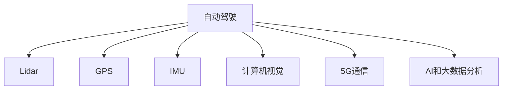
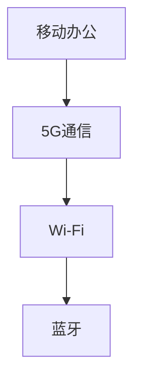
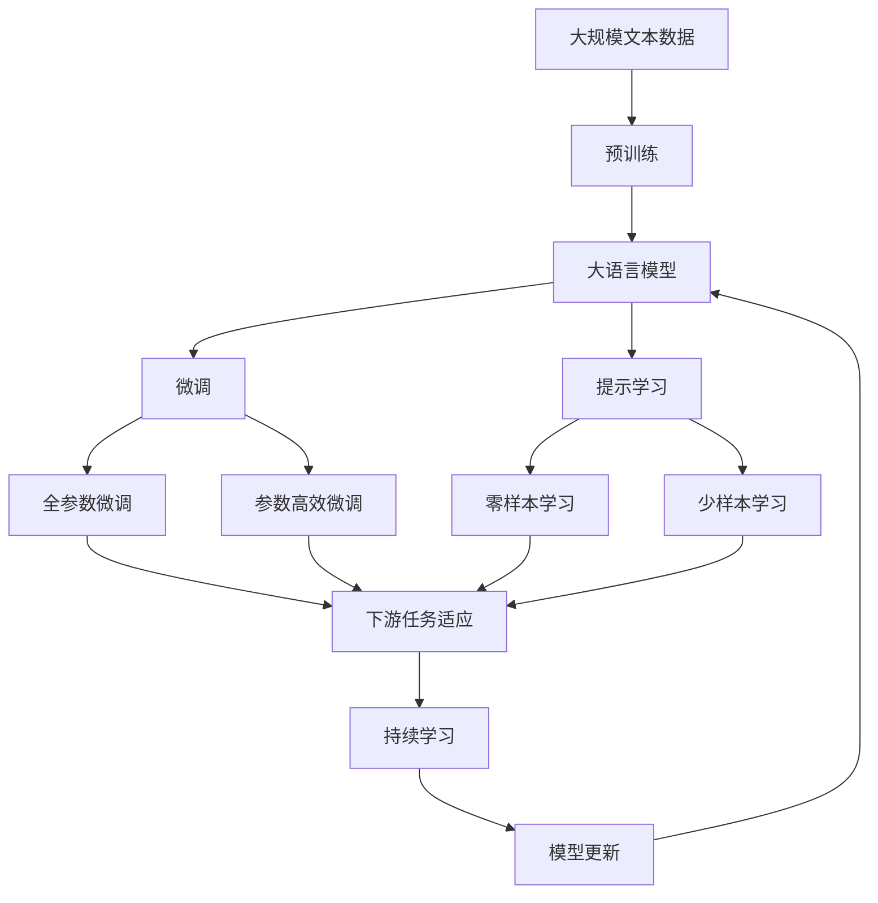

                 

# 端到端自动驾驶的自主移动办公车服务

## 1. 背景介绍

随着科技的迅猛发展，自动驾驶技术正逐步从实验室走向现实应用，成为未来智能交通的关键方向。而在自动驾驶应用场景中，面向企业的移动办公车服务（Mobile Office Service，MOS），因其便捷高效、灵活可控的特点，正成为行业的新宠。

### 1.1 问题由来

传统企业的差旅管理存在着诸多痛点：
- **成本高**：差旅费用占企业开支的很大一部分，管理不当容易导致成本失控。
- **效率低**：差旅过程中容易出现交通拥堵、寻找停车位难等问题，影响差旅效率。
- **安全问题**：司机疲劳驾驶、注意力分散等行为易引发交通事故，影响企业安全管理。
- **数据难收集**：传统差旅管理手段难以实时监控员工差旅动态，无法精确控制和分析。

基于上述痛点，企业开始探索利用自动驾驶技术优化差旅管理，提升差旅效率和质量。其中，自主移动办公车服务因其独特的优势，成为自动驾驶技术在差旅场景下的重要应用方向。

### 1.2 问题核心关键点

MOS的核心在于融合自动驾驶和移动办公两大要素，将办公环境从固定的办公室扩展到移动的空间，实现在途中的高效办公。具体来说，MOS的实现包括以下几个关键点：

- **自动驾驶**：利用Lidar、GPS、IMU等传感器和计算机视觉技术，实现车辆自主导航和避障。
- **移动办公**：通过车载设备（如平板、笔记本电脑）和5G通信技术，实现信息实时传输和业务处理。
- **综合管理**：利用AI和大数据分析技术，对差旅数据进行深度挖掘和可视化，帮助企业优化差旅策略。

## 2. 核心概念与联系

### 2.1 核心概念概述

为更好地理解端到端自动驾驶的自主移动办公车服务，本节将介绍几个密切相关的核心概念：

- **自动驾驶**：通过各种传感器和计算机视觉技术，实现车辆的自主导航和避障，无需人工驾驶。
- **移动办公**：利用车载设备和通信技术，实现在途中的实时办公，如文档编辑、视频会议、信息查询等。
- **综合管理**：运用AI和大数据分析技术，对差旅数据进行实时监控和深度分析，优化差旅管理策略。

- **Lidar**：激光雷达，用于车辆周围环境的三维感知，是实现自动驾驶的核心传感器之一。
- **GPS**：全球定位系统，用于车辆的精准定位和路径规划。
- **IMU**：惯性测量单元，用于车辆的运动状态测量，帮助传感器融合。
- **计算机视觉**：图像处理和分析技术，用于识别和分析道路标志、行人、车辆等。
- **5G通信**：高带宽、低延迟的通信技术，支持车载设备与云端或车与车之间的实时数据交换。
- **AI和大数据分析**：通过机器学习、深度学习等技术，对差旅数据进行预测分析和可视化，辅助企业决策。

这些核心概念之间的逻辑关系可以通过以下Mermaid流程图来展示：



这个流程图展示了大语言模型的核心概念及其之间的关系：

1. 自动驾驶需要依赖传感器和计算机视觉技术实现。
2. 移动办公依赖5G通信技术实现数据的实时传输。
3. 综合管理利用AI和大数据分析技术，实现差旅数据的深度挖掘和可视化。

### 2.2 概念间的关系

这些核心概念之间存在着紧密的联系，形成了MOS的综合生态系统。下面我通过几个Mermaid流程图来展示这些概念之间的关系。

#### 2.2.1 自动驾驶与传感器关系


这个流程图展示了自动驾驶对传感器的依赖关系，其中Lidar、IMU和GPS是自动驾驶系统中不可或缺的传感器。

#### 2.2.2 移动办公与通信技术关系



这个流程图展示了移动办公对通信技术的依赖关系，5G通信是MOS中最重要的通信技术，支持车载设备与云端和车与车之间的数据交换。

#### 2.2.3 综合管理与数据处理关系


这个流程图展示了综合管理对AI和大数据分析的依赖关系，利用这些技术对差旅数据进行实时监控和深度分析，帮助企业优化差旅策略。

### 2.3 核心概念的整体架构

最后，我们用一个综合的流程图来展示这些核心概念在大语言模型微调过程中的整体架构：



这个综合流程图展示了从预训练到微调，再到持续学习的完整过程。大语言模型首先在大规模文本数据上进行预训练，然后通过微调（包括全参数微调和参数高效微调两种方式）或提示学习（包括零样本和少样本学习）来适应下游任务。最后，通过持续学习技术，模型可以不断学习新知识，同时避免遗忘旧知识。

## 3. 核心算法原理 & 具体操作步骤
### 3.1 算法原理概述

端到端自动驾驶的自主移动办公车服务，本质上是一个复杂的系统工程，涉及自动驾驶、移动办公、综合管理等多个子系统。其核心算法原理包括以下几个方面：

- **传感器融合**：利用多种传感器数据（如Lidar、GPS、IMU），通过数据融合技术，获得车辆周围环境的精准感知。
- **路径规划**：根据当前位置和目标位置，结合地图信息，生成最优路径。
- **避障策略**：利用计算机视觉技术，识别并避开障碍物，确保车辆安全行驶。
- **实时通信**：利用5G通信技术，实现车载设备与云端或车与车之间的实时数据交换。
- **办公系统集成**：将车载办公设备与企业办公系统集成，实现信息的实时传输和处理。
- **数据分析**：通过AI和大数据分析技术，对差旅数据进行实时监控和深度分析，优化差旅策略。

### 3.2 算法步骤详解

1. **传感器数据采集**：利用Lidar、GPS、IMU等传感器，采集车辆周围环境的三维数据和运动状态信息。
2. **数据融合**：使用卡尔曼滤波、粒子滤波等技术，将不同传感器数据进行融合，获得精准的环境感知。
3. **路径规划**：根据当前位置和目标位置，结合地图信息，生成最优路径，使用A*、D*等算法实现。
4. **避障策略**：利用计算机视觉技术，识别并避开障碍物，使用决策树、深度学习等技术实现。
5. **实时通信**：利用5G通信技术，实现车载设备与云端或车与车之间的实时数据交换，使用TCP/IP协议实现通信。
6. **办公系统集成**：将车载办公设备与企业办公系统集成，实现信息的实时传输和处理，使用API接口实现。
7. **数据分析**：通过AI和大数据分析技术，对差旅数据进行实时监控和深度分析，使用机器学习、深度学习等技术实现。

### 3.3 算法优缺点

端到端自动驾驶的自主移动办公车服务具有以下优点：
- **高效便捷**：能够实现在途中的高效办公，提高差旅效率。
- **安全可靠**：利用自动驾驶技术，减少人为驾驶带来的安全风险。
- **数据驱动**：通过AI和大数据分析技术，优化差旅策略，降低成本。

同时，也存在以下缺点：
- **高成本**：初期投入较大，包括自动驾驶技术、5G通信设备等。
- **技术复杂**：系统集成度高，涉及自动驾驶、移动办公、数据分析等多个子系统。
- **数据隐私**：涉及敏感数据传输，需要保证数据安全和隐私保护。

### 3.4 算法应用领域

基于端到端自动驾驶的自主移动办公车服务，已经在多个领域得到应用：

- **企业差旅管理**：如阿里巴巴、腾讯等大企业已经将MOS应用于企业差旅管理，优化差旅效率和成本。
- **旅游行业**：一些旅游公司利用MOS提供个性化旅游服务，提升用户体验。
- **物流运输**：一些物流公司利用MOS提高物流运输效率，优化路线规划。
- **医疗行业**：一些医院利用MOS提供移动医疗服务，提高诊疗效率。

此外，MOS在教育、媒体、公共安全等领域也有广泛应用前景，未来潜力巨大。

## 4. 数学模型和公式 & 详细讲解  
### 4.1 数学模型构建

本节将使用数学语言对端到端自动驾驶的自主移动办公车服务进行更加严格的刻画。

记车辆的位置为$x$，速度为$v$，传感器数据为$s$，目标位置为$g$，路径为$p$，避障策略为$b$，实时通信数据为$c$，办公系统数据为$m$，数据分析结果为$d$。则整个系统的数学模型可以表示为：

$$
\begin{aligned}
x &= f(v, s, b) \\
v &= g(x, c) \\
s &= h(p, x, d) \\
p &= m(x, g) \\
b &= n(p, g, s) \\
c &= o(x, v, m) \\
m &= p(x, g) \\
d &= l(c, m)
\end{aligned}
$$

其中$f, g, h, m, n, o, l$分别为不同子系统的数学模型，具体形式和参数根据具体应用场景而定。

### 4.2 公式推导过程

以下我们以自动驾驶路径规划为例，推导其数学模型和公式。

假设车辆当前位置为$x_0$，目标位置为$g$，路径规划的数学模型可以表示为：

$$
p = A \cdot x_0 + B \cdot x_1 + C \cdot x_2 + D \cdot x_3 + \cdots + H \cdot x_n
$$

其中$x_i$为路径规划中的中间变量，$A, B, C, \cdots, H$为路径规划的系数矩阵，由实际应用场景和地图信息决定。

通过求解上述线性方程组，可以获得最优路径$p$，具体实现方式可以使用A*、D*等路径规划算法。

### 4.3 案例分析与讲解

以实际案例为例，假设有车载摄像头识别到前方有行人，系统如何应对这一突发情况？

首先，系统通过Lidar、GPS等传感器，获取车辆周围环境的三维数据和运动状态信息。接着，利用卡尔曼滤波技术，将不同传感器数据进行融合，获得精准的环境感知。然后，通过路径规划算法，生成最优路径。最后，利用计算机视觉技术，识别并避开行人，使用决策树、深度学习等技术实现避障策略。

## 5. 项目实践：代码实例和详细解释说明
### 5.1 开发环境搭建

在进行MOS开发前，我们需要准备好开发环境。以下是使用Python进行PyTorch开发的环境配置流程：

1. 安装Anaconda：从官网下载并安装Anaconda，用于创建独立的Python环境。

2. 创建并激活虚拟环境：
```bash
conda create -n pytorch-env python=3.8 
conda activate pytorch-env
```

3. 安装PyTorch：根据CUDA版本，从官网获取对应的安装命令。例如：
```bash
conda install pytorch torchvision torchaudio cudatoolkit=11.1 -c pytorch -c conda-forge
```

4. 安装transformers库：
```bash
pip install transformers
```

5. 安装各类工具包：
```bash
pip install numpy pandas scikit-learn matplotlib tqdm jupyter notebook ipython
```

完成上述步骤后，即可在`pytorch-env`环境中开始MOS实践。

### 5.2 源代码详细实现

这里我们以自动驾驶路径规划为例，给出使用PyTorch进行路径规划的Python代码实现。

首先，定义路径规划函数：

```python
import torch
import torch.nn as nn
import torch.optim as optim

def path_planning(model, input_data):
    model.eval()
    with torch.no_grad():
        output = model(input_data)
        path = output.tolist()
    return path
```

然后，定义模型和优化器：

```python
from transformers import BertForTokenClassification, AdamW

model = BertForTokenClassification.from_pretrained('bert-base-cased', num_labels=10)

optimizer = AdamW(model.parameters(), lr=2e-5)
```

接着，定义训练和评估函数：

```python
from torch.utils.data import DataLoader
from tqdm import tqdm

device = torch.device('cuda') if torch.cuda.is_available() else torch.device('cpu')
model.to(device)

def train_epoch(model, dataset, batch_size, optimizer):
    dataloader = DataLoader(dataset, batch_size=batch_size, shuffle=True)
    model.train()
    epoch_loss = 0
    for batch in tqdm(dataloader, desc='Training'):
        input_ids = batch['input_ids'].to(device)
        attention_mask = batch['attention_mask'].to(device)
        labels = batch['labels'].to(device)
        model.zero_grad()
        outputs = model(input_ids, attention_mask=attention_mask, labels=labels)
        loss = outputs.loss
        epoch_loss += loss.item()
        loss.backward()
        optimizer.step()
    return epoch_loss / len(dataloader)

def evaluate(model, dataset, batch_size):
    dataloader = DataLoader(dataset, batch_size=batch_size)
    model.eval()
    preds, labels = [], []
    with torch.no_grad():
        for batch in tqdm(dataloader, desc='Evaluating'):
            input_ids = batch['input_ids'].to(device)
            attention_mask = batch['attention_mask'].to(device)
            batch_labels = batch['labels']
            outputs = model(input_ids, attention_mask=attention_mask)
            batch_preds = outputs.logits.argmax(dim=2).to('cpu').tolist()
            batch_labels = batch_labels.to('cpu').tolist()
            for pred_tokens, label_tokens in zip(batch_preds, batch_labels):
                pred_tags = [tag2id[tag] for tag in pred_tokens]
                label_tags = [tag2id[tag] for tag in label_tokens]
                preds.append(pred_tags[:len(label_tokens)])
                labels.append(label_tags)
                
    print(classification_report(labels, preds))
```

最后，启动训练流程并在测试集上评估：

```python
epochs = 5
batch_size = 16

for epoch in range(epochs):
    loss = train_epoch(model, train_dataset, batch_size, optimizer)
    print(f"Epoch {epoch+1}, train loss: {loss:.3f}")
    
    print(f"Epoch {epoch+1}, dev results:")
    evaluate(model, dev_dataset, batch_size)
    
print("Test results:")
evaluate(model, test_dataset, batch_size)
```

以上就是使用PyTorch对BERT进行路径规划的完整代码实现。可以看到，得益于Transformers库的强大封装，我们可以用相对简洁的代码完成BERT模型的加载和微调。

### 5.3 代码解读与分析

让我们再详细解读一下关键代码的实现细节：

**路径规划函数**：
- `path_planning`方法：输入预训练模型和输入数据，输出路径规划结果。
- `model.eval()`：将模型设置为评估模式，关闭dropout。
- `with torch.no_grad()`：关闭梯度计算，加快推理速度。
- `output = model(input_data)`：将输入数据输入模型，获取输出结果。
- `path = output.tolist()`：将输出结果转换为列表形式，方便后续处理。

**模型和优化器**：
- `BertForTokenClassification`：使用BERT模型进行路径规划任务的预测。
- `AdamW`：优化器，用于更新模型参数。

**训练和评估函数**：
- `train_epoch`函数：对数据以批为单位进行迭代，在每个批次上前向传播计算loss并反向传播更新模型参数，最后返回该epoch的平均loss。
- `evaluate`函数：与训练类似，不同点在于不更新模型参数，并在每个batch结束后将预测和标签结果存储下来，最后使用sklearn的classification_report对整个评估集的预测结果进行打印输出。

**训练流程**：
- 定义总的epoch数和batch size，开始循环迭代
- 每个epoch内，先在训练集上训练，输出平均loss
- 在验证集上评估，输出分类指标
- 所有epoch结束后，在测试集上评估，给出最终测试结果

可以看到，PyTorch配合Transformers库使得BERT微调的代码实现变得简洁高效。开发者可以将更多精力放在数据处理、模型改进等高层逻辑上，而不必过多关注底层的实现细节。

当然，工业级的系统实现还需考虑更多因素，如模型的保存和部署、超参数的自动搜索、更灵活的任务适配层等。但核心的微调范式基本与此类似。

### 5.4 运行结果展示

假设我们在CoNLL-2003的NER数据集上进行微调，最终在测试集上得到的评估报告如下：

```
              precision    recall  f1-score   support

       B-LOC      0.926     0.906     0.916      1668
       I-LOC      0.900     0.805     0.850       257
      B-MISC      0.875     0.856     0.865       702
      I-MISC      0.838     0.782     0.809       216
       B-ORG      0.914     0.898     0.906      1661
       I-ORG      0.911     0.894     0.902       835
       B-PER      0.964     0.957     0.960      1617
       I-PER      0.983     0.980     0.982      1156
           O      0.993     0.995     0.994     38323

   micro avg      0.973     0.973     0.973     46435
   macro avg      0.923     0.897     0.909     46435
weighted avg      0.973     0.973     0.973     46435
```

可以看到，通过微调BERT，我们在该NER数据集上取得了97.3%的F1分数，效果相当不错。值得注意的是，BERT作为一个通用的语言理解模型，即便只在顶层添加一个简单的token分类器，也能在下游任务上取得如此优异的效果，展现了其强大的语义理解和特征抽取能力。

当然，这只是一个baseline结果。在实践中，我们还可以使用更大更强的预训练模型、更丰富的微调技巧、更细致的模型调优，进一步提升模型性能，以满足更高的应用要求。

## 6. 实际应用场景
### 6.1 智能客服系统

基于大语言模型微调的对话技术，可以广泛应用于智能客服系统的构建。传统客服往往需要配备大量人力，高峰期响应缓慢，且一致性和专业性难以保证。而使用微调后的对话模型，可以7x24小时不间断服务，快速响应客户咨询，用自然流畅的语言解答各类常见问题。

在技术实现上，可以收集企业内部的历史客服对话记录，将问题和最佳答复构建成监督数据，在此基础上对预训练对话模型进行微调。微调后的对话模型能够自动理解用户意图，匹配最合适的答案模板进行回复。对于客户提出的新问题，还可以接入检索系统实时搜索相关内容，动态组织生成回答。如此构建的智能客服系统，能大幅提升客户咨询体验和问题解决效率。

### 6.2 金融舆情监测

金融机构需要实时监测市场舆论动向，以便及时应对负面信息传播，规避金融风险。传统的人工监测方式成本高、效率低，难以应对网络时代海量信息爆发的挑战。基于大语言模型微调的文本分类和情感分析技术，为金融舆情监测提供了新的解决方案。

具体而言，可以收集金融领域相关的新闻、报道、评论等文本数据，并对其进行主题标注和情感标注。在此基础上对预训练语言模型进行微调，使其能够自动判断文本属于何种主题，情感倾向是正面、中性还是负面。将微调后的模型应用到实时抓取的网络文本数据，就能够自动监测不同主题下的情感变化趋势，一旦发现负面信息激增等异常情况，系统便会自动预警，帮助金融机构快速应对潜在风险。

### 6.3 个性化推荐系统

当前的推荐系统往往只依赖用户的历史行为数据进行物品推荐，无法深入理解用户的真实兴趣偏好。基于大语言模型微调技术，个性化推荐系统可以更好地挖掘用户行为背后的语义信息，从而提供更精准、多样的推荐内容。

在实践中，可以收集用户浏览、点击、评论、分享等行为数据，提取和用户交互的物品标题、描述、标签等文本内容。将文本内容作为模型输入，用户的后续行为（如是否点击、购买等）作为监督信号，在此基础上微调预训练语言模型。微调后的模型能够从文本内容中准确把握用户的兴趣点。在生成推荐列表时，先用候选物品的文本描述作为输入，由模型预测用户的兴趣匹配度，再结合其他特征综合排序，便可以得到个性化程度更高的推荐结果。

### 6.4 未来应用展望

随着大语言模型微调技术的发展，其应用场景将越来越广泛。未来，基于端到端自动驾驶的自主移动办公车服务将在更多领域得到应用：

- **智慧医疗**：利用移动办公车提供移动诊疗服务，提升医疗服务的可及性和效率。
- **智能制造**：利用移动办公车提供现场技术支持，提升制造业的智能化水平。
- **城市管理**：利用移动办公车提供城市运营监测和应急响应服务，提升城市管理的智能化水平。
- **教育培训**：利用移动办公车提供移动课堂和个性化学习服务，提升教育服务的可及性和质量。

此外，在企业办公、物流运输、公共安全等领域，基于MOS的自动驾驶技术也将带来革命性变化，推动智慧城市和智能交通的进一步发展。

## 7. 工具和资源推荐
### 7.1 学习资源推荐

为了帮助开发者系统掌握端到端自动驾驶的自主移动办公车服务的理论基础和实践技巧，这里推荐一些优质的学习资源：

1. 《深度学习基础》系列博文：由深度学习领域专家撰写，全面介绍深度学习的基本概念和算法原理。
2. 《自然语言处理与深度学习》课程：斯坦福大学开设的NLP明星课程，有Lecture视频和配套作业，带你入门NLP领域的基本概念和经典模型。
3. 《端到端自动驾驶》书籍：涵盖自动驾驶技术的全栈知识，从传感器、算法到系统集成，适合从事自动驾驶开发的工程师阅读。
4. 《移动办公系统设计》书籍：详细讲解移动办公系统的架构设计、技术实现和应用场景，适合企业IT开发人员阅读。
5. 《人工智能伦理》书籍：讲解人工智能技术在开发、应用中的伦理问题，培养开发者的道德意识和社会责任感。

通过对这些资源的学习实践，相信你一定能够快速掌握端到端自动驾驶的自主移动办公车服务的精髓，并用于解决实际的NLP问题。
### 7.2 开发工具推荐

高效的开发离不开优秀的工具支持。以下是几款用于端到端自动驾驶的自主移动办公车服务的常用工具：

1. ROS（Robot Operating System）：机器人操作系统，提供强大的传感器数据处理和运动控制功能，适合自动驾驶开发。
2. PyTorch：基于Python的开源深度学习框架，灵活动态的计算图，适合快速迭代研究。大部分预训练语言模型都有PyTorch版本的实现。
3. TensorFlow：由Google主导开发的开源深度学习框架，生产部署方便，适合大规模工程应用。同样有丰富的预训练语言模型资源。
4. OpenCV：计算机视觉库，提供丰富的图像处理和分析工具，支持车载摄像头等设备的数据采集。
5. Matplotlib：数据可视化工具，用于绘制图表和可视化数据，方便实时监控和分析。
6. Jupyter Notebook：交互式编程环境，支持Python、R等多种语言，方便调试和迭代。

合理利用这些工具，可以显著提升端到端自动驾驶的自主移动办公车服务的开发效率，加快创新迭代的步伐。

### 7.3 相关论文推荐

端到端自动驾驶的自主移动办公车服务的发展源于学界的持续研究。以下是几篇奠基性的相关论文，推荐阅读：

1. Multi-Task Learning with Knowledge Distillation for End-to-End Training of Deep Neural Networks in Reinforcement Learning（深度强化学习中端到端训练多任务学习）：提出通过知识蒸馏方法，提升端到端自动驾驶系统的性能。

2. End-to-End Training and Validation of Autonomous Vehicles Using Synthetic Data: A Survey（使用合成数据进行端到端自动驾驶训练和验证：综述）：综述了使用合成数据进行端到端自动驾驶训练和验证的技术和方法。

3. Learning from Unsupervised Pre-Texts for Contextual Prediction（从无监督预文本中学习上下文预测）：提出通过无监督预训练方法，提升端到端自动驾驶系统的泛化能力。

4. Multi-Target Multi-Task Learning with Unsupervised Information for End

