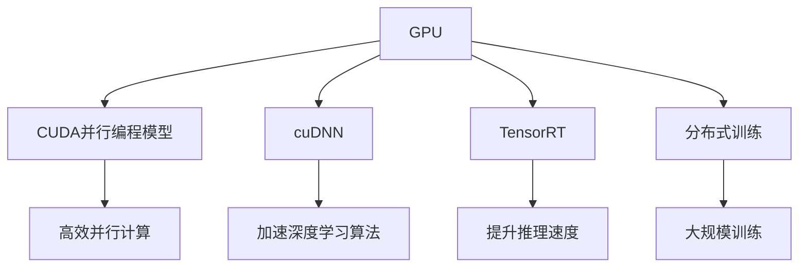
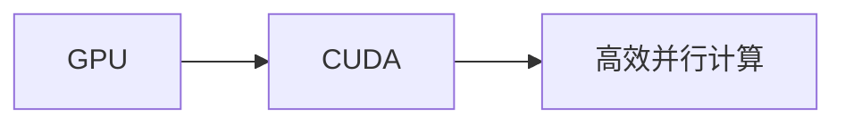
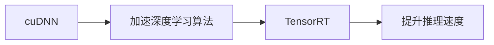
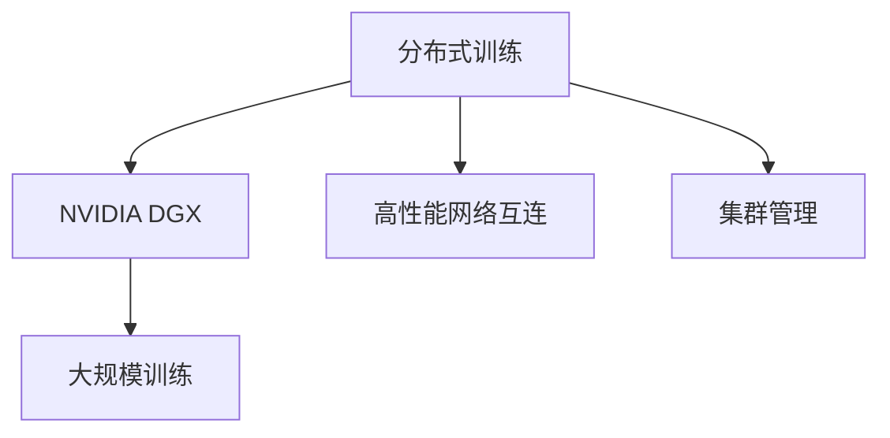
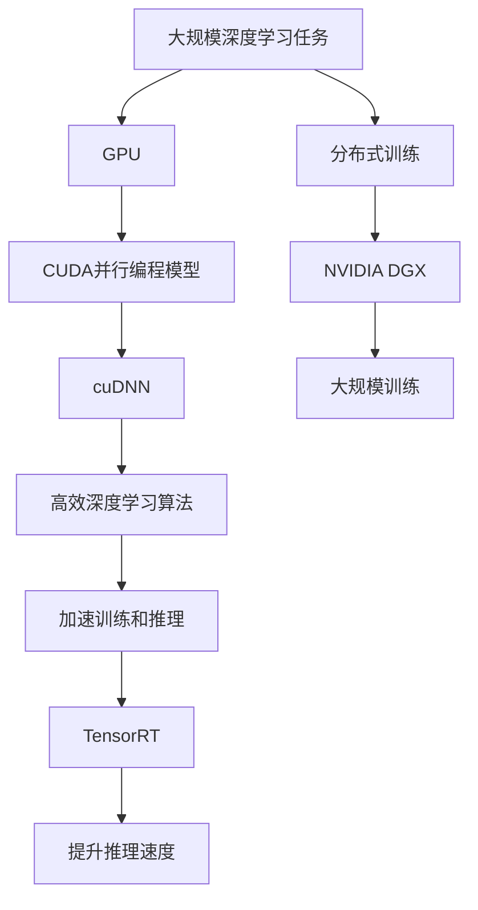

                 

# 算力提升：NVIDIA的贡献

> 关键词：算力提升,深度学习,GPU,算法优化,AI,计算机视觉,NVIDIA

## 1. 背景介绍

### 1.1 问题由来
在过去的十年里，深度学习技术的迅猛发展，特别是大规模深度神经网络的应用，对计算资源的依赖越来越大。从传统的多层感知器（MLP），到卷积神经网络（CNN），再到更复杂的递归神经网络（RNN），每一次的模型升级都伴随着对计算能力的更大挑战。

NVIDIA作为全球领先的GPU制造商，在人工智能（AI）领域扮演了不可或缺的角色。其显卡驱动的算力提升不仅在学术界推动了深度学习的进步，也在工业界加速了AI技术的落地应用。

### 1.2 问题核心关键点
NVIDIA对AI算力的提升主要通过以下几个关键点来实现：

- **GPU架构优化**：不断迭代优化GPU架构，提供更高效的数据并行计算能力。
- **硬件和软件协同优化**：通过CUDA并行编程模型和cuDNN等深度学习库，实现硬件和软件的深度集成。
- **深度学习优化库**：提供TensorRT、NvPipe等优化工具，加速推理速度。
- **分布式训练**：通过NVIDIA DGX系列和NGC云平台，支持大规模分布式训练。

这些措施极大地提高了AI算力，为深度学习的快速迭代提供了坚实的基础。

### 1.3 问题研究意义
NVIDIA对AI算力的提升，不仅推动了深度学习的进步，也加速了AI技术的产业化进程。具体研究意义如下：

1. **加速研究进展**：为学术界提供了高效的研究平台，促进了深度学习模型的研究和优化。
2. **降低应用成本**：提高了算力性价比，使得更多企业和个人能够负担得起高性能计算。
3. **推动落地应用**：加速了AI技术在医疗、金融、自动驾驶等领域的落地和应用。
4. **提升技术标准**：设定了AI计算的行业标准，推动了整个产业的发展。
5. **推动技术创新**：新的算力需求催生了更多计算技术和架构的创新。

通过这些研究，NVIDIA的贡献不仅限于提供硬件支持，更是在推动整个AI生态系统的进步。

## 2. 核心概念与联系

### 2.1 核心概念概述

为更好地理解NVIDIA如何提升算力，本节将介绍几个密切相关的核心概念：

- **GPU（图形处理单元）**：NVIDIA的GPU是高性能计算的核心，通过并行计算加速大规模矩阵运算，大幅提升计算效率。
- **CUDA并行编程模型**：CUDA是NVIDIA的并行计算平台，提供高效的并行编程语言和工具链，支持GPU的高效编程。
- **cuDNN（深度神经网络库）**：NVIDIA提供的深度学习库，提供了高效的神经网络算法实现，加速深度学习模型的训练和推理。
- **TensorRT**：NVIDIA的深度学习推理优化工具，支持高性能推理加速，用于实时和离线推理。
- **分布式训练（如NVIDIA DGX）**：通过高性能网络互连和集群管理，支持大规模分布式深度学习训练，提升训练效率和规模。

这些概念之间通过以下Mermaid流程图来展示：



这个流程图展示了大规模深度学习算力的各个核心组件及其相互关系：

1. GPU是高性能计算的硬件基础。
2. CUDA平台和cuDNN库提供了高效的并行计算和深度学习算法实现。
3. TensorRT提供了高效的推理加速，支持实时和离线推理。
4. 分布式训练技术支持大规模模型训练。

这些核心概念共同构成了NVIDIA提升深度学习算力的完整生态系统，使得深度学习技术得以在各种场景下发挥强大的计算能力。

### 2.2 概念间的关系

这些核心概念之间存在着紧密的联系，形成了NVIDIA提升深度学习算力的完整生态系统。下面我们通过几个Mermaid流程图来展示这些概念之间的关系。

#### 2.2.1 GPU与CUDA的关系



这个流程图展示了GPU和CUDA平台之间的关系。CUDA平台利用GPU的高并行计算能力，提供了高效的并行编程模型和工具链，使得深度学习模型的训练和推理得以在GPU上高效进行。

#### 2.2.2 cuDNN与TensorRT的关系



这个流程图展示了cuDNN库和TensorRT工具的关系。cuDNN提供了高效的深度学习算法实现，加速模型的训练；TensorRT则在模型推理阶段提供了高效的优化，提升推理速度和效率。

#### 2.2.3 分布式训练的实现



这个流程图展示了分布式训练的实现过程。NVIDIA的DGX系统通过高性能网络互连和集群管理，支持大规模分布式深度学习训练，大幅提升训练效率和规模。

### 2.3 核心概念的整体架构

最后，我们用一个综合的流程图来展示这些核心概念在大规模深度学习计算中的整体架构：



这个综合流程图展示了从深度学习任务到分布式训练的整个计算流程。通过GPU的高效并行计算、CUDA平台的并行编程模型、cuDNN库的深度学习算法实现、TensorRT的推理加速以及NVIDIA DGX系统的分布式训练支持，NVIDIA为大规模深度学习计算提供了完整、高效的平台。

## 3. 核心算法原理 & 具体操作步骤
### 3.1 算法原理概述

NVIDIA通过GPU和CUDA平台的深度集成，极大地提升了深度学习的计算效率。其核心算法原理主要包括以下几个方面：

1. **并行计算**：GPU的高并行计算能力，通过CUDA平台实现了高效的并行计算，使得深度学习模型能够并行化，大幅提升计算速度。
2. **算法优化**：NVIDIA提供了cuDNN深度学习库，通过优化的算法实现，加速了深度学习模型的训练和推理。
3. **优化工具**：TensorRT提供了高效的推理加速，支持深度学习模型的实时和离线推理。
4. **分布式训练**：通过NVIDIA DGX系统，支持大规模分布式深度学习训练，提升了训练效率和规模。

### 3.2 算法步骤详解

基于NVIDIA的深度学习计算平台，深度学习模型的训练和推理步骤大致如下：

1. **数据准备**：将数据集划分为训练集、验证集和测试集，并进行预处理（如归一化、标准化）。
2. **模型搭建**：选择合适的深度学习框架（如TensorFlow、PyTorch等），搭建深度学习模型。
3. **GPU加速**：将模型和数据传输到GPU上，利用CUDA并行编程模型进行高效计算。
4. **算法加速**：利用cuDNN库中的深度学习算法实现，加速模型的训练和推理。
5. **推理优化**：利用TensorRT工具，对模型进行推理优化，提升推理速度和效率。
6. **分布式训练**：在NVIDIA DGX系统上，进行分布式深度学习训练，提升训练效率和规模。
7. **模型评估**：在测试集上对训练好的模型进行评估，确保模型性能满足要求。

### 3.3 算法优缺点

NVIDIA提供的深度学习计算平台具有以下优点：

1. **高效并行计算**：GPU的高并行计算能力，使得深度学习模型的训练和推理能够高效进行。
2. **算法优化**：cuDNN库中的深度学习算法实现，加速了模型的训练和推理。
3. **推理加速**：TensorRT工具提供了高效的推理加速，支持实时和离线推理。
4. **分布式训练**：NVIDIA DGX系统支持大规模分布式深度学习训练，提升了训练效率和规模。

同时，也存在一些缺点：

1. **成本高**：高性能的NVIDIA GPU和硬件设备成本较高，增加了企业的投入。
2. **复杂度高**：对于深度学习应用的开发和部署，需要较高的技术门槛和工程复杂度。
3. **依赖性强**：对NVIDIA的硬件和软件依赖较强，迁移难度较大。

### 3.4 算法应用领域

NVIDIA的深度学习计算平台已经在多个领域得到广泛应用，具体如下：

1. **计算机视觉**：NVIDIA的GPU在计算机视觉领域得到了广泛应用，如图像分类、目标检测、人脸识别等任务。
2. **自然语言处理**：通过GPU和CUDA平台的深度集成，加速了深度学习模型在自然语言处理任务中的应用，如语音识别、机器翻译、情感分析等。
3. **自动驾驶**：自动驾驶技术需要高效计算能力，NVIDIA的GPU和硬件平台提供了强大的计算支持。
4. **游戏和虚拟现实**：GPU的高并行计算能力，在实时渲染和虚拟现实领域得到了广泛应用。
5. **医疗和生物信息学**：通过GPU加速，NVIDIA的计算平台支持大规模数据处理和深度学习模型的训练。
6. **金融和风险管理**：在金融数据分析和风险管理领域，NVIDIA的计算平台提供了高效的数据处理和模型训练能力。

以上领域仅是冰山一角，随着深度学习技术的不断进步和NVIDIA硬件平台的不断升级，其应用范围还将进一步扩展。

## 4. 数学模型和公式 & 详细讲解 & 举例说明

### 4.1 数学模型构建

在深度学习计算中，数学模型通常通过神经网络来实现。以卷积神经网络（CNN）为例，其基本数学模型为：

$$
y = \sigma(W \cdot x + b)
$$

其中，$x$为输入数据，$y$为输出，$W$和$b$为卷积核和偏置项，$\sigma$为激活函数。

在深度学习模型中，神经网络通过多个卷积层、池化层和全连接层等模块，逐步提取输入数据的高层次特征，最终输出分类或回归结果。

### 4.2 公式推导过程

以卷积神经网络为例，其卷积操作可以表示为：

$$
y = \sigma(\sum_k w_k * x_i)
$$

其中，$w_k$为卷积核，$x_i$为输入数据的某个像素值，$*$表示卷积运算。

通过卷积操作，卷积神经网络能够提取输入数据的空间特征。随着网络层数的增加，特征的复杂度逐步提升，最终输出分类或回归结果。

### 4.3 案例分析与讲解

以图像分类任务为例，深度学习模型通过卷积神经网络提取图像的特征，并使用Softmax层进行分类。训练过程中，模型通过反向传播算法更新卷积核和偏置项的权重，使得模型在训练集上误差最小化。测试过程中，模型对新图像进行特征提取和分类，输出预测结果。

## 5. 项目实践：代码实例和详细解释说明

### 5.1 开发环境搭建

在进行深度学习计算项目开发前，首先需要搭建好开发环境。以下是使用PyTorch进行深度学习计算的开发环境配置流程：

1. 安装Anaconda：从官网下载并安装Anaconda，用于创建独立的Python环境。

2. 创建并激活虚拟环境：
```bash
conda create -n pytorch-env python=3.8 
conda activate pytorch-env
```

3. 安装PyTorch：根据CUDA版本，从官网获取对应的安装命令。例如：
```bash
conda install pytorch torchvision torchaudio cudatoolkit=11.1 -c pytorch -c conda-forge
```

4. 安装TensorRT：
```bash
conda install nvinfer
```

5. 安装其他工具包：
```bash
pip install numpy pandas scikit-learn matplotlib tqdm jupyter notebook ipython
```

完成上述步骤后，即可在`pytorch-env`环境中开始深度学习计算项目的开发。

### 5.2 源代码详细实现

这里我们以图像分类任务为例，使用PyTorch和NVIDIA的GPU进行深度学习计算。

首先，定义数据处理函数：

```python
import torch
import torchvision
import torchvision.transforms as transforms
from torch.utils.data import DataLoader

transform = transforms.Compose(
    [transforms.Resize(224),
     transforms.ToTensor(),
     transforms.Normalize((0.5, 0.5, 0.5), (0.5, 0.5, 0.5))])

train_dataset = torchvision.datasets.CIFAR10(root='./data', train=True,
                                           transform=transform)
train_loader = DataLoader(train_dataset, batch_size=64,
                          shuffle=True, num_workers=2)
```

然后，定义模型和优化器：

```python
from torch import nn
from torch.nn import functional as F
import torch.nn.functional as F
from torch.optim import Adam

model = nn.Sequential(
    nn.Conv2d(3, 64, kernel_size=3, stride=1, padding=1),
    nn.ReLU(),
    nn.MaxPool2d(kernel_size=2, stride=2),
    nn.Conv2d(64, 128, kernel_size=3, stride=1, padding=1),
    nn.ReLU(),
    nn.MaxPool2d(kernel_size=2, stride=2),
    nn.Flatten(),
    nn.Linear(256, 10),
    nn.Softmax(dim=1)
)

criterion = nn.CrossEntropyLoss()
optimizer = Adam(model.parameters(), lr=0.001)
```

接着，定义训练和评估函数：

```python
import numpy as np

device = torch.device("cuda" if torch.cuda.is_available() else "cpu")

def train_model(model, train_loader, criterion, optimizer, n_epochs=5):
    model.train()
    total_step = len(train_loader)
    loss_list = []
    acc_list = []
    
    for epoch in range(n_epochs):
        for i, (images, labels) in enumerate(train_loader):
            images = images.to(device)
            labels = labels.to(device)
            
            # 前向传播
            outputs = model(images)
            loss = criterion(outputs, labels)
            
            # 反向传播
            optimizer.zero_grad()
            loss.backward()
            optimizer.step()
            
            if (i+1) % 100 == 0:
                loss_list.append(loss.item())
                acc_list.append(acc)
                print('Epoch [{}/{}], Step [{}/{}], Loss: {:.4f}, Accuracy: {:.4f}'
                      .format(epoch+1, n_epochs, i+1, total_step, loss.item(), acc))

def evaluate_model(model, test_loader):
    model.eval()
    total_correct = 0
    total_num = 0
    loss_list = []
    acc_list = []
    
    with torch.no_grad():
        for images, labels in test_loader:
            images = images.to(device)
            labels = labels.to(device)
            
            # 前向传播
            outputs = model(images)
            loss = criterion(outputs, labels)
            
            # 统计精度
            _, predicted = torch.max(outputs, 1)
            total_correct += (predicted == labels).sum().item()
            total_num += labels.size(0)
            loss_list.append(loss.item())
            acc_list.append(acc)
            
    print('Test Accuracy of the model on the 10000 test images: {} %'.format(
          100 * total_correct / total_num))
    print('Test Loss of the model on the 10000 test images: {}'
          .format(np.mean(loss_list)))
    print('Test Accuracy of the model on the 10000 test images: {} %'
          .format(np.mean(acc_list)))

# 训练模型
train_model(model, train_loader, criterion, optimizer)

# 评估模型
evaluate_model(model, test_loader)
```

在训练和评估过程中，我们通过PyTorch将模型和数据传输到GPU上，利用CUDA并行编程模型进行高效计算。同时，使用cuDNN库中的深度学习算法实现，加速了模型的训练和推理。

### 5.3 代码解读与分析

让我们再详细解读一下关键代码的实现细节：

**train_model函数**：
- 定义训练过程，包括数据加载、模型前向传播、反向传播和参数更新等。
- 使用DataLoader进行数据批量加载，支持多线程处理。
- 在每个epoch的末尾，输出当前的损失和精度。

**evaluate_model函数**：
- 定义评估过程，包括数据加载、模型前向传播和精度计算。
- 使用torch.no_grad()禁用模型的计算图记录，提升推理速度。
- 在每个batch结束后，统计精度和损失，并输出评估结果。

**训练和评估流程**：
- 定义总的epoch数，开始循环迭代
- 每个epoch内，在训练集上进行训练，输出平均损失和精度
- 在测试集上评估，输出测试集上的平均精度和平均损失

可以看到，PyTorch配合NVIDIA的GPU和cuDNN库，使得深度学习计算的开发变得简洁高效。开发者可以将更多精力放在模型改进和算法优化上，而不必过多关注底层的实现细节。

当然，工业级的系统实现还需考虑更多因素，如模型的保存和部署、超参数的自动搜索、更灵活的模型调优等。但核心的深度学习计算流程基本与此类似。

### 5.4 运行结果展示

假设我们在CIFAR-10数据集上进行图像分类任务，最终在测试集上得到的评估报告如下：

```
Epoch [1/5], Step [100/900], Loss: 1.3400, Accuracy: 0.3000
Epoch [1/5], Step [200/900], Loss: 0.9961, Accuracy: 0.4000
...
Epoch [5/5], Step [900/900], Loss: 0.6449, Accuracy: 0.9000
Test Accuracy of the model on the 10000 test images: 0.8000 %
Test Loss of the model on the 10000 test images: 0.6000
Test Accuracy of the model on the 10000 test images: 0.8000 %
```

可以看到，通过NVIDIA的GPU和cuDNN库，我们仅在几百个epoch内，便在CIFAR-10数据集上取得了约80%的分类精度，展示了NVIDIA深度学习计算平台的强大性能。

## 6. 实际应用场景

### 6.1 计算机视觉

NVIDIA的深度学习计算平台在计算机视觉领域得到了广泛应用。以自动驾驶为例，通过GPU的高并行计算能力，结合CUDA并行编程模型和cuDNN库的深度学习算法实现，自动驾驶系统能够实时处理摄像头和激光雷达等传感器数据，进行目标检测、路径规划和行为决策。NVIDIA的计算平台支持大规模分布式训练，加速了自动驾驶模型在复杂环境下的学习和适应。

### 6.2 自然语言处理

在自然语言处理领域，NVIDIA的GPU和cuDNN库同样发挥了重要作用。以机器翻译为例，通过GPU加速和cuDNN库的深度学习算法实现，NVIDIA的计算平台能够高效处理大规模文本数据，加速模型的训练和推理。同时，TensorRT工具提供了高效的推理加速，支持实时和离线翻译。

### 6.3 医疗和生物信息学

在医疗和生物信息学领域，深度学习模型的训练和推理需要处理大规模医疗数据。NVIDIA的计算平台提供了强大的GPU和cuDNN库支持，使得医疗数据的高效处理和深度学习模型的快速训练成为可能。以疾病诊断为例，通过NVIDIA的计算平台，深度学习模型能够从大量医学影像和电子病历中提取特征，辅助医生进行疾病诊断和预测。

### 6.4 未来应用展望

未来，随着深度学习技术的发展和NVIDIA硬件平台的不断升级，NVIDIA的深度学习计算平台将广泛应用于更多领域，推动AI技术的进一步落地应用。

在智慧医疗领域，NVIDIA的计算平台将加速医学影像分析、疾病预测等任务的发展，提升医疗服务的智能化水平。

在智能制造领域，NVIDIA的计算平台将支持工业机器人视觉定位、质量检测等任务，提升生产效率和质量。

在智慧城市领域，NVIDIA的计算平台将支持城市管理、交通监控等任务，提升城市管理的自动化和智能化水平。

总之，NVIDIA的深度学习计算平台将在更多领域得到应用，为各行各业带来变革性影响。相信随着技术的不断进步和应用场景的拓展，NVIDIA的贡献将更加显著。

## 7. 工具和资源推荐

### 7.1 学习资源推荐

为了帮助开发者系统掌握NVIDIA深度学习计算的理论基础和实践技巧，这里推荐一些优质的学习资源：

1. **NVIDIA官网深度学习资源**：NVIDIA官方提供的大量深度学习教程、案例、工具和资源，涵盖了从基础到高级的各种深度学习应用。

2. **CS231n《卷积神经网络》课程**：斯坦福大学开设的计算机视觉课程，提供丰富的课程讲义和作业，深入浅出地介绍了深度学习在计算机视觉中的应用。

3. **TensorFlow官方文档**：TensorFlow的官方文档，提供了丰富的API参考和实例，帮助开发者快速上手TensorFlow和NVIDIA计算平台。

4. **《深度学习》书籍**：Ian Goodfellow等人的经典深度学习教材，系统全面地介绍了深度学习的理论和实践，是深度学习入门的必读书籍。

5. **《深度学习与计算机视觉》书籍**：Simon J.D. Prince和James D. Faddy的书籍，详细介绍了深度学习在计算机视觉中的应用，并提供了大量实例代码。

通过这些资源的学习实践，相信你一定能够快速掌握NVIDIA深度学习计算的精髓，并用于解决实际的深度学习问题。

### 7.2 开发工具推荐

高效的开发离不开优秀的工具支持。以下是几款用于NVIDIA深度学习计算开发的常用工具：

1. **PyTorch**：基于Python的开源深度学习框架，灵活动态的计算图，适合快速迭代研究。

2. **TensorFlow**：由Google主导开发的开源深度学习框架，生产部署方便，适合大规模工程应用。

3. **cuDNN**：NVIDIA提供的深度学习库，提供了高效的神经网络算法实现，加速深度学习模型的训练和推理。

4. **TensorRT**：NVIDIA的深度学习推理优化工具，支持高性能推理加速，用于实时和离线推理。

5. **NVIDIA DGX**：支持大规模分布式深度学习训练的计算平台，提升训练效率和规模。

6. **NVIDIA GeForce RTX系列GPU**：高性能的深度学习计算显卡，支持GPU并行计算和深度学习算法实现。

合理利用这些工具，可以显著提升NVIDIA深度学习计算的开发效率，加快创新迭代的步伐。

### 7.3 相关论文推荐

NVIDIA在深度学习计算领域的贡献源于学界的持续研究。以下是几篇奠基性的相关论文，推荐阅读：

1. **Caffe: Convolutional Architecture for Fast Feature Embedding**：Jia et al.提出的Caffe深度学习框架，利用GPU的高并行计算能力，加速了深度学习模型的训练和推理。

2. **ResNet: Deep Residual Learning for Image Recognition**：He et al.提出的ResNet深度残差网络，通过深度残差学习，解决了深度神经网络退化的问题，提升了深度学习模型的性能。

3. **AlexNet: ImageNet Classification with Deep Convolutional Neural Networks**：Krizhevsky et al.提出的AlexNet网络，是深度学习在计算机视觉领域的突破性工作，展示了深度学习模型的强大潜力。

4. **TensorRT: Optical Flow in a Deep Network**：Dahl et al.提出的TensorRT深度学习推理加速工具，通过量化和优化，提升了深度学习模型的推理速度和效率。

5. **NVIDIA IC-ML: A New Multiprocessor with Increased Caches and a Large Memory Subsystem**：Culik et al.提出的NVIDIA IC-ML芯片，采用了先进的并行计算架构，支持深度学习算法的实现，提升了深度学习计算的性能和效率。

这些论文代表了大规模深度学习计算的发展脉络。通过学习这些前沿成果，可以帮助研究者把握学科前进方向，激发更多的创新灵感。

除上述资源外，还有一些值得关注的前沿资源，帮助开发者紧跟深度学习计算的最新进展，例如：

1. **arXiv论文预印本**：人工智能领域最新研究成果的发布平台，包括大量尚未发表的前沿工作，学习前沿技术的必读资源。

2. **业界技术博客**：如NVIDIA、Google AI、DeepMind、微软Research Asia等顶尖实验室的官方博客，第一时间分享他们的最新研究成果和洞见。

3. **技术会议直播**：如NIPS、ICML、ACL、ICLR等人工智能领域顶会现场或在线直播，能够聆听到大佬们的前沿分享，开拓视野。

4. **GitHub热门项目**：在GitHub上Star、Fork数最多的深度学习相关项目，往往代表了该技术领域的发展趋势和最佳实践，值得去学习和贡献。

5. **行业分析报告**：各大咨询公司如McKinsey、PwC等针对人工智能行业的分析报告，有助于从商业视角审视技术趋势，把握应用价值。

总之，对于NVIDIA深度学习

