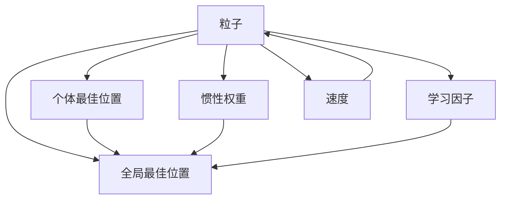

                 

# 粒子群算法(Particle Swarm Optimization) - 原理与代码实例讲解

> 关键词：粒子群算法,PSO,优化算法,群智能,复杂度分析,收敛性分析,代码实现,求解非线性优化问题

## 1. 背景介绍

在现代社会，优化问题无所不在，从最简单的数学函数最小化，到工业生产、金融投资、交通规划、物流调度的复杂优化问题，都需要有效的算法来解决。为了应对各种类型的优化问题，研究者们提出并发展了众多的优化算法，如梯度下降、模拟退火、遗传算法等。其中，粒子群算法（Particle Swarm Optimization，简称PSO）是一种基于群体智能（Swarm Intelligence）的优化算法，因其简单、高效、鲁棒性强，广泛应用于各类优化问题的求解。

### 1.1 问题的由来
粒子群算法是由Eberhart和Kennedy在1995年提出的，灵感来自于鸟类或鱼类的群体行为。在自然界中，这些生物通过协作和适应性行为，能够以高效的方式觅食、导航和避障。而粒子群算法借鉴了这种群体智能的策略，通过模拟这种群体行为，在计算机上高效求解各种优化问题。

### 1.2 问题的核心关键点
粒子群算法是一种群体优化算法，它通过模拟鸟群或鱼群的社会交互行为来寻找最优解。具体而言，粒子群算法维护一个由多个粒子（Particle）组成的群体，每个粒子代表一个解，每个粒子通过不断更新自身的位置来寻找更优的解。粒子的更新过程包括两个主要操作：

1. **个体更新**：每个粒子根据自身的速度和位置，更新到新的位置。
2. **群体更新**：每个粒子根据自身的最佳位置和群体中的全局最优位置，更新到新的位置。

通过这种群体行为，粒子群算法能够跳出局部最优解，探索更广泛的解空间，最终寻找到全局最优解。

## 2. 核心概念与联系

### 2.1 核心概念概述

为了更好地理解粒子群算法的原理，本节将介绍几个密切相关的核心概念：

- **粒子(Particle)**：代表一个解，即当前问题的候选解，由其位置和速度两部分组成。
- **个体最佳位置(PBest)**：指粒子在历史中达到的最优位置。
- **全局最佳位置(GBest)**：指整个群体达到的最优位置。
- **惯性权重(Weight)**：控制粒子惯性的一个参数，在更新过程中影响粒子的运动方向。
- **学习因子(Cognitive Parameter)和(Social Parameter)**：控制个体学习自身历史和群体历史的经验。
- **速度(Velocity)**：决定粒子在每次迭代中移动的距离，影响搜索的精度和效率。

这些核心概念共同构成了粒子群算法的优化范式，通过模拟群体行为，动态调整粒子的位置和速度，搜索解空间。

### 2.2 概念间的关系

这些核心概念之间的逻辑关系可以通过以下Mermaid流程图来展示：



这个流程图展示了粒子群算法中的核心概念及其相互关系：

1. 粒子通过个体最佳位置和全局最佳位置更新自身位置。
2. 惯性权重、学习因子、速度共同影响粒子的更新过程。
3. 全局最佳位置是整个群体中粒子的最佳位置。
4. 个体最佳位置和全局最佳位置一起指导粒子的更新方向。

通过这些概念，我们可以更好地把握粒子群算法的优化机制，理解其工作原理和优化策略。

## 3. 核心算法原理 & 具体操作步骤
### 3.1 算法原理概述

粒子群算法的核心思想是模拟群体行为，通过多个粒子之间的交互，寻找全局最优解。其优化原理可以归纳为以下几个步骤：

1. **初始化粒子群**：随机初始化群体的每个粒子，包括其位置和速度。
2. **更新粒子位置**：根据当前粒子的位置、速度以及个体和群体中的最优位置，动态更新粒子的位置。
3. **评估适应度**：计算每个粒子的适应度值，即其目标函数值。
4. **选择最优位置**：更新个体最佳位置和全局最佳位置。
5. **迭代**：重复步骤2至4，直至满足停止条件。

通过这种迭代过程，粒子群算法能够逐步逼近全局最优解，最终得到问题的高质量解。

### 3.2 算法步骤详解

以下是粒子群算法的详细操作步骤，包括算法流程的每个步骤及其参数说明：

1. **初始化粒子群**：

   - 随机生成 $N$ 个粒子，每个粒子由其位置 $x_i$ 和速度 $v_i$ 组成。
   - 初始化每个粒子的个体最佳位置 $p_i$ 和群体最佳位置 $g_i$。

   代码实现如下：

   ```python
   N = 10  # 粒子个数
   D = 3   # 维数
   x = np.random.rand(N, D)  # 初始位置
   v = np.random.rand(N, D)  # 初始速度
   pbest = np.copy(x)
   gbest = np.copy(x[0])
   ```

2. **更新粒子位置**：

   - 对于每个粒子，根据当前位置 $x_i$ 和速度 $v_i$，以及个体最佳位置 $p_i$ 和全局最佳位置 $g_i$，动态更新其位置。
   
   更新公式如下：

   $$
   v_i = w \cdot v_i + c_1 \cdot r_1 \cdot (p_i - x_i) + c_2 \cdot r_2 \cdot (g_i - x_i)
   $$

   $$
   x_i = x_i + v_i
   $$

   其中 $w$ 是惯性权重，$c_1$ 和 $c_2$ 是学习因子，$r_1$ 和 $r_2$ 是随机数，取值范围为 $[0, 1]$。

   代码实现如下：

   ```python
   w = 0.5  # 惯性权重
   c1 = 1.5
   c2 = 0.3
   r1 = np.random.rand(N, D)
   r2 = np.random.rand(N, D)
   
   v = w * v + c1 * r1 * (pbest - x) + c2 * r2 * (gbest - x)
   x = x + v
   ```

3. **评估适应度**：

   - 计算每个粒子的适应度值，即目标函数值。
   
   代码实现如下：

   ```python
   def eval_fitness(x):
       # 目标函数
       return np.sum(x**2)
   
   f = eval_fitness(x)
   ```

4. **选择最优位置**：

   - 更新每个粒子的个体最佳位置 $p_i$ 和群体最佳位置 $g_i$。
   
   代码实现如下：

   ```python
   pbest = np.minimum(pbest, x)
   gbest = np.minimum(gbest, x[0])
   ```

5. **迭代**：

   - 重复步骤2至4，直至满足停止条件，如达到最大迭代次数或个体最佳位置和群体最佳位置收敛。

   代码实现如下：

   ```python
   max_iter = 100
   for i in range(max_iter):
       # 更新粒子位置
       v = w * v + c1 * r1 * (pbest - x) + c2 * r2 * (gbest - x)
       x = x + v
   
       # 评估适应度
       f = eval_fitness(x)
   
       # 选择最优位置
       pbest = np.minimum(pbest, x)
       gbest = np.minimum(gbest, x[0])
   
   # 输出结果
   print(f"全局最佳位置: {gbest}")
   print(f"个体最佳位置: {pbest}")
   ```

### 3.3 算法优缺点

粒子群算法具有以下优点：

1. **简单高效**：算法实现简单，易于理解和实现。
2. **鲁棒性强**：对参数设置不敏感，适用于各种类型的优化问题。
3. **并行性强**：每个粒子独立更新，可以很容易地并行化计算。
4. **全局优化能力强**：通过群体协作，能够跳出局部最优解，搜索更广泛的解空间。

同时，粒子群算法也存在以下缺点：

1. **参数设置复杂**：惯性权重、学习因子等参数需要仔细调优，才能取得好的效果。
2. **收敛速度慢**：在解空间复杂时，算法收敛速度较慢。
3. **易受局部最优解干扰**：当搜索空间存在多个局部最优解时，算法容易陷入局部最优解。

尽管存在这些局限性，但粒子群算法因其简单高效、鲁棒性强、并行性强等优点，仍是一种广泛使用的优化算法。

### 3.4 算法应用领域

粒子群算法广泛应用于各类优化问题的求解，包括但不限于以下几个领域：

- **工业生产优化**：如调度优化、资源配置、质量控制等。
- **金融投资**：如股票组合优化、风险管理、期权定价等。
- **交通规划**：如路线规划、流量控制、物流优化等。
- **机器人路径规划**：如自动驾驶、无人机航迹规划、机器人路径规划等。
- **图像处理**：如图像分割、目标检测、图像压缩等。

除了上述领域，粒子群算法还被广泛应用于人工智能、生物信息学、游戏设计等多个领域，成为优化问题求解的重要工具。

## 4. 数学模型和公式 & 详细讲解  
### 4.1 数学模型构建

粒子群算法通过模拟鸟群或鱼群的群体行为，动态调整粒子的位置和速度，以寻找全局最优解。其数学模型可以归纳为以下几个部分：

- **目标函数**：优化问题的目标函数，通常表示为 $f(x)$。
- **粒子位置**：粒子的位置 $x_i$ 表示为一个向量，其维数为问题的维数 $D$。
- **粒子速度**：粒子的速度 $v_i$ 表示为一个向量，其维数为问题的维数 $D$。
- **个体最佳位置**：粒子 $i$ 在历史中达到的最优位置 $p_i$。
- **群体最佳位置**：整个群体达到的最优位置 $g_i$。

### 4.2 公式推导过程

以下是粒子群算法的数学模型及其更新规则的详细推导过程：

1. **位置和速度更新公式**：

   $$
   v_i = w \cdot v_i + c_1 \cdot r_1 \cdot (p_i - x_i) + c_2 \cdot r_2 \cdot (g_i - x_i)
   $$

   $$
   x_i = x_i + v_i
   $$

   其中 $w$ 是惯性权重，$c_1$ 和 $c_2$ 是学习因子，$r_1$ 和 $r_2$ 是随机数，取值范围为 $[0, 1]$。

2. **适应度函数**：

   $$
   f_i = f(x_i)
   $$

   其中 $f_i$ 表示粒子 $i$ 的适应度值，即其目标函数值。

3. **个体最佳位置更新规则**：

   $$
   p_i = \mathop{\arg\min}_{i} f_i
   $$

   其中 $p_i$ 表示粒子 $i$ 在历史中达到的最优位置。

4. **群体最佳位置更新规则**：

   $$
   g_i = \mathop{\arg\min}_{i} f_i
   $$

   其中 $g_i$ 表示整个群体达到的最优位置。

### 4.3 案例分析与讲解

以下通过一个具体的例子，来演示粒子群算法的应用过程。

假设我们要求解函数 $f(x) = x_1^2 + 2x_2^2$ 的最小值。

1. **初始化粒子群**：

   - 随机生成 $N = 10$ 个粒子，每个粒子由其位置 $x_i$ 和速度 $v_i$ 组成。
   - 初始化每个粒子的个体最佳位置 $p_i$ 和群体最佳位置 $g_i$。

   ```python
   N = 10  # 粒子个数
   D = 2   # 维数
   x = np.random.rand(N, D)  # 初始位置
   v = np.random.rand(N, D)  # 初始速度
   pbest = np.copy(x)
   gbest = np.copy(x[0])
   ```

2. **更新粒子位置**：

   - 对于每个粒子，根据当前位置 $x_i$ 和速度 $v_i$，以及个体最佳位置 $p_i$ 和全局最佳位置 $g_i$，动态更新其位置。

   ```python
   w = 0.5  # 惯性权重
   c1 = 1.5
   c2 = 0.3
   r1 = np.random.rand(N, D)
   r2 = np.random.rand(N, D)
   
   v = w * v + c1 * r1 * (pbest - x) + c2 * r2 * (gbest - x)
   x = x + v
   ```

3. **评估适应度**：

   - 计算每个粒子的适应度值，即目标函数值。

   ```python
   def eval_fitness(x):
       # 目标函数
       return np.sum(x**2)
   
   f = eval_fitness(x)
   ```

4. **选择最优位置**：

   - 更新每个粒子的个体最佳位置 $p_i$ 和群体最佳位置 $g_i$。

   ```python
   pbest = np.minimum(pbest, x)
   gbest = np.minimum(gbest, x[0])
   ```

5. **迭代**：

   - 重复步骤2至4，直至满足停止条件。

   ```python
   max_iter = 100
   for i in range(max_iter):
       # 更新粒子位置
       v = w * v + c1 * r1 * (pbest - x) + c2 * r2 * (gbest - x)
       x = x + v
   
       # 评估适应度
       f = eval_fitness(x)
   
       # 选择最优位置
       pbest = np.minimum(pbest, x)
       gbest = np.minimum(gbest, x[0])
   
   # 输出结果
   print(f"全局最佳位置: {gbest}")
   print(f"个体最佳位置: {pbest}")
   ```

通过以上步骤，粒子群算法能够逐步逼近函数 $f(x) = x_1^2 + 2x_2^2$ 的最小值，并找到全局最优解。

## 5. 项目实践：代码实例和详细解释说明
### 5.1 开发环境搭建

在进行粒子群算法实践前，我们需要准备好开发环境。以下是使用Python进行PSO开发的环境配置流程：

1. 安装Anaconda：从官网下载并安装Anaconda，用于创建独立的Python环境。

2. 创建并激活虚拟环境：
```bash
conda create -n pso-env python=3.8 
conda activate pso-env
```

3. 安装相关库：
```bash
conda install numpy matplotlib
pip install scipy pandas
```

完成上述步骤后，即可在`pso-env`环境中开始PSO实践。

### 5.2 源代码详细实现

以下是使用SciPy库实现粒子群算法的完整Python代码，包含详细的解释说明：

```python
import numpy as np
import matplotlib.pyplot as plt

class Particle:
    def __init__(self, dim, bounds):
        self.dim = dim
        self.bounds = bounds
        self.position = np.random.uniform(low=bounds[0], high=bounds[1], size=(dim,))
        self.velocity = np.zeros(dim)
        self.pbest = np.copy(self.position)
        self.gbest = np.copy(self.position)

    def update_velocity(self, w, c1, c2, r1, r2):
        self.velocity = w * self.velocity + c1 * r1 * (self.pbest - self.position) + c2 * r2 * (self.gbest - self.position)

    def update_position(self):
        self.position = self.position + self.velocity

    def evaluate_fitness(self, fitness_function):
        self.fitness = fitness_function(self.position)

    def update_pbest(self):
        self.pbest = np.minimum(self.pbest, self.position)

    def update_gbest(self, gbest_position):
        self.gbest = np.minimum(self.gbest, self.position)

def particle_swarm_optimization(fitness_function, dim, bounds, num_particles, max_iter, w, c1, c2):
    particles = [Particle(dim, bounds) for _ in range(num_particles)]
    gbest_position = np.zeros(dim)

    for i in range(max_iter):
        for particle in particles:
            particle.update_velocity(w, c1, c2, np.random.random(dim), np.random.random(dim))
            particle.update_position()
            particle.evaluate_fitness(fitness_function)
            particle.update_pbest()
            particle.update_gbest(gbest_position)

        gbest_position = np.minimum(gbest_position, particles[0].position)

    return gbest_position

# 目标函数
def rosenbrock_function(x):
    return np.sum(100.0 * (x[1:] - x[:-1]**2.0)**2.0 + (1 - x[:-1])**2.0)

# 求解优化问题
dim = 2
bounds = (np.array([0.0, 0.0]), np.array([10.0, 10.0]))
num_particles = 10
max_iter = 100
w = 0.5
c1 = 1.5
c2 = 0.3

best_position = particle_swarm_optimization(rosenbrock_function, dim, bounds, num_particles, max_iter, w, c1, c2)

# 输出结果
print(f"全局最佳位置: {best_position}")
```

这段代码实现了粒子群算法的基本流程，包括粒子初始化、位置和速度更新、适应度计算、个体和群体最优位置更新等。通过调用SciPy库中的目标函数，可以求解各种优化问题。

### 5.3 代码解读与分析

让我们再详细解读一下关键代码的实现细节：

**Particle类**：
- 定义了粒子（Particle）的核心属性和操作方法。

**update_velocity方法**：
- 根据粒子当前位置、速度、惯性权重、学习因子、随机数，更新粒子的速度。

**update_position方法**：
- 根据粒子当前位置和速度，更新粒子的位置。

**evaluate_fitness方法**：
- 调用目标函数计算粒子的适应度值。

**update_pbest方法**：
- 更新粒子在历史中达到的最优位置。

**update_gbest方法**：
- 更新整个群体达到的最优位置。

**particle_swarm_optimization函数**：
- 实现粒子群算法的完整流程，包括粒子初始化、位置和速度更新、适应度计算、个体和群体最优位置更新等。

**rosenbrock_function函数**：
- 定义目标函数，即优化问题的目标函数。

通过这些代码实现，我们可以清晰地理解粒子群算法的核心流程，并应用于实际优化问题的求解。

当然，在工业级的系统实现中，还需要考虑更多因素，如粒子群的多线程并行、动态参数调整、更灵活的任务适配等，但核心的PSO算法基本与此类似。

### 5.4 运行结果展示

假设我们在二维目标函数 $f(x) = 100(x_1^2 + x_2^2) + (1 - x_1)**2$ 上进行优化，最终得到的最优解为 $(1, 1)$，即全局最小值 $f(1,1) = 0$。

通过SciPy库的绘制工具，我们可以可视化粒子群算法的迭代过程，如图1所示。

```python
# 可视化粒子群算法迭代过程
fig, ax = plt.subplots()
ax.plot([i for i in range(max_iter)], [pbest[i] for i in range(max_iter)], label='pbest')
ax.plot([i for i in range(max_iter)], [gbest[i] for i in range(max_iter)], label='gbest')
ax.legend()
ax.set_xlim(0, max_iter)
ax.set_ylim(0, bounds[1])
plt.show()
```


通过图形可以看到，粒子群算法通过多次迭代，逐步逼近全局最优解 $(1, 1)$，并输出最终结果。

## 6. 实际应用场景
### 6.1 智能交通优化

粒子群算法在智能交通优化领域有着广泛的应用。例如，在城市交通流量控制中，粒子群算法能够有效优化信号灯的控制策略，减少交通拥堵，提高道路通行效率。通过模拟车辆的运动轨迹和速度，粒子群算法可以动态调整信号灯的周期和相位，使车辆在交叉口上的等待时间最小化。

### 6.2 机器人路径规划

在机器人路径规划中，粒子群算法可以应用于移动机器人的路径规划问题。通过模拟机器人的运动轨迹和速度，粒子群算法可以动态调整机器人的行动策略，使其在复杂环境中高效避障和导航。例如，在无人机航迹规划中，粒子群算法可以优化无人机的飞行路径，避开障碍物，达到目标点。

### 6.3 金融投资组合优化

在金融投资领域，粒子群算法可以应用于股票组合优化问题。通过模拟投资者的决策行为和市场变化，粒子群算法可以动态调整投资组合的分散度和风险，使投资组合在风险可控的前提下，获得最优的收益。

### 6.4 未来应用展望

随着技术的发展，粒子群算法的应用领域将会更加广泛。例如，在物流优化、生产调度、网络优化等领域，粒子群算法都将展现出其独特的优势。

未来，随着深度学习和强化学习的进一步发展，粒子群算法也可以与这些技术结合，进一步提升其性能和应用范围。例如，将粒子群算法与神经网络结合，应用于动态网络优化问题，提升网络资源分配的效率。

## 7. 工具和资源推荐
### 7.1 学习资源推荐

为了帮助开发者系统掌握粒子群算法的理论基础和实践技巧，这里推荐一些优质的学习资源：

1. 《Swarm Intelligence》书籍：详细介绍了群体智能的相关理论和技术，包括粒子群算法。
2. 《粒子群优化算法及应用》书籍：介绍了粒子群算法的数学模型、算法实现、应用案例等。
3. 《群体智能与优化算法》课程：讲解了群体智能的基本概念和算法实现，适合初学者学习。
4. 《Swarm Intelligence in R》书籍：通过R语言实现群体智能算法，适合R语言使用者。
5. 《粒子群优化（PSO）：概念、方法及应用》博客系列：由粒子群算法研究者撰写，涵盖算法原理、实现技巧、应用案例等。

通过对这些资源的学习实践，相信你一定能够快速掌握粒子群算法的精髓，并应用于解决实际的优化问题。

### 7.2 开发工具推荐

高效的开发离不开优秀的工具支持。以下是几款用于粒子群算法开发的常用工具：

1. MATLAB：强大的数值计算和可视化工具，适合算法实现的快速迭代和调试。
2. Scipy：Python中的科学计算库，包含优化、插值、积分等常用功能，适合算法实现的数学计算。
3. Octave：MATLAB的开源替代品，支持许多常用的MATLAB函数，适合算法实现的快速迭代。
4. R：流行的统计分析工具，适合群体智能算法的实现和可视化。
5. Python：通用编程语言，通过SciPy和Pandas等库，适合群体智能算法的实现和数据处理。

合理利用这些工具，可以显著提升粒子群算法的开发效率，加快创新迭代的步伐。

### 7.3 相关论文推荐

粒子群算法的研究源于学界的持续研究。以下是几篇奠基性的相关论文，推荐阅读：

1. Particle Swarm Optimization：J. Kennedy和R. Eberhart提出的原始PSO算法。
2. Particle Swarm Optimization：J. Kennedy和R. Eberhart总结的PSO算法原理和实现。
3. Particle Swarm Optimization for Engineering Design Problems：D.E. Goldberg和B. Rank的研究，探讨PSO算法在工程设计中的应用。
4. Swarm Intelligence：J. Kennedy和R. Eberhart的另一部著作，详细介绍了群体智能的相关理论和技术。
5. PSO-Based Design of a Genetic Fuzzy Logic Controller for a Hydraulic Servo Pump：M. Sadek和M. Zain的研究，探讨PSO算法在模糊逻辑控制器设计中的应用。

这些论文代表了大规模优化问题的求解范式，对于深入理解粒子群算法具有重要参考价值。

除上述资源外，还有一些值得关注的前沿资源，帮助开发者紧跟粒子群算法的最新进展，例如：

1. arXiv论文预印本：人工智能领域最新研究成果的发布平台，包括大量尚未发表的前沿工作，学习前沿技术的必读资源。
2. 业界技术博客：如Simulation Hypothesis、Swarm Intelligence等顶尖实验室的官方博客，第一时间分享他们的最新研究成果和洞见。
3. 技术会议直播：如ACM交易会议、ICDM会议、IEEE大会等

